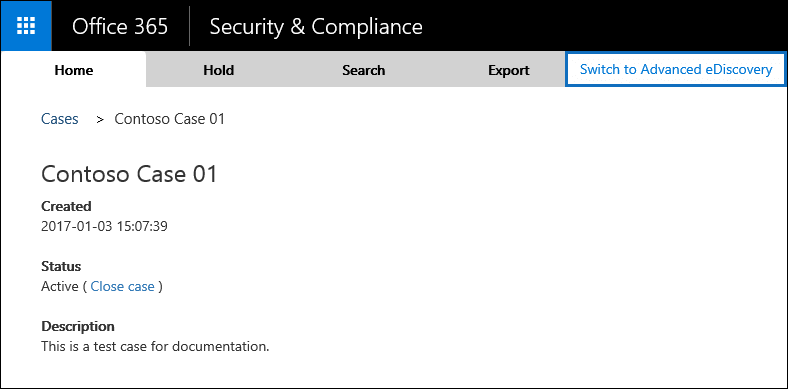

# <a name="manage-ediscovery-cases-in-the-office-365-security-amp-compliance-center"></a><span data-ttu-id="8bccb-103">Verwalten von eDiscovery-Fälle in die Office 365-Sicherheit &amp; Compliance Center</span><span class="sxs-lookup"><span data-stu-id="8bccb-103">Manage eDiscovery cases in the Office 365 Security &amp; Compliance Center</span></span>

<span data-ttu-id="8bccb-p101">Sie können die eDiscovery-Fälle verwenden, in die Office 365-Sicherheit &amp; Compliance Center steuern, wer erstellen, Zugriff und eDiscovery-Fälle in Ihrer Organisation verwalten können. Wenn Ihre Organisation ein E5 für Office 365-Abonnement umfasst, können Sie auch eDiscovery-Fälle zum Analysieren von Suchergebnissen mithilfe von Office 365 erweiterte eDiscovery verwenden.</span><span class="sxs-lookup"><span data-stu-id="8bccb-p101">You can use eDiscovery cases in the Office 365 Security &amp; Compliance Center to control who can create, access, and manage eDiscovery cases in your organization. If your organization has an Office 365 E5 subscription, you can also use eDiscovery cases to analyze search results by using Office 365 Advanced eDiscovery.</span></span>
  
<span data-ttu-id="8bccb-p102">EDiscovery-Fall können Sie zum Hinzufügen von Mitgliedern zu einer Anfrage, die steuern, welche Arten von Aktionen, dass bestimmte Groß-/Kleinschreibung Mitglieder durchführen, platzieren Sie einen Haltestatus auf Speicherorte für Inhalte in eine rechtliche Anfrage relevant und ordnen Sie einen einzelnen Case mehrere Inhalten suchen können. Sie können auch Exportieren der Suchergebnisse in Content, die eine Anfrage zugeordnet ist oder Vorbereiten von Suchergebnissen für die Analyse in erweiterten eDiscovery. eDiscovery-Fälle sind eine empfehlenswerte Methode zum einschränken, wer Zugriff auf Content-Suche und die Suchergebnisse für eine bestimmte rechtliche Anfrage in Ihrer Organisation hat.</span><span class="sxs-lookup"><span data-stu-id="8bccb-p102">An eDiscovery case allows you to add members to a case, control what types of actions that specific case members can perform, place a hold on content locations relevant to a legal case, and associate multiple Content Searches with a single case. You can also export the results of any Content Search that is associated with a case or prepare search results for analysis in Advanced eDiscovery. eDiscovery cases are a good way to limit who has access to Content Searches and search results for a specific legal case in your organization.</span></span>
  
<span data-ttu-id="8bccb-109">Verwenden Sie den folgenden Workflow zum Einrichten und Verwenden von eDiscovery-Fälle in das Wertpapier &amp; eDiscovery Compliance Center und erweitert.</span><span class="sxs-lookup"><span data-stu-id="8bccb-109">Use the following workflow to set up and use eDiscovery cases in the Security &amp; Compliance Center and Advanced eDiscovery.</span></span>
  
[<span data-ttu-id="8bccb-110">Schritt 1: Zuweisen von eDiscovery-Berechtigungen zu potenziellen Fallmitgliedern</span><span class="sxs-lookup"><span data-stu-id="8bccb-110">Step 1: Assign eDiscovery permissions to potential case members</span></span>](manage-ediscovery-cases.md#step1_1)
  
[<span data-ttu-id="8bccb-111">Schritt 2: Erstellen einer neuen Anfrage</span><span class="sxs-lookup"><span data-stu-id="8bccb-111">Step 2: Create a new case</span></span>](manage-ediscovery-cases.md#step2_1)
  
[<span data-ttu-id="8bccb-112">Schritt 3: Hinzufügen von Mitgliedern zu einer Anfrage</span><span class="sxs-lookup"><span data-stu-id="8bccb-112">Step 3: Add members to a case</span></span>](manage-ediscovery-cases.md#step2a_1)
  
[<span data-ttu-id="8bccb-113">Schritt 4: Platzieren Speicherorte für Inhalte auf</span><span class="sxs-lookup"><span data-stu-id="8bccb-113">Step 4: Place content locations on hold</span></span>](manage-ediscovery-cases.md#step3_1)
  
[<span data-ttu-id="8bccb-114">Schritt 5: Erstellen Sie und führen Sie einer eine Anfrage zugeordnete Inhaltssuche aus</span><span class="sxs-lookup"><span data-stu-id="8bccb-114">Step 5: Create and run a Content Search associated with a case</span></span>](manage-ediscovery-cases.md#step4_1)
  
[<span data-ttu-id="8bccb-115">Schritt 6: Exportieren Sie die Ergebnisse einer Inhaltssuche eine Anfrage zugeordnete</span><span class="sxs-lookup"><span data-stu-id="8bccb-115">Step 6: Export the results of a Content Search associated with a case</span></span>](manage-ediscovery-cases.md#step5_1)
  
[<span data-ttu-id="8bccb-116">Schritt 7: Vorbereiten der Suchergebnisse für erweiterte eDiscovery</span><span class="sxs-lookup"><span data-stu-id="8bccb-116">Step 7: Prepare search results for Advanced eDiscovery</span></span>](manage-ediscovery-cases.md#step7_1)
  
[<span data-ttu-id="8bccb-117">Schritt 8: Wechseln Sie zu der erweiterten eDiscovery-Fall</span><span class="sxs-lookup"><span data-stu-id="8bccb-117">Step 8: Go to the case in Advanced eDiscovery</span></span>](manage-ediscovery-cases.md#gotoAeD_1)
  
[<span data-ttu-id="8bccb-118">(Optional) Schritt 9: Schließen Sie eine Anfrage</span><span class="sxs-lookup"><span data-stu-id="8bccb-118">(Optional) Step 9: Close a case</span></span>](manage-ediscovery-cases.md#closecase_1)
  
[<span data-ttu-id="8bccb-119">(Optional) Schritt 10: Eine geschlossene Anfrage erneut öffnen</span><span class="sxs-lookup"><span data-stu-id="8bccb-119">(Optional) Step 10: Re-open a closed case</span></span>](manage-ediscovery-cases.md#reopencase_1)
  
[<span data-ttu-id="8bccb-120">Weitere Informationen</span><span class="sxs-lookup"><span data-stu-id="8bccb-120">More information</span></span>](manage-ediscovery-cases.md#moreinfo_1)
  
## <a name="step-1-assign-ediscovery-permissions-to-potential-case-members"></a><span data-ttu-id="8bccb-121">Schritt 1: Zuweisen von eDiscovery-Berechtigungen zu potenziellen Fallmitgliedern</span><span class="sxs-lookup"><span data-stu-id="8bccb-121">Step 1: Assign eDiscovery permissions to potential case members</span></span>
<span data-ttu-id="8bccb-122"><a name="step1_1"> </a></span><span class="sxs-lookup"><span data-stu-id="8bccb-122"></span></span>

<span data-ttu-id="8bccb-p103">Der erste Schritt besteht die entsprechenden Berechtigungen eDiscovery-bezogene an Personen zuweisen, damit Sie sie zu einem eDiscovery-Fall in Schritt2 hinzufügen können. Sie müssen ein Mitglied der Rollengruppe "Organisationsverwaltung" (oder die Verwaltungsrolle Rolle zugewiesen werden) in die Office 365-Sicherheit &amp; Compliance Center, eDiscovery-Berechtigungen zuzuweisen. Die folgende Liste beschreibt die eDiscovery-bezogene Rollengruppen in das Wertpapier &amp; Compliance Center.</span><span class="sxs-lookup"><span data-stu-id="8bccb-p103">The first step is to assign the appropriate eDiscovery-related permissions to people so you can add them to an eDiscovery case in Step 2. You have to be a member of the Organization Management role group (or be assigned the Role Management role) in the Office 365 Security &amp; Compliance Center to assign eDiscovery permissions. The following list describes the eDiscovery-related role groups in the Security &amp; Compliance Center.</span></span>
  
- <span data-ttu-id="8bccb-p104">**Prüfer** Dieser Rollengruppe hat die restriktivsten eDiscovery-bezogene Berechtigungen. Mitglieder dieser Gruppe können nur finden und öffnen Sie die Liste der auf der Seite **eDiscovery** -Fälle in das Wertpapier &amp; Compliance Center, die sie Mitglieder sind. Hinzufügen von Mitgliedern zu einer Anfrage Fällen erstellt werden kann, Haltestatus erstellen, erstellen Sie gesucht, Exportieren von Suchergebnissen oder Ergebnisse für erweiterte eDiscovery vorbereiten. Mitglieder können jedoch Fällen in erweiterten eDiscovery Analysis Aufgaben zugreifen.</span><span class="sxs-lookup"><span data-stu-id="8bccb-p104">**Reviewer**This role group has the most restrictive eDiscovery-related permissions. Members of this group can only see and open the list of the cases on the **eDiscovery** page in the Security &amp; Compliance Center that they are members of. They can't create cases, add members to a case, create holds, create searches, export search results, or prepare results for Advanced eDiscovery. However, members can access cases in Advanced eDiscovery to perform analysis tasks.</span></span> 
    
- <span data-ttu-id="8bccb-p105">**eDiscovery-Manager** Mitglieder dieser Rollengruppe können erstellen und Verwalten von eDiscovery-Fälle. Sie können hinzufügen und Entfernen von Mitgliedern, platzieren Sie Inhalte Speicherorte auf halten, erstellen und bearbeiten eine Anfrage zugeordnete Inhalte durchsucht, exportieren Sie die Ergebnisse einer Suche Inhalte und Vorbereiten von Suchergebnissen für die Analyse in erweiterten eDiscovery. Es gibt zwei Untergruppen in dieser Rollengruppe. Der Unterschied zwischen diesen Untergruppen basiert auf Bereich.</span><span class="sxs-lookup"><span data-stu-id="8bccb-p105">**eDiscovery Manager**Members of this role group can create and manage eDiscovery cases. They can add and remove members, place content locations on hold, create and edit Content Searches associated with a case, export the results of a Content Search, and prepare search results for analysis in Advanced eDiscovery. There are two sub-groups in this role group. The difference between these subgroups is based on scope.</span></span>
    
  - <span data-ttu-id="8bccb-p106">**eDiscovery-Manager** Anzeigen und verwalten sie erstellen oder ein Mitglied der eDiscovery-Fälle. Eine andere eDiscovery-Manager erstellt eine Anfrage, jedoch keine zweite eDiscovery-Manager als Mitglied in diesem Fall hinzufügen, die zweite eDiscovery-Manager nicht möglich, anzeigen oder öffnen die Groß-/Kleinschreibung auf der Seite **eDiscovery** in das Wertpapier &amp; Compliance Center. eDiscovery-Manager kann auch ihre Fällen in erweiterten eDiscovery Analysis Aufgaben zugreifen.</span><span class="sxs-lookup"><span data-stu-id="8bccb-p106">**eDiscovery Manager**Can view and manage the eDiscovery cases they create or are a member of. If another eDiscovery Manager creates a case but doesn't add a second eDiscovery Manager as a member of that case, the second eDiscovery Manager won't be able to view or open the case on the **eDiscovery** page in the Security &amp; Compliance Center. eDiscovery Managers can also access their cases in Advanced eDiscovery to perform analysis tasks.</span></span> 
    
  - <span data-ttu-id="8bccb-p107">**eDiscovery-Administrator** Kann alle Fallmanagement Aufgaben, bei denen eine eDiscovery-Manager tun kann. Darüber hinaus können eine eDiscovery-Administrator:</span><span class="sxs-lookup"><span data-stu-id="8bccb-p107">**eDiscovery Administrator**Can perform all case management tasks that an eDiscovery Manager can do. Additionally, an eDiscovery Administrator can:</span></span>
    
  - <span data-ttu-id="8bccb-139">Anzeigen aller Fälle, die auf der Seite **eDiscovery-Fälle** aufgeführt sind.</span><span class="sxs-lookup"><span data-stu-id="8bccb-139">View all cases that are listed on the **eDiscovery** page.</span></span> 
    
  - <span data-ttu-id="8bccb-140">Verwaltet alle eDiscovery-Fall in der Organisation werden, nachdem sie sich als Mitglied der Groß-/Kleinschreibung hinzufügen.</span><span class="sxs-lookup"><span data-stu-id="8bccb-140">Manage any eDiscovery case in the organization after they add themself as a member of the case.</span></span>
    
  - <span data-ttu-id="8bccb-p108">Ausführen von Verwaltungsaufgaben in erweiterten eDiscovery, wie Verarbeiten von Groß-/Kleinschreibung Daten zur Analyse, Konfigurieren von Groß-/Kleinschreibung und Exportieren von Daten aus der erweiterten eDiscovery. Dies ist, da eine Person einer eDiscovery-Administrator in das Wertpapier &amp; Compliance Center wird automatisch als Administrator in erweiterten eDiscovery hinzugefügt.</span><span class="sxs-lookup"><span data-stu-id="8bccb-p108">Perform administrative tasks in Advanced eDiscovery, such as processing case data for analysis, configuring case settings, and exporting data from Advanced eDiscovery. This is because a person who is an eDiscovery Administrator in the Security &amp; Compliance Center is automatically added as an administrator in Advanced eDiscovery.</span></span>
    
    <span data-ttu-id="8bccb-143">Überlegungen dazu, warum Sie ggf. einen eDiscovery-Administrator in Ihrer Organisation benötigen, finden Sie im Abschnitt [More information](manage-ediscovery-cases.md#moreinfo_1).</span><span class="sxs-lookup"><span data-stu-id="8bccb-143">See the [More information](manage-ediscovery-cases.md#moreinfo_1) section for reasons why you may want an eDiscovery Administrator in your organization.</span></span> 
    
> [!IMPORTANT]
> <span data-ttu-id="8bccb-144">Wenn eine Person kein Mitglied einer dieser eDiscovery-bezogene Rollengruppen ist oder ist kein Mitglied einer Rollengruppe, die die Prüfer-Rolle zugewiesen hat, können nicht Sie sie als Mitglied einer eDiscovery-Fall hinzufügen.</span><span class="sxs-lookup"><span data-stu-id="8bccb-144">If a person isn't a member of one of these eDiscovery-related role groups, or isn't a member of a role group that's assigned the Reviewer role, you can't add them as a member of an eDiscovery case.</span></span> 
  
 <span data-ttu-id="8bccb-145">**So weisen Sie eDiscovery-Berechtigungen zu**</span><span class="sxs-lookup"><span data-stu-id="8bccb-145">**To assign eDiscovery permissions:**</span></span>
  
1. <span data-ttu-id="8bccb-146">Wechseln Sie zu [https://protection.office.com](https://protection.office.com).</span><span class="sxs-lookup"><span data-stu-id="8bccb-146">Go to [https://protection.office.com](https://protection.office.com).</span></span>
    
2. <span data-ttu-id="8bccb-147">Melden Sie sich bei Office 365 mit Ihrem Geschäfts-, Schul- oder Unikonto an.</span><span class="sxs-lookup"><span data-stu-id="8bccb-147">Sign in to Office 365 using your work or school account.</span></span>
    
3. <span data-ttu-id="8bccb-148">In das Wertpapier &amp; Compliance Center, klicken Sie auf **Berechtigungen**, und führen Sie dann eine der folgenden basierend auf den eDiscovery-Berechtigungen, die Sie zuweisen möchten.</span><span class="sxs-lookup"><span data-stu-id="8bccb-148">In the Security &amp; Compliance Center, click **Permissions**, and then do one of the following based on the eDiscovery permissions that you want to assign.</span></span>
    
  - <span data-ttu-id="8bccb-p109">Leseberechtigungen zuweisen, indem Sie wählen Sie aus der Rollengruppe " **Reviewer** ", und klicken Sie dann neben **Mitglieder** auf **Bearbeiten**. Klicken Sie auf **Elemente auswählen**, klicken Sie auf  **Hinzufügen** , wählen Sie den Benutzer, die Sie an der Rollengruppe Reviewer hinzufügen möchten, und klicken Sie dann auf **Hinzufügen**.</span><span class="sxs-lookup"><span data-stu-id="8bccb-p109">To assign Reviewer permissions, select the **Reviewer** role group, and then next to **Members** click **Edit**. Click **Choose members**, click  **Add** select the user that you want to add to the Reviewer role group, and then click **Add**.</span></span>
    
  - <span data-ttu-id="8bccb-p110">EDiscovery-Manager-Berechtigungen zuweisen, indem Sie wählen Sie aus der Rollengruppe **eDiscovery-Manager** , und klicken Sie neben **eDiscovery-Manager**, klicken Sie dann auf **Bearbeiten**. Klicken Sie auf **auswählen, eDiscovery-Manager**, klicken Sie auf  \*\* hinzufügen \*\*, wählen Sie den Benutzer, die Sie als ein eDiscovery-Manager hinzufügen möchten, und klicken Sie dann auf **Hinzufügen**.</span><span class="sxs-lookup"><span data-stu-id="8bccb-p110">To assign eDiscovery Manager permissions, select the **eDiscovery Manager** role group, and then next to **eDiscovery Manager**, click **Edit**. Click **Choose eDiscovery Manager**, click  \*\* Add \*\*, select the user that you want to add as an eDiscovery Manager, and then click **Add**.</span></span>
    
  - <span data-ttu-id="8bccb-p111">EDiscovery-Administratorberechtigungen zuweisen, indem Sie wählen Sie aus der Rollengruppe **eDiscovery-Manager** , und klicken Sie neben **eDiscovery-Administrator**, klicken Sie dann auf **Bearbeiten**. Klicken Sie auf **Choose eDiscovery-Administrator**, klicken Sie auf  **Hinzufügen**, wählen Sie den Benutzer, die Sie als einer eDiscovery-Administrator hinzufügen möchten, und klicken Sie dann auf **Hinzufügen**.</span><span class="sxs-lookup"><span data-stu-id="8bccb-p111">To assign eDiscovery Administrator permissions, select the **eDiscovery Manager** role group, and then next to **eDiscovery Administrator**, click **Edit**. Click **Choose eDiscovery Administrator**, click  **Add**, select the user that you want to add as an eDiscovery Administrator, and then click **Add**.</span></span>
    
4. <span data-ttu-id="8bccb-155">Nachdem Sie alle Benutzer hinzugefügt haben, klicken Sie auf **Fertig**, klicken Sie auf **Speichern** , um die Änderungen an der Rollengruppe zu speichern, und klicken Sie dann auf **Schließen**.</span><span class="sxs-lookup"><span data-stu-id="8bccb-155">After you've added all the users, click **Done**, click **Save** to save the changes to the role group, and then click **Close**.</span></span>
    

  
## <a name="step-2-create-a-new-case"></a><span data-ttu-id="8bccb-156">Schritt 2: Erstellen einer neuen Anfrage</span><span class="sxs-lookup"><span data-stu-id="8bccb-156">Step 2: Create a new case</span></span>
<span data-ttu-id="8bccb-157"><a name="step2_1"> </a></span><span class="sxs-lookup"><span data-stu-id="8bccb-157"></span></span>

<span data-ttu-id="8bccb-p112">Im nächste Schritt ist erstellen Sie einen neue eDiscovery-Fall. Sie müssen ein Mitglied der Rollengruppe eDiscovery-Manager zum Erstellen von eDiscovery-Fälle sein. Wie bereits erläutert, nach dem Erstellen eines neuen Vorgangs in das Wertpapier &amp; Compliance Center, Sie (und Mitgliedern der Groß-/Kleinschreibung) sein, dass dieselbe Groß-/Kleinschreibung im erweiterten eDiscovery, wenn Sie die Organisation sind ein Abonnement von Office 365 E5 hat zugreifen können.</span><span class="sxs-lookup"><span data-stu-id="8bccb-p112">The next step is to create a new eDiscovery case. You must be a member of the eDiscovery Managers role group to create eDiscovery cases. As previously explained, after you create a new case in the Security &amp; Compliance Center, you (and other case members) will be able to access that same case in Advanced eDiscovery if you're organization has an Office 365 E5 subscription.</span></span>
  
1. <span data-ttu-id="8bccb-161">Wechseln Sie zu [https://protection.office.com](https://protection.office.com).</span><span class="sxs-lookup"><span data-stu-id="8bccb-161">Go to [https://protection.office.com](https://protection.office.com).</span></span>
    
2. <span data-ttu-id="8bccb-162">Melden Sie sich bei Office 365 mit Ihrem Geschäfts-, Schul- oder Unikonto an.</span><span class="sxs-lookup"><span data-stu-id="8bccb-162">Sign in to Office 365 using your work or school account.</span></span>
    
3. <span data-ttu-id="8bccb-163">In das Wertpapier &amp; Compliance Center, klicken Sie auf **Suche &amp; Untersuchung** \> **eDiscovery**, und klicken Sie dann auf  **Erstellen einer Anfrage**.</span><span class="sxs-lookup"><span data-stu-id="8bccb-163">In the Security &amp; Compliance Center, click **Search &amp; investigation** \> **eDiscovery**, and then click  **Create a case**.</span></span>
    
4. <span data-ttu-id="8bccb-p113">Benennen Sie auf der Seite **Neue Anfrage** der Groß-/Kleinschreibung, geben Sie eine optionale Beschreibung ein, und klicken Sie dann auf **Speichern**. Beachten Sie, dass die Groß-/Kleinschreibung Name in Ihrer Organisation eindeutig sein muss.</span><span class="sxs-lookup"><span data-stu-id="8bccb-p113">On the **New Case** page, give the case a name, type an optional description, and then click **Save**. Note that the case name must be unique in your organization.</span></span>
    
    
  
    <span data-ttu-id="8bccb-p114">Die neue Groß-/Kleinschreibung wird in der Liste der Anfragen auf der Seite **eDiscovery** angezeigt. Beachten Sie, dass Sie den Cursor über einen Groß-/Kleinschreibung Namen zum Anzeigen von Informationen über die Groß-/Kleinschreibung, einschließlich des Status der Anfrage ( **aktiv** oder **geschlossen**), bewegen können die Beschreibung der die Groß-/Kleinschreibung (die im vorherigen Schritt erstellt wurde), und wenn die Groß-/Kleinschreibung zuletzt geändert wurde und Wer es geändert.</span><span class="sxs-lookup"><span data-stu-id="8bccb-p114">The new case is displayed in the list of cases on the **eDiscovery** page. Note that you can hover the cursor over a case name to display information about the case, including the status of the case ( **Active** or **Closed**), the description of the case (that was created in the previous step), and when the case was changed last and who changed it.</span></span>
    
    > [!TIP]
    > <span data-ttu-id="8bccb-p115">Nachdem Sie einen neuen Vorgang erstellen, können Sie sie jederzeit umbenennen. Klicken Sie einfach auf den Namen der Anfrage auf der Seite **eDiscovery** . Klicken Sie auf der Seite flyoutmenü **Verwalten in diesem Fall** ändern Sie den Namen in das Feld unter **Name**angezeigt, und speichern Sie die Änderung.</span><span class="sxs-lookup"><span data-stu-id="8bccb-p115">After you create a new case, you can rename it anytime. Just click the name of the case on the **eDiscovery** page. On the **Manage this case** flyout page, change the name displayed in the box under **Name**, and then save the change.</span></span> 
  
## <a name="step-3-add-members-to-a-case"></a><span data-ttu-id="8bccb-172">Schritt 3: Hinzufügen von Mitgliedern zu einer Anfrage</span><span class="sxs-lookup"><span data-stu-id="8bccb-172">Step 3: Add members to a case</span></span>
<span data-ttu-id="8bccb-173"><a name="step2a_1"> </a></span><span class="sxs-lookup"><span data-stu-id="8bccb-173"></span></span>

<span data-ttu-id="8bccb-p116">Nachdem Sie eine neue Anfrage erstellt haben, besteht der nächste Schritt, um die Groß-/Kleinschreibung Mitglieder hinzuzufügen. Wie vorherige erläutert, nur Benutzer, die Mitglieder des Bearbeiters sind oder eDiscovery-Manager Rollengruppen hinzugefügt werden können, als Mitglied der Groß-/Kleinschreibung. Beachten Sie, dass die eDiscovery-Manager, die die Groß-/Kleinschreibung erstellt automatisch als Mitglied hinzugefügt wird.</span><span class="sxs-lookup"><span data-stu-id="8bccb-p116">After you create a new case, the next step is to add members to the case. As previous explained, only users that are members of the Reviewer or eDiscovery Manager role groups can be added as a member of the case. Note that the eDiscovery Manager who created the case is automatically added as a member.</span></span>
  
1. <span data-ttu-id="8bccb-177">Klicken Sie im Security &amp; Compliance Center auf **Suche &amp; Untersuchung** \> **eDiscovery**, um die Liste der Fälle in Ihrem Unternehmen anzuzeigen.</span><span class="sxs-lookup"><span data-stu-id="8bccb-177">In the Security &amp; Compliance Center, click **Search &amp; investigation** \> **eDiscovery** to display the list of cases in your organization.</span></span> 
    
2. <span data-ttu-id="8bccb-178">Klicken Sie auf den Namen der Anfrage, der Sie Mitglieder hinzufügen möchten.</span><span class="sxs-lookup"><span data-stu-id="8bccb-178">Click the name of the case that you want to add members to.</span></span>
    
    <span data-ttu-id="8bccb-179">Seite flyoutmenü **Verwalten in diesem Fall** wird angezeigt.</span><span class="sxs-lookup"><span data-stu-id="8bccb-179">The **Manage this case** flyout page is displayed.</span></span> 
    
    
  
3. <span data-ttu-id="8bccb-181">Klicken Sie unter **Manage Mitglieder**, klicken Sie auf  **Hinzufügen** , um die Groß-/Kleinschreibung Mitglieder hinzuzufügen.</span><span class="sxs-lookup"><span data-stu-id="8bccb-181">Under **Manage members**, click  **Add** to add members to the case.</span></span> 
    
4. <span data-ttu-id="8bccb-182">Aktivieren Sie in der Liste der Personen, die als Mitglied der Groß-/Kleinschreibung hinzugefügt werden können das Kontrollkästchen neben dem Namen der Personen ein, den, die Sie der Anfrage hinzufügen möchten.</span><span class="sxs-lookup"><span data-stu-id="8bccb-182">In the list of people who can be added as a member of the case, click the checkbox next to the name of the people you want to add to the case.</span></span>
    
    > [!TIP]
    > <span data-ttu-id="8bccb-183">Wenn Sie haben eine umfangreiche Liste mit Personen, die Sie als Mitglieder hinzugefügt werden, verwenden Sie das Feld **Suchen** nach einer bestimmten Person in der Liste suchen.</span><span class="sxs-lookup"><span data-stu-id="8bccb-183">If you have a large list of people who can added as members, use the **Search** box to search for a specific person in the list.</span></span> 
  
5. <span data-ttu-id="8bccb-184">Nachdem Sie die Personen als Mitglieder der Gruppe hinzufügen ausgewählt haben, klicken Sie auf **Hinzufügen**.</span><span class="sxs-lookup"><span data-stu-id="8bccb-184">After you've selected the people to add as members of the group, click **Add**.</span></span>
    
    <span data-ttu-id="8bccb-185">Klicken Sie in **diesem Fall verwalten**auf **Speichern** , um die neue Liste der Groß-/Kleinschreibung Elemente zu speichern.</span><span class="sxs-lookup"><span data-stu-id="8bccb-185">In **Manage this case**, click **Save** to save the new list of case members.</span></span> 
    
6. <span data-ttu-id="8bccb-186">Klicken Sie auf **Speichern** , um die neue Liste der Groß-/Kleinschreibung Elemente zu speichern.</span><span class="sxs-lookup"><span data-stu-id="8bccb-186">Click **Save** to save the new list of case members.</span></span> 
  
## <a name="step-4-place-content-locations-on-hold"></a><span data-ttu-id="8bccb-187">Schritt 4: Platzieren Speicherorte für Inhalte auf</span><span class="sxs-lookup"><span data-stu-id="8bccb-187">Step 4: Place content locations on hold</span></span>
<span data-ttu-id="8bccb-188"><a name="step3_1"> </a></span><span class="sxs-lookup"><span data-stu-id="8bccb-188"></span></span>

<span data-ttu-id="8bccb-p117">EDiscovery-Fall können zum Erstellen von Haltestatus, um Inhalte zu erhalten, die für die Groß-/Kleinschreibung relevant sein könnten. Sie können einen Haltestatus auf Postfächer und OneDrive für Websites mit Geschäftsdaten von Personen tätigen, die in der Groß-/Kleinschreibung Verwalter sind. Sie können auch einen Haltestatus auf die Gruppe Postfach-, SharePoint-Website und OneDrive for Business-Site für eine Office 365-Gruppe platzieren. In ähnlicher Weise können Sie einen Haltestatus platzieren, auf das Postfach und die Website, die Microsoft-Teams zugeordnet sind. Wenn Sie die Speicherorte für Inhalte in der Warteschleife einleiten, wird Inhalt gespeichert, bis aus der Inhaltsspeicherort oder, bis Sie den Haltestatus löschen, entfernen den Haltestatus.</span><span class="sxs-lookup"><span data-stu-id="8bccb-p117">You can use an eDiscovery case to create holds to preserve content that might be relevant to the case. You can place a hold on the mailboxes and OneDrive for Business sites of people who are custodians in the case. You can also place a hold on the group mailbox, SharePoint site, and OneDrive for Business site for an Office 365 Group. Similarly, you can place a hold on the mailbox and site that are associated with Microsoft Teams. When you place content locations on hold, content is held until you remove the hold from the content location or until you delete the hold.</span></span>
  
<span data-ttu-id="8bccb-194">Wenn Sie einen Haltestatus erstellen, müssen Sie die folgenden Optionen aus, um den Inhalt zu begrenzen, der in der angegebenen Speicherorte für Inhalte gehalten wird:</span><span class="sxs-lookup"><span data-stu-id="8bccb-194">When you create a hold, you have the following options to scope the content that is held in the specified content locations:</span></span>
  
- <span data-ttu-id="8bccb-p118">Sie erstellen eine unendliche halten, in dem alle Inhalte in der Warteschleife platziert wird. Alternativ können Sie eine abfragebasierte Aufbewahrung erstellen, in dem nur auf Inhalte, die eine Suchabfrage entspricht in der Warteschleife platziert wird.</span><span class="sxs-lookup"><span data-stu-id="8bccb-p118">You create an infinite hold where all content is placed on hold. Alternatively, you can create a query-based hold where only content that matches a search query is placed on hold.</span></span>
    
- <span data-ttu-id="8bccb-p119">Sie können angeben, einen Datumsbereich nur die Inhalte enthalten, die gesendet, empfangen oder innerhalb des Datumsbereichs erstellt wurde. Alternativ können Sie alle Inhalte unabhängig davon Wenn es gesendet, empfangen oder erstellt wurde, halten.</span><span class="sxs-lookup"><span data-stu-id="8bccb-p119">You can specify a date range to hold only the content that was sent, received, or created within that date range. Alternatively, you can hold all content regardless of when it was sent, received, or created.</span></span>
    
> [!NOTE]
> <span data-ttu-id="8bccb-199">Sie können maximal 10.000 Richtlinien halten Sie über alle eDiscovery-Fälle in Ihrer Organisation haben.</span><span class="sxs-lookup"><span data-stu-id="8bccb-199">You can have a maximum of 10,000 hold policies across all eDiscovery cases in your organization.</span></span> 
  
<span data-ttu-id="8bccb-200">Zum Erstellen eines Haltestatus für einen eDiscovery-Fall:</span><span class="sxs-lookup"><span data-stu-id="8bccb-200">To create a hold for an eDiscovery case:</span></span>
  
1. <span data-ttu-id="8bccb-201">Klicken Sie im Security &amp; Compliance Center auf **Suche &amp; Untersuchung** \> **eDiscovery**, um die Liste der Fälle in Ihrem Unternehmen anzuzeigen.</span><span class="sxs-lookup"><span data-stu-id="8bccb-201">In the Security &amp; Compliance Center, click **Search &amp; investigation** \> **eDiscovery** to display the list of cases in your organization.</span></span> 
    
2. <span data-ttu-id="8bccb-202">Klicken Sie auf **Öffnen** neben der Groß-/Kleinschreibung, die Sie dem Haltestatus in erstellen möchten.</span><span class="sxs-lookup"><span data-stu-id="8bccb-202">Click **Open** next to the case that you want to create the holds in.</span></span> 
    
3. <span data-ttu-id="8bccb-203">Klicken Sie auf **der Homepage für den Fall** auf **halten**.</span><span class="sxs-lookup"><span data-stu-id="8bccb-203">On the **Home** page for the case, click **Hold**.</span></span>
    
    
  
4. <span data-ttu-id="8bccb-205">Klicken Sie auf der Seite **halten** **New**.</span><span class="sxs-lookup"><span data-stu-id="8bccb-205">On the **Hold** page, click **New**.</span></span>
    
5. <span data-ttu-id="8bccb-p120">Benennen Sie auf der Seite **erstellen einen neuen Haltestatus** dem Haltestatus. Der Name des Haltestatus muss in Ihrer Organisation eindeutig sein.</span><span class="sxs-lookup"><span data-stu-id="8bccb-p120">On the **Create a new hold** page, give the hold a name. The name of the hold must be unique in your organization.</span></span> 
    
6. <span data-ttu-id="8bccb-p121">Wählen Sie halten Sie die Speicherorte für Inhalte, denen Sie einfügen möchten. Sie können die Postfächer, Websites und Öffentliche Ordner in der Warteschleife platzieren.</span><span class="sxs-lookup"><span data-stu-id="8bccb-p121">Choose the content locations that you want to place on hold. You can place mailboxes, sites, and public folders on hold.</span></span>
    
    
  
1. <span data-ttu-id="8bccb-p122">**Postfächer** Klicken Sie auf **Hinzufügen** an Postfächer in der Warteschleife platziert. Verwenden Sie das Suchfeld, um die Benutzerpostfächer und Verteilergruppen (in einem Haltestatus auf die Postfächer von Gruppenmitgliedern platzieren) Hier finden Sie in der Warteschleife platziert. Sie können auch einen Haltestatus auf das zugeordnete Postfach für eine Office 365-Gruppe oder ein Team Microsoft platzieren.</span><span class="sxs-lookup"><span data-stu-id="8bccb-p122">**Mailboxes** Click **Add** to specify mailboxes to place on hold. Use the search box to find user mailboxes and distribution groups (to place a hold on the mailboxes of group members) to place on hold. You can also place a hold on the associated mailbox for an Office 365 Group or a Microsoft Team.</span></span> 
    
    > [!NOTE]
    > <span data-ttu-id="8bccb-p123">Wenn Sie auf **Hinzufügen klicken** Postfächer im Archiv zu platzieren Sie zum angeben die Postfach-Auswahl, die angezeigt wird leer ist. Dies ist entwurfsbedingt zur Verbesserung der Leistung. Um Personen zu dieser Liste hinzufügen möchten, geben Sie einen Namen (mindestens 3 Zeichen) in das Suchfeld, und klicken Sie auf **Suche**.</span><span class="sxs-lookup"><span data-stu-id="8bccb-p123">When you click **Add** to specify mailboxes to place on hold, the mailbox picker that's displayed is empty. This is by design to enhance performance. To add people to this list, type a name (a minimum of 3 characters) in the search box and click **Search**.</span></span> 
  
2. <span data-ttu-id="8bccb-p124">**Websites** Klicken Sie auf **Hinzufügen** an SharePoint und OneDrive for Business-Websites in der Warteschleife platziert. Geben Sie die URL für die einzelnen Standorte, die Sie in die Warteschleife stellen möchten. Sie können auch die URL für die SharePoint-Website für eine Office 365-Gruppe oder einem Microsoft-Team hinzufügen.</span><span class="sxs-lookup"><span data-stu-id="8bccb-p124">**Sites** Click **Add** to specify SharePoint and OneDrive for Business sites to place on hold. Type the URL for each site that you want to place on hold. You can also add the URL for the SharePoint site for an Office 365 Group or a Microsoft Team.</span></span> 
    
    <span data-ttu-id="8bccb-220">Finden Sie [Weitere Informationen](https://support.office.com/article/edea80d6-20a7-40fb-b8c4-5e8c8395f6da.aspx#moreinfo_1) im Abschnitt Tipps zum Bereitstellen von Office 365-Gruppen und Microsoft-Teams, in der Warteschleife an.</span><span class="sxs-lookup"><span data-stu-id="8bccb-220">See the [More information](https://support.office.com/article/edea80d6-20a7-40fb-b8c4-5e8c8395f6da.aspx#moreinfo_1) section for tips on putting Office 365 Groups and Microsoft Teams on hold.</span></span> 
    
    > [!NOTE]
    > <span data-ttu-id="8bccb-p125">In seltenen Fällen einer Person für Benutzerprinzipalnamen (UPN) geändert wird wird die URL für ihr Konto OneDrive auch geändert werden, um den neuen UPN einzubinden. In diesem Fall müssen Sie den Haltestatus zu ändern, indem Sie neue OneDrive-URL des Benutzers hinzufügen und Entfernen von der alte Datenbankserver.</span><span class="sxs-lookup"><span data-stu-id="8bccb-p125">In the rare case that a person's user principal name (UPN) is changed, the URL for their OneDrive account will also be changed to incorporate the new UPN. If this happens, you'll have to modify the hold by adding the user's new OneDrive URL and removing the old one.</span></span> 
  
3. <span data-ttu-id="8bccb-p126">**Öffentliche Ordner** Klicken Sie auf **alle öffentlichen Ordner halten** , um alle öffentlichen Ordner in Ihrer Exchange Online-Organisation auf Archiv zu platzieren. Notiz, die Sie bestimmte Öffentliche Ordner zu hinzufügen auswählen können nicht halten. Lassen Sie die Option **nicht halten Sie Öffentliche Ordner** ausgewählt, wenn Sie keinen Haltestatus für Öffentliche Ordner aufnehmen möchten.</span><span class="sxs-lookup"><span data-stu-id="8bccb-p126">**Public folders** Click **Hold all public folders** to put all of the public folders in your Exchange Online organization on hold. Note that you can't choose specific public folders to put on hold. Leave the **Don't hold any public folders** option selected if you don't want to put a hold on public folders.</span></span> 
    
7. <span data-ttu-id="8bccb-226">Wenn Sie dem Haltestatus hinzufügen Inhaltsspeicherorte fertig sind, klicken Sie auf **Weiter**.</span><span class="sxs-lookup"><span data-stu-id="8bccb-226">When you're done adding content locations to the hold, click **Next**.</span></span>
    
8. <span data-ttu-id="8bccb-p127">Führen Sie die folgenden Schritte aus, um eine abfragebasierte Aufbewahrung mit Bedingungen zu erstellen. Andernfalls, klicken Sie einfach auf **Fertig stellen** , um alle Inhalte enthalten.</span><span class="sxs-lookup"><span data-stu-id="8bccb-p127">To create a query-based hold with conditions, complete the following. Otherwise, just click **Finish** to hold all content.</span></span> 
    
    
  
    <span data-ttu-id="8bccb-230">Weitere Informationen zum Erstellen einer Suchabfrage und Bedingungen verwenden finden Sie unter [Stichwortabfragen und Suchkriterien für die Inhaltssuche](keyword-queries-and-search-conditions.md).</span><span class="sxs-lookup"><span data-stu-id="8bccb-230">For more information about creating a search query and using conditions, see [Keyword queries and search conditions for Content Search](keyword-queries-and-search-conditions.md).</span></span>
    
1. <span data-ttu-id="8bccb-p128">Im Feld unter **Was möchten Sie uns suchen?**, geben Sie eine Suchabfrage im, sodass nur die Inhalte, die die Suchkriterien entspricht in der Warteschleife platziert wird. Sie können Schlüsselwörter, Nachrichteneigenschaften oder Dokumenteigenschaften, wie Dateinamen angeben. Sie können auch komplexere Abfragen, die einen booleschen Operators, wie **AND**, **OR**oder **nicht**verwenden. Wenn Sie lassen halten Sie das Schlüsselwort Feld leer ist, und klicken Sie dann auf alle Inhalte befindet sich in der angegebenen Speicherorte für Inhalte platziert wird.</span><span class="sxs-lookup"><span data-stu-id="8bccb-p128">In the box under **What do you want us to look for?**, type a search query in the box so that only the content that meets the search criteria is placed on hold. You can specify keywords, message properties, or document properties, such as file names. You can also use more complex queries that use a Boolean operator, such as **AND**, **OR**, or **NOT**. If you leave the keyword box empty, then all content located in the specified content locations will be placed on hold.</span></span> 
    
2. <span data-ttu-id="8bccb-p129">Klicken Sie unter **Umständen**auf **Bedingung hinzufügen** , um eine oder mehrere Bedingungen einschränken die Suchabfrage für den Haltestatus hinzuzufügen. Jede Bedingung hinzugefügt der KQL Search-Abfrage, die erstellt und ausgeführt, wenn Sie den Haltestatus erstellen eine-Klausel. Beispielsweise können Sie einen Datumsbereich angeben, sodass e-Mail oder Website Dokumente, die in dem Bereich Datum erstellt wurden, in die Warteschleife gestellt werden. Eine Bedingung ist logisch mit der Stichwortabfrage (im Schlüsselwort angegeben) durch den **AND** -Operator verbunden. Das bedeutet, die Elemente beide erfüllen müssen halten die Stichwortabfrage und die Bedingung auf platziert werden.</span><span class="sxs-lookup"><span data-stu-id="8bccb-p129">Under **Conditions**, click **Add condition** to add one or more conditions to narrow the search query for the hold. Each condition adds a clause to the KQL search query that is created and run when you create the hold. For example you can specify a date range so that email or site documents that were created within the date ranged are placed on hold. A condition is logically connected to the keyword query (specified in the keyword box) by the **AND** operator. That means that items have to satisfy both the keyword query and the condition to be placed on hold.</span></span> 
    
9. <span data-ttu-id="8bccb-240">Halten Sie nach der Konfiguration einer abfragebasierte, und klicken Sie auf **Fertig stellen** , um den Haltestatus zu erstellen.</span><span class="sxs-lookup"><span data-stu-id="8bccb-240">After configuring a query-based hold, click **Finish** to create the hold.</span></span> 
  
### <a name="hold-statistics"></a><span data-ttu-id="8bccb-241">Halten Sie Statistiken</span><span class="sxs-lookup"><span data-stu-id="8bccb-241">Hold statistics</span></span>

<span data-ttu-id="8bccb-p130">Informationen zu den neuen Haltestatus wird nach einer gewissen im Detailbereich auf der Seite **enthält** , für die ausgewählte Warteschleife angezeigt. Hierzu gehören die Anzahl von Postfächern Websites auf halten, und halten Sie Statistiken zu den Inhalt, der auf getätigt wurde, wie die gesamte Anzahl und Größe der Elemente in der Warteschleife platziert und der letzten Ausführung den Haltestatus, die Statistik berechnet wurden. Diese Dateien enthalten Statistiken Hilfe, die Sie ermitteln, wie viel Inhalt, die auf den eDiscovery-Fall zusammenhängt gehalten wird.</span><span class="sxs-lookup"><span data-stu-id="8bccb-p130">After a while, information about the new hold is displayed in the details pane on the **Holds** page for the selected hold. This information includes the number of mailboxes and sites on hold and statistics about the content that was placed on hold, such as the total number and size of items placed on hold and the last time the hold statistics were calculated. These hold statistics help you identify how much content that's related to the eDiscovery case is being held.</span></span> 
  

  
<span data-ttu-id="8bccb-246">Beachten Sie die folgenden Punkte berücksichtigen zu halten Statistiken:</span><span class="sxs-lookup"><span data-stu-id="8bccb-246">Keep the following things in mind about hold statistics:</span></span>
  
- <span data-ttu-id="8bccb-p131">Die Gesamtzahl der Elemente in der Warteschleife gibt die Anzahl von Elementen aus allen Inhaltsquellen, die in der Warteschleife platziert werden. Wenn Sie erstellt haben halten eine abfragebasierte, diese Statistik gibt die Anzahl der Elemente an, die mit die Abfrage übereinstimmen.</span><span class="sxs-lookup"><span data-stu-id="8bccb-p131">The total number of items on hold indicates the number of items from all content sources that are placed on hold. If you've created a query-based hold, this statistic indicates the number of items that match the query.</span></span>
    
- <span data-ttu-id="8bccb-p132">Die Anzahl der Elemente in der Warteschleife enthält auch nicht indizierten Elemente in die Speicherorte für Inhalte gefunden. Beachten Sie, wenn Sie eine abfragebasierte Aufbewahrung erstellen, werden alle nicht-indizierten Elemente in die Speicherorte für Inhalte in die Warteschleife gestellt. Dazu gehören nicht indizierten Elementen, die nicht die Suchkriterien des eine abfragebasierte Aufbewahrung entsprechen und nicht-indizierten Elementen, die außerhalb von Bereich Bedingung Datum liegen möglicherweise. Dies unterscheidet sich was geschieht, wenn Sie eine Inhaltssuche ausführen, in dem nicht indizierte Elementen, die die Suchabfrage stimmen nicht überein oder durch eine Datum Bereich Bedingung ausgeschlossen werden in den Suchergebnissen enthalten sind. Weitere Informationen zu nicht indizierten Elementen finden Sie unter [nicht-indizierten Elementen in Inhaltssuche in Office 365](partially-indexed-items-in-content-search.md).</span><span class="sxs-lookup"><span data-stu-id="8bccb-p132">The number of items on hold also includes unindexed items found in the content locations. Note that if you create a query-based hold, all unindexed items in the content locations are placed on hold. This includes unindexed items that don't match the search criteria of a query-based hold and unindexed items that might fall outside of a date range condition. This is different than what happens when you run a Content Search, in which unindexed items that don't match the search query or are excluded by a date range condition aren't included in the search results. For more information about unindexed items, see [Unindexed items in Content Search in Office 365](partially-indexed-items-in-content-search.md).</span></span>
    
- <span data-ttu-id="8bccb-p133">Sie können die neuesten abrufen halten, schätzen Sie Statistiken, indem Sie auf eine Suche erneut ausführen, um **Statistiken zu aktualisieren** , die die aktuelle Anzahl von Elementen in der Warteschleife berechnet. Klicken Sie auf **Aktualisieren**, falls erforderlich, in der Symbolleiste auf die Warteschleife Statistiken im Detailbereich zu aktualisieren.</span><span class="sxs-lookup"><span data-stu-id="8bccb-p133">You can get the latest hold statistics by clicking **Update statistics** to re-run a search estimate that calculates the current number of items on hold. If necessary, click **Refresh** in the toolbar to update the hold statistics in the details pane.</span></span> 
    
- <span data-ttu-id="8bccb-256">Normal für die Anzahl der Elemente auf halten über einen Zeitraum zu erhöhen, da Benutzer, dessen Postfach oder Website in der Warteschleife ist, in der Regel senden oder Empfangen von neuen e-Mail-Nachricht und erstellen neue SharePoint- und OneDrive für Geschäftsdokumente.</span><span class="sxs-lookup"><span data-stu-id="8bccb-256">It's normal for the number of items on hold to increase over time because users whose mailbox or site is on hold are typically sending or receiving new email message and creating new SharePoint and OneDrive for Business documents.</span></span>
  
## <a name="step-5-create-and-run-a-content-search-associated-with-a-case"></a><span data-ttu-id="8bccb-257">Schritt 5: Erstellen Sie und führen Sie einer eine Anfrage zugeordnete Inhaltssuche aus</span><span class="sxs-lookup"><span data-stu-id="8bccb-257">Step 5: Create and run a Content Search associated with a case</span></span>
<span data-ttu-id="8bccb-258"><a name="step4_1"> </a></span><span class="sxs-lookup"><span data-stu-id="8bccb-258"></span></span>

<span data-ttu-id="8bccb-p134">Nach ein eDiscovery-Fall erstellt wird und alle Verwalter im Zusammenhang mit der Groß-/Kleinschreibung in die Warteschleife gestellt werden, können Sie erstellen und Ausführen von mindestens einen Content-Suche, die die Groß-/Kleinschreibung zugeordnet sind. Sucht eine Anfrage zugeordnet werden nicht angezeigt, auf **der Seite in das Wertpapier** Content &amp; Compliance Center. Dies bedeutet, die eine Anfrage Content-Suche zugeordnet kann nur von Groß-/Kleinschreibung Membern zugegriffen werden, die auch Mitglieder der Rollengruppe eDiscovery-Manager sind.</span><span class="sxs-lookup"><span data-stu-id="8bccb-p134">After an eDiscovery case is created and any custodians related to the case are placed on hold, you can create and run one or more Content Searches that are associated with the case. Content Searches associated with a case aren't listed on the **Search** page in the Security &amp; Compliance Center. This means that Content Searches associated with a case can only be accessed by case members who are also members of the eDiscovery Manager role group.</span></span> 
  
1. <span data-ttu-id="8bccb-262">Klicken Sie im Security &amp; Compliance Center auf **Suche &amp; Untersuchung** \> **eDiscovery**, um die Liste der Fälle in Ihrem Unternehmen anzuzeigen.</span><span class="sxs-lookup"><span data-stu-id="8bccb-262">In the Security &amp; Compliance Center, click **Search &amp; investigation** \> **eDiscovery** to display the list of cases in your organization.</span></span> 
    
2. <span data-ttu-id="8bccb-263">Klicken Sie neben die Groß-/Kleinschreibung, die Sie erstellen eine Inhaltssuche in möchten **Öffnen** .</span><span class="sxs-lookup"><span data-stu-id="8bccb-263">Click **Open** next to the case that you want to create a Content Search in.</span></span> 
    
3. <span data-ttu-id="8bccb-264">Klicken Sie auf **der Homepage für den Fall** auf **Suchen**.</span><span class="sxs-lookup"><span data-stu-id="8bccb-264">On the **Home** page for the case, click **Search**.</span></span>
    
    
  
4. <span data-ttu-id="8bccb-266">Klicken Sie auf der Seite **Suche** auf **neu**.</span><span class="sxs-lookup"><span data-stu-id="8bccb-266">On the **Search** page, click **New**.</span></span>
    
5. <span data-ttu-id="8bccb-p135">Geben Sie auf der Seite **neue Suche** einen Namen für die Suche ein. Content-Suche eine Anfrage zugeordnete müssen Namen aufweisen, die in Office 365-Organisation eindeutig sind.</span><span class="sxs-lookup"><span data-stu-id="8bccb-p135">On the **New search** page, type a name for the search. Content Searches associated with a case must have names that are unique within your Office 365 organization.</span></span> 
    
6. <span data-ttu-id="8bccb-p136">Wählen Sie die Speicherorte für Inhalte, die Sie suchen möchten. Sie können die Postfächer, Websites und Öffentliche Ordner in derselben Suche suchen.</span><span class="sxs-lookup"><span data-stu-id="8bccb-p136">Choose the content locations that you want to search. You can search mailboxes, sites, and public folders in the same search.</span></span>
    
    
  
1. <span data-ttu-id="8bccb-p137">**Alle Inhalte Groß-/Kleinschreibung** Wählen Sie diese Option, um alle Speicherorte für die Inhalte zu suchen, die in der Warteschleife im Fall erteilt wurden. Wenn die Groß-/Kleinschreibung mehrere enthält enthält, den Inhalt, den Speicherorten alle Haltestatus durchsucht werden, wenn Sie diese Option auswählen. Darüber hinaus wurde auf eine abfragebasierte Aufbewahrung ein Inhaltsspeicherort eingefügt, werden nur die Elemente, die in der Warteschleife sind durchsucht, wenn Sie die Inhaltssuche ausführen, die Sie in diesem Schritt erstellen. Wenn ein Benutzer abfragebasierter Groß-/Kleinschreibung gehalten wurde, die Elemente beibehält, die gesendet oder vor einem bestimmten Datum erstellt wurden, würde beispielsweise nur die Elemente durchsucht werden mithilfe von die Suchkriterien für die Inhaltssuche. Dies geschieht durch Herstellen einer Verbindung mit der Groß-/Kleinschreibung Haltestatus Abfrage und die Inhaltssuche Abfrage nach einem **AND** -Operator. Finden Sie [Weitere Informationen](manage-ediscovery-cases.md#moreinfo_1) im Abschnitt am Ende dieses Artikels ausführliche Informationen zum Suchen von Inhalten Groß-/Kleinschreibung.</span><span class="sxs-lookup"><span data-stu-id="8bccb-p137">**All case content**Select this option to search all the content locations that have been placed on hold in the case. If the case contains multiple holds, the content locations from all holds will be searched when you select this option. Additionally, if a content location was placed on a query-based hold, only the items that are on hold will be searched when you run the content search that you're creating in this step. For example, if a user was placed on query-based case hold that preserves items that were sent or created before a specific date, only those items would be searched by using the search criteria of the content search. This is accomplished by connecting the case hold query and the content search query by an **AND** operator. See the [More information](manage-ediscovery-cases.md#moreinfo_1) section at the end of this article for more details about searching case content.</span></span> 
    
2. <span data-ttu-id="8bccb-p138">**Suche überall** Wählen Sie diese Option, um alle Speicherorte für Inhalte in Ihrer Organisation zu suchen. Wenn Sie diese Option auswählen, Sie können festlegen, dass alle Exchange-Postfächer gesucht (enthält auch die Postfächer für alle Office 365-Gruppen und Microsoft-Teams), alle SharePoint und OneDrive for Business-Websites (einschließlich der Websites für alle Office 365-Gruppen und Microsoft Teams), und alle öffentlichen Ordner.</span><span class="sxs-lookup"><span data-stu-id="8bccb-p138">**Search everywhere**Select this option to search all content locations in your organization. When you select this option, you can choose to search all Exchange mailboxes (which includes the mailboxes for all Office 365 Groups and Microsoft Teams), all SharePoint and OneDrive for Business sites (which includes the sites for all Office 365 Groups and Microsoft Teams), and all public folders.</span></span>
    
3. <span data-ttu-id="8bccb-p139">**Benutzerdefinierte Position Auswahl** Wählen Sie diese Option auswählen, die Postfächer und die Websites, die Sie suchen möchten. Wenn Sie diese Option auswählen, wird die Liste der Postfächer und Websites bereits ausgefüllte, mit dem Inhalt, die die Standorte, die platziert werden innerhalb der Groß-/Kleinschreibung enthalten. Sie können auch auswählen, um alle öffentlichen Ordner in Ihrer Organisation zu suchen.</span><span class="sxs-lookup"><span data-stu-id="8bccb-p139">**Custom location selection**Select this option to select the mailboxes and sites that you want to search. When you select this option, the list of mailboxes and sites is pre-populated with the content locations that are placed on hold within the case. You can also choose to search all public folders in your organization.</span></span>
    
    
  
    <span data-ttu-id="8bccb-p140">Wenn Sie wählen Sie diese Option aus, und suchen Sie alle Inhaltsspeicherort, in der ist enthalten jedoch, eine Abfrage aus einer Groß-/Kleinschreibung abfragebasierte Aufbewahrung wird nicht zur Suchabfrage angewendet werden. Anders ausgedrückt, alle Inhalte an einem Speicherort wird durchsucht, nicht nur die Inhalte, die von einer Groß-/Kleinschreibung abfragebasierte Aufbewahrung beibehalten wird.</span><span class="sxs-lookup"><span data-stu-id="8bccb-p140">But if you select this option and search any content location that's on hold, any query from a query-based case hold won't be applied to the search query. In other words, all content in a location is searched, not just the content that is preserved by a query-based case hold.</span></span>
    
    <span data-ttu-id="8bccb-p141">Sie können das bereits ausgefüllte Groß-/Kleinschreibung Speicherorte für Inhalte zu entfernen oder neue hinzufügen. Wenn Sie diese Option auswählen, müssen Sie auch Flexibilität, um alle Speicherorte für Inhalte für einen bestimmten Dienst (beispielsweise Durchsuchen aller Exchange-Postfächer) zu suchen, oder Sie können bestimmte Speicherorte für Inhalte für einen Dienst suchen. Sie können auch auswählen, ob er die öffentlichen Ordner in Ihrer Organisation zu suchen.</span><span class="sxs-lookup"><span data-stu-id="8bccb-p141">You can remove the pre-populated case content locations or add new ones. If you choose this option, you also have flexibility to search all content locations for a specific service (such as searching all Exchange mailboxes) or you can search specific content locations for a service. You can also choose whether or not to search the public folders in your organization.</span></span>
    
    <span data-ttu-id="8bccb-289">Beachten Sie folgende Punkte beachten Sie beim Hinzufügen von Speicherorte für Inhalte zu suchen:</span><span class="sxs-lookup"><span data-stu-id="8bccb-289">Keep these things in mind when adding content locations to search:</span></span>
    
  - <span data-ttu-id="8bccb-p142">Wenn Sie auf **Hinzufügen klicken** zum Angeben von Postfächern zu suchen die Postfach-Auswahl, die angezeigt wird, ist leer. Dies ist entwurfsbedingt zur Verbesserung der Leistung. Um diese Liste Empfänger hinzuzufügen, geben Sie einen Namen (mindestens 3 Zeichen) in das Suchfeld, und klicken Sie auf **Suche**.</span><span class="sxs-lookup"><span data-stu-id="8bccb-p142">When you click **Add** to specify mailboxes to search, the mailbox picker that's displayed is empty. This is by design to enhance performance. To add recipients to this list, type a name (a minimum of 3 characters) in the search box and click **Search**.</span></span>
    
  - <span data-ttu-id="8bccb-p143">Sie können die Liste der Postfächer Suchen inaktiver Postfächer, Gruppen von Office 365, Microsoft-Teams und Verteilergruppen hinzufügen. Dynamische Verteilergruppen werden nicht unterstützt. Wenn Sie Office 365 Gruppen oder Microsoft-Teams, hinzufügen, wird das Postfach Gruppe oder ein Team durchsucht; die Postfächer der Mitglieder der Gruppe werden nicht durchsucht.</span><span class="sxs-lookup"><span data-stu-id="8bccb-p143">You can add inactive mailboxes, Office 365 Groups, Microsoft Teams, and distribution groups to the list of mailboxes to search. Dynamic distribution groups aren't supported. If you add Office 365 Groups or Microsoft Teams, the group or team mailbox is searched; the mailboxes of the group members aren't searched.</span></span>
    
  - <span data-ttu-id="8bccb-296">Wenn Sie nicht in einer Suche keine Postfächer oder Websites einschließen möchten, wählen Sie **bestimmte Postfächer auswählen, um zu suchen** oder **Auswählen bestimmter Websites suchen**, aber fügen Sie nicht zur Liste Postfächer oder Websites hinzu.</span><span class="sxs-lookup"><span data-stu-id="8bccb-296">If you don't want to include any mailboxes or sites in a search, select **Choose specific mailboxes to search** or **Choose specific sites to search**, but don't add mailboxes or sites to the list.</span></span>
    
  - <span data-ttu-id="8bccb-p144">Websites, klicken Sie auf **Hinzufügen**hinzufügen und geben Sie die URL für die einzelnen Standorte, die Sie suchen möchten. Sie können auch die URL für die SharePoint-Website für Office 365-Gruppen und Microsoft-Teams hinzufügen.</span><span class="sxs-lookup"><span data-stu-id="8bccb-p144">To add sites click **Add** and then type the URL for each site that you want to search. You can also add the URL for the SharePoint site for Office 365 Groups and Microsoft Teams.</span></span> 
    
7. <span data-ttu-id="8bccb-299">Ausgewählt, nachdem Sie die Speicherorte für Inhalte zu suchen, klicken Sie auf **Weiter**.</span><span class="sxs-lookup"><span data-stu-id="8bccb-299">After you selected the content locations to search, click **Next**.</span></span>
    
8. <span data-ttu-id="8bccb-300">Auf der Seite **Neue Suche** können Sie Schlüsselwörter und Bedingungen zum Erstellen der Suchabfrage hinzufügen.</span><span class="sxs-lookup"><span data-stu-id="8bccb-300">On the **New search** page, you can add keywords and conditions to create the search query.</span></span> <br/><span data-ttu-id="8bccb-301"></span><span class="sxs-lookup"><span data-stu-id="8bccb-301"></span></span>
  
9. <span data-ttu-id="8bccb-p145">Im Feld unter **Was möchten Sie uns suchen?**, geben Sie in das Feld eine Suchabfrage. Sie können angeben, Schlüsselwörter, Nachricht Eigenschaften wie gesendet und empfangen, Datumsangaben oder Dokumenteigenschaften wie Dateinamen oder das Datum, das ein Dokument zuletzt geändert wurde. Sie können eine komplexere Abfragen verwenden, die einen booleschen Operators, wie **und**, **oder**, **nicht**, **NEAR**oder **ONEAR**verwenden. Sie können auch suchen für vertrauliche Informationen (wie Sozialversicherungsnummern) in Dokumenten, oder suchen Sie nach Dokumenten, die extern freigegeben haben. Wenn Sie das Schlüsselwort Feld leer lassen, werden alle Inhalte, die in der angegebenen Speicherorte für Inhalte befindet sich in den Suchergebnissen enthalten sein.</span><span class="sxs-lookup"><span data-stu-id="8bccb-p145">In the box under **What do you want us to look for?**, type a search query in the box. You can specify keywords, message properties such as sent and received dates, or document properties such as file names or the date that a document was last changed. You can use a more complex queries that use a Boolean operator, such as **AND**, **OR**, **NOT**, **NEAR**, or **ONEAR**. You can also search for sensitive information (such as social security numbers) in documents, or search for documents that have been shared externally. If you leave the keyword box empty, all content located in the specified content locations will be included in the search results.</span></span> 
    
10. <span data-ttu-id="8bccb-p146">Sie können das Kontrollkästchen **Schlüsselwortliste anzeigen** und den Typ ein Schlüsselworts in jede Zeile klicken. Wenn Sie dies tun, werden die Schlüsselwörter für jede Zeile der **oder** -Operator in der Suchabfrage vorhanden, die erstellt wird.</span><span class="sxs-lookup"><span data-stu-id="8bccb-p146">You can click the **Show keyword list** checkbox and the type a keyword in each row. If you do this, the keywords on each row are connected by the **OR** operator in the search query that's created.</span></span> 
    
    
  
    <span data-ttu-id="8bccb-p147">Gründe für die Verwendung der Schlüsselwortliste Sie können Statistiken abrufen, die zeigen, wie viele Elemente jedes Schlüsselwort überein. Dadurch können Sie schnell erkennen, welche Schlüsselwörter der am häufigsten (und mindestens) wirksam werden. Sie können auch eine Stichwortbegriff (in Klammern eingeschlossen sind) in einer Zeile. Weitere Informationen zu Suchstatistik finden Sie unter [schlüsselwortstatistiken für die Inhaltssuche Ergebnisse anzeigen](view-keyword-statistics-for-content-search.md).</span><span class="sxs-lookup"><span data-stu-id="8bccb-p147">Why use the keyword list? You can get statistics that show how many items match each keyword. This can help you quickly identify which keywords are the most (and least) effective. You can also use a keyword phrase (surrounded by parentheses) in a row. For more information about search statistics, see [View keyword statistics for Content Search results](view-keyword-statistics-for-content-search.md).</span></span>
    
    <span data-ttu-id="8bccb-315">[Weitere Informationen](run-a-content-search-in-the-security-and-compliance-center.md#moreinfo)finden Sie weitere Informationen zur Verwendung der Liste Schlüsselwörter.</span><span class="sxs-lookup"><span data-stu-id="8bccb-315">For more information about using the keywords list, see [More information](run-a-content-search-in-the-security-and-compliance-center.md#moreinfo).</span></span>
    
11. <span data-ttu-id="8bccb-p148">Klicken Sie auf **Abfrage für Tippfehler überprüfen** , überprüfen Sie Ihre Abfrage für nicht unterstützte Zeichen und boolesche Operatoren, die möglicherweise nicht groß geschrieben werden. Nicht unterstützte Zeichen werden häufig ausgeblendet und in der Regel verursacht einen Fehler beim Suchen oder unbeabsichtigte Ergebnisse zurückzugeben. Weitere Informationen zu nicht unterstützten Zeichen, die überprüft werden, finden Sie unter [Content Suchabfrage Fehler überprüfen](check-your-content-search-query-for-errors.md).</span><span class="sxs-lookup"><span data-stu-id="8bccb-p148">Click **Check query for typos** to check your query for unsupported characters and for Boolean operators that might not be capitalized. Unsupported characters are often hidden and typically cause a search error or return unintended results. For more information about the unsupported characters that are checked, see [Check your Content Search query for errors](check-your-content-search-query-for-errors.md).</span></span>
    
12. <span data-ttu-id="8bccb-p149">Fügen Sie unter **Conditions**Bedingungen auf eine Suchabfrage aus, um eine Suche einzugrenzen und eine genauere Ergebnisse zurückgeben. Jede Bedingung hinzugefügt der KQL Search-Abfrage, die erstellt und ausgeführt werden, wenn Sie die Suche starten eine-Klausel. Eine Bedingung ist logisch mit der Stichwortabfrage (im Schlüsselwort angegeben) durch den **AND** -Operator verbunden. Dies bedeutet, dass Elemente erfüllen der Stichwortabfrage und die Bedingung, die in den Ergebnissen enthalten sein müssen. Dies ist die Bedingungen wie helfen, um Ihre Suchergebnisse einzuschränken.</span><span class="sxs-lookup"><span data-stu-id="8bccb-p149">Under **Conditions**, add conditions to a search query to narrow a search and return a more refined set of results. Each condition adds a clause to the KQL search query that is created and run when you start the search. A condition is logically connected to the keyword query (specified in the keyword box) by the **AND** operator. That means that items have to satisfy both the keyword query and the condition to be included in the results. This is how conditions help to narrow your results.</span></span> 
    
    <span data-ttu-id="8bccb-324">Weitere Informationen zum Erstellen einer Suchabfrage sowie zur Verwendung von Bedingungen finden Sie unter [Keyword queries for Content Search](keyword-queries-and-search-conditions.md).</span><span class="sxs-lookup"><span data-stu-id="8bccb-324">For more information about creating a search query and using conditions, see [Keyword queries for Content Search](keyword-queries-and-search-conditions.md).</span></span>
    
13. <span data-ttu-id="8bccb-325">Klicken Sie auf **Suche**, um die Sucheinstellungen zu speichern und die Suche zu starten.</span><span class="sxs-lookup"><span data-stu-id="8bccb-325">Click **Search** to save the search settings and start the search.</span></span> 
    
    <span data-ttu-id="8bccb-p150">Die Suche wird gestartet. Nach einer gewissen wird eine Schätzung der Suchergebnisse im Detailfenster angezeigt. Die Schätzung für das enthält die Gesamtgröße und die Anzahl der Elemente, die die Suchkriterien entsprechen. Die Schätzung für das Search enthält auch die Anzahl der nicht-indizierten Elemente in die Speicherorte für Inhalte, die durchsucht wurden. In die Suchstatistik im Detailbereich angezeigt wird die Anzahl der nicht-indizierten Elemente, die den Suchkriterien entsprechen nicht enthalten sein. Wenn ein nicht-indizierten Element entspricht die Suche Abfragen (da es sich um eine andere Nachricht oder ein Dokument Eigenschaften den Suchkriterien entsprechen), werden nicht es in die geschätzte Anzahl der nicht-indizierten Elementen enthalten sein. Wenn ein nicht-indizierten Element durch die Suchkriterien ausgeschlossen wird, wird nicht in die Schätzung des nicht-indizierten Elementen eingeschlossen werden.</span><span class="sxs-lookup"><span data-stu-id="8bccb-p150">The search is started. After a while, an estimate of the search results is displayed in the details pane. The estimate includes the total size and number of items that matched the search criteria. The search estimate also includes the number of the unindexed items in the content locations that were searched. The number of unindexed items that don't meet the search criteria will be included in the search statistics displayed in the details pane. If an unindexed item matches the search query (because other message or document properties meet the search criteria), it won't be included in the estimated number of unindexed items. If an unindexed item is excluded by the search criteria, it also won't be included in the estimate of unindexed items.</span></span>
    
    <span data-ttu-id="8bccb-p151">Nachdem die Suche abgeschlossen ist, können Sie eine Vorschau der Suchergebnisse anzuzeigen. Klicken Sie auf **Aktualisieren**, falls erforderlich, zum Aktualisieren der Informationen im Detailbereich.</span><span class="sxs-lookup"><span data-stu-id="8bccb-p151">After the search is completed, you can preview the search results. If necessary, click **Refresh** to update the information in the details pane.</span></span> 
  
## <a name="step-6-export-the-results-of-a-content-search-associated-with-a-case"></a><span data-ttu-id="8bccb-335">Schritt 6: Exportieren Sie die Ergebnisse einer Inhaltssuche eine Anfrage zugeordnete</span><span class="sxs-lookup"><span data-stu-id="8bccb-335">Step 6: Export the results of a Content Search associated with a case</span></span>
<span data-ttu-id="8bccb-336"><a name="step5_1"> </a></span><span class="sxs-lookup"><span data-stu-id="8bccb-336"></span></span>

<span data-ttu-id="8bccb-p152">Nachdem eine Suche erfolgreich ausgeführt wurde, können Sie die Suchergebnisse exportieren. Beim Exportieren von Suchergebnissen werden Postfachelemente in PST-Dateien oder als einzelne Nachrichten heruntergeladen. Beim Exportieren von Inhalt aus SharePoint und OneDrive for Business-Websites werden Kopien der systemeigenen Office-Dokumente und andere Dokumente exportiert. Eine Manifestdatei (im XML-Format), die Informationen über jedes Suchergebnis enthält, wird auch exportiert.</span><span class="sxs-lookup"><span data-stu-id="8bccb-p152">After a search is successfully run, you can export the search results. When you export search results, mailbox items are downloaded in PST files or as individual messages. When you export content from SharePoint and OneDrive for Business sites, copies of native Office documents and other documents are exported. A manifest file (in XML format) that contains information about every search result is also exported.</span></span>
  
<span data-ttu-id="8bccb-341">Sie können die Ergebnisse einer [Exportieren Sie die Ergebnisse von einem einzelnen Suchvorgang eine Anfrage zugeordnete](manage-ediscovery-cases.md#singlesearch_1) exportieren, oder Sie können die Ergebnisse der [Exportieren Sie die Ergebnisse von mehreren Suchvorgängen eine Anfrage zugeordnete](manage-ediscovery-cases.md#multiplesearches_1)exportieren.</span><span class="sxs-lookup"><span data-stu-id="8bccb-341">You can export the results of a [Export the results of a single search associated with a case](manage-ediscovery-cases.md#singlesearch_1) or you can export the results of [Export the results of multiple searches associated with a case](manage-ediscovery-cases.md#multiplesearches_1).</span></span>
  
### <a name="export-the-results-of-a-single-search-associated-with-a-case"></a><span data-ttu-id="8bccb-342">Exportieren Sie die Ergebnisse einer einzelnen zugeordneten Suche dem Fall</span><span class="sxs-lookup"><span data-stu-id="8bccb-342">Export the results of a single search associated with a case</span></span>
<span data-ttu-id="8bccb-343"><a name="singlesearch_1"> </a></span><span class="sxs-lookup"><span data-stu-id="8bccb-343"></span></span>

1. <span data-ttu-id="8bccb-344">Klicken Sie im Security &amp; Compliance Center auf **Suche &amp; Untersuchung** \> **eDiscovery**, um die Liste der Fälle in Ihrem Unternehmen anzuzeigen.</span><span class="sxs-lookup"><span data-stu-id="8bccb-344">In the Security &amp; Compliance Center, click **Search &amp; investigation** \> **eDiscovery** to display the list of cases in your organization.</span></span> 
    
2. <span data-ttu-id="8bccb-345">Klicken Sie neben die Groß-/Kleinschreibung, der Sie Exportieren von durchsuchen möchten **Öffnen** .</span><span class="sxs-lookup"><span data-stu-id="8bccb-345">Click **Open** next to the case that you want to export search from.</span></span> 
    
3. <span data-ttu-id="8bccb-346">Klicken Sie auf **der Homepage für den Fall** auf **Suchen**.</span><span class="sxs-lookup"><span data-stu-id="8bccb-346">On the **Home** page for the case, click **Search**.</span></span>
    
4. <span data-ttu-id="8bccb-347">Klicken Sie auf die Suche, die Sie Exportieren von Suchergebnissen aus, klicken Sie auf **Exportieren**möchten, in der Liste der Suche für die Groß-/Kleinschreibung,, und klicken Sie dann auf **Exportieren Sie die Ergebnisse**.</span><span class="sxs-lookup"><span data-stu-id="8bccb-347">In the list of searches for the case, click the search that you want to export search results from, click **Export**, and then click **Export the results**.</span></span>
    
    <span data-ttu-id="8bccb-p153">Die Seite " **Suchergebnisse" Export** "wird angezeigt. Der Workflow So exportieren Sie die Ergebnisse aus einer Inhaltssuche zugeordnet sind Fall exportieren die Suchergebnisse für eine Suche auf der Seite für die **Inhaltssuche** identisch ist. Schrittweise Anweisungen finden Sie unter [Export-Suchergebnisse aus der Office 365-Sicherheit &amp; Compliance Center](export-search-results.md).</span><span class="sxs-lookup"><span data-stu-id="8bccb-p153">The **Export search results** page is displayed. The workflow to export the results from a Content Search associated with a case is that same as exporting the search results for a search on the **Content search** page. For step-by-step instructions, see [Export search results from the Office 365 Security &amp; Compliance Center](export-search-results.md).</span></span>
    
    > [!NOTE]
    > <span data-ttu-id="8bccb-p154">Wenn Sie die Suchergebnisse exportieren, müssen Sie die Option zum Deduplizierung aktivieren, sodass nur eine Kopie einer e-Mail-Nachricht exportiert werden, auch wenn mehrere Instanzen derselben Nachricht Postfächer gefunden wurden möglicherweise, die durchsucht wurden. Weitere Informationen zu Deduplizierung und wie doppelte Elemente erkannt werden, finden Sie unter [Deduplizierung in eDiscovery-Suchergebnissen](de-duplication-in-ediscovery-search-results.md).</span><span class="sxs-lookup"><span data-stu-id="8bccb-p154">When you export search results, you have the option to enable de-duplication so that only one copy of an email message is exported even though multiple instances of the same message might have been found in the mailboxes that were searched. For more information about de-duplication and how duplicate items are identified, see [De-duplication in eDiscovery search results](de-duplication-in-ediscovery-search-results.md).</span></span> 
  
5. <span data-ttu-id="8bccb-353">Nachdem Sie den Export starten, klicken Sie auf **Exportieren** , um die Liste der Exportaufträge anzuzeigen, die für diese Anfrage vorhanden sind.</span><span class="sxs-lookup"><span data-stu-id="8bccb-353">After you start the export, click **Export** to display the list of export jobs that exist for that case.</span></span> 
    
    
  
    <span data-ttu-id="8bccb-p155">Möglicherweise müssen Sie auf **Aktualisieren**klicken so aktualisieren Sie die Liste der Aufträge exportieren, um den Exportauftrag anzuzeigen, die Sie gerade erstellt haben. Beachten Sie, dass Exportaufträge denselben Namen wie die entsprechenden Inhalte suchen mit **_Export** bis zum Ende des Suchbegriff angefügt haben.</span><span class="sxs-lookup"><span data-stu-id="8bccb-p155">You might have to click **Refresh** to update the list of export jobs to display the export job that you just created. Note that export jobs have the same name as the corresponding Content Search with **_Export** appended to the end of search name.</span></span> 
    
6. <span data-ttu-id="8bccb-p156">Klicken Sie auf den Exportauftrag, den Sie gerade erstellt haben, um Statusinformationen im Detailbereich anzuzeigen. Hierzu gehören den Prozentsatz der Elemente, die in einen Bereich Azure-Speicher in der Microsoft-Cloud übertragen wurden.</span><span class="sxs-lookup"><span data-stu-id="8bccb-p156">Click the export job that you just created to display status information in the details pane. This information includes the percentage of items that have been transferred to an Azure storage area in the Microsoft cloud.</span></span>
    
    <span data-ttu-id="8bccb-p157">Nachdem alle Elemente übertragen worden sind, klicken Sie auf **Download exportiert Ergebnisse** , um die Suchergebnisse auf den lokalen Computer herunterzuladen. Weitere Informationen finden Sie unter Schritt2 im [Export-Suchergebnisse aus der Office 365-Sicherheit &amp; Compliance Center](export-search-results.md)</span><span class="sxs-lookup"><span data-stu-id="8bccb-p157">After all items have been transferred, click **Download exported results** to download the search results to your local computer. For more information, see Step 2 in [Export search results from the Office 365 Security &amp; Compliance Center](export-search-results.md)</span></span>
    
### <a name="export-the-results-of-multiple-searches-associated-with-a-case"></a><span data-ttu-id="8bccb-361">Exportieren Sie die Ergebnisse von mehreren Suchvorgängen Fall zugeordnet</span><span class="sxs-lookup"><span data-stu-id="8bccb-361">Export the results of multiple searches associated with a case</span></span>
<span data-ttu-id="8bccb-362"><a name="multiplesearches_1"> </a></span><span class="sxs-lookup"><span data-stu-id="8bccb-362"></span></span>

<span data-ttu-id="8bccb-p158">Als Alternative zum Exportieren Sie die Ergebnisse einer einzelnen Content Suche eine Anfrage zugeordnet sind, können Sie die Ergebnisse von mehreren Suchvorgängen aus die gleiche Groß-/Kleinschreibung in einem einzelnen Export exportieren. Exportieren Sie die Ergebnisse von mehreren Suchvorgängen ist schneller und einfacher, als die Ergebnisse einer Suche zu einem Zeitpunkt exportieren.</span><span class="sxs-lookup"><span data-stu-id="8bccb-p158">As an alternative to exporting the results of a single Content Search associated with a case, you can export the results of multiple searches from the same case in a single export. Exporting the results of multiple searches is faster and easier than exporting the results one search at a time.</span></span>
  
> [!NOTE]
> <span data-ttu-id="8bccb-p159">Sie können nicht die Ergebnisse von mehreren Suchvorgängen zu exportieren, wenn eine die Suchvorgänge konfiguriert wurde, um alle Inhalte Groß-/Kleinschreibung zu suchen. Exportieren Sie nur die Ergebnisse von mehreren Suchvorgängen für Suchvorgänge, die einem eDiscovery-Fall zugeordnet sind. Können nicht exportiert werden die Ergebnisse von mehreren Suchvorgängen auf der Seite **Inhaltssuche** in das Wertpapier aufgeführten &amp; Compliance Center.</span><span class="sxs-lookup"><span data-stu-id="8bccb-p159">You can't export the results of multiple searches if one of those searches was configured to search all case content. only export the results of multiple searches for searches that are associated with an eDiscovery case. You can't export the results of multiple searches listed on the **Content search** page in the Security &amp; Compliance Center.</span></span> 
  
1. <span data-ttu-id="8bccb-368">Klicken Sie im Security &amp; Compliance Center auf **Suche &amp; Untersuchung** \> **eDiscovery**, um die Liste der Fälle in Ihrem Unternehmen anzuzeigen.</span><span class="sxs-lookup"><span data-stu-id="8bccb-368">In the Security &amp; Compliance Center, click **Search &amp; investigation** \> **eDiscovery** to display the list of cases in your organization.</span></span> 
    
2. <span data-ttu-id="8bccb-369">Klicken Sie neben die Groß-/Kleinschreibung, der Sie Exportieren von durchsuchen möchten **Öffnen** .</span><span class="sxs-lookup"><span data-stu-id="8bccb-369">Click **Open** next to the case that you want to export search from.</span></span> 
    
3. <span data-ttu-id="8bccb-370">Klicken Sie auf **der Homepage für den Fall** auf **Suchen**.</span><span class="sxs-lookup"><span data-stu-id="8bccb-370">On the **Home** page for the case, click **Search**.</span></span>
    
4. <span data-ttu-id="8bccb-371">Wählen Sie in der Liste der Suche für die Groß-/Kleinschreibung zwei oder mehr Suchvorgänge an, denen Sie von Suchergebnissen aus exportieren möchten.</span><span class="sxs-lookup"><span data-stu-id="8bccb-371">In the list of searches for the case, select two or more searches that you want to export search results from.</span></span>
    
    > [!NOTE]
    > <span data-ttu-id="8bccb-p160">Um mehrere Suchvorgänge auszuwählen, drücken Sie **STRG** , während Sie jeder Suche klicken. Oder Sie können mehrere benachbarte Suchvorgänge auswählen, indem auf der ersten suchen Sie **die UMSCHALTTASTE** gedrückt halten und dann auf die zuletzt durchgeführte Suche.</span><span class="sxs-lookup"><span data-stu-id="8bccb-p160">To select multiple searches, press **Ctrl** as you click each search. Or you can select multiple adjacent searches by clicking the first search, holding down the **Shift** key, and then clicking the last search.</span></span> 
  
5. <span data-ttu-id="8bccb-374">Nachdem Sie die Suche ausgewählt haben, klicken Sie auf **Exportieren**, und klicken Sie dann auf **Exportieren Sie die Ergebnisse**.</span><span class="sxs-lookup"><span data-stu-id="8bccb-374">After you select the searches, click **Export**, and then click **Export the results**.</span></span>
    
6. <span data-ttu-id="8bccb-p161">Die \*\* exportieren Sie die Suchergebnisse für Suchvorgänge *n* \*\* Seite angezeigt, wobei *n* die Anzahl der Suchvorgänge ist, die Sie Ergebnisse für exportieren. Beachten Sie, dass Sie dem Exportauftrag einen Namen geben müssen.</span><span class="sxs-lookup"><span data-stu-id="8bccb-p161">The \*\*Export the search results for  *n*  searches \*\* page is displayed, where  *n*  is the number of searches that you're exporting results for. Note that you'll have to give the export job a name.</span></span> 
    
    <span data-ttu-id="8bccb-p162">Der Workflow So exportieren Sie die Ergebnisse aus mehreren Content-Suche eine Anfrage zugeordnet ist dieselbe wie die Suchergebnisse für einen einzelnen Suchvorgang exportieren. Schrittweise Anweisungen finden Sie unter [Export-Suchergebnisse aus der Office 365-Sicherheit &amp; Compliance Center](export-search-results.md).</span><span class="sxs-lookup"><span data-stu-id="8bccb-p162">The workflow to export the results from multiple content searches associated with a case is the same as exporting the search results for a single search. For step-by-step instructions, see [Export search results from the Office 365 Security &amp; Compliance Center](export-search-results.md).</span></span>
    
    > [!NOTE]
    > <span data-ttu-id="8bccb-p163">Beim Exportieren von Suchergebnissen aus mehreren Suchvorgängen Fall zugeordnet haben Sie auch die Option zum Deduplizierung aktivieren, sodass nur eine Kopie einer e-Mail-Nachricht exportiert werden, auch wenn mehrere Instanzen derselben Nachricht gefunden wurden möglicherweise die Postfächer, die in einem oder mehreren der Suchvorgänge durchsucht wurden. Weitere Informationen zu Deduplizierung und wie doppelte Elemente erkannt werden, finden Sie unter [Deduplizierung in eDiscovery-Suchergebnissen](de-duplication-in-ediscovery-search-results.md).</span><span class="sxs-lookup"><span data-stu-id="8bccb-p163">When you export search results from multiple searches associated with a case, you also have the option to enable de-duplication so that only one copy of an email message is exported even though multiple instances of the same message might have been found in the mailboxes that were searched in one or more of the searches. For more information about de-duplication and how duplicate items are identified, see [De-duplication in eDiscovery search results](de-duplication-in-ediscovery-search-results.md).</span></span> 
  
7. <span data-ttu-id="8bccb-381">Nachdem Sie den Export starten, klicken Sie auf **Exportieren** , um die Liste der Export anzuzeigen, die für diese Anfrage Aufträge.</span><span class="sxs-lookup"><span data-stu-id="8bccb-381">After you start the export, click **Export** to display the list of export jobs that for that case.</span></span> 
    
    
  
    <span data-ttu-id="8bccb-p164">Möglicherweise müssen Sie auf **Aktualisieren**klicken so aktualisieren Sie die Liste der Aufträge exportieren, um den Exportauftrag anzuzeigen, die Sie gerade erstellt haben. Beachten Sie, dass die suchen, die in den Exportauftrag enthalten waren in der Spalte **Suchvorgänge** aufgeführt sind.</span><span class="sxs-lookup"><span data-stu-id="8bccb-p164">You might have to click **Refresh** to update the list of export jobs to display the export job that you just created. Note that the searches that were included in the export job are listed in the **Searches** column.</span></span> 
    
8. <span data-ttu-id="8bccb-p165">Klicken Sie auf den Exportauftrag, den Sie gerade erstellt haben, um Statusinformationen im Detailbereich anzuzeigen. Hierzu gehören den Prozentsatz der Elemente, die in einen Bereich Azure-Speicher in der Microsoft-Cloud übertragen wurden.</span><span class="sxs-lookup"><span data-stu-id="8bccb-p165">Click the export job that you just created to display status information in the details pane. This information includes the percentage of items that have been transferred to an Azure storage area in the Microsoft cloud.</span></span>
    
9. <span data-ttu-id="8bccb-p166">Nachdem alle Elemente übertragen worden sind, klicken Sie auf **Download exportiert Ergebnisse** , um die Suchergebnisse auf den lokalen Computer herunterzuladen. Weitere Informationen finden Sie unter Schritt2 im [Export-Suchergebnisse aus der Office 365-Sicherheit &amp; Compliance Center](export-search-results.md)</span><span class="sxs-lookup"><span data-stu-id="8bccb-p166">After all items have been transferred, click **Download exported results** to download the search results to your local computer. For more information, see Step 2 in [Export search results from the Office 365 Security &amp; Compliance Center](export-search-results.md)</span></span>
    
#### <a name="more-information-about-exporting-the-results-of-multiple-searches"></a><span data-ttu-id="8bccb-389">Weitere Informationen zum Exportieren die Ergebnisse von mehreren Suchvorgängen</span><span class="sxs-lookup"><span data-stu-id="8bccb-389">More information about exporting the results of multiple searches</span></span>

- <span data-ttu-id="8bccb-p167">Wenn Sie die Ergebnisse von mehreren Suchvorgängen exportieren, die Suchabfragen aus allen Suchvorgängen mithilfe von **oder** -Operatoren kombiniert werden, und klicken Sie dann die Kombinierte Suche gestartet wird. Die geschätzte kombinierte Suchergebnisse werden im Detailbereich des Auftrags für ausgewählte Export angezeigt. Die Suchergebnisse werden in der Azure-Speicher-Bereich in der Microsoft-Cloud übertragen. Der Status der Übertragung wird auch im Detailbereich angezeigt. Wie bereits zuvor erwähnt nachdem die Suchergebnisse übertragen worden sind, können Sie diese auf den lokalen Computer herunterladen.</span><span class="sxs-lookup"><span data-stu-id="8bccb-p167">When you export the results of multiple searches, the search queries from all the searches are combined by using **OR** operators, and then the combined search is started. The estimated results of the combined search are displayed in the details pane of the selected export job. The search results are then transferred to the Azure storage area in the Microsoft cloud. The status of the transfer is also displayed in the details pane. As previously stated, after all the search results have been transferred, you can download them to your local computer.</span></span> 
    
- <span data-ttu-id="8bccb-p168">Die maximale Anzahl von Stichwörtern aus der Suchabfragen für alle Suchvorgänge, die Sie exportieren möchten, beträgt 500. (Dies ist die gleiche Grenzwert für eine einzelne Inhaltssuche). Dies liegt daran des Exportvorgangs die Suchabfragen mithilfe des Operators **OR** kombiniert. Wenn Sie diesen Grenzwert überschreiten, wird ein Fehler zurückgegeben. In diesem Fall müssen Sie die Ergebnisse aus weniger Suchvorgänge exportieren oder vereinfachen die Suchabfragen der Suchvorgänge, die Sie exportieren möchten.</span><span class="sxs-lookup"><span data-stu-id="8bccb-p168">The maximum number of keywords from the search queries for all searches that you want to export is 500. (this is the same limit for a single Content Search). That's because the export job combines all the search queries by using the **OR** operator. If you exceed this limit, an error will be returned. In this case, you'll have to export the results from fewer searches or simplify the search queries of the searches that you want to export.</span></span> 
    
- <span data-ttu-id="8bccb-p169">Die Suchergebnisse, die exportiert werden sind von der Inhaltsquelle organisiert, die, denen in das Element gefunden wurde. Dies bedeutet, dass eine Inhaltsquelle in die Exportergebnisse möglicherweise mit anderen Suche zurückgegebenen Elemente muss. Angenommen, wenn Sie e-Mail-Nachrichten in eine PST-Datei für jedes Postfach exportieren möchten, haben die PST-Datei Ergebnisse aus mehreren Suchvorgänge.</span><span class="sxs-lookup"><span data-stu-id="8bccb-p169">The search results that are exported are organized by the content source the item was found in. That means a content source in the export results might have items returned by different searches. For example, if you chose to export email messages in one PST file for each mailbox, the PST file might have results from multiple searches.</span></span>
    
- <span data-ttu-id="8bccb-403">Wenn das gleiche e-Mail-Element oder Dokument aus der gleichen Speicherort des Inhalts von mehr als einer der Suchvorgänge, die Sie exportieren zurückgegeben wird, wird nur eine Kopie des Elements exportiert werden.</span><span class="sxs-lookup"><span data-stu-id="8bccb-403">If the same email item or document from the same content location is returned by more than one of the searches that you export, only one copy of the item will be exported.</span></span>
    
- <span data-ttu-id="8bccb-p170">Sie können für mehrere Suchvorgänge nach exportieren nach ihrer Erstellung nicht bearbeiten. Sie können nicht beispielsweise hinzufügen oder Entfernen von Suchvorgänge vom Export. Sie müssen zum Erstellen eines neuen Auftrags Export zum Ändern der Suchergebnisse exportiert werden. Nach dem Erstellen eines Auftrags exportieren können Sie nur die Ergebnisse auf einen Computer herunterladen, starten den Export oder Löschen des Exportvorgangs.</span><span class="sxs-lookup"><span data-stu-id="8bccb-p170">You can't edit an export for multiple searches after you create it. For example, you can't add or remove searches from the export. You'll have to create a new export job to change which search results are exported. After a export job is created, you only can download the results to a computer, restart the export, or delete the export job.</span></span>
    
- <span data-ttu-id="8bccb-p171">Wenn Sie den Export neu starten, werden nicht Änderungen an der Abfragen der Suchvorgänge, die den Exportauftrag bilden die Suchergebnisse, die abgerufen werden sollen. Wenn Sie einen Export neu starten, werden der gleichen kombinierten Search-Abfrage Auftrag, der ausgeführt wurde, bei der Erstellung des Exportvorgangs erneut ausgeführt.</span><span class="sxs-lookup"><span data-stu-id="8bccb-p171">If you restart the export, any changes to the queries of the searches that make up the export job won't affect the search results that will be retrieved. When you restart an export, the same combined search query job that was run when the export job was created will be run again.</span></span>
    
- <span data-ttu-id="8bccb-410">Wenn Sie einen Export aus der Seite **Exporte** in einem eDiscovery-Fall neu starten, werden die Suchergebnisse, die in den Bereich der Azure-Speicher übertragen werden die vorherigen Ergebnisse überschrieben; die vorherigen Ergebnisse gab es übertragen nicht verfügbar heruntergeladen werden.</span><span class="sxs-lookup"><span data-stu-id="8bccb-410">If you restart an export from the **Exports** page in an eDiscovery case, the search results that are transferred to the Azure storage area will overwrite the previous results; the previous results there were transferred won't be available to be downloaded.</span></span> 
    
- <span data-ttu-id="8bccb-p172">Die Ergebnisse von mehreren Suchvorgängen für die Analyse in erweiterten eDiscovery vorbereitet ist nicht verfügbar. Sie können nur die Ergebnisse von einem einzelnen Suchvorgang für die Analyse in erweiterten eDiscovery vorbereiten.</span><span class="sxs-lookup"><span data-stu-id="8bccb-p172">Preparing the results of multiple searches for analysis in Advanced eDiscovery isn't available. You can only prepare the results of a single search for analysis in Advanced eDiscovery.</span></span>
  
## <a name="step-7-prepare-search-results-for-advanced-ediscovery"></a><span data-ttu-id="8bccb-413">Schritt 7: Vorbereiten der Suchergebnisse für erweiterte eDiscovery</span><span class="sxs-lookup"><span data-stu-id="8bccb-413">Step 7: Prepare search results for Advanced eDiscovery</span></span>
<span data-ttu-id="8bccb-414"><a name="step7_1"> </a></span><span class="sxs-lookup"><span data-stu-id="8bccb-414"></span></span>

<span data-ttu-id="8bccb-p173">Wenn Ihre Organisation ein E5 für Office 365-Abonnement umfasst, können Sie die Ergebnisse der Content-Suche eine Anfrage für die Analyse in erweiterten eDiscovery zugeordnete vorbereiten. Nachdem Sie die Suchergebnisse vorbereitet haben, können Sie zu erweiterten eDiscovery wechseln (finden Sie unter [Schritt 8: Wechseln Sie zu der erweiterten eDiscovery-Fall](manage-ediscovery-cases.md#gotoAeD_1)) und die Suche Ergebnisdaten zur weiteren Analyse in erweiterten eDiscovery verarbeiten können.</span><span class="sxs-lookup"><span data-stu-id="8bccb-p173">If your organization has an Office 365 E5 subscription, you can prepare the results of Content Searches associated with a case for analysis in Advanced eDiscovery. After you prepare search results, you can go to Advanced eDiscovery (see [Step 8: Go to the case in Advanced eDiscovery](manage-ediscovery-cases.md#gotoAeD_1)) and process the search result data for further analysis in Advanced eDiscovery.</span></span>
  
<span data-ttu-id="8bccb-p174">Wenn Sie die Suchergebnisse für erweiterte eDiscovery vorbereiten, extrahiert optischen zeichenerkennung (OCR)-Funktionalität Text automatisch von Bildern. OCR wird unterstützt für lose Dateien, e-Mail-Anlagen und eingebettete Bilder. Dadurch können Sie die Text-Analysefunktionen der erweiterten eDiscovery (in der Nähe Duplikate, e-Mail-threading, Designs und vorhersehbare codieren) auf Text, der im Bilddateien anwenden.</span><span class="sxs-lookup"><span data-stu-id="8bccb-p174">When you prepare search results for Advanced eDiscovery, optical character recognition (OCR) functionality automatically extracts text from images. OCR is supported for loose files, email attachments, and embedded images. This allows you to apply the text analytic capabilities of Advanced eDiscovery (near-duplicates, email threading, themes, and predictive coding) to any text in image files.</span></span>
  
> [!NOTE]
> <span data-ttu-id="8bccb-p175">Um eine erweiterte eDiscovery mit Benutzerdaten zu analysieren, muss der Benutzer (der Verwaltungsberechtigte der Daten) eine Lizenz für Office 365 E5 zugewiesen werden. Alternativ können der Benutzer mit einer Lizenz für Office 365 E1 oder E3 eine erweiterte eDiscovery eigenständige Lizenz zugewiesen werden. Administratoren und Compliance Officer, die zugewiesenen Fällen und erweiterte eDiscovery verwenden, um Daten zu analysieren erforderlich keine E5-Lizenz.</span><span class="sxs-lookup"><span data-stu-id="8bccb-p175">To analyze a user's data using Advanced eDiscovery, the user (the custodian of the data) must be assigned an Office 365 E5 license. Alternatively, users with an Office 365 E1 or E3 license can be assigned an Advanced eDiscovery standalone license. Administrators and compliance officers who are assigned to cases and use Advanced eDiscovery to analyze data don't need an E5 license.</span></span> 
  
1. <span data-ttu-id="8bccb-423">Klicken Sie im Security &amp; Compliance Center auf **Suche &amp; Untersuchung** \> **eDiscovery**, um die Liste der Fälle in Ihrem Unternehmen anzuzeigen.</span><span class="sxs-lookup"><span data-stu-id="8bccb-423">In the Security &amp; Compliance Center, click **Search &amp; investigation** \> **eDiscovery** to display the list of cases in your organization.</span></span> 
    
2. <span data-ttu-id="8bccb-424">Klicken Sie neben die Groß-/Kleinschreibung, die Sie Suchergebnisse für die Analyse in erweiterten eDiscovery vorbereiten möchten **Öffnen** .</span><span class="sxs-lookup"><span data-stu-id="8bccb-424">Click **Open** next to the case that you want to prepare search results for analysis in Advanced eDiscovery.</span></span> 
    
3. <span data-ttu-id="8bccb-425">Klicken Sie auf **der Homepage für den Fall** auf **Suchen**, und wählen Sie dann Suche aus.</span><span class="sxs-lookup"><span data-stu-id="8bccb-425">On the **Home** page for the case, click **Search**, and then select the search.</span></span>
    
4. <span data-ttu-id="8bccb-426">Klicken Sie im Detailbereich unter **Analyze Ergebnisse mit erweiterten eDiscovery**auf **Prepare-Ergebnisse für die Analyse**.</span><span class="sxs-lookup"><span data-stu-id="8bccb-426">In the details pane, under **Analyze results with Advanced eDiscovery**, click **Prepare results for analysis**.</span></span>
    
5. <span data-ttu-id="8bccb-427">Gehen Sie auf der Seite **Ergebnisse für Analyse vorbereiten** folgendermaßen vor: </span><span class="sxs-lookup"><span data-stu-id="8bccb-427">On the **Prepare results for analysis** page, do the following:</span></span> 
    
  - <span data-ttu-id="8bccb-428">Verhindern Sie, dass indizierte Elemente, indiziert und nicht-indizierten Elemente oder nur nicht-indizierten Elemente für die Analyse in erweiterten eDiscovery vorzubereiten.</span><span class="sxs-lookup"><span data-stu-id="8bccb-428">Choose to prepare indexed items, indexed and unindexed items, or only unindexed items for analysis in Advanced eDiscovery.</span></span>
    
  - <span data-ttu-id="8bccb-p176">Wählen Sie, ob alle Versionen von Dokumenten in SharePoint, die die Suchkriterien erfüllen gefunden werden sollen. Diese Option ist nur dann, wenn die Inhaltsquellen für die Suche umfasst Websites.</span><span class="sxs-lookup"><span data-stu-id="8bccb-p176">Choose whether to include all versions of documents found on SharePoint that met the search criteria. This option appears only if the content sources for the search includes sites.</span></span>
    
  - <span data-ttu-id="8bccb-431">Geben Sie an, ob eine Benachrichtigung gesendet (oder kopiert) an eine Person aus, wenn die Vorbereitung abgeschlossen ist und die Daten ist bereit, die im erweiterten eDiscovery verarbeitet werden soll.</span><span class="sxs-lookup"><span data-stu-id="8bccb-431">Specify whether you want a notification message sent (or copied) to a person when the preparation process is completed and the data is ready to be processed in Advanced eDiscovery.</span></span>
    
6. <span data-ttu-id="8bccb-432">Klicken Sie auf **Vorbereiten**.</span><span class="sxs-lookup"><span data-stu-id="8bccb-432">Click **Prepare**.</span></span>
    
    <span data-ttu-id="8bccb-433">Die Suchergebnisse sind für die Analyse mit erweiterten eDiscovery vorbereitet.</span><span class="sxs-lookup"><span data-stu-id="8bccb-433">The search results are prepared for analysis with Advanced eDiscovery.</span></span>
    
7. <span data-ttu-id="8bccb-p177">Klicken Sie im Detailbereich auf **Überprüfen Vorbereitung Status** zum Anzeigen von Informationen über den Prozess zur Vorbereitung. Wenn die Vorbereitung abgeschlossen ist, navigieren Sie zu der Groß-/Kleinschreibung im erweiterten eDiscovery zum Verarbeiten der Daten für die Analyse.</span><span class="sxs-lookup"><span data-stu-id="8bccb-p177">In the details pane, click **Check preparation status** to display information about the preparation process. When the preparation process is finished, you can go to the case in Advanced eDiscovery to process the data for analysis.</span></span> 
  
## <a name="step-8-go-to-the-case-in-advanced-ediscovery"></a><span data-ttu-id="8bccb-436">Schritt 8: Wechseln Sie zu der erweiterten eDiscovery-Fall</span><span class="sxs-lookup"><span data-stu-id="8bccb-436">Step 8: Go to the case in Advanced eDiscovery</span></span>
<span data-ttu-id="8bccb-437"><a name="gotoAeD_1"> </a></span><span class="sxs-lookup"><span data-stu-id="8bccb-437"></span></span>

<span data-ttu-id="8bccb-438">Nach dem Erstellen einer Anfrage in das Wertpapier &amp; Compliance Center, können Sie auf die gleiche Groß-/Kleinschreibung im erweiterten eDiscovery wechseln.</span><span class="sxs-lookup"><span data-stu-id="8bccb-438">After you create a case in the Security &amp; Compliance Center, you can go to the same case in Advanced eDiscovery.</span></span>
  
<span data-ttu-id="8bccb-439">So navigieren Sie zu einem Fall in Advanced eDiscovery:</span><span class="sxs-lookup"><span data-stu-id="8bccb-439">To go to a case in Advanced eDiscovery:</span></span>
  
1. <span data-ttu-id="8bccb-440">Klicken Sie im Security &amp; Compliance Center auf **Suche &amp; Untersuchung** \> **eDiscovery**, um die Liste der Fälle in Ihrem Unternehmen anzuzeigen.</span><span class="sxs-lookup"><span data-stu-id="8bccb-440">In the Security &amp; Compliance Center, click **Search &amp; investigation** \> **eDiscovery** to display the list of cases in your organization.</span></span> 
    
2. <span data-ttu-id="8bccb-441">Klicken Sie neben die Groß-/Kleinschreibung, die Sie in der erweiterten eDiscovery wechseln möchten **Öffnen** .</span><span class="sxs-lookup"><span data-stu-id="8bccb-441">Click **Open** next to the case that you want to go to in Advanced eDiscovery.</span></span> 
    
3. <span data-ttu-id="8bccb-442">Klicken Sie auf **der Homepage für den Fall** **Schalter, mit dem erweiterten eDiscovery**auf.</span><span class="sxs-lookup"><span data-stu-id="8bccb-442">On the **Home** page for the case, click **Switch to Advanced eDiscovery**.</span></span>
    
    
  
    <span data-ttu-id="8bccb-p178">**Herstellen einer Verbindung mit erweiterten eDiscovery** Statusanzeige wird angezeigt. Wenn Sie erweiterte eDiscovery verbunden sind, wird eine Liste der Container auf der Seite angezeigt.</span><span class="sxs-lookup"><span data-stu-id="8bccb-p178">The **Connecting to Advanced eDiscovery** progress bar is displayed. When you're connected to Advanced eDiscovery, a list of containers is displayed on the page.</span></span> 
    
    
  
    <span data-ttu-id="8bccb-p179">Diese Container darstellen der Suchergebnisse, die Sie für die Analyse in erweiterten eDiscovery in Schritt 7 vorbereitet haben. Beachten Sie, dass der Name des Containers den gleichen Namen wie Inhaltssuche im Fall in das Wertpapier hat &amp; Compliance Center. Der Container in der Liste sind diejenigen aus, denen Sie vorbereitet haben. Wenn ein anderer Benutzer die Suchergebnisse für die erweiterte eDiscovery vorbereitet, wird nicht die entsprechenden Container in der Liste enthalten.</span><span class="sxs-lookup"><span data-stu-id="8bccb-p179">These containers represent the search results that you prepared for analysis in Advanced eDiscovery in Step 7. Note that the name of the container has the same name as Content Search in the case in the Security &amp; Compliance Center. The containers in the list are the ones that you prepared. If a different user prepared search results for Advanced eDiscovery, the corresponding containers won't be included in the list.</span></span>
    
4. <span data-ttu-id="8bccb-451">Wählen Sie einen Container, und klicken Sie auf **Fortsetzen**, um die Suche Ergebnisdaten aus einem Container zu der erweiterten eDiscovery-Fall zu laden.</span><span class="sxs-lookup"><span data-stu-id="8bccb-451">To load the search result data from a container to the case in Advanced eDiscovery, select a container and click **Process**.</span></span>
    
    <span data-ttu-id="8bccb-452">Informationen zum Prozess Containern finden Sie unter [Ausführen des Moduls Prozess und Laden von Daten in Office 365 erweiterte eDiscovery](run-the-process-module-and-load-data-in-advanced-ediscovery.md).</span><span class="sxs-lookup"><span data-stu-id="8bccb-452">For information about how to process containers, see [Run the Process module and load data in Office 365 Advanced eDiscovery](run-the-process-module-and-load-data-in-advanced-ediscovery.md).</span></span>
    
> [!TIP]
> <span data-ttu-id="8bccb-453">Klicken Sie auf **Schalter, mit dem eDiscovery** , um die gleiche Groß-/Kleinschreibung in das Wertpapier wieder zu &amp; Compliance Center.</span><span class="sxs-lookup"><span data-stu-id="8bccb-453">Click **Switch to eDiscovery** to go back to the same case in the Security &amp; Compliance Center.</span></span> 
  
## <a name="optional-step-9-close-a-case"></a><span data-ttu-id="8bccb-454">(Optional) Schritt 9: Schließen Sie eine Anfrage</span><span class="sxs-lookup"><span data-stu-id="8bccb-454">(Optional) Step 9: Close a case</span></span>
<span data-ttu-id="8bccb-455"><a name="closecase_1"> </a></span><span class="sxs-lookup"><span data-stu-id="8bccb-455"></span></span>

<span data-ttu-id="8bccb-p180">Wenn der Fall, rechtliche oder von einem eDiscovery-Fall unterstützt Untersuchung abgeschlossen ist, können Sie die Groß-/Kleinschreibung schließen. Hier ist, was geschieht, wenn Sie eine Anfrage abschließen:</span><span class="sxs-lookup"><span data-stu-id="8bccb-p180">When the legal case or investigation supported by an eDiscovery case is completed, you can close the case. Here's what happens when you close a case:</span></span>
  
- <span data-ttu-id="8bccb-p181">Wenn die Groß-/Kleinschreibung alle Speicherorte für Inhalte in der Warteschleife enthält, werden dieser Aufbewahrungspflichten deaktiviert werden. Content wird dadurch kann dauerhaft gelöscht oder bereinigt, durch den Benutzer oder durch ein automatisierter Prozess, wie eine Richtlinie löschen.</span><span class="sxs-lookup"><span data-stu-id="8bccb-p181">If the case contains any content locations on hold, those holds will be turned off. This might result in content being permanently deleted or purged, either by the user or by an automated process, such as a deletion policy.</span></span>
    
- <span data-ttu-id="8bccb-p182">Schließen nur eine Anfrage wird deaktiviert den Haltestatus an, die diesem Vorgang zugeordnet sind. Wenn andere Aufbewahrungen auf einen Inhaltsspeicherort (beispielsweise eine Aufbewahrung für eventuelle Haltestatus. eine Beibehaltung der Richtlinie oder für ein Archiv aus einem anderen eDiscovery-Fall) sind, werden dieser Aufbewahrungspflichten weiterhin verwaltet werden.</span><span class="sxs-lookup"><span data-stu-id="8bccb-p182">Closing a case only turns off the holds that are associated with that case. If other holds are place on a content location (such as a Litigation Hold. a Preservation Policy, or a hold from a different eDiscovery case) those holds will still be maintained.</span></span>
    
- <span data-ttu-id="8bccb-p183">Die Groß-/Kleinschreibung wird weiterhin auf der Seite eDiscovery in das Wertpapier aufgeführt &amp; Compliance Center. Die Details, Haltestatus, Suchvorgänge und Mitglieder der Fall geschlossen werden beibehalten.</span><span class="sxs-lookup"><span data-stu-id="8bccb-p183">The case is still listed on the eDiscovery page in the Security &amp; Compliance Center. The details, holds, searches, and members of a closed case are retained.</span></span>
    
- <span data-ttu-id="8bccb-p184">Sie können eine Anfrage bearbeiten, nachdem er geschlossen wurde. Beispielsweise können Sie hinzufügen oder beim Entfernen von Mitgliedern Suchvorgänge erstellen, Exportieren von Suchergebnissen und Analysen in erweiterten eDiscovery Suchergebnis vorbereiten. Der Hauptunterschied zwischen aktiven und geschlossenen Fällen ist, dass Haltestatus deaktiviert sind, wenn eine Anfrage geschlossen wird.</span><span class="sxs-lookup"><span data-stu-id="8bccb-p184">You can edit a case after it's closed. For example, you can add or removing members, create searches, export search results, and prepare search result for analysis in Advanced eDiscovery. The primary difference between active and closed cases is that holds are turned off when a case is closed.</span></span>
    
<span data-ttu-id="8bccb-468">So schließen Sie eine Anfrage:</span><span class="sxs-lookup"><span data-stu-id="8bccb-468">To close a case:</span></span>
  
1. <span data-ttu-id="8bccb-469">Klicken Sie im Security &amp; Compliance Center auf **Suche &amp; Untersuchung** \> **eDiscovery**, um die Liste der Fälle in Ihrem Unternehmen anzuzeigen.</span><span class="sxs-lookup"><span data-stu-id="8bccb-469">In the Security &amp; Compliance Center, click **Search &amp; investigation** \> **eDiscovery** to display the list of cases in your organization.</span></span> 
    
2. <span data-ttu-id="8bccb-470">Klicken Sie auf den Namen der Anfrage, die Sie löschen möchten.</span><span class="sxs-lookup"><span data-stu-id="8bccb-470">Click the name of the case that you want to close.</span></span>
    
    <span data-ttu-id="8bccb-471">Seite flyoutmenü **Verwalten in diesem Fall** wird angezeigt.</span><span class="sxs-lookup"><span data-stu-id="8bccb-471">The **Manage this case** flyout page is displayed.</span></span> 
    
3. <span data-ttu-id="8bccb-472">Klicken Sie unter **Manage Anfragestatus**auf  **Fall schließen**.</span><span class="sxs-lookup"><span data-stu-id="8bccb-472">Under **Manage case status**, click  **Close case**.</span></span>
    
4. <span data-ttu-id="8bccb-473">Klicken Sie auf der Seite **Details** auf **Fall schließen**.</span><span class="sxs-lookup"><span data-stu-id="8bccb-473">On the **Details** page, click **Close case**.</span></span>
    
    <span data-ttu-id="8bccb-474">Eine Warnung besagt, dass die Aufbewahrungspflichten zugeordnete die Groß-/Kleinschreibung deaktiviert angezeigt.</span><span class="sxs-lookup"><span data-stu-id="8bccb-474">A warning is displayed saying that the holds associated with the case will be turned off.</span></span>
    
5. <span data-ttu-id="8bccb-475">Klicken Sie auf **Ja,** um die Groß-/Kleinschreibung zu schließen.</span><span class="sxs-lookup"><span data-stu-id="8bccb-475">Click **Yes** to close the case.</span></span> 
    
    <span data-ttu-id="8bccb-476">Der Status auf der Seite **Verwalten in diesem Fall** flyoutmenü wird von **aktiv** in **geschlossen**geändert.</span><span class="sxs-lookup"><span data-stu-id="8bccb-476">The status on the **Manage this case** flyout page is changed from **Active** to **Closing**.</span></span>
    
6. <span data-ttu-id="8bccb-477">**In diesem Fall verwalten**zu schließen.</span><span class="sxs-lookup"><span data-stu-id="8bccb-477">Close **Manage this case**.</span></span>
    
7. <span data-ttu-id="8bccb-p185">Klicken Sie auf der Seite **eDiscovery** auf  zum Aktualisieren des Status von den geschlossenen Fall **Aktualisieren** . Es kann bis zu 60 Minuten für die Durchführung der Schließvorgang dauern.</span><span class="sxs-lookup"><span data-stu-id="8bccb-p185">On the **eDiscovery** page, click  **Refresh** to update the status of the closed case. It might take up to 60 minutes for the closing process to complete.</span></span> 
    
    <span data-ttu-id="8bccb-p186">Wenn der Vorgang abgeschlossen ist, wird der Status der Anfrage in **Schließen** auf der Seite **eDiscovery** geändert. Klicken Sie auf den Namen der Groß-/Kleinschreibung erneut aus, um die Seite **Verwalten in diesem Fall** flyoutmenü anzuzeigen, die Informationen zu enthält die Groß-/Kleinschreibung geschlossen wurde und, die es geschlossen.</span><span class="sxs-lookup"><span data-stu-id="8bccb-p186">When the process is complete, the status of the case is changed to **Close** on the **eDiscovery** page. Click the name of the case again to display the **Manage this case** flyout page, which contains information about when the case was closed and who closed it.</span></span> 
  
## <a name="optional-step-10-re-open-a-closed-case"></a><span data-ttu-id="8bccb-482">(Optional) Schritt 10: Eine geschlossene Anfrage erneut öffnen</span><span class="sxs-lookup"><span data-stu-id="8bccb-482">(Optional) Step 10: Re-open a closed case</span></span>
<span data-ttu-id="8bccb-483"><a name="reopencase_1"> </a></span><span class="sxs-lookup"><span data-stu-id="8bccb-483"></span></span>

<span data-ttu-id="8bccb-p187">Wenn Sie eine Anfrage erneut öffnen, werden nicht automatisch alle Haltestatus an, die vorhanden waren, wenn die Groß-/Kleinschreibung geschlossen wurde reaktiviert werden. Nachdem die Groß-/Kleinschreibung erneut geöffnet ist, müssen Sie wechseln Sie zur Seite **halten** , und aktivieren Sie in der vorherigen enthalten sind. Um einem Haltestatus zu aktivieren, wählen Sie sie aus, und klicken Sie im Detailbereich auf **schalten Sie es** .</span><span class="sxs-lookup"><span data-stu-id="8bccb-p187">When you re-open a case, any holds that were in place when the case was closed won't be automatically reinstated. After the case is re-opened, you'll have to go to the **Hold** page and turn on the previous holds. To turn a hold on, select it and click **Turn it on** in the details pane.</span></span> 
  
1. <span data-ttu-id="8bccb-487">Klicken Sie im Security &amp; Compliance Center auf **Suche &amp; Untersuchung** \> **eDiscovery**, um die Liste der Fälle in Ihrem Unternehmen anzuzeigen.</span><span class="sxs-lookup"><span data-stu-id="8bccb-487">In the Security &amp; Compliance Center, click **Search &amp; investigation** \> **eDiscovery** to display the list of cases in your organization.</span></span> 
    
2. <span data-ttu-id="8bccb-488">Klicken Sie auf den Namen der Anfrage, die Sie erneut öffnen möchten.</span><span class="sxs-lookup"><span data-stu-id="8bccb-488">Click the name of the case that you want to re-open.</span></span>
    
    <span data-ttu-id="8bccb-489">Seite flyoutmenü **Verwalten in diesem Fall** wird angezeigt.</span><span class="sxs-lookup"><span data-stu-id="8bccb-489">The **Manage this case** flyout page is displayed.</span></span> 
    
3. <span data-ttu-id="8bccb-490">Klicken Sie unter **Verwalten von Anfragestatus**klicken Sie auf **Fall erneut zu öffnen**.</span><span class="sxs-lookup"><span data-stu-id="8bccb-490">Under **Manage case status**, click **Reopen case**.</span></span>
    
    <span data-ttu-id="8bccb-491">Eine Warnung besagt, dass der Haltestatus an, die beim Schließen war die Groß-/Kleinschreibung zugeordnet waren automatisch aktiviert werden nicht angezeigt.</span><span class="sxs-lookup"><span data-stu-id="8bccb-491">A warning is displayed saying that the holds that were associated with the case when it was close won't be turned on automatically.</span></span>
    
4. <span data-ttu-id="8bccb-492">Klicken Sie auf **Ja,** um die Groß-/Kleinschreibung erneut zu öffnen.</span><span class="sxs-lookup"><span data-stu-id="8bccb-492">Click **Yes** to re-open the case.</span></span> 
    
    <span data-ttu-id="8bccb-493">Der Status auf der Seite **Verwalten in diesem Fall** flyoutmenü wird von **geschlossen** in **aktiv**geändert.</span><span class="sxs-lookup"><span data-stu-id="8bccb-493">The status on the **Manage this case** flyout page is changed from **Closed** to **Active**.</span></span>
    
5. <span data-ttu-id="8bccb-494">**In diesem Fall verwalten**zu schließen.</span><span class="sxs-lookup"><span data-stu-id="8bccb-494">Close **Manage this case**.</span></span>
    
6. <span data-ttu-id="8bccb-p188">Klicken Sie auf der Seite **eDiscovery** auf  **Refresh** zum Aktualisieren des Status der Anfrage erneut geöffnet. Es kann bis zu 60 Minuten für den Prozess erneut öffnen, für die Durchführung dauern.</span><span class="sxs-lookup"><span data-stu-id="8bccb-p188">On the **eDiscovery** page, click  **Refresh** to update the status of the re-opened case. It might take up to 60 minutes for the re-opening process to complete.</span></span> 
    
    <span data-ttu-id="8bccb-497">Wenn der Vorgang abgeschlossen ist, wird der Status der Anfrage auf der Seite **eDiscovery** in **aktiv** geändert.</span><span class="sxs-lookup"><span data-stu-id="8bccb-497">When the process is complete, the status of the case is changed to **Active** on the **eDiscovery** page.</span></span> 
  
## <a name="more-information"></a><span data-ttu-id="8bccb-498">Weitere Informationen</span><span class="sxs-lookup"><span data-stu-id="8bccb-498">More information</span></span>
<span data-ttu-id="8bccb-499"><a name="moreinfo_1"> </a></span><span class="sxs-lookup"><span data-stu-id="8bccb-499"></span></span>

- <span data-ttu-id="8bccb-500">**Gibt es Grenzwerte für eDiscovery-Fälle oder enthält, die einem eDiscovery-Fall zugeordnet?** Die folgende Tabelle enthält die Grenzwerte für eDiscovery-Fälle und Groß-/Kleinschreibung enthält.</span><span class="sxs-lookup"><span data-stu-id="8bccb-500">**Are there any limits for eDiscovery cases or holds associated with an eDiscovery case?** The following table lists the limits for eDiscovery cases and case holds.</span></span>
    
|<span data-ttu-id="8bccb-501">**Beschreibung der Beschränkung**</span><span class="sxs-lookup"><span data-stu-id="8bccb-501">**Description of limit**</span></span>|<span data-ttu-id="8bccb-502">**Grenzwert**</span><span class="sxs-lookup"><span data-stu-id="8bccb-502">**Limit**</span></span>|
|:-----|:-----|
|<span data-ttu-id="8bccb-503">Maximale Anzahl von Fällen für eine Organisation</span><span class="sxs-lookup"><span data-stu-id="8bccb-503">Maximum number of cases for an organization</span></span>  <br/> |<span data-ttu-id="8bccb-504">Keine Begrenzung</span><span class="sxs-lookup"><span data-stu-id="8bccb-504">No limit</span></span>  <br/> |
|<span data-ttu-id="8bccb-505">Maximale Anzahl der Fall enthält für eine Organisation</span><span class="sxs-lookup"><span data-stu-id="8bccb-505">Maximum number of case holds for an organization</span></span>  <br/> |<span data-ttu-id="8bccb-506">10,000</span><span class="sxs-lookup"><span data-stu-id="8bccb-506">10,000</span></span>  <br/> |
|<span data-ttu-id="8bccb-507">Maximale Anzahl von Postfächern in einem einzelnen Groß-/Kleinschreibung Haltestatus</span><span class="sxs-lookup"><span data-stu-id="8bccb-507">Maximum number of mailboxes in a single case hold</span></span>  <br/> |<span data-ttu-id="8bccb-508">1,000</span><span class="sxs-lookup"><span data-stu-id="8bccb-508">1,000</span></span>  <br/> |
|<span data-ttu-id="8bccb-509">Maximale Anzahl von SharePoint- und OneDrive for Business-Websites in einem einzigen Groß-/Kleinschreibung Haltestatus</span><span class="sxs-lookup"><span data-stu-id="8bccb-509">Maximum number of SharePoint and OneDrive for Business sites in a single case hold</span></span>  <br/> |<span data-ttu-id="8bccb-510">100</span><span class="sxs-lookup"><span data-stu-id="8bccb-510">100</span></span>  <br/> |
   
- <span data-ttu-id="8bccb-p189">**Wie sieht Anfragen, die auf der Seite Fallmanagement in erweiterten eDiscovery erstellten?** Sie können eine Liste der älteren erweiterte eDiscovery-Fälle zugreifen, indem Sie auf den Link klicken Sie unten auf der Seite **eDiscovery** in das Wertpapier &amp; Compliance Center. Klicken Sie dazu sämtliche Ressourcen in einem älteren Fall müssen Sie jedoch Kontaktieren des Supports für Office 365 und anfordern, dass die Groß-/Kleinschreibung zu einer neuen eDiscovery-Fall in das Wertpapier verschoben werden &amp; Compliance Center.</span><span class="sxs-lookup"><span data-stu-id="8bccb-p189">**What about cases that were created on the case management page in Advanced eDiscovery?** You can access a list of older Advanced eDiscovery cases by clicking the link at the bottom on the **eDiscovery** page in the Security &amp; Compliance Center. However, to do any work in an older case, you have to contact Office 365 Support and request that the case be moved to a new eDiscovery case in the Security &amp; Compliance Center.</span></span> 
    
- <span data-ttu-id="8bccb-p190">**Gründe für das Erstellen einer eDiscovery-Administrator?** Wie bereits erläutert, eine eDiscovery, den Administrator Mitglied der Gruppe der eDiscovery-Manager-Rolle ist, anzeigen und alle eDiscovery-Fälle in Ihrer Organisation zugreifen kann. Diese Möglichkeit zum Zugriff auf die eDiscovery-Fälle hat zwei wichtige Funktionen:</span><span class="sxs-lookup"><span data-stu-id="8bccb-p190">**Why create an eDiscovery Administrator?** As previously explained, an eDiscovery Administrator is member of the eDiscovery Manager role group who can view and access all eDiscovery cases in your organization. This ability to access all the eDiscovery cases has two important purposes:</span></span>
    
  - <span data-ttu-id="8bccb-p191">Wenn eine Person, die das einzige Mitglied einer eDiscovery-Fall ist Ihre Organisation verlässt, kann niemand (einschließlich Mitglieder der Rollengruppe "Organisationsverwaltung" oder ein anderes Mitglied der Rollengruppe eDiscovery-Manager), eDiscovery-Fall zugreifen, da der Mitglied sind nicht der Fall. In diesem Fall würde keine Möglichkeit, den Zugriff auf die Groß-/Kleinschreibung vorhanden sein. Da eine eDiscovery-Administrator alle eDiscovery-Fälle, in der Organisation zugreifen kann, können sie die Groß-/Kleinschreibung in das Wertpapier anzeigen, aber &amp; Compliance Center und Hinzufügen von sich selbst oder einem anderen eDiscovery-Manager als Mitglied der Groß-/Kleinschreibung.</span><span class="sxs-lookup"><span data-stu-id="8bccb-p191">If a person who is the only member of an eDiscovery case leaves your organization, no one (including members of the Organization Management role group or another member of the eDiscovery Manager role group) can access that eDiscovery case because they aren't a member of a case. In this situation, there would be no way to access the data in the case. But because an eDiscovery Administrator can access all eDiscovery cases in the organization, they can view the case in the Security &amp; Compliance Center and add themselves or another eDiscovery manager as a member of the case.</span></span>
    
  - <span data-ttu-id="8bccb-p192">Da eine eDiscovery-Administrator kann anzeigen und Zugriff auf alle eDiscovery-Fälle, können sie überwachen und überwachen alle Anfragen und zugehörige Content-Suche. Dies hilft um Missbrauch des Content-Suche oder eDiscovery-Fälle zu verhindern. Und da eDiscovery Administratoren möglicherweise vertraulichen Informationen in den Ergebnissen einer Inhaltssuche zugreifen kann, sollten Sie die Anzahl der Personen, die eDiscovery-Administratoren sind beschränken.</span><span class="sxs-lookup"><span data-stu-id="8bccb-p192">Because an eDiscovery Administrator can view and access all eDiscovery cases, they can audit and oversee all cases and associated Content Searches. This can help to prevent any misuse of Content Searches or eDiscovery cases. And because eDiscovery Administrators can access potentially sensitive information in the results of a Content Search, you should limit the number of people who are eDiscovery Administrators.</span></span>
    
    <span data-ttu-id="8bccb-p193">Schließlich wie vorherige erläutert, eDiscovery-Administratoren in das Wertpapier &amp; Compliance Center werden automatisch als Administratoren in erweiterten eDiscovery hinzugefügt. Dies bedeutet, dass eine Person, die einer eDiscovery-Administrator ist in erweiterten eDiscovery, wie Einrichten von Benutzern, Erstellen von Fällen und Hinzufügen von Daten zu Fällen administrative Aufgaben ausführen kann.</span><span class="sxs-lookup"><span data-stu-id="8bccb-p193">Finally, as previous explained, eDiscovery Administrators in the Security &amp; Compliance Center are automatically added as administrators in Advanced eDiscovery. That means a person who is an eDiscovery Administrator can perform administrative tasks in Advanced eDiscovery, such as setting up users, creating cases, and adding data to cases.</span></span>
    
- <span data-ttu-id="8bccb-p194">**Was lizenzierungsanforderungen Speicherorte für Inhalte in der Warteschleife platziert werden?** Im Allgemeinen Organisationen benötigen ein Abonnement von Office 365 E3 oder höher, um die Speicherorte für Inhalte in die Warteschleife stellen. Eine Lizenz für Exchange Online – Plan 2 ist erforderlich, um Postfächer im Archiv zu platzieren. Weitere Informationen finden Sie unter diese [– häufig gestellte Fragen](https://support.office.com/article/9d1a29ae-b7b4-4a27-9c8c-84289023dcae.aspx#Q5).</span><span class="sxs-lookup"><span data-stu-id="8bccb-p194">**What are the licensing requirements to place content locations on hold?** In general, organizations require an Office 365 E3 subscription or higher to place content locations on hold. To place mailboxes on hold, an Exchange Online Plan 2 license is required. For more information, see this [FAQ](https://support.office.com/article/9d1a29ae-b7b4-4a27-9c8c-84289023dcae.aspx#Q5).</span></span>

- <span data-ttu-id="8bccb-p195">**Was sollten Sie wissen, zur Suche alle Groß-/Kleinschreibung Inhalte in Schritt 5?** Wie bereits erklärt können Sie die Speicherorte für Inhalte suchen, die in der Warteschleife im Fall erteilt wurden. Wenn Sie dies tun, wird nur die Inhalte, die den Haltestatus Kriterien entspricht suchen. Ist keine Haltekriterien, wird alle Inhalte durchsucht. Wenn Inhalt auf eine abfragebasierte halten, nur die Inhalte, halten Sie beide Übereinstimmungen Kriterien (aus dem Haltestatus platziert in Schritt 4), und die Suchkriterien (von der Suche in Schritt 5) wird mit den Suchergebnissen zurückgegeben.</span><span class="sxs-lookup"><span data-stu-id="8bccb-p195">**What else should you know about searching all case content in Step 5?** As previously explained, you can search the content locations that have been placed on hold in the case. When you do this, only the content that matches the hold criteria is search. If there is no hold criteria, all content is searched. If contents are on a query-based hold, only the content that matches both hold criteria (from the hold placed in Step 4) and the search criteria (from the search in Step 5) is returned with the search results.</span></span>
    
    <span data-ttu-id="8bccb-530">Es folgen einige andere Dinge im Hinterkopf behalten, alle Inhalte Groß-/Kleinschreibung zu suchen:</span><span class="sxs-lookup"><span data-stu-id="8bccb-530">Here are some other things to keep in mind when searching all case content:</span></span>
    
  - <span data-ttu-id="8bccb-p196">Wenn ein Inhaltsspeicherort Teil der verschiedenen Archiven innerhalb der gleichen Fall ist, werden die Warteschleife Abfragen durch einen Operator **oder** kombiniert bei der Suche, mit der alle Groß-/Kleinschreibung Content Option Inhaltsspeicherort. In ähnlicher Weise ein Inhaltsspeicherort ist Teil zwei enthält verschiedene, in dem eine abfragebasierte ist und der andere eine unendliche Warteschleife (wobei alle Inhalte in die Warteschleife gestellt wird), und klicken Sie dann alle Inhalte aufgrund unendlichen Haltebereich Suche durchgeführt wird.</span><span class="sxs-lookup"><span data-stu-id="8bccb-p196">If a content location is part of multiple holds within the same case, the hold queries are combined by an **OR** operator when you search that content location using the all case content option. Similarly, if a content location is part of two different holds, where one is query-based and the other is an infinite hold (where all content is placed on hold), then all content will be search because of the infinite hold.</span></span> 
    
  - <span data-ttu-id="8bccb-p197">Wenn eine Inhaltssuche für eine Anfrage ist und konfiguriert haben, um alle Inhalte Groß-/Kleinschreibung zu suchen, und ändern Sie einen Haltestatus (durch Hinzufügen oder entfernen einen Inhaltsspeicherort oder Ändern der Abfrage Haltestatus), wird die Konfiguration mit diesen Änderungen aktualisiert. Sie müssen jedoch erneut ausführen der Suche nach der Haltebereich geändert wird, um die Suchergebnisse zu aktualisieren.</span><span class="sxs-lookup"><span data-stu-id="8bccb-p197">If a content search is for a case and you've configured it to search all case content and then you change a hold (by adding or removing a content location or changing the hold query), the search configuration is updated with those changes. However, you have to re-run the search after the hold is changed to update the search results.</span></span>
    
  - <span data-ttu-id="8bccb-p198">Wenn mehrere Groß-/Kleinschreibung Haltestatus auf einen Inhaltsspeicherort in einem eDiscovery-Fall platziert werden und Sie auswählen, dass um alle Inhalte Groß-/Kleinschreibung zu suchen, ist die maximale Anzahl von Stichwörtern für diese Suchabfrage 500. Dies liegt daran die Inhaltssuche alle abfragebasierter Haltestatus mithilfe des Operators **OR** kombiniert. Wenn vorhanden, dass mehr als 500 Schlüsselwörter in der kombinierten Abfragen und die Abfrage für die Inhaltssuche halten sind, enthält klicken Sie dann im Postfach alle Inhalte durchsucht wird, nicht nur, dass Inhalte, die mit einer abfragebasierte Groß-/Kleinschreibung übereinstimmt.</span><span class="sxs-lookup"><span data-stu-id="8bccb-p198">If multiple case holds are placed on a content location in an eDiscovery case and you select to search all case content, the maximum number of keywords for that search query is 500. That's because the content search combines all the query-based holds by using the **OR** operator. If there are more than 500 keywords in the combined hold queries and the content search query, then all content in the mailbox is searched, not just that content that matches the any of query-based case holds.</span></span> 
    
  - <span data-ttu-id="8bccb-538">Weist ein Groß-/Kleinschreibung Haltestatus Status **Einschalten**, können Sie weiterhin die Groß-/Kleinschreibung Speicherorte für Inhalte durchsuchen zwar der Haltestatus eingeschaltet.</span><span class="sxs-lookup"><span data-stu-id="8bccb-538">If a case hold has a status of **Turning on**, you can still search the case content locations while the hold is being turned on.</span></span>
    
  - <span data-ttu-id="8bccb-p199">Wie bereits erwähnt, wenn eine Suche konfiguriert ist, um alle Inhalte zu diesem Fall, suchen Sie, dass die Suche aufnehmen können nicht, wenn Sie die Ergebnisse von mehreren Suchvorgängen exportieren möchten. Wenn eine Suche konfiguriert ist, um alle Inhalte Groß-/Kleinschreibung zu suchen, müssen Sie die Ergebnisse dieser einzelnen Suche exportiert werden.</span><span class="sxs-lookup"><span data-stu-id="8bccb-p199">As previously stated, if a search is configured to search all case content, then you can't include that search if you want to export the results of multiple searches. If a search is configured to search all case content, then you'll have to export the results of that single search.</span></span>
    
- <span data-ttu-id="8bccb-p200">**Wie sieht es aus einen Haltestatus auf Office 365-Gruppen und Microsoft-Teams, platzieren?** Microsoft-Teams, basieren auf Office 365-Gruppen. Ordnen sie in der Warteschleife in einem eDiscovery-Fall ist daher sehr ähnlich. Berücksichtigen Sie die folgenden Punkte berücksichtigen, bei der platzieren Office 365-Gruppen und Microsoft-Teams auf halten.</span><span class="sxs-lookup"><span data-stu-id="8bccb-p200">**What about placing a hold on Office 365 Groups and Microsoft Teams?** Microsoft Teams are built on Office 365 Groups. Therefore, placing them on hold in an eDiscovery case is very similar. Keep the following things in mind when placing Office 365 Groups and Microsoft Teams on hold.</span></span> 
    
  - <span data-ttu-id="8bccb-545">Um Inhalt befindet sich im Office 365-Gruppen und Microsoft-Teams, in der Warteschleife zu platzieren, müssen Sie das Postfach angeben und SharePoint-Website, die eine Gruppe oder ein Team zugeordnet.</span><span class="sxs-lookup"><span data-stu-id="8bccb-545">To place content located in Office 365 Groups and Microsoft Teams on hold, you have to specify the mailbox and SharePoint site that associated with a group or team.</span></span>
    
  - <span data-ttu-id="8bccb-p201">Führen Sie das Cmdlet **Get-UnifiedGroup** in Exchange Online zum Anzeigen von Eigenschaften für ein Office 365-Gruppe oder ein Team von Microsoft. Dies ist eine empfehlenswerte Methode zum Abrufen der URL für die Website, die ein Office 365-Gruppe oder ein Microsoft-Team zugeordnet ist. Beispielsweise wird mit der folgende Befehl ausgewählte Eigenschaften für ein Office 365-Gruppe mit dem Namen Senior führende Team angezeigt:</span><span class="sxs-lookup"><span data-stu-id="8bccb-p201">Run the **Get-UnifiedGroup** cmdlet in Exchange Online to view properties for an Office 365 Group or Microsoft Team. This is a good way to get the URL for the site that's associated with an Office 365 Group or a Microsoft Team. For example, the following command displays selected properties for an Office 365 Group named Senior Leadership Team:</span></span> 
    
  ```
  Get-UnifiedGroup "Senior Leadership Team" | FL DisplayName,Alias,PrimarySmtpAddress,SharePointSiteUrl
  DisplayName            : Senior Leadership Team
  Alias                  : seniorleadershipteam
  PrimarySmtpAddress     : seniorleadershipteam@contoso.onmicrosoft.com
  SharePointSiteUrl      : https://contoso.sharepoint.com/sites/seniorleadershipteam
  
  ```

    > [!NOTE]
    > <span data-ttu-id="8bccb-549">Um das Cmdlet **Get-UnifiedGroup** ausführen, müssen Sie die Rolle des Kontaktobjekts Empfänger in Exchange Online zugewiesen werden, oder ein Mitglied einer Rollengruppe sein hat, die die Rolle des Kontaktobjekts Empfänger zugewiesen.</span><span class="sxs-lookup"><span data-stu-id="8bccb-549">To run the **Get-UnifiedGroup** cmdlet, you have to be assigned the View-Only Recipients role in Exchange Online or be a member of a role group that's assigned the View-Only Recipients role.</span></span> 
  
  - <span data-ttu-id="8bccb-p202">Wenn dem Postfach eines Benutzers durchsucht wird, werden keine Office 365-Gruppe oder der Microsoft-Teams, die der Benutzer Mitglied ist gesucht werden soll. Wenn Sie eine Office 365-Gruppe platzieren oder Microsoft Team halten, nur die Gruppenpostfach und Gruppenseite platziert werden auf ähnliche Weise, halten Sie; Postfächer und OneDrive for Business-Websites Gruppenmitglieder werden nicht in die Warteschleife gestellt, es sei denn, Sie explizit dem Haltestatus hinzufügen. Wenn Sie die Notwendigkeit, setzen Sie ein Office 365-Gruppe oder der Microsoft-Teams auf halten rechtlichen Gründen sollten Sie Postfächer und OneDrive for Business-Websites für Gruppe und Team Mitglieder auf demselben hinzufügen daher zu halten.</span><span class="sxs-lookup"><span data-stu-id="8bccb-p202">When a user's mailbox is searched, any Office 365 Group or Microsoft Team that the user is a member of won't be searched. Similarly, when you place an Office 365 Group or Microsoft Team hold, only the group mailbox and group site are placed on hold; the mailboxes and OneDrive for Business sites of group members aren't placed on hold unless you explicitly add them to the hold. Therefore, if you the need to place an Office 365 Group or Microsoft Team on hold for a legal reasons, consider adding the mailboxes and OneDrive for Business sites for group and team members on the same hold.</span></span>
    
  - <span data-ttu-id="8bccb-p203">Wenn Sie eine Liste der Mitglieder einer Gruppe von Office 365 oder Microsoft-Teams erhalten möchten, können Sie die Eigenschaften anzeigen, auf die **Home \> Gruppen** Seite im Office 365 Administrationscenter. Alternativ können Sie in Exchange Online PowerShell den folgenden Befehl ausführen:</span><span class="sxs-lookup"><span data-stu-id="8bccb-p203">To get a list of the members of a Office 365 Group or Microsoft Team, you can view the properties on the **Home \> Groups** page in the Office 365 admin center. Alternatively, you can run the following command in Exchange Online PowerShell:</span></span> 
    
  ```
  Get-UnifiedGroupLinks <group or team name> -LinkType Members | FL DisplayName,PrimarySmtpAddress 
  ```

    > [!NOTE]
    > <span data-ttu-id="8bccb-555">Um das Cmdlet **Get-UnifiedGroupLinks** ausführen, müssen Sie die Rolle des Kontaktobjekts Empfänger in Exchange Online zugewiesen werden, oder ein Mitglied einer Rollengruppe sein hat, die die Rolle des Kontaktobjekts Empfänger zugewiesen.</span><span class="sxs-lookup"><span data-stu-id="8bccb-555">To run the **Get-UnifiedGroupLinks** cmdlet, you have to be assigned the View-Only Recipients role in Exchange Online or be a member of a role group that's assigned the View-Only Recipients role.</span></span> 
  
  - <span data-ttu-id="8bccb-p204">Unterhaltungen, die Teil eines Microsoft-Teams Kanals sind werden im Postfach gespeichert, die mit dem Microsoft-Team zugeordnet ist. In ähnlicher Weise werden Dateien, die in einem Kanal Teammitglieder freigeben auf das Team SharePoint-Website gespeichert. Daher müssen Sie das Microsoft-Teams Postfach platzieren und SharePoint-Website auf halten, um Unterhaltungen und Dateien in einem Kanal beibehalten werden.</span><span class="sxs-lookup"><span data-stu-id="8bccb-p204">Conversations that are part of a Microsoft Teams channel are stored in the mailbox that's associated with the Microsoft Team. Similarly, files that team members share in a channel are stored on the team's SharePoint site. Therefore, you have to place the Microsoft Team mailbox and SharePoint site on hold to retain conversations and files in a channel.</span></span>
    
    <span data-ttu-id="8bccb-p205">Alternativ werden Unterhaltungen, die Teil der Liste der Chat in Microsoft-Teams, sind in das Postfach des Benutzers, die im Chat teilnehmen gespeichert. Und Dateien, die ein Benutzer in Chat Unterhaltungen gemeinsam in die OneDrive for Business-Website des Benutzers, der die Dateifreigaben gespeichert werden. Daher müssen Sie die einzelnen Benutzerpostfächer platzieren und OneDrive for Business-Websites auf halten, um Unterhaltungen und Dateien in der Liste Chat beibehalten werden. Deshalb ist es ratsam, eine Aufbewahrung legen Sie für die Postfächer der Elemente von einem Microsoft-Team zusätzlich zum Platzieren der teampostfächer (und die Website) in der Warteschleife ist.</span><span class="sxs-lookup"><span data-stu-id="8bccb-p205">Alternatively, conversations that are part of the Chat list in Microsoft Teams are stored in the mailbox of the user's who participate in the chat. And files that a user shares in Chat conversations are stored in the OneDrive for Business site of the user who shares the file. Therefore, you have to place the individual user mailboxes and OneDrive for Business sites on hold to retain conversations and files in the Chat list. That's why it's a good idea to place a hold on the mailboxes of members of a Microsoft Team in addition to placing the team mailbox (and site) on hold.</span></span>
    
    > [!IMPORTANT]
    > <span data-ttu-id="8bccb-p206">Exchange Online (Cloud-basierten)-Postfach benötigen Benutzer, die Unterhaltungen teilnehmen, die Teil der Liste der Chat in Microsoft-Teams sind, um Chat Unterhaltungen beibehalten, wenn das Postfach eine eDiscovery gehalten wird. Dies liegt daran Unterhaltungen, die Teil der Liste der Chat sind in der Cloud-basierten Postfächern Chat Teilnehmer gespeichert sind. Wenn ein Teilnehmer Chat ein Exchange Online-Postfach besitzt, werden Sie kann nicht Chat Unterhaltungen beibehalten. Beispielsweise können in einer Exchange-hybridbereitstellung Benutzer mit einem lokalen Postfach möglicherweise zur Teilnahme an Unterhaltungen, die Teil der Liste der Chat in Microsoft-Teams sind. Jedoch kann nicht in diesem Fall-Inhalten in dieser Unterhaltung beibehalten, da der Benutzer nicht über cloudbasierten Postfächer verfügen.</span><span class="sxs-lookup"><span data-stu-id="8bccb-p206">Users who participate in conversations that are part of the Chat list in Microsoft Teams must have an Exchange Online (cloud-based) mailbox in order to retain chat conversations when the mailbox is placed on an eDiscovery hold. That's because conversations that are part of the Chat list are stored in the cloud-based mailboxes of the chat participants. If a chat participant doesn't have an Exchange Online mailbox, you won't be able to retain chat conversations. For example, in an Exchange hybrid deployment, users with an on-premises mailbox might be able to participate in conversations that are part of the Chat list in Microsoft Teams. However in this case, content from these conversation can't be retained because the users don't have cloud-based mailboxes.</span></span> 
  
  - <span data-ttu-id="8bccb-p207">Jede Microsoft-Teams oder ein Team Kanal enthält ein Wiki für Notizen und die Zusammenarbeit. Der Wiki-Inhalt wird automatisch in eine Datei mit einem MHT-Format gespeichert. Diese Datei ist in der Dokumentbibliothek Teams Wiki-Daten auf SharePoint-Teamwebsite gespeichert. Sie können den Inhalt im Wiki in der Warteschleife tätigen, indem Sie das Team SharePoint-Website in der Warteschleife platziert.</span><span class="sxs-lookup"><span data-stu-id="8bccb-p207">Every Microsoft Team or team channel contains a Wiki for note-taking and collaboration. The Wiki content is automatically saved to a file with a .mht format. This file is stored in the Teams Wiki Data document library on the team's SharePoint site. You can place the content in the Wiki on hold by placing the team's SharePoint site on hold.</span></span>
    
    > [!NOTE]
    > <span data-ttu-id="8bccb-p208">Die Möglichkeit zum Beibehalten von Wiki-Inhalten für einen Microsoft-Teams oder ein Team-Kanal (Wenn Sie das Team SharePoint-Website in die Warteschleife stellen) wurde am 22 Juni 2017 veröffentlicht. Wenn auf eine Teamwebsite ist halten Sie, das Wiki Inhalte an diesem Datum starten aufbewahrt werden. Jedoch wurde Wenn eine Teamwebsite in der Warteschleife wird und die Wiki-Inhalte vor dem 22 Juni 2017 gelöscht wurde nicht der Inhalt Wiki beibehalten.</span><span class="sxs-lookup"><span data-stu-id="8bccb-p208">The capability to retain Wiki content for a Microsoft Team or team channel (when you place the team's SharePoint site on hold) was released on June 22, 2017. If a team site is on hold, the Wiki content will be retained starting on that date. However, if a team site is on hold and the Wiki content was deleted before June 22, 2017, the Wiki content was not retained.</span></span> 
  
- <span data-ttu-id="8bccb-p209">**Wie finde ich heraus die URL für OneDrive for Business-Websites?** Eine Liste der URLs von Websites mit Geschäftsdaten in Ihrer Organisation, sodass Sie diese einem Haltebereich hinzufügen oder suchen können mit einem eDiscovery-Fall verknüpften finden Sie unter [Erstellen einer Liste der OneDrive Positionen in Ihrer Organisation](https://support.office.com/article/8e200cb2-c768-49cb-88ec-53493e8ad80a)für die OneDrive erfassen möchten. Dieses Skript in diesem Artikel erstellt eine Textdatei, die eine Liste aller OneDrive-Websites enthält. Wenn Sie dieses Skript ausführen, müssen Sie zum Installieren und Verwenden von SharePoint Online-Verwaltungsshell. Achten Sie darauf, dass Sie die URL für die MySite Domäne Ihrer Organisation an jedem Standort OneDrive angefügt werden soll, die Sie suchen möchten. Dies ist die Domäne, die alle Ihre OneDrive enthält. beispielsweise `https://contoso-my.sharepoint.com`. Es folgt ein Beispiel für die URL der Website eines Benutzers OneDrive: `https://contoso-my.sharepoint.com/personal/sarad_contoso_onmicrosoft.com`.</span><span class="sxs-lookup"><span data-stu-id="8bccb-p209">**How do I find the URL for OneDrive for Business sites?** To collect a list of the URLs for the OneDrive for Business sites in your organization so you can add them to a hold or search associated with an eDiscovery case, see [Create a list of all OneDrive locations in your organization](https://support.office.com/article/8e200cb2-c768-49cb-88ec-53493e8ad80a). This script in this article creates a text file that contains a list of all OneDrive sites. To run this script, you'll have to install and use the SharePoint Online Management Shell. Be sure to append the URL for your organization's MySite domain to each OneDrive site that you want to search. This is the domain that contains all your OneDrive; for example,  `https://contoso-my.sharepoint.com`. Here's an example of a URL for a user's OneDrive site:  `https://contoso-my.sharepoint.com/personal/sarad_contoso_onmicrosoft.com`.</span></span>
