# Verwenden des Compliance-Managers zur Erfüllung der Datenschutzanforderungen und der gesetzlichen Anforderungen bei der Verwendung von Microsoft-Clouddiensten

 *Der Compliance-Manager ist nicht in Office 365, betrieben von 21Vianet, Office 365 Deutschland, Office 365 US Government Community High (GCC) High oder Office 365 Department of Defense verfügbar.* 
  
Mit dem Compliance-Manager, einem workflowbasierten Tools zur Risikoabschätzung im Microsoft [Service Trust-Portal](https://support.office.com/article/f30e2353-0bd6-41ed-8347-eea1fb8d2662), können Sie Complianceaktivitäten Ihres Unternehmens im Zusammenhang mit Microsoft Professional Services und Microsoft Cloud Services, z. B. Microsoft Office 365, Microsoft Dynamics 365 und Microsoft Azure, nachverfolgen, zuweisen und überprüfen. 

Für Compliance-Manager gilt Folgendes:
  
- Er kombiniert die ausführlichen Informationen, die von Microsoft für Prüfer und Regulierungsbehörden im Rahmen unterschiedlicher unabhängiger Prüfungen der Microsoft-Clouddienste im Hinblick auf verschiedene Standards (z. B. ISO 27001, ISO 27018 und NIST) bereitgestellt werden, sowie Informationen, die Microsoft intern für die Einhaltung von Vorschriften (z. B. HIPAA und EU General Data Protection Regulation oder DSGVO) zusammenstellt, mit Ihrer eigenen Selbsteinschätzung bezüglich der Einhaltung dieser Standards und Vorschriften durch Ihr Unternehmen.
    
- Sie können damit Aktivitäten im Zusammenhang mit Compliance und Bewertung zuweisen, nachverfolgen und aufzeichnen, mit denen Ihre Organisation über die Grenzen von Teams hinweg die Complianceziele Ihres Unternehmens erreichen kann.
    
- Er liefert eine Compliance-Bewertung, anhand der Sie Ihre Fortschritte aufzeichnen und die Überwachungssteuerelemente priorisieren können, mit denen Sie Risiken für Ihre Organisation minimieren können.
    
- Er bietet ein sicheres Repository zum Hochladen und Verwalten von Nachweisen oder anderen Artefakten im Zusammenhang mit Complianceaktivitäten.
    
- Er generiert ausführliche Berichte in Microsoft Excel, in denen die von Microsoft und Ihrer Organisation durchgeführten Complianceaktivitäten dokumentiert werden, und die Prüfern, Regulierungsbehörden und anderen Beteiligten an der Compliance zur Verfügung gestellt werden können.

Eine kurze Demo von Compliance-Manager finden Sie in diesem Video zu [Compliance-Manager](https://www.youtube.com/watch?v=r1vs8NdSXKQ).

    
> [!IMPORTANT]
> Der Compliance-Manager ist ein Dashboard, das eine Zusammenfassung des Status von Datenschutz und Compliance sowie Empfehlungen zur Verbesserungen des Datenschutzes und der Compliance bereitstellt. Die im Compliance-Manager bereitgestellt Kundenaktionen sind Empfehlungen. Es liegt in der Verantwortung jeder Organisation, die Effektivität dieser Empfehlungen in ihrer jeweiligen Regulierungsumgebung vor der Implementierung zu bewerten. Im Compliance-Manager enthaltene Empfehlungen sollten nicht als Garantie für Compliance verstanden werden.

    
## Was ist der Compliance-Manager?

Compliance-Manager ist ein workflowbasiertes Tool zur Risikoabschätzung, mit dem Sie die Einhaltung von Richtlinien innerhalb des Modells für gemeinsame Verantwortung der Cloud verwalten können. Im Compliance-Manager erhalten Sie eine Dashboardansicht von Standards, Vorschriften und Bewertungen, die Implementierungsdetails für die Microsoft-Steuerelemente, Testergebnisse, Implementierungsleitfäden für Kundensteuerelemente und eine Nachverfolgung für Ihre Organisation enthält. Der Compliance-Manager stellt Steuerelementdefinitionen für die Zertifizierungsbewertung, Hilfestellung zur Implementierung und zum Testen von Steuerelementen, eine risikogewichtete Bewertung von Steuerelementen, eine rollenbasierte Zugriffsverwaltung sowie einen vorhandenen Zuweisungsworkflow für Steuerelementaktionen bereit, um die Implementierung von Steuerelementen, das Testen von Status sowie die Verwaltung von Nachweisen nachzuverfolgen. Der Compliance-Manager optimiert die Compliance-Arbeitslast, indem Kunden die Möglichkeit erhalten, Bewertungen logisch zu gruppieren und Bewertungstests auf identische oder verwandte Steuerungen anzuwenden, wodurch ein doppelter Aufwand verhindert wird, der andernfalls möglicherweise erforderlich ist, um die Anforderungen identischer Steuerelemente über unterschiedliche Zertifizierungen hinweg zu erfüllen.

## Bewertungen im Compliance-Manager

Die zentrale Komponente von Compliance-Manager ist eine *Bewertung*. Eine Bewertung ist eine Beurteilung eines Microsoft-Diensts im Hinblick auf einen Zertifizierungsstandard oder eine Datenschutzrichtlinie (z. B. ISO 27001:2013 und DSGVO). Anhand von Bewertungen können Sie den Status von Datenschutz und Compliance in Ihrer Organisation im Hinblick auf den für den jeweiligen Microsoft-Clouddienst ausgewählten Branchenstandard beurteilen. Bewertungen werden durch die Implementierung von Steuerelementen abgeschlossen, die eine Zuordnung zu dem bewerteten Zertifizierungsstandard herstellen. 
  
Die Struktur einer Bewertung basiert auf der Verantwortung, die sich Microsoft und Ihre Organisation im Zusammenhang mit der Bewertung der Sicherheits- und Compliancerisiken in der Cloud und mit der Implementierung der von einem Compliancestandard angegebenen Sicherheitsmaßnahmen für Datenschutz, eines Datenschutzstandards, einer Vorschrift oder eines Gesetzes teilen.
  
Eine Bewertung besteht aus mehreren der folgenden Komponenten:
  
- **Im Bereich enthaltene Dienste**: Jede Bewertung gilt für einen bestimmten Satz von Microsoft-Diensten, die im Abschnitt der im Bereich enthaltenen Dienste ausgeführt sind. 
    
- **Von Microsoft verwaltete Steuerelemente**: Für jeden Clouddienst implementiert Microsoft einen Satz von *Steuerelementen* im Rahmen der Einhaltung verschiedener Standards und Vorschriften durch Microsoft. Diese Steuerelemente werden in *Steuerelementfamilien* organisiert, die der Struktur der entsprechenden Zertifizierung oder Vorschrift entsprechen, an denen die Bewertung ausgerichtet ist. Für jedes von Microsoft verwaltete Steuerelement liefert der Compliance-Manager Informationen darüber, wie Microsoft das Steuerelement implementiert hat, sowie dazu, wie und wann die Implementierung von einem unabhängigen Drittprüfer getestet und überprüft wurde. 
    
    Nachfolgend finden Sie ein Beispiel von drei von Microsoft verwalteten Steuerelementen in der Steuerelementfamilie **Sicherheit** aus einer Bewertung von Office 365 und der DSGVO. 

    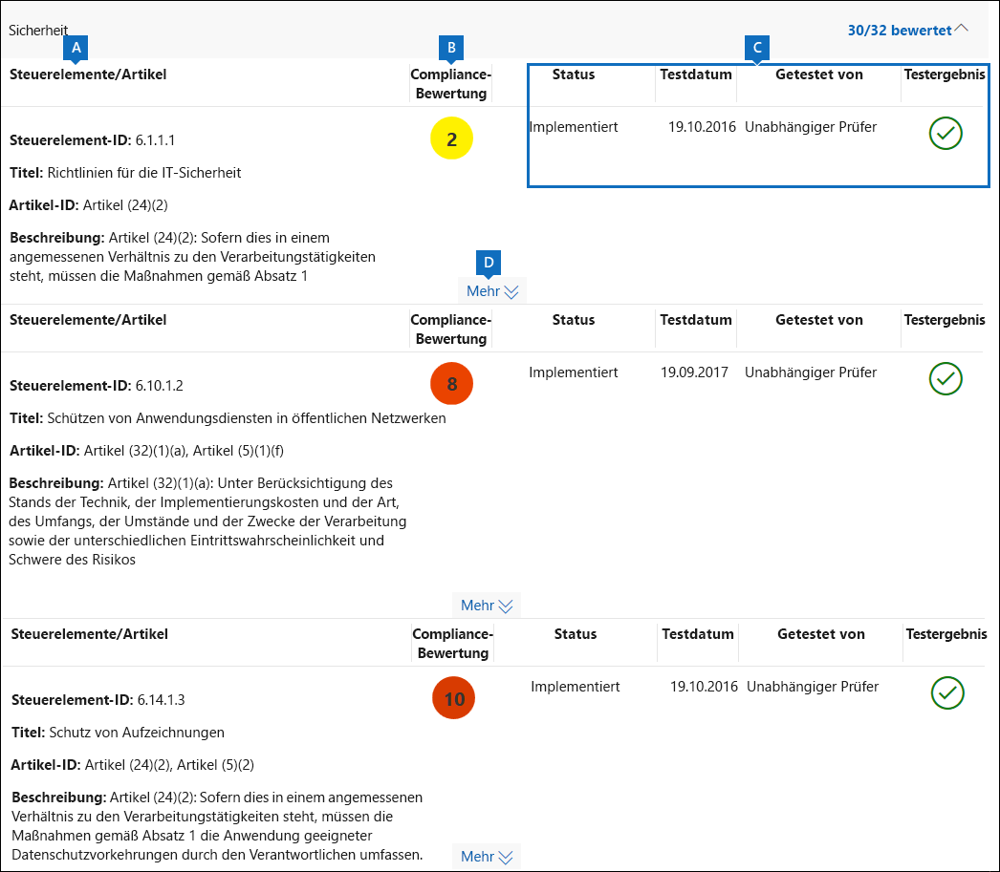
  
  a. Gibt die folgenden Informationen von der Zertifizierung oder Vorschrift an, die dem von Microsoft verwalteten Steuerelement zugeordnet ist.

  - **Steuerelement-ID**: Die Abschnit-t oder Artikelnummer der Zertifizierung oder Vorschrift, die dem von Microsoft verwalteten Steuerelement zugeordnet ist.
    
  - **Titel**: Der Titel aus der entsprechenden Zertifizierung oder Vorschrift.
    
  - **Artikel-ID**: Dieses Feld ist nur für DSGVO-Bewertungen enthalten, da es die entsprechende DSGVO-Artikelnummer angibt.
    
  - **Beschreibung**: Text des Standards oder der Vorschrift, der bzw. die dem von Microsoft verwalteten Steuerelement zugeordnet ist.

  b. Die Compliance-Bewertung für das Steuerelement, die das Risiko (aufgrund von Nicht-Einhaltung oder aufgrund eines Steuerelementfehlers) im Zusammenhang mit dem von Microsoft verwalteten Steuerelement angibt. Weitere Informationen finden Sie unter [Grundlegendes zur Compliance-Bewertung](#understanding-the-compliance-score). Beachten Sie, dass die Compliance-Bewertungen von 1 bis 10 gehen und farblich unterteilt sind. Gelb steht für geringes Risiko, orange für mittleres Risiko und rot für hohes Risiko. 
    
  c. Informationen zum Implementierungsstatus eines Steuerelements, zum Datum, an dem das Steuerelement getestet wurde, zum Durchführer des Tests sowie zum Testergebnis.
    
  d. Sie können für jedes Steuerelement auf **Weitere Informationen** klicken, um weitere Informationen anzuzeigen, einschließlich der Details zur Implementierung des Steuerelements durch Microsoft und Informationen dazu, wie das Steuerelement von einem unabhängigen Drittprüfer getestet und überprüft wurde. 
    
- **Vom Kunden verwaltete Steuerelemente**: Dies ist die Sammlung der Steuerelemente, die von Ihrer Organisation verwaltet werden. Ihre Organisation ist für die Implementierung dieser Steuerelemente im Rahmen des Einhaltungsprozesses eines bestimmtes Standards oder einer Richtlinie verantwortlich. Vom Kunden verwaltete Steuerelemente werden auch in Steuerelementfamilien für die entsprechende Zertifizierung oder Vorschrift organisiert. Verwenden Sie die vom Kunden verwalteten Steuerelemente, um die von Microsoft im Rahmen Ihrer Complianceaktivitäten empfohlenen Aktionen zu implementieren.
    
    Vom Kunden verwaltete Steuerelemente in Bewertungen weisen auch eine integrierte Workflowverwaltungsfunktion auf, die Sie zum Verwalten und Nachverfolgen der Fortschritte Ihres Unternehmens im Hinblick auf den Abschluss der Bewertung verwenden können. Ein Compliance Officer in Ihrer Organisation kann beispielsweise einem IT-Administrator ein Aktionselement zuweisen, der über die Verantwortung und die erforderlichen Berechtigungen zum Durchführen der Aktion verfügt, die für das Steuerelement empfohlen werden. Wenn diese Arbeit abgeschlossen ist, kann der IT-Administrator einen Nachweis für seine Implementierungsaufgaben hochladen (z. B. Screenshots der Konfiguration oder Richtlinieneinstellungen) und dann das Aktionselement wieder dem Compliance Officer zuweisen, damit dieser die gesammelten Nachweise prüfen, die Implementierung testen und das Implementierungsdatum sowie die Testergebnisse im Compliance-Manager aufzeichnen kann. Weitere Informationen finden Sie im Abschnitt [Verwalten des Bewertungsprozesses](#managing-the-assessment-process) in diesem Artikel. 
  
## Berechtigungen und rollenbasierte Zugriffssteuerung

Standardmäßig hat jede Person in Ihrer Organisation mit einem Office 365- oder Azure AD-Konto Zugriff auf Compliance-Manager und kann beliebige Aktionen darin ausführen. Um von den Standardberechtigungen zum Modell der rollenbasierten Zugriffssteuerung zu wechseln, muss jeder Compliance-Manager-Rolle mindestens ein Benutzer hinzugefügt werden (siehe die folgenden Anweisungen). Nachdem ein Benutzer zu einer Rolle hinzugefügt wurde, werden die Berechtigungen zum Durchführen der dieser Rolle zugewiesenen Aktionen aus dem Standardberechtigungssatz entfernt, der für alle Benutzer verfügbar ist; nur die Benutzer, die diese Rolle erhalten haben, können auf Compliance-Manager zugreifen und die für diese Rolle zulässigen Aktionen ausführen.
  
Nachdem der rollenbasierte Zugriff implementiert wurde, haben alle Benutzer, die nicht einer definierten Compliance-Manager-Rolle zugewiesen sind, Gastzugriff.
  
> [!NOTE]
> Zur vollständigen Implementierung der rollenbasierten Zugriffssteuerung (um zu verwalten, wer auf Compliance-Manager zugreifen kann und darin Aktionen ausführen kann), muss jeder Rolle ein Benutzer hinzugefügt werden, um die Standardberechtigungen zu ändern. Wenn Sie beispielsweise einen Benutzer zu der Rolle hinzufügen, mit der Benutzer Bewertungen verwalten können, können nur Mitglieder dieser Rolle Bewertungen verwalten. Wenn Sie keinen Benutzer zu der Rolle hinzufügen, mit der Benutzer die Daten in Bewertungen lesen können, so können alle Benutzer in Ihrer Organisation auf Compliance-Manager zugreifen und Daten in allen Bewertungen lesen. 
  
In der folgenden Tabelle werden die einzelnen Compliance-Manager-Berechtigungen beschrieben und was der Benutzer damit tun kann. In der Tabelle wird außerdem die Rolle angegeben, der jede Berechtigung zugewiesen ist.
  
||**Compliance Manager Reader**|**Compliance Manager Contributor**|**Compliance Manager Assessor**|**Compliance Manager Administrator**|**Portal Admin**|
|:-----|:-----|:-----|:-----|:-----|:-----|
|**Lesen von Daten**: Benutzer können Daten lesen, aber nicht bearbeiten.    |             |             |             |             |             |
|**Bearbeiten von Daten**: Benutzer können alle Felder, mit Ausnahme von „Testergebnis“ und „Testdatum“, bearbeiten.    ||             |             |             |             |
|**Bearbeiten der Testergebnisse**: Benutzer können die Felder „Testergebnis“ und „Testdatum“ bearbeiten.    |||             |             |             |
|**Verwalten von Bewertungen**: Benutzer können Bewertungen erstellen, archivieren und löschen.    ||||             |             |
|**Verwalten von Benutzern**: Benutzer können andere Benutzer in der Organisation zu den Rollen „Reader“, „Contributor“, „Assessor“ und „Administrator“ hinzufügen. Nur die Benutzer mit der Rolle „Globaler Administrator“ in Ihrer Organisation können Benutzer zu der Rolle „Portal Admin“ hinzufügen oder daraus entfernen.  |||||             |
   
### Gastzugriff
  
Nachdem der Zugriff auf Compliance-Manager konfiguriert wurde, befinden sich alle Benutzer, denen keine Rolle bereitgestellt wurde, standardmäßig in der Rolle **Gastzugriff** (wie dies auch bei allen nicht von einer Organisation bereitgestellten Konten, z. B. persönlichen Microsoft-Konten, der Fall ist). Benutzer mit Gastzugriff verfügen nicht über vollständigen Zugriff auf alle Features von Compliance-Manager und können keine Bewertungsdaten der Organisation anzeigen. Sie können Compliance-Manager jedoch verwenden, um die Compliance-Bewertungsberichte von Microsoft und Service Trust-Dokumente anzuzeigen. In den Abbildungen können Sie sehen, worauf zugegriffen werden kann und worauf nicht. Features, auf die zugegriffen werden kann, sind blau dargestellt, und Features, auf die nicht zugegriffen werden kann, rot. 
  
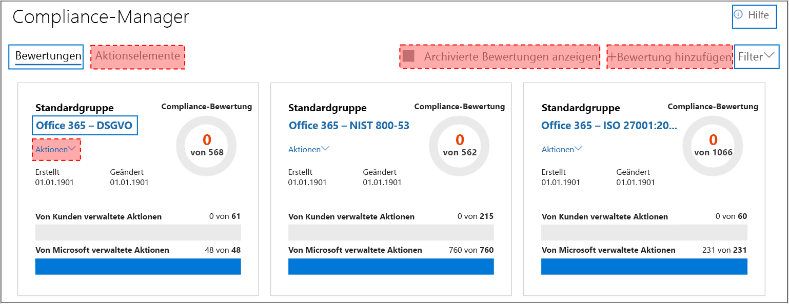
  
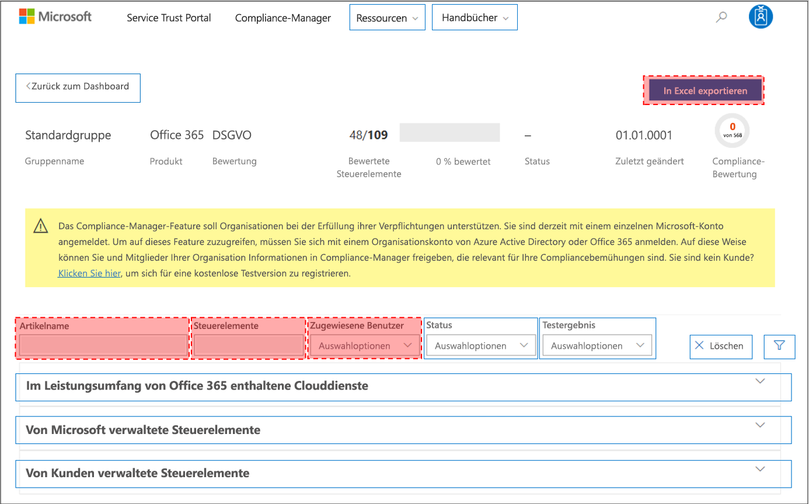

## Grundlegendes zur Compliance-Bewertung

Im Dashboard zeigt der Compliance-Manager einen Gesamtwert für Office 365-Bewertungen in der oberen rechten Ecke der Kachel an. Dies ist die Gesamtbewertung für die Bewertung, also die Sammlung von Punkten, die für jede Steuerelementbewertung erhalten wurde, die in der Bewertung als „Implementiert“ und „Getestet“ markiert wurde. Wenn eine Bewertung hinzugefügt wird, werden Sie sehen, dass die Compliance-Bewertung fast abgeschlossen ist, da die Punkte für die von Microsoft verwalteten Steuerelemente, die von Microsoft implementiert und von unabhängigen Drittanbietern getestet wurden, bereits übernommen wurden.
  
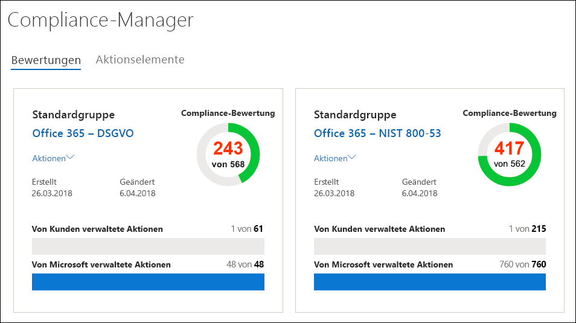
  
Die übrigen Punkte stammen aus der erfolgreichen Bewertung von Kundensteuerelementen, aus der Implementierung und aus dem Test der vom Kunden verwalteten Steuerelemente, von denen jedes einen bestimmten Wert hat, der einen Teil der Compliance-Bewertung ausmacht. 
  
Für jede Bewertung wird eine risikobasierte Compliance-Bewertung angezeigt, damit Sie das Risiko (aufgrund von Nicht-Einhaltung oder aufgrund eines Steuerelementfehlers) für jedes Steuerelement (einschließlich von Microsoft und vom Kunden verwalteter Steuerelemente) in einer Bewertung besser beurteilen können. Jedes vom Kunden verwaltete Steuerelement ist einer möglichen Anzahl von Punkten (*Schwergrad*) auf einer Skala von 1 bis 10 zugewiesen, wobei für Steuerelemente mit einem höheren Risikofaktor mehr Punkte vergeben werden, wenn das Steuerelement fehlschlägt, und weniger Punkte für Steuerelemente mit niedrigerem Risiko. 
  
Das unten dargestellte Bewertungssteuerelement für die Verwaltung des Benutzerzugriffs hat einen sehr hohen Schweregrad. Deshalb wird der Wert 10 angezeigt.
  
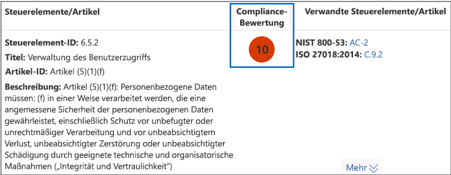
  
 Das unten dargestellte Bewertungssteuerelement für die Sicherung von Informationen hat dagegen einen niedrigeren Schweregrad. Deshalb wird der Wert 3 angezeigt. 
  
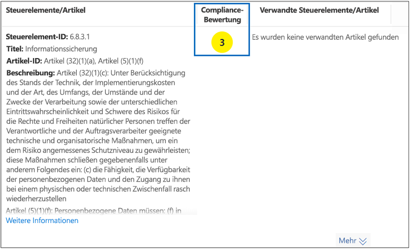
  
Der Compliance-Manager weist einen standardmäßigen Schweregrad für jedes Steuerelement zu. Risikobewertungen werden basierend auf den folgenden Kriterien berechnet:
  
- Ob ein Steuerelement Zwischenfälle verhindert (höchste Bewertung), Vorfälle erkennt, die passiert sind, oder die Auswirkungen eines Zwischenfalls korrigiert (niedrigste Bewertung). Im Hinblick auf den Schweregrad wird einem Steuerelement, das eine Bedrohung verhindert und erforderlich ist, die höchste Anzahl von Punkten zugewiesen; Steuerelementen, die Bedrohungen erkennen oder korrigieren (unabhängig davon, ob sie erforderlich sind oder nach Ermessen verwendet werden), werden die niedrigsten Punktzahlen zugewiesen.
    
- Ob ein Steuerelement (nach seiner Implementierung) erforderlich ist und deshalb von den Benutzern nicht umgangen werden kann (Benutzer müssen beispielsweise ihr Kennwort zurücksetzen und Anforderungen im Hinblick auf Kennwortlänge und -zeichen erfüllen), oder ob es frei verfügbar ist und von Benutzern umgangen werden kann (zum Beispiel Geschäftsregeln, die erfordern, dass Benutzer ihre Bildschirme sperren, wenn sie sich nicht an ihren Computern befinden).
    
- Steuerelemente im Zusammenhang mit Risiken für die Vertraulichkeit, Integrität und Verfügbarkeit von Daten, ob diese Risiken aus internen oder externen Bedrohungen stammen, und ob die Bedrohung bösartig oder unbeabsichtigt ist. Beispielsweise würden Steuerelementen, die verhindern, dass ein Angreifer in das Netzwerk eindringt und Zugriff auf personenbezogene Informationen erhält, mehr Punkte zugewiesen als einem Steuerelement, das verhindert, dass ein Benutzer eine Netzwerkroutereinstellung versehentlich falsch konfiguriert, was zu einem Netzwerkausfall führt).
    
- Risiken im Zusammenhang mit rechtlichen und externen Faktoren, z. B. Verträge, Vorschriften und öffentliche Verpflichtungen, für jedes Steuerelement.
    
Die angezeigten Werte für die Compliance-Bewertung für das Steuerelement werden basierend auf dem Kriterium „Bestanden/Nicht bestanden) *vollständig* auf das Gesamtergebnis angewendet – das Steuerelement wird implementiert und besteht den nachfolgenden Bewertungstest, oder es besteht den Test nicht. Nur wenn der **Implementierungsstatus** des Steuerelements auf **Implementiert** oder **Alternative Implementierung** und das **Testergebnis** auf **Bestanden** festgelegt ist, werden die zugewiesenen Punkte zum Gesamtwert addiert. 
  
Was am wichtigsten ist: Mithilfe der Compliance-Bewertung können Sie priorisieren, welche Steuerelemente für die Implementierung verwendet werden sollen, indem Sie Steuerelemente angeben, die ein höheres potenzielles Risiko aufweisen, wenn ein Fehler im Zusammenhang mit einem Steuerelement auftritt. Neben der risikobasierten Priorisierung ist zu beachten, dass (wenn Bewertungssteuerelemente mit anderen Steuerelementen verknüpft sind; entweder in der gleichen Bewertung oder in einer anderen Bewertung, die sich in derselben Bewertungsgruppierung befindet) das erfolgreiche Abschließen eines einzigen Steuerelements zu einer wesentlichen Reduzierung des Aufwands basierend auf der Synchronisierung von Steuerelement-Testergebnissen führen kann.
  
In der Abbildung unten sehen wir beispielsweise, dass die Bewertung „Office 365 – DSGVO“ derzeit zu 46 % bewertet ist, was bedeutet, dass 51 von 111 Steuerelementbewertungen mit einer Gesamtbewertung von 289 Punkten von möglichen 600 Punkten abgeschlossen wurden.
  
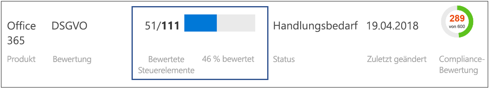
  
In der Bewertung ist das DSGVO-Steuerelement 7.5.5 mit 5 anderen Steuerelementen verknüpft (7.4.1, 7.4.3, 7.4.4,.7.4.8 und 7.4.9), die alle einen mittleren bis hohen Schweregrad zwischen 6 und 8 aufweisen. Mithilfe des Bewertungsfilters wurden all diese Steuerelemente ausgewählt und so in der Bewertungsansicht sichtbar gemacht. Sie können sehen, dass keines davon bewertet wurde. 
  
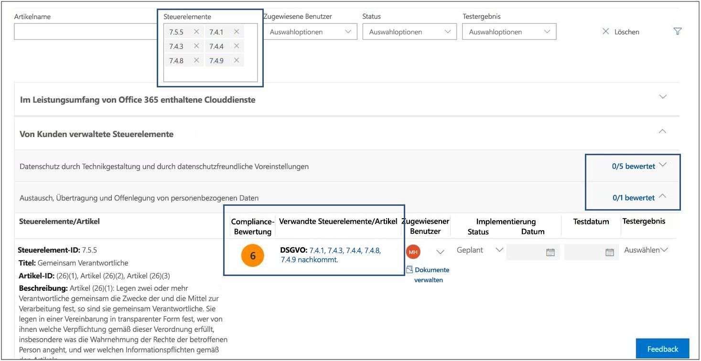 Da diese 6 Steuerelemente miteinander verknüpft sind, führt das Abschließen eines der Steuerelemente zu einer Synchronisierung dieser Testergebnisse über die verknüpften Steuerelemente in der Bewertung (genau wie bei allen verknüpften Steuerelementen in einer Bewertung, die sich in derselben Bewertungsgruppierung befindet). Bei Abschluss der Implementierung und des Tests des DSGVO-Steuerelements 7.5.5 wird der Detailbereich des Steuerelements so aktualisiert, dass angezeigt wird, dass alle 6 Steuerelemente bewertet wurden, und es ist ein entsprechender Anstieg der Anzahl bewerteter Steuerelemente auf 57 und 51 % bewertete Steuerelemente sowie eine Änderung des Gesamtwerts auf +40 zu beobachten. 
  
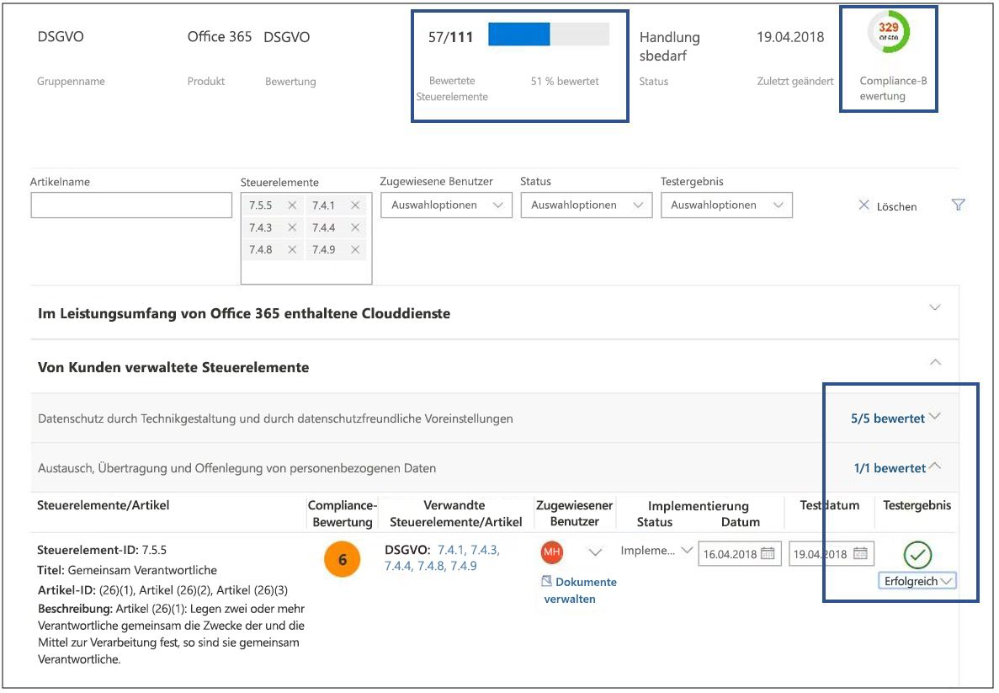
  
Dieses Dialogfeld zur Bestätigung der Aktualisierung wird angezeigt, wenn Sie im Begriff sind, den Implementierungsstatus eines verknüpften Steuerelements derart zu ändern, dass dies Auswirkungen auf andere verknüpfte Steuerelemente hat.
  
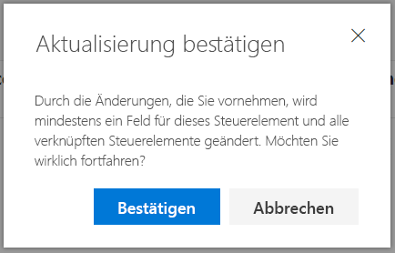
  
> [!NOTE]
> Derzeit umfassen nur Bewertungen für Office 365-Clouddienste eine Compliance-Bewertung. In Bewertungen für Azure und Dynamics wird ein Bewertungsstatus angezeigt. 

## Methodik der Compliance-Bewertung

Die Compliance-Bewertung, wie der Microsoft Secure Store, ist anderen verhaltensbasierten Bewertungssystemen ähnlich. Die Compliance-Bewertung Ihrer Organisation kann erhöht werden, indem Aktivitäten im Zusammenhang mit Datenschutz und Sicherheit ausgeführt werden.
  
> [!NOTE]
> Die Compliance-Bewertung drückt kein absolutes Maß für die Einhaltung eines bestimmten Standards oder einer bestimmten Vorschrift in der Organisation aus. Sie drückt vielmehr den Umfang aus, in dem Sie Steuerelemente einsetzen, durch die die Risiken für persönliche Daten und den Datenschutz reduziert werden können. Kein Dienst kann garantieren, dass Sie einen Standard oder eine Vorschrift einhalten. Die Compliance-Bewertung sollte in keinster Weise als eine Garantie verstanden werden. 
  
Bewertungen im Compliance-Manager basieren auf dem Modell für gemeinsame Verantwortung für Cloud Computing. Im Modell für gemeinsame Verantwortung teilen sich Microsoft und alle Kunden die Verantwortung für den Schutz der Kundendaten, wenn diese in unserer Cloud gespeichert werden.
  
Wie in der Office 365-DSGVO-Bewertung unten dargestellt, sind sowohl Microsoft als auch Kunden dafür verantwortlich, unterschiedliche Aktionen durchzuführen, die dazu dienen sollen, die Anforderungen des bewerteten Standards oder der bewerteten Vorschrift zu erfüllen. Um die erforderlichen Aktionen über eine Vielzahl von Standards und Vorschriften hinweg zu rationalisieren und zu verstehen, werden im Compliance-Manager alle Standards und Vorschriften so behandelt, als wären sie Steuerelement-Frameworks. Die für jede Bewertung von Microsoft und Kunden durchgeführten Aktionen umfassen daher die Implementierung und Überprüfung mehrerer Steuerelemente.
  
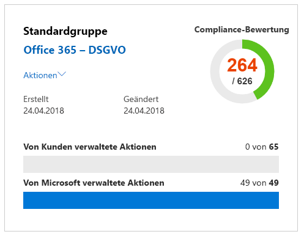
  
Nachfolgend sehen Sie den grundlegenden Workflow für eine typische Aktion:
  
1. Der Beauftrage für Compliance, Risiko und/oder Datenschutz in einer Organisation weist die Aufgabe einer Person in der Organisation zu, um ein Steuerelement zu implementieren. Bei dieser Person kann es sich um folgende Personen handeln:

    - Der Besitzer einer Unternehmensrichtlinie
    
    - Ein IT-Implementierer
    
    - Eine andere Person in der Organisation, die für das Ausführen der Aufgabe verantwortlich ist
    
2. Diese Person führt die erforderlichen Aufgaben zum Implementieren des Steuerelements durch, lädt den Nachweis der Implementierung in den Compliance-Manager hoch und markiert die an die Aktion gebundenen Steuerelemente als implementiert. Nachdem diese Aufgaben abgeschlossen wurden, wird die Aktion einem Prüfer zur Überprüfung zugewiesen. Prüfer können folgende Personen sein.
    
    - Interne Prüfer, die die Überprüfung von Steuerelementen in einer Organisation ausführen
    
    - Externe Prüfer, die die Compliance überprüfen und bestätigen, z. B. die unabhängigen Organisationen, die die Microsoft-Clouddienste prüfen
    
3. Der Prüfer überprüft das Steuerelement, untersucht den Nachweis und markiert die Steuerelemente als bewertet und kennzeichnet die Ergebnisse der Bewertung (z. B. bestanden).
    
Nachdem alle Steuerelemente, die einer Bewertung zugeordnet sind, bewertet wurden, wird die Bewertung als abgeschlossen betrachtet.
  
Jede Bewertung im Compliance-Manager enthält vorab Informationen, die Details zu den Aktionen liefern, die von Microsoft ausgeführt werden, um die Anforderungen der Steuerelemente zu erfüllen, für die Microsoft verantwortlich ist. Diese Informationen umfassen Details dazu, wie Microsoft jedes Steuerelement implementiert hat und wie und wann die Implementierung von Microsoft von einem unabhängigen Prüfer bewertet und überprüft wurde. Aus diesem Grund werden die von Microsoft verwalteten Steuerelemente für jede Bewertung als „Bewertet“ markiert; dies spiegelt sich in der Compliance-Bewertung für die Bewertung wider.
  
Jede Bewertung umfasst eine Gesamtbewertung basierend auf dem Modell für gemeinsame Verantwortung. Die Implementierung, und die Tests von Steuerelementen für Office 365 durch Microsoft machen einen Teil der insgesamt möglichen Punkte im Zusammenhang mit einer DSGVO-Bewertung aus. Wenn der Kunde die einzelnen Kundenaktionen implementiert und testet, erhöht sich die Compliance-Bewertung für die Bewertung um den dem Steuerelement zugewiesenen Wert. 
  
 ### Methode der risikobasierten Bewertung
  
Der Compliance-Manager verwendet eine risikobasierte Bewertungsmethode mit einer Skala von 1-10, bei der Steuerelementen, die ein höheres Risiko im Falle eines Fehlers oder der Nichteinhaltung darstellen, zugewiesen wird. Das von der Compliance-Bewertung verwendete Bewertungssystem basiert auf mehreren Schlüsselfaktoren, z. B.:
  
- Die Grundidee des Steuerelements
    
- Die Risikostufe des Steuerelements basierend auf der Art von Bedrohungen
    
- Die externen Faktoren für das Steuerelement
    
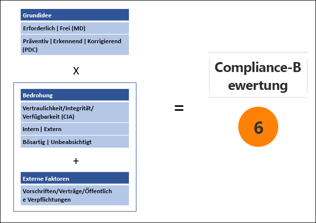
  
 ### Die Grundidee des Steuerelements
  
Die Grundidee des Steuerelements basiert darauf, ob das Steuerelement erforderlich oder frei ist, und ob es vorbeugende, erkennende oder korrigierende Maßnahmen umfasst.
  
 ### Erforderlich oder frei
  
 *Erforderliche Steuerelemente* sind Steuerelemente, die weder absichtlich oder versehentlich umgangen werden können. Ein Beispiel für ein allgemeines erforderliches Steuerelement ist eine zentral verwaltete Kennwortrichtlinie, die Anforderungen für Kennwortlänge, -komplexität und -ablauf festlegt. Benutzer müssen diese Anforderungen erfüllen, um auf das System zugreifen zu können. 
  
 *Freie Steuerelemente* basieren darauf, dass Benutzer die Richtlinie verstehen und sich entsprechend verhalten. Bei einer Richtlinie, die Benutzer auffordert, ihre Computer zu sperren, wenn sie ihren Arbeitsplatz verlassen, handelt es sich beispielsweise um ein freies Steuerelement, da es auf dem Benutzer beruht. 
  
 ### Vorbeugende, erkennende oder korrigierende Steuerelemente
  
 *Vorbeugende Steuerelemente * sind Steuerelemente, die bestimmte Risiken verhindern. Das Schützen von gespeicherten Informationen ist beispielsweise eine vorbeugende Maßnahme gegen Angriffe, Verstöße usw. Die Aufgabentrennung ist eine vorbeugende Maßnahme, um Interessenkonflikte zu verwalten und Schutz vor Betrug zu schützen. 
  
 *Erkennende Steuerelemente* sind Steuerelemente, die aktiv Systeme überwachen, um unregelmäßige Bedingungen oder Verhaltensweisen zu identifizieren, die ein Risiko darstellen, oder die verwendet werden können, um Angriffe aufzudecken oder festzustellen, ob eine Verletzung aufgetreten ist. Die Überprüfung des Systemzugriffs und die Prüfung von Administratoraktionen sind Typen von überwachenden Steuerelementen. Überprüfungen der Einhaltung von Vorschriften sind ein Typ eines erkennenden Steuerelements, das zum Auffinden von Prozessproblemen verwendet wird. 
  
 *Korrigierende Steuerelemente* sind Steuerelemente, die versuchen, die negativen Auswirkungen eines Sicherheitszwischenfalls zu minimieren, Korrekturmaßnahmen zu ergreifen, um die unmittelbaren Auswirkungen zu reduzieren und den Schaden, wenn möglich, rückgängig zu machen. 
  
Durch die Auswertung jedes Steuerelements anhand dieser Faktoren bestimmen wir die Grundidee des Steuerelements und weisen ihm einen Wert relativ zu dem Risiko zu, das es darstellt.
  
 **Bedrohung**
  
||||
|:-----|:-----|:-----|
||**Erforderlich**   |**Frei**   |
|**Präventiv**   |Hohes Risiko    |Mittleres Risiko    |
|**Erkennend**   |Mittleres Risiko    |Niedriges Risiko    |
|**Korrigierend**   |Mittleres Risiko    |Niedriges Risiko    |
   
Bedrohung bezieht sich auf alles, was eine Gefahr für den grundlegenden, universell akzeptierten Sicherheitsstandard darstellt, der als die CIA-Triade für Daten bekannt ist: Confidentiality, Integrity und Availability (Vertraulichkeit, Integrität und Verfügbarkeit):
  
- Vertraulichkeit bedeutet, dass Informationen nur von vertrauenswürdigen, autorisierten Personen gelesen werden können.
    
- Integrität bedeutet, dass Informationen nicht von nicht autorisierten Personen geändert oder gelöscht wurden.
    
- Verfügbarkeit bedeutet, dass auf Informationen problemlos mit einem hohem Maß an Dienstqualität zugegriffen werden kann.
    
Ein Fehler bei einem dieser Merkmale wird als Gefahr für das System als Ganzes betrachtet. Bedrohungen können sowohl aus internen als auch aus externen Quellen stammen, und die Absicht eines Handelnden kann unabsichtlich oder bösartig sein. Diese Faktoren werden in einer Bedrohungsmatrix geschätzt, die jeder Kombination von Szenarios die Bedrohungsstufen „Hoch“, „Mittel“ oder „Niedrig“ zuweist.

||**Intern** ||**Extern** ||||
|:-----|:-----|:-----|:-----|:-----|:-----|:-----|
||*Bösartig* |*Unbeabsichtigt* |*Bösartig* |*Unbeabsichtigt* |||
|**Vertraulichkeit** |(H, M oder N)    |(H, M oder N)    |(H, M oder N)    |(H, M oder N)|
|**Integrität** |(H, M oder N)    |(H, M oder N)    |(H, M oder N)    |(H, M oder N)|
|**Verfügbarkeit** |(H, M oder N)    |(H, M oder N)    |(H, M oder N)    |(H, M oder N)|
   
 **Externe Faktoren**
  
|**Verträge**|**Vorschriften**|**Öffentliche Verpflichtungen**|
|:-----|:-----|:-----|
|(H, M oder N)    |(H, M oder N)    |(H, M oder N)    |
   
Externe Faktoren wie geltende Vorschriften, Verträge und öffentliche Verpflichtungen können Auswirkungen auf Steuerelemente haben, die zum Schützen von Daten und zum Verhindern von Datenschutzverletzungen entwickelt wurden. Jedem Faktor wird der Risikowert „Hoch“, „Mittel“ oder „Niedrig“ zugewiesen.
  
Die geschätzte Anzahl von Vorkommnissen der Risikostufen „Hoch“, „Mittel“ oder „Niedrig“ über die 15 möglichen Risikoszenarien hinweg, die unter CIA/Bedrohung und Rechtlich/Externe Faktoren dargestellt sind, werden kombiniert, sodass eine Risikogewichtung entsteht, bei der die Wahrscheinlichkeit und die Anzahl von Vorkommnissen von Risiken bei einem bestimmten Wert als signifikant berücksichtigt wird und bei der Berechnung des Schweregrads des Steuerelements mit einbezogen wird.
  
Basierend auf dem Schweregrad des Steuerelements wird das Steuerelement seiner Compliance-Bewertung zugewiesen, eine Zahl zwischen 1 (niedrig) und 10 (hoch), gruppiert in die folgenden Risikokategorien:
  
|**Risikostufe**|**Steuerelementwert**|
|:-----|:-----|
|Niedrig    |1-3    |
|Mittel    |6    |
|Hoch    |8    |
|Schwerwiegend    |10    |
   
Durch Priorisieren von Bewertungssteuerelementen mit den höchsten Compliance-Bewertungen konzentriert sich die Organisation auf die Elemente mit dem höchsten Risiko und erhält proportional positiveres Feedback in der Form von mehr Punkten, die zum Gesamtwert für die Bewertung für jede abgeschlossene Steuerelementbewertung addiert werden.
  
### Zusammenfassung der Bewertungsmethode
  
Die Compliance-Bewertung ist eine wichtige Komponente, mit deren Hilfe Compliance-Manager Organisationen dabei unterstützt, ihre Compliance zu verstehen und zu verwalten. Die Compliance-Bewertung für eine Bewertung ist ein Ausdruck für die Einhaltung eines bestimmten Standards oder einer bestimmten Vorschrift eines Unternehmens anhand einer Zahl, wobei eine höhere Bewertung (bis zur maximalen Anzahl von Punkten, die für die Bewertung zugeordnet sind) für einen besseren Status des Unternehmens im Zusammenhang mit der Compliance steht. Es ist wichtig, dass Organisationen die Methode der Compliance-Bewertung verstehen, bei der Bewertungssteuerelementen Werte für den Schweregrad zwischen 1 und 10 zugewiesen werden. Zur Priorisierung ihrer Aktionen müssen Unternehmen außerdem verstehen, wie abgeschlossene Bewertungssteuerelemente zur Gesamtbewertung addiert werden.

## Gruppieren von Bewertungen

Wenn Sie eine neue Bewertung erstellen, werden Sie aufgefordert, eine neue Gruppe zum Zuweisen der Bewertung zu erstellen, oder die Bewertung einer vorhandenen Gruppe zuzuweisen. Mit Gruppen können Sie Bewertungen logisch organisieren und allgemeine Informationen und Workflowaufgaben zwischen Bewertungen austauschen, die über die gleichen bzw. über verknüpfte vom Kunden verwaltete Steuerelemente verfügen.
  
Sie können Bewertungen beispielsweise nach Jahr oder Teams, Abteilungen oder Agenturen innerhalb Ihrer Organisation gruppieren. Nachfolgend finden Sie einige Beispiele von Gruppen und die darin enthaltenen Bewertungen.
  
- DSGVO-Bewertungen – 2018
    
  - Office 365 + DSGVO
    
  - Azure + DSGVO
    
  - Dynamics + DSGVO
    
- Azure-Bewertungen – 2018
    
  - Azure + DSGVO
    
  - Azure + ISO 27001:2013
    
  - Azure + ISO 27018:2014
    
- Datenschutzbewertungen
    
  - Office 365 + ISO 27001:2013
    
  - Office 365 + ISO 27018:2014
    
  - Azure + ISO 27001:2013
    
  - Azure + ISO 27018:2014
    
> [!TIP]
> Es wird empfohlen, dass Sie eine Gruppierungsstrategie für Ihre Organisation ermitteln, bevor Sie neue Bewertungen hinzufügen: 
  
Die folgenden Anforderungen gelten für das Gruppieren von Bewertungen:
  
- Gruppennamen (auch als *Gruppen-IDs* bezeichnet ) müssen in Ihrer Organisation eindeutig sein. 
    
- Gruppen können Bewertungen für die gleiche Zertifizierung/Vorschrift enthalten, aber jede Gruppe kann nur eine Bewertung für eine Kombination eines bestimmten Clouddiensts/einer Zertifizierung enthalten. Eine Gruppe kann beispielsweise nicht zwei Bewertungen für Office 365 und DSGVO enthalten. In ähnlicher Weise kann eine Gruppe mehrere Bewertungen für denselben Clouddienst enthalten, vorausgesetzt, die entsprechende Zertifizierung/Vorschrift ist für jeden unterschiedlich.
    
Nachdem eine Bewertung einer Bewertungsgruppierung hinzugefügt wurde, kann die Gruppierung nicht geändert werden. Sie können die Bewertungsgruppe umbenennen, wodurch der Name der Bewertungsgruppierung für alle mit dieser Gruppe verknüpften Bewertungen geändert wird. Sie können eine neue Bewertung und eine neue Bewertungsgruppierung erstellen und Informationen von einer vorhandenen Bewertung kopieren, wodurch ein Duplikat dieser Bewertung in einer anderen Bewertungsgruppe erstellt wird. Durch Archivieren einer Bewertung wird die Beziehung zwischen dieser Bewertung und der Bewertungsgruppe aufgehoben; alle weiteren Aktualisierungen an anderen verknüpften Bewertungen werden in der archivierten Bewertung nicht mehr widergespiegelt.
  
Wie zuvor erläutert, besteht ein wesentlicher Vorteil der Verwendung von Gruppen darin, dass (wenn zwei unterschiedliche Bewertungen in derselben Gruppe das gleiche vom Kunden verwaltete Steuerelement verwenden und somit die Kundenaktionen für jedes Steuerelement gleich wären) das Ausfüllen der Implementierungsdetails, der Testinformationen und des Status für das Steuerelement in einer Bewertung in dasselbe Steuerelement in einer anderen Bewertung in der Gruppe synchronisiert würde. Mit anderen Worten: Wenn Bewertungen dasselbe Steuerelement verwenden und diese Bewertungen sich in derselben Gruppe befinden, müssen Sie nur den Bewertungsprozess für das Steuerelement in einer Bewertung verwalten. Die Ergebnisse für dieses Steuerelement werden automatisch in anderen Bewertungen synchronisiert. ISO 27001 und ISO 27018 weisen beispielsweise beide ein Steuerelement für Kennwortrichtlinien auf. Wenn der Teststatus für das Steuerelement in einer Bewertung auf „Bestanden“ festgelegt wird, wird das Steuerelement in der anderen Bewertung aktualisiert (und als „Bestanden“ markiert), vorausgesetzt, beide Bewertungen sind Teil derselben Bewertungsgruppe.
  
Sehen Sie sich als Beispiel hierfür die folgenden beiden verknüpften Bewertungssteuerelemente an, die mit der Verschlüsselung von Daten in öffentlichen Netzwerken zu tun haben, und zwar das Steuerelement 6.10.1.2 in der Bewertung „Office 365 – DSGVO“ und das Steuerelement SC-13 in der Bewertung „Office 365 – NIST 800-53“.
  
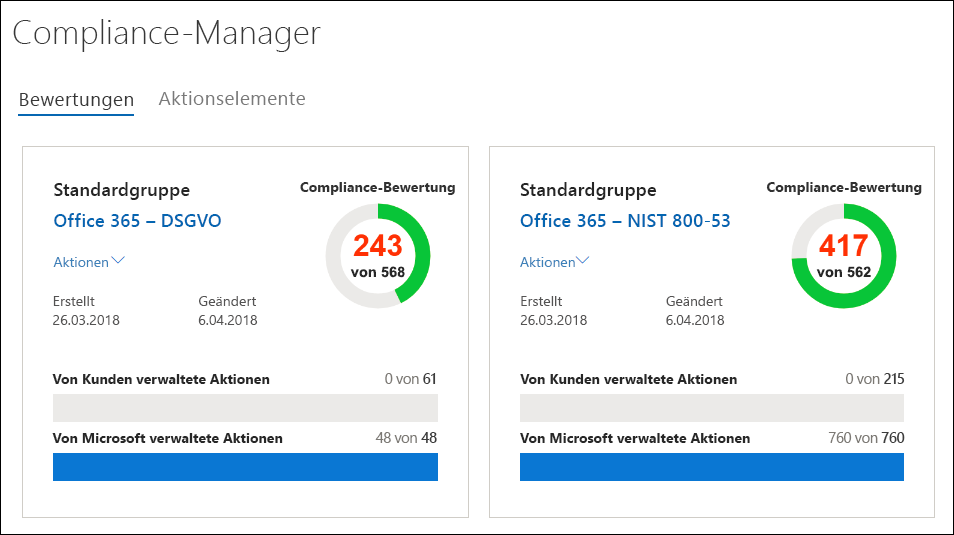
  
Durch Klicken auf die Bewertung **Office 365 – DSGVO** und mithilfe der Filtersteuerelemente zum Anzeigen des DSGVO-Steuerelements 6.10.1.2 sehen wir, dass das Steuerelement SC-13 in NIST 800-53 als verknüpftes Steuerelement aufgeführt ist.
  
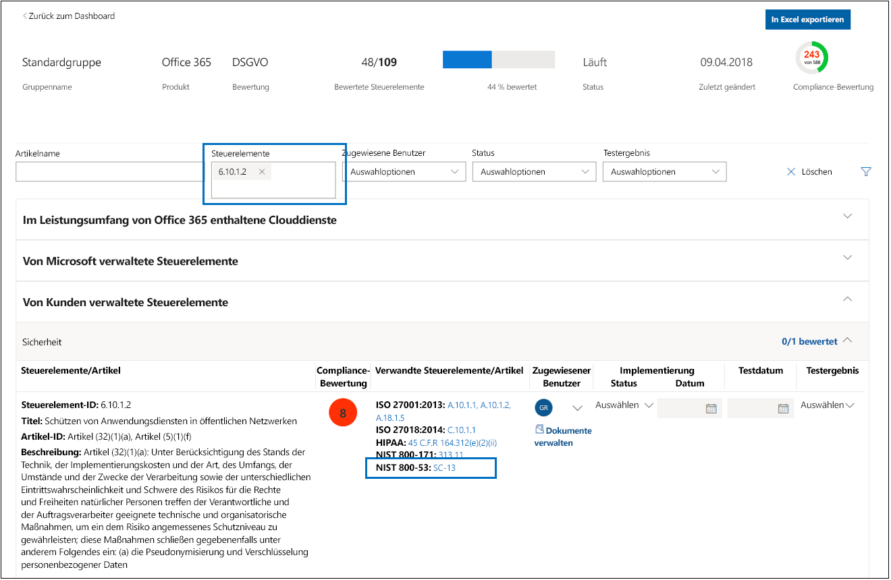
  
 Nachfolgend ist der Abschluss der Implementierung und des Tests von DSGVO-Steuerelement 6.10.1.2 dargestellt. 
  
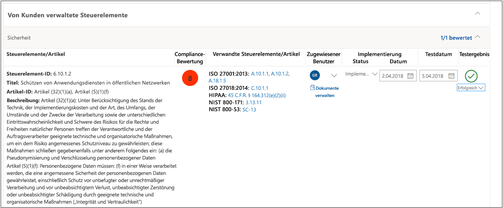
  
Indem wir zu dem verknüpften Steuerelement in der gruppierten Bewertung navigieren, sehen wir, dass NIST 800-53 SC-13 auch als abgeschlossen mit demselben Datum und derselben Uhrzeit markiert wurde, ohne zusätzliche Implementierungs- oder Testarbeiten.
  
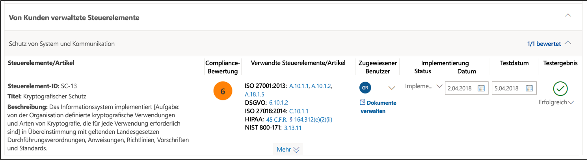
  
Zurück im Dashboard können wir sehen, dass in jeder Bewertung eine Steuerelementbewertung abgeschlossen wurde und dass sich die Gesamtbewertung für jede Bewertung um 8 erhöht hat (der Wert der Compliance-Bewertung dieses gemeinsam verwendeten Steuerelements).
  
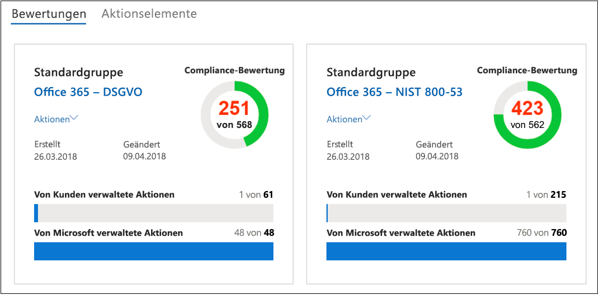

## Verwaltungsfunktionen

Es gibt bestimmte Verwaltungsfunktionen, die nur für das Mandantenadministratorkonto verfügbar sind und nur bei der Anmeldung als globaler Administrator sichtbar sind.
  
> [!NOTE]
> Über die Berechtigung „Zugriff auf Dokumente mit Zugriffseinschränkung“ in der Dropdownliste können Administratoren Benutzern Zugriff auf Dokumente mit Zugriffseinschränkung geben, die Microsoft im Service Trust Portal freigibt. Das Feature für Dokumente mit Zugriffseinschränkung ist in Kürze verfügbar. 
  
### Zuweisen von Compliance-Manager-Rollen zu Benutzern

Jede Compliance-Manager-Rolle hat etwas andere Berechtigungen. Sie können die jeder Rolle zugewiesenen Berechtigungen anzeigen, sehen, welche Benutzer welche Rolle haben, und Benutzer zu dieser Rolle hinzufügen oder daraus entfernen, indem Sie im Service Trust Portal das Menüelement **Admin** auswählen und dann auf **Einstellungen** klicken. 
  

  
Hinzufügen oder Entfernen von Benutzern aus Compliance-Manager-Rollen
  
1. Wechseln Sie zu [https://servicetrust.microsoft.com](https://servicetrust.microsoft.com).
    
2. Melden Sie sich mit Ihrem globalen Azure Active Directory-Administratorkonto an.
    
3. Klicken Sie auf der oberen Menüleiste des Service Trust Portals auf **Admin**, und wählen Sie dann **Einstellungen** aus. 
    
4. Klicken Sie in der Dropdownliste **Rolle auswählen** auf die Rolle, die Sie verwalten möchten. 
    
5. Benutzer, die den einzelnen Rollen hinzugefügt wurden, werden auf der Seite **Rolle auswählen** aufgeführt. 
    
6. Um Benutzer zu dieser Rolle hinzuzufügen, klicken Sie auf **Hinzufügen**. Klicken Sie im Dialogfeld **Benutzer hinzufügen** auf das Benutzerfeld. Sie können durch die Liste verfügbarer Benutzer scrollen oder mit der Eingabe des Benutzernamens beginnen, um die Liste basierend auf Ihrem Suchbegriff zu filtern. Klicken Sie auf den Benutzer, um dieses Konto der Liste **Benutzer hinzufügen** hinzuzufügen, die dieser Rolle bereitgestellt werden soll. Wenn Sie mehrere Benutzer gleichzeitig hinzufügen möchten, beginnen Sie mit der Eingabe des Benutzernamens, um die Liste zu filtern, und klicken Sie dann auf den Benutzer, der der Liste hinzugefügt werden soll. Klicken Sie auf **Speichern**, um die ausgewählte Rolle für diese Benutzer bereitzustellen. 
    
    
  
7. Wenn Sie Benutzer aus dieser Rolle entfernen möchten, wählen Sie den/die Benutzer aus, und klicken Sie auf **Löschen**. 
    
    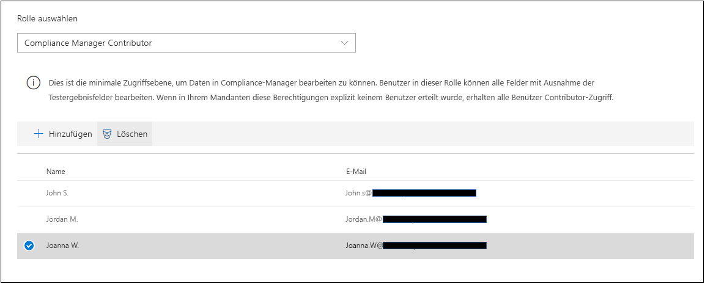
 
## Datenschutzeinstellungen

Bestimmte Vorschriften erfordern, dass eine Organisation in der Lage sein muss, die Verlaufsdaten von Benutzern zu löschen. Um dies zu aktivieren, wird in Compliance-Manager die Fuktion **Datenschutzeinstellungen** bereitgestellt, mit denen Administratoren Folgendes ausführen können: 
  
- [Suchen eines Benutzers](#search-for-a-user)

- [Exportieren eines Berichts mit Kontoverlaufsdaten](#export-report-of-account-data-history)

- [Erneutes Zuweisen von Aktionselementen](#reassign-action-items)

- [Löschen der Verlaufsdaten von Benutzern](#delete-user-data-history)
    
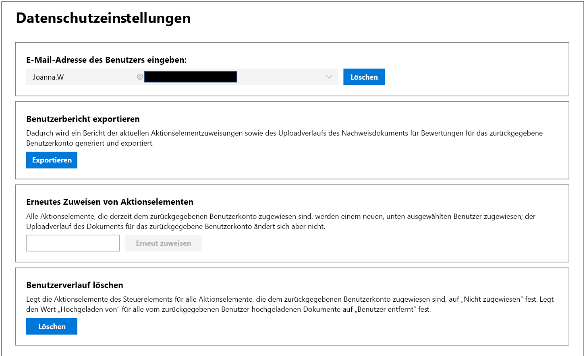
  
### Suchen eines Benutzers

So suchen Sie nach einem Benutzerkonto
  
1. Geben Sie die E-Mail-Adresse des Benutzers ein, indem Sie den Alias (die Informationen auf der linken Seite des @-Symbols) eingeben und den Domänennamen durch Klicken auf die Liste der Domänensuffixe rechts auswählen. Wenn dies ein Mandant mit mehreren registrierten Domänen ist, können Sie das Domänennamensuffix der E-Mail-Adresse erneut überprüfen, um sicherzustellen, dass es korrekt ist.
    
2. Wenn Sie den Benutzernamen korrekt eingegeben haben, klicken Sie auf **Suchen**. 
    
3. Wenn das Benutzerkonto nicht gefunden wird, wird die Fehlermeldung „Benutzer nicht gefunden“ auf der Seite angezeigt. Überprüfen Sie die E-Mail-Adresse des Benutzers, nehmen Sie nach Bedarf Korrekturen vor, und klicken Sie auf **Suchen**, um es erneut zu versuchen. 
    
4. Wenn ein Benutzerkonto gefunden wird, ändert sich der Text der Schaltfläche von **Suchen** in **Löschen**, was darauf hinweist, dass das zurückgegebene Benutzerkonto der Betriebskontext für die zusätzlichen Funktionen ist, die unten angezeigt werden, und dass das Ausführen dieser Funktionen für dieses Benutzerkonto gilt. 
    
5. Klicken Sie auf **Löschen**, um die Suchergebnisse zu löschen und nach einem anderen Benutzer zu suchen. 
    
### Exportieren eines Berichts mit Kontoverlaufsdaten

Nachdem das Benutzerkonto identifiziert wurde, können Sie einen Bericht der Abhängigkeiten generieren, die mit diesem Konto verknüpft sind. Anhand dieser Informationen können Sie offene Aktionselemente erneut zuweisen oder den Zugriff auf zuvor hochgeladene Nachweise sicherstellen. 
  
 So generieren und exportieren Sie einen Bericht
  
1. Klicken Sie auf **Exportieren**, um einen Bericht der Steuerelementaktionselemente von Compliance-Manager, die derzeit dem zurückgegebenen Benutzerkonto zugewiesen sind, sowie die Liste der von diesem Benutzer hochgeladenen Dokumente herunterzuladen. Wenn keine zugewiesenen Aktionen oder hochgeladenen Dokumente vorhanden sind, wird die Fehlermeldung „Keine Daten für diesen Benutzer“ angezeigt. 
    
2. Der Bericht wird im Hintergrund des aktiven Browserfensters heruntergeladen. Wenn Sie kein Popupfenster für den Download sehen, sollten Sie den Downloadverlauf des Browsers überprüfen.
    
3. Öffnen Sie das Dokument, um die Daten des Berichts zu überprüfen.
    
> [!NOTE]
> Dies ist kein Verlaufsbericht, in dem Statusänderungen zum Zuweisungsverlauf von Aktionselementen gespeichert oder angezeigt werden. Der generierte Bericht ist eine Momentaufnahme der zugewiesenen Aktionselemente zu dem Zeitpunkt, zu dem der Bericht ausgeführt wird (Datums- und Uhrzeitstempel werden in den Bericht geschrieben). Alle nachfolgenden erneuten Zuweisungen von Aktionselementen führen beispielsweise zu anderen Berichtsdaten der Momentaufnahme, wenn dieser Bericht erneut für denselben Benutzer erstellt wird. 
  
### Erneutes Zuweisen von Aktionselementen

Mithilfe dieser Funktion kann eine Organisation alle aktiven oder ausstehenden Abhängigkeiten für das Benutzerkonto entfernen, indem der Besitz aller Aktionselemente (sowohl aktive als auch abgeschlossene Aktionselemente) von dem zurückgegebenen Benutzerkonto einem neuen, unten ausgewählten Benutzer erneut zugewiesen wird. Durch diese Aktion wird der Uploadverlauf des Dokuments für das zurückgegebene Benutzerkonto nicht geändert. 
  
 So weisen Sie Aktionselemente einem anderen Benutzer erneut zu
  
1. Klicken Sie auf das Eingabefeld, um nach einem anderen Benutzer in der Organisation zu suchen und diesen auszuwählen. Diesem Benutzer sollen die zurückgegebenen Aktionselemente zugewiesen werden.
    
2. Wählen Sie **Ersetzen**, um alle Aktionselemente von dem zurückgegebenen Benutzer dem neu ausgewählten Benutzer zuzuweisen. 
    
3. Es wird ein Bestätigungsdialogfeld mit der Meldung angezeigt, dass dadurch alle Aktionselemente vom aktuellen Benutzer dem ausgewählten Benutzer zugewiesen werden. Diese Aktion kann nicht rückgängig gemacht werden. Sie werden gefragt, ob Sie wirklich fortfahren möchten.
    
4. Klicken Sie auf **OK**, um fortzufahren. Andernfalls klicken Sie auf **Abbrechen**. 
    
> [!NOTE]
> Alle Aktionselemente (aktiv und abgeschlossen) werden dem neu ausgewählten Benutzer zugewiesen. Diese Aktion hat jedoch keine Auswirkungen auf den Uploadverlauf des Dokuments; in allen vom zuvor zugewiesenen Benutzer hochgeladenen Dokumenten werden weiterhin das Datum/die Uhrzeit und der Name des zuvor zugewiesenen Benutzers angezeigt. 
  
Das Ändern des Uploadverlaufs des Dokuments, um den zuvor zugewiesenen Benutzer zu entfernen, muss manuell ausgeführt werden. In diesem Fall muss der Administrator Folgendes ausführen:
  
1. Öffnen Sie den zuvor heruntergeladenen Exportbericht.
  
2. Identifizieren Sie das gewünschte Steuerelementaktionselement, und navigieren Sie zu diesem.
  
3. Klicken Sie auf **Dokumente verwalten**, um zu dem Nachweisspeicher für dieses Steuerelement zu navigieren. 
  
4. Laden Sie das Dokument herunter.
  
5. Löschen Sie das Dokument im Nachweisspeicher.
  
6. Laden Sie das Dokument erneut hoch. Das Dokument weist nun ein Datum und eine Uhrzeit des Uploads sowie den Benutzernamen „Hochgeladen von“ auf. 
  
### Löschen der Verlaufsdaten von Benutzern

Dadurch werden die Aktionselemente für alle dem zurückgegebenen Benutzer zugewiesenen Aktionselemente auf „Nicht zugewiesen“ festgelegt. Dadurch wird auch für alle von dem zurückgegebenen Benutzer hochgeladenen Dokumente der Wert „Hochgeladen von“ auf „Benutzer entfernt“ festgelegt.
  
 So löschen Sie das Aktionselement für das Benutzerkonto und den Uploadverlauf des Dokuments
  
1. Klicken Sie auf **Löschen**. 

    Es wird ein Bestätigungsdialogfeld mit der Meldung angezeigt, dass dadurch alle Aktionselementzuweisungen sowie der Uploadverlauf des Dokuments für den ausgewählten Benutzer entfernt werden. Diese Aktion kann nicht rückgängig gemacht werden. Sie werden gefragt, ob Sie wirklich fortfahren möchten.
    
3. Klicken Sie auf **OK**, um fortzufahren. Andernfalls klicken Sie auf **Abbrechen**. 
  
## Verwenden des Compliance-Managers

Im Compliance-Manager erhalten Sie Tools zum Zuweisen, Nachverfolgen und Aufzeichnen von Aktivitäten im Zusammenhang mit Compliance und Bewertung. Mithilfe dieser Tools kann Ihre Organisation über Teamgrenzen hinweg die Compliance-Ziele Ihrer Organisation erreichen.
  
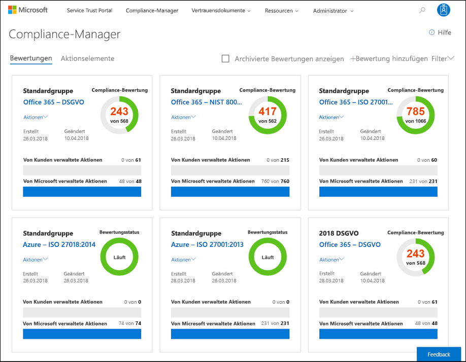

## Zugreifen auf den Compliance-Manager

Sie können über das Service Trust Portal auf den Compliance-Manager zugreifen. Alle Personen mit einem Microsoft-Konto oder mit einem Azure Active Directory-Organisationskonto können auf den Compliance-Manager zugreifen.
  
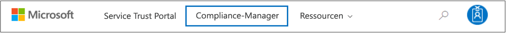
  
1. Wechseln Sie zu [https://servicetrust.microsoft.com](https://servicetrust.microsoft.com/).
    
2. Melden Sie sich mit Ihrem Azure Active Directory-Administratorkonto an.
    
3. Klicken Sie im Service Trust Portal auf **Compliance-Manager**. 
    
4. Wenn der Geheimhaltungsvertrag angezeigt wird, lesen Sie diesen, und klicken Sie dann auf **Ich stimme zu**, um den Vorgang fortzusetzen. Dieser Vorgang ist nur einmal erforderlich; daraufhin wird das Compliance-Manager-Dashboard angezeigt. 

    Um Ihnen den Einstieg zu erleichtern, haben wir standardmäßig die folgenden Bewertungen hinzugefügt:
    
    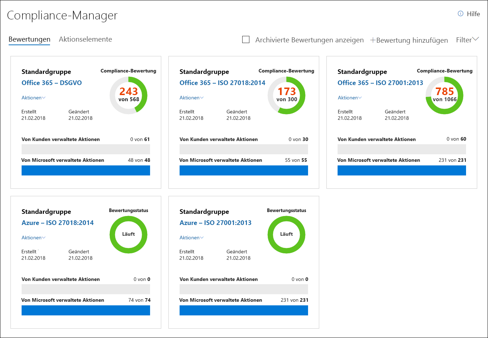
    
5. Klicken Sie auf das  **Hilfe**, um sich eine kurze Einführung in Compliance-Manager anzusehen. 
  
## Anzeigen von Aktionselementen

Compliance-Manager bietet eine praktische Ansicht aller zugewiesenen Aktionselemente von Steuerelementbewertungen, sodass Sie diese schnell und einfach umsetzen können. Sie können alle Aktionselemente anzeigen oder die Aktionselemente auswählen, die einer bestimmten Zertifizierung entsprechen, indem Sie auf die mit dieser Bewertung verbundene Registerkarte klicken. In der Abbildung unten wurde beispielswiese die DSGVO-Registerkarte ausgewählt, auf der Steuerelemente im Zusammenhang mit der DSGVO-Bewertung angezeigt werden.
  
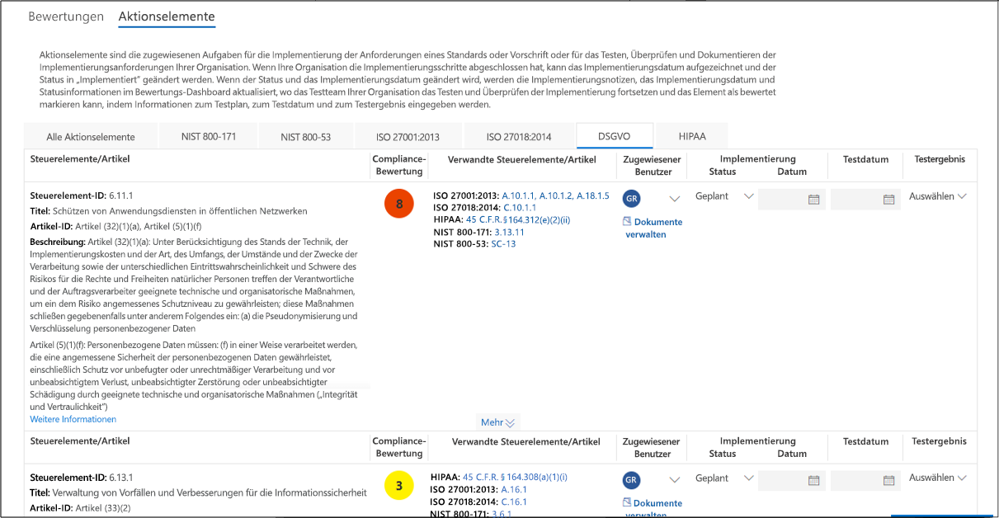
  
So zeigen Sie Ihre Aktionselemente an
  
1. Wechseln zum Compliance-Manager-Dashboard
    
2. Klicken Sie auf den Link **Aktionselemente**. Die Seite wird so aktualisiert, dass die Ihnen zugewiesenen Aktionselemente angezeigt werden. 
    
    Standardmäßig werden alle Aktionselemente angezeigt. Wenn Sie Aktionselemente in mehreren Zertifizierungen haben, werden die Namen der Zertifizierungen in den Registerkarten am oberen Rand des Bewertungssteuerelements aufgeführt. Um die Aktionselemente für eine bestimmte Zertifizierung anzuzeigen, klicken Sie auf diese Registerkarte.

## Hinzufügen einer Bewertung

So fügen Sie eine Bewertung zu Compliance-Manager hinzu
  
1. Klicken Sie im Compliance-Manager-Dashboard auf  **Bewertung hinzufügen**. 
    
2. Im Fenster **Bewertung hinzufügen** können Sie eine neue Gruppe zum Hinzufügen der Bewertung erstellen, oder Sie können die Bewertung zu einer vorhandenen Gruppe hinzufügen (die integrierte Gruppe trägt den Namen „Erste Gruppe“). Je nachdem, welche Option Sie auswählen, geben Sie entweder den Namen einer neuen Gruppe ein, oder wählen Sie eine vorhandene Gruppe aus der Dropdownliste aus. Weitere Informationen finden Sie unter [Gruppieren von Bewertungen](meet-data-protection-and-regulatory-reqs-using-microsoft-cloud.md#grouping).
    
    Wenn Sie eine neue Gruppe erstellt haben, haben Sie auch die Möglichkeit, Informationen aus einer vorhandenen Gruppe in die neue Bewertung zu kopieren. Dies bedeutet, dass alle Informationen, die den Feldern für die Implementierungsdetails, den Testplan und die Verwaltungsantwort von vom Kunden verwalteten Steuerelementen aus Bewertungen in der Gruppe hinzugefügt wurden, aus der Sie Informationen kopieren, in dieselben (oder verknüpften) vom Kunden verwalteten Steuerelemente in der neuen Bewertung kopiert werden. Weitere Informationen finden Sie unter [Kopieren von Informationen aus vorhandenen Bewertungen](meet-data-protection-and-regulatory-reqs-using-microsoft-cloud.md#copying).
    
3. Klicken Sie auf **Weiter**, und gehen Sie folgendermaßen vor:
    
    a. Wählen Sie aus der Dropdownliste **Produkt auswählen** einen Microsoft-Clouddienst, den Sie im Hinblick auf Compliance bewerten möchten. 
    
    b. Wählen Sie aus der Dropdownliste **Zertifikat auswählen** ein Zertifikat zur Bewertung des ausgewählten Clouddiensts aus. 
    
4. Klicken Sie auf **Zum Dashboard hinzufügen**, um die Bewertung zu erstellen. Die Bewertung wird dem Compliance-Manager-Dashboard als neue Kachel am Ende der Liste der vorhandenen Kacheln hinzugefügt. 
    
    Auf der **Bewertungskachel** im Compliance-Manager-Dashboard werden die Bewertungsgruppierung, der Name der Bewertung (automatisch als Kombination des Dienstnamens und der ausgewählten Zertifizierung erstellt), das Erstellungsdatum, das Datum der letzten Änderung, die Gesamtbewertung (die Summe aller Risikobewertungen zugewiesener Steuerelemente, die implementiert, getestet und bestanden wurden) sowie Statusanzeigen im unteren Bereich angezeigt, in denen die Anzahl von bewerteten Steuerelementen angezeigt wird. 
    
5. Klicken Sie auf den Namen der Bewertung, um sie zu öffnen, und zeigen Sie die Details der Bewertung an.
    
6. Klicken Sie auf das Menü **Aktionen**, um die Ihnen zugewiesenen Aktionselemente anzuzeigen, benennen Sie die Bewertungsgruppe um, exportieren Sie den Bewertungsbericht oder archivieren Sie die Bewertung. 
    
    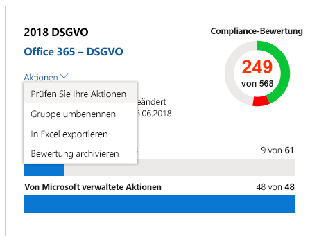

## Kopieren von Informationen aus vorhandenen Bewertungen

Beim Erstellen einer neuen Bewertungsgruppe haben Sie, wie zuvor beschrieben, die Möglichkeit, Informationen aus Bewertungen in einer vorhandenen Gruppe in die neue Bewertung in der neuen Gruppe zu kopieren. Auf diese Weise können Sie die abgeschlossene Bewertungs- und Testarbeit in denselben vom Kunden verwalteten Steuerelementen in die neue Bewertung übernehmen. Wenn Sie beispielsweise eine Gruppe für alle Bewertungen im Zusammenhang mit der DSGVO in Ihrer Organisation haben, können Sie allgemeine Informationen von einer vorhandenen Bewertung kopieren, wenn Sie eine neue Bewertung zu der Gruppe hinzufügen.
  
Sie können die folgenden Informationen von Kunden in eine neuen Bewertung kopieren:
  
- Bewertungsbenutzer. Ein Bewertungsbenutzer ist ein Benutzer, dem das Steuerelement zugewiesen ist.
    
- Status, Testdatum und Testergebnisse.
    
- Implementierungsdetails und Testplaninformationen
    
In ähnlicher Weise werden Informationen aus freigegebenen vom Kunden verwalteten Steuerelementen innerhalb der gleichen Bewertungsgruppe synchronisiert. Und Informationen in verknüpften vom Kunden verwalteten Steuerelementen innerhalb der gleichen Bewertungsgruppe werden ebenfalls synchronisiert.

## Anzeigen von Bewertungen

1. Suchen Sie die Bewertungskachel, die der Bewertung entspricht, die Sie anzeigen möchten. Klicken Sie dann auf den Bewertungsnamen, um diese zu öffnen, und zeigen Sie die von Microsoft und von Kunden verwalteten Steuerelemente die mit der Bewertung verknüpft sind, sowie eine Liste der Clouddienste an, die sich im Bereich der Bewertung befinden. Nachfolgend finden Sie ein Beispiel der Bewertung für Office 365 und DSGVO.
    
    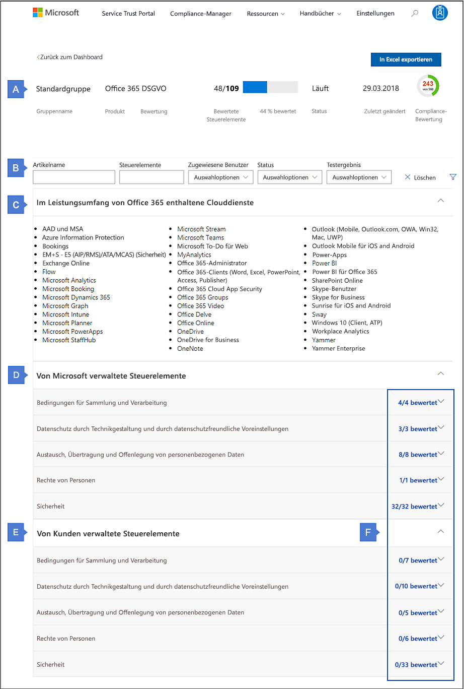
  
1. In diesem Abschnitt wird die Bewertungszusammenfassung, einschließlich des Namens der Bewertungsgruppierung, des Produkts, des Bewertungsnamens und der Anzahl von Bewertungssteuerelementen, angezeigt.
    
2. In diesem Abschnitt werden die Steuerelemente für den Bewertungsfilter angezeigt. Eine ausführlichere Erläuterung der Verwendung von Steuerelementen für den Bewertungsfilter finden Sie im Abschnitt [Verwalten des Bewertungsprozesses](meet-data-protection-and-regulatory-reqs-using-microsoft-cloud.md#managecomplianceprocess_1). 
    
3. In diesem Abschnitt werden die einzelnen Clouddienste dargestellt, die sich im Bereich der Bewertung befinden.
    
4. Dieser Abschnitt enthält von Microsoft verwaltete Steuerelemente. Verwandte Steuerelemente werden nach Steuerelementfamilie geordnet. Klicken Sie auf eine Steuerelementfamilie, um diese zu erweitern und die einzelnen Steuerelemente anzuzeigen.
    
5. Dieser Abschnitt enthält vom Kunden verwaltete Steuerelemente, die auch nach Steuerelementfamilie organisiert werden. Klicken Sie auf eine Steuerelementfamilie, um diese zu erweitern und die einzelnen Steuerelemente anzuzeigen.
    
6. Zeigt die Gesamtzahl der Steuerelemente in der Steuerelementfamilie an und wie viele dieser Steuerelemente bewertet wurden. Eine wichtige Funktion von Compliance-Manager ist die Nachverfolgung des Fortschritts der Organisation im Hinblick auf die Bewertung der vom Benutzer verwalteten Steuerelemente. Weitere Informationen finden Sie im Abschnitt [Grundlegendes zur Compliance-Bewertung](meet-data-protection-and-regulatory-reqs-using-microsoft-cloud.md#compliancescore). 

## Verwaltung des Bewertungsprozesses

Zunächst ist der Ersteller einer Bewertung der einzige Bewertungsbenutzer. Für jedes vom Kunden verwaltete Steuerelement können Sie einer Person in Ihrer Organisation ein Aktionselement zuweisen, damit diese Person ein Bewertungsbenutzer wird, der die empfohlenen Kundenaktionen ausführen kann, und Nachweise zusammentragen und hochladen kann. Wenn Sie ein Aktionselement zuweisen, können Sie eine E-Mail mit Details zu den empfohlenen Kundenaktionen und der Aktionselementpriorität an die Person senden. Die E-Mail-Benachrichtigung enthält einen Link zum Dashboard **Aktionselemente**, in dem alle dieser Person zugewiesenen Aktionselemente aufgeführt sind.  
  
Nachfolgend finden Sie eine Liste von Aufgaben, die Sie mithilfe der Workflowfeatures von Compliance-Manager ausführen können.
  
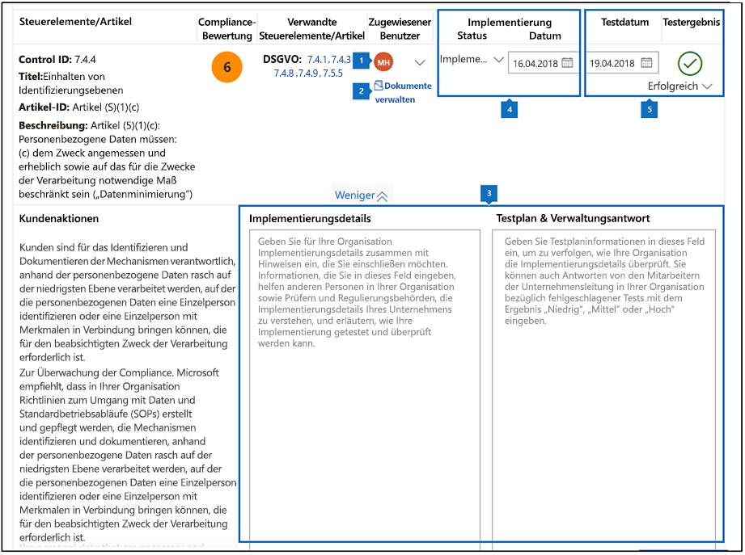
  
1. **Verwenden der Filteroptionen, um bestimmte Bewertungssteuerelemente zu finden**: Compliance-Manager bietet **Filteroptionen**, mit denen Sie hochgranulare Auswahlkriterien zum Anzeigen von Bewertungssteuerelementen enthalten, sodass Sie auf bestimmte Bereiche Ihrer Compliancebemühungen abzielen können. 
    
    Klicken Sie auf das Trichtersymbol auf der rechten Seite der Seite, um die Steuerelemente **Filteroptionen** anzuzeigen oder auszublenden. Mit diesen Steuerelementen können Sie Filterkriterien angeben; nachfolgend werden nur die Bewertungssteuerelemente anzeigt, die diesen Kriterien entsprechen.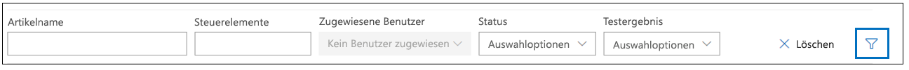
  
    - **Artikel**: Filtert nach dem Artikelnamen und gibt die Bewertungssteuerelemente im Zusammenhang mit diesem Artikel zurück. Wenn Sie z. B. „Artikel (5)“ eingeben, wird eine Auswahlliste von Artikeln zurückgegeben, deren Name diese Zeichenfolge enthält, also Artikel (5)(1)(a), Artikel (5)(1)(b), Artikel (5)(1)(c) usw. Wenn Sie „Artikel (5)(1)(c)“ auswählen, werden die Steuerelemente im Zusammenhang mit Artikel (5)(1)(c) zurückgegeben. Dies ist ein Mehrfachauswahlfeld, das einen OR-Operator mit mehreren Werten verwendet, wenn Sie z. B. Artikel (5)(1)(a) auswählen und dann Artikel (5)(1)(c) hinzufügen, gibt der Filter Steuerelemente im Zusammenhang mit Artikel (5)(1)(a) oder Artikel (5)(1)(c) zurück. 
    
      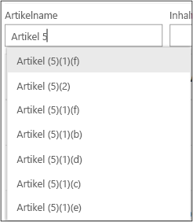
  
    - **Steuerelemente**: Gibt die Liste von Steuerelementen zurück, deren Namen zu dem Filter passen. Wenn Sie also 7.3 eingeben, wird eine Auswahlliste von Elementen wie 7.3.1, 7.3.4, 7.3.5 usw. zurückgegeben. Dies ist ein Mehrfachauswahlfeld, das einen OR-Operator mit mehreren Werten verwendet, wenn Sie 7.3.1 auswählen und dann 7.3.4 hinzufügen, gibt der Filter Steuerelemente im Zusammenhang mit 7.3.1 oder 7.3.4 zurück. 
    
      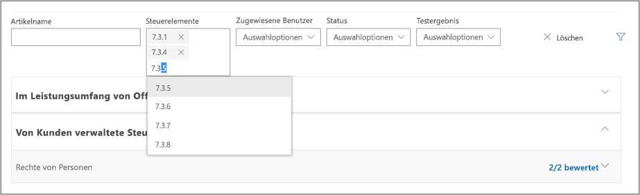
  
    - **Zugewiesene Benutzer**: Gibt die Liste von Steuerelementen zurück, die dem ausgewählten Benutzer zugewiesen sind. 
    
    - **Status**: Gibt die Liste der Steuerelemente mit dem ausgewählten Status zurück. 
    
    - **Testergebnis**: Gibt die Liste der Steuerelemente mit dem ausgewählten Testergebnis zurück. 
    
    Wenn Sie Filterbedingungen anwenden, ändert sich die Ansicht zutreffender Steuerelemente entsprechend der Filterbedingungen. Erweitern Sie die Steuerelementfamilienbereiche, um die folgenden Steuerelementdetails anzuzeigen. 
    
    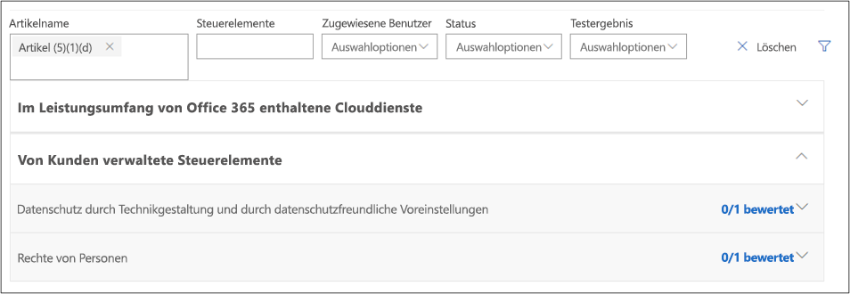
  
2. Wenn nach dem Auswählen der gewünschten Filter keine Ergebnisse angezeigt werden, bedeutet das, dass es keine Steuerelemente gibt, die den angegebenen Filterbedingungen entsprechen. Wenn Sie zum Beispiel einen bestimmten **zugewiesenen Benutzer** und dann einen **Steuerelement**namen auswählen, der dem diesem Benutzer zugewiesenen Steuerelement entspricht, werden auf der folgenden Seite keine Bewertungen angezeigt. 
    
3. **Zuweisen eines Aktionselements zu einem Benutzer**: Sie können ein Aktionselement einer Person zuweisen, um die Anforderungen einer Zertifizierung/Vorschrift zu implementieren oder die Implementierungsanforderungen Ihrer Organisation zu testen, zu überprüfen und zu dokumentieren. Wenn Sie ein Aktionselement zuweisen, können Sie eine E-Mail mit Details zu den empfohlenen Kundenaktionen und der Aktionselementpriorität an die Person senden. Sie können die Zuweisung eines Aktionselements auch aufheben oder ein Aktionselement einer anderen Person erneut zuweisen. 
    
4. **Verwalten von Dokumenten**: Vom Kunden verwaltete Steuerelemente weisen auch einen Platz zum Verwalten der Dokumente auf, die im Zusammenhang mit dem Ausführen von Implementierungs-, Test- und Überprüfungsaufgaben stehen. Alle Personen mit Berechtigungen zum Bearbeiten von Daten im Compliance-Manager können Dokumente durch Klicken auf **Dokumente verwalten** hochladen. Nachdem ein Dokument hochgeladen wurde, können Sie auf **Dokumente klicken**, um Dateien anzuzeigen und herunterzuladen. 
    
5. **Bereitstellen von Implementierungs- und Testdetails**: Jedes vom Kunden verwaltete Steuerelement weist ein bearbeitbares Feld auf, in das Benutzer Implementierungsdetails eingeben können, in denen die Schritte dokumentiert werden, die von Ihrer Organisation zur Erfüllung der Anforderungen der Zertifizierung/Vorschrift und zur Prüfung und Dokumentation unternommen werden, wie diese Anforderungen erfüllt werden.
    
6. **Festlegen des Status**: Legen Sie den Status für jedes Element im Rahmen des Bewertungsprozesses fest. Die verfügbaren Statuswerte sind **Implementiert**, **Alternative Implementierung**, **Geplant** und **Nicht im Umfang**. 
    
7. **Eingeben des Testdatums und des Testergebnisses**: Die Person mit der Rolle des Compliance-Manager-Prüfers kann überprüfen, ob korrekte Tests durchgeführt werden, kann die Implementierungsdetails, den Testplan, die Testergebnisse und alle hochgeladenen Nachweise überprüfen und dann das Testdatum und das Testergebnis festlegen. Verfügbare Testergebniswerte sind **Bestanden**, **Fehler, niedriges Risiko**, **Fehler, mittleres Risik****o** und **Fehler, hohes Risiko**. 

## Verwalten von Aktionselementen

Die Personen in Ihrer Organisation, die am Bewertungsprozess beteiligt sind, können Compliance-Manager verwenden, um die vom Kunden verwalteten Steuerelemente aus allen Bewertungen, für die sie Benutzer sind, zu überprüfen. Wenn sich ein Benutzer bei Compliance-Manager anmeldet und das Dashboard **Aktionen** öffnet, wird eine Liste von Aktionselementen angezeigt, die dem Benutzer zugewiesen sind. In Abhängigkeit von der dem Benutzer zugewiesenen Compliance-Manager-Rolle kann dieser Implementierung- oder Testdetails bereitstellen, den Status aktualisieren oder Aktionselemente zuweisen. 
  
Da Zertifizierungssteuerelemente im Allgemeinen von einer Person implementiert und von einer anderen getestet werden, kann das Aktionselement zunächst einer Person für die Implementierung zugewiesen werden. Sobald diese abgeschlossen ist, kann die Person das Aktionselement der nächsten Person zum Testen und Hochladen von Nachweisen zuweisen. Diese Zuweisung/erneute Zuweisung von Steuerelementaktionen kann von allen Benutzern ausgeführt werden, die über eine Compliance-Manager-Rolle mit ausreichenden Berechtigungen verfügen, sodass je nach Bedarf eine zentrale Verwaltung von Steuerelementzuweisungen oder eine dezentralisierte Weiterleitung von Aktionselementen vom Implementierer an den Tester erfolgen kann.
  
So weisen Sie ein Aktionselement zu
  
1. Suchen Sie im Compliance-Manager-Dashboard die Bewertungskachel der Bewertung, mit der Sie arbeiten möchten, und klicken Sie auf den Namen der Bewertung, um zur Detailseite der Bewertung zu wechseln.
    
2. Klicken Sie auf **Filter**, und verwenden Sie die Filtersteuerelemente, um das jeweilige Bewertungssteuerelement zu finden, das Sie zuweisen möchten. Oder: 
    
3. Führen Sie einen Bildlauf nach unten zum Abschnitt mit den vom Kunden verwalteten Steuerelementen aus, erweitern Sie die Steuerelementfamilie, und führen Sie einen Bildlauf durch die Liste von Steuerelementen aus, bis Sie das Bewertungssteuerelement gefunden haben, das Sie zuweisen möchten.
    
4. Klicken Sie in der Spalte **Zugewiesener Benutzer** auf **Zuweisen**. 
    
5. Klicken Sie im Dialogfeld „Aktionselement zuweisen“ auf das Feld **Assign To**, um die Liste von Benutzern aufzufüllen, denen die Aktion zugewiesen werden kann. Sie können durch die Liste scrollen, um den gewünschten Benutzer zu finden, oder Sie beginnen mit der Eingabe im Feld, um nach dem Benutzernamen zu suchen. 
    
6. Klicken Sie auf den Benutzer, um diesem das Aktionselement zuzuweisen.
    
7. Wenn Sie eine E-Mail-Benachrichtigung an den Benutzer senden möchten, aktivieren Sie das Kontrollkästchen **E-Mail-Benachrichtigung senden**. 
    
8. Geben Sie Hinweise ein, die für diesen Benutzer angezeigt werden sollen, und klicken Sie auf **Zuweisen**. 
 
    Der Benutzer erhält eine Benachrichtigung über die Zuweisung des Aktionselements sowie alle Hinweise, die Sie eingegeben haben.
    
Die dem Aktionselement zugewiesenen Hinweise werden im Hinweisbereich gespeichert und stehen somit bei der nächsten Zuweisung des Aktionselement zur Verfügung. Diese Hinweise sind nicht schreibgeschützt und können von der Person, die das Aktionselement zuweist, bearbeitet, ersetzt oder entfernt werden.

## Exportieren von Informationen aus einer Bewertung

Sie können eine Bewertung in eine Excel-Datei exportieren, die von den Beteiligten an der Compliance in Ihrer Organisation überprüft und Prüfern und Aufsichtsbehörden bereitgestellt werden kann. Dieser Bewertungsbericht ist eine Momentaufnahme der Bewertung an dem Tag und zu der Uhrzeit, zu der der Bericht erstellt wurde, und enthält die Details zu von Microsoft und von Kunden verwalteten Steuerelementen für diese Bewertung, einschließlich des Status der Steuerelementimplementierung sowie des Testdatums des Steuerelements und des Testergebnisses, und bietet Links zu den hochgeladenen Nachweisdokumenten. Es wird empfohlen, dass Sie den Bewertungsbericht exportieren, bevor Sie eine Bewertung archivieren, da in archivierten Bewertungen die Links zu hochgeladenen Dokumenten nicht gespeichert werden.
  
So exportieren Sie einen Bewertungsbericht
  
- Klicken Sie im Compliance-Manager-Dashboard auf der Kachel der Bewertung, die Sie exportieren möchten, auf **Aktionen**, und wählen Sie dann **Nach Excel exportieren** aus.

  Oder
    
- Wenn Sie die Seite mit den Bewertungsdetails anzeigen, klicken Sie auf die Schaltfläche **Nach Excel exportieren**, die sich in der oberen rechten Ecke der Seite über der Compliance-Bewertung der Bewertung befindet.
    
Der Bewertungsbericht wird in der Browsersitzung heruntergeladen. Wenn kein Popupfenster angezeigt wird, in dem Sie darüber informiert werden, sollten Sie den Downloadordner Ihres Browsers überprüfen.

## Archivieren einer Bewertung

Wenn Sie eine Bewertung abgeschlossen haben und diese nicht mehr für Compliance-Zwecke benötigen, können Sie sie archivieren. Wenn eine Bewertung archiviert werden, wird sie aus dem Bewertungs-Dashboard entfernt.
  
> [!NOTE]
> Wenn eine Bewertung archiviert wird, kann die Archivierung nicht rückgängig gemacht oder die Bewertung in einem Schreib-Lesestatus wiederhergestellt werden. Beachten Sie, dass in archivierten Bewertungen nicht die Links zu hochgeladenen Nachweisdokumenten gespeichert werden, es wird daher dringend empfohlen, dass Sie die Datei vor dem Archivieren exportieren, da der exportierte Bewertungsbericht Links zu den Nachweisdokumenten enthält, sodass Sie weiterhin darauf zugreifen können. 
  
So archivieren Sie eine Bewertung
  
1. Klicken Sie auf der Dashboardkachel der gewünschten Bewertung auf **Aktionen**. 
    
2. Wählen Sie **Bewertung archivieren** aus. 
 
    Das Dialogfeld **Bewertungen archivieren** wird angezeigt, und Sie werden aufgefordert zu bestätigen, dass Sie die Bewertung archivieren möchten.
    
4. Um mit der Archivierung fortzufahren, klicken Sie auf **Archivieren**. Andernfalls klicken Sie auf **Abbrechen**. 
    
So zeigen Sie archivierte Bewertungen an
  
1. Aktivieren Sie im Compliance-Manager-Dashboard das Kontrollkästchen zum **Anzeigen der archivierten Bewertungen**. 
    
    Die archivierten Bewertungen werden in einem neuen sichtbaren Bereich unter den restlichen aktiven Bewertungen unter einen Leiste mit dem Namen **Archivierte Bewertungen** angezeigt.
    
3. Klicken Sie auf den Namen der Bewertung, die Sie anzeigen möchten.
    
Wenn Sie eine archivierte Bewertung anzeigen, ist keines der normalerweise bearbeitbaren Steuerelemente (d. h. Implementierung, Testergebnisse) aktiv, und die Schaltfläche **Verwaltete Dokumente** ist nicht vorhanden.

## Verwenden der Suche

  
Klicken Sie in der oberen rechten Ecke der Seite auf die Lupe, um das Sucheingabefeld zu erweitern, geben Sie Ihre Suchbegriffe ein, und drücken Sie die EINGABETASTE. Die Suchsteuerung wird mit dem Suchbegriff im Sucheingabefeld angezeigt; die Suchergebnisse werden darunter angezeigt.
  
Standardmäßig gibt die Suche Dokumentergebnisse zurück, und Sie können die Dropdownlisten „Filtern nach“ verwenden, um die Liste der angezeigten Dokumente zu optimieren oder um Suchergebnisse zu der Ansicht hinzuzufügen oder daraus zu entfernen. Sie können mehrere Filterattribute gleichzeitig verwenden, um die zurückgegebenen Dokumente auf bestimmte Clouddienste, Kategorien von Compliance- oder Sicherheitspraktiken, Regionen oder Branchen einzugrenzen. Klicken Sie auf den Link für den Dokumentnamen, um das Dokument herunterzuladen.
  

  
Klicken Sie auf den Compliance-Manager-Link, um Suchergebnisse für Bewertungssteuerelemente von Compliance-Manager anzuzeigen. In den aufgeführten Suchergebnissen wird das Datum angezeigt, an dem die Bewertung erstellt wurde, der Name der Bewertungsgruppierung, der zutreffende Clouddienst und ob es sich bei dem Steuerelement um ein von Microsoft oder ein vom Kunden verwaltetes Steuerelement handelt.
  

  
> [!NOTE]
> Service Trust Portal-Berichte und -Dokumente können nun für mindestens 12 Monate nach ihrer Veröffentlichung oder bis eine neue Dokumentversion verfügbar wird, heruntergeladen werden. 
 
## Unterstützung der Lokalisierung

Im Service Trust Portal können Sie Seiteninhalte in unterschiedlichen Sprachen anzeigen. Um die Seitensprache zu ändern, klicken Sie einfach auf das Weltkugelsymbol in der Ecke links unten, und wählen Sie die gewünschte Sprache aus. 
  

## Änderungsprotokoll für vom Kunden verwaltete Steuerelemente

Compliance-Manager ist so konzipiert, dass eine regelmäßige Aktualisierung stattfindet, um mit Änderungen in behördlichen Vorschriften sowie mit Änderungen in unseren Clouddiensten Schritt halten zu können. Diese Updates umfassen Änderungen an den vom Kunden verwalteten Steuerelementen. Es wird ein Änderungsprotokoll bereitgestellt, damit Sie die Auswirkungen dieser Änderungen, einschließlich der Details der Inhalte, die hinzugefügt oder geändert werden, besser verstehen und Hilfestellung dazu erhalten, welche Auswirkungen die Änderungen auf vorhandene Bewertungen haben. Im Allgemeinen gibt es zwei Arten von Änderungen:
  
- Eine **größere** Änderung ist eine wesentliche Änderung an einer Kundenaktion, z. B. das Hinzufügen oder Entfernen eines Steuerelements oder spezielle nummerierte Schritte, oder eine Änderung der Leitfäden im Zusammenhang mit Verantwortlichkeiten, Empfehlungen oder Nachweisen. Bei größeren Änderungen empfehlen wir, dass Sie Ihre Implementierung und/oder Bewertung des betroffenen Steuerelements erneut bewerten.
    
- Eine **kleinere** Änderung ist eine geringfügige Änderung an Kundenaktionen, z. B. die Korrektur eines Tippfehlers oder eines Formatierungsproblems oder das Aktualisieren oder Korrigieren von Hyperlinks. Bei kleineren Änderungen muss dass Steuerelement in der Regel nicht erneut bewertet werden, wir empfehlen aber, dass Sie die aktualisierte Kundenaktion überprüfen.
  
### Vom Kunden verwaltete Steuerelemente in Office 365 – Änderungsprotokoll für Juli 2018

|**Steuerelement-ID**|**Bewertung**|**Art der Änderung**|**Beschreibung der Änderung**|**Empfohlene Aktionen für Kunden**|
|:-----|:-----|:-----|:-----|:-----|:-----|:-----|:-----|:-----|
|45 C.F.R. § 164.308(a)(7)(ii)(A)  |Office 365: HIPAA|Größer|HITECH-Steuerelement wurde zur HIPAA-Bewertung für Office 365 hinzugefügt |Sehen Sie sich das hinzugefügte Steuerelement und die empfohlenen Kundenaktionen an.  |
|45 C.F.R.  164.312(a)(6)(ii)|Office 365: HIPAA|Größer|HITECH-Steuerelement wurde zur HIPAA-Bewertung für Office 365 hinzugefügt|Sehen Sie sich das hinzugefügte Steuerelement und die empfohlenen Kundenaktionen an. |
45 C.F.R. § 164.312(c)(1)| Office 365: HIPAA|Größer| HITECH-Steuerelement wurde zur HIPAA-Bewertung für Office 365 hinzugefügt |Sehen Sie sich das hinzugefügte Steuerelement und die empfohlenen Kundenaktionen an.  |
45 C.F.R.  § 164.316(b)(2)(iii)| Office 365: HIPAA|Größer|HITECH-Steuerelement wurde zur HIPAA-Bewertung für Office 365 hinzugefügt|Sehen Sie sich das hinzugefügte Steuerelement und die empfohlenen Kundenaktionen an. |
|

### Vom Kunden verwaltete Steuerelemente in Office 365 – Änderungsprotokoll für April 2018

|**DSGVO**|**HIPAA**|**ISO 27001**|**ISO 27018**|**NIST 800-53**|**NIST 800-171**|**Art der Änderung**|**Beschreibung der Änderung**|**Empfohlene Aktionen für Kunden**|
|:-----|:-----|:-----|:-----|:-----|:-----|:-----|:-----|:-----|
|6.13.2    |||C.16.1.1    |||Größer    |Bisher nummeriert als 6.12.1.1.    Es wurden Informationen zu Empfehlungen hinzugefügt.    |Bewerten Sie das Steuerelement erneut: Sehen Sie sich die aktualisierten Leitfäden in den Kundenaktionen an, und befolgen Sie die empfohlenen Schritte zum Implementieren und Bewerten des Steuerelements.    |
||||||3.1.6    |Größer    |Es wurden Schritte zu Leitfäden hinzugefügt, die das Aktivieren der Überwachung und das Durchsuchen von Überwachungsprotokollen umfassen.    |Überprüfen Sie die aktualisierten Empfehlungen in den Kundenaktionen.    |
|6.8.2    |||A.10.2    |||Größer    |Bisher nummeriert als 6.7.2.9.    Aktualisierte Leitfäden mit zusätzliche Informationen und Aktionselementen.    |Bewerten Sie das Steuerelement erneut: Sehen Sie sich die aktualisierten Leitfäden in den Kundenaktionen an, und befolgen Sie die empfohlenen Schritte zum Implementieren und Bewerten des Steuerelements.    |
|6.6.4    |45 C.F.R. § 164.312(a)(2)(i)              45 C.F.R. § 164.312(d)    |A.9.4.2    ||IA-2    |3.5.1    |Größer    |Bisher nummeriert als 6.5.2.3.    Aktualisierte Leitfäden mit zusätzliche Informationen und Aktionselementen.    |Bewerten Sie das Steuerelement erneut: Sehen Sie sich die aktualisierten Leitfäden in den Kundenaktionen an, und befolgen Sie die empfohlenen Schritte zum Implementieren und Bewerten des Steuerelements.    |
|6.13.1    |45 C.F.R. § 164.308(a)(1)(i)    |A.16.1    |C.16.1    |IR-4(a)    |3.6.1    |Größer    |Bisher nummeriert als 6.12.1.    Aktualisierte Leitfäden mit zusätzliche Informationen und Aktionselementen.    |Bewerten Sie das Steuerelement erneut: Sehen Sie sich die aktualisierten Leitfäden in den Kundenaktionen an, und befolgen Sie die empfohlenen Schritte zum Implementieren und Bewerten des Steuerelements.    |
|6.7    ||||||Größer    |Bisher nummeriert als 6.6.1.1.    Aktualisierte Leitfäden mit zusätzliche Informationen und Aktionselementen.    |Bewerten Sie das Steuerelement erneut: Sehen Sie sich die aktualisierten Leitfäden in den Kundenaktionen an, und befolgen Sie die empfohlenen Schritte zum Implementieren und Bewerten des Steuerelements.    |
|6.6.5    |||A.10.8    |IA-3    |3.5.2    |Größer    |Bisher nummeriert als 6.5.4.2.    Aktualisierte Leitfäden mit zusätzliche Informationen und Aktionselementen.    |Bewerten Sie das Steuerelement erneut: Sehen Sie sich die aktualisierten Leitfäden in den Kundenaktionen an, und befolgen Sie die empfohlenen Schritte zum Implementieren und Bewerten des Steuerelements.    |
|6.15.1    ||||||Größer    |Bisher nummeriert als 6.14.1.3.    Aktualisierte Leitfäden mit zusätzliche Informationen und Aktionselementen.    |Bewerten Sie das Steuerelement erneut: Sehen Sie sich die aktualisierten Leitfäden in den Kundenaktionen an, und befolgen Sie die empfohlenen Schritte zum Implementieren und Bewerten des Steuerelements.    |
|||||AC-2(h)(2)    ||Kleiner    |Es wurde ein Link zum Blatt „Überwachung aktivieren“ hinzugefügt.    |Keine Aktion erforderlich.    |
|||||AC-2(7)(b)    ||Kleiner    |Es wurde ein Link zum Blatt „Überwachung aktivieren“ hinzugefügt.    |Keine Aktion erforderlich.    |
|||||AC-2(h)(1)    ||Kleiner    |Es wurde ein Link zum Blatt „Überwachung aktivieren“ hinzugefügt.    |Keine Aktion erforderlich.    |
||45 C.F.R. § 164.308(a)(5)(ii)(C)    |||AC-2(g)    ||Kleiner    |Es wurde ein Link zum Blatt „Überwachung aktivieren“ hinzugefügt.    |Keine Aktion erforderlich.    |
|||||AC-2(12)    ||Kleiner    |Es wurde ein Link zum Blatt „Überwachung aktivieren“ hinzugefügt.    |Keine Aktion erforderlich.    |
||45 C.F.R. § 164.312(b)    |A.12.4.3    ||AU-2(d)    ||Kleiner    |Es wurde ein Link zum Blatt „Überwachung aktivieren“ hinzugefügt.    |Keine Aktion erforderlich.    |
|||||AC-2(4)    ||Kleiner    |Es wurde ein Link zum Blatt „Überwachung aktivieren“ hinzugefügt.    |Keine Aktion erforderlich.    |
||||||3.1.7    |Kleiner    |Es wurde ein Link zum Blatt „Überwachung aktivieren“ hinzugefügt.    |Keine Aktion erforderlich.    |
|||A.16.1.7    |C.12.4.2, Teil 2    |||Kleiner    |Es wurde ein Link zum Blatt „Überwachung aktivieren“ hinzugefügt.    |Keine Aktion erforderlich.    |
|||||AC-2(h)(3)    ||Kleiner    |Es wurde ein Link zum Blatt „Überwachung aktivieren“ hinzugefügt.    |Keine Aktion erforderlich.    |
|||A.12.4.2    ||||Kleiner    |Es wurde ein Link zum Blatt „Überwachung aktivieren“ hinzugefügt.    |Keine Aktion erforderlich.    |
|||A.7.2.8    ||||Kleiner    |Es wurden Links zum Blatt „Inhaltssuche“ und zum DSR-Portal hinzugefügt.    |Keine Aktion erforderlich.    |
||45 C.F.R. § 164.308(a)(3)(ii)(C)    |||||Kleiner    |Es wurden Links zum Blatt „Überwachung aktivieren“ und zu den Unterstützungsthemen für die Office 365-Administratorrolle hinzugefügt.    |Keine Aktion erforderlich.    |
|5.2.1    ||||||Kleiner    |Bisher nummeriert als 5.2.2.    Verantwortlichkeiten des Kunden wurden in den Leitfäden definiert.    |Überprüfen Sie die aktualisierten Empfehlungen in den Kundenaktionen.    |
|6.11.1    |45 C.F.R. § 164.312(e)(2)(ii)    |A.10.1.1          A.10.1.2          A.18.1.5    |C.10.1.1    |SC-13    |3.13.11    |Kleiner    |Bisher nummeriert als 6.10.1.2.    Ein Tippfehler wurde korrigiert.    |Keine Aktion erforderlich.    |
|7.5.1    ||||||Kleiner    |Bisher nummeriert als A.7.4.1.    Ein Tippfehler wurde korrigiert.    |Keine Aktion erforderlich.    |
|||A.8.2.3    |||3.1.3    |Kleiner    |Ein zusätzlicher unnötiger Satz wurde entfernt.    |Keine Aktion erforderlich.    |
||45 C.F.R. § 164.308(a)(4)(i)    |A.6.1.2    ||AC-5(a)    |3.1.2          3.1.4    |Kleiner    |Aktualisierte Leitfäden mit zusätzliche Informationen und Aktionselementen.    |Überprüfen Sie die aktualisierten Empfehlungen in den Kundenaktionen.    |
||45 C.F.R. § 164.308(a)(7)(ii)(C)    |||RA-2(a)    ||Kleiner    |Der Hilfethemenlink zum Importdienst wurde so aktualisiert, dass FWLink verwendet wird.    |Keine Aktion erforderlich.    |
|

### Referenz zur Änderung der Steuerelement-ID für DSGVO Bewertung – Änderungsprotokoll für Februar 2018 

|**Bisherige Steuerelement-ID (November 2017: Vorschau)**|**Neue Steuerelement-ID (Februar 2018: GA-Version)**|
|:-----|:-----|
|5.2.2    |5.2.1    |
|5.2.3    |5.2.2    |
|5.2.4    |5.2.3    |
|6.1.1.1    |6.2    |
|6.10.1.2    |6.11.1    |
|6.10.2.5    |6.11.2    |
|6.11.1.2    |6.12    |
|6.12.1    |6.13.1    |
|6.12.1.1    |6.13.2    |
|6.12.1.5    |6.13.3    |
|6.14.1.3    |6.15.1    |
|6.14.2.1    |6.15.2    |
|6.14.2.3    |6.15.3    |
|6.2.1.1    |6.3    |
|6.3.2.2    |6.4    |
|6.4.3.1    |6.5.2    |
|6.4.3.2    |6.8.1    |
|6.4.3.3    |6.5.3    |
|6.5.2    |6.6.1    |
|6.5.2.1    |6.6.2    |
|6.5.2.2    |6.6.3    |
|6.5.2.3    |6.6.4    |
|6.5.4.2    |6.6.5    |
|6.6.1.1    |6.7      |
|6.7.2.7    |6.8.1    |
|6.7.2.9    |6.8.2    |
|6.8.1.4    |6.9.1    |
|6.8.4.1    |6.9.3    |
|6.8.4.2    |6.9.4    |
|6.9.2.1    |6.10.1   |
|6.9.2.3    |6.10.2   |
|A.7.1.1    |7.2.1    |
|A.7.1.2    |7.2.2    |
|A.7.1.3    |7.2.3    |
|A.7.1.4    |7.2.4    |
|A.7.1.5    |7.2.5    |
|A.7.1.6    |7.2.6    |
|A.7.1.7    |7.2.7    |
|A.7.2.1    |7.3.1    |
|A.7.2.10   |7.3.9    |
|A.7.2.11   |7.3.10   |
|A.7.2.2    |7.3.2    |
|A.7.2.3    |7.3.3    |
|A.7.2.4    |7.3.4    |
|A.7.2.5    |7.3.5    |
|A.7.2.6    |7.3.6    |
|A.7.2.7    |7.3.7    |
|A.7.2.8    |7.3.8    |
|A.7.3.1    |7.4.1    |
|A.7.3.10   |7.4.10   |
|A.7.3.2    |7.4.2    |
|A.7.3.3    |7.4.3    |
|A.7.3.4    |7.4.4    |
|A.7.3.5    |7.4.5    |
|A.7.3.6    |7.4.6    |
|A.7.3.7    |7.4.7    |
|A.7.3.8    |7.4.8    |
|A.7.3.9    |7.4.9    |
|A.7.4.1    |7.5.1    |
|A.7.4.2    |7.5.2    |
|A.7.4.3    |7.5.3    |
|A.7.4.4    |7.5.4    |
|A.7.4.5    |7.5.5    |
|B.8.1.1    |8.2.1    |
|B.8.1.2    |8.2.2    |
|B.8.1.3    |8.2.3    |
|B.8.1.4    |8.2.4    |
|B.8.1.5    |8.2.5    |
|B.8.1.6    |8.2.6    |
|B.8.2.1    |8.3.1    |
|B.8.3.1    |8.4.1    |
|B.8.3.2    |8.4.2    |
|B.8.3.3    |8.4.3    |
|B.8.4.1    |8.5.1    |
|B.8.4.2    |8.5.2    |
|B.8.4.3    |8.5.4    |
|B.8.4.4    |8.5.5    |
|B.8.4.5    |8.5.3    |
|B.8.4.6    |8.5.6    |
|B.8.4.7    |8.5.7    |
|B.8.4.8    |8.5.8    |
|
   
## Siehe auch

- [Compliance-Manager interaktiv Leitfaden](https://content.cloudguides.com/guides/Compliance%20Manager)

- [Ankündigung: Allgemeine Verfügbarkeit von Compliance-Manager](https://techcommunity.microsoft.com/t5/Security-Privacy-and-Compliance/Announcing-Compliance-Manager-general-availability/ba-p/161922)

- [Mit Microsoft 365 erhalten Sie einen effizienten Informationsschutz zum Einhalten der DSGVO](https://blogs.office.com/de-DE/2018/02/22/microsoft-365-provides-an-information-protection-strategy-to-help-with-the-gdpr)
