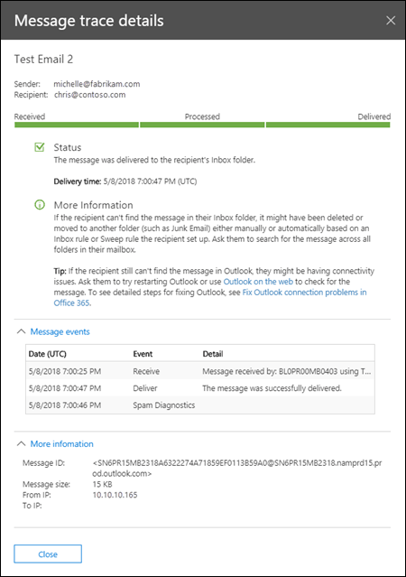

# Nachrichtenablaufverfolgung im Security & Compliance CenterMessage trace in the Security & Compliance Center

## ÜbersichtOverview

Die Nachrichtenablaufverfolgung im Security & Compliance Center befolgt e-Mail-Nachrichten, während Sie über Ihre Exchange Online-Organisation Reisen.Message trace in the Security & Compliance Center follows email messages as they travel through your Exchange Online organization. Sie können ermitteln, ob eine Nachricht empfangen, abgelehnt, zurückgestellt oder vom Dienst übermittelt wurde.You can determine if a message was received, rejected, deferred, or delivered by the service. Außerdem werden die Aktionen der Nachricht gezeigt, bevor diese ihren finalen Status erreicht hat.It also shows what actions were taken on the message before it reached its final status.

Die Nachrichtenablaufverfolgung im Security & Compliance Center verbessert die Nachrichtenablaufverfolgung, die im Exchange Admin Center (EAC) verfügbar war.Message trace in the Security & Compliance Center improves upon message trace that was available in the Exchange admin center (EAC). Sie können die Informationen aus der Nachrichtenablaufverfolgung verwenden, um Benutzer Fragen zu ihren Nachrichten zu beantworten, Probleme mit dem Nachrichtenfluss zu beheben und Richtlinienänderungen zu überprüfen.You can use the information from message trace to efficiently answer user questions about what happened to their messages, troubleshoot mail flow issues, and validate policy changes.

## Nachrichtenablaufverfolgung öffnenOpen message trace

1. [Melden Sie sich bei Office 365](https://support.office.com/article/e9eb7d51-5430-4929-91ab-6157c5a050b4) mit Ihrem Firmen- oder Schulkonto an.[Sign in to Office 365](https://support.office.com/article/e9eb7d51-5430-4929-91ab-6157c5a050b4) with your work or school account.

2. Wählen Sie das Symbol für das App-Startfeld  in der oberen linken Ecke und dann **Administrator** aus.Select the app launcher icon  in the upper-left and choose **Admin**.

3. Erweitern Sie in der unteren linken Navigationsleiste **Admin Center** , und wählen Sie **Security & Compliance**aus.In the lower-left navigation, expand **Admin centers** and select **Security & Compliance**.

4. Erweitern Sie auf der Seite **Sicherheit &-Konformität** , die geöffnet wird, die Option Nachrichten **Fluss**, und wählen Sie dann **Meldungsablauf Verfolgung**aus.In the **Security & Compliance** page that opens, expand **Mail flow**, and select **Message trace**.

## Seite "Nachrichtenablaufverfolgung"Message trace page

Von hier aus können Sie eine neue Standardablaufverfolgung starten, indem Sie auf die Schaltfläche **Trace starten** klicken.From here you can start a new default trace by clicking on the **Start a trace** button. Dadurch werden alle Nachrichten für alle Absender und Empfänger für die letzten zwei Tage gesucht.This will search for all messages for all senders and recipients for the last two days. Sie können auch eine der gespeicherten Abfragen aus den verfügbaren Abfrage Kategorien verwenden und diese entweder wie folgt ausführen oder als Ausgangspunkt für eigene Abfragen verwenden:Or you can use one of the stored queries from the available query categories and either run them as-is or use them as starting points for your own queries:

- **Standardabfragen**: integrierte Abfragen, die von Office 365 bereitgestellt werden.**Default queries**: Built-in queries provided by Office 365.

- **Benutzerdefinierte Abfragen**: von Administratoren in Ihrer Organisation gespeicherte Abfragen zur späteren Verwendung.**Custom queries**: Queries saved by admins in your organization for future use.

- **Autosaved Queries**: die letzten zehn zuletzt ausgeführten Abfragen.**Autosaved queries**: The last ten most recently run queries. Diese Liste erleichtert die Abholung, wo Sie aufgehört haben.This list makes it simple to pick up where you left off.

Auch auf dieser Seite finden Sie einen Abschnitt zum **Herunterladen von Berichten** für die von Ihnen übermittelten Anforderungen sowie die Berichte selbst, wenn der Download verfügbar ist.Also on this page is a **Downloadable reports** section for the requests you've submitted, as well as the reports themselves when they're are available for download.

## Optionen für eine neue NachrichtenablaufverfolgungOptions for a new message trace

### Filtern nach Absender und EmpfängerFilter by senders and recipients

Die Standardwerte sind **alle Absender** und **alle Empfänger**, aber Sie können die folgenden Felder zum Filtern der Ergebnisse verwenden:The default values are **All senders** and **All recipients**, but you can use the following fields to filter the results:

- **Von diesen Personen**: Klicken Sie in dieses Feld, um einen oder mehrere Absender aus Ihrer Organisation auszuwählen.**By these people**: Click in this field to select one or more senders from your organization. Sie können auch beginnen, einen Namen einzugeben, und die Elemente in der Liste werden nach Ihren Eingaben gefiltert, ähnlich wie bei einer Such Seite.You can also start to type a name and the items in the list will be filtered by what you've typed, much like how a search page behaves.

- **Für diese Personen**: Klicken Sie in dieses Feld, um einen oder mehrere Empfänger in Ihrer Organisation auszuwählen.**To these people**: Click in this field to select one or more recipients in your organization.

> [!NOTE]
> Sie können auch die e-Mail-Adressen von externen Absendern und Empfängern eingeben.You can also type the email addresses of external senders and recipients. Platzhalter werden unterstützt`*@contoso.com` ( `scot?@contoso.com`oder), aber Sie können nicht gleichzeitig mehrere Platzhaltereinträge im gleichen Feld verwenden.Wildcards are supported (`*@contoso.com` or `scot?@contoso.com`), but you can't use multiple wildcard entries in the same field at the same time. Sie können mehrere Absender oder Empfängerliste getrennt durch Semikolon (`;`) einfügen.You can paste multiple senders or recipients list separated with semicolon (`;`). Leerzeichen`\s`(), Wagenrücklauf`\r`() oder nächste Zeilen`\n`() sind zulässig.Spaces (`\s`), carriage return (`\r`) or next lines (`\n`) symbols are allowed.

### ZeitspanneTime range

Der Standardwert beträgt **2 Tage**, Sie können jedoch Datums-und Zeitbereiche von bis zu 90 Tagen angeben.The default value is **2 days**, but you can specify date/time ranges of up to 90 days. Berücksichtigen Sie bei der Verwendung von Datums-und Zeitbereichen folgende Probleme:When you use date/time ranges, consider these issues:

- Standardmäßig wählen Sie den Zeitintervall in der **Schiebe** Ansicht mit einer Zeitlinie aus.By default, you select the time range in **Slider** view using a time line. Sie können nur die angezeigten Tages-oder Uhrzeiteinstellungen auswählen.You can only select the day or time settings that are displayed. Wenn Sie versuchen, einen dazwischen liegenden Wert auszuwählen, wird die Start/End-Blase an die nächste angezeigte Einstellung ausgerichtet.Trying to select an in-between value will snap the start/end bubble to the nearest displayed setting.

   

   Sie können jedoch auch zur **benutzerdefinierten** Ansicht wechseln, in der Sie die Werte für **Start Datum** und Enddatum (einschließlich Zeiten) angeben können, und Sie können \*\*\*\* auch die Zeitzone für den Datums-und Uhrzeitbereich auswählen. \*\*\*\*But, you can also switch to **Custom** view where you can specify the **Start date** and **End date** values (including times), and you can also select the **Time zone** for the date/time range. Beachten Sie, dass die **Zeit Zonen** Einstellung sowohl für die Abfrage Eingaben als auch für die Abfrageergebnisse gilt.Note that the **Time zone** setting applies to both your query inputs and your query results.

   

   Für maximal 10 Tage stehen die Ergebnisse sofort als Zusammenfassungsbericht zur \*\*\*\* Verfügung.For 10 days or less, the results are available instantly as a **Summary** report. Wenn Sie einen Zeitabstand angeben, der sogar etwas größer als 10 Tage ist, werden die Ergebnisse verzögert, da Sie nur als herunterladbare CSV-Datei ( **Erweiterte Zusammenfassung** oder **Erweiterte** Berichte) verfügbar sind.If you specify a time range that's even slightly greater than 10 days, the results will be delayed as they are only available as a downloadable CSV file ( **Enhanced summary** or **Extended** reports).

   Weitere Informationen zu den verschiedenen Berichtstypen finden Sie im Abschnitt [berichtsTyp auswählen](#choose-report-type) in diesem Thema.For more information about the different report types, see the [Choose report type](#choose-report-type) section in this topic.

   **Hinweis**: erweiterte Zusammenfassung und erweiterte Berichte werden mit archivierten Nachrichtenablauf Verfolgungsdaten erstellt, und es kann bis zu mehreren Stunden dauern, bis der Bericht zum Download verfügbar ist.**Note**: Enhanced summary and Extended reports are prepared using archived message trace data, and it can take up to several hours before your report is available for download. Je nachdem, wie viele andere Administratoren auch Berichtsanforderungen gleichzeitig übermittelt haben, wird möglicherweise auch eine Verzögerung festgestellt, bevor die Verarbeitung für die Warteschlangen Anforderung gestartet wird.Depending on how many other admins have also submitted report requests around the same time, you might also notice a delay before processing starts for your queued request.

- Beim Speichern einer Abfrage \*\*\*\* in der Schiebe Ansicht wird der relative Zeitintervall (beispielsweise 3 Tage von heute) gespeichert.Saving a query in **Slider** view saves the relative time range (for example, 3 days from today). Beim Speichern einer Abfrage in einer **benutzerdefinierten** Ansicht wird der absolute Datum/Uhrzeit-Zeitraum (beispielsweise 2018-05-06 13:00 bis 2018-05-08 18:00) gespeichert.Saving a query in **Custom** view saves the absolute date/time range (for example, 2018-05-06 13:00 to 2018-05-08 18:00).

### Weitere SuchoptionenMore search options

#### ZustellungsstatusDelivery status

Sie können den Standardwert **alle** ausgewählt lassen, oder Sie können einen der folgenden Werte auswählen, um die Ergebnisse zu filtern:You can leave the default value **All** selected, or you can select one of the following values to filter the results:

- **Zustellung**: die Nachricht wurde erfolgreich an das vorgesehene Ziel übermittelt.**Delivered**: The message was successfully delivered to the intended destination.

- **Pending**: die Übermittlung der Nachricht wird versucht oder erneut versucht.**Pending**: Delivery of the message is being attempted or re-attempted.

- **Expanded**: ein Verteilergruppenempfänger wurde vor der Übergabe an die einzelnen Mitglieder der Gruppe erweitert.**Expanded**: A distribution group recipient was expanded before delivery to the individual members of the group.

- **Fehler**: die Nachricht wurde nicht zugestellt.**Failed**: The message was not delivered.

- **Isoliert**: die Nachricht wurde isoliert (als Spam, Massenmail oder Phishing).**Quarantined**: The message was quarantined (as spam, bulk mail, or phishing). Weitere Informationen finden Sie unter [Isolieren von e-Mail-Nachrichten in Office 365](https://support.office.com/article/4c234874-015e-4768-8495-98fcccfc639b.aspx).For more information, see [Quarantine email messages in Office 365](https://support.office.com/article/4c234874-015e-4768-8495-98fcccfc639b.aspx).

- **Gefiltert als Spam**: die Nachricht wurde als Spam identifiziert und wurde zurückgewiesen oder blockiert (nicht isoliert).**Filtered as spam**: The message was identified spam, and was rejected or blocked (not quarantined).

- **Status:** Die Nachricht wurde kürzlich von Office 365 empfangen, aber es sind noch keine anderen Statusdaten verfügbar.**Getting status:** The message was recently received by Office 365, but no other status data is yet available. Checken Sie in wenigen Minuten.Check back in a few minutes.

**Hinweis**: die Werte **Ausstehend,** **isoliert**und **Filter als Spam** sind nur für Suchvorgänge kleiner als 10 Tage verfügbar.**Note**: The values **Pending,** **Quarantined**, and **Filter as spam** are only available for searches less than 10 days. Außerdem kann es eine Verzögerung von 5 bis 10 Minuten zwischen dem tatsächlichen und dem gemeldeten Zustellungsstatus geben.Also, there might be a 5 to 10 minute delay between the actual and reported delivery status.

#### Nachrichten-IDMessage ID

Hierbei handelt es sich um die Internet Nachrichten-ID (auch als Client-ID bezeichnet), die im Nachrichtenkopf im Message **-ID:-** Kopfzeilenfeld gefunden wird.This is the internet message ID (also known as the Client ID) that's found in the **Message-ID:** header field in the message header. Benutzer können diesen Wert zur Untersuchung bestimmter Nachrichten angeben.Users can give you this value to investigate specific messages.

Dieser Wert ist für die Lebensdauer der Nachricht konstant.This value is constant for the lifetime of the message. Bei Nachrichten, die in Office 365 oder Exchange erstellt wurden, hat der `<GUID@ServerFQDN>`Wert das Format, einschließlich der\< \>spitzen Klammern ().For messages created in Office 365 or Exchange, the value is in the format `<GUID@ServerFQDN>`, including the angle brackets (\< \>). Beispiel: `<d9683b4c-127b-413a-ae2e-fa7dfb32c69d@DM3NAM06BG401.Eop-nam06.prod.protection.outlook.com>`.For example, `<d9683b4c-127b-413a-ae2e-fa7dfb32c69d@DM3NAM06BG401.Eop-nam06.prod.protection.outlook.com>`. Andere Messagingsysteme verwenden möglicherweise unterschiedliche Syntax oder Werte.Other messaging systems might use different syntax or values. Dieser Wert soll eindeutig sein, aber nicht alle e-Mail-Systeme folgen genau dieser Anforderung.This value is supposed to be unique, but not all email systems strictly follow this requirement. Wenn das **Message-ID:-** Kopfzeilenfeld für eingehende Nachrichten aus externen Quellen nicht vorhanden oder leer ist, wird ein beliebiger Wert zugewiesen.If the **Message-ID:** header field doesn't exist or is blank for incoming messages from external sources, an arbitrary value is assigned.

Wenn Sie die nach **richten-ID** zum Filtern der Ergebnisse verwenden, achten Sie darauf, dass Sie die vollständige Zeichenfolge einschließlich aller eckigen Klammern einschließen.When you use **Message ID** to filter the results, be sure to include the full string, including any angle brackets.

#### RichtungDirection

Sie können den Standardwert **alle** ausgewählt lassen, oder Sie können **eingehende** (an Empfänger in Ihrer Organisation gesendete Nachrichten) oder **ausgehende** (Nachrichten, die von Benutzern in Ihrer Organisation gesendet werden) zum Filtern der Ergebnisse auswählen.You can leave the default value **All** selected, or you can select **Inbound** (messages sent to recipients in your organization) or **Outbound** (messages sent from users in your organization) to filter the results.

#### Ursprüngliche Client-IP-AdresseOriginal client IP address

Sie können die Ergebnisse nach Client-IP-Adresse einreichen, um gehackte Computer zu untersuchen, die große Mengen an Spam oder Schadsoftware senden.You can filer the results by client IP address to investigate hacked computers that are sending large amounts of spam or malware. Obwohl die Nachrichten scheinbar von mehreren Absendern stammen, ist es wahrscheinlich, dass der gleiche Computer alle Nachrichten generiert.Although the messages might appear to come from multiple senders, it's likely that the same computer is generating all of the messages.

**Hinweis**: die Client-IP-Adressinformationen sind nur 10 Tage lang verfügbar und stehen nur in den **erweiterten Zusammenfassungen** oder **erweiterten** Berichten (herunterladbare CSV-Dateien) zur Verfügung.**Note**: The client IP address information is only available for 10 days, and is only available in the **Enhanced summary** or **Extended** reports (downloadable CSV files).

### Berichtstyp auswählenChoose report type

Die verfügbaren Berichtstypen sind:The available report types are:

- **Zusammenfassung**: verfügbar, wenn der Zeitintervall kürzer als 10 Tage ist und keine zusätzlichen Filteroptionen erforderlich sind.**Summary**: Available if the time range is less than 10 days, and requires no additional filtering options. Die Ergebnisse sind fast unmittelbar nach dem Klicken auf **Suche**verfügbar.The results are available almost immediately after you click **Search**.

- **Erweiterte Zusammenfassung** oder **erweitert**: Diese Berichte sind nur als herunterladbare CSV-Dateien verfügbar und erfordern eine oder mehrere der folgenden Filteroptionen unabhängig vom Zeitintervall: **von diesen Personen** **zu diesen Personen**oder \*\* NachRichten-ID\*\*.**Enhanced summary** or **Extended**: These reports are only available as downloadable CSV files, and require one or more of the following filtering options regardless of the time range: **By these people**, **To these people**, or **Message ID**. Sie können Platzhalter für Absender oder Empfänger verwenden (beispielsweise \*@contoso. com).You can use wildcards for the senders or the recipients (for example, \*@contoso.com).

**Hinweise**:**Notes**:

- Erweiterte Zusammenfassung und erweiterte Berichte werden mit archivierten Nachrichtenablauf Verfolgungsdaten erstellt, und es kann bis zu mehreren Stunden dauern, bis der Bericht zum Herunterladen verfügbar ist.Enhanced summary and Extended reports are prepared using archived message trace data, and it can take up to several hours before your report is available to download. Je nachdem, wie viele andere Administratoren auch Berichtsanforderungen gleichzeitig übermittelt haben, wird möglicherweise auch eine Verzögerung festgestellt, bevor die Verarbeitung der Warteschlangen Anforderung beginnt.Depending on how many other admins have also submitted report requests around the same time, you might also notice a delay before your queued request starts to be processed.

- Während Sie eine erweiterte Zusammenfassung oder einen erweiterten Bericht für einen beliebigen Datum/Uhrzeit-Zeitraum auswählen können, sind die letzten vier Stunden archivierter Daten für diese beiden Berichtstypen noch nicht verfügbar.While you can select an Enhanced summary or Extended report for any date/time range, commonly the last four hours of archived data will not yet be available for these two types of reports.

Wenn Sie auf **weiter**klicken, wird eine Zusammenfassungsseite mit den ausgewählten Filteroptionen, einem eindeutigen (bearbeitbaren) Titel für den Bericht und der e-Mail-Adresse angezeigt, die die Benachrichtigung erhält, wenn die Nachrichtenablaufverfolgung abgeschlossen ist (auch bearbeitbar, und muss sich in einer der akzeptierten Domänen Ihrer Organisation befinden).When you click **Next**, you're presented with a summary page that lists the filtering options that you selected, a unique (editable) title for the report, and the email address that receives the notification when the message trace completes (also editable, and must be in one of your organization's accepted domains). Klicken Sie auf **Bericht vorbereiten** , um die Nachrichtenablaufverfolgung zu übermitteln.Click **Prepare report** to submit the message trace. Auf der Hauptseite der **Nachrichtenablaufverfolgung** wird der Status des Berichts im Abschnitt **zum Herunterladen von Berichten** angezeigt.On the main **Message trace** page, you can see the status of the report in the **Downloadable reports** section.

Weitere Informationen zu den Informationen, die in den verschiedenen Berichtstypen zurückgegeben werden, finden Sie im nächsten Abschnitt.For more information about the information that's returned in the different report types, see the next section.

## Ergebnisse der NachrichtenablaufverfolgungMessage trace results

Die verschiedenen Berichtstypen geben unterschiedliche Informationsebenen zurück.The different report types return different levels of information. Die in den verschiedenen Berichten verfügbaren Informationen werden in den folgenden Abschnitten beschrieben.The information that's available in the different reports is described in the following sections.

### Zusammenfassungsbericht AusgabeSummary report output

Nach dem Ausführen der Nachrichtenablaufverfolgung werden die Ergebnisse aufgelistet, sortiert nach absteigenden Datum/Uhrzeit (zuletzt zuerst).After running the message trace, the results will be listed, sorted by descending date/time (most recent first).

Der Zusammenfassungsbericht enthält die folgenden Informationen:The summary report contains the following information:

- **Date**: das Datum und die Uhrzeit, zu der die Nachricht vom Dienst empfangen wurde, unter Verwendung der KONFIGURIERTen UTC-Zeitzone.**Date**: The date and time at which the message was received by the service, using the configured UTC time zone.

- **Absender**: die e-Mail-Adresse des Absenders (*Alias*@*Domäne*).**Sender**: The email address of the sender (*alias*@*domain*).

- **Empfänger**: die e-Mail-Adresse des Empfängers oder Empfängers.**Recipient**: The email address of the recipient or recipients. Für eine Nachricht, die an mehrere Empfänger gesendet wird, gibt es eine Leitung pro Empfänger.For a message sent to multiple recipients, there's one line per recipient. Wenn es sich bei dem Empfänger um eine Verteilergruppe, eine dynamische Verteilergruppe oder eine e-Mail-aktivierte Sicherheitsgruppe handelt, ist die Gruppe der erste Empfänger, und dann befindet sich jedes Mitglied der Gruppe in einer separaten Leitung.If the recipient is a distribution group, dynamic distribution group, or mail-enabled security group, the group will be the first recipient, and then each member of the group is on a separate line.

- **Betreff**: die ersten 256 Zeichen des **Subject** -Felds der Nachricht.**Subject**: The first 256 characters of the message's **Subject:** field.

- **Status**: diese Werte werden im Abschnitt Zustellungs [Status](#delivery-status) beschrieben.**Status**: These values are described in the [Delivery status](#delivery-status) section.

Standardmäßig werden die ersten 250-Ergebnisse geladen und stehen sofort zur Verfügung.By default, the first 250 results are loaded and readily available. Wenn Sie nach unten scrollen, gibt es eine leichte Pause, wenn der nächste Ergebnis Batch geladen wird.When you scroll down, there's a slight pause as the next batch of results are loaded. Anstatt einen Bildlauf durchzuführen, können Sie auf **alle laden** klicken, um alle Ergebnisse auf maximal 10.000 zu laden.Instead of scrolling, you can click **Load all** to load all of the results up to a maximum of 10,000.

Sie können auf die Spaltenüberschriften klicken, um die Ergebnisse nach den Werten in dieser Spalte in aufsteigender oder absteigender Reihenfolge zu sortieren.You can click on the column headers to sort the results by the values in that column in ascending or descending order.

Sie können auf **Ergebnisse filtern** klicken, um die Ergebnisse nach einer oder mehreren Spalten zu filtern.You can click **Filter results** to filter the results by one or more columns.

Sie können die Ergebnisse exportieren, nachdem Sie eine oder mehrere Zeilen ausgewählt haben, indem Sie auf **Ergebnisse exportieren** und dann **alle Ergebnisse**exportieren, geladene **Ergebnisse exportieren**oder **ausgewählte**exportieren auswählen.You can export the results after you've selected one or more rows by clicking **Export results** and then selecting **Export all results**, **Export loaded results**, or **Export selected**.

#### Suchen nach verwandten Datensätzen für diese NachrichtFind related records for this message

Verknüpfte Nachrichtendatensätze sind Datensätze, die dieselbe nachRichten-ID gemeinsam verwendet haben.Related message records are records that shared the same Message ID. Denken Sie daran, dass auch eine einzelne Nachricht, die zwischen zwei Personen gesendet wurde, mehrere Datensätze generieren kann.Remember, even a single message sent between two people can generate multiple records. Die Anzahl der Datensätze wird erhöht, wenn die Nachricht von Verteilergruppenerweiterungen, Weiterleitung, Nachrichtenfluss Regeln (auch als Transportregeln bezeichnet) usw. beeinflusst wird.The number of records increases when the message is affected by distribution group expansion, forwarding, mail flow rules (also known as transport rules), etc.

Nachdem Sie das Kontrollkästchen einer Zeile ausgewählt haben, finden Sie verknüpfte Datensätze für die Nachricht, indem Sie auf die Schaltfläche **Verwandte Suchen** klicken, die angezeigt wird, oder indem Sie **Weitere Optionen**  \> **Suche in Verbindung stehende Datensätze für diese Nachricht**auswählen.After you select a row's check box, you can find related records for the message by clicking the **Find related** button that appears, or by selecting **More options**  \> **Find related records for this message**).

Weitere Informationen zur nachRichten-ID finden Sie im Abschnitt nachRichten-ID weiter oben in diesem Thema.For more information about the Message ID, see the Message ID section earlier in this topic.

#### Details der NachrichtenablaufverfolgungMessage trace details

In der Ausgabe des Zusammenfassungsberichts können Sie Details zu einer Nachricht mit einer der folgenden Methoden anzeigen:In the summary report output, you can view details about a message by using either of the following methods:

- Wählen Sie die Zeile aus (Klicken Sie an eine beliebige Stelle in der Zeile mit Ausnahme des Kontrollkästchens).Select the row (click anywhere in the row except the check box).

- Aktivieren Sie das Kontrollkästchen der Zeile, und klicken Sie auf **Weitere Optionen**  \> **Ansichts Nachrichtendetails**.Select the row's check box and click **More options**  \> **View message details**.

   

Die Details der Nachrichtenablaufverfolgung enthalten die folgenden zusätzlichen Informationen, die im Zusammenfassungsbericht nicht vorhanden sind:The message trace details contain the following additional information that's not present in the summary report:

- **Nachrichten Ereignisse**: Dieser Abschnitt enthält Klassifikationen, mit denen die Aktionen kategorisiert werden, die der Dienst für Nachrichten ausführt.**Message events**: This section contains classifications that help categorize the actions that the service takes on messages. Einige der interessantesten Ereignisse, die auftreten können, sind:Some of the more interesting events that you might encounter are:

   - **Receive**: die Nachricht wurde vom Dienst empfangen.**Receive**: The message was received by the service.

   - **Send**: die Nachricht wurde vom Dienst gesendet.**Send**: The message was sent by the service.

   - **Fehler**: die Nachricht konnte nicht zugestellt werden.**Fail**: The message failed to be delivered.

   - **Deliver**: die Nachricht wurde an ein Postfach zugestellt.**Deliver**: The message was delivered to a mailbox.

   - **Expand**: die Nachricht wurde an eine erweiterte Verteilergruppe gesendet.**Expand**: The message was sent to a distribution group that was expanded.

   - **Übertragung**: Empfänger wurden aufgrund von Inhaltskonvertierung, Grenzwerten für Nachrichtenempfänger oder Agents zu einer gegabelten Nachricht verschoben.**Transfer**: Recipients were moved to a bifurcated message because of content conversion, message recipient limits, or agents.

   - \*\*\*\* Zurückstellen: die Nachrichtenübermittlung wurde verschoben und kann später erneut versucht werden.**Defer**: The message delivery was postponed and might be re-attempted later.

   - **Behoben**: die Nachricht wurde an eine neue Empfängeradresse umgeleitet, die auf einer Active Directory-Suche basiert.**Resolved**: The message was redirected to a new recipient address based on an Active Directory look up. Wenn dies geschieht, wird die ursprüngliche Empfängeradresse zusammen mit dem abschließenden Zustellungsstatus in der Nachrichtenablaufverfolgung einer separaten Zeile aufgeführt.When this happens, the original recipient address is listed in a separate row in the message trace along with the final delivery status for the message.

   Beachten Sie, dass auch eine ereignislose Nachricht, die erfolgreich übermittelt wird, mehrere **Ereignis** Einträge in der Nachrichtenablaufverfolgung generiert.Note that even an uneventful message that's successfully delivered will generate multiple **Event** entries in the message trace.

- **Weitere Informationen**: Dieser Abschnitt enthält die folgenden Details:**More information**: This section contains the following details:

   - Nach **richten-ID**: dieser Wert wird im Abschnitt nach [richten-ID](#message-id) weiter oben in diesem Thema beschrieben.**Message ID**: This value is described in the [Message ID](#message-id) section earlier in this topic. Beispiel: `<d9683b4c-127b-413a-ae2e-fa7dfb32c69d@DM3NAM06BG401.Eop-nam06.prod.protection.outlook.com>`.For example, `<d9683b4c-127b-413a-ae2e-fa7dfb32c69d@DM3NAM06BG401.Eop-nam06.prod.protection.outlook.com>`.

   - **Nachrichtengröße****Message size**

   - **Von IP**: die IP-Adresse des Computers, von dem die Nachricht gesendet wurde.**From IP**: The IP address of the computer that sent the message. Für ausgehende Nachrichten, die von Exchange Online gesendet wurden, wird kein Wert angegeben.For outbound messages sent from Exchange Online, this value is blank.

   - **Zu IP**: die IP-Adresse oder die Adressen, an denen der Dienst versucht hat, die Nachricht zuzustellen.**To IP**: The IP address or addresses where the service attempted to deliver the message. Wenn die Nachricht mehrere Empfänger hat, werden diese angezeigt.If the message has multiple recipients, these are displayed. Für eingehende Nachrichten, die an Exchange Online gesendet wurden, wird kein Wert angegeben.For inbound messages sent to Exchange Online, this value is blank.

### Erweiterte ZusammenfassungsberichteEnhanced summary reports

Verfügbare (abgeschlossene) erweiterte Zusammenfassungsberichte stehen im Abschnitt zum **Herunterladen von Berichten** am Anfang der Nachrichtenablaufverfolgung zur Verfügung.Available (completed) Enhanced summary reports are available in the **Downloadable reports** section at the beginning message trace. Die folgenden Informationen sind im Bericht verfügbar:The following information is available in the report:

- **origin_timestamp**\*: das Datum und die Uhrzeit, zu der die Nachricht anfänglich vom Dienst empfangen wurde, unter Verwendung der konfigurierten UTC-Zeitzone.**origin_timestamp**\*: The date and time when the message was initially received by the service, using the configured UTC time zone.

- **sender_address**: die e-Mail-Adresse des Absenders (*Alias*@*Domäne*).**sender_address**: The sender's email address (*alias*@*domain*).

- **Recipient_status**: der Status der Übermittlung der Nachricht an den Empfänger.**Recipient_status**: The status of the delivery of the message to the recipient. Wenn die Nachricht an mehrere Empfänger gesendet wurde, werden alle Empfänger und der entsprechende Status für jeden im Format: \< *e-Mail-Adress*\>##\<*Status*\>angezeigt.If the message was sent to multiple recipients, it will show all the recipients and the corresponding status for each, in the format: \<*email address*\>##\<*status*\>. Beispiel:For example:

   - **# #Receive, Send,** dass die Nachricht vom Dienst empfangen und an das vorgesehene Ziel gesendet wurde.**##Receive, Send** means the message was received by the service and was sent to the intended destination.

   - **# #Receive, Fail,** dass die Nachricht vom Dienst empfangen wurde, aber die Zustellung an das vorgesehene Ziel fehlgeschlagen ist.**##Receive, Fail** means the message was received by the service but delivery to the intended destination failed.

   - **# #Receive, Deliver** : die Nachricht wurde vom Dienst empfangen und an das Postfach des Empfängers übermittelt.**##Receive, Deliver** means the message was received by the service and was delivered to the recipient's mailbox.

- **message_subject**: die ersten 256 Zeichen des **Betreff** -Felds der Nachricht.**message_subject**: The first 256 characters of the message's **Subject** field.

- **total_bytes**: die Größe der Nachricht in Byte, einschließlich Anlagen.**total_bytes**: The size of the message in bytes, including attachments.

- **message_id**: dieser Wert wird im Abschnitt nach [richten-ID](#message-id) weiter oben in diesem Thema beschrieben.**message_id**: This value is described in the [Message ID](#message-id) section earlier in this topic. Beispiel: `<d9683b4c-127b-413a-ae2e-fa7dfb32c69d@DM3NAM06BG401.Eop-nam06.prod.protection.outlook.com>`.For example, `<d9683b4c-127b-413a-ae2e-fa7dfb32c69d@DM3NAM06BG401.Eop-nam06.prod.protection.outlook.com>`.

- **network_message_id**: ein eindeutiger Wert für die Nachrichten-ID, der für alle Kopien der Nachricht beibehalten wird, die aufgrund von Verzweigungs-oder Verteilergruppenerweiterungen erstellt werden können.**network_message_id**: A unique message ID value that persists across all copies of the message that might be created due to bifurcation or distribution group expansion. Ein Beispielwert ist `1341ac7b13fb42ab4d4408cf7f55890f`.An example value is `1341ac7b13fb42ab4d4408cf7f55890f`.

- **original_client_ip**: die IP-Adresse des Absenders.**original_client_ip**: The IP address of the sender's client.

- **Direktionalität**: gibt an, ob die Nachricht eingehend (1) an Ihre Organisation gesendet wurde oder ob Sie ausgehend (2) von Ihrer Organisation gesendet wurde.**directionality**: Indicates whether the message was sent inbound (1) to your organization, or whether it was sent outbound (2) from your organization.

- **connector_id**: der Name des Quell-oder Ziel-Konnektors.**connector_id**: The name of the source or destination connector. Weitere Informationen zu Connectors in Exchange Online finden Sie unter [Configure Mail Flow using Connectors in Office 365](https://docs.microsoft.com/Exchange/mail-flow-best-practices/use-connectors-to-configure-mail-flow/use-connectors-to-configure-mail-flow).For more information about connectors in Exchange Online, see [Configure mail flow using connectors in Office 365](https://docs.microsoft.com/Exchange/mail-flow-best-practices/use-connectors-to-configure-mail-flow/use-connectors-to-configure-mail-flow).

- **delivery_priority**\*: gibt an, ob die Nachricht mit **hoher**, **niedriger**oder **normaler** Priorität gesendet wurde.**delivery_priority**\*: Whether the message was sent with **High**, **Low**, or **Normal** priority.

\*Diese Eigenschaften sind nur in erweiterten Zusammenfassungsberichten verfügbar.\*These properties are only available in Enhanced summary reports.

### Erweiterte BerichteExtended reports

Verfügbare (abgeschlossene) Erweiterte Berichte stehen am Anfang der Nachrichtenablaufverfolgung im Abschnitt zum **Herunterladen von Berichten** zur Verfügung.Available (completed) Extended reports are available in the **Downloadable reports** section at the beginning of message trace. Praktisch alle Informationen aus einem erweiterten Zusammenfassungsbericht stehen in einem erweiterten Bericht (mit Ausnahme von **origin_timestamp** und **delivery_priority**) zur Verfügung.Virtually all of the information from an Enhanced summary report is available in an Extended report (with the exception of **origin_timestamp** and **delivery_priority**). Die folgenden zusätzlichen Informationen stehen nur in einem erweiterten Bericht zur Verfügung:The following additional information is only available in an Extended report:

- **client_ip**: die IP-Adresse des e-Mail-Servers oder Messaging-Clients, der die Nachricht übermittelt hat.**client_ip**: The IP address of the email server or messaging client that submitted the message.

- **client_hostname**: der Hostname oder FQDN des e-Mail-Servers oder des Messagingclients, der die Nachricht übermittelt hat.**client_hostname**: The host name or FQDN of the email server or messaging client that submitted the message.

- **server_ip**: die IP-Adresse des Quell-oder Zielservers.**server_ip**: The IP address of the source or destination server.

- **server_hostname**: der Hostname oder FQDN des Zielservers.**server_hostname**: The host name or FQDN of the destination server.

- **source_context**: zusätzliche Informationen, die dem **Quellfeld** zugeordnet sind.**source_context**: Extra information associated with the **source** field. Beispiel:For example:

   - `Protocol Filter Agent`

   - `3489061114359050000`

- **Quelle**: die Exchange Online-Komponente, die für das Ereignis zuständig ist.**source**: The Exchange Online component that's responsible for the event. Beispiel:For example:

   - `AGENT`

   - `MAILBOXRULE`

   - `SMTP`

- **event_id**: Diese entsprechen den **Nachrichtenereignis** Werten, die im Abschnitt [verwandte Datensätze für diese Nachricht suchen](#find-related-records-for-this-message) erläutert werden.**event_id**: These correspond to the **Message event** values that are explained in the [Find related records for this message](#find-related-records-for-this-message) section.

- **internal_message_id**: eine Nachrichten-ID, die vom Exchange Online-Server zugewiesen wird, der die Nachricht derzeit verarbeitet.**internal_message_id**: A message identifier that's assigned by the Exchange Online server that's currently processing the message.

- **recipient_address**: die e-Mail-Adressen der Empfänger der Nachricht.**recipient_address**: The email addresses of the message's recipients. Mehrere E-Mail-Adressen sind durch ein Semikolon (;) getrennt.Multiple email addresses are separated by the semicolon character (;).

- **recipient_count**: die Gesamtzahl der Empfänger in der Nachricht.**recipient_count**: The total number of recipients in the message.

- **related_recipient_address**: wird mit `EXPAND`, `REDIRECT`und `RESOLVE` Ereignissen verwendet, um andere Empfänger-e-Mail-Adressen anzuzeigen, die der Nachricht zugeordnet sind.**related_recipient_address**: Used with `EXPAND`, `REDIRECT`, and `RESOLVE` events to display other recipient email addresses that are associated with the message.

- **Referenz**: Dieses Feld enthält zusätzliche Informationen für bestimmte Ereignistypen.**reference**: This field contains additional information for specific types of events. Beispiel:For example:

   - **DSN**: enthält den Bericht Link, bei dem es sich um den **message_id** -Wert der zugehörigen Benachrichtigung über den Zustellungsstatus (auch als DSN, Unzustellbarkeitsbericht, NDR oder Bounce-Nachricht bezeichnet) handelt, wenn nach diesem Ereignis ein DSN generiert wird.**DSN**: Contains the report link, which is the **message_id** value of the associated delivery status notification (also known as a DSN, non-delivery report, NDR, or bounce message) if a DSN is generated subsequent to this event. Wenn es sich um eine DSN-Nachricht handelt, enthält dieses Feld den **message_id** -Wert der ursprünglichen Nachricht, für die der DSN generiert wurde.If this is a DSN message, this field contains the **message_id** value of the original message that the DSN was generated for.

   - **Expand**: enthält den **related_recipient_address** -Wert der zugehörigen Nachrichten.**EXPAND**: Contains the **related_recipient_address** value of the related messages.

   - **Receive**: kann den **message_id** -Wert der zugehörigen Nachricht enthalten, wenn die Nachricht von anderen Prozessen generiert wurde (beispielsweise Posteingangsregeln).**RECEIVE**: Might contain the **message_id** value of the related message if the message was generated by other processes (for example, Inbox rules).

   - **Send**: enthält den **internal_message_id** -Wert aller DSN-Nachrichten.**SEND**: Contains the **internal_message_id** value of any DSN messages.

   - **Transfer**: enthält den **internal_message_id** -Wert der Nachricht, die verzweigt wird (beispielsweisedurch Inhaltskonvertierung, Limits für Nachrichtenempfänger oder Agents).**TRANSFER**: Contains the **internal_message_id** value of the message that's being forked (for example, by content conversion, message recipient limits, or agents).

   - **MAILBOXRULE**: enthält den **internal_message_id** -Wert der eingehenden Nachricht, die dazu geführt hat, dass die Posteingangsregel die ausgehende Nachricht generiert hat.**MAILBOXRULE**: Contains the **internal_message_id** value of the inbound message that caused the Inbox rule to generate the outbound message.

   Für andere Ereignistypen ist dieses Feld zumeist leer.For other types of events, this field is usually blank.

- **return_path**: die Absender-e-Mail-Adresse, die vom Befehl **Mail from** angegeben wurde, der die Nachricht gesendet hat.**return_path**: The return email address specified by the **MAIL FROM** command that sent the message. Obwohl dieses Feld nie leer ist, kann es den Wert der NULL-Absenderadresse haben `<>`, der als angegeben wird.Although this field is never empty, it can have the null sender address value represented as `<>`.

- **message_info**: zusätzliche Informationen zur Nachricht.**message_info**: Additional information about the message. Beispiel:For example:

   - Die Datum-Uhrzeit der Nachrichtenerstellung in UTC für `DELIVER` und `SEND` Ereignisse.The message origination date-time in UTC for `DELIVER` and `SEND` events. Die Datum-Uhrzeit der Entstehung ist der Zeitpunkt, zu dem die Nachricht zuerst in die Exchange Online-Organisation eingegeben wurde.The origination date-time is the time when the message first entered the Exchange Online organization. Die UTC-Datums-und-Uhrzeit wird im ISO 8601 Date-Time- `yyyy-mm-ddThh:mm:ss.fffZ`Format dargestellt `yyyy` :, where `mm` = Year, `dd` = month, `T` = Day, gibt den Anfang der Zeit `hh` Komponente an, `mm` = Stunde, `ss` = Minute, `fff` = Sekunde, = Brüche einer Sekunde und `Z` gibt an `Zulu`, was eine andere Möglichkeit zum bezeichnen der UTC ist.The UTC date-time is represented in the ISO 8601 date-time format: `yyyy-mm-ddThh:mm:ss.fffZ`, where `yyyy` = year, `mm` = month, `dd` = day, `T` indicates the beginning of the time component, `hh` = hour, `mm` = minute, `ss` = second, `fff` = fractions of a second, and `Z` signifies `Zulu`, which is another way to denote UTC.

   - Authentifizierungsfehler.Authentication errors. Möglicherweise wird der Wert `11a` und der Authentifizierungstyp angezeigt, der beim Auftreten des Authentifizierungsfehlers verwendet wurde.For example, you might see the value `11a` and the type of authentication that was used when the authentication error occurred.

- **tenant_id**: ein GUID-Wert, der die Exchange Online-Organisation darstellt ( `39238e87-b5ab-4ef6-a559-af54c6b07b42`beispielsweise).**tenant_id**: A GUID value that represents the Exchange Online organization (for example, `39238e87-b5ab-4ef6-a559-af54c6b07b42`).

- **original_server_ip**: die IP-Adresse des ursprünglichen Servers.**original_server_ip**: The IP address of the original server.

- **custom_data**: enthält Daten zu bestimmten Ereignistypen.**custom_data**: Contains data related to specific event types. Weitere Informationen finden Sie in den folgenden Abschnitten.For more information, see the following sections.

#### custom_data-Wertecustom_data values

Das **Custom_data** -Feld für `AGENTINFO` ein Ereignis wird von einer Vielzahl von Exchange Online-Agents verwendet, um Details zur Nachrichtenverarbeitung zu protokollieren.The **custom_data** field for an `AGENTINFO` event is used by a variety of Exchange Online agents to log message processing details. Einige der interessantesten Agents werden in den folgenden Abschnitten beschrieben.Some of the more interesting agents are described in the following sections.

#### Spam Filter-AgentSpam filter agent

Ein **custom_data** -Wert, der `S:SFA` mit beginnt, stammt vom Spamfilter-Agent.A **custom_data** value that starts with `S:SFA` is from the spam filter agent. Die wichtigsten Details werden in der folgenden Tabelle beschrieben:The key details are described in the following table:

|**Wert****Value**|**Beschreibung****Description**|
|:-----|:-----|
|`SFV=NSPM`|Die Nachricht wurde als "Nicht-Spam" markiert und an die vorgesehenen Empfänger gesendet.The message was marked as non-spam and was sent to the intended recipients.|
|`SFV=SPM`|Die Nachricht wurde vom Inhaltsfilter als Spam markiert.The message was marked as spam by the content filter.|
|`SFV=BLK`|Die Filterung wurde übergangen, und die Nachricht wurde gesperrt, da sie von einem gesperrten Absender stammt.Filtering was skipped and the message was blocked because it originated from a blocked sender.|
|`SFV=SKS`|Die Nachricht wurde bereits als Spam markiert, noch bevor sie vom Inhaltsfilter verarbeitet wurde Dies beinhaltet Nachrichten, bei denen die Nachricht einer Transportregel entsprach, die diese automatisch als Spam markiert und alle zusätzlichen Filterungen umgeht.The message was marked as spam prior to being processed by the content filter. This includes messages where the message matched a Transport rule to automatically mark it as spam and bypass all additional filtering.|
|`SCL=<number>`|Weitere Informationen zu den verschiedenen SCL-Werten und deren Bedeutung finden Sie unter [SCL-Bewertungen (Spam Confidence Level)](https://technet.microsoft.com/library/jj200686.aspx).For more information about the different SCL values and what they mean, see [Spam confidence levels](https://technet.microsoft.com/library/jj200686.aspx).|
|`PCL=<number>`|Der PCL-Wert (Phishing Confidence Level) der Nachricht. Diese Werte können auf die gleiche Weise interpretiert werden wie die in [SCL-Bewertungen (Spam Confidence Level)](https://technet.microsoft.com/library/jj200686.aspx) dokumentierten SCL-Werte.  The Phishing Confidence Level (PCL) value of the message. These can be interpreted the same way as the SCL values documented in [Spam confidence levels](https://technet.microsoft.com/library/jj200686.aspx).|
|`DI=SB`|Der Absender der Nachricht wurde blockiert.The sender of the message was blocked.|
|`DI=SQ`|Die Nachricht wurde unter Quarantäne gestellt.The message was quarantined.|
|`DI=SD`|Die Nachricht wurde gelöscht.The message was deleted.|
|`DI=SJ`|Die Nachricht wurde an den Ordner "Junk-E-Mail" des Empfängers gesendet.The message was sent to the recipient's Junk Email folder.|
|`DI=SN`|Die Nachricht wurde durch den Pool für besonders riskante Zustellungen geleitet.The message was routed through the higher risk delivery pool. Weitere Informationen finden Sie unter [High-Risk-Übermittlungs Pool für ausgehende Nachrichten](https://technet.microsoft.com/library/jj200746.aspx).For more information, see [High-risk delivery pool for outbound messages](https://technet.microsoft.com/library/jj200746.aspx).|
|`DI=SO`|Die Nachricht wurde durch den normalen Pool für ausgehende Zustellungen geleitet.The message was routed through the normal outbound delivery pool.|
|`SFS=[a]|SFS=[b]`|Dies bedeutet, dass Übereinstimmungen mit den Spam-Regeln gefunden wurden.This denotes that spam rules were matched.|
|`IPV=CAL`|Die Nachricht wurde durch die Spam-Filter gelassen weil die IP-Adrese in einer IP-Zulassungsliste im Verbindungsfilter angegeben wurde.The message was allowed through the spam filters because the IP address was specified in an IP Allow list in the connection filter.|
|`H=<EHLOstring>`|Die HELO-oder EHLO-Zeichenfolge des verbundenen e-Mail-Servers.The HELO or EHLO string of the connecting email server.|
|`PTR=<ReverseDNS>`|Der PTR-Eintrag der IP-Adresse des Absenders, auch bekannt als Reverse-DNS-Adresse.The PTR record of the sending IP address, also known as the reverse DNS address.|

Ein Beispiel für einen **custom_data** -Wert für eine Nachricht, die wie folgt gefiltert wird:An example **custom_data** value for a message that's filtered for spam like this:

`S:SFA=SUM|SFV=SPM|IPV=CAL|SRV=BULK|SFS=470454002|SFS=349001|SCL=9|SCORE=-1|LIST=0|DI=SN|RD=ftmail.inc.com|H=ftmail.inc.com|CIP=98.129.140.74|SFP=1501|ASF=1|CTRY=US|CLTCTRY=|LANG=en|LAT=287|LAT=260|LAT=18;`

#### Malware Filter-AgentMalware filter agent

Ein **custom_data** -Wert, der `S:AMA` mit beginnt, stammt vom Malware Filter-Agent.A **custom_data** value that starts with `S:AMA` is from the malware filter agent. Die wichtigsten Details werden in der folgenden Tabelle beschrieben:The key details are described in the following table:

|**Wert****Value**|**Beschreibung****Description**|
|:-----|:-----|
|`AMA=SUM|v=1|` oder `AMA=EV|v=1``AMA=SUM|v=1|` or `AMA=EV|v=1`|Die Nachricht enthält Schadsoftware.The message was determined to contain malware. `SUM`Gibt an, dass die Schadsoftware von einer beliebigen Anzahl von Modulen erkannt wurde.`SUM` indicates the malware could've been detected by any number of engines. `EV`Gibt an, dass die Schadsoftware von einem bestimmten Modul erkannt wurde.`EV` indicates the malware was detected by a specific engine. Wenn von einem Modul Schadsoftware erkannt wird, werden dadurch die nachfolgenden Aktionen ausgelöst.When malware is detected by an engine this triggers the subsequent actions.|
|`Action=r`|Die Nachricht wurde ersetzt.The message was replaced.|
|`Action=p`|Die Nachricht wurde umgangen.The message was bypassed.|
|`Action=d`|Die Nachricht wurde zurückgestellt.The message was deferred.|
|`Action=s`|Die Nachricht wurde gelöscht.The message was deleted.|
|`Action=st`|Die Nachricht wurde umgangen.The message was bypassed.|
|`Action=sy`|Die Nachricht wurde umgangen.The message was bypassed.|
|`Action=ni`|Die Nachricht wurde abgelehnt.The message was rejected.|
|`Action=ne`|Die Nachricht wurde abgelehnt.The message was rejected.|
|`Action=b`|Die Nachricht wurde blockiert.The message was blocked.|
|`Name=<malware>`|Der Name der Schadsoftware, die gefunden wurde.The name of the malware that was detected.|
|`File=<filename>`|Der Name der Datei, welche die Schadsoftware enthielt.The name of the file that contained the malware.|

Ein Beispiel für einen **custom_data** -Wert für eine Nachricht mit Schadsoftware sieht wie folgt aus:An example **custom_data** value for a message that contains malware looks like this:

`S:AMA=SUM|v=1|action=b|error=|atch=1;S:AMA=EV|engine=M|v=1|sig=1.155.974.0|name=DOS/Test_File|file=filename;S:AMA=EV|engine=A|v=1|sig=201707282038|name=Test_File|file=filename`

#### Transport Regel-AgentTransport Rule agent

Ein **custom_data** -Wert, der`S:TRA` mit beginnt, stammt aus dem Transportregel-Agent für Nachrichtenfluss Regeln (auch als Transportregeln bezeichnet).A **custom_data** value that starts with`S:TRA` is from the Transport Rule agent for mail flow rules (also known as transport rules). Die wichtigsten Details werden in der folgenden Tabelle beschrieben:The key details are described in the following table:

|**Wert****Value**|**Beschreibung****Description**|
|:-----|:-----|
|`ETR|ruleId=<guid>`|Die ID der Regel, die abgeglichen wurde.The rule ID that was matched.|
|`St=<datetime>`|Das Datum und die Uhrzeit in UTC, als die Regelübereinstimmung aufgetreten ist.The date and time in UTC when the rule match occurred.|
|`Action=<ActionDefinition>`|Die Aktion, die angewendet wurde.The action that was applied. Eine Liste der verfügbaren Aktionen finden Sie unter [Aktionen für Nachrichtenfluss Regeln in Exchange Online](https://technet.microsoft.com/library/jj919237.aspx).For a list of available actions, see [Mail flow rule actions in Exchange Online](https://technet.microsoft.com/library/jj919237.aspx).|
|`Mode=<Mode>`|Der Modus der Regel.The mode of the rule. UserMailboxValid values are:  • **Erzwingen**: alle Aktionen für die Regel werden erzwungen.• **Enforce**: All actions on the rule will be enforced.  • **Test mit Richtlinien Tipps:**: alle richtlinientipp Aktionen werden gesendet, aber andere Durchsetzungs Aktionen werden nicht ausgeführt.• **Test with Policy Tips:**: Any Policy Tip actions will be sent, but other enforcement actions will not be acted on.  • **Test ohne Richtlinien Tipps**: Aktionen werden in einer Protokolldatei aufgelistet, aber die Absender werden nicht benachrichtigt, und es werden keine Durchsetzungs Aktionen ausgeführt.• **Test without Policy Tips**: Actions will be listed in a log file, but senders will not be notified in any way, and enforcement actions will not be acted on.|

Ein Beispiel für einen **custom_data** -Wert für eine Nachricht, die den Bedingungen einer Nachrichtenfluss Regel entspricht, sieht wie folgt aus:An example **custom_data** value for a messages that matches the conditions of a mail flow rule looks like this:

`S:TRA=ETR|ruleId=19a25eb2-3e43-4896-ad9e-47b6c359779d|st=7/17/2017 12:31:25 AM|action=ApplyHtmlDisclaimer|sev=1|mode=Enforce`
