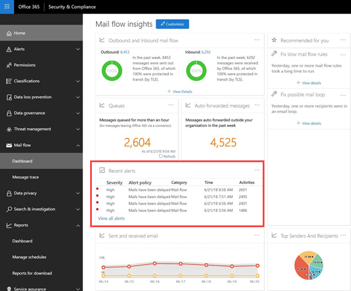

# Warteschlangenwarnungen und Warteschlangen

## Warteschlangen Warnungen

Wenn Nachrichten nicht von Ihrer Office 365-Organisation an Ihre lokalen oder Partner-e-Mail-Server über Connectors gesendet werden können, werden die Nachrichten in der Warteschlange in Office 365. Häufige Beispiele, die diese Bedingung verursachen, sind:

- Der Connector ist falsch konfiguriert.

- In Ihrer lokalen Umgebung wurden Netzwerk-oder Firewall-Änderungen vorgenommen.

In Office 365 wird die Übermittlung für 48 Stunden fortgesetzt. Nach 48 Stunden laufen die Nachrichten ab und werden an die Absender in Unzustellbarkeitsberichten (auch als Unzustellbarkeitsberichte bezeichnet) zurückgegeben.

Wenn der e-Mail-Datenträger in der Warteschlange den vordefinierten Schwellenwert überschreitet (standardmäßig 2000 Nachrichten), stehen die Warnungen im e-Mail-Fluss-Dashboard unter **Aktuelle Benachrichtigungen**zur Verfügung, und Administratoren erhalten eine e-Mail-Benachrichtigung (an Ihre alternative e-Mail-Adresse) . Informationen zum Konfigurieren des warnungsschwellenwerts, des täglichen Benachrichtigungslimits und/oder der Empfänger der Warnung finden Sie im Abschnitt **Anpassen der Warteschlangen Warnungen** weiter unten.

## Anpassen von Warteschlangen Warnungen

Nachrichtenfluss-Einblicke Erstellen einer Warnungs Richtlinie mit dem Namen " **Nachrichten wurden verzögert** " (das Kontrollkästchen **e-Mail-Benachrichtigungen senden** im Beispielbildschirm Foto unten) finden Sie unter Warnungs **Richtlinien**für **Warnungen** \> . Sie können den Schwellenwert und die Warnungsempfänger ändern, indem Sie auf die Richtlinie klicken.

Es wird ein neues Blatt mit Richtlinieninformationen angezeigt, und Sie können nun auf **Richtlinie bearbeiten**klicken.

Das Blattinformationen wird in die **Richtlinie bearbeiten**geändert. Sie können nun die Empfänger für die Warnungs-e-Mail, den Grenzwert für die Anzahl der gesendeten Benachrichtigungen pro Tag und den minimalen Schwellenwert für die Warnung (200 oder mehr) ändern.

## Warnungsdetails der Warteschlange

Wenn Sie auf die Benachrichtigung klicken, werden die Warnungsdetails in einem Flyout-Bereich angezeigt.

Sie können in den Warnungsdetails auf **Warteschlange anzeigen** klicken, um die Warteschlangendetails, Probleme und Links zu den verfügbaren Fixes in einem neuen Flyoutbereich anzuzeigen.

## Warteschlangen

Auch wenn der Nachrichten Datenträger in der Warteschlange den Schwellenwert nicht überschreitet, können Sie Nachrichten, die länger als eine Stunde in die Warteschlange eingereiht wurden, weiterhin im Bereich **Warteschlangen** des Nachrichtenflusses verwenden. Sie können den Bereich **warte** Schlangen verwenden, um die Anzahl der Nachrichten in der Warteschlange zu überwachen (der Wert 0 gibt an, dass der Nachrichtenfluss in Ordnung ist) und Maßnahmen zu ergreifen, bevor die Anzahl der Nachrichten in der Warteschlange zu hoch

Wenn Sie auf die Anzahl der Warteschlangen Nachrichten in **warte**Schlangen klicken, werden die Warteschlangendetails und Anleitungen zur Behebung des Problems in einem Flyout-Bereich angezeigt (dasselbe Flyout, das angezeigt wird, nachdem Sie in den Details einer Warteschlangen Warnung auf **Warteschlange anzeigen** klicken).

