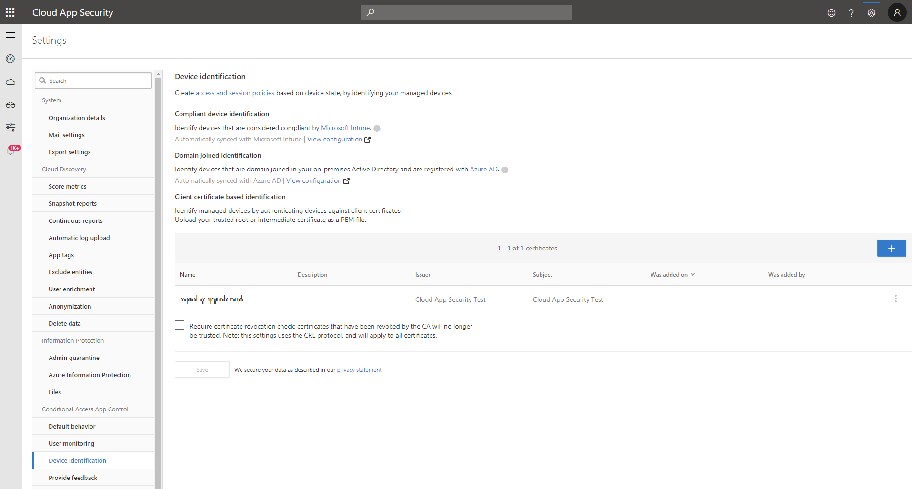

# Bereitstellen der App-Steuerung für bedingten Zugriff für Office 365-Apps

|Auswertung * *\>**|Planung * *\>**|Bereitstellung * *\>**|Auslastung * * * *|
|:-----|:-----|:-----|:-----|
|[Evaluierung starten](office-365-cas-overview.md)   |[Planung starten](get-ready-for-office-365-cas.md)   |Sie sind hier!    [Nächster Schritt](ocas-session-policies.md)   |[Verwendung beginnen](utilization-activities-for-ocas.md)   |

Führen Sie die folgenden Schritte aus, um Azure AD Office 365-apps so zu konfigurieren, dass Sie von der Office 365 Cloud App Security Conditional Access-App-Steuerung gesteuert werden.

**Schritt 1: [Erstellen einer Azure AD-Richtlinie für den bedingten Zugriff](#step-1-create-an-azure-ad-conditional-access-test-policy)**

**Schritt 2: [melden Sie sich mit einem Benutzer an, der auf die Richtlinie in den apps beschränkt](#step-2-sign-in-with-a-user-scoped-to-the-policy-in-the-apps) ist.**

**Schritt 3: Wenn Sie keine integrierte Sicherheitsrichtlinie für die Cloud-app in Azure AD ausgewählt haben oder wenn Sie die Richtlinie auf eine nicht-featured-app anwenden möchten, [Konfigurieren Sie erweiterte Steuerelemente im Sicherheitsportal der Cloud-App](#step-3-configure-advanced-controls-in-the-cloud-app-security-portal) .**

**Schritt 4: [Testen der Bereitstellung](#step-4-test-the-deployment)**

> [!IMPORTANT]
> für die bereitstellung von app-steuerelement für den bedingten zugriff für office 365-apps benötigen sie eine gültige [lizenz für Azure AD Premium P1](https://docs.microsoft.com/azure/active-directory/license-users-groups) sowie eine Office 365 Cloud app-sicherheitslizenz.

## Schritt 1: Erstellen einer Azure AD-Richtlinie für den bedingten Zugriff 

1. Klicken Sie in Azure Active Directory unter **Sicherheit**auf **bedingter Zugriff**.

2. Klicken Sie auf **neue Richtlinie** , und erstellen Sie eine neue Richtlinie.

3. Weisen Sie in der Testrichtlinie unter **Benutzer**einen Test Benutzer oder Benutzer zu, der für eine erstmalige Anmeldung und Überprüfung verwendet werden kann.

4. Weisen Sie in der TEST Richtlinie unter **Cloud-App**die apps zu, die Sie mit Conditional Access-App-Steuerelement steuern möchten.

5. Legen Sie unter **Sitzung**fest, dass die Richtlinie eine der integrierten Richtlinien, **nur** überwachen oder **Blockieren von Downloads**verwendet. Oder wählen Sie **benutzerdefinierte Richtlinie** verwenden aus, um eine erweiterte Richtlinie im Sicherheitsportal der Cloud-App festzulegen.

6. Fügen Sie alle **** anwendbaren Bedingungs Zuweisungen oder **Grant-Steuerelemente** hinzu (optional).

> 

## Schritt 2: Melden Sie sich mit einem Benutzer an, der auf die Richtlinie in den apps beschränkt ist. 

Nachdem Sie die Richtlinie erstellt haben, melden Sie sich bei jeder in dieser Richtlinie konfigurierten APP an. Stellen Sie sicher, dass Sie sich mit einem in der Richtlinie konfigurierten Benutzer angemeldet haben. Stellen Sie sicher, dass Sie sich zuerst bei vorhandenen Sitzungen abmelden.

Cloud App Security synchronisiert Ihre Richtliniendetails mit ihren Servern für jede neue APP, bei der Sie sich anmelden. Dies kann bis zu einer Minute dauern.

## Schritt 3: Konfigurieren erweiterter Steuerelemente im Cloud-App-Sicherheitsportal 

Die obigen Anweisungen unterstützten Sie beim Erstellen einer integrierten Cloud-App-Sicherheitsrichtlinie für empfohlene apps direkt in Azure AD.

erstellen sie eine [zugriffsrichtlinie](ocas-access-policies.md) oder eine [sitzungsrichtlinie](ocas-session-policies.md) im Office 365 Cloud App Security portal, um eine erweiterte richtlinie zu konfigurieren.

### So identifizieren Sie Geräte mit Clientzertifikaten (optional):

1. Wechseln Sie zum COG Einstellungen und wählen Sie **Geräteidentifizierung**aus.

2. Laden Sie ein oder mehrere Zwischenzertifikate hoch.

3. Nachdem das Zertifikat hochgeladen wurde, können Sie Zugriffsrichtlinien und Sitzungs Richtlinien basierend auf **Device-Tag** und **gültigem Clientzertifikat**erstellen.

> [!NOTE]
> Ein Zertifikat wird nur von einem Benutzer angefordert, wenn die Sitzung einer Richtlinie entspricht, die den gültigen Clientzertifikat Filter verwendet.
> 
## Schritt 4: Testen der Bereitstellung 

1. Melden Sie sich zuerst bei vorhandenen Sitzungen ab. Versuchen Sie dann, sich bei jeder erfolgreich bereitgestellten App anzumelden. Melden Sie sich mit einem Benutzer an, der mit der in Azure AD konfigurierten Richtlinie übereinstimmt.

2. Wählen Sie im Sicherheitsportal Cloud app unter **untersuchen**die Option **Aktivitätsprotokoll**aus, und stellen Sie sicher, dass die Anmeldeaktivitäten für jede APP erfasst werden.

3. Sie können filtern, indem Sie auf **erweitert**klicken und dann mithilfe von **Source Equals Zugriffssteuerung**filtern.

4. Es wird empfohlen, sich bei mobilen und Desktop-Apps über verwaltete und nicht verwaltete Geräte anzumelden. Dadurch wird sichergestellt, dass die Aktivitäten im Aktivitätsprotokoll korrekt erfasst werden. Um zu überprüfen, ob die Aktivität korrekt erfasst wurde, klicken Sie auf eine Aktivität für einmaliges Anmelden, damit die Aktivitäts Schublade geöffnet wird. Stellen Sie sicher, dass das **Benutzer-Agent-Tag** ordnungsgemäß reflektiert, ob es sich um einen nativen Client handelt (also eine Mobile oder Desktop-App) oder dass es sich bei dem Gerät um ein verwaltetes Gerät handelt (kompatibel, mit der Domäne verbunden oder ein gültiges Clientzertifikat)

> [!NOTE]
> Nach der Bereitstellung können Sie eine APP nicht aus der APP-Steuerelement Seite für den bedingten Zugriff entfernen. Solange Sie keine Sitzungs-oder Zugriffsrichtlinie für die APP festlegen, ändert das Steuerelement der Conditional Access-App kein Verhalten für die app.

## Nächste Schritte

- [Informationen zu Sitzungs Richtlinien in Office 365 Cloud App Security](ocas-session-policies.md)

- [Informationen zu Zugriffsrichtlinien in Office 365 Cloud App Security](ocas-access-policies.md) 

- [Gruppieren Ihrer IP-Adressen zur Vereinfachung der Verwaltung in Office 365 Cloud App Security](group-your-ip-addresses-in-ocas.md)