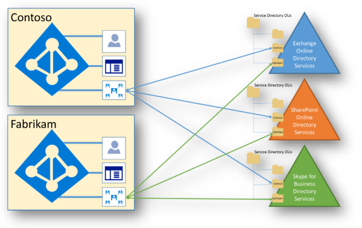

# Die Isolierung und Steuerung des Zugriffs in Office 365Isolation and Access Control in Office 365

Azure Active Directory und Office 365 verwenden eine sehr komplexe Datenmodell, die Dienste, Hunderte von Entitäten, die sich auf Zehntausende enthält Tausende von Beziehungen und Zehntausende Attribute (Entitäten, die Beziehungen und Attribute sind oft anwendungsspezifische). Auf allgemeiner Ebene Azure Active Directory und die Verzeichnisse Service sind die Container von Mandanten und Empfänger, und sie sind synchronisiert statusbasierte Replikationsprotokolle verwenden. Zusätzlich zu der Verzeichnisinformationen Transportsystem mit Azure Active Directory jeden der Dienste auch haben einen eigenen Verzeichnisdienst-Infrastruktur (z. B. Verzeichnisdiensten der Exchange Online, SharePoint Online Directory Services usw.).Azure Active Directory and Office 365 use a highly complex data model that includes tens of services, hundreds of entities, thousands of relationships, and tens of thousands of attributes (entities, relationships and attributes are often application-specific). At a high level, Azure Active Directory and the service directories are the containers of tenants and recipients, and they are kept in sync using state-based replication protocols. In addition to the directory information held within Azure Active Directory, each of the services also have their own directory services infrastructure (e.g., Exchange Online Directory Services, SharePoint Online Directory Services, etc.). 
 

In diesem Modell ist keine zentrale Quelle Directory-Daten. Jedes einzelne Datenelement ist einem bestimmten System gehören, jedoch keine einzelnen alle Daten enthält. Office 365-Diensten zusammen mit Azure Active Directory Datenmodell zu erkennen. Azure Active Directory ist die "System Wahrheit" für freigegebene Daten in der Regel kleine als auch statische Daten, die von jeder Dienst häufig verwendet werden. Verbundpartner Modell in Office 365 und Azure Active Directory verwendet bietet die freigegebene Ansicht der Daten.Within this model, there is no single source of directory data. Every individual piece of data is owned by a specific system, but no single system holds all the data. Office 365 services cooperate with Azure Active Directory to realize the data model. Azure Active Directory is the "system of truth" for shared data, which is typically small and static data used often by every service. The federated model used within Office 365 and Azure Active Directory provides the shared view of the data.

Office 365 verwendet physischen Speicher und Azure-Cloud-Speicher. Exchange Online (einschließlich Exchange Online Protection) und Skype für Unternehmen können Sie ihre eigenen Speicherung für Kundendaten verwenden. SharePoint Online nutzt die SQL Server-Speicher und die Azure-Speicher, die die Notwendigkeit für zusätzliche Isolierung von Kundendaten auf Speicherebene erfordert.Office 365 uses both physical storage and Azure cloud storage. Exchange Online (including Exchange Online Protection) and Skype for Business use their own storage for customer data. SharePoint Online leverages both its SQL Server storage and Azure storage, which necessitates the need for additional isolation of customer data at the storage level.

## Exchange OnlineExchange Online
Exchange Online speichert Kundendaten innerhalb von Postfächern, die innerhalb von Postfachdatenbanken aufgerufen Extensible Storage Engine (ESE)-Datenbanken gehostet werden. Dazu gehören Benutzerpostfächer, verknüpfte Postfächer, freigegebene Postfächer und Postfächer für Öffentliche Ordner. Benutzerpostfächer gehören auch gespeicherte Skype für Business-Inhalten, beispielsweise Unterhaltung gespeichert werden soll. Inhalt von Postfächern umfasst-e-Mails und e-Mail-Anlagen, Kalender und Frei/Gebucht-Informationen, Kontakte, Aufgaben, Notizen, Gruppen und Ableitung Daten.Exchange Online stores customer data within mailboxes that are hosted within Extensible Storage Engine (ESE) databases called mailbox databases. This includes user mailboxes, linked mailboxes, shared mailboxes and public folder mailboxes. User mailboxes may also include saved Skype for Business content, such as conversation histories. User mailbox content includes emails and email attachments, calendaring and free/busy information, contacts, tasks, notes, Groups, and inference data.

Jede Postfachdatenbank in Exchange Online enthält die Postfächer aus mehreren Mandanten. Alle Postfächer sind durch Autorisierungscode, einschließlich innerhalb eines Mandanten gesichert. Als hat mit einer lokalen Bereitstellung von Exchange, standardmäßig nur der zugewiesene Benutzer Zugriff auf ein Postfach. Die Zugriffssteuerungsliste (ACL), die ein Postfach sichert enthält eine Identität, die von Azure Active Directory auf der Ebene der Mandant authentifiziert wird. Die Postfächer für einen bestimmten Mandanten können nur Identitäten authentifiziert anhand des Mandanten Authentifizierungsanbieter, die diese Mandanten nur Benutzer enthalten. Inhalte, die zu TenantA gehören werden nicht keinerlei von Benutzern in TenantB, ermittelt, es sei denn, die explizit durch TenantA genehmigt.Each mailbox database within Exchange Online contains mailboxes from multiple tenants. All mailboxes are secured by authorization code, including within a tenancy. As with an on-premises deployment of Exchange, by default only the assigned user has access to a mailbox. The access control list (ACL) that secures a mailbox contains an identity that is authenticated by Azure Active Directory at the tenant level. The mailboxes for a given tenant are limited to identities authenticated against that tenant's authentication provider, which include only users from that tenant. Content belonging to TenantA cannot in any way be obtained by users in TenantB, unless explicitly approved by TenantA.

## Skype for BusinessSkype for Business
Skype für Unternehmen werden Daten in einer Vielzahl von Orten gespeichert:Skype for Business stores data in a variety of places:
- Benutzer- und Konto Informationen Verbindungsendpunkte, die Mandanten-IDs, einschließlich Wählpläne, roaming Settings, Anwesenheitsstatus, Kontaktlisten usw., ist in der Skype für Business Active Directory-Server und in verschiedenen Skype für Business-Datenbank gespeichert Server. Kontaktlisten werden in Exchange Online-Postfach des Benutzers gespeichert, wenn der Benutzer für beide Produkte oder auf Skype für Business Server aktiviert ist, wenn der Benutzer nicht befindet. Skype für Datenbankserver Business sind nicht partitionierten pro Mandant, aber mehrmandantenfähigkeit Isolierung von Daten über RBAC erzwungen wird.User and account information, which includes connection endpoints, tenant IDs, dial plans, roaming settings, presence state, contact lists, etc., is stored in the Skype for Business Active Directory servers, as well as in various Skype for Business database servers. Contact lists are stored in the user's Exchange Online mailbox if the user is enabled for both products, or on Skype for Business servers if the user is not. Skype for Business database servers are not partitioned per-tenant, but multi-tenancy isolation of data is enforced through RBAC.
- Besprechungsinhalte, wie Inhalt Benutzer während der Skype für Business-Besprechungen Hochladen wird auf DFS-Freigaben gespeichert. Dieser Inhalt kann auch in Exchange Online archiviert werden, sofern die Archivierung aktiviert ist. DFS-Freigaben sind nicht partitionierten pro Mandant aber mit ACLs wird der Inhalt geschützt und mehrmandantenfähigkeit durch RBAC erzwungen wird.Meeting content, such as content users upload during Skype for Business meetings, is stored on Distributed File System shares. This content can also be archived in Exchange Online provided archiving is enabled. The DFS shares are not partitioned per-tenant but the content is secured with ACLs and multi-tenancy is enforced through RBAC.
- Kommunikationsdatensätze in der Aktivitätshistorie wie der Anrufliste, IM-Sitzungen, Anwendungsfreigabe, Instant Messaging-Verlauf usw., ist auch in Exchange Online gespeichert werden können, aber die meisten kommunikationsdatensätze vorübergehend auf Call Detail-Eintrag (CDR) Servern gespeichert sind. Inhalt nicht pro Mandant partitioniert ist, sondern mehrmandantenfähigkeit durch RBAC erzwungen wird.Call detail records, which is the activity history, such as call history, IM sessions, application sharing, IM history, etc., can also be stored in Exchange Online, but most call detail records are temporarily stored on call detail record (CDR) servers. Content is not partitioned per tenant, but multi-tenancy is enforced through RBAC.

## SharePoint OnlineSharePoint Online
Es gibt mehrere unabhängige Mechanismen für SharePoint Online, die Daten isolieren eindeutig. SharePoint Online werden Objekte als abstrahiert Code in Datenbanken gespeichert. Beispielsweise wenn ein Benutzer eine Datei mit SharePoint Online hochgeladen wird, ist diese Datei zerlegt und in der Anwendungscode übersetzt und in mehreren Tabellen in mehreren Datenbanken gespeichert.There are several independent mechanisms unique to SharePoint Online that provide data isolation. SharePoint Online stores objects as abstracted code within application databases. For example, when a user uploads a file to SharePoint Online, that file is disassembled and translated into application code and stored in multiple tables across multiple databases.

Wenn ein Benutzer direkt den Speicher mit den Daten zugreifen kann, würde die Inhalte nicht an eine Person oder ein System als SharePoint Online Ingenieure. Diese Mechanismen umfassen Sicherheit Steuerung des Zugriffs und Eigenschaften. Wie oben beschrieben, sind alle SharePoint Online-Ressourcen durch den Autorisierungscode und RBAC-Richtlinien, einschließlich innerhalb eines Mandanten gesichert. Die Zugriffssteuerungsliste (ACL), die eine Ressource sichert enthält eine Identität, die auf der Ebene der Mandant authentifiziert wird. Wie bei Exchange Online, SharePoint Online können Daten für einen bestimmten Mandanten nur Identitäten authentifiziert anhand des Mandanten Authentifizierungsanbieter, die diese Mandanten nur Benutzer enthalten.If a user could gain direct access to the storage containing the data, the content would not be interpretable to a human or any system other than SharePoint Online. These mechanisms include security access control and properties. As described above, all SharePoint Online resources are secured by the authorization code and RBAC policy, including within a tenancy. The access control list (ACL) that secures a resource contains an identity that is authenticated at the tenant level. As with Exchange Online, in SharePoint Online, data for a given tenant are limited to identities authenticated against that tenant's authentication provider, which include only users from that tenant.

Zusätzlich zu der ACLs eine Mandanten Level-Eigenschaft, die angibt, den Authentifizierungsanbieter (die Mandanten-spezifischen Azure Active Directory ist), wird einmal geschrieben und kann nicht geändert werden, nach dem festlegen. Nach die Authentifizierung Provider Mandanten-Eigenschaft für einen Mandanten festgelegt wurde, kann es nicht in eine beliebige APIs verfügbar gemacht werden, um einen Mandanten geändert werden.In addition to the ACLs, a tenant level property that specifies the authentication provider (which is the tenant-specific Azure Active Directory), is written once and cannot be changed once set. Once the authentication provider tenant property has been set for a tenant, it cannot be changed using any APIs exposed to a tenant.

Eine eindeutige *SubscriptionId* wird auch für jeden Mandanten verwendet. Alle Kundenstandorten gehören einen Mandanten und eine eindeutige *SubscriptionId* den Mandanten zugewiesen sind. Die *SubscriptionId* -Eigenschaft auf einer Website wird einmal geschrieben und kann nicht geändert werden. Nach eine Website einen Mandanten zugewiesen ist, kann es auf einen anderen Mandanten später mit der API Inhaltsspeicher verschoben werden. Die *SubscriptionId* ist auch der Schlüssel, der zum Erstellen des Sicherheitsbereichs für den Authentifizierungsanbieter verwendet wird und auf den Mandanten gebunden ist.A unique *SubscriptionId* is also used for each tenant. All customer sites are owned by a tenant and are assigned a *SubscriptionId* unique to the tenant. The *SubscriptionId* property on a site is written once and cannot be changed. Once a site is assigned to a tenant, it cannot be moved to a different tenant later using the content store API. The *SubscriptionId* is also the key that is used to create the security scope for the authentication provider and is tied to the tenant.

SharePoint Online verwendet den SQL Server und Azure-Speicher für das Speichern von Inhalten. Auf der Ebene SQL ist der Partitionsschlüssel für den Inhaltsspeicher *SiteId*. Wenn Sie eine SQL-Abfrage ausführen, verwendet SharePoint Online eine *SiteId* , der überprüft wurde als Teil der eine Überprüfung auf Mandantenebene *SubscriptionId* .SharePoint Online uses SQL Server and Azure storage for the storing of content. At the SQL level, the partition key for the content store is *SiteId*. When running a SQL query, SharePoint Online uses a *SiteId* that has been verified as part of a tenant-level *SubscriptionId* check.

SharePoint Online speichert Datei binäre Blobs (z. B. die Datei Datenströme) in Microsoft Azure. Jede SharePoint Online Farm weist ein eigene Microsoft Azure-Konto und alle Blobs, die in Azure gespeichert werden einzeln mit einem Schlüssel, der in den SQL-Inhaltsspeicher gespeichert ist verschlüsselt. Der Verschlüsselungsschlüssel nicht direkt an die Endbenutzer verfügbar gemacht, und im Code durch die Ebene des Genehmigung geschützt ist. Schließlich verfügt SharePoint Online direkt zu erkennen, wann eine HTTP-Anforderung liest oder Daten für mehrere Mandanten schreibt Echtzeit zu überwachen. Dies geschieht durch die Ermittlung der *SubscriptionId* der Anforderungsidentität anhand der *SubscriptionId* der Ressource zugegriffen wird. Eine Anforderung, die Zugriff auf Ressourcen von mehreren Mandanten sollte vom Endbenutzer nie eintreten. Es kann jedoch für Serviceanfragen in einer Umgebung mit mehreren Mandanten vorkommen. Der Suchcrawler zieht inhaltlichen Änderungen für eine gesamte Datenbank beispielsweise alle gleichzeitig. Dieser Schritt umfasst in der Regel das Abfragen von Websites für mehrere Mandanten in einer Anforderung Dienst für einmaliges, die aus Gründen der Effizienz ausgeführt wird.SharePoint Online stores file binary blobs (e.g., the file streams) in Microsoft Azure. Each SharePoint Online farm has its own Microsoft Azure account and all the blobs saved in Azure are encrypted individually using a key that is stored in the SQL content store. The encryption key is not exposed directly to the end user, and is protected in code by the authorization layer. Finally, SharePoint Online has real-time monitoring in place to detect when an HTTP request reads or writes data for more than one tenant. It does this by tracking the *SubscriptionId* of the request identity against the *SubscriptionId* of the resource being accessed. A request accessing resources of more than one tenant should never happen by end-user. It can happen for service requests in a multi-tenant environment, though. For example, the search crawler pulls content changes for an entire database all at once. This usually involves querying sites of more than one tenant in a single service request, which is done for efficiency reasons.
