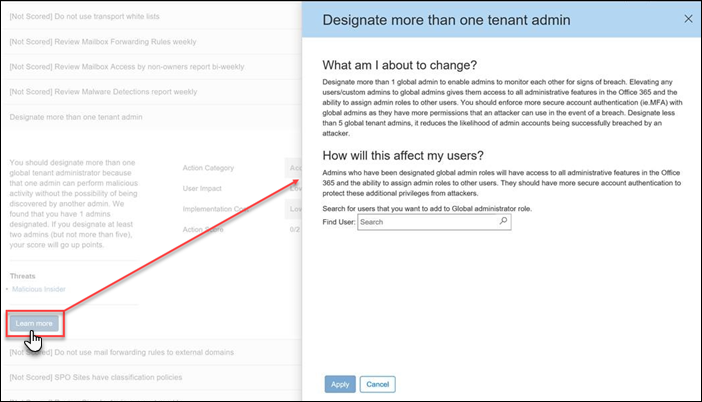

# Einführung des Office 365 Secure ScoreIntroducing the Office 365 Secure Score

Haben Sie sich je gefragt, wie sicher ist wirklich Office 365-Organisation? So beenden Sie eine App – viele Zeit - die Office 365 Secure Bewertung ist hier helfen. Sichere Faktor Sicherheit Ihrer Office 365-Organisation basierend auf Ihren regulären Aktivitäten und Sicherheitseinstellungen analysiert und weist eine Bewertung. Betrachten Sie es als einen Credit Faktor für die Sicherheit.Ever wonder how secure your Office 365 organization really is? Time to stop wondering - the Office 365 Secure Score is here to help. Secure Score analyzes your Office 365 organization's security based on your regular activities and security settings and assigns a score. Think of it as a credit score for security.
  
## Wie erhalte ich Secure Score?How do I get to Secure Score?

Jeder Benutzer mit Administratorberechtigungen (globaler Administrator oder eine benutzerdefinierte Administratorrolle) für ein Office 365 Business Premium oder Enterprise-Abonnement, die Bewertung Secure unter zugreifen kann [https://securescore.office.com](https://securescore.office.com). Benutzer, die Admin-Rolle zugewiesen sind nicht auf Secure Score zugreifen. Jedoch können Administratoren das Tool verwenden, deren Ergebnisse mit anderen Personen in ihrer Organisation freigeben.Anyone who has admin permissions (global admin or a custom admin role) for an Office 365 Business Premium or Enterprise subscription can access the Secure Score at [https://securescore.office.com](https://securescore.office.com). Users who aren't assigned an admin role won't be able to access Secure Score. However, admins can use the tool to share their results with other people in their organization.
  
## Wie funktioniert dies?How does it work?

Sichern Sie die Zahlen Score, welche Office 365-Dienste (wie OneDrive, SharePoint und Exchange) verwenden Sie befasst sich mit Ihrer Einstellungen und Aktivitäten und miteinander verglichen, an einer Grundlinie von Microsoft hergestellt. Erhalten Sie eine Bewertung basierend auf wie ausgerichtete Sie mit bewährten Methoden für die Sicherheit sind.Secure Score figures out what Office 365 services you're using (like OneDrive, SharePoint, and Exchange) then looks at your settings and activities and compares them to a baseline established by Microsoft. You'll get a score based on how aligned you are with best security practices.
  

  
Wenn Sie Ihr Ergebnis zu verbessern möchten, lesen Sie die Warteschlange Aktion, um herauszufinden, was Sie tun können, um Hilfe zur Verbesserung der Sicherheit und die Risiken.If you want to improve your score, review the action queue to see what you can do to help increase security and reduce risks.
  

  
Erweitern Sie eine Aktion, um zu erfahren, welche Bedrohungen es helfen Sie zum Schutz und zur wie erzielen Sie erledigt.Expand an action to learn about what threats it'll help protect you from and how you'll get the job done.
  

  
Um die Auswirkungen von Ihren Aktionen auf Sicherheit Ihrer Organisation anzuzeigen, wechseln Sie zur Seite **Score Analyzer** , und überprüfen Sie den Verlauf.To see the impact of your actions on your organization's security, go to the **Score Analyzer** page and review your history. 
  

  
Klicken Sie auf eine beliebige Datenpunkt, um eine Aufschlüsselung der Ihr Ergebnis dieses Tages finden Sie unter. Sie können einen Bildlauf nach unten zu finden Sie unter welche Steuerelemente aktiviert wurden und wie viele Sie Ertragswert dieses Tages für jedes Steuerelement verweist.Click any data point to see a breakdown of your score for that day. You can scroll down to see which controls were enabled and how many points you earned that day for each control.
  

  
## Wie wird es mir helfen?How will it help me?

Verwenden von Secure Bewertung hilft Ihrer Organisation Sicherheit erhöhen, indem Sie die integrierte Sicherheit bei Verwendung von Features in Office 365 (von denen Sie bereits erworben haben aber möglicherweise nicht bekannt) fördern. Weitere Informationen zu diesen Features wie die Verwendung des helfen Sie erteilen Teil Beachten Sie, dass Sie die richtigen Maßnahmen für Ihre Organisation vor Angriffen zu schützen einnehmen.Using Secure Score helps increase your organization's security by encouraging you to use the built-in security features in Office 365 (many of which you already purchased but might not be aware of). Learning more about these features as you use the tool will help give you piece of mind that you're taking the right steps to protect your organization from threats.
  
Aber nicht einfach Probieren Sie es. Kunden, die mithilfe von Secure Score haben gesehen, dem Faktor 5 Mal mehr als Kunden zu erhöhen, die es nicht verwenden. (Die Anhebung der Score entspricht mit den Sicherheitsfunktionen in ihren Organisationen verwendet wird.)But don't just take our word for it. Customers who are using Secure Score have seen their score increase 5 times more than customers who aren't using it. (The increase in score corresponds with the security features being used in their organizations.)
  
Checken Sie unseren [Blog-Beitrag](https://go.microsoft.com/fwlink/?linkid=836898) , um mehr zu erfahren.Check out our [blog post](https://go.microsoft.com/fwlink/?linkid=836898) to learn more. 
  
> [!NOTE]
> Die Bewertung Secure ist nicht express eine absolute Maßeinheit des wie wahrscheinlich generiertes abgerufen werden sollen. Dieser drückt des Umfang an dem Steuerelemente eingeführt haben die generiertes wird das Risiko offset können. Kein Dienst kann sicherstellen, dass Sie nicht verletzt werden, und die Bewertung Secure nicht als keinerlei Garantie interpretiert werden soll.The Secure Score does not express an absolute measure of how likely you are to get breached. It expresses the extent to which you have adopted controls which can offset the risk of being breached. No service can guarantee that you will not be breached, and the Secure Score should not be interpreted as a guarantee in any way. 
  
## FAQFAQs

### Wer Secure Score verwenden können?Who can use Secure Score?

Jeder Benutzer mit Administratorberechtigungen (globaler Administrator oder eine benutzerdefinierte Administratorrolle) für ein Office 365 Business Premium oder Enterprise-Abonnement, die Bewertung Secure unter zugreifen kann [https://securescore.office.com](https://securescore.office.com). Benutzer, die Admin-Rolle zugewiesen sind nicht auf Secure Score zugreifen. Jedoch können Administratoren das Tool verwenden, deren Ergebnisse mit anderen Personen in ihrer Organisation freigeben. Wir sind einschließlich andere, nicht-Administrator-Rollen in der Berechtigungsliste in der Zukunft betrachtet. Wenn bestimmte Rollen uns zu berücksichtigen möchten sind, teilen Sie uns durch das Veröffentlichen auf der [Office-Sicherheit, Datenschutz &amp; Compliance Community](https://go.microsoft.com/fwlink/?linkid=836898).Anyone who has admin permissions (global admin or a custom admin role) for an Office 365 Business Premium or Enterprise subscription can access the Secure Score at [https://securescore.office.com](https://securescore.office.com). Users who aren't assigned an admin role won't be able to access Secure Score . However, admins can use the tool to share their results with other people in their organization. We're looking at including other, non-admin roles in the permissions list in the future. If there are specific roles you'd like us to consider, let us know by posting on the [Office Security, Privacy &amp; Compliance community](https://go.microsoft.com/fwlink/?linkid=836898).
  
### Funktionsweise [nicht bewertet] bedeuten?What does [Not Scored] mean?

Mit der Bezeichnung **[Nicht bewertet]** Aktionen sind in Ihrer Organisation ausführen können, jedoch werden nicht bewertet werden, da sie in das Tool (noch!) verknüpft werden nicht. Daher können Sie weiterhin die Sicherheit verbessern, Sie erhalten jedoch nicht Credit für diese Aktionen sofort.Actions labeled as **[Not Scored]** are ones you can perform in your organization but won't be scored because they aren't hooked up in the tool (yet!). So, you can still improve your security, but you won't get credit for those actions right now. 
  
### Wie oft ist Bewertung aktualisiert?How often is my score updated?

Die Bewertung wird einmal pro Tag (etwa 1:00 Uhr PST) berechnet. Wenn Sie eine Änderung an einer gemessene Aktion vornehmen, wird die Bewertung den nächsten Tag automatisch aktualisiert. Es dauert bis zu 48 Stunden für eine Änderung in Ihr Ergebnis übernommen werden.The score is calculated once per day (around 1:00 AM PST). If you make a change to a measured action, the score will automatically update the next day. It takes up to 48 hours for a change to be reflected in your score.
  
### Wer kann meine Ergebnisse anzeigen?Who can see my results?

Ergebnisse werden gefiltert, zum Anzeigen der Ergebnisse nur für Personen in Ihrer Organisation, die eine Administratorrolle (globaler Administrator oder eine benutzerdefinierte Administratorrolle) zugewiesen sind.Results are filtered to show scores only to people in your organization who are assigned an admin role (global admin or a custom admin role).
  
### Bewertung geändert. Wie herausfinden kann ich Warum?My score changed. How do I figure out why?

Klicken Sie auf der Seite **Score Analyzer** auf einen Datenpunkt für einen bestimmten Tag, und klicken Sie dann einen Bildlauf nach unten zu finden, die für diesen Tag zu erfahren, welche Aktionen abgeschlossenen und unvollständigen geändert.On the **Score Analyzer** page, click a data point for a specific day, then scroll down to see the completed and incomplete actions for that day to find out what changed. 
  
### Messen die Bewertung Secure Meine Risiko erste generiertes?Does the Secure Score measure my risk of getting breached?

In kurz und Nein. Die Bewertung Secure ist nicht express eine absolute Maßeinheit des wie wahrscheinlich generiertes abgerufen werden sollen. Dieser drückt des Umfang an dem Features eingeführt haben, die das Risiko wird generiertes versetzt werden können. Kein Dienst kann sicherstellen, dass Sie nicht verletzt werden, und die Bewertung Secure nicht als keinerlei Garantie interpretiert werden soll.In short, no. The Secure Score does not express an absolute measure of how likely you are to get breached. It expresses the extent to which you have adopted features that can offset the risk of being breached. No service can guarantee that you will not be breached, and the Secure Score should not be interpreted as a guarantee in any way.
  
### Wie sollte ich meine Score interpretieren?How should I interpret my score?

Erhalten Sie Punkte für die Konfiguration den Sicherheitsfeatures empfohlen oder das Ausführen von Aufgaben im Zusammenhang mit der Sicherheit (wie Lesen Berichte). Einige Aktionen werden für die teilweise Vervollständigung wie Multi-Factor Authentication (mehrstufiger Authentifizierung das) für Ihre Benutzer aktivieren bewertet. Ihr Secure Ergebnis ist direkt repräsentativ für die Microsoft Security-Dienste, den, die Sie verwenden. Denken Sie daran, dass Sicherheit immer mit Verwendbarkeit abgeglichen werden sollte. Alle Security-Steuerelemente verfügen über eine Komponente des Benutzers Auswirkung. Steuerelemente mit geringer Benutzer Auswirkung sollte wenig keine Auswirkung auf die täglichen Betrieb Ihrer Benutzer.You're given points for configuring recommended security features or performing security-related tasks (like reading reports). Some actions are scored for partial completion, like enabling multi-factor authentication (MFA) for your users. Your Secure Score is directly representative of the Microsoft security services you use. Remember that security should always be balanced with usability. All security controls have a user impact component. Controls with low user impact should have little to no effect on your users' day-to-day operations.
  
Um aufgezeichnete Score anzuzeigen, wechseln Sie zur Seite **Score Analyzer** . Wählen Sie ein bestimmtes Datum finden Sie unter welche Steuerelemente für aktiviert wurden, dass Tag und was Sie für jede erhaltenen verweist.To see your score history, go to the **Score Analyzer** page. Choose a specific date to see which controls were enabled for that day and what points you earned for each one. 
  
### Ich habe eine Vorstellung vom Zweck für ein anderes Steuerelement. Wie lassen ich Sie wissen, was es ist?I have an idea for another control. How do I let you know what it is?

Wir freuen uns auf von Ihnen zu hören. Posten Sie Ihre Ideen in die [Office-Sicherheit, Datenschutz &amp; Compliance Community](https://go.microsoft.com/fwlink/?linkid=836898). Wir freuen uns darauf und die Bewertung Secure alle Optionen enthalten, die Ihnen wichtig sind, möchten.We'd love to hear from you. Please post your ideas on the [Office Security, Privacy &amp; Compliance community](https://go.microsoft.com/fwlink/?linkid=836898). We're listening and want the Secure Score to include all options that are important to you.
  
### Etwas funktioniert nach rechts nicht. An wen sollte ich mich?Something isn't working right. Who should I contact?

Wenn Sie Probleme haben, informieren Sie uns durch das Veröffentlichen auf der [Office-Sicherheit, Datenschutz &amp; Compliance Community](https://go.microsoft.com/fwlink/?linkid=836898). Wir haben die Community Überwachung und bieten Sie Hilfe.If you have any issues, please let us know by posting on the [Office Security, Privacy &amp; Compliance community](https://go.microsoft.com/fwlink/?linkid=836898). We're monitoring the community and will provide help.
  
### Meine Organisation hat nur bestimmte Sicherheitsfeatures. Wirkt Bewertung sich?My organization only has certain security features. Does this affect my score?

Die Bewertung Secure berechnet Ihr Ergebnis basierend auf den Diensten, die Sie erworben haben. Angenommen, wenn Sie nur einen Exchange Online-Plan erworben haben, werden nicht Sie für SharePoint Online-Sicherheitsfeatures bewertet werden. Die als Nenner für die Bewertung ist die Summe der alle Baselines für die Steuerelemente, die für die Produkte gelten, die Sie erworben haben. Der Zähler ist die Summe aller Steuerelemente, für die Sie abgeschlossen, oder teilweise abgeschlossen, die Aktionen für das jeweilige Steuerelement zu erfüllen.The Secure Score calculates your score based on the services you purchased. For example, if you only purchased an Exchange Online plan, you won't be scored for SharePoint Online security features. The denominator of the score is the sum of all the baselines for the controls that apply to the products you purchased. The numerator is the sum of all the controls for which you completed, or partially completed, the actions to fulfill that control.

## Verwandte ThemenRelated topics

[Übersicht über die Sicherheit-dashboardSecurity dashboard overview](security-dashboard.md)
  

