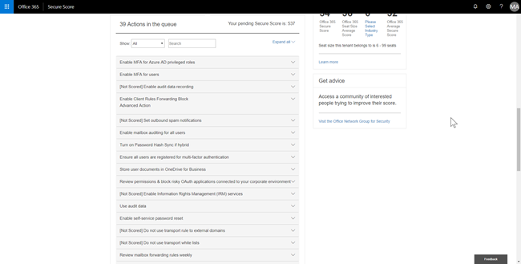
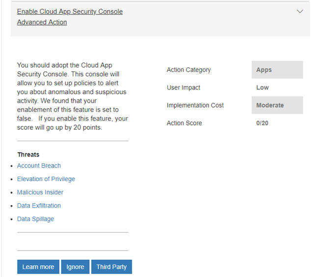

# Office 365 Secure Score

**Zusammenfassung** Fragen Sie sich, wie sicher Ihre Organisation wirklich in Office 365 ist? Secure Score steht Ihnen zur Verfügung. Secure Score analysiert die Sicherheit Ihrer Organisation basierend auf Ihren regulären Aktivitäten und Sicherheitseinstellungen in Office 365 und weist eine Bewertung zu. Lesen Sie diesen Artikel, um einen Überblick über die sichere Bewertung und ihre Verwendung zu erhalten.
  
## So gelangen Sie zu Secure Score

Wenn Ihre Organisation über ein Abonnement mit [office 365 Enterprise](https://docs.microsoft.com/office365/enterprise/), [Microsoft 365 business](https://docs.microsoft.com/microsoft-365/business/)oder Office 365 Business Premium verfügt und Sie über die [erforderlichen Berechtigungen](#required-permissions)verfügen, können Sie die sichere Bewertung Ihrer Organisation anzeigen, indem Sie [https://securescore.office.com](https://securescore.office.com). 

Alternativ können Sie das Security & Compliance Center ([https://protection.office.com](https://protection.office.com)) besuchen, in dem Sie ein sicheres Bewertungs-Widget finden, das Ihnen Ihre aktuelle Bewertung liefert.

Das Widget enthält einen Link zu Ihrem Secure Score Dashboard.

  
## Funktionsweise

Secure Score bestimmt, welche Office 365-Dienste Sie verwenden (beispielsweise OneDrive, SharePoint und Exchange), dann werden Ihre Einstellungen und Aktivitäten mit einer von Microsoft erstellten Baseline verglichen. Sie erhalten eine Bewertung, die darauf basiert, wie gut Ihre Organisation mit bewährten Sicherheitsmethoden ausgerichtet ist. Außerdem erhalten Sie Empfehlungen zu den Schritten, die Sie zur Verbesserung der Bewertung Ihrer Organisation ergreifen können. 
  

  
Secure Score berechnet Ihre Punktzahl basierend auf den von Ihnen erworbenen Diensten. Wenn Sie beispielsweise nur einen Exchange Online-Plan erworben haben, werden Sie nicht für SharePoint Online-Sicherheitsfeatures gewertet. Der Nenner der Bewertung ist die Summe aller Basispläne für die Steuerelemente, die für die von Ihnen erworbenen Produkte gelten. Der Zähler ist die Summe aller Steuerelemente, für die Sie die Aktionen zur Erfüllung dieses Steuerelements abgeschlossen oder teilweise abgeschlossen haben.

Erweitern Sie eine Aktion, um zu erfahren, welche Schritte durchgeführt werden sollen, welche Bedrohungen Sie schützen und wie viele Punkte Ihre Punktzahl erhöhen wird, wenn Sie die Empfehlung befolgen.
  

  
Um die Auswirkungen ihrer Aktionen auf die Sicherheit Ihrer Organisation anzuzeigen, wählen Sie die Registerkarte **Score Analyzer** aus, und überprüfen Sie Ihren Verlauf. 
  

  
Unterhalb des Diagramms sehen Sie eine Liste der Bewertungen und Aktionen nach Kategorie. 
  

 
Aktionen, die als **[nicht erzielt]** bezeichnet werden, sind diejenigen, die Sie für Ihre Organisation ausführen können, aber weil Sie nicht mit Secure Score verbunden sind, werden Sie nicht gewertet.  

Klicken Sie auf der Seite **Score Analyzer** auf einen Datenpunkt für einen bestimmten Tag, und führen Sie einen Bildlauf nach unten durch, um die abgeschlossenen und unvollständigen Aktionen für diesen Tag anzuzeigen, um zu erfahren, was geändert wurde. Die Bewertung wird einmal pro Tag berechnet (um 1:00 Uhr PST). Wenn Sie eine Änderung an einer gemessenen Aktion vornehmen, wird die Partitur automatisch am nächsten Tag aktualisiert. Es dauert bis zu 48 Stunden, bis eine Änderung in ihrer Bewertung reflektiert wird.

Secure Score drückt nicht aus, wie wahrscheinlich Sie verletzt werden. Er gibt an, in welchem Maße Sie Features übernommen haben, die das Risiko von Verstößen kompensieren können. Kein Dienst kann garantieren, dass Sie nicht verletzt werden, und die Secure Score sollte nicht als Garantie interpretiert werden.
 
## Wie Secure Score hilft

Mit Secure Score können Sie zur Verbesserung der Sicherheit Ihrer Organisation beitragen, indem Sie die integrierten Sicherheitsfunktionen in Office 365 verwenden (viele von denen Sie bereits erworben haben, aber möglicherweise nicht wissen). Wenn Sie mehr über diese Features erfahren, können Sie sich beruhigen, dass Sie die richtigen Schritte Unternehmen, um Ihre Organisation vor Bedrohungen zu schützen.
  
Aber nehmen Sie nicht einfach unser Wort dafür. Kunden, die Secure Score verwenden, haben Ihre Punktzahl fünfmal höher gestiegen als Kunden, die Sie nicht verwenden. (Die Aufstockung ihrer Bewertung entspricht den Sicherheitsfeatures, die in ihren Organisationen verwendet werden.)
  
> [!NOTE]
> Secure Score drückt nicht aus, wie wahrscheinlich Sie verletzt werden. Er gibt an, in welchem Umfang Sie Steuerelemente übernommen haben, die das Risiko von Verstößen kompensieren können. Kein Dienst kann garantieren, dass Sie nicht verletzt werden, und Secure Score sollte nicht als Garantie interpretiert werden. 
  
## Erforderliche Berechtigungen

Sie müssen eine der folgenden Rollen in [Azure Active Directory](https://docs.microsoft.com/azure/active-directory/users-groups-roles/directory-assign-admin-roles#available-roles)besitzen, um das Dashboard für sichere Bewertungen anzeigen und verwenden zu können:
- Globaler Administrator
- Rechnungs Administrator
- Benutzer Administrator
- Kenn Wort Administrator
- Sicherheitsadministrator
- Sicherheits Leser
- Exchange-Administrator
- SharePoint-Administrator

 Benutzer, denen keine Administratorrolle zugewiesen ist, können nicht auf Secure Score zugreifen.

## Verwandte Themen

[Übersicht über das Sicherheits Dashboard](security-dashboard.md)

[Welches Abonnement habe ich?](https://docs.microsoft.com/office365/admin/admin-overview/what-subscription-do-i-have?view=o365-worldwide)
