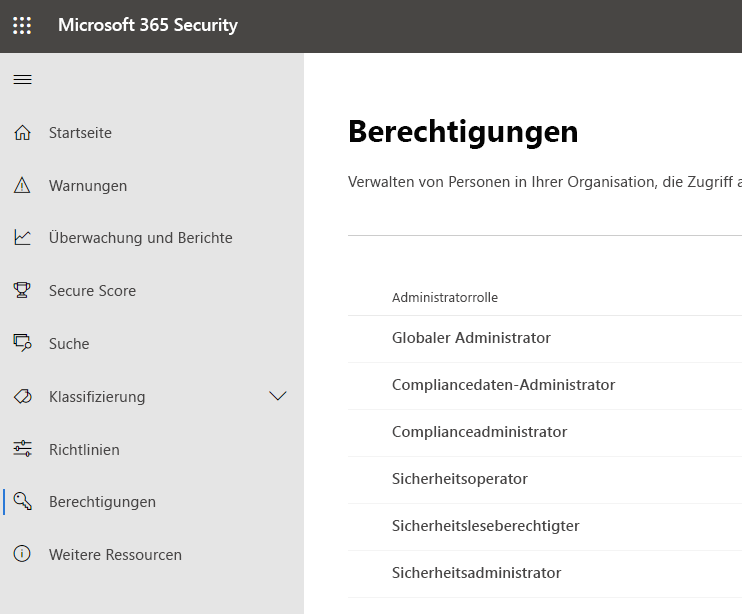
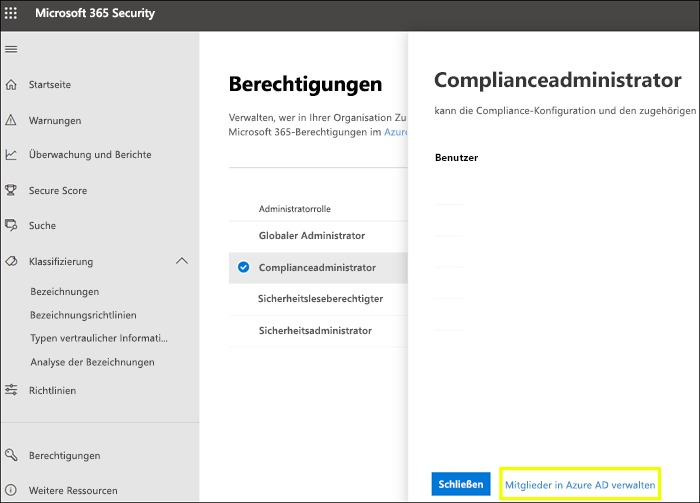
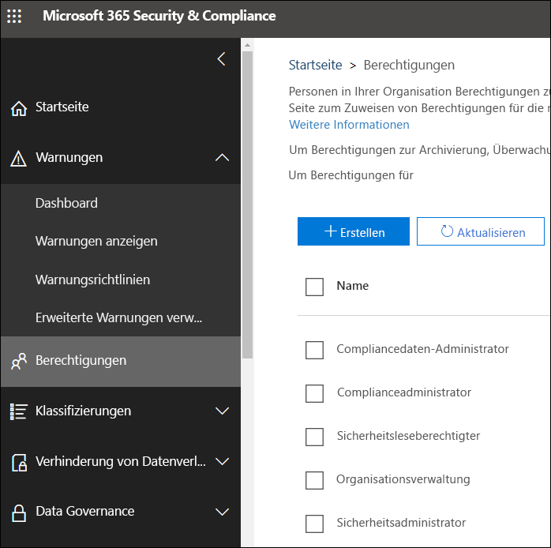

# Berechtigungen im neuen Microsoft 365 Compliance Center und Microsoft 365 Security Center

Ihre Organisation muss Sicherheits- und Complianceszenarios verwalten, die alle Microsoft 365-Dienste umfassen. Und Sie benötigen die Flexibilität, die richtigen Administratorberechtigungen für die richtigen Personen in der IT-Gruppe Ihrer Organisation bereitzustellen. Mithilfe des Microsoft 365 Security Centers oder des Microsoft 365 Compliance Centers können Sie Berechtigungen zentral für alle Aufgaben im Zusammenhang mit Sicherheit und Compliance verwalten.

Nachdem der globale Administrator diese Administratorrollen zugewiesen hat, haben die Administratoren Zugriff auf Features und Daten, die alle Dienste in Microsoft 365 umfassen, z. B. das Microsoft 365 Security Center, das Microsoft 365 Compliance Center, Azure, Office 365 und Enterprise Mobility +.Security.

## Was die Microsoft 365-Rollen sind

Die Rollen, die im Microsoft 365 Compliance Center und im Microsoft 365 Security Center angezeigt werden, sind Azure Active Directory-Rollen. Diese Rollen sind so konzipiert, dass Sie den Aufgaben in der IT-Gruppe Ihrer Organisation entsprechen, sodass einer Person ganz einfach alle Berechtigungen gewährt werden können, die sie für ihre Arbeit benötigt.

|**Rolle**|**Beschreibung**|
|:-----|:-----|
|**Globaler Administrator**|Benutzer mit dieser Rolle haben Zugriff auf alle Verwaltungsfunktionen in allen Microsoft 365-Diensten. Nur globale Administratoren können weitere Administratorrollen zuweisen.|
|**Compliancedatenadministrator**|Benutzer mit dieser Rolle können die Daten Ihrer Organisation in Microsoft 365 nachverfolgen, sicherstellen, dass sie geschützt sind, und Einblicke in alle Probleme erhalten, um Risiken zu minimieren.|
|**Complianceadministrator**|Benutzer mit dieser Rolle können dazu beitragen, dass Ihre Organisation alle behördlichen Bestimmungen einhält und eDiscovery-Fälle verwalten und Richtlinien zur Datengovernance über Microsoft 365-Standorte, -Identitäten und -Apps hinweg aufrechterhalten kann.|
|**Sicherheitsoperator**|Benutzer mit dieser Rolle können aktive Bedrohungen für Ihre Microsoft 365-Benutzer, -Geräte und -Inhalte anzeigen, untersuchen und auf Sie reagieren.|
|**Benutzer mit Leseberechtigung für Sicherheitsfunktionen**|Benutzer mit dieser Rolle können aktive Bedrohungen für Ihre Microsoft 365-Benutzer, -Geräte und -Inhalte anzeigen und untersuchen, besitzen aber (im Gegensatz zum Sicherheitsoperator) keine Berechtigungen zum Reagieren, indem sie Maßnahmen ergreifen.|
|**Sicherheitsadministrator**|Benutzer mit dieser Rolle können die Gesamtsicherheit Ihres Unternehmens steuern, indem sie Sicherheitsrichtlinien verwalten, Sicherheitsanalysen und Berichte in Microsoft 365-Produkten überprüfen und im Zusammenhang mit Bedrohungen immer auf dem neuesten Stand bleiben.|

## Worauf die Microsoft 365-Rollen Zugriff haben

Nachfolgend sind die verfügbaren Rollen und die Aufgaben aufgelistet, die von den Benutzern ausgeführt werden können, denen diese zugewiesen sind.

### Globaler Administrator

Benutzer mit dieser Rolle besitzen Zugriff auf alle administrativen Features in Azure Active Directory sowie Dienste, die Azure Active Directory-Identitäten nutzen, z.B. Microsoft 365 Security Center, Microsoft 365 Compliance Center, Exchange Online, SharePoint Online oder Skype for Business Online. Die Person, die die Anmeldung für den Azure Active Directory-Mandanten vornimmt, wird ein globaler Administrator. Nur globale Administratoren können weitere Administratorrollen zuweisen. In Ihrem Unternehmen können mehrere globale Administratoren vorhanden sein. Globale Administratoren können das Kennwort für alle Benutzer und alle anderen Administratoren zurücksetzen.

### Complianceadministrator

Benutzer mit dieser Rolle verfügen über Berechtigungen zum Verwalten von Compliancefeatures im Microsoft 365 Compliance Center, Microsoft 365 Admin Center, Azure, und Office 365 Security & Compliance Center. Die Benutzer können auch alle Features im Exchange Admin Center sowie im Teams und Skype for Business Admin Center verwalten und Supporttickets für Azure und Microsoft 365 erstellen.

|**In diesem Dienst...**|**Kann der Complianceadministrator Folgendes...**|
|:-----|:-----|
|[**Microsoft 365 Compliance Center**](https://compliance.microsoft.com/)|Schützen und Verwalten Ihrer Organisationsdaten für Microsoft 365-Dienste    Verwalten von Konformitätwarnungen|
|[**Compliance-Manager**](https://docs.microsoft.com/office365/securitycompliance/meet-data-protection-and-regulatory-reqs-using-microsoft-cloud)|Nachverfolgen, Zuweisen und Überprüfen der Einhaltung gesetzlicher Vorschriften durch Ihre Organisation|
|[**Office 365 Security & Compliance Center**](https://support.office.com/article/About-Office-365-admin-roles-da585eea-f576-4f55-a1e0-87090b6aaa9d)|Verwalten der Datengovernance    Durchführen von Untersuchungen zu rechtlichen Aspekten und Daten    Verwalten von DRS-Anforderungen.|
|[**Intune**](https://docs.microsoft.com/intune/role-based-access-control)|Anzeigen aller Intune-Überwachungsdaten|
|[**Cloud-App-Sicherheit**](https://docs.microsoft.com/cloud-app-security/manage-admins)|Verfügt über schreibgeschützten Zugriff und kann Warnungen verwalten    Kann Dateirichtlinien erstellen und ändern und Dateigovernanceaktionen zulassen    Kann alle unter „Datenverwaltung“ integrierten Berichte anzeigen|

### Compliancedatenadministrator

Benutzer mit dieser Rolle verfügen über Berechtigungen zum Schützen und Nachverfolgen von Daten im Microsoft 365 Compliance Center, Microsoft 365 Admin Center und in Azure. Die Benutzer können auch alle Features im Exchange Admin Center, Compliance-Manager sowie im Teams und Skype for Business Admin Center verwalten und Supporttickets für Azure und Microsoft 365 erstellen.

|**In diesem Dienst...**|**kann der Compliancedatenadministrator folgende Aufgaben ausführen...**|
|:-----|:-----|
|[**Microsoft 365 Compliance Center**](https://compliance.microsoft.com/)|Schützen und Verwalten Ihrer Organisationsdaten für Microsoft 365-Dienste    Verwalten von Konformitätwarnungen    Verwalten von Vertraulichkeitsbezeichnungen|
|[**Compliance-Manager**](https://docs.microsoft.com/office365/securitycompliance/meet-data-protection-and-regulatory-reqs-using-microsoft-cloud)|Nachverfolgen, Zuweisen und Überprüfen der Einhaltung gesetzlicher Vorschriften durch Ihre Organisation|
|[**Office 365 Security & Compliance Center**](https://support.office.com/article/About-Office-365-admin-roles-da585eea-f576-4f55-a1e0-87090b6aaa9d)|Verwalten der Datengovernance    Durchführen von Untersuchungen zu rechtlichen Aspekten und Daten    Verwalten von DRS-Anforderungen.    Verwalten von Vertraulichkeitsbezeichnungen|
|[**Intune**](https://docs.microsoft.com/intune/role-based-access-control) (in Kürze verfügbar)|Anzeigen aller Intune-Überwachungsdaten|
|[**Cloud-App-Sicherheit**](https://docs.microsoft.com/cloud-app-security/manage-admins)|Verwenden von schreibgeschützten Berechtigungen zum Anzeigen von Informationen  Verwalten von Benachrichtigungen    Erstellen und Ändern von Dateirichtlinien und Zulassen von Dateigovernanceaktionen    Anzeigen aller unter „Datenverwaltung“ integrierten Berichte|

### Sicherheitsadministrator

Benutzer mit dieser Rolle haben Berechtigungen zur Verwaltung sicherheitsrelevanter Funktionen im Microsoft 365 Security Center, Azure Active Directory Identity Protection, Azure Information Protection und Office 365 Security & Compliance Center.

|**In diesem Dienst...**|**Der Sicherheitsadministrator kann...**|
|:-----|:-----|
|[**Microsoft 365 Security Center**](https://security.microsoft.com/)|Überwachen von sicherheitsrelevanten Richtlinien in Microsoft 365-Diensten     Verwalten von Sicherheitsbedrohungen und Warnungen    Anzeigen von Berichten    Verwalten von Vertraulichkeitsbezeichnungen|
|**Identity Protection Center**|Alle Berechtigungen des Benutzers mit Leseberechtigung für Sicherheitsfunktionen plus Durchführung aller  Identity Protection Center-Vorgänge, mit Ausnahme des Zurücksetzens von Kennwörtern.|
|[**Privileged Identity Management**](https://docs.microsoft.com/azure/active-directory/privileged-identity-management/pim-configure)|Alle Berechtigungen des Benutzers mit Leseberechtigung für Sicherheitsfunktionen    **Kann keine** Azure AD-Rollenzuweisungen oder -einstellungen verwalten.|
|[**Office 365 Security & Compliance Center**](https://support.office.com/article/About-Office-365-admin-roles-da585eea-f576-4f55-a1e0-87090b6aaa9d)|Verwalten von Sicherheitsrichtlinien    Anzeigen, Untersuchen und Reagieren auf Sicherheitsbedrohungen    Anzeigen von Berichten    Verwalten von Vertraulichkeitsbezeichnungen|
|**Azure Advanced Threat Protection**|Überwachen und Reagieren auf verdächtige Sicherheitsaktivitäten|
|**Windows Defender ATP und EDR**|Zuweisen von Rollen    Verwalten von Computergruppen    Konfigurieren der Endpunkt-Bedrohungserkennung und der automatisierten Korrektur    Anzeigen, Untersuchen und Reagieren auf Warnungen|
|[**Intune**](https://docs.microsoft.com/intune/role-based-access-control)|Anzeigen von Benutzern, Geräten, Registrierung, Konfiguration und Anwendungsinformationen    Kann **keine** Änderungen an Intune vornehmen|
|[**Cloud-App-Sicherheit**](https://docs.microsoft.com/cloud-app-security/manage-admins)|Hinzufügen von Administratoren, Richtlinien und Einstellungen, Hochladen von Protokollen und Ausführen von Governanceaktionen|
|[**Azure Security Center**](https://docs.microsoft.com/azure/role-based-access-control/built-in-roles) (in Kürze verfügbar)|Anzeigen von Sicherheitsrichtlinien und -zuständen, Bearbeiten von Sicherheitsrichtlinien sowie Anzeigen und Verwerfen von Warnungen und Empfehlungen.|
|[**Office 365-Dienstintegrität**](https://docs.microsoft.com/office365/enterprise/view-service-health)|Anzeigen der Integrität von Office 365-Diensten|

### Sicherheitsoperator

Benutzer mit dieser Rolle können Warnungen verwalten und besitzen globalen schreibgeschützten Zugriff auf sicherheitsbezogene Features, einschließlich alle Informationen in Microsoft 365 Security Center, Azure Active Directory, Identity Protection, und Privileged Identity Management, sowie die Möglichkeit zum Lesen von Azure Active Directory-Anmeldeberichten und Überwachungsprotokollen und für das Office 365 Security & Compliance Center.

|**In diesem Dienst...**|**Der Sicherheitsoperator kann...**|
|:-----|:-----|
|[**Microsoft 365 Security Center**](https://security.microsoft.com/)|Alle Berechtigungen des Benutzers mit Leseberechtigung für Sicherheitsfunktionen    Anzeigen, Untersuchen und Reagieren auf Sicherheitswarnungen|
|**Identity Protection Center** (in Kürze verfügbar)|Alle Berechtigungen des Benutzers mit Leseberechtigung für Sicherheitsfunktionen|
|[**Privileged Identity Management**](https://docs.microsoft.com/azure/active-directory/privileged-identity-management/pim-configure)|Alle Berechtigungen des Benutzers mit Leseberechtigung für Sicherheitsfunktionen|
|[**Office 365 Security & Compliance Center**](https://support.office.com/article/About-Office-365-admin-roles-da585eea-f576-4f55-a1e0-87090b6aaa9d)|Alle Berechtigungen des Benutzers mit Leseberechtigung für Sicherheitsfunktionen    Anzeigen, Untersuchen und Reagieren auf Sicherheitsbedrohungen|
|**Windows Defender ATP und EDR**|Alle Berechtigungen des Benutzers mit Leseberechtigung für Sicherheitsfunktionen    Anzeigen, Untersuchen und Reagieren auf Warnungen|
|[**Intune**](https://docs.microsoft.com/intune/role-based-access-control)|Anzeigen von Benutzern, Geräten, Registrierung, Konfiguration und Anwendungsinformationen    Kann **keine** Änderungen an Intune vornehmen|
|[**Cloud-App-Sicherheit**](https://docs.microsoft.com/cloud-app-security/manage-admins)|Alle Berechtigungen des Benutzers mit Leseberechtigung für Sicherheitsfunktionen plus Anzeigen und Schließen von Warnungen|
|[**Office 365-Dienstintegrität**](https://docs.microsoft.com/office365/enterprise/view-service-health)|Anzeigen der Integrität von Office 365-Diensten|

### Benutzer mit Leseberechtigung für Sicherheitsfunktionen

Benutzer mit dieser Rolle besitzen globalen schreibgeschützten Zugriff auf sicherheitsbezogene Features, einschließlich alle Informationen in Microsoft 365 Security Center, Azure Active Directory, Identity Protection, und Privileged Identity Management, sowie die Möglichkeit zum Lesen von Azure Active Directory-Anmeldeberichten und Überwachungsprotokollen und für das Office 365 Security & Compliance Center.

|**In diesem Dienst...**|**Ein Benutzer mit Leseberechtigung für Sicherheitsfunktionen kann...**|
|:-----|:-----|
|[**Microsoft 365 Security Center**](https://security.microsoft.com/)|Anzeigen von sicherheitsrelevanten Richtlinien in Microsoft 365-Diensten    Anzeigen von Sicherheitsbedrohungen und Warnungen    Anzeigen von Berichten|
|**Identity Protection Center**|Lesen Sie alle Sicherheitsberichte und Einstellungsinformationen für Sicherheitsfeatures: Antispam, Verschlüsselung, Verhinderung von Datenverlust (DLP), Antimalware, Advanced Threat Protection (ATP), Anti-Phishing-und Nachrichtenflussregeln (auch als Transportregeln bezeichnet).|
|[**Privileged Identity Management**](https://docs.microsoft.com/azure/active-directory/privileged-identity-management/pim-configure)|Verwenden Sie schreibgeschützten Zugriff, um alle eingeblendeten Informationen in Azure AD PIM anzuzeigen: Richtlinien und Berichte für Azure AD-Rollenzuweisungen, Sicherheitsüberprüfungen und ( in Zukunft) Richtliniendaten und Berichte für andere Szenarien als die Azure AD-Rollenzuweisung.    **Kann sich nicht** für Azure AD PIM registrieren oder Änderungen durchführen. Im PIM-Portal oder über PowerShell können Personen mit dieser Rolle zusätzliche Rollen (z.B. globaler Administrator oder Administrator für privilegierte Rollen) aktivieren, wenn der Benutzer für sie geeignet ist.|
|[**Office 365 Security & Compliance Center**](https://support.office.com/article/About-Office-365-admin-roles-da585eea-f576-4f55-a1e0-87090b6aaa9d)|Anzeigen von Sicherheitsrichtlinien    Anzeigen und Untersuchen von Sicherheitsbedrohungen    Anzeigen von Berichten|
|**Windows Defender ATP und EDR**|Anzeigen und Untersuchen von Warnungen|
|[**Intune**](https://docs.microsoft.com/intune/role-based-access-control)|Anzeigen von Benutzern, Geräten, Registrierung, Konfiguration und Anwendungsinformationen    Kann **keine** Änderungen an Intune vornehmen|
|[**Cloud-App-Sicherheit**](https://docs.microsoft.com/cloud-app-security/manage-admins)|Verwenden von schreibgeschützten Berechtigungen zum Anzeigen von Informationen    Verwalten von Benachrichtigungen|
|[**Azure Security Center**](https://docs.microsoft.com/azure/role-based-access-control/built-in-roles)|Anzeigen von Empfehlungen und Benachrichtigungen    Anzeigen von Sicherheitsrichtlinien    Kann Sicherheitsstatus anzeigen, aber keine Änderungen vornehmen.|
|[**Office 365-Dienstintegrität**](https://docs.microsoft.com/office365/enterprise/view-service-health)|Anzeigen der Integrität von Office 365-Diensten|

## Globale Administratoren können Rollen in Azure Active Directory verwalten

Wenn Sie im Microsoft 365 Compliance Center und im Microsoft 365 Security Center eine auswählen, können Sie deren Zuweisungen anzeigen. Um diese Zuweisungen verwalten zu können, müssen Sie aber zum Azure Active Directory wechseln.

Weitere Informationen finden Sie unter [Anzeigen und Zuweisen von Administratorrollen in Azure Active Directory](https://docs.microsoft.com/azure/active-directory/users-groups-roles/directory-manage-roles-portal).

## Verwalten von Rollen in einem Dienst anstelle von Azure Active Directory

Die Rollen, die im Microsoft 365 Compliance Center und im Microsoft 365 Security Center angezeigt werden, werden auch in den Diensten angezeigt, in denen sie über Berechtigungen verfügen. Sie können Sie diese Rollen beispielsweise im Office 365 Security & Compliance Center anzeigen.

### Unterbrechen der Vererbung

Es ist wichtig, dass Sie verstehen die Verwaltung dieser Rollen in Azure Active Directory zentral für **alle** Microsoft 365-Dienste erfolgt. Wenn Sie jedoch eine Rolle in einem bestimmten Dienst verwalten, z. B:. das Office 365 Security & Compliance Center, so verwalten Sie die Rolle **nur** für diesen spezifischen Dienst. Die Zuweisungen und Berechtigungen für eine Rolle in einem Dienst setzen alle Berechtigungen außer Kraft, die der Azure Active Directory-Rolle erteilt wurden.

Dies kann hilfreich sein – wenn eine Person beispielsweise der Rolle „Sicherheitsadministrator“ zugewiesen ist, verfügt sie nicht über die Berechtigung zum Verwalten von Vorfällen. Sie können die Berechtigungen in Windows Defender Advanced Threat Protection jedoch verwenden, um ihnen die spezifische Berechtigung für die Vorfallsverwaltung in diesem Dienst zu erteilen.

## Wo Sie Rolleninformationen zu den einzelnen Microsoft 365-Diensten finden

Indem Sie einen Benutzer einer der Microsoft 365 Compliance- oder Sicherheitsrollen zuweisen, erteilen Sie diesem Benutzer die Berechtigung für eine Vielzahl von Microsoft 365-Diensten. Verwenden Sie die nachstehenden Links, um weitere Informationen zu den spezifischen Berechtigungen für eine Rolle in den einzelnen Diensten zu erhalten.

|**Microsoft 365-Dienst**|**Informationen zur Rolle**|
|:-----|:-----|
|Administratorrollen in Office 365- und Microsoft 365-Businessplänen|[Office 365-Administratorrollen](https://docs.microsoft.com/office365/admin/add-users/about-admin-roles?view=o365-worldwide)|
|Azure Active Directory (Azure AD) und Azure AD Identity Protection|[Azure AD-Administratorrollen](https://docs.microsoft.com/azure/active-directory/users-groups-roles/directory-assign-admin-roles)|
|Azure Advanced Threat Protection|[Azure ATP-Rollengruppen](https://docs.microsoft.com/azure-advanced-threat-protection/atp-role-groups)|
|Azure Information Protection|[Azure AD-Administratorrollen](https://docs.microsoft.com/azure/active-directory/users-groups-roles/directory-assign-admin-roles)|
|Compliance-Manager|[Compliance-Manager-Rollen](https://docs.microsoft.com/office365/securitycompliance/meet-data-protection-and-regulatory-reqs-using-microsoft-cloud#permissions-and-role-based-access-control)|
|Exchange Online|[Rollenbasierte Zugriffssteuerung in Exchange](https://docs.microsoft.com/exchange/understanding-role-based-access-control-exchange-2013-help)|
|Intune|[Rollenbasierte Zugriffssteuerung von Intune](https://docs.microsoft.com/intune/role-based-access-control)|
|Managed Desktop|[Azure AD-Administratorrollen](https://docs.microsoft.com/azure/active-directory/users-groups-roles/directory-assign-admin-roles)|
|Microsoft Cloud App Security|[Rollenbasierte Zugriffssteuerung](https://docs.microsoft.com/cloud-app-security/manage-admins)|
|Office 365 Security & Compliance Center|[Office 365-Administratorrollen](https://docs.microsoft.com/office365/SecurityCompliance/permissions-in-the-security-and-compliance-center)|
|Privileged Identity Management|[Azure AD-Administratorrollen](https://docs.microsoft.com/azure/active-directory/users-groups-roles/directory-assign-admin-roles)|
|Sicherheitsbewertung|[Azure AD-Administratorrollen](https://docs.microsoft.com/azure/active-directory/users-groups-roles/directory-assign-admin-roles)|
|SharePoint Online|[Azure AD-Administratorrollen](https://docs.microsoft.com/azure/active-directory/users-groups-roles/directory-assign-admin-roles)    [Informationen zur SharePoint-Administratorrolle in Office 365](https://docs.microsoft.com/sharepoint/sharepoint-admin-role)|
|Teams/Skype for Business|[Azure AD-Administratorrollen](https://docs.microsoft.com/azure/active-directory/users-groups-roles/directory-assign-admin-roles)|
|Windows Defender Advanced Threat Protection|[Rollenbasierte Zugriffssteuerung von Windows Defender ATP](https://docs.microsoft.com/windows/security/threat-protection/windows-defender-atp/rbac-windows-defender-advanced-threat-protection)|

## Was in Kürze verfügbar sein wird

Wir arbeiten noch an den Berechtigungen im neuen Microsoft 365 Compliance Center und Microsoft 365 Security Center Wir arbeiten derzeit beispielsweise an der Unterstützung für Folgendes:

- Verwalten der Rollen im Microsoft 365 Compliance Center und im Microsoft 365 Security Center und nicht in Azure Active Directory.

- Anpassen von Rollen durch Hinzufügen oder Entfernen bestimmter Berechtigungen.

- Erstellen benutzerdefinierter Rollen mit von Ihnen ausgewählten Berechtigungen.
