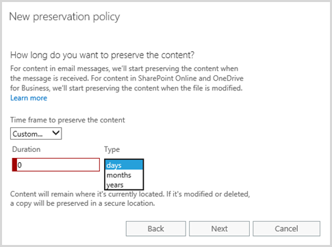

# Übersicht über AufbewahrungsrichtlinienOverview of preservation policies

> [!IMPORTANT]
> Wenn Sie eine Beibehaltung der Richtlinie verwendet haben, wurde die Richtlinie automatisch konvertiert auf einer Aufbewahrungsrichtlinie, also ein neues Feature, das bietet alle Funktionen, die eine Beibehaltung der Richtlinie wird und mehr. Die Beibehaltung der Richtlinie wird weiterhin arbeiten und Ihrer Inhalte ohne Anpassungen von Ihnen beibehalten. Sie finden diese Richtlinien auf der Seite **Aufbewahrung** in das Wertpapier &amp; Compliance Center. Weitere Informationen finden Sie unter [Änderungen bei der Beibehaltung der Richtlinien?](retention-policies.md#what-happened-to-preservation-policies)If you were using a preservation policy, that policy has been automatically converted to a retention policy, which is a new feature that does everything a preservation policy does and more. The preservation policy will continue to work and preserve your content without requiring any changes from you. You can find these policies on the **Retention** page in the Security &amp; Compliance Center. For more information, see [What happened to preservation policies?](retention-policies.md#what-happened-to-preservation-policies)
  
Organisationen möchten, um aus dem Gesundheitswesen rechts- oder interne Richtlinien entsprechen, Inhalte für einen bestimmten Zeitraum aufbewahren. Mit einer Beibehaltung der Richtlinie in Office 365 können Sie Inhalte in Websites, Postfächer und Öffentliche Ordner auf unbestimmte Zeit oder für einen bestimmten Zeitraum beibehalten. Sie können auch den Inhalt filtern, der durch die Angabe Schlüsselwörter oder einen Datumsbereich aus, um die Suchergebnisse einzuschränken beibehalten wird.To comply with industry regulations or internal policies, organizations want to preserve content for a certain period of time. With a preservation policy in Office 365, you can preserve content in sites, mailboxes, and public folders indefinitely or for a specific duration. You can also filter the content that will be preserved by supplying keywords or a date range to narrow the results.
  
Beispielsweise die Inhalte in bestimmte Postfächer und zugehörigen the Sales Department sieben Jahren Websites beibehalten werden kann, und um den Bereich der Richtlinie darauf hin, dass Sie nur Inhalte aus den letzten zwei Jahren beibehalten, die eine bestimmte möchten einzugrenzen Name des Clients.For example, you can preserve the content in specific mailboxes and sites belonging to the Sales Department for seven years, and further narrow the scope of the policy by saying that you want to preserve only content from the last two years that contains a specific client's name.
  
Wenn Inhalt zu einer Beibehaltung der Richtlinie ist, können Benutzer weiterhin bearbeiten und Arbeiten mit dem Inhalt wie Nothing zurück, da der Inhalts am ursprünglichen Speicherort direktes beibehalten geändert wird. Aber wenn jemand bearbeitet oder löscht Inhalte, die die Richtlinie gilt, wird eine Kopie an einem sicheren Speicherort, in dem es beibehalten wird, während die Richtlinie aktiviert ist.When content is subject to a preservation policy, people can continue to edit and work with the content as if nothing's changed because the content's preserved in place, in its original location. But if someone edits or deletes content that's subject to the policy, a copy is saved to a secure location where it's preserved while the policy is in effect.
  
Schließlich müssen einige Organisationen möglicherweise Einhaltung der behördlichen Texte wie die Sicherheit And Exchange Commission (s) Richtlinie 17a-4, die erforderlich sind, nachdem eine Beibehaltung der Richtlinie aktiviert ist, nicht deaktiviert oder weniger restriktiv vorgenommen definierten Regeln. Um diese Anforderung erfüllt, können Sie die Beibehaltung der Sperre verwenden. Nachdem eine Richtlinie des gesperrt wurde, niemand – einschließlich des Administrators – deaktivieren Sie die Richtlinie oder machen es weniger restriktiv können.Finally, some organizations may need to comply with rules defined by regulatory bodies such as the Securities and Exchange Commission (SEC) Rule 17a-4, which requires that after a preservation policy is turned on, it cannot be turned off or made less restrictive. To meet this requirement, you can use Preservation Lock. After a policy's been locked, no one—including the administrator—can turn off the policy or make it less restrictive.
  
Sie erstellen und Verwalten von Beibehaltung der Richtlinien auf der Seite Aufbewahrung in die Office 365-Sicherheit &amp; Compliance Center.You create and manage preservation policies on the Retention page in the Office 365 Security &amp; Compliance Center.
  

  
> [!NOTE]
> Exchange Online-Postfachs in eine Beibehaltung der Richtlinie aufnehmen möchten, muss das Postfach eine Lizenz für Exchange Online – Plan 2 zugewiesen werden. Wenn ein Postfach eine Exchange Online – Plan 1-Lizenz zugewiesen ist, müssten Sie ihm eine separate Lizenz der Exchange Online-Archivierung für die Einbeziehung in eine Beibehaltung der Richtlinie zuweisen.To include an Exchange Online mailbox in a preservation policy, the mailbox must be assigned an Exchange Online Plan 2 license. If a mailbox is assigned an Exchange Online Plan 1 license, you would have to assign it a separate Exchange Online Archiving license to include it in a preservation policy. 
  
## Funktionsweise einer Aufbewahrungsrichtlinie mit InhaltenHow a preservation policy works with content in place

Wenn Sie eine Website, Postfach oder Öffentliche Ordner in einer Richtlinie permanentes einschließen, bleibt die Inhalte am ursprünglichen Speicherort. Benutzer können ihre Dokumente oder e-Mail entwickelt weiterhin, aber eine Kopie des Inhalts, wie es vorhanden war, als Sie die Richtlinie initiiert wird beibehalten. Für Websites, Inhalte des in der Bibliothek permanentes halten werden beibehalten. für Öffentliche Ordner und Postfächer beibehalten im Ordner "wiederherstellbare Elemente" des Inhalts. Diese sicheren Orten und beibehaltenem Inhalt sind nicht für die meisten Benutzer sichtbar. Mit einer Richtlinie permanentes müssen Personen sogar nicht bekannt ist, dass ihre Inhalte die Richtlinie gilt.When you include a site, mailbox, or public folder in a preservation policy, the content remains in its original location. People can continue to work with their documents or mail, but a copy of the content as it existed when you initiated the policy is preserved. For sites, content's preserved in the Preservation Hold library; for mailboxes and public folders, content's preserved in the Recoverable Items folder. These secure locations and the preserved content are not visible to most people. With a preservation policy, people do not even need to know their content is subject to the policy.
  

  
### WebsiteinhaltSite content

Eine Beibehaltung der Richtlinie wird auf der Ebene einer Website angewendet. Wenn Sie eine Website in eine Beibehaltung der Richtlinie einschließen, wird eine Bibliothek permanentes halten erstellt, falls nicht bereits vorhanden. Die meisten Benutzer können die Bibliothek permanentes halten nicht anzeigen, da sie nur für den Besitzer der Websitesammlung angezeigt wird.A preservation policy is applied at the level of a site. When you include a site in a preservation policy, a Preservation Hold library is created, if one doesn't already exist. Most users can't view the Preservation Hold library because it's visible only to site collection owners.
  
Wenn ein Benutzer versucht, ändern oder Löschen von Inhalt in einer Website, die eine Beibehaltung der Richtlinie fällt, überprüft zuerst die Richtlinie, ob der Inhalt des geändert wurden, seit die Richtlinie angewendet wurde. Ist dies der erste ändern, da die Beibehaltung der Richtlinie angewendet wurde, wird die Richtlinie kopiert den Inhalt in der Bibliothek permanentes halten und klicken Sie dann die Person ändern oder Löschen der ursprünglichen Inhalts ermöglicht. Beachten Sie, dass alle Inhalte der Website auf die Bibliothek permanentes halten, kopiert werden kann, selbst wenn der Inhalt den Filter der Abfrage, durch die Beibehaltung der Richtlinie nicht überein.If a person attempts to change or delete content in a site that's subject to a preservation policy, first the policy checks whether the content's been changed since the policy was applied. If this is the first change since the preservation policy was applied, the policy copies the content to the Preservation Hold library, and then allows the person to change or delete the original content. Note that any content in the site can be copied to the Preservation Hold library, even if the content does not match the filter of the query used by the preservation policy.
  
In diesem Fall bereinigt ein Zeitgeberauftrag die Aufbewahrungsbibliothek. Der Zeitgeberauftrag wird regelmäßig ausgeführt und vergleicht den gesamten Inhalt der Aufbewahrungsbibliothek mit den Filtern, die von den Aufbewahrungsrichtlinien der Website verwendet werden. Fall der Inhalt nicht mindestens einem der Filter entspricht, löscht der Zeitgeberauftrag den Inhalt dauerhaft aus der Aufbewahrungsbibliothek.Then a timer job cleans up the Preservation Hold library. The timer job runs periodically and compares all content in the Preservation Hold library to the filters used by the preservation policies on the site. Unless content matches at least one of the filters, the timer job permanently deletes the content from the Preservation Hold library.
  
Die vorherigen gilt für Inhalte, die vorhanden ist, wenn die Beibehaltung der Richtlinie angewendet wird. Darüber hinaus werden alle neuen Inhalte, die erstellt oder auf der Website hinzugefügt werden, nachdem es in die Richtlinie aufgenommen wurde nach dem Löschen beibehalten. Jedoch ist nicht neuer Inhalt in der Beibehaltung halten Bibliothek die erste kopiert bearbeitet nur, wenn es gelöscht wird. Um Versionen für alle Dateien zu erhalten, müssen Sie Versionskontrolle aktivieren – finden Sie im Abschnitt höheren auf Versioning.The previous applies to content that exists when the preservation policy is applied. In addition, any new content that's created or added to the site after it was included in the policy will be preserved after deletion. However, new content isn't copied to the Preservation Hold library the first time it's edited, only when it's deleted. To preserve versions for all files, you need to turn on versioning—see the later section on versioning.
  
### Inhalte von Postfächern und öffentlichen OrdnernMailbox and public folder content

Für die E-Mails und andere Elemente eines Benutzers wird eine Aufbewahrungsrichtlinie auf Postfachebene angewendet. Für einen öffentlichen Ordner wird eine Aufbewahrungsrichtlinie auf Ordnerebene angewendet, nicht auf Postfachebene. Ein Postfach und ein öffentlicher Ordner verwenden beide den Order „Wiederherstellbare Elemente“, um Elemente beizubehalten. Nur Personen, denen eDiscovery-Berechtigungen zugewiesen wurden, können den Ordner „Wiederherstellbare Elemente“ eines anderen Benutzers anzeigen. For a user's mail and other items, a preservation policy is applied at the level of a mailbox. For a public folder, a preservation policy is applied at the folder level, not the mailbox level. Both a mailbox and a public folder use the Recoverable Items folder to preserve items. Only people that have been assigned eDiscovery permissions can view another user's Recoverable Items folder. 
  
Wenn eine Person eine Nachricht von einem anderen Ordner als dem Ordner Gelöschte Elemente löscht, wird standardmäßig die Nachricht in den Ordner Gelöschte Objekte verschoben. Wenn eine Person ein Element aus dem Ordner Gelöschte Elemente löscht, wird die Nachricht wird in den Ordner wiederherstellbare Elemente verschoben und wird nicht mehr des Benutzers angezeigt. Darüber hinaus kann eine Person weiche ein Elements (UMSCHALT + ENTF) in einen Ordner löschen die umgeht des Ordners Gelöschte Objekte und platziert das Element direkt im Ordner "wiederherstellbare Elemente".By default, when a person deletes a message from a folder other than the Deleted Items folder, the message is moved to the Deleted Items folder. When a person deletes an item from the Deleted Items folder, the message is moved to the Recoverable Items folder and disappears from the user's view. In addition, a person can soft delete an item (SHIFT+DELETE) in any folder, which bypasses the Deleted Items folder and places the item directly in the Recoverable Items folder.
  
Wenn ein Postfach in die Aufbewahrungsrichtlinie aufgenommen wird, werden gelöschte Elemente in den Ordner "DiscoveryHold" innerhalb des Ordners "Wiederherstellbare Elemente" verschoben. Beim regelmäßigen Verarbeiten des Postfachs wertet der Postfach-Assistent Nachrichten in diesem Ordner aus. Sofern der Inhalt nicht mindestens einem von einer Aufbewahrungsrichtlinie verwendeten Filter entspricht, löscht der Postfach-Assistent den Inhalt des Ordners "Wiederherstellbare Elemente" dauerhaft.When a mailbox is included in a preservation policy, deleted items are moved to the DiscoveryHold folder inside the Recoverable Items folder. When the mailbox assistant periodically processes the mailbox, it evaluates messages in this folder. Unless content matches at least one of the filters used by a preservation policy, the mailbox assistant permanently deletes the content from the Recoverable Items folder.
  
Ordner "wiederherstellbare Elemente" enthält auch einen Versionsordner. Wenn eine Person versucht, bestimmte Eigenschaften eines postfachelements ändern – beispielsweise den Betreff, body, Anlagen, Absender und Empfänger oder Datum gesendet oder empfangen wurden für eine Nachricht – eine Kopie des ursprünglichen Elements wird im Versionsordner gespeichert, bevor der Commit für die Änderung erfolgt ist. In diesem Fall für jede nachfolgende Änderung. Nachdem die Beibehaltung der Richtlinie entfernt wurde, werden durch die Postfach-Assistent Kopien im Ordner "Versionen" entfernt.The Recoverable Items folder also contains a Versions folder. When a person attempts to change certain properties of a mailbox item—such as the subject, body, attachments, senders and recipients, or date sent or received for a message—a copy of the original item is saved to the Versions folder before the change is committed. This happens for each subsequent change. After the preservation policy is removed, copies in the Versions folder are removed by the mailbox assistant.
  
### Speicherort der AufbewahrungsrichtlinieWhere a preservation policy is stored

Wenn Sie eine Beibehaltung der Richtlinie erstellen, wird es zentral gespeichert werden, in das Wertpapier &amp; Compliance Center, und klicken Sie dann auf die verschiedenen Inhaltsquellen, die die Richtlinie, wie Websites, Postfächer und Öffentliche Ordner enthält bereitgestellt.When you create a preservation policy, it's stored centrally in the Security &amp; Compliance Center and then deployed to the different content sources that the policy includes, such as sites, mailboxes, and public folders.
  
Nachdem eine Aufbewahrungsrichtlinie für diese Inhaltsquellen bereitgestellt wird, funktioniert die Richtlinie genau wie ein eDiscovery-In-Place-Archiv. Weitere Informationen zu In-Place-Aufbewahrungen finden Sie unter:After a preservation policy is deployed to those content sources, the policy works exactly the same as an eDiscovery in-place hold. For more information on in-place holds, see:
  
- [Übersicht über eDiscovery und Compliance - Archive](https://go.microsoft.com/fwlink/p/?LinkID=404352) (SharePoint Online)[Overview of eDiscovery and in-place holds](https://go.microsoft.com/fwlink/p/?LinkID=404352) (SharePoint Online) 
    
- [Compliance - Archiv und Aufbewahrung für eventuelle Rechtsstreitigkeiten](https://go.microsoft.com/fwlink/p/?LinkID=404353) (Exchange Online)[In-Place Hold and Litigation Hold](https://go.microsoft.com/fwlink/p/?LinkID=404353) (Exchange Online) 
    
- [Ordner "wiederherstellbare Elemente"](https://go.microsoft.com/fwlink/p/?LinkID=404354) (Exchange Online)[Recoverable Items Folder](https://go.microsoft.com/fwlink/p/?LinkID=404354) (Exchange Online) 
    
### Beibehaltung der Richtlinie im Vergleich zu eDiscovery HaltestatusPreservation policy vs. eDiscovery hold

Während es true ist, dass beide Features Inhalte enthalten, sollten diese Features nicht verwechselt werden, da sie verschiedene Zwecke dienen:While it's true that both of these features hold content, these features should not be confused because they serve different purposes:
  
- **Wenn Sie Inhalte im Rahmen einer Aufbewahrungsrichtlinie Anforderung beibehalten müssen, verwenden Sie eine Richtlinie permanentes.** Wenn Sie Inhalte für sieben Jahre als Teil des Projektplans Aufbewahrung beibehalten werden müssen, verwenden Sie beispielsweise eine Beibehaltung der Richtlinie. Eine Beibehaltung der Richtlinie kann Inhalte für einen bestimmten Zeitraum aufbewahren, und am Ende der angegebenen Periode des Inhalts automatisch freigegeben aus der Richtlinie. Die Richtlinie kann auch gesperrt werden, damit niemand der Richtlinie deaktivieren oder weniger restriktiv erleichtern können. Eine eDiscovery-Archiv kann nicht gesperrt werden, oder geben Sie einen Zeitraum. Darüber hinaus hat eine Beibehaltung der Richtlinie im Allgemeinen eine Dauer von Jahre, während einer eDiscovery-Archiv vorübergehend ist und häufig nur die Dauer der rechtlichen Fall dauert.**If you need to preserve content as part of a retention requirement, use a preservation policy.** For example, if you need to retain content for seven years as part of your retention plan, use a preservation policy. A preservation policy can preserve content for a specific time period, and at the end of that time period, the content's automatically released from the policy. The policy can also be locked so that no one can turn off the policy or make it less restrictive. An eDiscovery hold cannot be locked or specify a time period. Also, a preservation policy commonly has a duration of years, while an eDiscovery hold is temporary and commonly lasts only the duration of a legal case. 
    
    Darüber hinaus können Sie eine Beibehaltung der Richtlinie ohne die zusätzlichen Schritte, dass eDiscovery möglicherweise, erfordern wie das Erstellen von Fällen Hinzufügen von Mitgliedern, oder wie folgt Inhalte durchsucht erstellen.In addition, you can create a preservation policy without the additional steps that eDiscovery may require, such as creating cases, adding members, or doing content searches.
    
- **Wenn Sie Inhalte im Rahmen einer Anforderung von der rechts- oder eDiscovery halten müssen, verwenden Sie eine eDiscovery-Haltestatus.** Wenn Sie Inhalte an bestimmten Speicherorten im Rahmen einer rechtlichen Anforderung halten müssen, verwenden Sie beispielsweise eine eDiscovery-halten. Der Inhalt für eine Anfrage relevant ist in der Regel vertrauliche eDiscovery oder privilegierte, sodass andere Fällen können verschiedene Member beschränkt werden. Darüber hinaus Unterstützung von eDiscovery durch Content-Suche, die gespeichert, in der Seitenansicht angezeigt, mit erweiterten eDiscovery analysiert werden können, oder die Ergebnisse exportiert haben.**If you need to hold content as part of a legal or eDiscovery requirement, use an eDiscovery hold.** For example, if you need to hold content in specific locations as part of a legal request, use an eDiscovery hold. In eDiscovery, the content relevant to a case is typically sensitive or privileged, so different cases can be restricted to different members. In addition, eDiscovery supports content searches that can be saved, previewed, analyzed with Advanced eDiscovery, or have the results exported. 
    
    Im Gegensatz zu einer Richtlinie Beibehaltung einer eDiscovery-Archiv kann nicht Definieren eines Zeitraums - einer eDiscovery-Archiv ist gültig, bis Sie ihn deaktivieren oder zu löschen. Darüber hinaus kann ein eDiscovery Haltestatus gesperrt werden.Unlike a preservation policy, an eDiscovery hold cannot specify a time period - an eDiscovery hold is in effect until you turn it off or delete it. Also, an eDiscovery hold cannot be locked.
    
## Funktionsweise einer Aufbewahrungsrichtlinie mit Dokumentversion in einer WebsiteHow a preservation policy works with document versions in a site

Eine Beibehaltung der Richtlinie beibehalten nicht automatisch alle Versionen eines Dokuments in einer Website. Hierzu müssen Sie versionsverwaltung für die Dokumentbibliotheken auf der Website zu aktivieren. Weitere Informationen finden Sie unter [Aktivieren und Konfigurieren der versionsverwaltung für eine Liste oder Bibliothek](https://go.microsoft.com/fwlink/p/?LinkID=404350).A preservation policy doesn't automatically preserve all versions of a document in a site. To do so, you need to turn on versioning for the document libraries in the site. For more information, see [Enable and configure versioning for a list or library](https://go.microsoft.com/fwlink/p/?LinkID=404350).
  
Wenn ein Dokument wird gelöscht aus einer Website, die gespeichert wird und die dokumentversionierung für die Bibliothek aktiviert ist, werden alle Versionen des gelöschten Dokuments beibehalten.If a document is deleted from a site that's being preserved and document versioning is turned on for the library, all versions of the deleted document are preserved. 
  
Wenn dokumentversionierung ist nicht aktiviert, und ein Element mehrere permanentes Richtlinien unterliegt, wird die Version, die beibehalten wird, die aktuell ist, wenn jeder Beibehaltung der Richtlinie in Kraft treten kann. Beispielsweise wenn Version 27 eines Elements handelt es sich um das aktuellste Ergebnis die Website beibehalten wird die erste Uhrzeit und Version 51 das aktuellste Ergebnis wird bei die Website der zweites Mal Versionen 27 und 51 beibehalten wird werden beibehalten.If document versioning isn't turned on and an item is subject to several preservation policies, the version that's preserved is the one that's current when each preservation policy takes effect. For example, if version 27 of an item is the most recent when the site is preserved the first time, and version 51 is the most recent when the site is preserved the second time, versions 27 and 51 are preserved.
  
## Filtern einer AufbewahrungsrichtlinieFiltering a preservation policy

Sie können die von einer Aufbewahrungsrichtlinie erfassten Inhalte eingrenzen, indem Sie der Richtlinie Schlüsselwörter oder einen Datumsbereich hinzufügen.You can narrow down the content subject to a preservation policy by adding keywords or a date range to the policy. 
  

  
### Filtern mithilfe von SchlüsselwörternFilter by using keywords

Eine Beibehaltung der Richtlinie unterstützt Keyword Query Language (KQL). Beispielsweise können Sie grundlegende Operatoren wie und und oder, und Sie können eine Suche, wobei "Wingtip NEAR(30) Marketing" Ergebnisse bezeichnet wird, in dem "Wingtip" 30 Zeichen "Marketing". Eine schlüsselwortabfrage unterstützt Sie beim Identifizieren und Beibehalten von nur der relevante Inhalte.A preservation policy supports Keyword Query Language (KQL). For example, you can use basic operators like AND and OR, and you can do a proximity search where "wingtip NEAR(30) marketing" identifies results where "wingtip" is within 30 characters of "marketing". A keyword query helps you to identify and preserve just the relevant content.
  
### Filtern mithilfe eines DatumsbereichsFilter by using a date range

Sie können die Aufbewahrung auch filtern, sodass nur Inhalte innerhalb eines bestimmten Datumsbereichs beibehalten werden. Für Nachrichten ist das Datum relativ zum Empfangsdatum und für Dokumente und Websites ist das Datum relativ zum Änderungsdatum. Das bedeutet, dass Sie Inhalte beibehalten können, die empfangene E-Mails und geänderte Dokumente innerhalb eines bestimmten Datumsbereichs oder vor oder nach einem Start- oder Enddatum umfassen.You can also filter the policy so that it preserves only content within a specific date range. For messages, the date is relative to the received date, and for documents and sites, the date is relative to the modified date. This means you can preserve content that includes mail received and documents modified within a specific date range or before or after a start or end date.
  
## Aufbewahren von Inhalten für einen bestimmten ZeitraumPreserving content for a specific period of time

Mit einer Aufbewahrungsrichtlinie können Sie Inhalte für unbegrenzte Zeit oder für eine bestimmte Anzahl von Tagen, Monaten oder Jahren aufbewahren. Beachten Sie, dass die Dauer der Inhaltsaufbewahrung anhand des Alters des Inhalts berechnet wird, nicht anhand des Erstellungsdatums der Richtlinie.With a preservation policy, you can preserve content indefinitely or for a specific number of days, months, or years. Note that the duration for how long content is preserved is calculated from the age of the content, not from when the preservation policy is created. 
  
Beispielsweise wenn Inhalte in einer Website sieben Jahren und in einem Dokument erhalten bleiben soll dieser Website noch nicht in sechs Jahren geändert wurde, wird das Dokument nur einen anderen Jahr beibehalten, wenn es nicht geändert wird. Wenn das Dokument erneut bearbeitet wird, wird das Alter des Dokuments aus der neuen Datum der letzten Änderung berechnet und beibehalten wird, ein anderes sieben Jahre.For example, if you want to preserve content in a site for seven years, and a document in that site hasn't been modified in six years, the document will be preserved for only another year if it's not modified. If the document is edited again, the age of the document is calculated from the new last modified date, and it will be preserved for another seven years.
  
Wenn Sie also Inhalte eines Postfachs sieben Jahre lang aufbewahren möchten und eine Nachricht vor sechs Jahren gesendet wurde, wird die Nachricht nur noch ein Jahr aufbewahrt, falls das Empfangsdatum nicht geändert wird. In diesem Falls wird eine neue Version der Nachricht, wie sie vor der Bearbeitung vorhanden war, im Ordner "Wiederherstellbare Elemente" aufbewahrt, und das Alter der Nachricht wird anhand des neuen Empfangsdatums berechnet. Danach wird sie für weitere sieben Jahre aufbewahrt.Similarly, if you want to preserve content in a mailbox for seven years, and a message was sent six years ago, the message will be preserved for only one year unless the date received is modified. In this case, a new version of the message as it existed before it was edited is preserved in the Recoverable Items folder, and the age of the message is calculated from the new date received, and it will be preserved for another seven years.
  

  
## Sperren einer AufbewahrungsrichtlinieLocking a preservation policy

In einigen Unternehmen müssen möglicherweise Einhaltung der behördlichen Texte wie die Sicherheit And Exchange Commission (s) Richtlinie 17a-4, die erforderlich sind, nachdem eine Beibehaltung der Richtlinie aktiviert ist, nicht deaktiviert oder weniger restriktiv vorgenommen definierten Regeln. Mit Sperre ein permanentes, können Sie also die Richtlinie sperren, dass kein anderer – einschließlich des Administrators – deaktivieren Sie die Richtlinie oder machen es weniger restriktiv können.Some organizations may need to comply with rules defined by regulatory bodies such as the Securities and Exchange Commission (SEC) Rule 17a-4, which requires that after a preservation policy is turned on, it cannot be turned off or made less restrictive. With Preservation Lock, you can lock the policy so that no one—including the administrator—can turn off the policy or make it less restrictive.
  
Nachdem eine Richtlinie des gesperrt wurde, kann niemand deaktivieren oder Entfernen von Inhalt aus der Richtlinie. Und es ist nicht möglich, ändern oder Löschen von Inhalt, das die Richtlinie während des Berichtszeitraums permanentes fällt. Nachdem die Richtlinie des gesperrt wurde, sind die einzigen Möglichkeiten, die Sie die Beibehaltung der Richtlinie bearbeiten können durch Hinzufügen von Inhalt oder seine Dauer erweitern. Eine Richtlinie gesperrte erhöht oder erweitert werden kann, jedoch nicht verringert oder deaktiviert.After a policy's been locked, no one can turn it off or remove content from the policy. And it's not possible to modify or delete content that's subject to the policy during the preservation period. After the policy's been locked, the only ways you can modify the preservation policy are by adding content to it or extending its duration. A locked policy can be increased or extended, but it can't be reduced or turned off.
  
Aus diesem Grund, bevor Sie eine Beibehaltung der Richtlinie sperren, ist es wichtig, dass Sie Compliance-Bestimmungen Ihrer Organisation verstehen und keine Richtlinie zu sperren, bis Sie sicher sind, dass er ist, was Sie benötigen.Therefore, before you lock a preservation policy, it's critical that you understand your organization's compliance requirements, and that you do not lock a policy until you are certain that it's what you need.
  

  
## Eine Beibehaltung der Richtlinie deaktivierenTurning off a preservation policy

Wenn Sie nicht die Beibehaltung der Richtlinie zu sperren, können Sie sie jederzeit, auch vor Ablauf des Zeitraums, durch die Richtlinie festgelegten freigeben. Hierzu müssen Sie nur die Richtlinie deaktivieren.If you choose not to lock the preservation policy, you can release it at any time, including before the end of the time period specified by the policy. To do so, just turn off the policy.
  

  
Jedoch können Sie eine Beibehaltung der Richtlinie nicht löschen, während die Richtlinie noch aktiv's. Um eine Beibehaltung der Richtlinie zu löschen, deaktivieren Sie zuerst, und löschen Sie die Richtlinie.However, you can't delete a preservation policy while the policy's still active. To delete a preservation policy, first turn off and then delete the policy.
  
Nachdem Sie eine Beibehaltung der Richtlinie deaktiviert haben, sind alle Elemente dieser Richtlinie in der Bibliothek permanentes halten oder Ordner "wiederherstellbare Elemente" für das zuvor beschriebene Verfahren standard Cleanup. Beachten Sie, dass dies bedeutet, dass Objekte freigegeben von einer Richtlinie nicht sofort gelöscht werden. Stattdessen bleiben sie in der Bibliothek permanentes halten oder Ordner "wiederherstellbare Elemente", bis der Prozess in regelmäßigen Abständen die Bibliothek oder einen Ordner bereinigt.After you turn off a preservation policy, all items subject to that policy in the Preservation Hold library or Recoverable Items folder are eligible for the standard cleanup process described earlier. Note that this means that items released from a policy are not immediately deleted; instead, they remain in the Preservation Hold library or Recoverable Items folder until the process periodically cleans up the library or folder.
  
## Verwenden von Aufbewahrungsrichtlinien mit DokumentlöschrichtlinienUsing preservation policies with retention policies and document deletion policies

Eine Aufbewahrungsrichtlinie stellt sicher, dass Inhalte auf unbegrenzte Zeit oder für einen bestimmten Zeitraum beibehalten werden, während eine Aufbewahrungsrichtlinie für ein Postfach und eine Dokumentlöschrichtlinie für eine Website sicherstellt, dass Inhalte nach einer bestimmten Zeit gelöscht werden.  Wenn Sie Inhalte für einen festen Zeitraum beibehalten müssen, können Sie eine Aufbewahrungsrichtlinie zusammen mit einer Löschrichtlinie verwenden.A preservation policy ensures that content is preserved indefinitely or for a specific period of time, while a retention policy for a mailbox and a document deletion policy for a site ensures that content is deleted after a specific period of time. If you need to retain content for a fixed period of time, you can use a preservation policy in conjunction with a retention or deletion policy. 
  
### WebsiteinhaltSite content

Für eine Website können Sie eine Aufbewahrungsrichtlinie zusammen mit einer Dokumentlöschrichtlinie verwenden. Sie können beispielsweise Dokumente nach einer Änderung fünf Jahre lang aufbewahren und dann eine Löschrichtlinie einrichten, um sie fünf Jahre nach der letzten Änderung zu löschen.For a site, you can use a preservation policy in conjunction with a document deletion policy. For example, you could preserve documents for five years after they are modified, and then set up a deletion policy to delete them five years after they were last modified.
  
Eine dokumentlöschrichtlinie Inhalt löscht, das eine Beibehaltung der Richtlinie fällt, wird der Inhalt noch in der Bibliothek permanentes halten beibehalten. Beispielsweise werden, wenn eine Beibehaltung der Richtlinie Inhalt für zwei Jahre behält, aber eine dokumentlöschrichtlinie löscht den Inhalt nach einem Jahr, alle Inhalte, die gelöscht wird weiterhin beibehalten. Weitere Informationen finden Sie unter [Übersicht über dokumentlöschrichtlinien](https://support.office.com/article/55e8d858-f278-482b-a198-2e62d6a2e6e5).If a document deletion policy deletes content that's subject to a preservation policy, the content will still be preserved in the Preservation Hold library. For example, if a preservation policy preserves content for two years, but a document deletion policy deletes content after one year, any content that's deleted will still be preserved. For more information, see [Overview of document deletion policies](https://support.office.com/article/55e8d858-f278-482b-a198-2e62d6a2e6e5).
  
### Inhalt von PostfächernMailbox content

Sie können für ein Postfach eine Beibehaltung der Richtlinie mit einer Aufbewahrungsrichtlinie kombinieren, die eine einzelne Richtlinie Standardtag verfügt. Beispielsweise konnten Sie beibehalten von postfachelementen sieben Jahren, und klicken Sie dann richten Sie eine Aufbewahrungsrichtlinie zu löschen sieben Jahre nach (für Nachrichten empfangen) oder (für Elemente, die gesendet werden nicht, wie Notes) erstellt wurden. Die Beibehaltung der Richtlinie wird sichergestellt, dass Elemente, die gelöscht für mindestens die angegebene Dauer, erhalten bleiben, während die Aufbewahrungsrichtlinie wird sichergestellt, dass am Ende dieses Zeitraums Postfachelemente gelöscht werden. Weitere Informationen finden Sie unter [aufbewahrungstags und Aufbewahrungsrichtlinien](https://go.microsoft.com/fwlink/p/?LinkID=404351).For a mailbox, you can combine a preservation policy with a retention policy that has a single default policy tag. For example, you could preserve mailbox items for seven years, and then set up a retention policy to delete them seven years after they were received (for messages) or created (for items that aren't sent, like notes). The preservation policy ensures that items that get deleted are preserved for at least the specified duration, while the retention policy ensures that mailbox items are deleted at the end of that period. For more information, see [Retention tags and retention policies](https://go.microsoft.com/fwlink/p/?LinkID=404351).
  
## BerechtigungenPermissions

Mitglieder Ihres Teams Compliance, die die Sicherheit zu nutzen, werden &amp; Compliance Center permanentes Richtlinien erstellen benötigen Berechtigungen, um die:Members of your compliance team who will use the Security &amp; Compliance Center to create preservation policies need permissions to the:
  
-  Office 365 Security &amp; Compliance CenterOffice 365 Security &amp; Compliance Center 
    
- Websites mit Inhalten, die beibehalten werden sollenSites with content that needs to be preserved
    
- Postfächer mit Inhalten, die beibehalten werden sollenMailboxes with content that needs to be preserved
    
### Office 365 Security &amp; Compliance CenterOffice 365 Security &amp; Compliance Center

Als ein Administrator, Compliance Officer und anderen Personen Zugriff auf die Sicherheit gewähren können sollen &amp; Compliance Center, ohne dass sie alle erforderlichen Berechtigungen von einem Mandanten Admin. Weitere Informationen finden Sie unter [Berechtigungen in der Office 365-Sicherheit &amp; Compliance Center](permissions-in-the-security-and-compliance-center.md).As a tenant admin, you want to be able to give compliance officers and other people access to the Security &amp; Compliance Center, without giving them all of the permissions of a tenant admin. For more information, see [Permissions in the Office 365 Security &amp; Compliance Center](permissions-in-the-security-and-compliance-center.md).
  
### WebsitesSites

Mitglieder Ihres Kompatibilitätsteams, die Aufbewahrungsrichtlinien erstellen, benötigen Berechtigungen für die Websitesammlungen, auf die die Richtlinien angewendet werden: Wenn auch Compliance Officers Dokumentlöschrichtlinien erstellen, benötigen sie darüber hinaus Berechtigungen für die Compliance Policy Center-Websitesammlung, in der Dokumentlöschrichtlinien erstellt und gespeichert werden. Wir empfehlen, dass Sie wie folgt vorgehen:Members of your compliance team who create preservation policies need permissions to the site collections to which policies will be applied. In addition, if compliance officers also create document deletion policies, they need permissions to the Compliance Policy Center site collection where document deletion policies are created and stored. We recommend that you:
  
1. Erstellen Sie eine Sicherheitsgruppe, die alle Benutzer der Richtlinie Compliance Center enthält – wahrscheinlich Compliance richtlinienverwaltung Team. Weitere Informationen finden Sie unter [Manage Mail-Enabled-Sicherheitsgruppen](https://go.microsoft.com/fwlink/p/?LinkID=404345) .Create a security group that contains all users of the Compliance Policy Center — most likely your compliance policy-management team. See [Manage Mail-Enabled Security Groups](https://go.microsoft.com/fwlink/p/?LinkID=404345) for more information. 
    
2. Fügen Sie die Sicherheitsgruppe im Compliance Center Richtlinie um der Gruppe der Besitzer. Weitere Informationen finden Sie unter [Berechtigungen für Administratoren von Websitesammlungen](https://go.microsoft.com/fwlink/p/?LinkID=404346) .In the Compliance Policy Center, add the security group to the site collection Owners group. See [Permissions for site collection administrators](https://go.microsoft.com/fwlink/p/?LinkID=404346) for more information. 
    
3. Fügen Sie in jeder Websitesammlung, der Sie Aufbewahrungsrichtlinien zuweisen möchten, die Sicherheitsgruppe zur Gruppe der Websitesammlungs-Besucher (mit Leseberechtigungen) hinzu.In each site collection to which you need to assign preservation policies, add the security group to the site collection Visitors group (read permissions).
    
### Postfächer und öffentliche OrdnerMailboxes and public folders

Um eine Aufbewahrungsrichtlinie auf ein Postfach anzuwenden, muss der Compliance Officer zumindest die Leseberechtigung für dieses Postfach haben.To apply a preservation policy to a mailbox, compliance officers need at least read permissions for that mailbox. 
  
Um eine Aufbewahrungsrichtlinie auf einen öffentlichen Ordner anzuwenden, muss der Compliance Officer zumindest die Leseberechtigung für alle öffentlichen Ordner haben.To apply a preservation policy to a public folder, compliance officers need at least read permissions for all of the public folders.
  

