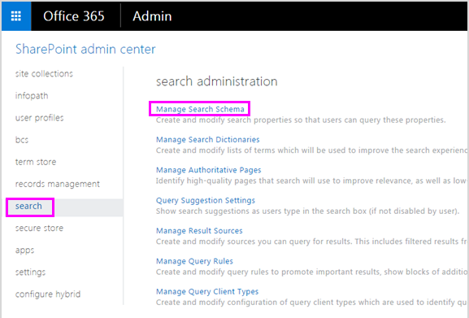

# <a name="create-a-dlp-policy-to-protect-documents-with-fci-or-other-properties"></a>Erstellen einer DLP-Richtlinie zum Schützen von Dokumenten mit FCI oder anderen Eigenschaften

In Office 365 können Sie eine DLP-Richtlinie (Data Loss Prevention, Verhinderung von Datenverlust) verwenden, um vertrauliche Informationen zu ermitteln, zu überwachen und zu schützen. Viele Organisationen verfügen mithilfe der Klassifikationseigenschaften in Windows Dateiklassifizierungsinfrastruktur (FCI, File Classification Infrastructure), der Dokumenteigenschaften in SharePoint oder Dokumenteigenschaften, die von einem Drittanbietersystem angewendet werden, bereits über einen Prozess zum Identifizieren und Klassifizieren vertraulicher Informationen. Wenn dies auf Ihre Organisation zutrifft, können Sie eine DLP-Richtlinie in Office 365 erstellen, welche die Eigenschaften erkennt, die von Windows Server FCI oder einem anderen System auf Dokumente angewendet wurden, damit die DLP-Richtlinie bei Office-Dokumenten mit bestimmten FCI- oder anderen Eigenschaftswerten erzwungen werden kann.
  

  
Ihre Organisation verwendet z. B. möglicherweise Windows Server FCI zum Identifizieren von Dokumenten mit personenbezogenen Informationen (PII) wie Sozialversicherungsnummern und zum anschließenden Klassifizieren des Dokuments durch Festlegen der Eigenschaft **Personenbezogene Informationen** auf **Hoch**, **Mittel**, **Niedrig**, **Öffentlich** oder **Keine personenbezogenen Informationen** basierend auf dem Typ und der Anzahl von Vorkommen von personenbezogenen Informationen, die im Dokument gefunden werden. In Office 365 können Sie eine DLP-Richtlinie erstellen, die Dokumente identifiziert, bei denen diese Eigenschaft auf bestimmte Werte festgelegt ist, z. B. **Hoch** und **Mittel**, und dann eine Aktion ausführt und z. B. den Zugriff auf diese Dateien sperrt. Die gleiche Richtlinie kann eine andere Regel enthalten, die eine andere Aktion ausführt, wenn die Eigenschaft auf **Niedrig** festgelegt ist und z. B. eine E-Mail-Benachrichtigung sendet. Auf diese Weise wird DLP in Office 365 in Windows Server FCI integriert und kann dazu beitragen, Office-Dokumente, die hochgeladen oder in Office 365 freigegeben wurden, von Windows Server-basierten Dateiservern zu schützen.
  
Eine DLP-Richtlinie sucht einfach nach einem bestimmten Eigenschafts-Name-Wert-Paar. Eine beliebige Dokumenteigenschaft kann verwendet werden, solange die Eigenschaft über eine entsprechende verwaltete Eigenschaft für die SharePoint-Suche verfügt. Eine SharePoint-Websitesammlung verwendet z. B. möglicherweise einen Inhaltstyp namens **Reisebericht** mit einem erforderlichen Feld namens **Kunde**. Wenn eine Person einen Reisebericht erstellt, muss sie den Namen des Kunden eingeben. Dieses Eigenschafts-Name-Wert-Paar kann auch in einer DLP-Richtlinie verwendet werden – z. B. wenn Sie eine Regel möchten, die den Zugriff auf das Dokument für externe Benutzer sperrt, wenn das Feld **Kunde****Contoso** enthält.
  
Wenn Sie Ihre DLP-Richtlinie auf Inhalte mit bestimmten Office 365-Bezeichnungen anwenden möchten, sollten Sie die hier beschriebenen Schritte nicht ausführen. Erfahren Sie stattdessen, wie Sie [eine Bezeichnung als Bedingung in einer DLP-Richtlinie verwenden](data-loss-prevention-policies.md#using-a-label-as-a-condition-in-a-dlp-policy).
  
## <a name="before-you-create-the-dlp-policy"></a>Bevor Sie die DLP-Richtlinie erstellen

Bevor Sie eine Windows Server FCI-Eigenschaft oder eine andere Eigenschaft in einer DLP-Richtlinie verwenden können, müssen Sie im SharePoint Admin Center eine verwaltete Eigenschaft erstellen. Hier ist der Grund.
  
Beispiele
  
Dies ist wichtig, da DLP in Office 365 den Suchcrawler zum Identifizieren und Klassifizieren vertraulicher Informationen auf Ihren Websites verwendet und dann diese vertraulichen Informationen in einem sicheren Bereich des Suchindex speichert. Wenn Sie ein Dokument in Office 365 hochladen, erstellt SharePoint automatisch durchforstete Eigenschaften auf Grundlage der Dokumenteigenschaften. Um aber eine FCI- oder eine andere Eigenschaft in einer DLP-Richtlinie zu verwenden, muss die durchforstete Eigenschaft einer verwalteten Eigenschaft zugeordnet werden, damit Inhalt mit dieser Eigenschaft im Index gespeichert wird.
  
Weitere Informationen zu Such-und verwalteten Eigenschaften finden Sie unter [Manage the search Schema in SharePoint Online](http://go.microsoft.com/fwlink/p/?LinkID=627454).
  
### <a name="step-1-upload-a-document-with-the-needed-property-to-office-365"></a>Schritt 1: Hochladen eines Dokuments mit der erforderlichen Eigenschaft in Office 365

Sie müssen zuerst ein Dokument mit der Eigenschaft hochladen, auf die Sie in der DLP-Richtlinie verweisen möchten. Office 365 erkennt die Eigenschaft und erstellt daraus automatisch eine durchforstete Eigenschaft. Im nächsten Schritt erstellen Sie eine verwaltete Eigenschaft und ordnen die verwaltete Eigenschaft dann dieser durchforstete Eigenschaft zu.
  
### <a name="step-2-create-a-managed-property"></a>Schritt 2: Erstellen einer verwalteten Eigenschaft

1. Melden Sie sich beim Microsoft 365 Admin Center an.
    
2. Wählen Sie im linken Navigationsbereich **Admin Center** \> **SharePoint**aus. Sie befinden sich jetzt im SharePoint Admin Center.
    
3. Wählen Sie in der linken Navigations **** \> Leiste auf der Seite \> **Suchverwaltung** die Option Such **Schema verwalten**aus.
    
    
  
4. Auf der Seite " **verwaltete Eigenschaften** " \> wird eine **neue verwaltete Eigenschaft**angezeigt.
    
    
  
5. Geben Sie einen Namen und eine Beschreibung für die Eigenschaft ein. Dieser Name wird in den DLP-Richtlinien angezeigt.
    
6. Wählen Sie für **Typ****Text**. 
    
7. Wählen Sie unter **Haupteigenschaften****Abfragbar** und **Abrufbar**.
    
8. Fügen Sie unter **Zuordnungen zu durchforstete Eigenschaften** \> **eine Zuordnung hinzu**.
    
9. Suchen und wählen Sie im Dialogfeld **** \> durch **forstete Eigenschaften Auswahl** die durchforstete Eigenschaft aus, die der Windows Server FCI-Eigenschaft oder anderen Eigenschaften entspricht, die Sie in der DLP \> -Richtlinie verwenden möchten.
    
    
  
10. Am unteren Rand der Seite \> **OK**.
    
## <a name="create-a-dlp-policy-that-uses-an-fci-property-or-other-property"></a>Erstellen einer DLP-Richtlinie, die eine FCI-Eigenschaft oder eine andere Eigenschaft verwendet

In diesem Beispiel verwendet eine Organisation die FCI auf Ihren Windows Server-basierten Dateiservern; insbesondere verwenden Sie die FCI-Klassifikations Eigenschaft mit dem Namen **personenbezogene Informationen** mit möglichen Werten **hoch**, **moderat**, **niedrig**, **öffentlich**und **nicht PII**. Jetzt möchten Sie Ihre vorhandene FCI-Klassifizierung in ihren DLP-Richtlinien in Office 365 nutzen.
  
Zunächst führen sie die oben beschriebenen Schritte zum Erstellen einer verwalteten Eigenschaft in SharePoint Online aus, die der durchforsteten Eigenschaft zugeordnet wird, die automatisch aus der FCI-Eigenschaft erstellt wurde.
  
Als Nächstes erstellen Sie eine DLP-Richtlinie mit zwei Regeln, die beide die Bedingungs Dokumenteigenschaften verwenden, die **einen der folgenden Werte enthalten**:
  
- **FCI-PII-Inhalte – hoch, moderat** Die erste Regel schränkt den Zugriff auf das Dokument ein, wenn die FCI-Klassifizierungseigenschaft **persönlich identifizierbare Informationen** gleich **hoch** oder **moderat** ist und das Dokument für Personen außerhalb der Organisation freigegeben wird. 
    
- **FCI-PII-Inhalte – niedrig** Die zweite Regel sendet eine Benachrichtigung an den Dokumentbesitzer, wenn die FCI-Klassifizierungseigenschaft **persönlich identifizierbare Informationen** gleich **niedrig** ist und das Dokument für Personen außerhalb der Organisation freigegeben wird. 
    
### <a name="create-the-dlp-policy-by-using-powershell"></a>Erstellen der DLP-Richtlinie mithilfe von PowerShell

Beachten Sie, dass die Bedingungs **Dokumenteigenschaften einen dieser Werte** in der Benutzeroberfläche des Security &amp; Compliance Centers vorübergehend nicht verfügbar sind, aber Sie können diese Bedingung weiterhin mithilfe von PowerShell verwenden. Sie können `New\Set\Get-DlpCompliancePolicy` die Cmdlets verwenden, um mit einer DLP-Richtlinie zu arbeiten `New\Set\Get-DlpComplianceRule` , und die Cmdlets mit dem `ContentPropertyContainsWords` Parameter zum Hinzufügen der Bedingung **Dokumenteigenschaften enthalten einen dieser Werte**.
  
Weitere Informationen zu diesen Cmdlets finden Sie unter [Office 365 Security &amp; Compliance Center](http://go.microsoft.com/fwlink/?LinkID=799772&amp;clcid=0x409)-Cmdlets.
  
1. [Eine Verbindung zum Office 365 Security &amp; Compliance Center mithilfe von Remote-PowerShell herstellen](http://go.microsoft.com/fwlink/?LinkID=799771&amp;clcid=0x409)
    
2. Erstellen Sie die Richtlinie `New-DlpCompliancePolicy`mithilfe von.
    
    Im folgenden finden Sie ein PowerShell-Beispiel, das eine DLP-Richtlinie erstellt, die für alle Standorte gilt.
    
      ```
      New-DlpCompliancePolicy -Name FCI_PII_policy -ExchangeLocation All -SharePointLocation All -OneDriveLocation All -Mode Enable
      ```

3. Erstellen Sie die beiden `New-DlpComplianceRule`oben beschriebenen Regeln, indem Sie, wobei eine Regel für den **niedrigen** Wert gilt, und eine andere Regel für die **hohen** und **moderaten** Werte. 
    
    Im folgenden finden Sie ein PowerShell-Beispiel, in dem diese beiden Regeln erstellt werden. Beachten Sie, dass die Eigenschaft Name/Wert-Paare in Anführungszeichen eingeschlossen sind, und ein Eigenschaften Name kann mehrere Werte durch Kommata getrennt angeben, wie`"<Property1>:<Value1>,<Value2>","<Property2>:<Value3>,<Value4>"....`
    
      ```
      New-DlpComplianceRule -Name FCI_PII_content-High,Moderate -Policy FCI_PII_policy -AccessScope NotInOrganization -BlockAccess $true -ContentPropertyContainsWords "Personally Identifiable Information:High,Moderate" -Disabled $falseNew-DlpComplianceRule -Name FCI_PII_content-Low -Policy FCI_PII_policy -AccessScope NotInOrganization -BlockAccess $false -ContentPropertyContainsWords "Personally Identifiable Information:Low" -Disabled $false -NotifyUser Owner
      ```

    Beachten Sie, dass Windows Server FCI viele integrierte Eigenschaften enthält, einschließlich **persönlich identifizierbarer Informationen** , die in diesem Beispiel verwendet werden. Die möglichen Werte für jede Eigenschaft können für jede Organisation unterschiedlich sein. Die hier verwendeten **hohen**, **moderaten**und **niedrigen** Werte sind nur ein Beispiel. Für Ihre Organisation können Sie die Eigenschaften der Windows Server FCI-Klassifizierung mit ihren möglichen Werten im Ressourcen-Manager für Dateiserver auf dem Windows Server-basierten Dateiserver anzeigen. Weitere Informationen finden Sie unter [Create a classification Property](http://go.microsoft.com/fwlink/p/?LinkID=627456).
    
Wenn Sie fertig sind, sollte Ihre Richtlinie zwei neue Regeln haben, die beide die Dokumenteigenschaften verwenden, die **eine dieser Werte Bedingung enthalten** . Beachten Sie, dass diese Bedingung nicht auf der Benutzeroberfläche angezeigt wird, obwohl die anderen Bedingungen, Aktionen und Einstellungen angezeigt werden. 
  
Eine Regel sperrt den Zugriff auf Inhalte, bei denen die Eigenschaft **Personenbezogene Informationen** den Wert **Hoch** oder **Mittel** aufweist. Eine zweite Regel sendet eine Benachrichtigung über Inhalte, bei denen die Eigenschaft **Personenbezogene Informationen** den Wert **Niedrig** aufweist.
  

  
## <a name="after-you-create-the-dlp-policy"></a>Nachdem Sie die DLP-Richtlinie erstellt haben

Durch Ausführen der Schritte in den vorherigen Abschnitten wird eine DLP-Richtlinie erstellt, die Inhalte mit dieser Eigenschaft schnell ermittelt, aber nur dann, wenn diese Inhalte neu hochgeladen werden (sodass der Inhalt indiziert wird), oder wenn dieser Inhalt alt ist, aber gerade bearbeitet wurde (sodass der Inhalt erneut indiziert wird). .
  
Um überall Inhalte mit dieser Eigenschaft zu ermitteln, sollten Sie manuell anfordern, dass die Bibliothek, Website oder Websitesammlung neu indiziert werden, damit die DLP-Richtlinie alle Inhalte mit dieser Eigenschaft kennt. In SharePoint Online werden Inhalte basierend auf einem definierten Durchforstungszeitplan automatisch durchforstet. Der Crawler ruft Inhalte ab, die seit der letzten Durchforstung geändert wurden, und aktualisiert den Index. Wenn Ihre DLP-Richtlinie Inhalte vor der nächsten geplanten Durchforstung schützen soll, können Sie diese Schritte ausführen.
  
> [!CAUTION]
> Erneute Indizierung einer Website kann das Suchsystem massiv belasten. Indizieren Sie Ihre Website nur dann neu, wenn Ihr Szenario dies unbedingt erfordert. 
  
Weitere Informationen finden Sie unter [Manuelles anfordern von Crawlen und Neuindizieren einer Website, einer Bibliothek oder einer Liste](http://go.microsoft.com/fwlink/p/?LinkID=627457).
  
### <a name="re-index-a-site-optional"></a>Erneute Indizierung einer Website (optional)

1. Klicken Sie auf der Website auf **Einstellungen** (Zahnradsymbol oben rechts) \> **Websiteeinstellungen**.
    
2. Wählen Sie unter **Suchen**die Option **Suche und Offline Verfügbarkeits** \> **Website**neu indizieren aus.
    
## <a name="more-information"></a>Weitere Informationen

- [Übersicht über die Richtlinien zur Verhinderung von Datenverlust](data-loss-prevention-policies.md)
    
- [Erstellen einer DLP-Richtlinie aus einer Vorlage](create-a-dlp-policy-from-a-template.md)
    
- [Senden von Benachrichtigungen und Anzeigen von Richtlinientipps für DLP-Richtlinien](use-notifications-and-policy-tips.md)
    
- [Inhalt der DLP-Richtlinienvorlagen](what-the-dlp-policy-templates-include.md)
    
- [Verfügbare Arten von vertraulichen Informationen](what-the-sensitive-information-types-look-for.md)
    

