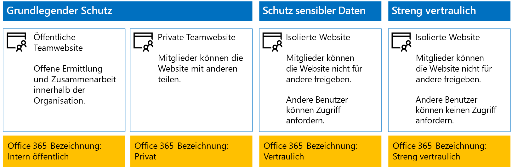
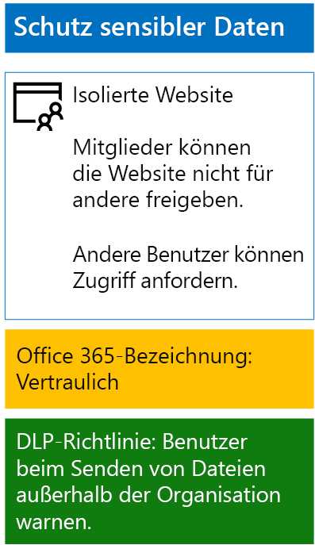
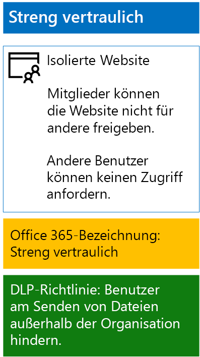

# <a name="protect-sharepoint-online-files-with-office-365-labels-and-dlp"></a>Schützen von SharePoint Online-Dateien mit Office 365-Bezeichnungen und Verhindern von Datenverlust

 **Zusammenfassung:** Wenden Sie Richtlinien von Office 365-Bezeichnungen und der Verhinderung von Datenverlust (DLP) für SharePoint Online-Teamwebsites mit unterschiedlichen Ebenen des Informationsschutzes an.
  
Führen Sie die in diesem Artikel aufgeführten Schritte durch, um Office 365-Bezeichnungen und DLP-Richtlinien für SharePoint Online-Teamwebsites mit Basisschutz, Schutz vertraulicher und streng vertraulicher Daten zu entwerfen und bereitzustellen. Weitere Informationen zu diesen drei Ebenen des Schutzes finden Sie unter [Secure SharePoint Online sites and files](secure-sharepoint-online-sites-and-files.md).
  
## <a name="how-this-works"></a>Funktionsweise
1. Erstellen Sie die gewünschten Bezeichnungen und veröffentlichen Sie sie. Es kann bis zu 12 Stunden dauern, bis die Bezeichnungen veröffentlicht werden.
2. Bearbeiten Sie für die gewünschten SharePoint-Websites die Einstellungen für die Dokumentbibliothek, um eine Bezeichnung auf Elemente in der Bibliothek anzuwenden.
3. Erstellen Sie DLP-Richtlinien, um Aktionen basierend auf den Bezeichnungen auszuführen.

Wenn Benutzer ein Dokument zur Bibliothek hinzufügen, erhält das Dokument standardmäßig die zugewiesene Bezeichnung. Benutzer können die Bezeichnung bei Bedarf ändern. Wenn ein Benutzer ein Dokument außerhalb der Organisation freigibt, überprüft DLP, ob eine Bezeichnung zugewiesen ist, und ergreift entsprechende Maßnahmen, wenn eine DLP-Richtlinie der Bezeichnung entspricht. DLP prüft auch auf andere Richtlinienübereinstimmungen, wie z. B. den Schutz von Dateien mit Kreditkartennummern, wenn diese Art von Richtlinie konfiguriert ist. 

## <a name="office-365-labels-for-your-sharepoint-online-sites"></a>Office 365-Bezeichnungen für Ihre SharePoint Online-Websites

Es gibt drei Phasen beim Erstellen und anschließenden Zuweisen von Office 365-Bezeichnungen zu SharePoint Online-Teamwebsites.
  
### <a name="phase-1-determine-the-office-365-label-names"></a>Phase 1: Bestimmen der Office 365-Bezeichnungsnamen

In dieser Phase bestimmen Sie die Namen Ihrer Office 365-Bezeichnungen für die vier Ebenen des Informationsschutzes, der auf SharePoint Online-Teamwebsites angewendet wird. Die folgende Tabelle listet die empfohlenen Namen für jede Ebene auf.
  
|**Schutzebene der SharePoint Online-Teamwebsite**|**Bezeichnungsname**|
|:-----|:-----|
|Grundlegend-Öffentlich  <br/> |Intern Öffentlich  <br/> |
|Grundlegend-Privat  <br/> |Private  <br/> |
|Vertraulich  <br/> |Vertraulich  <br/> |
|Streng vertraulich  <br/> |Streng vertraulich  <br/> |
   
### <a name="phase-2-create-the-office-365-labels"></a>Phase 2: Erstellen von Office 365-Bezeichnungen

In dieser Phase erstellen und veröffentlichen Sie Ihre bestimmten Bezeichnungen für die unterschiedlichen Ebenen des Informationsschutzes.
  
Zum Erstellen der Bezeichnungen können Sie das Office 365 Admin Center oder Microsoft PowerShell.
  
### <a name="create-office-365-labels-with-the-office-365-admin-center"></a>Erstellen von Office 365-Bezeichnungen mit dem Office 365 Admin Center

1. Melden Sie sich mit einem Konto beim Office 365-Portal an, das über die Rolle „Sicherheitsadministrator" oder Unternehmensadministrator" verfügt. Hilfe finden Sie unter [Wo kann ich mich bei Office 365 Business anmelden?](https://support.office.com/Article/Where-to-sign-in-to-Office-365-e9eb7d51-5430-4929-91ab-6157c5a050b4).
    
2. Klicken Sie auf der Registerkarte **Microsoft Office Home** auf die Kachel **Admin**.
    
3. Klicken Sie auf der neuen Registerkarte **Office Admin Center** im Browser auf **Admin Center > Security &amp; Compliance**.
    
4. Klicken Sie auf der neuen Registerkarte **Start - Security &amp; Compliance** im Browser auf **Klassifizierungen > Bezeichnungen**.
    
5. Klicken Sie im Bereich **Start > Bezeichnungen** auf **Bezeichnung erstellen**.
    
6. Geben Sie im Bereich zum **Benennen der Bezeichnung** den Namen für die Bezeichnung ein, und klicken Sie auf **Weiter**.
    
7. Klicken Sie im Bereich **Bezeichnungseinstellungen** auf **Weiter**.
    
8. Klicken Sie im Bereich **Einstellungen überprüfen** auf **Bezeichnung erstellen**, und klicken Sie dann auf **Schließen**.
    
9. Wiederholen Sie die Schritte 5 bis 8 für weitere Bezeichnungen.
    
### <a name="create-office-365-labels-with-powershell"></a>Erstellen von Office 365-Bezeichnungen mit PowerShell

1. [Stellen Sie mithilfe von Remote-PowerShell eine Verbindung mit dem Office 365 Security &amp; Compliance Center](http://go.microsoft.com/fwlink/?LinkID=799771&amp;clcid=0x409) her, und geben Sie die Anmeldeinformationen eines Kontos an, das über die Rolle „Sicherheitsadministrator“ oder „Unternehmensadministrator“ verfügt.
    
2. Füllen Sie die Liste der Bezeichnungsnamen aus, und führen Sie dann diese Befehle an der PowerShell-Eingabeaufforderung aus:
    
  ```
  $labelNames=@(<list of label names, each enclosed in quotes and separated by commas>)
ForEach ($element in $labelNames){ New-ComplianceTag -Name $element }
  ```

Führen Sie dann diese Schritte aus, um die neuen Office 365-Bezeichnungen zu veröffentlichen.
  
1. Klicken Sie im Bereich **Start > Bezeichnungen** von Security &amp; Compliance Center auf **Bezeichnungen veröffentlichen**.
    
2. Klicken Sie im Bereich **Zu veröffentlichende Bezeichnungen wählen** auf **Zu veröffentlichende Bezeichnungen wählen**
    
3. Klicken Sie im Bereich **Choose labels** (Bezeichnungen auswählen) auf **Hinzufügen**, wählen Sie alle vier Bezeichnungen aus.
    
4. Klicken Sie auf **Fertig**.
    
5. Klicken Sie im Bereich **Zu veröffentlichende Bezeichnungen wählen** auf **Weiter**.
    
6. Klicken Sie im Bereich **Speicherorte auswählen** auf **Weiter**.
    
7. Geben Sie im Bereich zum **Benennen der Richtlinie** einen Namen für den Bezeichnungssatz unter **Name** ein, und klicken Sie dann auf **Weiter**.
    
8. Klicken Sie im Bereich **Einstellungen überprüfen** auf **Bezeichnungen veröffentlichen**, und klicken Sie dann auf **Schließen**.
    
### <a name="phase-3-apply-the-office-365-labels-to-your-sharepoint-online-sites"></a>Phase 3: Anwenden von Office 365-Bezeichnungen auf Ihre SharePoint-Websites

Verwenden Sie die Schritte, um die Office 365-Bezeichnungen auf die Dokumentordner Ihrer SharePoint Online-Teamwebsites anzuwenden.
  
1. Klicken Sie auf der Registerkarte **Microsoft Office Home** des Browsers auf die Kachel **SharePoint**.
    
2. Klicken Sie auf der neuen Registerkarte **SharePoint** in Ihrem Browser auf eine Website, der eine Office 365-Bezeichnung zugewiesen werden muss.
    
3. Klicken Sie auf der Registerkarte für die SharePoint-Website Ihres Browsers auf **Dokumente**.
    
4. Klicken Sie auf das Symbol „Einstellungen“, und klicken Sie dann auf **Bibliothekseinstellungen**.
    
5. Klicken Sie unter **Berechtigungen und Verwaltung** auf **Bezeichnung auf Elemente in dieser Bibliothek anwenden**.
    
6. Wählen Sie unter **Einstellungen – Bezeichnung anwenden** die entsprechende Bezeichnung, und klicken Sie dann auf **Speichern**.
    
7. Schließen Sie die Registerkarte für die SharePoint Online-Website.
    
8. Wiederholen Sie die Schritte 3 bis 8, um Ihren zusätzlichen SharePoint Online-Websites Office 365-Bezeichnungen hinzuzufügen.
    
Nachfolgend sehen Sie die daraus resultierende Konfiguration.
  

  
## <a name="dlp-policies-for-your-sharepoint-online-sites"></a>DLP-Richtlinien für Ihre SharePoint Online-Websites

Verwenden Sie diese Schritte, um eine DLP-Richtlinie zu konfigurieren, die Benutzer benachrichtigt, wenn sie ein Dokument auf einer vertraulichen SharePoint Online-Teamwebsite außerhalb einer Organisation freigeben.
  
1. Klicken Sie auf der Registerkarte **Microsoft Office Home** im Browser auf die Kachel **Security &amp; Compliance**.
    
2. Klicken Sie auf der Registerkarte **Security &amp; Compliance** in Ihrem Browser auf **Verhinderung von Datenverlust > Richtlinie**.
    
3. Klicken Sie im Bereich **Verhinderung von Datenverlust** auf **+ Richtlinie erstellen**.
    
4. Klicken Sie im Bereich **Mit einer Vorlage beginnen oder eine benutzerdefinierte Richtlinie erstellen** auf **Benutzerdefiniert**, und klicken Sie dann auf **Weiter**.
    
5. Geben Sie im Bereich **Benennen Sie Ihre Richtlinie** unter **Name** den Namen der DLP-Richtlinie für die Vertraulichkeitsebene ein, und klicken Sie dann auf **Weiter**.
    
6. Klicken Sie im Bereich **Speicherorte auswählen** auf **Bestimmte Speicherorte auswählen**, und klicken Sie dann auf **Weiter**.
    
7. Deaktivieren Sie in der Liste der Speicherorte **Exchange-E-Mail** und **OneDrive-Konten**, und klicken Sie dann auf **Weiter**.
    
8. Klicken Sie im Bereich **Typen von vertraulichen Informationen anpassen, die geschützt werden sollen** auf **Bearbeiten**.
    
9. In der **wählen Sie die Typen der Inhalte zum Schutz** Bereich, klicken Sie auf **hinzufügen** im Dropdown-Listenfeld, und klicken Sie dann auf **Etiketten**.
    
10. Klicken Sie im Bereich **Bezeichnungen** auf **+ Hinzufügen**, wählen Sie die Bezeichnung **Vertraulich** aus, klicken Sie auf **Hinzufügen**, und klicken Sie dann auf **Fertig**.
    
11. Klicken Sie im Bereich **Typen des zu schützenden Inhalts auswählen** auf **Speichern**.
    
12. Klicken Sie im Bereich **Customize the types of sensitive info you want to protect** (Anpassen der Typen an vertraulichen Informationen, die Sie schützen möchten) auf **Weiter**.
    
13. Klicken Sie im Bereich **What do you want to do if we detect sensitive info?** (Was möchten Sie tun, wenn vertrauliche Informationen erkannt werden?) auf **Customize the tip and email** (Den Tipp und die E-Mail anpassen).
    
14. Klicken Sie im Bereich **Richtlinentipps und E-Mail-Benachrichtigungen anpassen** auf **Richtlinientipptext anpassen**.
    
15. Geben oder fügen Sie in das Textfeld einen der folgenden Tipps ein, abhängig davon, ob Sie Azure Information Protection zum Schutz streng vertraulicher Dateien implementiert haben:
    
  - Wenn Sie eine Datei für einen Benutzer außerhalb der Organisation freigeben möchten, laden Sie die Datei herunter, und öffnen Sie sie. Klicken Sie auf „Datei“ > „Dokument schützen“ > „Mit Kennwort verschlüsseln“, und geben Sie dann ein sicheres Kennwort ein. Senden Sie das Kennwort in einer separaten E-Mail oder auf andere Weise.
  - Streng vertrauliche Dateien werden durch Verschlüsselung geschützt. Nur externe Benutzer, die Berechtigungen für diese Dateien von Ihrer IT-Abteilung erhalten haben, können diese lesen.
    
    Sie können auch einen eigenen Tipp in Bezug auf die Richtlinie eingeben oder einfügen, der den Benutzern erläutert, wie sie Dateien außerhalb der Organisation freigeben.
    
16. Klicken Sie auf **OK**.
    
17. Deaktivieren Sie im Fenster **Was möchten Sie tun, wenn vertrauliche Informationen erkannt werden?** das Kontrollkästchen **Freigeben blockieren und Zugriff auf freigegebene Inhalte einschränken**, und klicken Sie dann auf **Weiter**.
    
18. Klicken Sie im Bereich **Möchten Sie die Richtlinie aktivieren oder zunächst testen?** auf **Ja, Richtlinie aktivieren**, und klicken Sie dann auf **Weiter**.
    
19. Klicken Sie im Bereich **Einstellungen überprüfen** auf **Erstellen**, und klicken Sie dann auf **Schließen**.
    
Hier sehen Sie die sich ergebende Konfiguration für vertrauliche SharePoint Online-Teamwebsites.
  

  
Verwenden Sie anschließend diese Schritte, um eine DLP-Richtlinie zu konfigurieren, die Benutzer blockiert, wenn sie ein Dokument auf einer vertraulichen SharePoint Online-Teamwebsite außerhalb einer Organisation freigeben.
  
1. Klicken Sie auf der Registerkarte **Microsoft Office Home** im Browser auf die Kachel **Security &amp; Compliance**.
    
2. Klicken Sie auf der Registerkarte **Security &amp; Compliance** in Ihrem Browser auf **Verhinderung von Datenverlust > Richtlinie**.
    
3. Klicken Sie im Bereich **Verhinderung von Datenverlust** auf **+ Richtlinie erstellen**.
    
4. Klicken Sie im Bereich **Mit einer Vorlage beginnen oder eine benutzerdefinierte Richtlinie erstellen** auf **Benutzerdefiniert**, und klicken Sie dann auf **Weiter**.
    
5. Geben Sie im Bereich **Benennen Sie Ihre Richtlinie** unter **Name** den Namen der DLP-Richtlinie für die streng vertrauliche Ebene ein, und klicken Sie dann auf **Weiter**.
    
6. Klicken Sie im Bereich **Speicherorte auswählen** auf **Bestimmte Speicherorte auswählen**, und klicken Sie dann auf **Weiter**.
    
7. Deaktivieren Sie in der Liste der Speicherorte **Exchange-E-Mail** und **OneDrive-Konten**, und klicken Sie dann auf **Weiter**.
    
8. Klicken Sie im Bereich **Typen von vertraulichen Informationen anpassen, die geschützt werden sollen** auf **Bearbeiten**.
    
9. In der **wählen Sie die Typen der Inhalte zum Schutz** Bereich, klicken Sie auf **hinzufügen** im Dropdown-Listenfeld, und klicken Sie dann auf **Etiketten**.
    
10. Klicken Sie im Bereich **Bezeichnungen** auf **+ Hinzufügen**, wählen Sie die Bezeichnung **Streng vertraulich** aus, klicken Sie auf **Hinzufügen**, und klicken Sie dann auf **Fertig**.
    
11. Klicken Sie im Bereich **Typen des zu schützenden Inhalts auswählen** auf **Speichern**.
    
12. Klicken Sie im Bereich **Customize the types of sensitive info you want to protect** (Anpassen der Typen an vertraulichen Informationen, die Sie schützen möchten) auf **Weiter**.
    
13. Klicken Sie im Bereich **What do you want to do if we detect sensitive info?** (Was möchten Sie tun, wenn vertrauliche Informationen erkannt werden?) auf **Customize the tip and email** (Den Tipp und die E-Mail anpassen).
    
14. Klicken Sie im Bereich **Customize policy tips and email notifications** (Anpassen der Richtlinientipps und der E-Mail-Benachrichtigungen) auf **Customize the policy tip text** (Den Tipptext der Richtlinie als nächstes anpassen).
    
15. Geben Sie Folgendes in das Textfeld ein, oder fügen Sie es ein:
    
  - Wenn Sie eine Datei für einen Benutzer außerhalb der Organisation freigeben möchten, laden Sie die Datei herunter, und öffnen Sie sie. Klicken Sie auf „Datei“ > „Dokument schützen“ > „Mit Kennwort verschlüsseln“, und geben Sie dann ein sicheres Kennwort ein. Senden Sie das Kennwort in einer separaten E-Mail oder auf andere Weise.
    
    Sie können auch einen eigenen Tipp in Bezug auf die Richtlinie eingeben oder einfügen, der den Benutzern erläutert, wie sie Dateien außerhalb der Organisation freigeben.
    
16. Klicken Sie auf **OK**.
    
17. Wählen Sie im Bereich **Was möchten Sie tun, wenn vertrauliche Informationen erkannt werden?** die Option **Begründung für Außerkraftsetzung erforderlich**, und klicken Sie dann auf **Weiter**.
    
18. Klicken Sie im Bereich **Möchten Sie die Richtlinie aktivieren oder zunächst testen?** auf **Ja, Richtlinie aktivieren**, und klicken Sie dann auf **Weiter**.
    
19. Klicken Sie im Bereich **Einstellungen überprüfen** auf **Erstellen**, und klicken Sie dann auf **Schließen**.
    
Hier sehen Sie die sich ergebende Konfiguration für streng vertrauliche SharePoint Online-Teamwebsites.
  

  
## <a name="next-step"></a>Nächster Schritt

[Schützen von SharePoint Online-Dateien mit Azure Information Protection](protect-sharepoint-online-files-with-azure-information-protection.md)
    
## <a name="see-also"></a>Siehe auch

[Sichern von SharePoint Online-Websites und -Dateien](secure-sharepoint-online-sites-and-files.md)
  
[Sichern von SharePoint Online-Websites in einer Entwicklungs-/Testumgebung](secure-sharepoint-online-sites-in-a-dev-test-environment.md)
  
[Microsoft-Sicherheitsleitfaden für politische Kampagnen, gemeinnützigen Organisationen und andere agile Organisationen](microsoft-security-guidance-for-political-campaigns-nonprofits-and-other-agile-o.md)
  
[Cloudakzeptanz und Hybridlösungen](https://docs.microsoft.com/office365/enterprise/cloud-adoption-and-hybrid-solutions)


