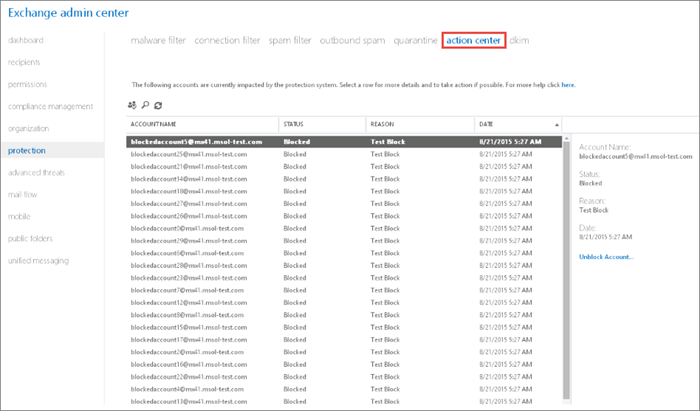

# Entfernen von Benutzern, Domänen oder IP-Adressen aus einer Sperrliste nach dem Senden von SpamnachrichtenRemoving a user, domain, or IP address from a block list after sending spam email

Wenn Benutzer ständig E-Mails von Office 365 senden, die als Spam klassifiziert werden, werden diese blockiert, sodass sie keine weiteren E-Mails senden können. If a user continuously sends email messages from Office 365 that is classified as spam, they will be blocked from sending any more messages. 
  

Wenn Absender blockiert sind und keine E-Mails senden können, erhalten sie einen Unzustellbarkeitsbericht (oder eine Meldung, dass beim Senden der Nachricht ein Fehler aufgetreten ist) mit Informationen, wie sie vorgehen müssen, um die Blockierung aufzuheben.When a sender is blocked from sending emails messages, they receive a Non-Delivery Report (NDR or email failed to send message) that provides specific information about the steps that they have to take to unblock themselves.
  
Nicht nur können einzelne Benutzern durch die Domänen Service, sondern auf bestimmte Websites blockiert und IP-Adressen können auch blockiert werden. In einigen Fällen können Domänen oder Websites einer Sperrliste hinzugefügt werden einfach, da sie in einer Spam-Nachricht angezeigt werden. Als der Office 365-Administrator können Sie versuchen, erhalten Benutzer, Websites, Domänen und IP-Adressen von Drittanbieter-Sperrlisten entfernt. Verwenden Sie die Links in der Tabelle unten in diesem Thema, um jede Drittanbieter zu kontaktieren, und folgen Sie den Anweisungen. Wenn eine Person außerhalb von Office 365 mit Ihrem Office 365-Konto Nachrichten senden kann, ihr Konto möglicherweise auf die Liste der blockierten Absender externe beendet wurden einrichten. Benutzer außerhalb von Office 365 können sich selbst aus der Liste blockierter Absender So entfernen Sie mithilfe der [Self-service-delisting Portal](https://technet.microsoft.com/library/mt661881%28v=exchg.150%29.aspx)versuchen.Not only can individual users be blocked by the service, but specific websites, domains, and IP addresses can also be blocked. In some cases, domains or websites can be added to a block list just because they appear in a spam message. As the Office 365 admin, you can try to get users, websites, domains, and IP addresses removed from third-party block lists. Use the links in the table at the bottom of this topic to contact each third party, and then follow the instructions. If someone outside Office 365 cannot send messages to your Office 365 account, their account may have ended up on the external blocked senders list. Users outside Office 365 can try to remove themselves from the blocked senders list by using the [self-service delisting portal](https://technet.microsoft.com/library/mt661881%28v=exchg.150%29.aspx).
  
Sie können ausgehende Spameinstellungen konfigurieren, damit Sie eine Benachrichtigung erhalten, wenn ein Office 365-Benutzer blockiert ist und keine E-Mail senden kann, die als Spam klassifiziert wurden. Wenn das Problem mit dem Benutzerpostfach behoben ist, können Sie die Blockierung für diesen Absender aufheben.You can configure outbound spam settings so that you get anotification when an Office 365 user is blocked from sending email that's classified as spam. After the problem with the user's mailbox is resolved, you can remove the block on that sender.
  
## Aufheben der Blockierung eines gesperrten Office 365-E-Mail-KontosUnblock a blocked Office 365 email account

Sie führen Sie diese Aufgabe in der Exchange-Verwaltungskonsole (EAC). Checken Sie [Exchange-Verwaltungskonsole in Exchange Online Protection](exchange-admin-center-in-exchange-online-protection-eop.md) ausführliche Informationen zu der Exchange-Verwaltungskonsole.You complete this task in the Exchange admin center (EAC). Check out [Exchange admin center in Exchange Online Protection](exchange-admin-center-in-exchange-online-protection-eop.md) for details about the EAC. 
  
> [!NOTE]
> Das Wartungscenter wird nur angezeigt, wenn Sie sich im EAC für Exchange Online befinden.You won't see the action center unless you're in the EAC for Exchange Online. 
  
1. Navigieren Sie in der Exchange-Verwaltungskonsole zu **Schutz** \> **Aktion Center**.In the EAC, navigate to **protection** \> **action center**.
    
    
  
2. Wählen Sie das Symbol **Suche** aus, und geben Sie die SMTP-Adresse des blockierten Benutzers ein.Select the **Search** icon, and then enter the SMTP address of the blocked user. 
    
    
  
3. Klicken Sie im Bereich „Beschreibung“ auf **Sperrung des Kontos aufheben**.Click **Unblock Account** in the description pane. 
    
    
  
4. Klicken Sie zur Bestätigung der Änderung auf **Ja**.Click **Yes** to confirm the change. 
    
> [!NOTE]
> Es gibt eine Einschränkung dabei, wie oft ein Mandantenadministrator die Blockierung für ein Konto aufheben darf. Wenn der Grenzwert für einen Benutzer überschritten wurde, wird eine Fehlermeldung angezeigt. Wenden Sie sich an den Support, um den Benutzer zu entsperren.There's a limit to the number of times that an account can be unblocked by the tenant admin. If the limit for a user has been exceeded, an error message appears. Contact Support to unblock the user. 
  
## Drittanbieter-BlockierungslistenThird-party block lists

|**Name der Liste****List Name**|**Abwahlportal****Delisting Portal**|**Weitere Informationen****For more information**|
|:-----|:-----|:-----|
|URIBLURIBL    |[https://admin.uribl.com/?section=lookup](https://admin.uribl.com/?section=lookup)   |[URIBL-website URIBL website ](https://uribl.com/)   |
|SURBLSURBL    |[http://www.surbl.org/surbl-analysis](http://www.surbl.org/surbl-analysis)   |[Einführung in SURBL URI Reputation DatenIntroducing SURBL URI reputation data](http://www.surbl.org/)   |
|Spamhaus Spamhaus    |[https://www.spamhaus.org/lookup/](https://www.spamhaus.org/lookup/)   |[Grundlegendes zu DNSBL filternUnderstanding DNSBL Filtering](https://www.spamhaus.org/whitepapers/dnsbl_function/)   |
|Invaluementinvaluement    |[http://dnsbl.invaluement.com/lookup/](http://dnsbl.invaluement.com/lookup/)   |[Anti Anti-Spam-Listeinvaluement anti-spam list](http://dnsbl.invaluement.com/)   |
|PhishtankPhishtank    |[https://www.phishtank.com/](https://www.phishtank.com/)   |[PhishTank – häufig gestellte FragenPhishTank FAQ](https://www.phishtank.com/faq.php)   |
   
> [!NOTE]
> Exchange Online Protection verwendet auch Drittanbieter-Sperrlisten für Spam-Filterung.Exchange Online Protection also uses third-party block lists for spam filtering. 
   
## Weitere InformationenFor more information

[Konfigurieren der Richtlinie für ausgehende SpamnachrichtenConfigure the outbound spam policy](configure-the-outbound-spam-policy.md)
  
[Pool für besonders riskante Zustellungen für ausgehende NachrichtenHigh-risk delivery pool for outbound messages](high-risk-delivery-pool-for-outbound-messages.md)

[Verwenden des Listenentfernungsportals, um sich selbst aus der Liste der blockierten Absender von Office 365 zu entfernenUse the delist portal to remove yourself from the Office 365 blocked senders list](use-the-delist-portal-to-remove-yourself-from-the-office-365-blocked-senders-lis.md)
  

  

