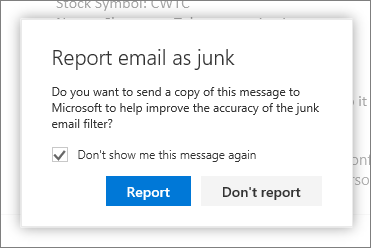

# Melden von Junk-e-Mails und Phishing Betrug in Outlook im WebReport junk email and phishing scams in Outlook on the web 

Für die Benutzer in Ihrer Organisation kann es frustrierend sein, wenn sie in ihrem Posteingang eine Junk-E-Mail empfangen oder aber eine wichtige E-Mail verpassen, weil diese fälschlicherweise als Spam identifiziert wurde. Wir versuchen stets, unsere Exchange Online Protection (EOP)-Spamfilter zu optimieren, um genauere Ergebnisse zu erzielen, und Sie und Ihre Endbenutzer können uns dabei unterstützen. Benutzer von Microsoft Outlook im Web können Junknachrichten (Spam) und betrügerische Phishingversuche mithilfe der integrierten Junk-E-Mail-Meldeoptionen zur Analyse an Microsoft übermitteln. Falls Sie eine Nachricht fälschlicherweise als Junk (Spam) eingestuft wurde, können Sie diese Nachricht auch an Microsoft übermitteln.It can be frustrating when users in your organization receive junk email or miss an important email because it was misidentified as spam. We're constantly fine-tuning the Exchange Online Protection (EOP) spam filters to be more accurate, and you and your end users can help with this process; Microsoft Outlook on the web users can report junk (spam) and phishing scams by using built-in email reporting options. You can also let Microsoft know if an email was incorrectly identified as junk (spam).
  
## Übermitteln von Junknachrichten in Outlook im WebSubmit junk messages in Outlook on the web

So übermitteln Sie eine Junk-E-Mail an MicrosoftTo submit a junk mail message to Microsoft:
  
1. Klicken Sie auf die Junk-e-Nachricht, und klicken Sie dann auf der Symbolleiste auf **Junk-e** . Dadurch wird die Nachricht in den Junk-e-Mail-Ordner verschoben und den Absender Ihrer Liste der blockierten Absender hinzugefügt.  Click on the junk message and then click **Junk** on the toolbar. This moves the message to your Junk email folder and adds the sender to your blocked sender list.  
  
    > [!NOTE]
    > Klicken Sie alternativ zum Anzeigen eines Menüs mit der rechten Maustaste auf eine Nachricht, und klicken Sie dann auf **Als Junk-E-Mail markieren**.Alternatively, right-click a message to display a menu, and click **Mark as junk**. 
  
Sie können eine Junk-E-Mail aus dem Ordner **Posteingang**, **Clutter** oder **Gelöschte Elemente** melden.You can report a junk message from your **Inbox**, **Clutter**, or **Deleted Items** folder. 
  
2. Ein Dialogfeld wird geöffnet, gefragt, ob Sie eine Kopie der junk-e-Mail-Nachricht an Microsoft zur Analyse senden möchten. Klicken Sie auf **Bericht** , um die Nachricht an den Microsoft-Spamanalyseteam senden. Wählen Sie optional das Kontrollkästchen **Diese Meldung nicht anzeigen** , wenn automatisch zukünftige Junk-e-Mails an Microsoft gesendet, ohne Aufforderung werden soll.  A dialog box opens asking if you want to send a copy of the junk email message to Microsoft for analysis. Click **report** to send the message to the Microsoft Spam Analysis Team. Optionally, select the **Don't show me this message again** check box if you want to automatically submit future junk messages to Microsoft without being prompted.  
  
    > [!TIP]
    > Auch wenn Sie das Kontrollkästchen **Diese Meldung nicht mehr anzeigen** aktivieren, haben Sie später die Möglichkeit, Ihre Einstellungen für das Melden von Junk-E-Mails zu ändern, indem Sie in Outlook im Web auf die Anzeigeeinstellungen zugreifen. (Sie können auch über das Menü mit dem Zahnradsymbol neben Ihrem Anmeldenamen auf diese Einstellungen zugreifen.)Even if you select the **Don't show me this message again** check box, you can later change your preferences for reporting junk email by accessing the display settings in Outlook on the web. (You can access these settings through the gear menu next to your sign in name.) 
  
## Übermitteln von Nachrichten, die als betrügerischer Phishingversuch gelten, in Outlook im WebSubmit phishing scam messages in Outlook on the web

So übermitteln Sie eine Nachricht, die als betrügerischer Phishingversuch gilt, an MicrosoftTo submit a phishing scam message to Microsoft:
  
1. Klicken Sie auf die Phishing-Betrug Nachricht, klicken Sie auf den Pfeil nach unten neben **Junk-e-**, und klicken Sie dann auf der Symbolleiste auf **Phishing** . Office 365 blockiert nicht, da Absender Phishing Betrug Nachrichten legitimen Absender in der Regel Identitätswechsel für den Absender. Wenn Sie es vorziehen, können Sie den Absender zur Liste blockierter Absender hinzufügen, gemäß die Anweisungen im Thema [Blockieren oder zulassen (junk-e-Mail-Einstellungen)](https://go.microsoft.com/fwlink/?LinkId=627572). Click on the phishing scam message, click the down arrow next to **Junk**, and then click **Phishing** on the toolbar. Office 365 does not block the sender because senders of phishing scam messages typically impersonate legitimate senders. If you prefer, add the sender to your blocked senders list by following the instructions in the topic [Block or allow (junk email settings)](https://go.microsoft.com/fwlink/?LinkId=627572).  Alternativ können Sie zum Anzeigen eines Menüs mit der rechten Maustaste auf eine Nachricht und dann auf **Als betrügerischen Phishing-Versuch markieren** klicken.Alternatively, right-click a message to display a menu, and click **Mark as Phishing**. Sie können eine Nachricht, die als betrügerischer Phishingversuch gilt, aus den Ordnern **Posteingang**, **Clutter** oder **Gelöschte Elemente** melden.You can report a phishing scam message from your **Inbox**, **Clutter**, or **Deleted Items** folder. 
  
2. Bei einigen Organisationen wird ein Dialogfeld geöffnet, in dem Sie gefragt werden, ob Sie eine Kopie der als betrügerischer Phishingversuch einzustufenden Nachricht zur Analyse an Microsoft senden möchten. Klicken Sie auf **Melden**, um die Nachricht an das Microsoft-Spamanalyseteam zu senden. Diese Meldungsoption steht derzeit für eine begrenzte Anzahl von Organisationen zur Verfügung. Möglicherweise werden Sie nicht aufgefordert, einen betrügerischen Phishingversuch Microsoft zu melden.For some organizations, a dialog box opens asking if you want to send a copy of the phishing scam email to Microsoft for analysis. Click **report** to send the message to the Microsoft Spam Analysis Team. This reporting option is currently available to a limited number of organizations; you might not be asked to report a phishing scam to Microsoft. 
    
## Übermitteln von Nicht-Junknachrichten in Outlook im WebSubmit "not junk" messages in Outlook on the web

Wenn eine Nachricht von Office 365 fälschlicherweise als Junk eingestuft wird, können Sie wie folgt eine Nachricht als „Keine Junk-E-Mail" an Microsoft übermitteln:When a message is incorrectly identified as junk by Office 365, submit a message as "not junk" to Microsoft:
  
1. Klicken Sie in Ihrem Junk-E-Mail-Ordner auf die Nachricht, und klicken Sie dann auf der Symbolleiste auf **Keine Junk-E-Mail**. Dadurch wird die Nachricht in den **Posteingang** verschoben, und der Absender wird zur Liste sicherer Absender hinzugefügt.In your Junk email folder, click on the message and then click **Not Junk** on the toolbar. This moves the message to your **Inbox** and adds the sender to your safe senders list.  Sie können auch mit der rechten Maustaste auf eine Nachricht im Ordner Junk-e-Mail an ein Menü anzuzeigen, und klicken Sie auf **Markieren als keine Junk-e**.You can also right-click on a message in your Junk mail folder to display a menu and click **Mark as not junk**. 
  
2. Es wird ein Dialogfeld geöffnet, in dem Sie gefragt werden, ob Sie eine Kopie der als Nicht-Junk-E-Mail einzustufenden Nachricht zur Analyse an Microsoft senden möchten. Klicken Sie auf **Melden**, um die Nachricht an das Microsoft-Spamanalyseteam zu senden.A dialog box opens asking if you want to send a copy of the not junk email message to Microsoft for analysis. Click **report** to send the message to the Microsoft Spam Analysis Team.. 
    
## Weitere InformationenFor more information

[Weitere Informationen zu Junk-E-Mails und PhishingLearn about junk email and phishing](https://go.microsoft.com/fwlink/p/?LinkId=270068)
  
  

