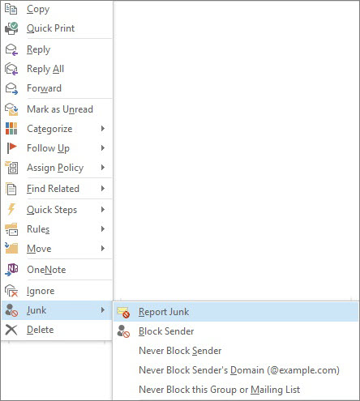

# Melden von Junk-E-Mails an Microsoft

Das Microsoft-Add-In "Junk-E-Mail-Berichtsprogramm für Microsoft Office Outlook" bietet mehrere Möglichkeiten zum Melden von Junk-E-Mails:
  
- Über das Outlook-Menüband
    
- Über den Posteingang
    
- Aus einer geöffneten E-Mail
    
Mit dem Add-In Junk-E-Mail-Berichtsprogramm können Sie Berichte an den Microsoft gesendet Exchange Online Protection (EOP)-Dienst senden. Wenn Ihr Postfach nicht vom Dienst geschützt ist, haben Ihre Übermittlungen von Junk-E-Mail-Berichten keine Auswirkungen auf Ihren Spamfilter. Administratoren erhalten weitere Informationen zu Spameinstellungen, die für eine gesamte Organisation am gelten, unter [Wie kann sichergestellt werden, dass eine Nachricht nicht Spam gekennzeichnet wird](https://go.microsoft.com/fwlink/p/?LinkId=534224) oder [Blockieren von E-Mail-Spam mit dem Office 365-Spamfilter zur Vermeidung falsch negativer Ergebnisse](https://go.microsoft.com/fwlink/p/?LinkId=534225). Diese sind hilfreich, wenn Sie Administratorebenen-Kontrolle haben und falsch positive oder falsch negative Ergebnisse vermeiden möchten.
  
> [!TIP]
> Sie können auch Spam-Nachrichten direkt an Microsoft mithilfe der [junk@office365.microsoft.com](mailto:junk@office365.microsoft.com) e-Mail-Adresse und falsch positive (nicht-Spam) Nachrichten mithilfe der [not_junk@office365.microsoft.com](mailto: not_junk@office365.microsoft.com) e-Mail-Adresse senden. Weitere Informationen finden Sie unter [Submit Spam, nicht-Spam und Phishing-Betrug Nachrichten an Microsoft zur Analyse](submit-spam-non-spam-and-phishing-scam-messages-to-microsoft-for-analysis.md). 
  
### Melden von junk-e-Mail-Nachrichten aus Outlook

[Verwenden des Berichtnachricht-add-Ins](https://support.office.com/article/b5caa9f1-cdf3-4443-af8c-ff724ea719d2) 
  
### So melden Sie Junk-E-Mails über den Posteingang

1. Klicken Sie mit der rechten Maustaste auf die Nachricht(en), die Sie als Junk melden möchten.
    
2. Wählen Sie **Junk** , und klicken Sie dann auf **Junk-e-Bericht**.  
  
3. Das Dialogfeld **Microsoft Junk-e-Mail-Reporting-Add-in** wird geöffnet. Wenn Sie sicher sind, dass Sie als Junk ausgewählten Nachrichten senden möchten, klicken Sie auf **Ja**.  
  
    > [!NOTE]
    > Wenn Sie die Bestätigungsmeldung, die daraufhin angezeigt wird, in Zukunft nicht mehr erhalten möchten, aktivieren Sie **Diese Meldung nicht mehr anzeigen**. 
  
Die ausgewählten Nachrichten werden zur Analyse an Microsoft gesendet und in den Ordner "Junk-E-Mail" verschoben. Wenn Sie überprüfen möchten, ob die Nachrichten gesendet wurden, öffnen Sie den Ordner **Gesendete Objekte**, in dem die gesendeten Nachrichten angezeigt werden sollten. 
  
### So melden Sie eine Junk-E-Mail aus einer geöffneten Nachricht

1. Klicken Sie aus einer geöffneten Nachricht, auf den **Bericht Junk-e-** Menüband auf die Schaltfläche Nachricht. Angenommen, klicken Sie auf **Junk-e-** \> **Bericht Junk-e-** 
  
2. Das Dialogfeld **Microsoft Junk-e-Mail-Reporting-Add-in** wird geöffnet. Wenn Sie sicher sind, dass Sie als Junk ausgewählte Nachricht senden möchten, klicken Sie auf **Ja**.  
  
    > [!NOTE]
    > Wenn Sie die Bestätigungsmeldung, die daraufhin angezeigt wird, in Zukunft nicht mehr erhalten möchten, aktivieren Sie **Diese Meldung nicht mehr anzeigen**. 
  
Die ausgewählte Nachricht wird zur Analyse an Microsoft gesendet und in den Ordner "Junk-E-Mail" verschoben. Wenn Sie überprüfen möchten, ob die Nachricht gesendet wurde, öffnen Sie den Ordner **Gesendete Objekte**, in dem die gesendete Nachricht angezeigt werden sollte. 
  
## Weitere Informationen

[Aktivieren des Berichtnachricht-add-Ins](https://support.office.com/article/4250c4bc-6102-420b-9e0a-a95064837676)
  
[Problembehandlung und Supportinformationen](troubleshooting-and-support-information.md)
  
[So können Sie dazu beitragen, dass eine Nachricht nicht als Spam gekennzeichnet wird](https://go.microsoft.com/fwlink/p/?LinkId=534224)
  
[Blockieren von E-Mail-Spam mit dem Office 365-Spamfilter zur Vermeidung von falsch negativen Einträgen](https://go.microsoft.com/fwlink/p/?LinkId=534225)
  

