# Übersicht über Aufbewahrungsrichtlinien

In den meisten Organisationen nimmt die Menge und Komplexität der Daten täglich zu – E-Mails, Dokumente, Chatnachrichten usw. Eine effektive Verwaltung bzw. Governance dieser Informationen ist wichtig, da Sie:
  
- **branchenspezifische Vorschriften und interne Richtlinien einhalten müssen**, nach denen Inhalte für eine bestimmte Mindestdauer aufzubewahren sind – z. B. müssen Sie gemäß dem Sarbanes-Oxley Act möglicherweise bestimmte Arten von Inhalten über sieben Jahre lang aufbewahren. 
    
- **das Risiko bei Rechtsstreitigkeiten oder einer Sicherheitsverletzung reduzieren müssen**, indem Sie alte Inhalte, die Sie nicht mehr aufbewahren müssen, endgültig löschen. 
    
- **Ihrer Organisation dabei helfen müssen, effektiven Wissensaustausch zu betreiben und agiler zu werden**, indem Sie sicherstellen, dass die Benutzer nur mit Inhalten arbeiten, die aktuell und für sie relevant sind. 
    
Eine Aufbewahrungsrichtlinie in Office 365 kann Ihnen dabei helfen, alle diese Ziele zu erreichen. Das Verwalten von Inhalten macht häufig zwei Aktionen erforderlich:
  
- **Aufbewahrung** von Inhalten, sodass sie nicht vor dem Ende des Aufbewahrungszeitraums dauerhaft gelöscht werden 
    
- **Endgültiges Löschen** von Inhalten am Ende des Aufbewahrungszeitraums. 
    
Mit einer Aufbewahrungsrichtlinie können Sie:
  
- proaktiv entscheiden, ob Inhalte aufbewahrt, gelöscht oder beides, also aufbewahrt und dann gelöscht werden sollen.
    
- eine einzelne Richtlinie auf die gesamte Organisation oder nur auf bestimmte Speicherorte oder Benutzer anwenden.
    
- eine Richtlinie auf alle Inhalte oder nur auf bestimmte Kriterien erfüllende Inhalte anwenden, z. B. auf Inhalte, die bestimmte Schlüsselwörter oder [bestimmte Arten von vertraulichen Informationen](what-the-sensitive-information-types-look-for.md) enthalten.
    
Wenn Inhalte einer permanenten Richtlinie unterliegen, können Benutzer den Inhalt weiterhin bearbeiten und verwenden, als hatte sich nichts geändert, da der Inhalt an seinem ursprünglichen Speicherort beibehalten wird. Falls Inhalte, die der Richtlinie unterliegen, jedoch bearbeitet oder gelöscht werden, wird eine Kopie an einem sicheren Standort gespeichert, an dem sie beibehalten wird, solange die Richtlinie gilt.
  
Schließlich müssen einige Organisationen ggf. Vorschriften einhalten, wie zum Beispiel die Rule 17a-4 der Securities and Exchange Commission (SEC), nach der eine Aufbewahrungsrichtlinie nach dem Aktivieren nicht deaktiviert oder weniger restriktiv eingestellt werden darf. Um diese Anforderung zu erfüllen, können Sie die Erhaltungssperre verwenden. Nachdem eine Richtlinie gesperrt wurde, kann niemand – auch nicht der Administrator – die Richtlinie deaktivieren oder weniger restriktiv einstellen.
  
Sie erstellen und verwalten Aufbewahrungsrichtlinien auf der Seite **Aufbewahrung** im Office 365 Security &amp; Compliance Center. 
  
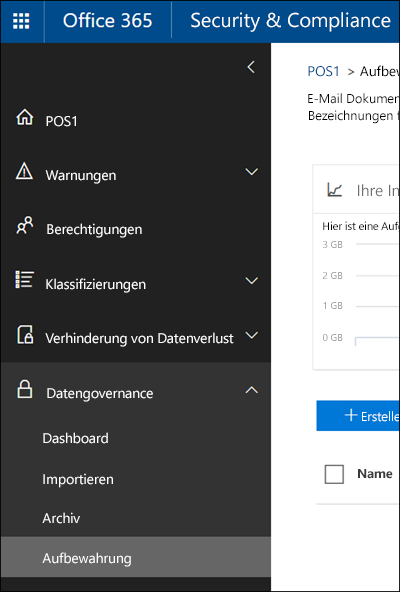
  
  
## Funktionsweise einer Aufbewahrungsrichtlinie mit Inhalten

Wenn Sie einen Speicherort, z. B. eine Website oder ein Postfach in eine Aufbewahrungsrichtlinie einschließen, verbleibt der Inhalt an seinem ursprünglichen Speicherort. Benutzer können weiter mit ihren Dokumenten oder E-Mails arbeiten, als ob sich nichts geändert hätte. Wenn sie jedoch Inhalte bearbeiten oder löschen, die von der Richtlinie abgedeckt sind, wird eine Kopie des Inhalts in seinem Zustand zum Zeitpunkt der Anwendung der Richtlinie beibehalten.
  
Für SharePoint-Websitesammlungen wird eine Kopie des ursprünglichen Inhalts im permanenten Dokumentarchiv beibehalten, wenn Benutzer diesen bearbeiten oder löschen; bei E-Mails und öffentlichen Ordnern wird die Kopie im Ordner "Wiederherstellbare Elemente" aufbewahrt. Diese sicheren Speicherorte und die aufbewahrten Inhalte sind für die meisten Benutzer nicht sichtbar. Mit einer Aufbewahrungsrichtlinie müssen Benutzer nicht einmal wissen, dass ihre Inhalte der Richtlinie unterliegen.
  
Hinweise:
  
- Skype-Inhalte werden in Exchange gespeichert, wenn die Richtlinie basierend auf dem Nachrichtentyp (E-Mail oder Unterhaltung) angewendet wird.
    
- Eine auf eine Office 365-Gruppe angewendete Aufbewahrungsrichtlinie betrifft das Gruppenpostfach und die Website.
    
### Inhalte in OneDrive-Konten und SharePoint-Websites

Eine Aufbewahrungsrichtlinie wird auf Websitesammlungsebene angewendet. Wenn Sie eine SharePoint-Websitesammlung oder ein OneDrive-Konto in eine Aufbewahrungsrichtlinie aufnehmen, wird ein permanentes Dokumentarchiv erstellt, falls noch keines vorhanden ist. Sie können diese Bibliothek auf der Seite **Websiteinhalt** auf der Website auf oberster Ebene in der Websitesammlung anzeigen. Die meisten Benutzer können das permanente Dokumentarchiv nicht anzeigen, da es nur für Websitesammlungsadministratoren sichtbar ist.
  
Wenn ein Benutzer versucht, den Inhalt einer Website im Rahmen der Aufbewahrungsrichtlinie zu ändern oder zu löschen, überprüft die Aufbewahrungsrichtlinie zunächst, ob der Inhalt seit Anwendung der Richtlinie geändert wurde. Wenn dies die erste Änderung seit Anwendung der Richtlinie ist, kopiert die Aufbewahrungsrichtlinie den Inhalt in das permanente Dokumentarchiv und ermöglicht dem Benutzer dann das Ändern oder Löschen des ursprünglichen Inhalts. Beachten Sie, dass alle Inhalte der Websitesammlung auch dann in das permanente Dokumentarchiv kopiert werden können, wenn der Inhalt der Abfrage, die von der Aufbewahrungsrichtlinie verwendet wird, nicht entspricht.
  
In diesem Fall bereinigt ein Zeitgeberauftrag das permanente Dokumentarchiv. Der Zeitgeberauftrag wird regelmäßig ausgeführt und vergleicht den gesamten Inhalt des permanenten Dokumentarchivs mit den Abfragen, die von den Aufbewahrungsrichtlinien der Website verwendet werden. Falls der Inhalt nicht mindestens einer der Abfragen entspricht, löscht der Zeitgeberauftrag den Inhalt dauerhaft aus dem permanenten Dokumentarchiv.
  
Das gilt auch für Inhalte, die bei Anwendung der Aufbewahrungsrichtlinien vorhanden sind. Außerdem werden alle neuen Inhalte, die erstellt oder der Websitesammlung hinzugefügt werden, nachdem sie in die Richtlinie eingeschlossen wurden, auch nach dem Löschen beibehalten. Neue Inhalte werden allerdings nicht bei der ersten Bearbeitung in das permanente Dokumentarchiv kopiert, sondern nur, wenn sie gelöscht werden. Um alle Versionen einer Dateien beizubehalten, müssen Sie die Versionsverwaltung aktivieren – siehe dazu den nachstehenden Abschnitt zur Versionsverwaltung.
  
Beachten Sie, dass einem Benutzer eine Fehlermeldung angezeigt wird, wenn er versucht, eine Bibliothek, eine Liste, einen Ordner oder eine Website zu löschen, die/der einer Aufbewahrungsrichtlinie unterliegt. Ein Benutzer kann einen Ordner löschen, wenn er zunächst alle Dateien im Ordner, die der Richtlinie unterliegen, verschiebt oder löscht. Beachten Sie auch, dass das Dokumentarchiv nur erstellt wird, wen das erste Element in die Bibliothek kopiert werden muss und nicht, wenn Sie die Aufbewahrungsrichtlinie erstellen. Zum Testen der Richtlinie müssen Sie daher ein Dokument in einer Website, die der Richtlinie unterliegt, bearbeiten oder löschen und dann zum Dokumentarchiv navigieren, um die aufbewahrte Kopie anzuzeigen.
  
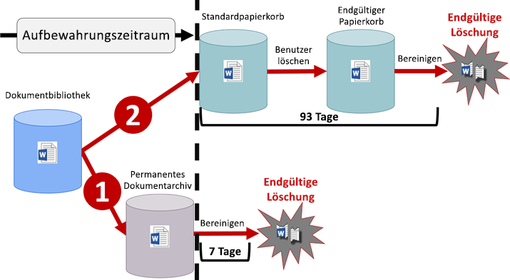
  
Nachdem einem OneDrive-Konto oder einer SharePoint-Website eine Aufbewahrungsrichtlinie zugewiesen wurde, können Inhalte einem von zwei Pfaden folgen:
  
1. **Wenn Inhalte während des Aufbewahrungszeitraums geändert oder gelöscht werden**, wird im permanenten Dokumentarchiv eine Kopie des ursprünglichen Inhalts in seinem Zustand bei Zuweisung der Aufbewahrungsrichtlinie erstellt. Dort wird ein Zeitgeberauftrag in regelmäßigen Abständen ausgeführt, und dieser identifiziert Elemente, deren Aufbewahrungszeitraum abgelaufen ist. Diese Elemente werden dann innerhalb von sieben Tagen nach Ende des Aufbewahrungszeitraums dauerhaft gelöscht. 
    
2. **Wenn der Inhalt während des Aufbewahrungszeitraums nicht geändert oder gelöscht wird**, wird er am Ende des Aufbewahrungszeitraums in den Standardpapierkorb verschoben. Wenn ein Benutzer den Inhalt dort löscht oder diesen Papierkorb (auch als Aufräumen bekannt) leert, wird das Dokument in den endgültigen Papierkorb verschoben. Ein Aufbewahrungszeitraum von 93 Tagen erstreckt sich über den Standardpapierkorb und den endgültigen Papierkorb. Am Ende der 93 Tage wird das Dokument dauerhaft aus dem Standardpapierkorb oder dem endgültigen Papierkorb gelöscht, je nachdem, wo er sich zu diesem Zeitpunkt befindet. Beachten Sie, dass der Papierkorb nicht indiziert ist und daher bei einer Suche dort keine Inhalte gefunden werden. Das bedeutet, dass ein eDiscovery-Archiv keine Inhalte im Papierkorb finden kann, um diese zu archivieren. 
    
### Inhalte in Postfächern und öffentlichen Ordnern

Für die E-Mails, den Kalender und andere Elemente eines Benutzers wird eine Aufbewahrungsrichtlinie auf Postfachebene angewendet. Für einen öffentlichen Ordner wird eine Aufbewahrungsrichtlinie auf Ordnerebene angewendet, nicht auf Postfachebene. Ein Postfach und ein öffentlicher Ordner verwenden beide den Order „Wiederherstellbare Elemente“, um Elemente beizubehalten. Nur Personen, denen eDiscovery-Berechtigungen zugewiesen wurden, können den Ordner „Wiederherstellbare Elemente“ eines anderen Benutzers anzeigen.
  
Standardmäßig wird eine Nachricht, die von einem Benutzer aus einem anderen Ordner als dem Ordner "Gelöschte Elemente" gelöscht wird, in den Ordner "Gelöschte Elemente" verschoben. Wenn ein Benutzer ein Element aus dem Ordner "Gelöschte Elemente" löscht, wird die Nachricht in den Ordner "Wiederherstellbare Elemente" verschoben. Außerdem kann ein Benutzer ein Element in einem Ordner mit UMSCHALT+ENTF löschen. Auf diese Weise wird der Ordner "Gelöschte Elemente" umgangen und das Element direkt in den Ordner "Wiederherstellbare Elemente" verschoben.
  
Ein Prozess bewertet die Elemente im Ordner "Wiederherstellbare Elemente" in regelmäßigen Abständen. Wenn ein Element den Regeln mindestens einer Aufbewahrungsrichtlinie nicht entspricht, wird das Element endgültig aus dem Ordner "Wiederherstellbare Elemente" gelöscht (wird auch als endgültiges Löschen bezeichnet).
  
Wenn ein Benutzer versucht, bestimmte Eigenschaften eines Postfachelements zu ändern – zum Beispiel Betreff, Text, Anhänge, Sender und Empfänger oder Sende- bzw. Empfangsdatum einer Nachricht – wird eine Kopie des ursprünglichen Elements im Ordner "Wiederherstellbare Elemente" gespeichert, bevor die Änderung übernommen wird. Dies geschieht für alle nachfolgenden Änderungen. Am Ende des Aufbewahrungszeitraums werden die Kopien im Ordner "Wiederherstellbare Elemente" dauerhaft gelöscht.
  
Wenn ein Benutzer das Unternehmen verlässt und sein Postfach von einer Aufbewahrungsrichtlinie abgedeckt ist, wird das Postfach ein inaktives Postfach, sobald das Office 365-Konto des Benutzers gelöscht wird. Die Inhalte eines inaktiven Postfachs unterliegen weiterhin der Aufbewahrungsrichtlinie, die dem Postfach zugewiesen wurde, bevor es inaktiv wurde, und die Inhalte sind über eine eDiscovery-Suche verfügbar. Weitere Informationen finden Sie unter [Inaktive Postfächer in Exchange Online](https://go.microsoft.com/fwlink/?linkid=846909).
  
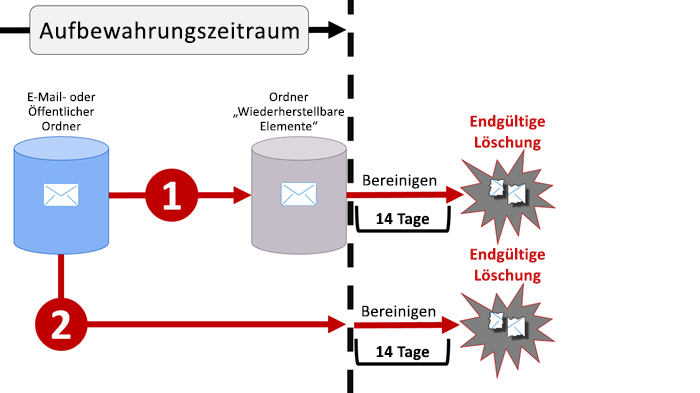
  
Nachdem einem Postfach odereinem öffentlichen Ordner eine Aufbewahrungsrichtlinie zugewiesen wurde, können Inhalte einem von zwei Pfaden folgen:
  
1. **Wenn das Element während des Aufbewahrungszeitraums vom Benutzer geändert oder dauerhaft gelöscht wird** (entweder per UMSCHALT + ENTF oder aus gelöschte Elemente gelöscht), wird das Element in den Ordner "Wiederherstellbare Elemente" verschoben (oder, im Fall der Bearbeitung, kopiert). Dort wird in regelmäßigen Abständen ein Vorgang ausgeführt, der Elemente identifiziert, deren Aufbewahrungszeitraum abgelaufen ist, und diese Elemente werden innerhalb von 14 Tagen nach Ende des Aufbewahrungszeitraums dauerhaft gelöscht. Beachten Sie, dass die Standardeinstellung 14 Tage beträgt, aber es können auch 30 Tage eingestellt werden. 
    
2. **Wenn das Element während des Aufbewahrungszeitraums nicht geändert oder gelöscht wird**, wird in allen Ordnern des Postfachs in regelmäßigen Abständen derselbe Vorgang ausgeführt, der Elemente identifiziert, deren Aufbewahrungszeitraum abgelaufen ist, und diese Elemente werden innerhalb von 14 Tagen nach Ende des Aufbewahrungszeitraums dauerhaft gelöscht. Beachten Sie, dass die Standardeinstellung 14 Tage beträgt, aber es können auch 30 Tage eingestellt werden. 
    
## Funktionsweise einer Aufbewahrungsrichtlinie mit Dokumentversion in einer Websitesammlung

Die Versionsverwaltung ist ein Feature für alle Dokumentbibliotheken in SharePoint Online und OneDrive for Business. Standardmäßig bewahrt die Versionsverwaltung mindestens 500 Hauptversionen auf, Sie können diesen Grenzwert jedoch erhöhen. Weitere Informationen finden Sie unter [Aktivieren und Konfigurieren der Versionsverwaltung für eine Liste oder Bibliothek](https://support.office.com/article/1555d642-23ee-446a-990a-bcab618c7a37).
  
Eine Aufbewahrungsrichtlinie bewahrt alle Versionen eines Dokuments in einer SharePoint-Websitesammlung oder einem OneDrive-Konto auf. Jedes Mal, wenn ein Dokument, das einer Aufbewahrungsrichtlinie unterliegt, bearbeitet oder gelöscht wird, wird eine Version in das permanente Dokumentarchiv kopiert. Jede Version eines Dokuments im permanenten Dokumentarchiv existiert als separates Element mit einem eigenen Aufbewahrungszeitraum:
  
- Wenn die Aufbewahrungsrichtlinie darauf basiert, wann der Inhalt erstellt wurde, verfügt jede Version über das gleiche Ablaufdatum wie das ursprüngliche Dokument. Das ursprüngliche Dokument und dessen Versionen laufen gleichzeitig ab.
    
- Wenn die Aufbewahrungsrichtlinie darauf basiert, wann der Inhalt zuletzt geändert wurde, verfügt jede Version über ein eigenes Ablaufdatum basierend auf dem Zeitpunkt der Änderung des ursprünglichen Dokuments, aus der diese Version hervorgegangen ist. Die Originaldokumente und deren Versionen laufen unabhängig voneinander ab.
    
## Aufbewahren von Inhalten für einen bestimmten Zeitraum

Mit einer Aufbewahrungsrichtlinie können Sie Inhalte auf unbestimmte Zeit oder für eine bestimmte Anzahl von Tagen, Monaten oder Jahren aufbewahren. Beachten Sie, dass die Dauer der Aufbewahrung anhand des Alters der Inhalte, und nicht basierend auf dem Zeitpunkt der Anwendung der Aufbewahrungsrichtlinie berechnet wird. Sie können auswählen, ob das Alter auf dem Zeitpunkt der Erstellung des Inhalts oder (bei OneDrive und SharePoint) auf dem Zeitpunkt der letzten Änderung basieren soll.
  
Wenn Sie Inhalte einer Websitesammlung beispielsweise nach ihrer letzten Änderung sieben Jahre lang aufbewahren möchten und ein Dokument in dieser Websitesammlung sechs Jahre lang nicht geändert wurde, wird das Dokument nur noch ein weiteres Jahr aufbewahrt, falls es nicht geändert wird. Falls das Dokument wieder geändert wird, wird das Alter des Dokuments anhand des neuen Datums der letzten Änderung berechnet und weitere sieben Jahre lang aufbewahrt.
  
Ebenso wird, wenn Sie Inhalte in einem Postfach für sieben Jahre aufbewahren möchten, und eine Nachricht wurde vor sechs Jahren gesendet, die Nachricht nur noch ein Jahr lang aufbewahrt. Bei Exchange-Inhalten basiert das Alter immer auf dem Empfangs- oder Sendedatum (diese sind identisch). Das Aufbewahren von Inhalten basierend auf ihrer letzten Änderung gilt nur für Websiteinhalte in OneDrive und SharePoint.
  
Sie können auswählen, ob der Inhalt am Ende des Aufbewahrungszeitraums dauerhaft gelöscht werden soll. Eine Aufbewahrungsrichtlinie kann auch einfach alte Inhalte löschen, ohne sie aufzubewahren – siehe dazu den nächsten Abschnitt.
  
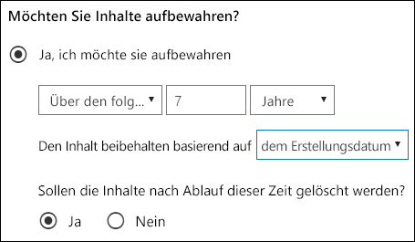
  
## Löschen von Inhalten, die ein bestimmtes Alter überschritten haben

Eine Aufbewahrungsrichtlinie kann Inhalte sowohl aufbewahren und dann löschen oder alte Inhalte einfach löschen, ohne sie aufzubewahren.
  
Wenn Ihre Aufbewahrungsrichtlinie Inhalte löscht, ist es wichtig, zu wissen, dass der für eine Aufbewahrungsrichtlinie festgelegte Zeitraum jedes Mal berechnet wird, wenn der betreffende Inhalt erstellt oder geändert wird.
  
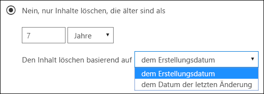
  
Nehmen wir zum Beispiel an, dass Sie eine Aufbewahrungsrichtlinie erstellen, nach der Inhalte nach drei Jahren gelöscht werden, und diese Aufbewahrungsrichtlinie dann allen OneDrive-Konten zuweisen, die viele Inhalte enthalten, die vor vier oder fünf Jahren erstellt wurden. In einem solchen Fall werden viele der Inhalte schon bald nach der ersten Zuweisung der Aufbewahrungsrichtlinie gelöscht. Daher kann **eine Aufbewahrungsrichtlinie, nach der Inhalte gelöscht werden, wesentliche Auswirkungen auf Ihre Inhalte haben**. 
  
Daher sollten Sie vor dem erstmaligen Zuweisen einer Richtlinie zu einer Websitesammlung zunächst das Alter des vorhandenen Inhalts und die möglichen Auswirkungen der Richtlinie auf diesen Inhalt bedenken. Sie können außerdem vor dem Zuweisen die Benutzer über die neue Richtlinie informieren, um ihnen Zeit zur Auswertung der möglichen Auswirkungen zu geben. Beachten Sie, dass folgende Warnung erscheint, wenn Sie die Einstellungen für Ihre Aufbewahrungsrichtlinie prüfen, bevor Sie sie erstellen.
  
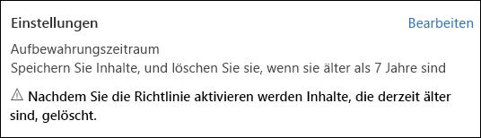
  
## Erweiterte Einstellungen, nach denen eine Richtlinie nur auf Inhalte angewendet wird, die bestimmte Bedingungen erfüllen.

Eine Aufbewahrungsrichtlinie kann für alle Inhalte an den von ihr abgedeckten Speicherorten gelten, oder Sie können auswählen, eine Aufbewahrungsrichtlinie nur auf Inhalte anzuwenden, die bestimmte Stichwörter oder [bestimmte Arten von vertraulichen Informationen](what-the-sensitive-information-types-look-for.md) enthalten.
  
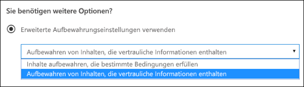
  
### Aufbewahren von Inhalten, die bestimmte Stichwörter enthalten

Sie können eine Aufbewahrungsrichtlinie ausschließlich auf Inhalte anwenden, die bestimmte Kriterien erfüllen, und dann Aufbewahrungsaktionen nur für diese Inhalte ausführen. Die verfügbaren Bedingungen unterstützen jetzt das Anwenden einer Aufbewahrungsrichtlinie auf Inhalte, die bestimmte Wörter oder Ausdrücke enthalten. Sie können Ihre Abfrage mithilfe von Suchoperatoren wie UND, ODER und NICHT verfeinern. Weitere Informationen zu diesen Operatoren finden Sie unter [Stichwortabfragen und Suchbedingungen für die Inhaltssuche](keyword-queries-and-search-conditions.md).
  
Unterstützung für das Hinzufügen durchsuchbarer Eigenschaften (z. B. **Betreff:**) wird in Kürze verfügbar sein.
  
Beachten Sie, dass die abfragebasierte Aufbewahrung den Suchindex verwendet, um Inhalte zu identifizieren.
  
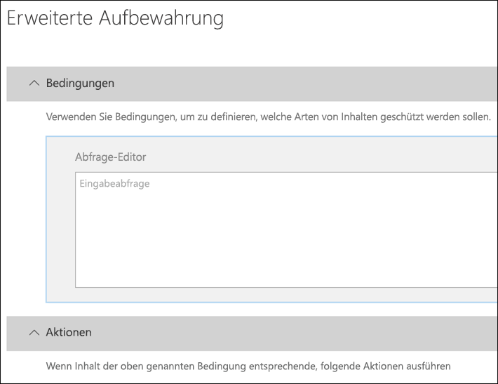
  
### Aufbewahren von Inhalten, die vertrauliche Informationen enthalten

Sie können eine Aufbewahrungsrichtlinie auch nur auf Inhalte anwenden, die [bestimmte Arten von vertraulichen Informationen](what-the-sensitive-information-types-look-for.md) enthalten. Sie können z. B. eindeutige Aufbewahrungsanforderungen nur auf Inhalte, die personenbezogene Informationen (PII) wie Steuernummern, Sozialversicherungsnummern oder Reisepassnummern enthalten, anwenden.
  
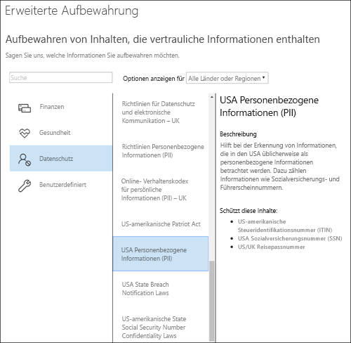
  
Hinweise:
  
- Die erweiterte Aufbewahrung für vertrauliche Informationen gilt nicht für öffentliche Exchange-Ordner oder Skype for Business, da diese Speicherorte keine vertraulichen Informationstypen unterstützen.
    
- Sie sollten wissen, dass Exchange Online Transportregeln verwendet, um vertrauliche Informationen zu identifizieren. Dies funktioniert also nur bei Nachrichten, die sich in der Übertragung befinden – nicht bei allen Elementen, die bereits in einem Postfach gespeichert sind. Für Exchange Online bedeutet dies, dass eine Aufbewahrungsrichtlinie vertrauliche Informationen identifizieren kann und Aufbewahrungsaktionen nur bei Nachrichten ergreift, die empfangen werden, **nachdem** die Richtlinie auf das Postfach angewendet wird. (Beachten Sie, dass die im vorherigen Abschnitt beschriebene abfragebasierte Aufbewahrung diese Einschränkung nicht aufweist, da dabei der Suchindex zum Identifizieren von Inhalten verwendet wird.) 
    
## Anwenden einer Aufbewahrungsrichtlinie auf eine gesamte Organisation oder bestimmte Speicherorte

Sie können eine Aufbewahrungsrichtlinie ganz einfach auf eine gesamte Organisation, ganze Speicherorte oder nur auf bestimmte Speicherorte oder Benutzer anwenden.
  
### Organisationsweite Richtlinie

Eines der leistungsstärksten Features einer Aufbewahrungsrichtlinie ist, dass sie standardmäßig für Speicherorte in ganz Office 365 gilt, einschließlich:
  
- Exchange-E-Mail
    
- SharePoint-Websitesammlungen
    
- OneDrive-Konten
    
- Office 365-Gruppen (gilt für Inhalte im Postfach, in der Website und den Dokumenten der Gruppe. Unterstützung für Inhalte in Planner, Yammer und CRM wird in Kürze verfügbar sein.)
    
- Öffentliche Exchange-Ordner
    
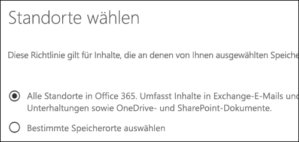
  
Weitere wichtige Features einer organisationsweiten Aufbewahrungsrichtlinie sind:
  
- Es gibt keine Beschränkung für die Anzahl der Postfächer oder Websites, die in der Richtlinie enthalten sein können.
    
- Bei Exchange erben alle neuen Postfächer, die nach der Anwendung der Richtlinie erstellt werden, die Richtlinie automatisch.
  
### Eine Richtlinie, die für ganze Speicherorte gilt

Beim Auswählen von Speicherorten können Sie einen ganzen Speicherort ganz einfach aufnehmen oder ausschließen, z. B. Exchange-E-Mail- oder OneDrive-Konten. Zu diesem Zweck schalten Sie einfach den **Status** des entsprechenden Speicherorts an oder aus. 
  
Wie auch bei organisationsweiten Richtlinien gilt, dass wenn eine Richtlinie für eine beliebige Kombination aus ganzen Speicherorten gilt, es keine Beschränkung für die Anzahl der Postfächer oder Websites gibt, die in der Richtlinie enthalten sein können. Wenn eine Richtlinie z. B. alle Exchange-E-Mail-Konten und alle SharePoint-Websites umfasst, werden alle Websites und Postfächer einbezogen, ganz gleich, wie viele es sind. Und bei Exchange erben alle neuen Postfächer, die erstellt werden, nachdem die Richtlinie angewendet wurde, die Richtlinie automatisch.
 
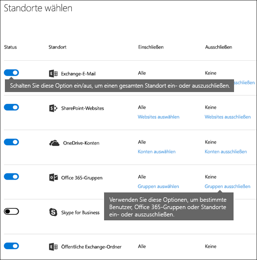
  
### Eine Richtlinie mit bestimmten eingeschlossenen oder ausgeschlossenen Elementen

Sie können eine Aufbewahrungsrichtlinie auch auf bestimmte Benutzer anwenden. Schalten Sie zu diesem Zweck den **Status** des entsprechenden Speicherorts an und verwenden Sie dann die Links, um bestimmte Benutzer, Office 365-Gruppen oder Speicherorte ein- oder auszuschließen. 
  
Beachten Sie jedoch, dass die folgenden Grenzwerte für Aufbewahrungsrichtlinien gelten, die mehr als 1.000 bestimmte Benutzer ein- oder ausschließt:
  
- Eine Aufbewahrungsrichtlinie kann nicht mehr als 1.000 Postfächer und 100 Websitesammlungen umfassen.
    
- Ein Mandant kann nicht mehr als 10.000 Aufbewahrungsrichtlinien umfassen.
    
Beachten Sie, dass Sie diese Grenzwerte überschreiten können, indem Sie entweder eine organisationsübergreifende Richtlinie oder eine Richtlinie, die für ganze Speicherorte gilt, anwenden.
  
### Skype-Speicherorte

Im Gegensatz zu Exchange-E-Mail können Sie den Status des Skype-Speicherorts nicht einfach umschalten, um alle Benutzer einzuschließen, Sie können diesen Speicherort jedoch aktivieren und dann manuell die Benutzer auswählen, deren Unterhaltungen Sie aufbewahren möchten.
  
Wenn Sie Benutzer von Skype for Business auswählen, können Sie schnell alle Benutzer einschließen, indem Sie das Feld **Name** in der Spaltenüberschrift auswählen – jedoch ist es wichtig zu wissen, dass jeder Benutzer als spezifische Aufnahme in die Richtlinie zählt. Wenn Sie mehr als 1.000 Benutzer einschließen, gelten daher die im vorherigen Abschnitt angegebenen Grenzwerte. Hier ist die Auswahl aller Skype-Benutzer nicht dasselbe wie wenn eine organisationsweite Richtlinie alle Skype-Benutzer standardmäßig einschließen könnte. 
  
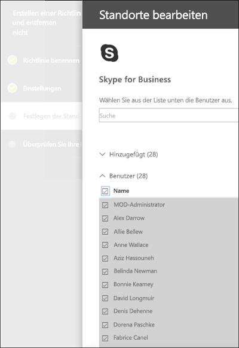
  
Beachten Sie, dass **Aufgezeichnete Unterhaltungen**, ein Ordner in Outlook, ein Feature ist, das nichts mit Skype-Archivierung zu tun hat. **Aufgezeichnete Unterhaltungen** kann vom Endbenutzer deaktiviert werden, Archivierung für Skype erfolgt jedoch durch das Speichern einer Kopie von Skype-Verbindungen in einem ausgeblendeten Ordner, auf den der Benutzer nicht zugreifen kann, der aber für eDiscovery verfügbar ist.

### Speicherorte von Office 365-Gruppen

Um Inhalte für eine Office 365-Gruppe zu speichern, müssen Sie den Speicherort der Office 365-Gruppen verwenden. Obwohl eine Office 365-Gruppe über ein Exchange-Postfach verfügt, schließt eine Aufbewahrungsrichtlinie, die den gesamten Exchange-Speicherort umfasst, keine Inhalte in Office 365-Gruppenpostfächern ein. Eine Aufbewahrungsrichtlinie, die auf eine Office 365-Gruppe angewendet wird, umfasst das Postfach und die Website der Gruppe.

Darüber hinaus ist es nicht möglich, den Exchange-Speicherort zu verwenden, um ein bestimmtes Gruppenpostfach ein- oder auszuschließen. Obwohl der Exchange-Speicherort zunächst die Auswahl eines Gruppenpostfachs zulässt, erhalten Sie beim Versuch, die Aufbewahrungsrichtlinie zu speichern, die Fehlermeldung, dass "RemoteGroupMailbox" keine gültige Auswahl für den Exchange-Speicherort ist. 
  
### Teams-Speicherorte

Sie können eine Aufbewahrungsrichtlinie nutzen, um Chats und Kanalnachrichten in Teams aufzubewahren. Teams-Chats sind in einem ausgeblendeten Ordner im Postfach jedes Benutzers im Chat enthalten, und Teams-Kanalnachrichten werden in einem ähnlichen ausgeblendeten Ordner im Gruppenpostfach des Teams gespeichert. Es ist jedoch wichtig zu wissen, dass Teams einen von Azure unterstützten Chat-Dienst nutzt, der diese Daten ebenfalls speichert, und dieser Dienst speichert die Daten standardmäßig auf unbestimmte Zeit. Aus diesem Grund wird dringend empfohlen, dass Sie den Teams-Speicherort nutzen, um Teams-Daten aufzubewahren und zu löschen. Durch die Nutzung des Teams-Speicherorts werden Daten aus den Exchange-Postfächern und dem zugrunde liegenden von Azure unterstützten Chat-Dienst endgültig gelöscht. Weitere Informationen finden Sie unter [Übersicht über Sicherheit und Compliance in Microsoft Teams](https://go.microsoft.com/fwlink/?linkid=871258).
  
Beachten Sie, dass Teams-Chats und Kanalnachrichten nicht von Aufbewahrungsrichtlinien betroffen sind, die auf Benutzer oder Gruppenpostfächer in den Exchange- oder Office-365-Gruppenspeicherorten angewendet werden. Auch wenn Teams-Chats und Kanalnachrichten in Exchange gespeichert werden, sind sie nur von Aufbewahrungsrichtlinien betroffen, die auf den Teams-Speicherort angewendet werden.
  
Wir arbeiten noch an der Aufbewahrung in Teams, und es werden in Zukunft weitere Features verfügbar sein. In der Zwischenzeit sollten Sie folgende Einschränkungen beachten:
  
- **Teams erfordert eine andere Aufbewahrungsrichtlinie** Beim Erstellen einer Aufbewahrungsrichtlinie und dem Aktivieren des Teams-Speicherorts, werden alle anderen Speicherorten deaktiviert. Eine Aufbewahrungsrichtlinie, die Teams einschließt, kann nur Teams und keine anderen Speicherorte umfassen. 
    
- **Teams ist nicht in einer organisationsweiten Richtlinie eingeschlossen** Wenn Sie eine organisationsweite Richtlinie erstellen, ist Teams nicht eingeschlossen, da es eine separate Aufbewahrungsrichtlinie erfordert. 
    
- **Teams unterstützt nicht die erweiterte Archivierung** Wenn Sie eine Aufbewahrungsrichtlinie erstellen und die [Erweiterten Einstellungen auswählen, nach denen eine Richtlinie nur auf Inhalte angewendet wird, die bestimmten Kriterien entsprechen](retention-policies.md#advanced), ist der Teams-Speicherort nicht verfügbar. Zu diesem Zeitpunkt betrifft die Aufbewahrung in Teams alle Chat- und Kanalnachrichteninhalte.
    
- **Teams-Inhalte müssen mindestens 30 Tage alt sein, um gelöscht werden zu können** Zu diesem Zeitpunkt wird das Erstellen einer Richtlinie, nach der Teams-Inhalte, die weniger als 30 Tage alt sind, gelöscht werden, nicht unterstützt. Wenn Sie diese Richtlinie auf Teams-Inhalte anwenden möchten, geben Sie einen Aufbewahrungszeitraum an, der gleich oder größer als 30 Tage ist. 
    
- **In Teams dauert das Bereinigen von aufbewahrten Inhalten bis zu 30 Tage** Eine auf Teams angewendete Aufbewahrungsrichtlinie löscht Inhalt aus allen relevanten Speicherorten. Nach der Einführung kann das Bereinigen von Inhalten anhand der Richtlinie bei Teams Clients jedoch bis zu 30 Tage dauern. Doch auch wenn Inhalte in den Teams Clients weiterhin angezeigt werden, werden diese Inhalte nach dem Ende des Aufbewahrungszeitraums nicht in der Inhaltssuche oder eDiscovery angezeigt. 
    
In einem Team werden Dateien, die im Chat freigegeben wurden, im OneDrive-Konto des Benutzers gespeichert, der die Datei freigegeben hat. Dateien, die in Kanäle hochgeladen wurden, werden in der SharePoint-Website für das Team gespeichert. Wenn Sie Daten in einem Team aufbewahren oder löschen möchten, müssen Sie daher eine Aufbewahrungsrichtlinie erstellen, die an den SharePoint- und OneDrive-Speicherorten gilt. Wenn Sie eine Richtlinie für die Dateien von nur einem bestimmten Team anwenden möchten, können Sie die SharePoint-Website für das Team und die OneDrive-Konten der Benutzer in dem Team auswählen.
  
Eine Aufbewahrungsrichtlinie, die für Teams gilt, kann die [Erhaltungssperre](retention-policies.md#locking) nutzen.
  
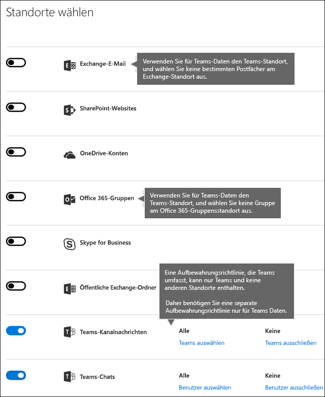
  
## Ausschließen von bestimmten Typen von Exchange-Elementen aus einer Aufbewahrungsrichtlinie
Indem Sie PowerShell verwenden, können Sie bestimmte Typen von Exchange-Elementen aus einer Aufbewahrungsrichtlinie ausschließen. Sie können z. B. Sprachnachrichten, Chatnachrichten und andere Skype for Business Online-Inhalte in Postfächern ausschließen. Sie können auch Kalender-, Notiz- und Aufgabenelemente ausschließen. Diese Funktion ist nur mit PowerShell verfügbar. Es ist nicht auf der Benutzeroberfläche verfügbar, wenn Sie eine Aufbewahrungsrichtlinie erstellen.
  
Zu diesem Zweck verwenden Sie den `ExcludedItemClasses` Parameter von der `New-RetentionComplianceRule` und `Set-RetentionComplianceRule` Cmdlets. Weitere Informationen zu PowerShell finden Sie weiter unten im Abschnitt [Die PowerShell-Cmdlets für Aufbewahrungsrichtlinien finden](#find-the-powershell-cmdlets-for-retention-policies).
  
## Sperren einer Aufbewahrungsrichtlinie
Einige Organisationen müssen Regeln einhalten, die von Behörden definiert werden, wie zum Beispiel die Rule 17a-4 der Securities And Exchange Commission (SEC), die erfordert, dass eine Aufbewahrungsrichtlinie nach dem Aktivieren nicht deaktiviert oder weniger restriktiv eingestellt werden kann. Mit der Aufbewahrungssperre können Sie die Richtlinie sperren, sodass niemand – auch nicht der Administrator – die Richtlinie deaktivieren oder weniger restriktiv einstellen kann.
  
Nach dem Sperren einer Richtlinie kann sie von niemandem deaktiviert werden. Außerdem können keine Speicherorte aus der Richtlinie entfernt werden. Darüber hinaus ist es nicht möglich, Inhalte zu ändern oder zu löschen, die während des Aufbewahrungszeitraums der Richtlinie unterliegen. Nach dem Sperren der Richtlinie können Sie die Richtlinie nur ändern, indem Sie Inhalte hinzufügen oder die Dauer verlängern. Eine gesperrte Richtlinie kann vergrößert oder verlängert werden kann, kann jedoch nicht verkleinert oder deaktiviert werden.
  
Aus diesem Grund müssen Sie sich vor der Sperrung einer Aufbewahrungsrichtlinie **unbedingt** einen genauen Überblick über die Compliance-Anforderungen Ihrer Organisation verschaffen. Sie **dürfen eine Richtlinie auf keinen Fall sperren**, bevor Sie sich absolut sicher sind, dass dies notwendig ist.

### Sperren einer Aufbewahrungsrichtlinie mit PowerShell
  
Sie können eine Aufbewahrungsrichtlinie nur mithilfe von PowerShell sperren.

Stellen Sie [zunächst eine Verbindung mit Office 365 Security & Compliance Center PowerShell her](http://go.microsoft.com/fwlink/p/?LinkID=799771).

Führen Sie dann zum Anzeigen einer Liste von Aufbewahrungsrichtlinien und Suchen nach dem Namen der Richtlinie, die Sie sperren möchten, den Befehl `Get-RetentionCompliancePolicy` aus.

Um eine Aufbewahrungssperre zu einer Aufbewahrungsrichtlinie hinzuzufügen, führen Sie den Befehl `Set-RetentionCompliancePolicy` aus, und legen Sie dabei den `RestrictiveRetention`-Parameter auf „true“ fest, zum Beispiel:

`Set-RetentionCompliancePolicy -Identity “<Name of Policy>” – RestrictiveRetention $true`

Nachdem Sie das Cmdlet ausgeführt haben, werden Sie zur Bestätigung aufgefordert. Wählen Sie **Ja für alle** aus.

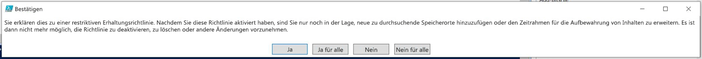

Eine Aufbewahrungssperre wurde nun der Aufbewahrungsrichtlinie hinzugefügt. Wenn Sie `Get-RetentionCompliancePolicy` ausführen, ist der `RestrictiveRetention`-Parameter auf „true“ festgelegt, Beispiel:

`Get-RetentionCompliancePolicy -Identity “<Name of Policy>” |Fl`

  
## Die Grundsätze der Aufbewahrung, oder was hat Vorrang?

Es ist möglich oder sogar wahrscheinlich, dass auf Inhalte mehrere Aufbewahrungsrichtlinien angewendet werden, die jeweils mit einer anderen Aktion (aufbewahren, löschen oder beides) und einem anderen Aufbewahrungszeitraum verbunden sind. Was hat Vorrang? Ganz allgemein sei gesagt, dass Sie sich sicher sein können, dass Inhalte, die aufgrund einer Richtlinie aufbewahrt werden müssen, nicht von einer anderen Richtlinie dauerhaft gelöscht werden können.
  
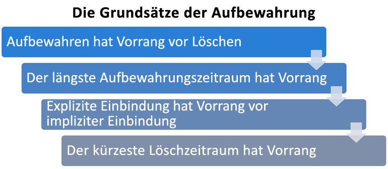
  
Um zu verstehen, wie verschiedene Aufbewahrungsrichtlinien auf Inhalte angewendet werden, sollten Sie diese Grundsätze der Aufbewahrung beachten:
  
1. **Aufbewahrung hat Vorrang vor Löschung. ** Angenommen, eine Aufbewahrungsrichtlinie gibt vor, dass Exchange-E-Mails nach drei Jahren gelöscht werden sollen, eine andere Aufbewahrungsrichtlinie jedoch besagt, dass Exchange-E-Mails fünf Jahre lang aufbewahrt und dann gelöscht werden müssen. Alle Inhalte, die drei Jahre alt sind, werden gelöscht und aus der Ansicht der Benutzer ausgeblendet, aber immer noch im Ordner "Wiederherstellbare Elemente" aufbewahrt, bis sie fünf Jahre alt sind und endgültig gelöscht werden. 
    
2. **Der längste Aufbewahrungszeitraum hat Vorrang. ** Wenn Inhalte mehreren Aufbewahrungsrichtlinien, nach denen Inhalte aufbewahrt werden, unterliegen, werden sie bis zum Ende des längsten Aufbewahrungszeitraums aufbewahrt. 
    
3. **Explizite Einbindung hat Vorrang vor impliziter Einbindung.** Dies bedeutet: 
    
    1. Wenn eine Kennzeichnung mit Aufbewahrungseinstellungen von einem Benutzer manuell einem Element zugewiesen wird, z. B. einem Exchange-E-Mail- oder OneDrive-Dokument, hat diese Kennzeichnung Vorrang sowohl vor einer Richtlinie, die auf Website- oder Postfachebene zugewiesen ist, als auch vor einer Standardkennzeichnung, die von der Dokumentbibliothek zugewiesen wurde. Wenn z. B. die explizite Kennzeichnung eine Aufbewahrung über zehn Jahr vorgibt, aber die der Website zugewiesene Richtlinie besagt, dass nur fünf Jahre aufbewahrt werden soll, hat die Kennzeichnung Vorrang. Beachten Sie, dass automatisch angewendete Kennzeichnungen als implizit und nicht als explizit angesehen werden, da sie von Office 365 automatisch angewendet werden.
    
    2. Wenn eine Aufbewahrungsrichtlinie einen bestimmten Speicherort wie das Postfach oder OneDrive for Business-Konto eines bestimmten Benutzers umfasst, hat diese Richtlinie Vorrang vor einer anderen Aufbewahrungsrichtlinie, die für alle Postfächer oder OneDrive for Business-Konten von Benutzern gilt, aber nicht das Postfach dieses Benutzers speziell einschließt.
    
4. **Der kürzeste Löschzeitraum hat Vorrang. ** Ebenso gilt, dass wenn Inhalte mehreren Aufbewahrungsrichtlinien zur Löschung (ohne Aufbewahrung) unterliegen, sie am Ende des kürzesten Aufbewahrungszeitraums gelöscht werden. 
    
Beachten Sie: Wenn die Regeln, die von allen Richtlinien oder Kennzeichnungen angewendet werden, auf einer Ebene identisch sind, bewegt sich der Fluss nach unten zur nächsten Ebene, wo entschieden wird, welche Regel Vorrang hat.
  
Schließlich kann keine Aufbewahrungsrichtlinie oder Kennzeichnung einen Inhalt dauerhaft löschen, der für eDiscovery gesperrt ist. Wenn die Sperre aufgehoben wird, kommt der Inhalt wieder für den oben beschriebenen Bereinigungsprozess infrage.
  
## Verwenden einer Aufbewahrungsrichtlinie anstelle dieser Features

Eine einzelne Aufbewahrungsrichtlinie kann 365-Gruppen ganz einfach auf eine gesamte Organisation und Speicherorte in Office 365 anwenden, einschließlich Exchange Online, SharePoint Online, OneDrive for Business und Office. Wenn Sie an einer beliebigen Stelle in Office 365 Inhalte aufbewahren oder löschen müssen, empfehlen wir, dass Sie eine Aufbewahrungsrichtlinie verwenden. (Sie können auch Kennzeichnungen mit Aufbewahrungseinstellungen nutzen – Weitere Informationen finden Sie unter [Übersicht über Kennzeichnungen](labels.md).)
  
Es gibt mehrere andere Features, die früher zum Aufbewahren oder Löschen von Inhalten in Office 365 verwendet wurden. Diese sind nachfolgend aufgeführt. Diese Features können weiterhin parallel zu Aufbewahrungsrichtlinien und Kennzeichnungen genutzt werden, die im Security &amp; Compliance Center erstellt wurden. Doch im Rahmen der Daten-Governance empfehlen wir Ihnen, dass Sie eine Aufbewahrungsrichtlinie oder Kennzeichnungen anstelle dieser Features verwenden. Eine Aufbewahrungsrichtlinie ist das einzige Feature, das sowohl für die Aufbewahrung als auch das Löschen von Inhalten in Office 365 genutzt werden kann.
  
### Exchange Online

- [Verwalten von eDiscovery-Fällen im Office 365 Security &amp; Compliance Center](https://support.office.com/article/edea80d6-20a7-40fb-b8c4-5e8c8395f6da) (eDiscovery-Sperre) 
    
- [In-Situ-Speicher und Beweissicherungsverfahren](https://go.microsoft.com/fwlink/?linkid=846124) (eDiscovery-Sperre) 
    
- [Aufbewahrungstags und Aufbewahrungsrichtlinien](https://go.microsoft.com/fwlink/?linkid=846125), auch bekannt als [Messaging-Datensatzverwaltung](https://go.microsoft.com/fwlink/?linkid=846126) (Nur Löschen) 
    
### SharePoint Online und OneDrive for Business

- [Verwalten von eDiscovery-Fällen im Office 365 Security &amp; Compliance Center](https://support.office.com/article/edea80d6-20a7-40fb-b8c4-5e8c8395f6da) (eDiscovery-Sperre) 
    
- [Hinzufügen von Inhalten zu einem Fall und temporäres Sperren von Quellen im eDiscovery Center](https://support.office.com/article/54d70de9-1ec2-4325-84f3-aeb588554479) (eDiscovery-Sperre) 
    
- [Übersicht über Dokumentlöschrichtlinien](https://support.office.com/article/55e8d858-f278-482b-a198-2e62d6a2e6e5) (Nur Löschen) 
    
- [Konfiguration von Datensatzverwaltung in situ](https://support.office.com/article/7707a878-780c-4be6-9cb0-9718ecde050a) (Aufbewahrung) 
    
- [Verwenden von Richtlinien für das Schließen und Löschen von Websites](https://support.office.com/article/a8280d82-27fd-48c5-9adf-8a5431208ba5) (Nur Löschen) 
    
- [Informationsverwaltungsrichtlinien](intro-to-info-mgmt-policies.md) (Nur Löschen) 
    
Beachten Sie, dass wenn Sie für die Daten-Governance zuvor eine der eDiscovery-Sperren verwendet haben, Sie stattdessen eine Aufbewahrungsrichtlinie für proaktive Compliance nutzen sollten. Im Security &amp; Compliance Center erstellte Sperren sollten Sie nur für eDiscovery nutzen.
  
### Aufbewahrungsrichtlinien setzen Informationsverwaltungsrichtlinien außer Kraft

In SharePoint-Websites verwenden Sie möglicherweise [Informationsverwaltungsrichtlinien](intro-to-info-mgmt-policies.md) zum Aufbewahren von Inhalten. Wenn Sie eine im Security and Compliance Center erstellte Aufbewahrungsrichtlinie auf eine Website anwenden, die bereits Inhaltstyprichtlinien oder Informationsverwaltungsrichtlinien für eine Liste oder eine Bibliothek nutzt, werden diese Richtlinien ignoriert, solange die Aufbewahrungsrichtlinie gilt. 
  
## Was ist aus den Erhaltungsrichtlinien geworden?

Wenn Sie eine Erhaltungsrichtlinie verwendet haben, wurde diese Richtlinie automatisch in eine Aufbewahrungsrichtlinie umgewandelt, die nur die Aufbewahrungsaktion verwendet – die Richtlinie wird keine Inhalte löschen. Die Erhaltungsrichtlinie funktioniert weiterhin und erhält Ihre Inhalte, ohne dass Sie dazu Änderungen vornehmen müssen. Sie finden diese Richtlinien auf der Seite **Aufbewahrung** im Security &amp; Compliance Center. Sie können eine Erhaltungsrichtlinie zum Ändern des Aufbewahrungszeitraums bearbeiten, aber Sie können keine anderen Änderungen vornehmen, etwa ein Hinzufügen oder Entfernen von Speicherorten. 
  
## Berechtigungen

Mitglieder Ihres Compliance-Teams, die Aufbewahrungsrichtlinien erstellen sollen, benötigen Berechtigungen für das Security &amp; Compliance Center. Standardmäßig hat Ihr Mandantenadministrator Zugriff auf diesen Speicherort und kann anderen Personen den Zugriff auf das Security &amp; Compliance Center gewähren, ohne ihnen alle Berechtigungen eines Mandantenadministrators zu geben. Zu diesem Zweck wird empfohlen, dass Sie zur Seite **Berechtigungen** des Security &amp; Compliance Center gehen, die Rollengruppe **Compliance-Administrator** bearbeiten und dieser Rollengruppe Mitglieder hinzufügen. 
  
Weitere Informationen finden Sie unter [Freigeben des Benutzerzugriffs auf das Office 365 Security &amp; Compliance Center](grant-access-to-the-security-and-compliance-center.md).
  
Diese Berechtigungen sind nur erforderlich, um eine Aufbewahrungsrichtlinie zu erstellen und anzuwenden. Für die Durchsetzung von Richtlinien ist kein Zugriff auf Inhalte erforderlich.
  
## Die PowerShell-Cmdlets für Aufbewahrungsrichtlinien finden

Wenn Sie die Cmdlets für Aufbewahrungsrichtlinien verwenden möchten, müssen Sie:
  
1. [Eine Verbindung zum Office 365 Security &amp; Compliance Center mithilfe von Remote-PowerShell herstellen](http://go.microsoft.com/fwlink/?LinkID=799771&amp;clcid=0x409)
    
2. Diese [Office 365 Security &amp; Compliance Center-Cmdlets nutzen](http://go.microsoft.com/fwlink/?LinkID=799772&amp;clcid=0x409)
    
## Weitere Informationen

- [Übersicht über Bezeichnungen](labels.md)
    

