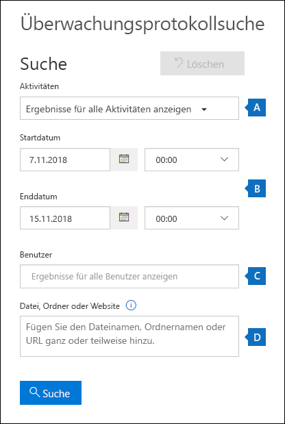
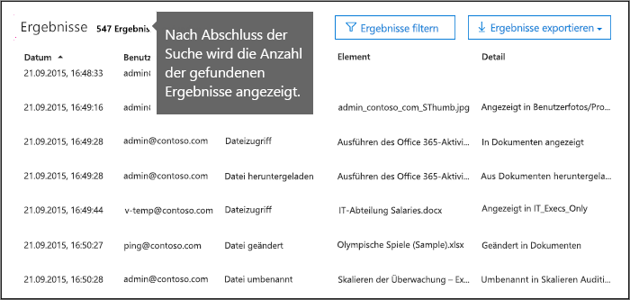
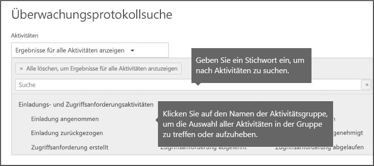
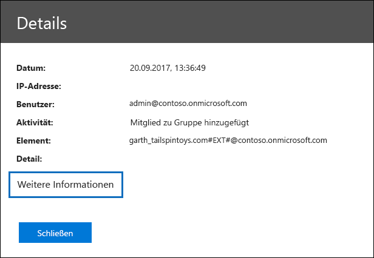
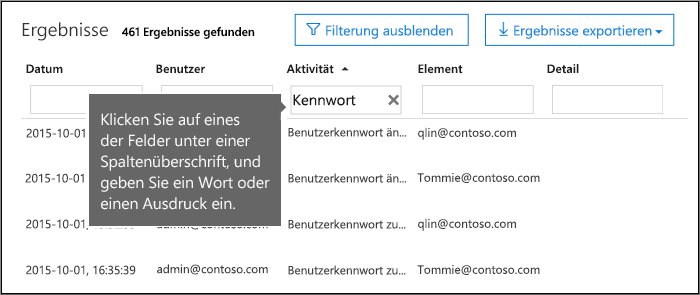
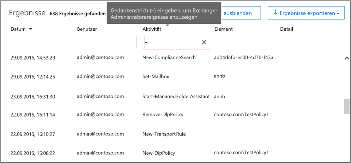

# <a name="search-the-audit-log-in-the-security--compliance-center"></a><span data-ttu-id="84240-103">Durchsuchen des Überwachungsprotokolls im Security #a0 Compliance Center</span><span class="sxs-lookup"><span data-stu-id="84240-103">Search the audit log in the Security & Compliance Center</span></span>

## <a name="introduction"></a><span data-ttu-id="84240-104">Einführung</span><span class="sxs-lookup"><span data-stu-id="84240-104">Introduction</span></span>

<span data-ttu-id="84240-105">Sie müssen herausfinden, ob ein Benutzer ein bestimmtes Dokument gesehen oder ein Element aus seinem Postfach gelöscht hat?</span><span class="sxs-lookup"><span data-stu-id="84240-105">Need to find if a user viewed a specific document or purged an item from their mailbox?</span></span> <span data-ttu-id="84240-106">Wenn dies der Fall ist, können Sie das &amp; Office 365 Security Compliance Center verwenden, um das einheitliche Überwachungsprotokoll zu durchsuchen, um Benutzer-und Administratoraktivitäten in Ihrer Office 365 Organisation anzuzeigen.</span><span class="sxs-lookup"><span data-stu-id="84240-106">If so, you can use the Office 365 Security &amp; Compliance Center to search the unified audit log to view user and administrator activity in your Office 365 organization.</span></span> <span data-ttu-id="84240-107">Warum ein einheitliches Überwachungsprotokoll?</span><span class="sxs-lookup"><span data-stu-id="84240-107">Why a unified audit log?</span></span> <span data-ttu-id="84240-108">Da Sie in Office 365 nach den folgenden Arten von Benutzer-und Administratoraktivitäten suchen können:</span><span class="sxs-lookup"><span data-stu-id="84240-108">Because you can search for the following types of user and admin activity in Office 365:</span></span>
  
- <span data-ttu-id="84240-109">Benutzeraktivität in SharePoint Online und OneDrive für Unternehmen</span><span class="sxs-lookup"><span data-stu-id="84240-109">User activity in SharePoint Online and OneDrive for Business</span></span>
    
- <span data-ttu-id="84240-110">Benutzeraktivität in Exchange Online (Exchange-postfachüberwachungsprotokollierung)</span><span class="sxs-lookup"><span data-stu-id="84240-110">User activity in Exchange Online (Exchange mailbox audit logging)</span></span>
  
- <span data-ttu-id="84240-111">Administrator Aktivität in SharePoint Online</span><span class="sxs-lookup"><span data-stu-id="84240-111">Admin activity in SharePoint Online</span></span>
    
- <span data-ttu-id="84240-112">Administrator Aktivität in Azure Active Directory (Verzeichnisdienst für Office 365)</span><span class="sxs-lookup"><span data-stu-id="84240-112">Admin activity in Azure Active Directory (the directory service for Office 365)</span></span>
    
- <span data-ttu-id="84240-113">Administrator Aktivität in Exchange Online (Exchange Admin Audit Logging)</span><span class="sxs-lookup"><span data-stu-id="84240-113">Admin activity in Exchange Online (Exchange admin audit logging)</span></span>
    
- <span data-ttu-id="84240-114">Benutzer-und Administrator Aktivität in Sway</span><span class="sxs-lookup"><span data-stu-id="84240-114">User and admin activity in Sway</span></span>
    
- <span data-ttu-id="84240-115">eDiscovery-Aktivitäten im Security and Compliance Center</span><span class="sxs-lookup"><span data-stu-id="84240-115">eDiscovery activities in the security and compliance center</span></span>
    
- <span data-ttu-id="84240-116">Benutzer-und Administrator Aktivität in Power BI</span><span class="sxs-lookup"><span data-stu-id="84240-116">User and admin activity in Power BI</span></span>
    
- <span data-ttu-id="84240-117">Benutzer-und Administratoraktivitäten in Microsoft Teams</span><span class="sxs-lookup"><span data-stu-id="84240-117">User and admin activity in Microsoft Teams</span></span>

- <span data-ttu-id="84240-118">Benutzer-und Administrator Aktivität in Dynamics 365</span><span class="sxs-lookup"><span data-stu-id="84240-118">User and admin activity in Dynamics 365</span></span>
    
- <span data-ttu-id="84240-119">Benutzer-und Administrator Aktivität in "jammern"</span><span class="sxs-lookup"><span data-stu-id="84240-119">User and admin activity in Yammer</span></span>
 
- <span data-ttu-id="84240-120">Benutzer-und Administrator Aktivität in Microsoft Flow</span><span class="sxs-lookup"><span data-stu-id="84240-120">User and admin activity in Microsoft Flow</span></span>
    
- <span data-ttu-id="84240-121">Benutzer-und Administrator Aktivität in Microsoft Stream</span><span class="sxs-lookup"><span data-stu-id="84240-121">User and admin activity in Microsoft Stream</span></span>

- <span data-ttu-id="84240-122">Analysten-und Administratoraktivitäten in Microsoft Workplace Analytics</span><span class="sxs-lookup"><span data-stu-id="84240-122">Analyst and admin activity in Microsoft Workplace Analytics</span></span>

- <span data-ttu-id="84240-123">Benutzer-und Administratoraktivitäten in Microsoft PowerApps</span><span class="sxs-lookup"><span data-stu-id="84240-123">User and admin activity in Microsoft PowerApps</span></span>
    
   
## <a name="before-you-begin"></a><span data-ttu-id="84240-124">Bevor Sie beginnen</span><span class="sxs-lookup"><span data-stu-id="84240-124">Before you begin</span></span>

<span data-ttu-id="84240-125">Lesen Sie unbedingt die folgenden Elemente, bevor Sie mit der Suche im Office 365 Überwachungsprotokoll beginnen.</span><span class="sxs-lookup"><span data-stu-id="84240-125">Be sure to read the following items before you start searching the Office 365 audit log.</span></span>
  
- <span data-ttu-id="84240-126">Sie (oder ein anderer Administrator) müssen zuerst die Überwachungsprotokollierung aktivieren, bevor Sie mit der Suche im Office 365 Überwachungsprotokoll beginnen können.</span><span class="sxs-lookup"><span data-stu-id="84240-126">You (or another admin) must first turn on audit logging before you can start searching the Office 365 audit log.</span></span> <span data-ttu-id="84240-127">Klicken Sie zum Aktivieren auf der Seite **Überwachungsprotokoll Suche** im Security #a0 Compliance Center auf **Aufzeichnung von Benutzer-und Administratoraktivitäten starten** .</span><span class="sxs-lookup"><span data-stu-id="84240-127">To turn it on, click **Start recording user and admin activity** on the **Audit log search** page in the Security & Compliance Center.</span></span> <span data-ttu-id="84240-128">(Wenn dieser Link nicht angezeigt wird, wurde die Überwachung für Ihre Organisation bereits aktiviert.) Nachdem Sie es aktiviert haben, wird eine Meldung angezeigt, die besagt, dass das Überwachungsprotokoll vorbereitet wird und dass Sie eine Suche in einigen Stunden nach Abschluss der Vorbereitung ausführen können.</span><span class="sxs-lookup"><span data-stu-id="84240-128">(If you don't see this link, auditing has already been turned on for your organization.) After you turn it on, a message is displayed that says the audit log is being prepared and that you can run a search in a couple of hours after the preparation is complete.</span></span> <span data-ttu-id="84240-129">Sie müssen dies nur einmal tun.</span><span class="sxs-lookup"><span data-stu-id="84240-129">You only have to do this once.</span></span> 
    
    > [!NOTE]
    > <span data-ttu-id="84240-130">Wir sind gerade dabei, die Überwachung standardmäßig zu aktivieren.</span><span class="sxs-lookup"><span data-stu-id="84240-130">We're in the process of turning on auditing by default.</span></span> <span data-ttu-id="84240-131">Bis dahin können Sie Sie wie oben beschrieben aktivieren.</span><span class="sxs-lookup"><span data-stu-id="84240-131">Until then, you can turn it on as previously described.</span></span> 
  
- <span data-ttu-id="84240-132">Sie müssen in Exchange Online die Rolle "nur Ansichts Überwachungsprotokolle" oder "Überwachungsprotokolle" zugewiesen sein, um das Office 365 Überwachungsprotokoll durchsuchen zu können.</span><span class="sxs-lookup"><span data-stu-id="84240-132">You have to be assigned the View-Only Audit Logs or Audit Logs role in Exchange Online to search the Office 365 audit log.</span></span> <span data-ttu-id="84240-133">Diese Rollen werden standardmäßig den Rollengruppen Compliance Management und Organisationsverwaltung auf der Seite **Berechtigungen** im Exchange Admin Center zugewiesen.</span><span class="sxs-lookup"><span data-stu-id="84240-133">By default, these roles are assigned to the Compliance Management and Organization Management role groups on the **Permissions** page in the Exchange admin center.</span></span> <span data-ttu-id="84240-134">Hinweis globale Administratoren in Office 365 und Microsoft 365 werden automatisch als Mitglieder der Rollengruppe "Organisationsverwaltung" in Exchange Online hinzugefügt.</span><span class="sxs-lookup"><span data-stu-id="84240-134">Note Global administrators in Office 365 and Microsoft 365 are automatically added as members of the Organization Management role group in Exchange Online.</span></span> <span data-ttu-id="84240-135">Um einem Benutzer die Möglichkeit zu geben, das Office 365 Überwachungsprotokoll mit der minimalen Berechtigungsstufe zu durchsuchen, können Sie eine benutzerdefinierte Rollengruppe in Exchange Online erstellen, die nur-Ansicht-Überwachungsprotokolle oder die Rolle "Überwachungsprotokolle" hinzufügen und dann den Benutzer als Mitglied der neuen Rollengruppe hinzufügen.</span><span class="sxs-lookup"><span data-stu-id="84240-135">To give a user the ability to search the Office 365 audit log with the minimum level of privileges, you can create a custom role group in Exchange Online, add the View-Only Audit Logs or Audit Logs role, and then add the user as a member of the new role group.</span></span> <span data-ttu-id="84240-136">Weitere Informationen finden Sie unter [Verwalten von Rollengruppen in Exchange Online](https://go.microsoft.com/fwlink/p/?LinkID=730688).</span><span class="sxs-lookup"><span data-stu-id="84240-136">For more information, see [Manage role groups in Exchange Online](https://go.microsoft.com/fwlink/p/?LinkID=730688).</span></span>
    
    > [!IMPORTANT]
    > <span data-ttu-id="84240-137">Wenn Sie einem Benutzer die Rolle "nur Ansichts Überwachungsprotokolle" oder "Überwachungsprotokolle" auf der Seite **Berechtigungen** im Security #a0 Compliance Center zuweisen, kann er das Office 365 Überwachungsprotokoll nicht durchsuchen.</span><span class="sxs-lookup"><span data-stu-id="84240-137">If you assign a user the View-Only Audit Logs or Audit Logs role on the **Permissions** page in the Security & Compliance Center, they won't be able to search the Office 365 audit log.</span></span> <span data-ttu-id="84240-138">Sie müssen die Berechtigungen in Exchange Online zuweisen.</span><span class="sxs-lookup"><span data-stu-id="84240-138">You have to assign the permissions in Exchange Online.</span></span> <span data-ttu-id="84240-139">Dies liegt daran, dass das zugrunde liegende Cmdlet, das zum Durchsuchen des Überwachungsprotokolls verwendet wird, ein Exchange Online-Cmdlet ist.</span><span class="sxs-lookup"><span data-stu-id="84240-139">This is because the underlying cmdlet used to search the audit log is an Exchange Online cmdlet.</span></span> 
  
- <span data-ttu-id="84240-140">Wenn eine überwachte Aktivität von einem Benutzer oder Administrator ausgeführt wird, wird ein Überwachungseintrag generiert und im Office 365 Überwachungsprotokoll für Ihre Organisation gespeichert.</span><span class="sxs-lookup"><span data-stu-id="84240-140">When an audited activity is performed by a user or admin, an audit record is generated and stored in the Office 365 audit log for your organization.</span></span> <span data-ttu-id="84240-141">Die Zeitdauer, für die ein Überwachungsdatensatz aufbewahrt wird (und im Überwachungsprotokoll durchsuchbar), hängt von Ihrem Office 365-Abonnement und insbesondere vom Typ der Lizenz ab, die einem bestimmten Benutzer zugewiesen ist.</span><span class="sxs-lookup"><span data-stu-id="84240-141">The length of time that an audit record is retained (and searchable in the audit log) depends on your Office 365 subscription, and specifically the type of the license that is assigned to a specific user.</span></span>

     - <span data-ttu-id="84240-142">**Office 365 E3:** Überwachungseinträge werden für 90 Tage aufbewahrt.</span><span class="sxs-lookup"><span data-stu-id="84240-142">**Office 365 E3:** Audit records are retained for 90 days.</span></span> <span data-ttu-id="84240-143">Das bedeutet, dass Sie das Überwachungsprotokoll nach Aktivitäten durchsuchen können, die in den letzten 90 Tagen ausgeführt wurden.</span><span class="sxs-lookup"><span data-stu-id="84240-143">That means you can search the audit log for activities that were performed within the last 90 days.</span></span>

     - <span data-ttu-id="84240-144">**Office 365 E5:** Überwachungseinträge werden auch für 90 Tage aufbewahrt.</span><span class="sxs-lookup"><span data-stu-id="84240-144">**Office 365 E5:** Audit records are also retained for 90 days.</span></span> <span data-ttu-id="84240-145">Das Aufbewahren von Überwachungsdatensätzen für ein Jahr ist möglicherweise für E5-Benutzer und-Benutzer mit einer E3-Lizenz und einer Add-on-Lizenz für Office 365 Advanced Compliance verfügbar.</span><span class="sxs-lookup"><span data-stu-id="84240-145">Retaining audit records for one year may eventually be available for E5 users and users with an E3 license and an Office 365 Advanced Compliance add-on license.</span></span>

        > [!NOTE]
        > <span data-ttu-id="84240-146">Das private Preview-Programm für die einjährige Aufbewahrungszeit für Überwachungsdatensätze für E5-Organisationen (oder für Benutzer in E3-Organisationen mit erweiterten Compliance-Add-on-Lizenzen) ist für die neue Registrierung geschlossen.</span><span class="sxs-lookup"><span data-stu-id="84240-146">The private preview program for the one-year retention period for audit records for E5 organizations (or for users in E3 organizations that have Advanced Compliance add-on licenses) is closed to new enrollment.</span></span> <span data-ttu-id="84240-147">Dieser Artikel wird aktualisiert, wenn der Aufbewahrungszeitraum für ein Jahr in der öffentlichen Vorschau verfügbar oder für allgemeine Verfügbarkeit freigegeben ist.</span><span class="sxs-lookup"><span data-stu-id="84240-147">This article will be updated when the one-year retention period is available in public preview or released for general availability.</span></span>

- <span data-ttu-id="84240-148">Wenn Sie die Überwachungsprotokoll Suche in Office 365 für Ihre Organisation deaktivieren möchten, können Sie den folgenden Befehl in der Remote-PowerShell ausführen, die mit Ihrer Exchange Online Organisation verbunden ist:</span><span class="sxs-lookup"><span data-stu-id="84240-148">If you want to turn off audit log search in Office 365 for your organization, you can run the following command in remote PowerShell connected to your Exchange Online organization:</span></span>
    
  ```
  Set-AdminAuditLogConfig -UnifiedAuditLogIngestionEnabled $false
  ```

    <span data-ttu-id="84240-149">Um die Überwachungs Suche erneut zu aktivieren, können Sie den folgenden Befehl in Exchange Online PowerShell ausführen:</span><span class="sxs-lookup"><span data-stu-id="84240-149">To turn on audit search again, you can run the following command in Exchange Online PowerShell:</span></span>
    
  ```
  Set-AdminAuditLogConfig -UnifiedAuditLogIngestionEnabled $true
  ```

    <span data-ttu-id="84240-150">Weitere Informationen finden Sie unter [Deaktivieren der Überwachungsprotokoll Suche in Office 365](turn-audit-log-search-on-or-off.md).</span><span class="sxs-lookup"><span data-stu-id="84240-150">For more information, see [Turn off audit log search in Office 365](turn-audit-log-search-on-or-off.md).</span></span>
    
- <span data-ttu-id="84240-151">Wie bereits erwähnt, ist das zugrunde liegende Cmdlet, das zum Durchsuchen des Überwachungsprotokolls verwendet wird, ein Exchange Online-Cmdlet, das **Such UnifiedAuditLog**ist.</span><span class="sxs-lookup"><span data-stu-id="84240-151">As previously stated, the underlying cmdlet used to search the audit log is an Exchange Online cmdlet, which is **Search-UnifiedAuditLog**.</span></span> <span data-ttu-id="84240-152">Das bedeutet, dass Sie dieses Cmdlet verwenden können, um das Office 365 Überwachungsprotokoll zu durchsuchen, anstatt die Seite **Überwachungsprotokoll Suche** im Security #a0 Compliance Center zu verwenden.</span><span class="sxs-lookup"><span data-stu-id="84240-152">That means you can use this cmdlet to search the Office 365 audit log instead of using the **Audit log search** page in the Security & Compliance Center.</span></span> <span data-ttu-id="84240-153">Sie müssen dieses Cmdlet in der Remote-PowerShell ausführen, die mit Ihrer Exchange Online Organisation verbunden ist.</span><span class="sxs-lookup"><span data-stu-id="84240-153">You have to run this cmdlet in remote PowerShell connected to your Exchange Online organization.</span></span> <span data-ttu-id="84240-154">Weitere Informationen finden Sie unter [Search-UnifiedAuditLog](https://go.microsoft.com/fwlink/p/?linkid=834776).</span><span class="sxs-lookup"><span data-stu-id="84240-154">For more information, see [Search-UnifiedAuditLog](https://go.microsoft.com/fwlink/p/?linkid=834776).</span></span> 

    <span data-ttu-id="84240-155">Informationen zum Exportieren der vom Cmdlet **Search-UnifiedAuditLog** zurückgegebenen Suchergebnisse in eine CSV-Datei finden Sie im Abschnitt "Tipps zum Exportieren und Anzeigen des Überwachungsprotokolls" unter [exportieren, konfigurieren und Anzeigen von Überwachungsprotokolldaten Sätzen](export-view-audit-log-records.md#tips-for-exporting-and-viewing-the-audit-log).</span><span class="sxs-lookup"><span data-stu-id="84240-155">For information about exporting the search results returned by the **Search-UnifiedAuditLog** cmdlet to a CSV file, see the "Tips for exporting and viewing the audit log" section in [Export, configure, and view audit log records](export-view-audit-log-records.md#tips-for-exporting-and-viewing-the-audit-log).</span></span>  

- <span data-ttu-id="84240-156">Wenn Sie Daten programmgesteuert aus dem Office 365 Überwachungsprotokoll herunterladen möchten, sollten Sie die API für die Office 365 Verwaltungsaktivität anstelle eines PowerShell-Skripts verwenden.</span><span class="sxs-lookup"><span data-stu-id="84240-156">If you want to programmatically download data from the Office 365 audit log, we recommend that you use the Office 365 Management Activity API instead of using a PowerShell script.</span></span> <span data-ttu-id="84240-157">Die Office 365-Verwaltungs Aktivitäts-API ist ein Rest-Webdienst, mit dem Sie Betriebs-, Sicherheits-und Compliance-Überwachungslösungen für Ihre Organisation entwickeln können.</span><span class="sxs-lookup"><span data-stu-id="84240-157">The Office 365 Management Activity API is a REST web service that you can use to develop operations, security, and compliance monitoring solutions for your organization.</span></span> <span data-ttu-id="84240-158">Weitere Informationen finden Sie unter [API-Referenz zur Office 365-Verwaltungsaktivität](https://docs.microsoft.com/office/office-365-management-api/office-365-management-activity-api-reference).</span><span class="sxs-lookup"><span data-stu-id="84240-158">For more information, see [Office 365 Management Activity API reference](https://docs.microsoft.com/office/office-365-management-api/office-365-management-activity-api-reference).</span></span>
    
- <span data-ttu-id="84240-159">Es kann bis zu 30 Minuten oder bis zu 24 Stunden dauern, bis ein Ereignis eintritt, damit der entsprechende Überwachungsprotokolleintrag in den Suchergebnissen angezeigt wird.</span><span class="sxs-lookup"><span data-stu-id="84240-159">It can take up to 30 minutes or up to 24 hours after an event occurs for the corresponding audit log entry to be displayed in the search results.</span></span> <span data-ttu-id="84240-160">In der folgenden Tabelle ist die für die verschiedenen Dienste in Office 365 benötigte Zeit dargestellt.</span><span class="sxs-lookup"><span data-stu-id="84240-160">The following table shows the time it takes for the different services in Office 365.</span></span>
    
    |<span data-ttu-id="84240-161">**Office 365-Dienste**</span><span class="sxs-lookup"><span data-stu-id="84240-161">**Office 365 service**</span></span>|<span data-ttu-id="84240-162">**30 Minuten**</span><span class="sxs-lookup"><span data-stu-id="84240-162">**30 minutes**</span></span>|<span data-ttu-id="84240-163">**24 Stunden**</span><span class="sxs-lookup"><span data-stu-id="84240-163">**24 hours**</span></span>|
    |:-----|:-----|:-----|
    |<span data-ttu-id="84240-164">Advanced Threat Protection und Threat Intelligence</span><span class="sxs-lookup"><span data-stu-id="84240-164">Advanced Threat Protection and Threat Intelligence</span></span>  <br/> || |
    |<span data-ttu-id="84240-166">Azure-Active Directory (Benutzeranmelde Ereignisse)</span><span class="sxs-lookup"><span data-stu-id="84240-166">Azure Active Directory (user login events)</span></span>  <br/> ||           <br/> |
    |<span data-ttu-id="84240-168">Azure-Active Directory (admin-Ereignisse)</span><span class="sxs-lookup"><span data-stu-id="84240-168">Azure Active Directory (admin events)</span></span>  <br/> || |
    |<span data-ttu-id="84240-170">Verhinderung von Datenverlust</span><span class="sxs-lookup"><span data-stu-id="84240-170">Data Loss Prevention</span></span>  <br/> |       <br/>| |
    |<span data-ttu-id="84240-172">Dynamics 365 CRM</span><span class="sxs-lookup"><span data-stu-id="84240-172">Dynamics 365 CRM</span></span> <br/> |           <br/>| |
    |<span data-ttu-id="84240-174">eDiscovery</span><span class="sxs-lookup"><span data-stu-id="84240-174">eDiscovery</span></span>  <br/> |           <br/>| |
    |<span data-ttu-id="84240-176">Exchange Online</span><span class="sxs-lookup"><span data-stu-id="84240-176">Exchange Online</span></span>  <br/> |           <br/> ||
    |<span data-ttu-id="84240-178">Microsoft Flow</span><span class="sxs-lookup"><span data-stu-id="84240-178">Microsoft Flow</span></span>  <br/> |           <br/>| |
    |<span data-ttu-id="84240-180">Microsoft Project</span><span class="sxs-lookup"><span data-stu-id="84240-180">Microsoft Project</span></span>  <br/> |           <br/>| |
    |<span data-ttu-id="84240-182">Microsoft Stream</span><span class="sxs-lookup"><span data-stu-id="84240-182">Microsoft Stream</span></span>  <br/> |           <br/>| |
    |<span data-ttu-id="84240-184">Microsoft Teams</span><span class="sxs-lookup"><span data-stu-id="84240-184">Microsoft Teams</span></span>  <br/> |           <br/> ||
    |<span data-ttu-id="84240-186">Power BI</span><span class="sxs-lookup"><span data-stu-id="84240-186">Power BI</span></span>  <br/> |           <br/>| |
    |<span data-ttu-id="84240-188">Security & Compliance Center</span><span class="sxs-lookup"><span data-stu-id="84240-188">Security & Compliance Center</span></span>  <br/> |           <br/> ||
    |<span data-ttu-id="84240-190">SharePoint Online und OneDrive for Business</span><span class="sxs-lookup"><span data-stu-id="84240-190">SharePoint Online and OneDrive for Business</span></span>  <br/> |           <br/> ||
    |<span data-ttu-id="84240-192">Sway</span><span class="sxs-lookup"><span data-stu-id="84240-192">Sway</span></span>  <br/> ||           <br/> |
    |<span data-ttu-id="84240-194">Workplace Analytics</span><span class="sxs-lookup"><span data-stu-id="84240-194">Workplace Analytics</span></span><br/> |           <br/> || 
    |<span data-ttu-id="84240-196">Yammer</span><span class="sxs-lookup"><span data-stu-id="84240-196">Yammer</span></span>  <br/> ||           <br/> |
   
- <span data-ttu-id="84240-198">Azure Active Directory (Azure AD) ist der Verzeichnisdienst für Office 365.</span><span class="sxs-lookup"><span data-stu-id="84240-198">Azure Active Directory (Azure AD) is the directory service for Office 365.</span></span> <span data-ttu-id="84240-199">Das einheitliche Überwachungsprotokoll enthält Aktivitäten von Benutzern, Gruppen, Anwendungen, Domänen und Verzeichnissen, die im Microsoft 365 Admin Center oder im Azure-Verwaltungsportal ausgeführt werden.</span><span class="sxs-lookup"><span data-stu-id="84240-199">The unified audit log contains user, group, application, domain, and directory activities performed in the Microsoft 365 admin center or in the Azure management portal.</span></span> <span data-ttu-id="84240-200">Eine vollständige Liste der Azure AD Ereignisse finden Sie unter [Azure Active Directory Audit Report Events](https://go.microsoft.com/fwlink/p/?LinkID=616549).</span><span class="sxs-lookup"><span data-stu-id="84240-200">For a complete list of Azure AD events, see [Azure Active Directory Audit Report Events](https://go.microsoft.com/fwlink/p/?LinkID=616549).</span></span>
    
- <span data-ttu-id="84240-201">Die Überwachungsprotokollierung für Power BI ist standardmäßig nicht aktiviert.</span><span class="sxs-lookup"><span data-stu-id="84240-201">Audit logging for Power BI isn't enabled by default.</span></span> <span data-ttu-id="84240-202">Um im Office 365 Überwachungsprotokoll nach Power BI-Aktivitäten zu suchen, müssen Sie die Überwachung im Power BI-Verwaltungsportal aktivieren.</span><span class="sxs-lookup"><span data-stu-id="84240-202">To search for Power BI activities in the Office 365 audit log, you have to enable auditing in the Power BI admin portal.</span></span> <span data-ttu-id="84240-203">Anweisungen finden Sie im Abschnitt "Überwachungsprotokolle" im [Power BI-Verwaltungsportal](https://docs.microsoft.com/power-bi/service-admin-portal#audit-logs).</span><span class="sxs-lookup"><span data-stu-id="84240-203">For instructions, see the "Audit logs" section in [Power BI admin portal](https://docs.microsoft.com/power-bi/service-admin-portal#audit-logs).</span></span>
    
    
## <a name="search-the-audit-log"></a><span data-ttu-id="84240-204">Durchsuchen des Überwachungsprotokolls</span><span class="sxs-lookup"><span data-stu-id="84240-204">Search the audit log</span></span>

<span data-ttu-id="84240-205">Hier ist der Vorgang zum Durchsuchen des Überwachungsprotokolls in Office 365.</span><span class="sxs-lookup"><span data-stu-id="84240-205">Here's the process for searching the audit log in Office 365.</span></span>
  
[<span data-ttu-id="84240-206">Schritt 1: Ausführen einer Überwachungsprotokoll Suche</span><span class="sxs-lookup"><span data-stu-id="84240-206">Step 1: Run an audit log search</span></span>](#step-1-run-an-audit-log-search)
  
[<span data-ttu-id="84240-207">Schritt 2: Anzeigen der Suchergebnisse</span><span class="sxs-lookup"><span data-stu-id="84240-207">Step 2: View the search results</span></span>](#step-2-view-the-search-results)

[<span data-ttu-id="84240-208">Schritt 3: Filtern der Suchergebnisse</span><span class="sxs-lookup"><span data-stu-id="84240-208">Step 3: Filter the search results</span></span>](#step-3-filter-the-search-results)

[<span data-ttu-id="84240-209">Schritt 4: Exportieren der Suchergebnisse in eine Datei</span><span class="sxs-lookup"><span data-stu-id="84240-209">Step 4: Export the search results to a file</span></span>](#step-4-export-the-search-results-to-a-file)


  
### <a name="step-1-run-an-audit-log-search"></a><span data-ttu-id="84240-210">Schritt 1: Ausführen einer Überwachungsprotokoll Suche</span><span class="sxs-lookup"><span data-stu-id="84240-210">Step 1: Run an audit log search</span></span>

1. <span data-ttu-id="84240-211">Wechseln Sie zu [https://protection.office.com](https://protection.office.com).</span><span class="sxs-lookup"><span data-stu-id="84240-211">Go to [https://protection.office.com](https://protection.office.com).</span></span>
    
    > [!TIP]
    > <span data-ttu-id="84240-212">Verwenden Sie eine private Browsersitzung (keine reguläre Sitzung), um auf das Security #a0 Compliance Center zuzugreifen, da dadurch verhindert wird, dass die Anmeldeinformationen, mit denen Sie derzeit angemeldet sind, verwendet werden.</span><span class="sxs-lookup"><span data-stu-id="84240-212">Use a private browsing session (not a regular session) to access the Security & Compliance Center because this will prevent the credential that you are currently logged on with from being used.</span></span> <span data-ttu-id="84240-213">Drücken Sie zum Öffnen einer InPrivate-Browsersitzung in Internet Explorer oder Microsoft Edge einfach STRG + UMSCHALT + P.</span><span class="sxs-lookup"><span data-stu-id="84240-213">To open an InPrivate Browsing session in Internet Explorer or Microsoft Edge, just press CTRL+SHIFT+P.</span></span> <span data-ttu-id="84240-214">Drücken Sie STRG + UMSCHALT + N, um eine private Browsersitzung in Google Chrome (als inkognito-Fenster bezeichnet) zu öffnen.</span><span class="sxs-lookup"><span data-stu-id="84240-214">To open a private browsing session in Google Chrome (called an incognito window), press CTRL+SHIFT+N.</span></span> 
  
2. <span data-ttu-id="84240-215">Melden Sie sich bei Office 365 mit Ihrem Geschäfts-, Schul- oder Unikonto an.</span><span class="sxs-lookup"><span data-stu-id="84240-215">Sign in to Office 365 using your work or school account.</span></span>
    
3. <span data-ttu-id="84240-216">Klicken Sie im linken Bereich des Security #a0 Compliance Center auf **Suchen**, und klicken Sie dann auf **Überwachungsprotokoll Suche**.</span><span class="sxs-lookup"><span data-stu-id="84240-216">In the left pane of the Security & Compliance Center, click **Search**, and then click **Audit log search**.</span></span>
    
    <span data-ttu-id="84240-217">Die Seite **Überwachungsprotokoll Suche** wird angezeigt.</span><span class="sxs-lookup"><span data-stu-id="84240-217">The **Audit log search** page is displayed.</span></span> 
    
    
  
    > [!NOTE]
    > <span data-ttu-id="84240-219">Sie müssen zunächst die Überwachungsprotokollierung aktivieren, bevor Sie eine Überwachungsprotokoll Suche ausführen können.</span><span class="sxs-lookup"><span data-stu-id="84240-219">You have to first turn on audit logging before you can run an audit log search.</span></span> <span data-ttu-id="84240-220">Wenn der Link **Recording User und admin Activity starten** angezeigt wird, klicken Sie darauf, um die Überwachung zu aktivieren.</span><span class="sxs-lookup"><span data-stu-id="84240-220">If the **Start recording user and admin activity** link is displayed, click it to turn on auditing.</span></span> <span data-ttu-id="84240-221">Wenn dieser Link nicht angezeigt wird, wurde die Überwachung für Ihre Organisation bereits aktiviert.</span><span class="sxs-lookup"><span data-stu-id="84240-221">If you don't see this link, auditing has already been turned on for your organization.</span></span> 
  
4. <span data-ttu-id="84240-222">Konfigurieren Sie die folgenden Suchkriterien:</span><span class="sxs-lookup"><span data-stu-id="84240-222">Configure the following search criteria:</span></span>
    
    <span data-ttu-id="84240-223">a.</span><span class="sxs-lookup"><span data-stu-id="84240-223">a.</span></span> <span data-ttu-id="84240-224">**Aktivitäten** Klicken Sie auf die Dropdownliste, um die Aktivitäten anzuzeigen, nach denen Sie suchen können.</span><span class="sxs-lookup"><span data-stu-id="84240-224">**Activities** Click the drop-down list to display the activities that you can search for.</span></span> <span data-ttu-id="84240-225">Benutzer-und Administratoraktivitäten werden in Gruppen verwandter Aktivitäten organisiert.</span><span class="sxs-lookup"><span data-stu-id="84240-225">User and admin activities are organized in to groups of related activities.</span></span> <span data-ttu-id="84240-226">Sie können bestimmte Aktivitäten auswählen oder auf den Namen der Aktivitätsgruppe klicken, um alle Aktivitäten in der Gruppe auszuwählen.</span><span class="sxs-lookup"><span data-stu-id="84240-226">You can select specific activities or you can click the activity group name to select all activities in the group.</span></span> <span data-ttu-id="84240-227">Sie können auch auf eine ausgewählte Aktivität klicken, um die Auswahl zu löschen.</span><span class="sxs-lookup"><span data-stu-id="84240-227">You can also click a selected activity to clear the selection.</span></span> <span data-ttu-id="84240-228">Nachdem Sie die Suche ausgeführt haben, werden nur die Überwachungsprotokolleinträge für die ausgewählten Aktivitäten angezeigt.</span><span class="sxs-lookup"><span data-stu-id="84240-228">After you run the search, only the audit log entries for the selected activities are displayed.</span></span> <span data-ttu-id="84240-229">Wenn Sie **Ergebnisse für alle Aktivitäten anzeigen** auswählen, werden die Ergebnisse für alle Aktivitäten angezeigt, die von dem ausgewählten Benutzer oder der Gruppe von Benutzern ausgeführt werden.</span><span class="sxs-lookup"><span data-stu-id="84240-229">Selecting **Show results for all activities** displays results for all activities performed by the selected user or group of users.</span></span> 
    
    <span data-ttu-id="84240-230">Über 100 Benutzer-und Administratoraktivitäten werden im Office 365 Überwachungsprotokoll protokolliert.</span><span class="sxs-lookup"><span data-stu-id="84240-230">Over 100 user and admin activities are logged in the Office 365 audit log.</span></span> <span data-ttu-id="84240-231">Klicken Sie auf die Registerkarte über **wachte Aktivitäten** im Thema dieses Artikels, um die Beschreibungen aller Aktivitäten in den verschiedenen Office 365 Diensten anzuzeigen.</span><span class="sxs-lookup"><span data-stu-id="84240-231">Click the **Audited activities** tab at the topic of this article to see the descriptions of every activity in each of the different Office 365 services.</span></span> 
    
    <span data-ttu-id="84240-232">b.</span><span class="sxs-lookup"><span data-stu-id="84240-232">b.</span></span> <span data-ttu-id="84240-233">**Start Datum** und **Enddatum** die letzten sieben Tage sind standardmäßig ausgewählt.</span><span class="sxs-lookup"><span data-stu-id="84240-233">**Start date** and **End date** The last seven days are selected by default.</span></span> <span data-ttu-id="84240-234">Wählen Sie einen Datums-und Zeitbereich aus, um die Ereignisse anzuzeigen, die innerhalb dieses Zeitraums aufgetreten sind.</span><span class="sxs-lookup"><span data-stu-id="84240-234">Select a date and time range to display the events that occurred within that period.</span></span> <span data-ttu-id="84240-235">Das Datum und die Uhrzeit werden im UTC-Format (Coordinated Universal Time) angezeigt.</span><span class="sxs-lookup"><span data-stu-id="84240-235">The date and time are presented in Coordinated Universal Time (UTC) format.</span></span> <span data-ttu-id="84240-236">Der maximale Datumsbereich, den Sie angeben können, ist 90 Tage.</span><span class="sxs-lookup"><span data-stu-id="84240-236">The maximum date range that you can specify is 90 days.</span></span> <span data-ttu-id="84240-237">Wenn der ausgewählte Datumsbereich größer als 90 Tage ist, wird ein Fehler angezeigt.</span><span class="sxs-lookup"><span data-stu-id="84240-237">An error is displayed if the selected date range is greater than 90 days.</span></span> 
    
    > [!TIP]
    > <span data-ttu-id="84240-238">Wenn Sie den maximalen Datumsbereich von 90 Tagen verwenden, wählen Sie die aktuelle Uhrzeit für das **Start Datum**aus.</span><span class="sxs-lookup"><span data-stu-id="84240-238">If you're using the maximum date range of 90 days, select the current time for the **Start date**.</span></span> <span data-ttu-id="84240-239">Andernfalls wird eine Fehlermeldung angezeigt, die besagt, dass das Startdatum vor dem Enddatum liegt.</span><span class="sxs-lookup"><span data-stu-id="84240-239">Otherwise, you'll receive an error saying that the start date is earlier than the end date.</span></span> <span data-ttu-id="84240-240">Wenn Sie die Überwachung in den letzten 90 Tagen aktiviert haben, kann der maximale Datumsbereich nicht vor dem Datum beginnen, an dem die Überwachung aktiviert wurde.</span><span class="sxs-lookup"><span data-stu-id="84240-240">If you've turned on auditing within the last 90 days, the maximum date range can't start before the date that auditing was turned on.</span></span> 
  
    <span data-ttu-id="84240-241">c.</span><span class="sxs-lookup"><span data-stu-id="84240-241">c.</span></span> <span data-ttu-id="84240-242">**Benutzer** Klicken Sie in dieses Feld, und wählen Sie einen oder mehrere Benutzer aus, für die Suchergebnisse angezeigt werden sollen.</span><span class="sxs-lookup"><span data-stu-id="84240-242">**Users** Click in this box and then select one or more users to display search results for.</span></span> <span data-ttu-id="84240-243">Die Überwachungsprotokolleinträge für die ausgewählte Aktivität, die von den Benutzern ausgeführt werden, die Sie in diesem Feld ausgewählt haben, werden in der Ergebnisliste angezeigt.</span><span class="sxs-lookup"><span data-stu-id="84240-243">The audit log entries for the selected activity performed by the users you select in this box are displayed in the list of results.</span></span> <span data-ttu-id="84240-244">Lassen Sie dieses Feld leer, um Einträge für alle Benutzer (und Dienstkonten) in Ihrer Organisation zurückzugeben.</span><span class="sxs-lookup"><span data-stu-id="84240-244">Leave this box blank to return entries for all users (and service accounts) in your organization.</span></span> 
    
    <span data-ttu-id="84240-245">d.</span><span class="sxs-lookup"><span data-stu-id="84240-245">d.</span></span> <span data-ttu-id="84240-246">**Datei, Ordner oder Website** Geben Sie einen oder alle Datei-oder Ordnernamen ein, um nach Aktivitäten im Zusammenhang mit der Datei des Ordners zu suchen, die das angegebene Schlüsselwort enthält.</span><span class="sxs-lookup"><span data-stu-id="84240-246">**File, folder, or site** Type some or all of a file or folder name to search for activity related to the file of folder that contains the specified keyword.</span></span> <span data-ttu-id="84240-247">Sie können auch eine URL einer Datei oder eines Ordners angeben.</span><span class="sxs-lookup"><span data-stu-id="84240-247">You can also specify a URL of a file or folder.</span></span> <span data-ttu-id="84240-248">Wenn Sie eine URL verwenden, müssen Sie sicherstellen, dass Sie den vollständigen URL-Pfad eingeben oder wenn Sie einen Teil der URL eingeben, keine Sonderzeichen oder Leerzeichen einfügen.</span><span class="sxs-lookup"><span data-stu-id="84240-248">If you use a URL, be sure the type the full URL path or if you type a portion of the URL, don't include any special characters or spaces.</span></span> 
    
    <span data-ttu-id="84240-249">Lassen Sie dieses Feld leer, um Einträge für alle Dateien und Ordner in Ihrer Organisation zurückzugeben.</span><span class="sxs-lookup"><span data-stu-id="84240-249">Leave this box blank to return entries for all files and folders in your organization.</span></span>
    
   <span data-ttu-id="84240-250">**Tipps**</span><span class="sxs-lookup"><span data-stu-id="84240-250">**TIPS**</span></span>

   - <span data-ttu-id="84240-251">Wenn Sie alle Aktivitäten im Zusammenhang mit einer **Website**suchen, fügen Sie das Platzhalter\*Symbol () nach der URL hinzu, um alle Einträge für diese Website zurückzugeben. Beispiel: **https://contoso-my.sharepoint.com/personal/"\*"**.</span><span class="sxs-lookup"><span data-stu-id="84240-251">If you're looking for all activities related to a **site**, add the wildcard symbol (\*) after the URL to return all entries for that site; for example, **"https://contoso-my.sharepoint.com/personal/\*"**.</span></span>

   - <span data-ttu-id="84240-252">Wenn Sie alle Aktivitäten im Zusammenhang mit einer **Datei**suchen, fügen Sie das Platzhalter\*Symbol () vor dem Dateinamen hinzu, um alle Einträge für diese Datei zurückzugeben. Beispiel: \**"* Customer_Profitability_Sample. csv"\*\*.</span><span class="sxs-lookup"><span data-stu-id="84240-252">If you're looking for all activities related to a **file**, add the wildcard symbol (\*) before the file name to return all entries for that file; for example, **"\*Customer_Profitability_Sample.csv"**.</span></span>
    

    
5. <span data-ttu-id="84240-253">Klicken Sie auf **Suchen** , um die Suche mit Ihren Suchkriterien auszuführen.</span><span class="sxs-lookup"><span data-stu-id="84240-253">Click **Search** to run the search using your search criteria.</span></span> 
    
    <span data-ttu-id="84240-254">Die Suchergebnisse werden geladen, und nach ein paar Momenten werden Sie unter **Ergebnisse**angezeigt.</span><span class="sxs-lookup"><span data-stu-id="84240-254">The search results are loaded, and after a few moments they are displayed under **Results**.</span></span> <span data-ttu-id="84240-255">Wenn die Suche abgeschlossen ist, wird die Anzahl der gefundenen Ergebnisse angezeigt.</span><span class="sxs-lookup"><span data-stu-id="84240-255">When the search is finished, the number of results found is displayed.</span></span> <span data-ttu-id="84240-256">Im **Ergebnis** Bereich werden maximal 5.000-Ereignisse in Schritten von 150-Ereignissen angezeigt.</span><span class="sxs-lookup"><span data-stu-id="84240-256">A maximum of 5,000 events will be displayed in the **Results** pane in increments of 150 events.</span></span> <span data-ttu-id="84240-257">Wenn mehr als 5.000 Ereignisse den Suchkriterien entsprechen, werden die neuesten 5.000-Ereignisse angezeigt.</span><span class="sxs-lookup"><span data-stu-id="84240-257">If more than 5,000 events meet the search criteria, the most recent 5,000 events are displayed.</span></span> 
    
    
  
  
#### <a name="tips-for-searching-the-audit-log"></a><span data-ttu-id="84240-259">Tipps zum Durchsuchen des Überwachungsprotokolls</span><span class="sxs-lookup"><span data-stu-id="84240-259">Tips for searching the audit log</span></span>

- <span data-ttu-id="84240-260">Sie können bestimmte Aktivitäten für die Suche auswählen, indem Sie auf den Namen der Aktivität klicken.</span><span class="sxs-lookup"><span data-stu-id="84240-260">You can select specific activities to search for by clicking the activity name.</span></span> <span data-ttu-id="84240-261">Sie können auch nach allen Aktivitäten in einer Gruppe (beispielsweise **Datei-und Ordner Aktivitäten**) suchen, indem Sie auf den Namen der Gruppe klicken.</span><span class="sxs-lookup"><span data-stu-id="84240-261">Or you can search for all activities in a group (such as **File and folder activities**) by clicking the group name.</span></span> <span data-ttu-id="84240-262">Wenn eine Aktivität ausgewählt ist, können Sie darauf klicken, um die Auswahl abzubrechen.</span><span class="sxs-lookup"><span data-stu-id="84240-262">If an activity is selected, you can click it to cancel the selection.</span></span> <span data-ttu-id="84240-263">Sie können auch das Suchfeld verwenden, um die Aktivitäten anzuzeigen, die das von Ihnen eingegebene Schlüsselwort enthalten.</span><span class="sxs-lookup"><span data-stu-id="84240-263">You can also use the search box to display the activities that contain the keyword that you type.</span></span>
    
    
  
- <span data-ttu-id="84240-265">Sie müssen die Option **Ergebnisse für alle Aktivitäten** in der Liste **Aktivitäten** anzeigen auswählen, um Ereignisse aus dem Exchange Admin-Überwachungsprotokoll anzuzeigen.</span><span class="sxs-lookup"><span data-stu-id="84240-265">You have to select **Show results for all activities** in the **Activities** list to display events from the Exchange admin audit log.</span></span> <span data-ttu-id="84240-266">Ereignisse aus diesem Überwachungsprotokoll zeigen einen Cmdlet-Namen (beispielsweise " **festgelegt-Postfach**") in der Spalte " **Aktivität** " in den Ergebnissen an.</span><span class="sxs-lookup"><span data-stu-id="84240-266">Events from this audit log display a cmdlet name (for example, **Set-Mailbox**) in the **Activity** column in the results.</span></span> <span data-ttu-id="84240-267">Weitere Informationen erhalten Sie, indem Sie auf die Registerkarte über **wachte Aktivitäten** in diesem Thema klicken und dann auf **Exchange-Verwaltungsaktivitäten**klicken.</span><span class="sxs-lookup"><span data-stu-id="84240-267">For more information, click the **Audited activities** tab in this topic and then click **Exchange admin activities**.</span></span>
    
    <span data-ttu-id="84240-268">Ebenso gibt es einige Überwachungsaktivitäten, die nicht über ein entsprechendes Element in der Liste **Aktivitäten** verfügen.</span><span class="sxs-lookup"><span data-stu-id="84240-268">Similarly, there are some auditing activities that don't have a corresponding item in the **Activities** list.</span></span> <span data-ttu-id="84240-269">Wenn Sie den Namen des Vorgangs für diese Aktivitäten kennen, können Sie nach allen Aktivitäten suchen und dann die Ergebnisse filtern, indem Sie den Namen des Vorgangs in das Feld für die Spalte " **Aktivität** " eingeben.</span><span class="sxs-lookup"><span data-stu-id="84240-269">If you know the name of the operation for these activities, you can search for all activities, then filter the results by typing the name of the operation in the box for the **Activity** column.</span></span> <span data-ttu-id="84240-270">Weitere Informationen zum Filtern der Ergebnisse finden Sie unter [Schritt 3: Filtern der Suchergebnisse](#step-3-filter-the-search-results) .</span><span class="sxs-lookup"><span data-stu-id="84240-270">See [Step 3: Filter the search results](#step-3-filter-the-search-results) for more information about filtering the results.</span></span> 
    
- <span data-ttu-id="84240-271">Klicken Sie auf **Löschen** , um die aktuellen Suchkriterien zu löschen.</span><span class="sxs-lookup"><span data-stu-id="84240-271">Click **Clear** to clear the current search criteria.</span></span> <span data-ttu-id="84240-272">Der Datumsbereich kehrt auf den Standardwert der letzten sieben Tage zurück.</span><span class="sxs-lookup"><span data-stu-id="84240-272">The date range returns to the default of the last seven days.</span></span> <span data-ttu-id="84240-273">Sie können auch auf **Alle löschen klicken, um die Ergebnisse aller Aktivitäten anzuzeigen** , um alle ausgewählten Aktivitäten abzubrechen.</span><span class="sxs-lookup"><span data-stu-id="84240-273">You can also click **Clear all to show results for all activities** to cancel all selected activities.</span></span> 
    
- <span data-ttu-id="84240-274">Wenn 5.000 Ergebnisse gefunden werden, können Sie wahrscheinlich davon ausgehen, dass es mehr als 5.000 Ereignisse gibt, die die Suchkriterien erfüllt haben.</span><span class="sxs-lookup"><span data-stu-id="84240-274">If 5,000 results are found, you can probably assume that there are more than 5,000 events that met the search criteria.</span></span> <span data-ttu-id="84240-275">Sie können entweder die Suchkriterien verfeinern und die Suche erneut ausführen, um weniger Ergebnisse zurückzugeben, oder Sie können alle Suchergebnisse exportieren, indem Sie **Ergebnisse** \> exportieren **alle Ergebnisse herunterladen**auswählen.</span><span class="sxs-lookup"><span data-stu-id="84240-275">You can either refine the search criteria and rerun the search to return fewer results, or you can export all of the search results by selecting **Export results** \> **Download all results**.</span></span>

  
### <a name="step-2-view-the-search-results"></a><span data-ttu-id="84240-276">Schritt 2: Anzeigen der Suchergebnisse</span><span class="sxs-lookup"><span data-stu-id="84240-276">Step 2: View the search results</span></span>

<span data-ttu-id="84240-277">Die Ergebnisse einer Überwachungsprotokoll Suche werden unter **Ergebnisse** auf der Seite **Überwachungsprotokoll Suche** angezeigt.</span><span class="sxs-lookup"><span data-stu-id="84240-277">The results of an audit log search are displayed under **Results** on the **Audit log search** page.</span></span> <span data-ttu-id="84240-278">Wie bereits erwähnt, werden maximal 5.000 (neueste) Ereignisse in Schritten von 150 Ereignissen angezeigt.</span><span class="sxs-lookup"><span data-stu-id="84240-278">As previously stated a maximum of 5,000 (newest) events are displayed in increments of 150 events.</span></span> <span data-ttu-id="84240-279">Um weitere Ereignisse anzuzeigen, können Sie die Bildlaufleiste im **Ergebnis** Bereich verwenden, oder Sie können **Umschalt + Ende** drücken, um die nächsten 150-Ereignisse anzuzeigen.</span><span class="sxs-lookup"><span data-stu-id="84240-279">To display more events you can use the scroll bar in the **Results** pane or you can press **Shift + End** to display the next 150 events.</span></span> 
  
<span data-ttu-id="84240-280">Die Ergebnisse enthalten die folgenden Informationen zu jedem Ereignis, das von der Suche zurückgegeben wird.</span><span class="sxs-lookup"><span data-stu-id="84240-280">The results contain the following information about each event returned by the search.</span></span>
  
- <span data-ttu-id="84240-281">**Datum:** Das Datum und die Uhrzeit (im UTC-Format), als das Ereignis aufgetreten ist.</span><span class="sxs-lookup"><span data-stu-id="84240-281">**Date:** The date and time (in UTC format) when the event occurred.</span></span> 
    
- <span data-ttu-id="84240-282">**IP-Adresse:** Die IP-Adresse des Geräts, das verwendet wurde, als die Aktivität protokolliert wurde.</span><span class="sxs-lookup"><span data-stu-id="84240-282">**IP address:** The IP address of the device that was used when the activity was logged.</span></span> <span data-ttu-id="84240-283">Die IP-Adresse wird im Adressformat IPv4 oder IPv6 angezeigt.</span><span class="sxs-lookup"><span data-stu-id="84240-283">The IP address is displayed in either an IPv4 or IPv6 address format.</span></span> 
    
- <span data-ttu-id="84240-284">**Benutzer:** Der Benutzer (oder das Dienstkonto), der die Aktion ausgeführt hat, die das Ereignis ausgelöst hat.</span><span class="sxs-lookup"><span data-stu-id="84240-284">**User:** The user (or service account) who performed the action that triggered the event.</span></span> 
    
- <span data-ttu-id="84240-285">**Aktivität:** Die vom Benutzer ausgeführte Aktivität.</span><span class="sxs-lookup"><span data-stu-id="84240-285">**Activity:** The activity performed by the user.</span></span> <span data-ttu-id="84240-286">Dieser Wert entspricht den Aktivitäten, die Sie in der Dropdownliste **Aktivitäten** ausgewählt haben.</span><span class="sxs-lookup"><span data-stu-id="84240-286">This value corresponds to the activities that you selected in the **Activities** drop down list.</span></span> <span data-ttu-id="84240-287">Bei einem Ereignis aus dem Exchange-administratorüberwachungsprotokoll handelt es sich bei dem Wert in dieser Spalte um ein Exchange-Cmdlet.</span><span class="sxs-lookup"><span data-stu-id="84240-287">For an event from the Exchange admin audit log, the value in this column is an Exchange cmdlet.</span></span> 
    
- <span data-ttu-id="84240-288">**Element:** Das Objekt, das als Ergebnis der entsprechenden Aktivität erstellt oder geändert wurde.</span><span class="sxs-lookup"><span data-stu-id="84240-288">**Item:** The object that was created or modified as a result of the corresponding activity.</span></span> <span data-ttu-id="84240-289">Beispielsweise die Datei, die angezeigt oder geändert wurde, oder das Benutzerkonto, das aktualisiert wurde.</span><span class="sxs-lookup"><span data-stu-id="84240-289">For example, the file that was viewed or modified or the user account that was updated.</span></span> <span data-ttu-id="84240-290">Nicht alle Aktivitäten haben einen Wert in dieser Spalte.</span><span class="sxs-lookup"><span data-stu-id="84240-290">Not all activities have a value in this column.</span></span> 
    
- <span data-ttu-id="84240-291">**Details:** Zusätzliche Informationen zu einer Aktivität.</span><span class="sxs-lookup"><span data-stu-id="84240-291">**Detail:** Additional information about an activity.</span></span> <span data-ttu-id="84240-292">Auch hier haben nicht alle Aktivitäten einen Wert.</span><span class="sxs-lookup"><span data-stu-id="84240-292">Again, not all activities have a value.</span></span> 
    
> [!TIP]
> <span data-ttu-id="84240-293">Klicken Sie unter **Ergebnisse** auf eine Spaltenüberschrift, um die Ergebnisse zu sortieren.</span><span class="sxs-lookup"><span data-stu-id="84240-293">Click a column header under **Results** to sort the results.</span></span> <span data-ttu-id="84240-294">Sie können die Ergebnisse von a bis z oder z in a sortieren. Klicken Sie auf die **Datums** Kopfzeile, um die Ergebnisse von der ältesten bis neuesten oder neuesten in die älteste zu sortieren.</span><span class="sxs-lookup"><span data-stu-id="84240-294">You can sort the results from A to Z or Z to A. Click the **Date** header to sort the results from oldest to newest or newest to oldest.</span></span> 
  
#### <a name="view-the-details-for-a-specific-event"></a><span data-ttu-id="84240-295">Anzeigen der Details für ein bestimmtes Ereignis</span><span class="sxs-lookup"><span data-stu-id="84240-295">View the details for a specific event</span></span>

<span data-ttu-id="84240-296">Sie können weitere Details zu einem Ereignis anzeigen, indem Sie auf den Ereigniseintrag in der Liste der Suchergebnisse klicken.</span><span class="sxs-lookup"><span data-stu-id="84240-296">You can view more details about an event by clicking the event record in the list of search results.</span></span> <span data-ttu-id="84240-297">Eine **Detail** Seite wird angezeigt, die die detaillierten Eigenschaften aus dem Ereigniseintrag enthält.</span><span class="sxs-lookup"><span data-stu-id="84240-297">A **Details** page is displayed that contains the detailed properties from the event record.</span></span> <span data-ttu-id="84240-298">Die angezeigten Eigenschaften hängen vom Office 365 Dienst ab, in dem das Ereignis auftritt.</span><span class="sxs-lookup"><span data-stu-id="84240-298">The properties that are displayed depend on the Office 365 service in which the event occurs.</span></span> <span data-ttu-id="84240-299">Klicken Sie zum Anzeigen dieser Details auf **Weitere Informationen**.</span><span class="sxs-lookup"><span data-stu-id="84240-299">To display these details, click **More information**.</span></span> <span data-ttu-id="84240-300">Beschreibungen finden Sie unter [detaillierte Eigenschaften im Office 365 Überwachungsprotokoll](detailed-properties-in-the-office-365-audit-log.md).</span><span class="sxs-lookup"><span data-stu-id="84240-300">For descriptions, see [Detailed properties in the Office 365 audit log](detailed-properties-in-the-office-365-audit-log.md).</span></span>
  


  
### <a name="step-3-filter-the-search-results"></a><span data-ttu-id="84240-302">Schritt 3: Filtern der Suchergebnisse</span><span class="sxs-lookup"><span data-stu-id="84240-302">Step 3: Filter the search results</span></span>

<span data-ttu-id="84240-303">Neben der Sortierung können Sie auch die Ergebnisse einer Überwachungsprotokoll Suche filtern.</span><span class="sxs-lookup"><span data-stu-id="84240-303">In addition to sorting, you can also filter the results of an audit log search.</span></span> <span data-ttu-id="84240-304">Dieses Feature eignet sich hervorragend, um die Ergebnisse für einen bestimmten Benutzer oder eine bestimmte Aktivität schnell Filtern zu können.</span><span class="sxs-lookup"><span data-stu-id="84240-304">This is a great feature that can help you quickly filter the results for a specific user or activity.</span></span> <span data-ttu-id="84240-305">Sie können anfänglich eine breite Suche erstellen und dann die Ergebnisse schnell filtern, um bestimmte Ereignisse anzuzeigen.</span><span class="sxs-lookup"><span data-stu-id="84240-305">You can initially create a wide search and then quickly filter the results to see specific events.</span></span> <span data-ttu-id="84240-306">Anschließend können Sie die Suchkriterien eingrenzen und die Suche erneut ausführen, um einen kleineren, präziseren Ergebnissatz zurückzugeben.</span><span class="sxs-lookup"><span data-stu-id="84240-306">Then you can narrow the search criteria and rerun the search to return a smaller, more concise set of results.</span></span>
  
<span data-ttu-id="84240-307">So filtern Sie die Ergebnisse:</span><span class="sxs-lookup"><span data-stu-id="84240-307">To filter the results:</span></span>
  
1. <span data-ttu-id="84240-308">Führen Sie eine Überwachungsprotokoll Suche aus.</span><span class="sxs-lookup"><span data-stu-id="84240-308">Run an audit log search.</span></span>
    
2. <span data-ttu-id="84240-309">Wenn die Ergebnisse angezeigt werden, klicken Sie auf **Filter Ergebnisse**.</span><span class="sxs-lookup"><span data-stu-id="84240-309">When the results are displayed, click **Filter results**.</span></span>
    
    <span data-ttu-id="84240-310">Stichwort Felder werden unter jeder Spaltenüberschrift angezeigt.</span><span class="sxs-lookup"><span data-stu-id="84240-310">Keyword boxes are displayed under each column header.</span></span>
    
3. <span data-ttu-id="84240-311">Klicken Sie auf eines der Felder unter einer Spaltenüberschrift, und geben Sie je nach der Spalte, nach der Sie filtern, ein Wort oder einen Ausdruck ein.</span><span class="sxs-lookup"><span data-stu-id="84240-311">Click one of the boxes under a column header and type a word or phrase, depending on the column you're filtering on.</span></span> <span data-ttu-id="84240-312">Die Ergebnisse werden dynamisch angepasst, um die Ereignisse anzuzeigen, die mit Ihrem Filter übereinstimmen.</span><span class="sxs-lookup"><span data-stu-id="84240-312">The results will dynamically readjust to display the events that match your filter.</span></span>
    
    
  
4. <span data-ttu-id="84240-314">Wenn Sie einen Filter löschen möchten, klicken Sie im Feld Filter auf das **X** , oder klicken Sie auf **Filter ausblenden**.</span><span class="sxs-lookup"><span data-stu-id="84240-314">To clear a filter, click the **X** in the filter box or click **Hide filtering**.</span></span>
    
> [!TIP]
> <span data-ttu-id="84240-315">Geben Sie zum Anzeigen von Ereignissen aus dem Exchange-Administrator Überwachungs **-** Protokoll im Feld **Aktivitäts** Filter einen (Bindestrich) ein.</span><span class="sxs-lookup"><span data-stu-id="84240-315">To display events from the Exchange admin audit log, type a **-** (dash) in the **Activity** filter box.</span></span> <span data-ttu-id="84240-316">Dadurch werden Cmdlet-Namen angezeigt, die in der Spalte **Aktivität** für Exchange-Verwaltungsereignisse angezeigt werden.</span><span class="sxs-lookup"><span data-stu-id="84240-316">This will display cmdlet names, which are displayed in the **Activity** column for Exchange admin events.</span></span> <span data-ttu-id="84240-317">Anschließend können Sie die Cmdlet-Namen in alphabetischer Reihenfolge sortieren.</span><span class="sxs-lookup"><span data-stu-id="84240-317">Then you can sort the cmdlet names in alphabetical order.</span></span> 

### <a name="step-4-export-the-search-results-to-a-file"></a><span data-ttu-id="84240-318">Schritt 4: Exportieren der Suchergebnisse in eine Datei</span><span class="sxs-lookup"><span data-stu-id="84240-318">Step 4: Export the search results to a file</span></span>

<span data-ttu-id="84240-319">Sie können die Ergebnisse einer Überwachungsprotokoll Suche in eine CSV-Datei (Comma-Separated Value) auf Ihrem lokalen Computer exportieren.</span><span class="sxs-lookup"><span data-stu-id="84240-319">You can export the results of an audit log search to a comma-separated value (CSV) file on your local computer.</span></span> <span data-ttu-id="84240-320">Sie können diese Datei in Microsoft Excel öffnen und Features wie das suchen, sortieren, Filtern und Teilen einer einzelnen Spalte (die mehrere Eigenschaften enthält) in mehrere Spalten verwenden.</span><span class="sxs-lookup"><span data-stu-id="84240-320">You can open this file in Microsoft Excel and use features such as search, sorting, filtering, and splitting a single column (that contains multiple properties) into multiple columns.</span></span>
  
1. <span data-ttu-id="84240-321">Führen Sie eine Überwachungsprotokoll Suche aus, und überprüfen Sie dann die Suchkriterien, bis Sie die gewünschten Ergebnisse erhalten haben.</span><span class="sxs-lookup"><span data-stu-id="84240-321">Run an audit log search, and then revise the search criteria until you have the desired results.</span></span>
    
2. <span data-ttu-id="84240-322">Klicken Sie auf **Ergebnisse exportieren** , und wählen Sie eine der folgenden Optionen aus:</span><span class="sxs-lookup"><span data-stu-id="84240-322">Click **Export results** and select one of the following options:</span></span> 
    
     - <span data-ttu-id="84240-323">**Geladene Ergebnisse speichern:** Wählen Sie diese Option aus, um nur die Einträge zu exportieren, die unter **Ergebnisse** auf der Seite **Überwachungsprotokoll Suche** angezeigt werden.</span><span class="sxs-lookup"><span data-stu-id="84240-323">**Save loaded results:** Choose this option to export only the entries that are displayed under **Results** on the **Audit log search** page.</span></span> <span data-ttu-id="84240-324">Die heruntergeladene CSV-Datei enthält dieselben Spalten (und Daten), die auf der Seite angezeigt werden (Datum, Benutzer, Aktivität, Element und Details).</span><span class="sxs-lookup"><span data-stu-id="84240-324">The CSV file that is downloaded contains the same columns (and data) displayed on the page (Date, User, Activity, Item, and Details).</span></span> <span data-ttu-id="84240-325">Eine zusätzliche Spalte (mit dem Namen **more**) ist in der CSV-Datei enthalten, die weitere Informationen aus dem Überwachungsprotokolleintrag enthält.</span><span class="sxs-lookup"><span data-stu-id="84240-325">An extra column (named **More**) is included in the CSV file that contains more information from the audit log entry.</span></span> <span data-ttu-id="84240-326">Da Sie dieselben Ergebnisse exportieren, die auf der Seite **Überwachungsprotokoll Suche** geladen (und sichtbar) werden, werden maximal 5.000 Einträge exportiert.</span><span class="sxs-lookup"><span data-stu-id="84240-326">Because you're exporting the same results that are loaded (and viewable) on the **Audit log search** page, a maximum of 5,000 entries are exported.</span></span> 
    
     - <span data-ttu-id="84240-327">**Alle Ergebnisse herunterladen:** Wählen Sie diese Option aus, um alle Einträge aus dem Office 365 Überwachungsprotokoll zu exportieren, die die Suchkriterien erfüllen.</span><span class="sxs-lookup"><span data-stu-id="84240-327">**Download all results:** Choose this option to export all entries from the Office 365 audit log that meet the search criteria.</span></span> <span data-ttu-id="84240-328">Für eine große Gruppe von Suchergebnissen wählen Sie diese Option aus, um alle Einträge zusätzlich zu den 5.000-Überwachungseinträgen aus dem Überwachungsprotokoll herunterzuladen, die auf der Seite **Überwachungsprotokoll Suche** angezeigt werden können.</span><span class="sxs-lookup"><span data-stu-id="84240-328">For a large set of search results, choose this option to download all entries from the audit log in addition to the 5,000 audit records that can be displayed on the **Audit log search** page.</span></span> <span data-ttu-id="84240-329">Diese Option lädt die Rohdaten aus dem Überwachungsprotokoll in eine CSV-Datei herunter und enthält zusätzliche Informationen aus dem Überwachungsprotokolleintrag in einer Spalte mit dem Namen **Auditdata**.</span><span class="sxs-lookup"><span data-stu-id="84240-329">This option downloads the raw data from the audit log to a CSV file, and contains additional information from the audit log entry in a column named **AuditData**.</span></span> <span data-ttu-id="84240-330">Das Herunterladen der Datei kann länger dauern, wenn Sie diese Exportoption auswählen, da die Datei viel größer sein kann als diejenige, die heruntergeladen wurde, wenn Sie die Option andere auswählen.</span><span class="sxs-lookup"><span data-stu-id="84240-330">It may take longer to download the file if you choose this export option because the file may be much larger than the one that's downloaded if you choose the other option.</span></span>
    
       > [!IMPORTANT]
       > <span data-ttu-id="84240-331">Sie können maximal 50.000 Einträge aus einer einzigen Überwachungsprotokoll Suche in eine CSV-Datei herunterladen.</span><span class="sxs-lookup"><span data-stu-id="84240-331">You can download a maximum of 50,000 entries to a CSV file from a single audit log search.</span></span> <span data-ttu-id="84240-332">Wenn 50.000-Einträge in die CSV-Datei heruntergeladen werden, können Sie wahrscheinlich davon ausgehen, dass es mehr als 50.000 Ereignisse gibt, die die Suchkriterien erfüllt haben.</span><span class="sxs-lookup"><span data-stu-id="84240-332">If 50,000 entries are downloaded to the CSV file, you can probably assume there are more than 50,000 events that met the search criteria.</span></span> <span data-ttu-id="84240-333">Um mehr als diesen Grenzwert zu exportieren, verwenden Sie einen Datumsbereich, um die Anzahl der Überwachungsprotokolleinträge zu verringern.</span><span class="sxs-lookup"><span data-stu-id="84240-333">To export more than this limit, try using a date range to reduce the number of audit log entries.</span></span> <span data-ttu-id="84240-334">Möglicherweise müssen Sie mehrere Suchvorgänge mit kleineren Datumsbereichen ausführen, um mehr als 50.000 Einträge zu exportieren.</span><span class="sxs-lookup"><span data-stu-id="84240-334">You might have to run multiple searches with smaller date ranges to export more than 50,000 entries.</span></span> 
  
3. <span data-ttu-id="84240-335">Nachdem Sie eine Exportoption ausgewählt haben, wird am unteren Rand des Fensters eine Meldung angezeigt, in der Sie aufgefordert werden, die CSV-Datei zu öffnen, Sie im Ordner "Downloads" zu speichern oder in einem bestimmten Ordner zu speichern.</span><span class="sxs-lookup"><span data-stu-id="84240-335">After you select an export option, a message is displayed at the bottom of the window that prompts you to open the CSV file, save it to the Downloads folder, or save it to a specific folder.</span></span>
 
#### <a name="more-information-about-exporting-and-viewing-audit-log-search-results"></a><span data-ttu-id="84240-336">Weitere Informationen zum Exportieren und Anzeigen von Suchergebnissen für Überwachungsprotokolle</span><span class="sxs-lookup"><span data-stu-id="84240-336">More information about exporting and viewing audit log search results</span></span>

- <span data-ttu-id="84240-337">Wenn Sie alle Suchergebnisse herunterladen, enthält die CSV-Datei eine Spalte mit dem Namen **Auditdata**, die zusätzliche Informationen zu den einzelnen Ereignissen enthält.</span><span class="sxs-lookup"><span data-stu-id="84240-337">If you download all search results, the CSV file contains a column named **AuditData**, which contains additional information about each event.</span></span> <span data-ttu-id="84240-338">Die Daten in dieser Spalte bestehen aus einem JSON-Objekt, das mehrere Eigenschaften aus dem Überwachungsprotokolleintrag enthält.</span><span class="sxs-lookup"><span data-stu-id="84240-338">The data in this column consists of a JSON object that contains multiple properties from the audit log record.</span></span> <span data-ttu-id="84240-339">Jedes *Property: Value-* Paar im JSON-Objekt wird durch ein Komma getrennt.</span><span class="sxs-lookup"><span data-stu-id="84240-339">Each *property:value* pair in the JSON object is separated by a comma.</span></span> <span data-ttu-id="84240-340">Sie können das JSON-Transformations Tool im Power Query-Editor in Excel verwenden, um die **Auditdata** -Spalte in mehrere Spalten aufzuteilen, sodass jede Eigenschaft im JSON-Objekt über eine eigene Spalte verfügt.</span><span class="sxs-lookup"><span data-stu-id="84240-340">You can use the JSON transform tool in the Power Query Editor in Excel to split **AuditData** column into multiple columns so that each property in the JSON object has its own column.</span></span> <span data-ttu-id="84240-341">Auf diese Weise können Sie eine oder mehrere dieser Eigenschaften sortieren und filtern.</span><span class="sxs-lookup"><span data-stu-id="84240-341">This lets you sort and filter on one or more of these properties.</span></span> <span data-ttu-id="84240-342">Eine Schritt-für-Schritt-Anleitung zum Transformieren des JSON-Objekts mithilfe des Power Query-Editors finden Sie unter [exportieren, konfigurieren und Anzeigen von Überwachungsprotokolldaten Sätzen](export-view-audit-log-records.md).</span><span class="sxs-lookup"><span data-stu-id="84240-342">For step-by-step instructions using the Power Query Editor to transform the JSON object, see [Export, configure, and view audit log records](export-view-audit-log-records.md).</span></span>
    
    <span data-ttu-id="84240-343">Nachdem Sie die Spalte **Auditdata** geteilt haben, können Sie in der Spalte **Vorgänge** filtern, um die detaillierten Eigenschaften für einen bestimmten Aktivitätstyp anzuzeigen.</span><span class="sxs-lookup"><span data-stu-id="84240-343">After you split the **AuditData** column, you can filter on the **Operations** column to display the detailed properties for a specific type of activity.</span></span> 
    
- <span data-ttu-id="84240-344">Die Option **alle Ergebnisse herunterladen** lädt die Rohdaten aus dem Office 365 Überwachungsprotokoll in eine CSV-Datei herunter.</span><span class="sxs-lookup"><span data-stu-id="84240-344">The **Download all results** option downloads the raw data from the Office 365 audit log to a CSV file.</span></span> <span data-ttu-id="84240-345">Diese Datei enthält unterschiedliche Spaltennamen (CreationDate, userids, Operation, Auditdata) als die Datei, die heruntergeladen wurde, wenn Sie die Option geladene **Ergebnisse speichern** auswählen.</span><span class="sxs-lookup"><span data-stu-id="84240-345">This file contains different column names (CreationDate, UserIds, Operation, AuditData) than the file that's downloaded if you select the **Save loaded results** option.</span></span> <span data-ttu-id="84240-346">Die Werte in den zwei unterschiedlichen CSV-Dateien für dieselbe Aktivität können ebenfalls unterschiedlich sein.</span><span class="sxs-lookup"><span data-stu-id="84240-346">The values in the two different CSV files for the same activity may also be different.</span></span> <span data-ttu-id="84240-347">Beispielsweise kann die Aktivität in der Spalte **Aktion** in der CSV-Datei einen anderen Wert als den "benutzerfreundlichen" Namen haben, der in der Spalte " **Aktivität** " auf der Seite " **Überwachungsprotokoll Suche** " angezeigt wird.</span><span class="sxs-lookup"><span data-stu-id="84240-347">For example, the activity in the **Action** column in the CSV file and may have a different value than the "user-friendly" name that's displayed in the **Activity** column on the **Audit log search** page.</span></span> <span data-ttu-id="84240-348">Beispiel: Mailbox Login: vs. User angemeldet bei Mailbox.</span><span class="sxs-lookup"><span data-stu-id="84240-348">For example, MailboxLogin vs. User signed in to mailbox.</span></span>

- <span data-ttu-id="84240-349">Wenn Sie alle Ergebnisse aus einer Suchabfrage herunterladen, die Ereignisse aus unterschiedlichen Office 365 Diensten enthält, enthält die **Auditdata** -Spalte in der CSV-Datei je nach Dienst, in dem die Aktion ausgeführt wurde, unterschiedliche Eigenschaften.</span><span class="sxs-lookup"><span data-stu-id="84240-349">When you download all results from a search query that contains events from different Office 365 services, the **AuditData** column in the CSV file contains different properties depending on which service the action was performed in.</span></span> <span data-ttu-id="84240-350">Beispielsweise enthalten Einträge aus Exchange-und Azure AD-Überwachungsprotokollen eine Eigenschaft mit dem Namen **ResultStatus** , die angibt, ob die Aktion erfolgreich war oder nicht.</span><span class="sxs-lookup"><span data-stu-id="84240-350">For example, entries from Exchange and Azure AD audit logs include a property named **ResultStatus** that indicates if the action was successful or not.</span></span> <span data-ttu-id="84240-351">Diese Eigenschaft ist für Ereignisse in SharePoint nicht enthalten.</span><span class="sxs-lookup"><span data-stu-id="84240-351">This property isn't included for events in SharePoint.</span></span> <span data-ttu-id="84240-352">Ähnlich haben SharePoint-Ereignisse eine Eigenschaft, die die Website-URL für Datei-und Ordner bezogene Aktivitäten identifiziert.</span><span class="sxs-lookup"><span data-stu-id="84240-352">Similarly, SharePoint events have a property that identifies the site URL for file and folder-related activities.</span></span> <span data-ttu-id="84240-353">Um dieses Verhalten zu verringern, sollten Sie verschiedene Suchvorgänge verwenden, um die Ergebnisse für Aktivitäten aus einem einzelnen Dienst zu exportieren.</span><span class="sxs-lookup"><span data-stu-id="84240-353">To mitigate this behavior, consider using different searches to export the results for activities from a single service.</span></span> 
    
    <span data-ttu-id="84240-354">Eine Beschreibung vieler Eigenschaften, die in der **Auditdata** -Spalte in der CSV-Datei aufgelistet werden, wenn Sie alle Ergebnisse herunterladen, und der Dienst, auf den sich jeder bezieht, finden Sie unter [detaillierte Eigenschaften im Office 365 Überwachungsprotokoll](detailed-properties-in-the-office-365-audit-log.md).</span><span class="sxs-lookup"><span data-stu-id="84240-354">For a description of many of the properties that are listed in the **AuditData** column in the CSV file when you download all results, and the service each one applies to, see [Detailed properties in the Office 365 audit log](detailed-properties-in-the-office-365-audit-log.md).</span></span>

## <a name="audited-activities"></a><span data-ttu-id="84240-355">Überwachte Aktivitäten</span><span class="sxs-lookup"><span data-stu-id="84240-355">Audited activities</span></span>

<span data-ttu-id="84240-356">In den Tabellen in diesem Abschnitt werden die Aktivitäten beschrieben, die in Office 365 überwacht werden.</span><span class="sxs-lookup"><span data-stu-id="84240-356">The tables in this section describe the activities that are audited in Office 365.</span></span> <span data-ttu-id="84240-357">Sie können nach diesen Ereignissen suchen, indem Sie das Überwachungsprotokoll im Security and Compliance Center durchsuchen.</span><span class="sxs-lookup"><span data-stu-id="84240-357">You can search for these events by searching the audit log in the security and compliance center.</span></span>
  
<span data-ttu-id="84240-358">In diesen Tabellen werden verwandte Aktivitäten oder Aktivitäten aus einem bestimmten Office 365 Dienst gruppiert.</span><span class="sxs-lookup"><span data-stu-id="84240-358">These tables group related activities or the activities from a specific Office 365 service.</span></span> <span data-ttu-id="84240-359">Die Tabellen enthalten den Anzeigenamen, der in der Dropdownliste **Aktivitäten** angezeigt wird, und den Namen des entsprechenden Vorgangs, der in den detaillierten Informationen eines Überwachungsdatensatzes und in der CSV-Datei angezeigt wird, wenn Sie die Suchergebnisse exportieren.</span><span class="sxs-lookup"><span data-stu-id="84240-359">The tables include the friendly name that's displayed in the **Activities** drop-down list and the name of the corresponding operation that appears in the detailed information of an audit record and in the CSV file when you export the search results.</span></span> <span data-ttu-id="84240-360">Beschreibungen der detaillierten Informationen finden Sie unter [detaillierte Eigenschaften im Office 365 Überwachungsprotokoll](detailed-properties-in-the-office-365-audit-log.md).</span><span class="sxs-lookup"><span data-stu-id="84240-360">For descriptions of the detailed information, see [Detailed properties in the Office 365 audit log](detailed-properties-in-the-office-365-audit-log.md).</span></span>
  
<span data-ttu-id="84240-361">Klicken Sie auf einen der folgenden Links, um zu einer bestimmten Tabelle zu wechseln.</span><span class="sxs-lookup"><span data-stu-id="84240-361">Click one of the following links to go to a specific table.</span></span>
  
||||
|:-----|:-----|:-----|
|[<span data-ttu-id="84240-362">Datei-und Seiten Aktivitäten</span><span class="sxs-lookup"><span data-stu-id="84240-362">File and page activities</span></span>](#file-and-page-activities)<br/> |[<span data-ttu-id="84240-363">Ordner Aktivitäten</span><span class="sxs-lookup"><span data-stu-id="84240-363">Folder activities</span></span>](#folder-activities)<br/> |[<span data-ttu-id="84240-364">SharePoint-Listen Aktivitäten</span><span class="sxs-lookup"><span data-stu-id="84240-364">SharePoint list activities</span></span>](#sharepoint-list-activities)<br/>|
|[<span data-ttu-id="84240-365">Freigabe-und Zugriffs Anforderungs Aktivitäten</span><span class="sxs-lookup"><span data-stu-id="84240-365">Sharing and access request activities</span></span>](#sharing-and-access-request-activities)<br/> |[<span data-ttu-id="84240-366">Synchronisierungsaktivitäten</span><span class="sxs-lookup"><span data-stu-id="84240-366">Synchronization activities</span></span>](#synchronization-activities)<br/> |[<span data-ttu-id="84240-367">Aktivitäten für Websiteberechtigungen</span><span class="sxs-lookup"><span data-stu-id="84240-367">Site permissions activities</span></span>](#site-permissions-activities)<br/> |
|[<span data-ttu-id="84240-368">Website Verwaltungsaktivitäten</span><span class="sxs-lookup"><span data-stu-id="84240-368">Site administration activities</span></span>](#site-administration-activities)<br/> |[<span data-ttu-id="84240-369">Exchange-Postfachaktivitäten</span><span class="sxs-lookup"><span data-stu-id="84240-369">Exchange mailbox activities</span></span>](#exchange-mailbox-activities)<br/> |[<span data-ttu-id="84240-370">Sway-Aktivitäten</span><span class="sxs-lookup"><span data-stu-id="84240-370">Sway activities</span></span>](#sway-activities) <br/> |
|[<span data-ttu-id="84240-371">Benutzer Verwaltungsaktivitäten</span><span class="sxs-lookup"><span data-stu-id="84240-371">User administration activities</span></span>](#user-administration-activities) <br/> |[<span data-ttu-id="84240-372">Azure Ad Gruppen Verwaltungsaktivitäten</span><span class="sxs-lookup"><span data-stu-id="84240-372">Azure AD group administration activities</span></span>](#azure-ad-group-administration-activities) <br/> |[<span data-ttu-id="84240-373">Anwendungs Verwaltungsaktivitäten</span><span class="sxs-lookup"><span data-stu-id="84240-373">Application administration activities</span></span>](#application-administration-activities) <br/> |
|[<span data-ttu-id="84240-374">Aktivitäten für die Rollenverwaltung</span><span class="sxs-lookup"><span data-stu-id="84240-374">Role administration activities</span></span>](#role-administration-activities) <br/> |[<span data-ttu-id="84240-375">Aktivitäten der Verzeichnisverwaltung</span><span class="sxs-lookup"><span data-stu-id="84240-375">Directory administration activities</span></span>](#directory-administration-activities) <br/>|[<span data-ttu-id="84240-376">eDiscovery-Aktivitäten</span><span class="sxs-lookup"><span data-stu-id="84240-376">eDiscovery activities</span></span>](#ediscovery-activities) <br/> |
|[<span data-ttu-id="84240-377">Erweiterte eDiscovery-Aktivitäten</span><span class="sxs-lookup"><span data-stu-id="84240-377">Advanced eDiscovery activities</span></span>](#advanced-ediscovery-activities)<br/> |[<span data-ttu-id="84240-378">Power BI-Aktivitäten</span><span class="sxs-lookup"><span data-stu-id="84240-378">Power BI activities</span></span>](#power-bi-activities) <br/> |[<span data-ttu-id="84240-379">Microsoft Workplace Analytics</span><span class="sxs-lookup"><span data-stu-id="84240-379">Microsoft Workplace Analytics</span></span>](#microsoft-workplace-analytics-activities)<br/>|
|[<span data-ttu-id="84240-380">Microsoft Teams-Aktivitäten</span><span class="sxs-lookup"><span data-stu-id="84240-380">Microsoft Teams activities</span></span>](#microsoft-teams-activities) <br/> |[<span data-ttu-id="84240-381">Jammern von Aktivitäten</span><span class="sxs-lookup"><span data-stu-id="84240-381">Yammer activities</span></span>](#yammer-activities) <br/> |[<span data-ttu-id="84240-382">Microsoft Flow-Aktivitäten</span><span class="sxs-lookup"><span data-stu-id="84240-382">Microsoft Flow activities</span></span>](#microsoft-flow-activities) <br/>|
|[<span data-ttu-id="84240-383">Microsoft PowerApps-Aktivitäten</span><span class="sxs-lookup"><span data-stu-id="84240-383">Microsoft PowerApps activities</span></span>](#microsoft-powerapps)<br/>|[<span data-ttu-id="84240-384">Microsoft Stream-Aktivitäten</span><span class="sxs-lookup"><span data-stu-id="84240-384">Microsoft Stream activities</span></span>](#microsoft-stream-activities) <br/>|[<span data-ttu-id="84240-385">Exchange-Administratoraktivitäten</span><span class="sxs-lookup"><span data-stu-id="84240-385">Exchange admin activities</span></span>](#exchange-admin-audit-log)<br/>|
||||
  
### <a name="file-and-page-activities"></a><span data-ttu-id="84240-386">Datei-und Seiten Aktivitäten</span><span class="sxs-lookup"><span data-stu-id="84240-386">File and page activities</span></span>
  
<span data-ttu-id="84240-387">In der folgenden Tabelle werden die Datei-und Seiten Aktivitäten in SharePoint Online und OneDrive für Unternehmen beschrieben.</span><span class="sxs-lookup"><span data-stu-id="84240-387">The following table describes the file and page activities in SharePoint Online and OneDrive for Business.</span></span>
  
|<span data-ttu-id="84240-388">**Anzeigename**</span><span class="sxs-lookup"><span data-stu-id="84240-388">**Friendly name**</span></span>|<span data-ttu-id="84240-389">**Vorgang**</span><span class="sxs-lookup"><span data-stu-id="84240-389">**Operation**</span></span>|<span data-ttu-id="84240-390">**Beschreibung**</span><span class="sxs-lookup"><span data-stu-id="84240-390">**Description**</span></span>|
|:-----|:-----|:-----|
|<span data-ttu-id="84240-391">Datei wird aufgerufen</span><span class="sxs-lookup"><span data-stu-id="84240-391">Accessed file</span></span>  <br/> |<span data-ttu-id="84240-392">FileAccessed</span><span class="sxs-lookup"><span data-stu-id="84240-392">FileAccessed</span></span>  <br/> |<span data-ttu-id="84240-393">Ein Benutzer- oder Systemkonto greift auf eine Datei zu.</span><span class="sxs-lookup"><span data-stu-id="84240-393">User or system account accesses a file.</span></span>  <br/> |
|<span data-ttu-id="84240-394">keine</span><span class="sxs-lookup"><span data-stu-id="84240-394">(none)</span></span>  <br/> |<span data-ttu-id="84240-395">FileAccessedExtended</span><span class="sxs-lookup"><span data-stu-id="84240-395">FileAccessedExtended</span></span>  <br/> |<span data-ttu-id="84240-396">Dies bezieht sich auf die "accessed file"-Aktivität (fileaccessed).</span><span class="sxs-lookup"><span data-stu-id="84240-396">This is related to the "Accessed file" (FileAccessed) activity.</span></span> <span data-ttu-id="84240-397">Ein FileAccessedExtended-Ereignis wird protokolliert, wenn dieselbe Person während eines längeren Zeitraums (bis zu 3 Stunden) ständig auf eine Datei zugreift.</span><span class="sxs-lookup"><span data-stu-id="84240-397">A FileAccessedExtended event is logged when the same person continually accesses a file for an extended period (up to 3 hours).</span></span> <span data-ttu-id="84240-398">Der Zweck der Protokollierung von FileAccessedExtended-Ereignissen besteht darin, die Anzahl der fileaccessed-Ereignisse zu verringern, die protokolliert werden, wenn ständig auf eine Datei zugegriffen wird.</span><span class="sxs-lookup"><span data-stu-id="84240-398">The purpose of logging FileAccessedExtended events is to reduce the number of FileAccessed events that are logged when a file is continually accessed.</span></span> <span data-ttu-id="84240-399">Dadurch wird das Rauschen mehrerer fileaccessed-Datensätze für die im Wesentlichen dieselbe Benutzeraktivität reduziert, und Sie können sich auf das anfängliche (und wichtigere) fileaccessed-Ereignis konzentrieren.</span><span class="sxs-lookup"><span data-stu-id="84240-399">This helps reduce the noise of multiple FileAccessed records for what is essentially the same user activity, and lets you focus on the initial (and more important) FileAccessed event.</span></span>  <br/> |
|<span data-ttu-id="84240-400">Geänderte Konformitätsrichtlinien Bezeichnung</span><span class="sxs-lookup"><span data-stu-id="84240-400">Changed compliance policy label</span></span><br/> |<span data-ttu-id="84240-401">ComplianceSettingChanged</span><span class="sxs-lookup"><span data-stu-id="84240-401">ComplianceSettingChanged</span></span><br/> |<span data-ttu-id="84240-402">Eine Aufbewahrungs Bezeichnung wurde auf ein Dokument angewendet oder daraus entfernt.</span><span class="sxs-lookup"><span data-stu-id="84240-402">A retention label was applied to or removed from a document.</span></span> <span data-ttu-id="84240-403">Dieses Ereignis wird ausgelöst, wenn eine Aufbewahrungs Bezeichnung manuell oder automatisch auf eine Nachricht angewendet wird.</span><span class="sxs-lookup"><span data-stu-id="84240-403">This event is triggered when a retention label is manually or automatically applied to a message.</span></span><br/> |
|<span data-ttu-id="84240-404">Datensatzstatus in gesperrt geändert</span><span class="sxs-lookup"><span data-stu-id="84240-404">Changed record status to locked</span></span><br/> |<span data-ttu-id="84240-405">LockRecord</span><span class="sxs-lookup"><span data-stu-id="84240-405">LockRecord</span></span><br/> |<span data-ttu-id="84240-406">Der Datensatzstatus einer Aufbewahrungs Bezeichnung, die ein Dokument als Datensatz klassifiziert, wurde gesperrt.</span><span class="sxs-lookup"><span data-stu-id="84240-406">The record status of a retention label that classifies a document as a record was locked.</span></span> <span data-ttu-id="84240-407">Dies bedeutet, dass das Dokument nicht geändert oder gelöscht werden kann.</span><span class="sxs-lookup"><span data-stu-id="84240-407">This means the document can't be modified or deleted.</span></span> <span data-ttu-id="84240-408">Nur Benutzer, denen mindestens die Berechtigung Teilnehmer für eine Website zugewiesen ist, können den Datensatzstatus eines Dokuments ändern.</span><span class="sxs-lookup"><span data-stu-id="84240-408">Only users assigned at least the contributor permission for a site can change the record status of a document.</span></span><br/> |
|<span data-ttu-id="84240-409">Geänderter Datensatzstatus in entsperrt</span><span class="sxs-lookup"><span data-stu-id="84240-409">Changed record status to unlocked</span></span><br/> |<span data-ttu-id="84240-410">UnlockRecord</span><span class="sxs-lookup"><span data-stu-id="84240-410">UnlockRecord</span></span><br/> |<span data-ttu-id="84240-411">Der Datensatzstatus einer Aufbewahrungs Bezeichnung, die ein Dokument als Datensatz klassifiziert, wurde entsperrt.</span><span class="sxs-lookup"><span data-stu-id="84240-411">The record status of a retention label that classifies a document as a record was unlocked.</span></span> <span data-ttu-id="84240-412">Dies bedeutet, dass das Dokument geändert oder gelöscht werden kann.</span><span class="sxs-lookup"><span data-stu-id="84240-412">This means that the document can be modified or deleted.</span></span> <span data-ttu-id="84240-413">Nur Benutzer, denen mindestens die Berechtigung Teilnehmer für eine Website zugewiesen ist, können den Datensatzstatus eines Dokuments ändern.</span><span class="sxs-lookup"><span data-stu-id="84240-413">Only users assigned at least the contributor permission for a site can change the record status of a document.</span></span><br/><br/> |
|<span data-ttu-id="84240-414">Datei eingecheckt</span><span class="sxs-lookup"><span data-stu-id="84240-414">Checked in file</span></span>  <br/> |<span data-ttu-id="84240-415">Filecheckedin</span><span class="sxs-lookup"><span data-stu-id="84240-415">FileCheckedIn</span></span>  <br/> |<span data-ttu-id="84240-416">Benutzer checkt ein Dokument ein, das aus einer Dokumentbibliothek ausgecheckt wurde.</span><span class="sxs-lookup"><span data-stu-id="84240-416">User checks in a document that they checked out from a document library.</span></span>  <br/> |
|<span data-ttu-id="84240-417">Ausgecheckte Datei</span><span class="sxs-lookup"><span data-stu-id="84240-417">Checked out file</span></span>  <br/> |<span data-ttu-id="84240-418">FileCheck out</span><span class="sxs-lookup"><span data-stu-id="84240-418">FileCheckedOut</span></span>  <br/> |<span data-ttu-id="84240-419">Ein Benutzer checkt ein Dokument aus, das sich in einer Dokumentbibliothek befindet.</span><span class="sxs-lookup"><span data-stu-id="84240-419">User checks out a document located in a document library.</span></span> <span data-ttu-id="84240-420">Benutzer können alle Dokumente, die für sie freigegeben wurden, auschecken oder ändern.</span><span class="sxs-lookup"><span data-stu-id="84240-420">Users can check out and make changes to documents that have been shared with them.</span></span>  <br/> |
|<span data-ttu-id="84240-421">Kopierte Datei</span><span class="sxs-lookup"><span data-stu-id="84240-421">Copied file</span></span>  <br/> |<span data-ttu-id="84240-422">FileCopied</span><span class="sxs-lookup"><span data-stu-id="84240-422">FileCopied</span></span>  <br/> |<span data-ttu-id="84240-423">Ein Benutzer kopiert ein Dokument von einer Website.</span><span class="sxs-lookup"><span data-stu-id="84240-423">User copies a document from a site.</span></span> <span data-ttu-id="84240-424">Die kopierte Datei kann in einem anderen Ordner auf der Website gespeichert werden.</span><span class="sxs-lookup"><span data-stu-id="84240-424">The copied file can be saved to another folder on the site.</span></span>  <br/> |
|<span data-ttu-id="84240-425">Gelöschte Datei</span><span class="sxs-lookup"><span data-stu-id="84240-425">Deleted file</span></span>  <br/> |<span data-ttu-id="84240-426">FileDeleted</span><span class="sxs-lookup"><span data-stu-id="84240-426">FileDeleted</span></span>  <br/> |<span data-ttu-id="84240-427">Ein Benutzer löscht ein Dokument von einer Website.</span><span class="sxs-lookup"><span data-stu-id="84240-427">User deletes a document from a site.</span></span>  <br/> |
|<span data-ttu-id="84240-428">Gelöschte Datei aus dem Papierkorb</span><span class="sxs-lookup"><span data-stu-id="84240-428">Deleted file from recycle bin</span></span>  <br/> |<span data-ttu-id="84240-429">FileDeletedFirstStageRecycleBin</span><span class="sxs-lookup"><span data-stu-id="84240-429">FileDeletedFirstStageRecycleBin</span></span>  <br/> |<span data-ttu-id="84240-430">Der Benutzer löscht eine Datei aus dem Papierkorb einer Website.</span><span class="sxs-lookup"><span data-stu-id="84240-430">User deletes a file from the recycle bin of a site.</span></span>  <br/> |
|<span data-ttu-id="84240-431">Gelöschte Datei aus dem endgültigen Papierkorb</span><span class="sxs-lookup"><span data-stu-id="84240-431">Deleted file from second-stage recycle bin</span></span>  <br/> |<span data-ttu-id="84240-432">FileDeletedSecondStageRecycleBin</span><span class="sxs-lookup"><span data-stu-id="84240-432">FileDeletedSecondStageRecycleBin</span></span>  <br/> |<span data-ttu-id="84240-433">Der Benutzer löscht eine Datei aus dem endgültigen Papierkorb einer Website.</span><span class="sxs-lookup"><span data-stu-id="84240-433">User deletes a file from the second-stage recycle bin of a site.</span></span>  <br/> |
|<span data-ttu-id="84240-434">Konformitätsrichtlinien Bezeichnung für den gelöschten Datensatz</span><span class="sxs-lookup"><span data-stu-id="84240-434">Deleted record compliance policy label</span></span><br/> |<span data-ttu-id="84240-435">ComplianceRecordDelete</span><span class="sxs-lookup"><span data-stu-id="84240-435">ComplianceRecordDelete</span></span><br/> |<span data-ttu-id="84240-436">Ein Dokument, das als Datensatz klassifiziert wurde, wurde gelöscht.</span><span class="sxs-lookup"><span data-stu-id="84240-436">A document that was classified as a record was deleted.</span></span> <span data-ttu-id="84240-437">Ein Dokument wird als Datensatz betrachtet, wenn eine Aufbewahrungs Bezeichnung, die Inhalte als Datensatz klassifiziert, auf das Dokument angewendet wird.</span><span class="sxs-lookup"><span data-stu-id="84240-437">A document is considered a record when a retention label that classifies content as a record is applied to the document.</span></span> <br/> |
|<span data-ttu-id="84240-438">Konflikt bei erkannter Dokument Sensitivität</span><span class="sxs-lookup"><span data-stu-id="84240-438">Detected document sensitivity mismatch</span></span> <br/>|<span data-ttu-id="84240-439">DocumentSensitivityMismatchDetected</span><span class="sxs-lookup"><span data-stu-id="84240-439">DocumentSensitivityMismatchDetected</span></span><br/>|<span data-ttu-id="84240-440">Der Benutzer lädt ein Dokument hoch, das mit einer Vertraulichkeits Bezeichnung klassifiziert wurde, die eine höhere Priorität aufweist als die Vertraulichkeits Bezeichnung, die auf die Website angewendet wird, in die das Dokument hochgeladen wird.</span><span class="sxs-lookup"><span data-stu-id="84240-440">User uploads a document classified with a sensitivity label that has a higher priority than the sensitivity label that's applied to the site the document is uploaded to.</span></span> <span data-ttu-id="84240-441">Dieses Ereignis wird nicht ausgelöst, wenn die auf eine Website angewendete Vertraulichkeits Bezeichnung eine höhere Priorität aufweist als die Vertraulichkeits Bezeichnung, die auf ein Dokument angewendet wird, das auf die Website hochgeladen wird.</span><span class="sxs-lookup"><span data-stu-id="84240-441">This event isn't triggered if the sensitivity label applied to a site has a higher priority than the sensitivity label applied to a document that's uploaded to the site.</span></span> <span data-ttu-id="84240-442">Weitere Informationen zur Priorität "Sensitivitäts Bezeichnung" finden Sie im Abschnitt "Bezeichnungs Priorität" in [Übersicht über Sensitivitäts Bezeichnungen](sensitivity-labels.md#label-priority-order-matters).</span><span class="sxs-lookup"><span data-stu-id="84240-442">For more information about sensitivity label priority, see the "Label priority" section in [Overview of sensitivity labels](sensitivity-labels.md#label-priority-order-matters).</span></span><br/>|
|<span data-ttu-id="84240-443">Erkannte Schadsoftware in Datei</span><span class="sxs-lookup"><span data-stu-id="84240-443">Detected malware in file</span></span>  <br/> |<span data-ttu-id="84240-444">FileMalwareDetected</span><span class="sxs-lookup"><span data-stu-id="84240-444">FileMalwareDetected</span></span>  <br/> |<span data-ttu-id="84240-445">SharePoint-Antivirus-Engine erkennt Schadsoftware in einer Datei.</span><span class="sxs-lookup"><span data-stu-id="84240-445">SharePoint anti-virus engine detects malware in a file.</span></span>  <br/> |
|<span data-ttu-id="84240-446">Auschecken der Datei verworfen</span><span class="sxs-lookup"><span data-stu-id="84240-446">Discarded file checkout</span></span>  <br/> |<span data-ttu-id="84240-447">FileCheckOutDiscarded</span><span class="sxs-lookup"><span data-stu-id="84240-447">FileCheckOutDiscarded</span></span>  <br/> |<span data-ttu-id="84240-p156">Der Benutzer verwirft eine ausgecheckte Datei. Das bedeutet, dass alle Änderungen, die an der Datei vorgenommen wurden, während sie ausgecheckt war, verworfen und nicht in der Version des Dokuments in der Dokumentbibliothek gespeichert werden.</span><span class="sxs-lookup"><span data-stu-id="84240-p156">User discards (or undos) a checked out file. That means any changes they made to the file when it was checked out are discarded, and not saved to the version of the document in the document library.</span></span>  <br/> |
|<span data-ttu-id="84240-450">Heruntergeladene Datei</span><span class="sxs-lookup"><span data-stu-id="84240-450">Downloaded file</span></span>  <br/> |<span data-ttu-id="84240-451">FileDownloaded</span><span class="sxs-lookup"><span data-stu-id="84240-451">FileDownloaded</span></span>  <br/> |<span data-ttu-id="84240-452">Ein Benutzer lädt ein Dokument von einer Website herunter.</span><span class="sxs-lookup"><span data-stu-id="84240-452">User downloads a document from a site.</span></span>  <br/> |
|<span data-ttu-id="84240-453">Geänderte Datei</span><span class="sxs-lookup"><span data-stu-id="84240-453">Modified file</span></span>  <br/> |<span data-ttu-id="84240-454">FileModified</span><span class="sxs-lookup"><span data-stu-id="84240-454">FileModified</span></span>  <br/> |<span data-ttu-id="84240-455">Das Benutzer-oder Systemkonto ändert den Inhalt oder die Eigenschaften eines Dokuments auf einer Website.</span><span class="sxs-lookup"><span data-stu-id="84240-455">User or system account modifies the content or the properties of a document on a site.</span></span>  <br/> |
|<span data-ttu-id="84240-456">keine</span><span class="sxs-lookup"><span data-stu-id="84240-456">(none)</span></span>  <br/> |<span data-ttu-id="84240-457">FileModifiedExtended</span><span class="sxs-lookup"><span data-stu-id="84240-457">FileModifiedExtended</span></span>  <br/> |<span data-ttu-id="84240-458">Dies bezieht sich auf die "geänderte Datei" (File modified)-Aktivität.</span><span class="sxs-lookup"><span data-stu-id="84240-458">This is related to the "Modified file" (FileModified) activity.</span></span> <span data-ttu-id="84240-459">Ein FileModifiedExtended-Ereignis wird protokolliert, wenn dieselbe Person eine Datei kontinuierlich für einen längeren Zeitraum (bis zu 3 Stunden) ändert.</span><span class="sxs-lookup"><span data-stu-id="84240-459">A FileModifiedExtended event is logged when the same person continually modifies a file for an extended period (up to 3 hours).</span></span> <span data-ttu-id="84240-460">Der Zweck der Protokollierung von FileModifiedExtended-Ereignissen besteht darin, die Anzahl von filemodified-Ereignissen zu verringern, die protokolliert werden, wenn eine Datei ständig geändert wird.</span><span class="sxs-lookup"><span data-stu-id="84240-460">The purpose of logging FileModifiedExtended events is to reduce the number of FileModified events that are logged when a file is continually modified.</span></span> <span data-ttu-id="84240-461">Dadurch wird das Rauschen mehrerer filemodified-Datensätze für die im Wesentlichen dieselbe Benutzeraktivität reduziert, und Sie können sich auf das anfängliche (und wichtigere) filemodified-Ereignis konzentrieren.</span><span class="sxs-lookup"><span data-stu-id="84240-461">This helps reduce the noise of multiple FileModified records for what is essentially the same user activity, and lets you focus on the initial (and more important) FileModified event.</span></span>  <br/> |
|<span data-ttu-id="84240-462">Verschobene Datei</span><span class="sxs-lookup"><span data-stu-id="84240-462">Moved file</span></span>  <br/> |<span data-ttu-id="84240-463">FileMoved</span><span class="sxs-lookup"><span data-stu-id="84240-463">FileMoved</span></span>  <br/> |<span data-ttu-id="84240-464">Der Benutzer verschiebt ein Dokument von seinem aktuellen Speicherort auf einer Website an einen neuen Speicherort.</span><span class="sxs-lookup"><span data-stu-id="84240-464">User moves a document from its current location on a site to a new location.</span></span>  <br/> |
|<span data-ttu-id="84240-465">keine</span><span class="sxs-lookup"><span data-stu-id="84240-465">(none)</span></span>  <br/> |<span data-ttu-id="84240-466">FilePreviewed</span><span class="sxs-lookup"><span data-stu-id="84240-466">FilePreviewed</span></span>  <br/> |<span data-ttu-id="84240-467">Benutzer zeigt eine Vorschau von Dateien auf einer SharePoint-oder OneDrive für Unternehmen-Website an.</span><span class="sxs-lookup"><span data-stu-id="84240-467">User previews files on a SharePoint or OneDrive for Business site.</span></span> <span data-ttu-id="84240-468">Diese Ereignisse treten normalerweise in hohen Volumes auf, die auf einer einzelnen Aktivität basieren, wie etwa dem Anzeigen einer Bildergalerie.</span><span class="sxs-lookup"><span data-stu-id="84240-468">These events typically occur in high volumes based on a single activity, such as viewing an image gallery.</span></span>  <br/> |
|<span data-ttu-id="84240-469">Alle Nebenversionen der Datei wieder verwendet</span><span class="sxs-lookup"><span data-stu-id="84240-469">Recycled all minor versions of file</span></span>  <br/> |<span data-ttu-id="84240-470">FileVersionsAllMinorsRecycled</span><span class="sxs-lookup"><span data-stu-id="84240-470">FileVersionsAllMinorsRecycled</span></span>  <br/> |<span data-ttu-id="84240-471">Der Benutzer löscht alle Nebenversionen aus dem Versionsverlauf einer Datei.</span><span class="sxs-lookup"><span data-stu-id="84240-471">User deletes all minor versions from the version history of a file.</span></span> <span data-ttu-id="84240-472">Die gelöschten Versionen werden in den Papierkorb der Website verschoben.</span><span class="sxs-lookup"><span data-stu-id="84240-472">The deleted versions are moved to the site's recycle bin.</span></span>  <br/> |
|<span data-ttu-id="84240-473">Alle Versionen der Datei wieder verwendet</span><span class="sxs-lookup"><span data-stu-id="84240-473">Recycled all versions of file</span></span>  <br/> |<span data-ttu-id="84240-474">FileVersionsAllRecycled</span><span class="sxs-lookup"><span data-stu-id="84240-474">FileVersionsAllRecycled</span></span>  <br/> |<span data-ttu-id="84240-475">Der Benutzer löscht alle Versionen aus dem Versionsverlauf einer Datei.</span><span class="sxs-lookup"><span data-stu-id="84240-475">User deletes all versions from the version history of a file.</span></span> <span data-ttu-id="84240-476">Die gelöschten Versionen werden in den Papierkorb der Website verschoben.</span><span class="sxs-lookup"><span data-stu-id="84240-476">The deleted versions are moved to the site's recycle bin.</span></span>  <br/> |
|<span data-ttu-id="84240-477">Recycelte Version der Datei</span><span class="sxs-lookup"><span data-stu-id="84240-477">Recycled version of file</span></span>  <br/> |<span data-ttu-id="84240-478">FileVersionRecycled</span><span class="sxs-lookup"><span data-stu-id="84240-478">FileVersionRecycled</span></span>  <br/> |<span data-ttu-id="84240-479">Der Benutzer löscht eine Version aus dem Versionsverlauf einer Datei.</span><span class="sxs-lookup"><span data-stu-id="84240-479">User deletes a version from the version history of a file.</span></span> <span data-ttu-id="84240-480">Die gelöschte Version wird in den Papierkorb der Website verschoben.</span><span class="sxs-lookup"><span data-stu-id="84240-480">The deleted version is moved to the site's recycle bin.</span></span>  <br/> |
|<span data-ttu-id="84240-481">Umbenannte Datei</span><span class="sxs-lookup"><span data-stu-id="84240-481">Renamed file</span></span>  <br/> |<span data-ttu-id="84240-482">FileRenamed</span><span class="sxs-lookup"><span data-stu-id="84240-482">FileRenamed</span></span>  <br/> |<span data-ttu-id="84240-483">Benutzer benennt ein Dokument auf einer Website um.</span><span class="sxs-lookup"><span data-stu-id="84240-483">User renames a document on a site.</span></span>  <br/> |
|<span data-ttu-id="84240-484">Wiederhergestellte Datei</span><span class="sxs-lookup"><span data-stu-id="84240-484">Restored file</span></span>  <br/> |<span data-ttu-id="84240-485">FileRestored</span><span class="sxs-lookup"><span data-stu-id="84240-485">FileRestored</span></span>  <br/> |<span data-ttu-id="84240-486">Ein Benutzer stellt ein Dokument aus dem Papierkorb einer Website wieder her.</span><span class="sxs-lookup"><span data-stu-id="84240-486">User restores a document from the recycle bin of a site.</span></span>  <br/> |
|<span data-ttu-id="84240-487">Hochgeladene Datei</span><span class="sxs-lookup"><span data-stu-id="84240-487">Uploaded file</span></span>  <br/> |<span data-ttu-id="84240-488">FileUploaded</span><span class="sxs-lookup"><span data-stu-id="84240-488">FileUploaded</span></span>  <br/> |<span data-ttu-id="84240-489">Ein Benutzer lädt ein Dokument in einen Ordner auf einer Website hoch.</span><span class="sxs-lookup"><span data-stu-id="84240-489">User uploads a document to a folder on a site.</span></span>  <br/> |
|<span data-ttu-id="84240-490">Angezeigte Seite</span><span class="sxs-lookup"><span data-stu-id="84240-490">Viewed page</span></span>  <br/> |<span data-ttu-id="84240-491">PageViewed</span><span class="sxs-lookup"><span data-stu-id="84240-491">PageViewed</span></span>  <br/> |<span data-ttu-id="84240-492">Der Benutzer zeigt eine Seite auf einer Website an.</span><span class="sxs-lookup"><span data-stu-id="84240-492">User views a page on a site.</span></span> <span data-ttu-id="84240-493">Dies umfasst nicht die Verwendung eines Webbrowsers zum Anzeigen von Dateien, die sich in einer Dokumentbibliothek befinden.</span><span class="sxs-lookup"><span data-stu-id="84240-493">This doesn't include using a Web browser to view files located in a document library.</span></span>  <br/> |
|<span data-ttu-id="84240-494">keine</span><span class="sxs-lookup"><span data-stu-id="84240-494">(none)</span></span>  <br/> |<span data-ttu-id="84240-495">PageViewedExtended</span><span class="sxs-lookup"><span data-stu-id="84240-495">PageViewedExtended</span></span>  <br/> |<span data-ttu-id="84240-496">Dies bezieht sich auf die Aktivität "betrachtete Seite" (mit Zugriff).</span><span class="sxs-lookup"><span data-stu-id="84240-496">This is related to the "Viewed page" (PageViewed) activity.</span></span> <span data-ttu-id="84240-497">Ein PageViewedExtended-Ereignis wird protokolliert, wenn dieselbe Person eine Webseite kontinuierlich für einen längeren Zeitraum (bis zu 3 Stunden) anzeigt.</span><span class="sxs-lookup"><span data-stu-id="84240-497">A PageViewedExtended event is logged when the same person continually views a web page for an extended period (up to 3 hours).</span></span> <span data-ttu-id="84240-498">Der Zweck der Protokollierung von PageViewedExtended-Ereignissen besteht darin, die Anzahl von Ereignis Anteilen zu reduzieren, die protokolliert werden, wenn eine Seite kontinuierlich angezeigt wird.</span><span class="sxs-lookup"><span data-stu-id="84240-498">The purpose of logging PageViewedExtended events is to reduce the number of PageViewed events that are logged when a page is continually viewed.</span></span> <span data-ttu-id="84240-499">Auf diese Weise wird das Rauschen mehrerer Datensätze mit Seitenzugriff für die im Wesentlichen dieselbe Benutzeraktivität reduziert, und Sie können sich auf das anfängliche (und wichtigere) Zugriff-Ereignis konzentrieren.</span><span class="sxs-lookup"><span data-stu-id="84240-499">This helps reduce the noise of multiple PageViewed records for what is essentially the same user activity, and lets you focus on the initial (and more important) PageViewed event.</span></span>  <br/> |
|<span data-ttu-id="84240-500">Vom Client signalisiert anzeigen</span><span class="sxs-lookup"><span data-stu-id="84240-500">View signaled by client</span></span> <br/>|<span data-ttu-id="84240-501">ClientViewSignaled</span><span class="sxs-lookup"><span data-stu-id="84240-501">ClientViewSignaled</span></span><br/>|<span data-ttu-id="84240-502">Der Client eines Benutzers (beispielsweise Website oder Mobile App) hat signalisiert, dass die angegebene Seite vom Benutzer angezeigt wurde.</span><span class="sxs-lookup"><span data-stu-id="84240-502">A user’s client (such as website or mobile app) has signaled that the indicated page has been viewed by the user.</span></span> <span data-ttu-id="84240-503">Diese Aktivität wird häufig nach einem PagePrefetched-Ereignis für eine Seite protokolliert.</span><span class="sxs-lookup"><span data-stu-id="84240-503">This activity is often logged following a PagePrefetched event for a page.</span></span> <br/><br/><span data-ttu-id="84240-504">**Hinweis**: da ClientViewSignaled-Ereignisse vom Client anstelle des Servers signalisiert werden, kann es sein, dass das Ereignis möglicherweise nicht vom Server protokolliert wird und daher möglicherweise nicht im Überwachungsprotokoll angezeigt wird.</span><span class="sxs-lookup"><span data-stu-id="84240-504">**NOTE**: Because ClientViewSignaled events are signaled by the client, rather than the server, it's possible the event may not be logged by the server and therefore may not appear in the audit log.</span></span> <span data-ttu-id="84240-505">Es ist auch möglich, dass die Informationen im Überwachungseintrag möglicherweise nicht vertrauenswürdig sind.</span><span class="sxs-lookup"><span data-stu-id="84240-505">It's also possible that information in the audit record may not be trustworthy.</span></span> <span data-ttu-id="84240-506">Da die Identität des Benutzers jedoch durch das Token überprüft wird, das zum Erstellen des Signals verwendet wird, ist die Identität des Benutzers, der im entsprechenden Überwachungseintrag aufgeführt ist, korrekt.</span><span class="sxs-lookup"><span data-stu-id="84240-506">However, because the user’s identity is validated by the token used to create the signal, the user’s identity listed in the corresponding audit record is accurate.</span></span> |
|<span data-ttu-id="84240-507">keine</span><span class="sxs-lookup"><span data-stu-id="84240-507">(none)</span></span> <br/>|<span data-ttu-id="84240-508">PagePrefetched</span><span class="sxs-lookup"><span data-stu-id="84240-508">PagePrefetched</span></span><br/>|<span data-ttu-id="84240-509">Der Client eines Benutzers (beispielsweise Website oder Mobile App) hat die angegebene Seite angefordert, um die Leistung zu verbessern, wenn der Benutzer zu ihm navigiert.</span><span class="sxs-lookup"><span data-stu-id="84240-509">A user’s client (such as website or mobile app) has requested the indicated page to help improve performance if the user browses to it.</span></span> <span data-ttu-id="84240-510">Dieses Ereignis wird protokolliert, um anzugeben, dass der Seiteninhalt dem Client des Benutzers bereitgestellt wurde.</span><span class="sxs-lookup"><span data-stu-id="84240-510">This event is logged to indicate that the page content has been served to the user’s client.</span></span> <span data-ttu-id="84240-511">Dieses Ereignis ist kein eindeutiger Hinweis darauf, dass der Benutzer zur Seite navigiert ist.</span><span class="sxs-lookup"><span data-stu-id="84240-511">This event isn't a definitive indication that the user navigated to the page.</span></span> <span data-ttu-id="84240-512">Wenn der Seiteninhalt vom Client gerendert wird (gemäß der Anforderung des Benutzers), sollte ein ClientViewSignaled-Ereignis generiert werden.</span><span class="sxs-lookup"><span data-stu-id="84240-512">When the page content is rendered by the client (as per the user’s request) a ClientViewSignaled event should be generated.</span></span> <span data-ttu-id="84240-513">Nicht alle Clients unterstützen die Angabe eines Pre-Fetch, weshalb einige vorab abgerufene Aktivitäten stattdessen möglicherweise als geteilte Ereignisse protokolliert werden.</span><span class="sxs-lookup"><span data-stu-id="84240-513">Not all clients support indicating a pre-fetch, and therefore some pre-fetched activities might instead be logged as PageViewed events.</span></span><br/>|
||||
  
### <a name="folder-activities"></a><span data-ttu-id="84240-514">Ordner Aktivitäten</span><span class="sxs-lookup"><span data-stu-id="84240-514">Folder activities</span></span>
  
<span data-ttu-id="84240-515">In der folgenden Tabelle werden die Ordner Aktivitäten in SharePoint Online und OneDrive für Unternehmen beschrieben.</span><span class="sxs-lookup"><span data-stu-id="84240-515">The following table describes the folder activities in SharePoint Online and OneDrive for Business.</span></span>
  
|<span data-ttu-id="84240-516">**Anzeigename**</span><span class="sxs-lookup"><span data-stu-id="84240-516">**Friendly name**</span></span>|<span data-ttu-id="84240-517">**Vorgang**</span><span class="sxs-lookup"><span data-stu-id="84240-517">**Operation**</span></span>|<span data-ttu-id="84240-518">**Beschreibung**</span><span class="sxs-lookup"><span data-stu-id="84240-518">**Description**</span></span>|
|:-----|:-----|:-----|
|<span data-ttu-id="84240-519">Kopierter Ordner</span><span class="sxs-lookup"><span data-stu-id="84240-519">Copied folder</span></span>  <br/> |<span data-ttu-id="84240-520">FolderCopied</span><span class="sxs-lookup"><span data-stu-id="84240-520">FolderCopied</span></span>  <br/> |<span data-ttu-id="84240-521">Der Benutzer kopiert einen Ordner von einer Website an einen anderen Speicherort in SharePoint oder OneDrive für Unternehmen.</span><span class="sxs-lookup"><span data-stu-id="84240-521">User copies a folder from a site to another location in SharePoint or OneDrive for Business.</span></span>  <br/> |
|<span data-ttu-id="84240-522">Erstellter Ordner</span><span class="sxs-lookup"><span data-stu-id="84240-522">Created folder</span></span>  <br/> |<span data-ttu-id="84240-523">FolderCreated</span><span class="sxs-lookup"><span data-stu-id="84240-523">FolderCreated</span></span>  <br/> |<span data-ttu-id="84240-524">Der Benutzer erstellt einen Ordner auf einer Website.</span><span class="sxs-lookup"><span data-stu-id="84240-524">User creates a folder on a site.</span></span>  <br/> |
|<span data-ttu-id="84240-525">Gelöschter Ordner</span><span class="sxs-lookup"><span data-stu-id="84240-525">Deleted folder</span></span>  <br/> |<span data-ttu-id="84240-526">FolderDeleted</span><span class="sxs-lookup"><span data-stu-id="84240-526">FolderDeleted</span></span>  <br/> |<span data-ttu-id="84240-527">Ein Benutzer löscht einen Ordner von einer Website.</span><span class="sxs-lookup"><span data-stu-id="84240-527">User deletes a folder from a site.</span></span>  <br/> |
|<span data-ttu-id="84240-528">Gelöschter Ordner aus dem Papierkorb</span><span class="sxs-lookup"><span data-stu-id="84240-528">Deleted folder from recycle bin</span></span>  <br/> |<span data-ttu-id="84240-529">FolderDeletedFirstStageRecycleBin</span><span class="sxs-lookup"><span data-stu-id="84240-529">FolderDeletedFirstStageRecycleBin</span></span>  <br/> |<span data-ttu-id="84240-530">Ein Benutzer löscht einen Ordner aus dem Papierkorb einer Website.</span><span class="sxs-lookup"><span data-stu-id="84240-530">User deletes a folder from the recycle bin on a site.</span></span>  <br/> |
|<span data-ttu-id="84240-531">Gelöschter Ordner aus dem endgültigen Papierkorb</span><span class="sxs-lookup"><span data-stu-id="84240-531">Deleted folder from second-stage recycle bin</span></span>  <br/> |<span data-ttu-id="84240-532">FolderDeletedSecondStageRecycleBin</span><span class="sxs-lookup"><span data-stu-id="84240-532">FolderDeletedSecondStageRecycleBin</span></span>  <br/> |<span data-ttu-id="84240-533">Ein Benutzer löscht einen Ordner aus dem endgültigen Papierkorb einer Website.</span><span class="sxs-lookup"><span data-stu-id="84240-533">User deletes a folder from the second-stage recycle bin on a site.</span></span>  <br/> |
|<span data-ttu-id="84240-534">Geänderter Ordner</span><span class="sxs-lookup"><span data-stu-id="84240-534">Modified folder</span></span>  <br/> |<span data-ttu-id="84240-535">FolderModified</span><span class="sxs-lookup"><span data-stu-id="84240-535">FolderModified</span></span>  <br/> |<span data-ttu-id="84240-536">Der Benutzer ändert einen Ordner auf einer Website.</span><span class="sxs-lookup"><span data-stu-id="84240-536">User modifies a folder on a site.</span></span> <span data-ttu-id="84240-537">Dies umfasst das Ändern der Ordnermetadaten, beispielsweise das Ändern von Tags und Eigenschaften.</span><span class="sxs-lookup"><span data-stu-id="84240-537">This includes changing the folder metadata, such as changing tags and properties.</span></span>  <br/> |
|<span data-ttu-id="84240-538">Verschobener Ordner</span><span class="sxs-lookup"><span data-stu-id="84240-538">Moved folder</span></span>  <br/> |<span data-ttu-id="84240-539">FolderMoved</span><span class="sxs-lookup"><span data-stu-id="84240-539">FolderMoved</span></span>  <br/> |<span data-ttu-id="84240-540">Der Benutzer verschiebt einen Ordner an einen anderen Speicherort auf einer Website.</span><span class="sxs-lookup"><span data-stu-id="84240-540">User moves a folder to a different location on a site.</span></span>  <br/> |
|<span data-ttu-id="84240-541">Umbenannter Ordner</span><span class="sxs-lookup"><span data-stu-id="84240-541">Renamed folder</span></span>  <br/> |<span data-ttu-id="84240-542">FolderRenamed</span><span class="sxs-lookup"><span data-stu-id="84240-542">FolderRenamed</span></span>  <br/> |<span data-ttu-id="84240-543">Der Benutzer benennt einen Ordner auf einer Website um.</span><span class="sxs-lookup"><span data-stu-id="84240-543">User renames a folder on a site.</span></span>  <br/> |
|<span data-ttu-id="84240-544">Wiederhergestellter Ordner</span><span class="sxs-lookup"><span data-stu-id="84240-544">Restored folder</span></span>  <br/> |<span data-ttu-id="84240-545">FolderRestored</span><span class="sxs-lookup"><span data-stu-id="84240-545">FolderRestored</span></span>  <br/> |<span data-ttu-id="84240-546">Der Benutzer stellt einen gelöschten Ordner aus dem Papierkorb einer Website wieder her.</span><span class="sxs-lookup"><span data-stu-id="84240-546">User restores a deleted folder from the recycle bin on a site.</span></span>  <br/> |
||||
  
### <a name="sharepoint-list-activities"></a><span data-ttu-id="84240-547">SharePoint-Listen Aktivitäten</span><span class="sxs-lookup"><span data-stu-id="84240-547">SharePoint list activities</span></span>
  
<span data-ttu-id="84240-548">In der folgenden Tabelle werden Aktivitäten im Zusammenhang mit der Interaktion von Benutzern mit Listen und Listenelementen in SharePoint Online beschrieben.</span><span class="sxs-lookup"><span data-stu-id="84240-548">The following table describes activities related to when users interact with lists and list items in SharePoint Online.</span></span>

|<span data-ttu-id="84240-549">**Anzeigename**</span><span class="sxs-lookup"><span data-stu-id="84240-549">**Friendly name**</span></span>|<span data-ttu-id="84240-550">**Vorgang**</span><span class="sxs-lookup"><span data-stu-id="84240-550">**Operation**</span></span>|<span data-ttu-id="84240-551">**Beschreibung**</span><span class="sxs-lookup"><span data-stu-id="84240-551">**Description**</span></span>|
|:-----|:-----|:-----|
| <span data-ttu-id="84240-552">Erstellte Liste</span><span class="sxs-lookup"><span data-stu-id="84240-552">Created list</span></span>              | <span data-ttu-id="84240-553">ListCreated</span><span class="sxs-lookup"><span data-stu-id="84240-553">ListCreated</span></span>              | <span data-ttu-id="84240-554">Ein Benutzer hat eine SharePoint-Liste erstellt.</span><span class="sxs-lookup"><span data-stu-id="84240-554">A user created a SharePoint list.</span></span>|
| <span data-ttu-id="84240-555">Erstellte Listenspalte</span><span class="sxs-lookup"><span data-stu-id="84240-555">Created list column</span></span>       | <span data-ttu-id="84240-556">ListColumnCreated</span><span class="sxs-lookup"><span data-stu-id="84240-556">ListColumnCreated</span></span>        | <span data-ttu-id="84240-557">Ein Benutzer hat eine SharePoint-Listenspalte erstellt.</span><span class="sxs-lookup"><span data-stu-id="84240-557">A user created a SharePoint list column.</span></span> <span data-ttu-id="84240-558">Eine Listenspalte ist eine Spalte, die an eine oder mehrere SharePoint-Listen angefügt ist.</span><span class="sxs-lookup"><span data-stu-id="84240-558">A list column is a column that's attached to one or more SharePoint lists.</span></span> |
| <span data-ttu-id="84240-559">Erstellter Listeninhaltstyp</span><span class="sxs-lookup"><span data-stu-id="84240-559">Created list content type</span></span> | <span data-ttu-id="84240-560">ListContentTypeCreated</span><span class="sxs-lookup"><span data-stu-id="84240-560">ListContentTypeCreated</span></span>   | <span data-ttu-id="84240-561">Ein Benutzer hat einen Listeninhaltstyp erstellt.</span><span class="sxs-lookup"><span data-stu-id="84240-561">A user created a list content type.</span></span> <span data-ttu-id="84240-562">Ein Listeninhaltstyp ist ein Inhaltstyp, der an eine oder mehrere SharePoint-Listen angefügt ist.</span><span class="sxs-lookup"><span data-stu-id="84240-562">A list content type is a content type that's attached to one or more SharePoint lists.</span></span>|
| <span data-ttu-id="84240-563">Erstelltes Listenelement</span><span class="sxs-lookup"><span data-stu-id="84240-563">Created list item</span></span>         | <span data-ttu-id="84240-564">ListItemCreated</span><span class="sxs-lookup"><span data-stu-id="84240-564">ListItemCreated</span></span>          | <span data-ttu-id="84240-565">Ein Benutzer hat ein Element in einer vorhandenen SharePoint-Liste erstellt.</span><span class="sxs-lookup"><span data-stu-id="84240-565">A user created an item in an existing SharePoint list.</span></span>|
| <span data-ttu-id="84240-566">Erstellte Websitespalte</span><span class="sxs-lookup"><span data-stu-id="84240-566">Created site column</span></span>       | <span data-ttu-id="84240-567">SiteColumnCreated</span><span class="sxs-lookup"><span data-stu-id="84240-567">SiteColumnCreated</span></span>        | <span data-ttu-id="84240-568">Ein Benutzer hat eine SharePoint-Websitespalte erstellt.</span><span class="sxs-lookup"><span data-stu-id="84240-568">A user created a SharePoint site column.</span></span> <span data-ttu-id="84240-569">Eine Websitespalte ist eine Spalte, die nicht an eine Liste angefügt ist.</span><span class="sxs-lookup"><span data-stu-id="84240-569">A site column is a column that isn't attached to a list.</span></span> <span data-ttu-id="84240-570">Eine Websitespalte ist auch eine Metadatenstruktur, die von einer beliebigen Liste in einem bestimmten Web verwendet werden kann.</span><span class="sxs-lookup"><span data-stu-id="84240-570">A site column is also a metadata structure that can be used by any list in a given web.</span></span>|
| <span data-ttu-id="84240-571">Erstellter Websiteinhaltstyp</span><span class="sxs-lookup"><span data-stu-id="84240-571">Created site content type</span></span> | <span data-ttu-id="84240-572">Erstellter Website-ContentType</span><span class="sxs-lookup"><span data-stu-id="84240-572">Site ContentType Created</span></span> | <span data-ttu-id="84240-573">Ein Benutzer hat einen Websiteinhaltstyp erstellt.</span><span class="sxs-lookup"><span data-stu-id="84240-573">A user created a site content type.</span></span> <span data-ttu-id="84240-574">Bei einem Websiteinhaltstyp handelt es sich um einen Inhaltstyp, der an die übergeordnete Website angefügt ist.</span><span class="sxs-lookup"><span data-stu-id="84240-574">A site content type is a content type that's attached to the parent site.</span></span>|
| <span data-ttu-id="84240-575">Gelöschte Liste</span><span class="sxs-lookup"><span data-stu-id="84240-575">Deleted list</span></span>              | <span data-ttu-id="84240-576">ListDeleted</span><span class="sxs-lookup"><span data-stu-id="84240-576">ListDeleted</span></span>              | <span data-ttu-id="84240-577">Ein Benutzer hat eine SharePoint-Liste gelöscht.</span><span class="sxs-lookup"><span data-stu-id="84240-577">A user deleted a SharePoint list.</span></span>|
| <span data-ttu-id="84240-578">Gelöschte Listenspalte</span><span class="sxs-lookup"><span data-stu-id="84240-578">Deleted list column</span></span>       | <span data-ttu-id="84240-579">Listenspalte gelöscht</span><span class="sxs-lookup"><span data-stu-id="84240-579">List Column Deleted</span></span>      | <span data-ttu-id="84240-580">Ein Benutzer hat eine SharePoint-Listenspalte gelöscht.</span><span class="sxs-lookup"><span data-stu-id="84240-580">A user deleted a SharePoint list column.</span></span>|
| <span data-ttu-id="84240-581">Gelöschter Listeninhaltstyp</span><span class="sxs-lookup"><span data-stu-id="84240-581">Deleted list content type</span></span> | <span data-ttu-id="84240-582">ListContentTypeDeleted</span><span class="sxs-lookup"><span data-stu-id="84240-582">ListContentTypeDeleted</span></span>   | <span data-ttu-id="84240-583">Ein Benutzer hat einen Listeninhaltstyp gelöscht.</span><span class="sxs-lookup"><span data-stu-id="84240-583">A user deleted a list content type.</span></span> |
| <span data-ttu-id="84240-584">Gelöschtes Listenelement</span><span class="sxs-lookup"><span data-stu-id="84240-584">Deleted list item</span></span>         | <span data-ttu-id="84240-585">Listenelement gelöscht</span><span class="sxs-lookup"><span data-stu-id="84240-585">List Item Deleted</span></span>        | <span data-ttu-id="84240-586">Ein Benutzer hat ein SharePoint-Listenelement gelöscht.</span><span class="sxs-lookup"><span data-stu-id="84240-586">A user deleted a SharePoint list item.</span></span>|
| <span data-ttu-id="84240-587">Spalte "Gelöschte Websites"</span><span class="sxs-lookup"><span data-stu-id="84240-587">Deleted site column</span></span>       | <span data-ttu-id="84240-588">SiteColumnDeleted</span><span class="sxs-lookup"><span data-stu-id="84240-588">SiteColumnDeleted</span></span>        | <span data-ttu-id="84240-589">Ein Benutzer hat eine SharePoint-Websitespalte gelöscht.</span><span class="sxs-lookup"><span data-stu-id="84240-589">A user deleted a SharePoint site column.</span></span> |
| <span data-ttu-id="84240-590">Gelöschter Websiteinhaltstyp</span><span class="sxs-lookup"><span data-stu-id="84240-590">Deleted site content type</span></span> | <span data-ttu-id="84240-591">SiteContentTypeDeleted</span><span class="sxs-lookup"><span data-stu-id="84240-591">SiteContentTypeDeleted</span></span>   | <span data-ttu-id="84240-592">Ein Benutzer hat einen Websiteinhaltstyp gelöscht.</span><span class="sxs-lookup"><span data-stu-id="84240-592">A user deleted a site content type.</span></span>|
| <span data-ttu-id="84240-593">Aufbereitetes Listenelement</span><span class="sxs-lookup"><span data-stu-id="84240-593">Recycled list item</span></span>        | <span data-ttu-id="84240-594">ListItemRecycled</span><span class="sxs-lookup"><span data-stu-id="84240-594">ListItemRecycled</span></span>         | <span data-ttu-id="84240-595">Ein Benutzer hat ein SharePoint-Listenelement in den Papierkorb verschoben.</span><span class="sxs-lookup"><span data-stu-id="84240-595">A user moved a SharePoint list item to the Recycle Bin.</span></span>|
| <span data-ttu-id="84240-596">Wiederhergestellte Liste</span><span class="sxs-lookup"><span data-stu-id="84240-596">Restored list</span></span>             | <span data-ttu-id="84240-597">ListRestored</span><span class="sxs-lookup"><span data-stu-id="84240-597">ListRestored</span></span>             | <span data-ttu-id="84240-598">Ein Benutzer hat eine SharePoint-Liste aus dem Papierkorb wiederhergestellt.</span><span class="sxs-lookup"><span data-stu-id="84240-598">A user restored a SharePoint list from the Recycle Bin.</span></span>|
| <span data-ttu-id="84240-599">Wieder hergestelltes Listenelement</span><span class="sxs-lookup"><span data-stu-id="84240-599">Restored list item</span></span>        | <span data-ttu-id="84240-600">ListItemRestored</span><span class="sxs-lookup"><span data-stu-id="84240-600">ListItemRestored</span></span>         | <span data-ttu-id="84240-601">Ein Benutzer hat ein SharePoint-Listenelement aus dem Papierkorb wiederhergestellt.</span><span class="sxs-lookup"><span data-stu-id="84240-601">A user restored a SharePoint list item from the Recycle Bin.</span></span>|
| <span data-ttu-id="84240-602">Aktualisierte Liste</span><span class="sxs-lookup"><span data-stu-id="84240-602">Updated list</span></span>              | <span data-ttu-id="84240-603">ListUpdated</span><span class="sxs-lookup"><span data-stu-id="84240-603">ListUpdated</span></span>              | <span data-ttu-id="84240-604">Ein Benutzer hat eine SharePoint-Liste aktualisiert, indem er eine oder mehrere Eigenschaften ändert.</span><span class="sxs-lookup"><span data-stu-id="84240-604">A user updated a SharePoint list by modifying one or more properties.</span></span>|
| <span data-ttu-id="84240-605">Aktualisierte Listenspalte</span><span class="sxs-lookup"><span data-stu-id="84240-605">Updated list column</span></span>       | <span data-ttu-id="84240-606">ListColumnUpdated</span><span class="sxs-lookup"><span data-stu-id="84240-606">ListColumnUpdated</span></span>        | <span data-ttu-id="84240-607">Ein Benutzer hat eine SharePoint-Listenspalte durch Ändern einer oder mehrerer Eigenschaften aktualisiert.</span><span class="sxs-lookup"><span data-stu-id="84240-607">A user updated a SharePoint list column by modifying one or more properties.</span></span>|
| <span data-ttu-id="84240-608">Aktualisierter Listeninhaltstyp</span><span class="sxs-lookup"><span data-stu-id="84240-608">Updated list content type</span></span> | <span data-ttu-id="84240-609">ListContentTypeUpdated</span><span class="sxs-lookup"><span data-stu-id="84240-609">ListContentTypeUpdated</span></span>   | <span data-ttu-id="84240-610">Ein Benutzer hat einen Listeninhaltstyp durch Ändern einer oder mehrerer Eigenschaften aktualisiert.</span><span class="sxs-lookup"><span data-stu-id="84240-610">A user updated a list content type by modifying one or more properties.</span></span>|
| <span data-ttu-id="84240-611">Aktualisiertes Listenelement</span><span class="sxs-lookup"><span data-stu-id="84240-611">Updated list item</span></span>         | <span data-ttu-id="84240-612">ListItemUpdated</span><span class="sxs-lookup"><span data-stu-id="84240-612">ListItemUpdated</span></span>          | <span data-ttu-id="84240-613">Ein Benutzer hat ein SharePoint-Listenelement aktualisiert, indem eine oder mehrere Eigenschaften geändert wurden.</span><span class="sxs-lookup"><span data-stu-id="84240-613">A user updated a SharePoint list item by modifying one or more properties.</span></span>|  
| <span data-ttu-id="84240-614">Aktualisierte Websitespalte</span><span class="sxs-lookup"><span data-stu-id="84240-614">Updated site column</span></span>       | <span data-ttu-id="84240-615">SiteColumnUpdated</span><span class="sxs-lookup"><span data-stu-id="84240-615">SiteColumnUpdated</span></span>        | <span data-ttu-id="84240-616">Ein Benutzer hat eine SharePoint-Websitespalte durch Ändern einer oder mehrerer Eigenschaften aktualisiert.</span><span class="sxs-lookup"><span data-stu-id="84240-616">A user updated a SharePoint site column by modifying one or more properties.</span></span>|
| <span data-ttu-id="84240-617">Aktualisierter Websiteinhaltstyp</span><span class="sxs-lookup"><span data-stu-id="84240-617">Updated site content type</span></span> | <span data-ttu-id="84240-618">SiteContentTypeUpdated</span><span class="sxs-lookup"><span data-stu-id="84240-618">SiteContentTypeUpdated</span></span>   | <span data-ttu-id="84240-619">Ein Benutzer hat einen Websiteinhaltstyp durch Ändern einer oder mehrerer Eigenschaften aktualisiert.</span><span class="sxs-lookup"><span data-stu-id="84240-619">A user updated a site content type by modifying one or more properties.</span></span>|
||||

### <a name="sharing-and-access-request-activities"></a><span data-ttu-id="84240-620">Freigabe-und Zugriffs Anforderungs Aktivitäten</span><span class="sxs-lookup"><span data-stu-id="84240-620">Sharing and access request activities</span></span>
  
<span data-ttu-id="84240-621">In der folgenden Tabelle werden die Benutzer Freigabe-und Zugriffs Anforderungs Aktivitäten in SharePoint Online und OneDrive für Unternehmen beschrieben.</span><span class="sxs-lookup"><span data-stu-id="84240-621">The following table describes the user sharing and access request activities in SharePoint Online and OneDrive for Business.</span></span> <span data-ttu-id="84240-622">Bei Freigabe Ereignissen identifiziert die **Detail** Spalte unter **Ergebnisse** den Namen des Benutzers oder der Gruppe, für die das Element freigegeben wurde, und ob dieser Benutzer oder diese Gruppe ein Mitglied oder Gast in Ihrer Organisation ist.</span><span class="sxs-lookup"><span data-stu-id="84240-622">For sharing events, the **Detail** column under **Results** identifies the name of the user or group the item was shared with and whether that user or group is a member or guest in your organization.</span></span> <span data-ttu-id="84240-623">Weitere Informationen finden Sie unter [Use Sharing Auditing in the Office 365 Audit Log](use-sharing-auditing.md).</span><span class="sxs-lookup"><span data-stu-id="84240-623">For more information, see [Use sharing auditing in the Office 365 audit log](use-sharing-auditing.md).</span></span>
  
> [!NOTE]
> <span data-ttu-id="84240-624">Benutzer können entweder *Mitglieder* oder *Gäste* sein, die auf der usertype-Eigenschaft des User-Objekts basieren.</span><span class="sxs-lookup"><span data-stu-id="84240-624">Users can be either  *members*  or  *guests*  based on the UserType property of the user object.</span></span> <span data-ttu-id="84240-625">Ein Mitglied ist normalerweise ein Mitarbeiter, und ein Gast ist normalerweise ein Mitarbeiter außerhalb Ihrer Organisation.</span><span class="sxs-lookup"><span data-stu-id="84240-625">A member is usually an employee, and a guest is usually a collaborator outside of your organization.</span></span> <span data-ttu-id="84240-626">Wenn ein Benutzer eine Freigabeeinladung akzeptiert (und nicht bereits Teil Ihrer Organisation ist), wird ein Gastkonto für Sie im Verzeichnis Ihrer Organisation erstellt.</span><span class="sxs-lookup"><span data-stu-id="84240-626">When a user accepts a sharing invitation (and isn't already part of your organization), a guest account is created for them in your organization's directory.</span></span> <span data-ttu-id="84240-627">Wenn der Gastbenutzer über ein Konto in Ihrem Verzeichnis verfügt, werden Ressourcen möglicherweise direkt für Sie freigegeben (ohne eine Einladung erforderlich).</span><span class="sxs-lookup"><span data-stu-id="84240-627">Once the guest user has an account in your directory, resources may be shared directly with them (without requiring an invitation).</span></span> 
  
|<span data-ttu-id="84240-628">**Anzeigename**</span><span class="sxs-lookup"><span data-stu-id="84240-628">**Friendly name**</span></span>|<span data-ttu-id="84240-629">**Vorgang**</span><span class="sxs-lookup"><span data-stu-id="84240-629">**Operation**</span></span>|<span data-ttu-id="84240-630">**Beschreibung**</span><span class="sxs-lookup"><span data-stu-id="84240-630">**Description**</span></span>|
|:-----|:-----|:-----|
|<span data-ttu-id="84240-631">Berechtigungsstufe zur Websitesammlung hinzugefügt</span><span class="sxs-lookup"><span data-stu-id="84240-631">Added permission level to site collection</span></span>  <br/> |<span data-ttu-id="84240-632">PermissionLevelAdded</span><span class="sxs-lookup"><span data-stu-id="84240-632">PermissionLevelAdded</span></span>  <br/> |<span data-ttu-id="84240-633">Eine Berechtigungsstufe wurde einer Websitesammlung hinzugefügt.</span><span class="sxs-lookup"><span data-stu-id="84240-633">A permission level was added to a site collection.</span></span>  <br/> |
|<span data-ttu-id="84240-634">Akzeptierte Zugriffsanforderung</span><span class="sxs-lookup"><span data-stu-id="84240-634">Accepted access request</span></span>  <br/> |<span data-ttu-id="84240-635">AccessRequestAccepted</span><span class="sxs-lookup"><span data-stu-id="84240-635">AccessRequestAccepted</span></span>  <br/> |<span data-ttu-id="84240-636">Eine Zugriffsanforderung für eine Website, einen Ordner oder ein Dokument wurde akzeptiert, und dem anfordernden Benutzer wurde Zugriff erteilt.</span><span class="sxs-lookup"><span data-stu-id="84240-636">An access request to a site, folder, or document was accepted and the requesting user has been granted access.</span></span>  <br/> |
|<span data-ttu-id="84240-637">Einladung zur Freigabe angenommen</span><span class="sxs-lookup"><span data-stu-id="84240-637">Accepted sharing invitation</span></span>  <br/> |<span data-ttu-id="84240-638">SharingInvitationAccepted</span><span class="sxs-lookup"><span data-stu-id="84240-638">SharingInvitationAccepted</span></span>  <br/> |<span data-ttu-id="84240-639">Benutzer (Mitglied oder Gast) akzeptierten eine Freigabeeinladung und erhielten Zugriff auf eine Ressource.</span><span class="sxs-lookup"><span data-stu-id="84240-639">User (member or guest) accepted a sharing invitation and was granted access to a resource.</span></span> <span data-ttu-id="84240-640">Dieses Ereignis enthält Informationen über den Benutzer, der eingeladen wurde, und die e-Mail-Adresse, die zum Annehmen der Einladung verwendet wurde (Sie können unterschiedlich sein).</span><span class="sxs-lookup"><span data-stu-id="84240-640">This event includes information about the user who was invited and the email address that was used to accept the invitation (they could be different).</span></span> <span data-ttu-id="84240-641">Diese Aktivität wird häufig von einem zweiten Ereignis begleitet, in dem beschrieben wird, wie dem Benutzer der Zugriff auf die Ressource gewährt wurde, beispielsweise das Hinzufügen des Benutzers zu einer Gruppe, die Zugriff auf die Ressource hat.</span><span class="sxs-lookup"><span data-stu-id="84240-641">This activity is often accompanied by a second event that describes how the user was granted access to the resource, for example, adding the user to a group that has access to the resource.</span></span>  <br/> |
|<span data-ttu-id="84240-642">Blockierte Freigabeeinladung</span><span class="sxs-lookup"><span data-stu-id="84240-642">Blocked sharing invitation</span></span>  <br/> |<span data-ttu-id="84240-643">SharingInvitationBlocked</span><span class="sxs-lookup"><span data-stu-id="84240-643">SharingInvitationBlocked</span></span>  <br/> | <span data-ttu-id="84240-644">Eine von einem Benutzer in Ihrer Organisation gesendete Freigabeeinladung wird aufgrund einer Richtlinie für externe Freigaben blockiert, die die externe Freigabe basierend auf der Domäne des Zielbenutzers zulässt oder ablehnt.</span><span class="sxs-lookup"><span data-stu-id="84240-644">A sharing invitation sent by a user in your organization is blocked because of an external sharing policy that either allows or denies external sharing based on the domain of the target user.</span></span> <span data-ttu-id="84240-645">In diesem Fall wurde die Freigabeeinladung blockiert, weil:</span><span class="sxs-lookup"><span data-stu-id="84240-645">In this case, the sharing invitation was blocked because:</span></span>  <br/>  <span data-ttu-id="84240-646">Die Domäne des Zielbenutzers ist nicht in der Liste der zulässigen Domänen enthalten.</span><span class="sxs-lookup"><span data-stu-id="84240-646">The target user's domain isn't included in the list of allowed domains.</span></span>  <br/>  <span data-ttu-id="84240-647">Oder</span><span class="sxs-lookup"><span data-stu-id="84240-647">Or</span></span>  <br/>  <span data-ttu-id="84240-648">Die Domäne des Zielbenutzers ist in der Liste der blockierten Domänen enthalten.</span><span class="sxs-lookup"><span data-stu-id="84240-648">The target user's domain is included in the list of blocked domains.</span></span>  <br/>  <span data-ttu-id="84240-649">Weitere Informationen zum Zulassen oder Blockieren der externen Freigabe basierend auf Domänen finden Sie unter [restricted Domains Sharing in SharePoint Online and OneDrive für Unternehmen](https://support.office.com/article/5d7589cd-0997-4a00-a2ba-2320ec49c4e9).</span><span class="sxs-lookup"><span data-stu-id="84240-649">For more information about allowing or blocking external sharing based on domains, see [Restricted domains sharing in SharePoint Online and OneDrive for Business](https://support.office.com/article/5d7589cd-0997-4a00-a2ba-2320ec49c4e9).</span></span>  <br/> |
|<span data-ttu-id="84240-650">Erstellte Zugriffsanforderung</span><span class="sxs-lookup"><span data-stu-id="84240-650">Created access request</span></span>  <br/> |<span data-ttu-id="84240-651">AccessRequestCreated</span><span class="sxs-lookup"><span data-stu-id="84240-651">AccessRequestCreated</span></span>  <br/> |<span data-ttu-id="84240-652">Benutzer fordert Zugriff auf eine Website, einen Ordner oder ein Dokument an, für die Sie keine Zugriffsberechtigungen haben.</span><span class="sxs-lookup"><span data-stu-id="84240-652">User requests access to a site, folder, or document they don't have permissions to access.</span></span>  <br/> |
|<span data-ttu-id="84240-653">Erstellen eines Unternehmens-freigegebenen Links</span><span class="sxs-lookup"><span data-stu-id="84240-653">Created a company shareable link</span></span>  <br/> |<span data-ttu-id="84240-654">CompanyLinkCreated</span><span class="sxs-lookup"><span data-stu-id="84240-654">CompanyLinkCreated</span></span>  <br/> |<span data-ttu-id="84240-655">Der Benutzer hat einen unternehmensweiten Link zu einer Ressource erstellt.</span><span class="sxs-lookup"><span data-stu-id="84240-655">User created a company-wide link to a resource.</span></span> <span data-ttu-id="84240-656">unternehmensweite Links können nur von Mitgliedern in Ihrer Organisation verwendet werden.</span><span class="sxs-lookup"><span data-stu-id="84240-656">company-wide links can only be used by members in your organization.</span></span> <span data-ttu-id="84240-657">Sie können nicht von Gästen verwendet werden.</span><span class="sxs-lookup"><span data-stu-id="84240-657">They can't be used by guests.</span></span>  <br/> |
|<span data-ttu-id="84240-658">Anonyme Verknüpfung erstellt</span><span class="sxs-lookup"><span data-stu-id="84240-658">Created an anonymous link</span></span>  <br/> |<span data-ttu-id="84240-659">AnonymousLinkCreated</span><span class="sxs-lookup"><span data-stu-id="84240-659">AnonymousLinkCreated</span></span>  <br/> |<span data-ttu-id="84240-660">Der Benutzer hat einen anonymen Link zu einer Ressource erstellt.</span><span class="sxs-lookup"><span data-stu-id="84240-660">User created an anonymous link to a resource.</span></span> <span data-ttu-id="84240-661">Jeder, der über diesen Link verfügt, kann auf die Ressource zugreifen, ohne authentifiziert werden zu müssen.</span><span class="sxs-lookup"><span data-stu-id="84240-661">Anyone with this link can access the resource without having to be authenticated.</span></span>  <br/> |
|<span data-ttu-id="84240-662">Erstellter sicherer Link</span><span class="sxs-lookup"><span data-stu-id="84240-662">Created secure link</span></span>  <br/> |<span data-ttu-id="84240-663">SecureLinkCreated</span><span class="sxs-lookup"><span data-stu-id="84240-663">SecureLinkCreated</span></span>  <br/> |<span data-ttu-id="84240-664">Für dieses Element wurde ein sicherer Freigabe Link erstellt.</span><span class="sxs-lookup"><span data-stu-id="84240-664">A secure sharing link was created to this item.</span></span>  <br/> |
|<span data-ttu-id="84240-665">Erstellte Freigabeeinladung</span><span class="sxs-lookup"><span data-stu-id="84240-665">Created sharing invitation</span></span>  <br/> |<span data-ttu-id="84240-666">SharingInvitationCreated</span><span class="sxs-lookup"><span data-stu-id="84240-666">SharingInvitationCreated</span></span>  <br/> |<span data-ttu-id="84240-667">Der Benutzer hat eine Ressource in SharePoint Online oder OneDrive für Unternehmen mit einem Benutzer freigegeben, der sich nicht im Verzeichnis Ihrer Organisation befindet.</span><span class="sxs-lookup"><span data-stu-id="84240-667">User shared a resource in SharePoint Online or OneDrive for Business with a user who isn't in your organization's directory.</span></span>  <br/> |
|<span data-ttu-id="84240-668">Gelöschte sichere Verbindung</span><span class="sxs-lookup"><span data-stu-id="84240-668">Deleted secure link</span></span>  <br/> |<span data-ttu-id="84240-669">SecureLinkDeleted</span><span class="sxs-lookup"><span data-stu-id="84240-669">SecureLinkDeleted</span></span>  <br/> |<span data-ttu-id="84240-670">Eine sichere Freigabe Verbindung wurde gelöscht.</span><span class="sxs-lookup"><span data-stu-id="84240-670">A secure sharing link was deleted.</span></span>  <br/> |
|<span data-ttu-id="84240-671">Verweigerte Zugriffsanforderung</span><span class="sxs-lookup"><span data-stu-id="84240-671">Denied access request</span></span>  <br/> |<span data-ttu-id="84240-672">AccessRequestDenied</span><span class="sxs-lookup"><span data-stu-id="84240-672">AccessRequestDenied</span></span>  <br/> |<span data-ttu-id="84240-673">Eine Zugriffsanforderung für eine Website, einen Ordner oder ein Dokument wurde abgelehnt.</span><span class="sxs-lookup"><span data-stu-id="84240-673">An access request to a site, folder, or document was denied.</span></span>  <br/> |
|<span data-ttu-id="84240-674">Ein Unternehmen mit freigegebener Verbindung entfernt</span><span class="sxs-lookup"><span data-stu-id="84240-674">Removed a company shareable link</span></span>  <br/> |<span data-ttu-id="84240-675">CompanyLinkRemoved</span><span class="sxs-lookup"><span data-stu-id="84240-675">CompanyLinkRemoved</span></span>  <br/> |<span data-ttu-id="84240-676">Ein Benutzer hat einen unternehmensweiten Link zu einer Ressource entfernt.</span><span class="sxs-lookup"><span data-stu-id="84240-676">User removed a company-wide link to a resource.</span></span> <span data-ttu-id="84240-677">Der Link kann nicht mehr für den Zugriff auf die Ressource verwendet werden.</span><span class="sxs-lookup"><span data-stu-id="84240-677">The link can no longer be used to access the resource.</span></span>  <br/> |
|<span data-ttu-id="84240-678">Entfernen eines anonymen Links</span><span class="sxs-lookup"><span data-stu-id="84240-678">Removed an anonymous link</span></span>  <br/> |<span data-ttu-id="84240-679">AnonymousLinkRemoved</span><span class="sxs-lookup"><span data-stu-id="84240-679">AnonymousLinkRemoved</span></span>  <br/> |<span data-ttu-id="84240-680">Der Benutzer hat einen anonymen Link zu einer Ressource entfernt.</span><span class="sxs-lookup"><span data-stu-id="84240-680">User removed an anonymous link to a resource.</span></span> <span data-ttu-id="84240-681">Der Link kann nicht mehr für den Zugriff auf die Ressource verwendet werden.</span><span class="sxs-lookup"><span data-stu-id="84240-681">The link can no longer be used to access the resource.</span></span>  <br/> |
|<span data-ttu-id="84240-682">Freigegebene Datei, Ordner oder Website</span><span class="sxs-lookup"><span data-stu-id="84240-682">Shared file, folder, or site</span></span>  <br/> |<span data-ttu-id="84240-683">SharingSet</span><span class="sxs-lookup"><span data-stu-id="84240-683">SharingSet</span></span>  <br/> |<span data-ttu-id="84240-684">Benutzer (Mitglied oder Gast) haben eine Datei, einen Ordner oder eine Website in SharePoint freigegeben oder OneDrive für Unternehmen mit einem Benutzer im Verzeichnis Ihrer Organisation.</span><span class="sxs-lookup"><span data-stu-id="84240-684">User (member or guest) shared a file, folder, or site in SharePoint or OneDrive for Business with a user in your organization's directory.</span></span> <span data-ttu-id="84240-685">Der Wert in der Spalte **Detail** für diese Aktivität gibt den Namen des Benutzers an, für den die Ressource freigegeben wurde, und gibt an, ob dieser Benutzer ein Mitglied oder ein Gast ist.</span><span class="sxs-lookup"><span data-stu-id="84240-685">The value in the **Detail** column for this activity identifies the name of the user the resource was shared with and whether this user is a member or a guest.</span></span> <span data-ttu-id="84240-686">Diese Aktivität wird häufig von einem zweiten Ereignis begleitet, in dem beschrieben wird, wie dem Benutzer der Zugriff auf die Ressource gewährt wurde.</span><span class="sxs-lookup"><span data-stu-id="84240-686">This activity is often accompanied by a second event that describes how the user was granted access to the resource.</span></span> <span data-ttu-id="84240-687">Beispielsweise das Hinzufügen des Benutzers zu einer Gruppe, die Zugriff auf die Ressource hat.</span><span class="sxs-lookup"><span data-stu-id="84240-687">For example, adding the user to a group that has access to the resource.</span></span>  <br/> |
|<span data-ttu-id="84240-688">Aktualisierte Zugriffsanforderung</span><span class="sxs-lookup"><span data-stu-id="84240-688">Updated access request</span></span>  <br/> |<span data-ttu-id="84240-689">AccessRequestUpdated</span><span class="sxs-lookup"><span data-stu-id="84240-689">AccessRequestUpdated</span></span>  <br/> |<span data-ttu-id="84240-690">Eine Zugriffsanforderung für ein Element wurde aktualisiert.</span><span class="sxs-lookup"><span data-stu-id="84240-690">An access request to an item was updated.</span></span>  <br/> |
|<span data-ttu-id="84240-691">Anonymer Link aktualisiert</span><span class="sxs-lookup"><span data-stu-id="84240-691">Updated an anonymous link</span></span>  <br/> |<span data-ttu-id="84240-692">AnonymousLinkUpdated</span><span class="sxs-lookup"><span data-stu-id="84240-692">AnonymousLinkUpdated</span></span>  <br/> |<span data-ttu-id="84240-693">Der Benutzer hat einen anonymen Link zu einer Ressource aktualisiert.</span><span class="sxs-lookup"><span data-stu-id="84240-693">User updated an anonymous link to a resource.</span></span> <span data-ttu-id="84240-694">Das aktualisierte Feld ist in der EventData-Eigenschaft enthalten, wenn Sie die Suchergebnisse exportieren.</span><span class="sxs-lookup"><span data-stu-id="84240-694">The updated field is included in the EventData property when you export the search results.</span></span>  <br/> |
|<span data-ttu-id="84240-695">Aktualisierte Freigabeeinladung</span><span class="sxs-lookup"><span data-stu-id="84240-695">Updated sharing invitation</span></span>  <br/> |<span data-ttu-id="84240-696">SharingInvitationUpdated</span><span class="sxs-lookup"><span data-stu-id="84240-696">SharingInvitationUpdated</span></span>  <br/> |<span data-ttu-id="84240-697">Eine externe Freigabeeinladung wurde aktualisiert.</span><span class="sxs-lookup"><span data-stu-id="84240-697">An external sharing invitation was updated.</span></span>  <br/> |
|<span data-ttu-id="84240-698">Anonyme Verknüpfung verwendet</span><span class="sxs-lookup"><span data-stu-id="84240-698">Used an anonymous link</span></span>  <br/> |<span data-ttu-id="84240-699">AnonymousLinkUsed</span><span class="sxs-lookup"><span data-stu-id="84240-699">AnonymousLinkUsed</span></span>  <br/> |<span data-ttu-id="84240-700">Ein anonymer Benutzer hat über einen anonymen Link auf eine Ressource zugegriffen.</span><span class="sxs-lookup"><span data-stu-id="84240-700">An anonymous user accessed a resource by using an anonymous link.</span></span> <span data-ttu-id="84240-701">Die Identität des Benutzers ist möglicherweise unbekannt, aber Sie können andere Details wie die IP-Adresse des Benutzers abrufen.</span><span class="sxs-lookup"><span data-stu-id="84240-701">The user's identity might be unknown, but you can get other details such as the user's IP address.</span></span>  <br/> |
|<span data-ttu-id="84240-702">Nicht freigegebene Datei, Ordner oder Website</span><span class="sxs-lookup"><span data-stu-id="84240-702">Unshared file, folder, or site</span></span>  <br/> |<span data-ttu-id="84240-703">SharingRevoked</span><span class="sxs-lookup"><span data-stu-id="84240-703">SharingRevoked</span></span>  <br/> |<span data-ttu-id="84240-704">Der Benutzer (Mitglied oder Gast) hat eine Datei, einen Ordner oder eine Website, die zuvor für einen anderen Benutzer freigegeben wurde, nicht freigegeben.</span><span class="sxs-lookup"><span data-stu-id="84240-704">User (member or guest) unshared a file, folder, or site that was previously shared with another user.</span></span>  <br/> |
|<span data-ttu-id="84240-705">Verwendet einen Unternehmens-Link mit Freigabe</span><span class="sxs-lookup"><span data-stu-id="84240-705">Used a company shareable link</span></span>  <br/> |<span data-ttu-id="84240-706">CompanyLinkUsed</span><span class="sxs-lookup"><span data-stu-id="84240-706">CompanyLinkUsed</span></span>  <br/> |<span data-ttu-id="84240-707">Der Benutzer hat über einen unternehmensweiten Link auf eine Ressource zugegriffen.</span><span class="sxs-lookup"><span data-stu-id="84240-707">User accessed a resource by using a company-wide link.</span></span>  <br/> |
|<span data-ttu-id="84240-708">Verwendeter sicherer Link</span><span class="sxs-lookup"><span data-stu-id="84240-708">Used secure link</span></span>  <br/> |<span data-ttu-id="84240-709">SecureLinkUsed</span><span class="sxs-lookup"><span data-stu-id="84240-709">SecureLinkUsed</span></span>  <br/> |<span data-ttu-id="84240-710">Ein Benutzer hat eine sichere Verbindung verwendet.</span><span class="sxs-lookup"><span data-stu-id="84240-710">A user used a secure link.</span></span>  <br/> |
|<span data-ttu-id="84240-711">Zu sicherer Link hinzugefügter Benutzer</span><span class="sxs-lookup"><span data-stu-id="84240-711">User added to secure link</span></span>  <br/> |<span data-ttu-id="84240-712">AddedToSecureLink</span><span class="sxs-lookup"><span data-stu-id="84240-712">AddedToSecureLink</span></span>  <br/> |<span data-ttu-id="84240-713">Ein Benutzer wurde der Liste der Entitäten hinzugefügt, die einen Link zur sicheren Freigabe verwenden können.</span><span class="sxs-lookup"><span data-stu-id="84240-713">A user was added to the list of entities who can use a secure sharing link.</span></span>  <br/> |
|<span data-ttu-id="84240-714">Benutzer wurde aus einem sicheren Link entfernt</span><span class="sxs-lookup"><span data-stu-id="84240-714">User removed from secure link</span></span>  <br/> |<span data-ttu-id="84240-715">RemovedFromSecureLink</span><span class="sxs-lookup"><span data-stu-id="84240-715">RemovedFromSecureLink</span></span>  <br/> |<span data-ttu-id="84240-716">Ein Benutzer wurde aus der Liste der Entitäten entfernt, die einen Link zur sicheren Freigabe verwenden können.</span><span class="sxs-lookup"><span data-stu-id="84240-716">A user was removed from the list of entities who can use a secure sharing link.</span></span>  <br/> |
|<span data-ttu-id="84240-717">Freigabeeinladung zurückgezogen</span><span class="sxs-lookup"><span data-stu-id="84240-717">Withdrew sharing invitation</span></span>  <br/> |<span data-ttu-id="84240-718">SharingInvitationRevoked</span><span class="sxs-lookup"><span data-stu-id="84240-718">SharingInvitationRevoked</span></span>  <br/> |<span data-ttu-id="84240-719">Der Benutzer hat eine Freigabeeinladung zu einer Ressource zurückgezogen.</span><span class="sxs-lookup"><span data-stu-id="84240-719">User withdrew a sharing invitation to a resource.</span></span>  <br/> |
||||
  
### <a name="synchronization-activities"></a><span data-ttu-id="84240-720">Synchronisierungsaktivitäten</span><span class="sxs-lookup"><span data-stu-id="84240-720">Synchronization activities</span></span>
  
<span data-ttu-id="84240-721">In der folgenden Tabelle werden die Datei Synchronisierungsaktivitäten in SharePoint Online und OneDrive für Unternehmen aufgeführt.</span><span class="sxs-lookup"><span data-stu-id="84240-721">The following table lists file synchronization activities in SharePoint Online and OneDrive for Business.</span></span>
  
|<span data-ttu-id="84240-722">**Anzeigename**</span><span class="sxs-lookup"><span data-stu-id="84240-722">**Friendly name**</span></span>|<span data-ttu-id="84240-723">**Vorgang**</span><span class="sxs-lookup"><span data-stu-id="84240-723">**Operation**</span></span>|<span data-ttu-id="84240-724">**Beschreibung**</span><span class="sxs-lookup"><span data-stu-id="84240-724">**Description**</span></span>|
|:-----|:-----|:-----|
|<span data-ttu-id="84240-725">Zulässiger Computer zum Synchronisieren von Dateien</span><span class="sxs-lookup"><span data-stu-id="84240-725">Allowed computer to sync files</span></span>  <br/> |<span data-ttu-id="84240-726">ManagedSyncClientAllowed</span><span class="sxs-lookup"><span data-stu-id="84240-726">ManagedSyncClientAllowed</span></span>  <br/> |<span data-ttu-id="84240-727">Benutzer erstellt erfolgreich eine Synchronisierungsbeziehung mit einer Website.</span><span class="sxs-lookup"><span data-stu-id="84240-727">User successfully establishes a sync relationship with a site.</span></span> <span data-ttu-id="84240-728">Die Synchronisierungsbeziehung ist erfolgreich, da der Computer des Benutzers Mitglied einer Domäne ist, die der Liste der Domänen hinzugefügt wurde (die als *sichere Empfängerliste*bezeichnet wird), die auf Dokumentbibliotheken in Ihrer Organisation zugreifen kann.</span><span class="sxs-lookup"><span data-stu-id="84240-728">The sync relationship is successful because the user's computer is a member of a domain that's been added to the list of domains (called the *safe recipients list*) that can access document libraries in your organization.</span></span>  <br/> <span data-ttu-id="84240-729">Weitere Informationen zu dieser Funktion finden Sie unter [Verwenden von Windows PowerShell-Cmdlets zum Aktivieren der OneDrive-Synchronisierung für Domänen, die in der Liste der sicheren Empfänger enthalten sind](https://go.microsoft.com/fwlink/p/?LinkID=534609).</span><span class="sxs-lookup"><span data-stu-id="84240-729">For more information about this feature, see [Use Windows PowerShell cmdlets to enable OneDrive sync for domains that are on the safe recipients list](https://go.microsoft.com/fwlink/p/?LinkID=534609).</span></span>  <br/> |
|<span data-ttu-id="84240-730">Blockierter Computer für das Synchronisieren von Dateien</span><span class="sxs-lookup"><span data-stu-id="84240-730">Blocked computer from syncing files</span></span>  <br/> |<span data-ttu-id="84240-731">UnmanagedSyncClientBlocked</span><span class="sxs-lookup"><span data-stu-id="84240-731">UnmanagedSyncClientBlocked</span></span>  <br/> |<span data-ttu-id="84240-732">Der Benutzer versucht, eine Synchronisierungsbeziehung mit einer Website von einem Computer aus herzustellen, der nicht Mitglied der Domäne Ihrer Organisation ist oder Mitglied einer Domäne ist, die nicht der Liste der Domänen hinzugefügt wurde (so genannte *Liste sicherer Empfänger)* , die auf Dokument zugreifen kann. Bibliotheken in Ihrer Organisation.</span><span class="sxs-lookup"><span data-stu-id="84240-732">User tries to establish a sync relationship with a site from a computer that isn't a member of your organization's domain or is a member of a domain that hasn't been added to the list of domains (called the  *safe recipients list)*  that can access document libraries in your organization.</span></span> <span data-ttu-id="84240-733">Die Synchronisierungsbeziehung ist nicht zulässig, und der Computer des Benutzers ist für das Synchronisieren, Herunterladen oder Hochladen von Dateien der Dokumentbibliothek gesperrt.</span><span class="sxs-lookup"><span data-stu-id="84240-733">The sync relationship is not allowed, and the user's computer is blocked from syncing, downloading, or uploading files on a document library.</span></span>  <br/> <span data-ttu-id="84240-734">Informationen zu dieser Funktion finden Sie unter [Verwenden von Windows PowerShell-Cmdlets zum Aktivieren der OneDrive-Synchronisierung für Domänen, die in der Liste der sicheren Empfänger enthalten sind](https://go.microsoft.com/fwlink/p/?LinkID=534609).</span><span class="sxs-lookup"><span data-stu-id="84240-734">For information about this feature, see [Use Windows PowerShell cmdlets to enable OneDrive sync for domains that are on the safe recipients list](https://go.microsoft.com/fwlink/p/?LinkID=534609).</span></span>  <br/> |
|<span data-ttu-id="84240-735">Heruntergeladene Dateien auf Computer</span><span class="sxs-lookup"><span data-stu-id="84240-735">Downloaded files to computer</span></span>  <br/> |<span data-ttu-id="84240-736">FileSyncDownloadedFull</span><span class="sxs-lookup"><span data-stu-id="84240-736">FileSyncDownloadedFull</span></span>  <br/> |<span data-ttu-id="84240-737">Benutzer richtet eine Synchronisierungsbeziehung ein und downloadet erfolgreich Dateien erstmalig auf Ihren Computer aus einer Dokumentbibliothek.</span><span class="sxs-lookup"><span data-stu-id="84240-737">User establishes a sync relationship and successfully downloads files for the first time to their computer from a document library.</span></span>  <br/> |
|<span data-ttu-id="84240-738">Heruntergeladene Dateiänderungen auf Computer</span><span class="sxs-lookup"><span data-stu-id="84240-738">Downloaded file changes to computer</span></span>  <br/> |<span data-ttu-id="84240-739">FileSyncDownloadedPartial</span><span class="sxs-lookup"><span data-stu-id="84240-739">FileSyncDownloadedPartial</span></span>  <br/> |<span data-ttu-id="84240-740">Benutzer lädt erfolgreich alle Änderungen an Dateien aus einer Dokumentbibliothek herunter.</span><span class="sxs-lookup"><span data-stu-id="84240-740">User successfully downloads any changes to files from a document library.</span></span> <span data-ttu-id="84240-741">Diese Aktivität gibt an, dass alle Änderungen, die an Dateien in der Dokumentbibliothek vorgenommen wurden, auf den Computer des Benutzers heruntergeladen wurden.</span><span class="sxs-lookup"><span data-stu-id="84240-741">This activity indicates that any changes that were made to files in the document library were downloaded to the user's computer.</span></span> <span data-ttu-id="84240-742">Nur Änderungen wurden heruntergeladen, da die Dokumentbibliothek zuvor vom Benutzer heruntergeladen wurde (wie von den **heruntergeladenen Dateien in die Computer** Aktivität angezeigt).</span><span class="sxs-lookup"><span data-stu-id="84240-742">Only changes were downloaded because the document library was previously downloaded by the user (as indicated by the **Downloaded files to computer** activity).</span></span>  <br/> |
|<span data-ttu-id="84240-743">Hochgeladene Dateien in die Dokumentbibliothek</span><span class="sxs-lookup"><span data-stu-id="84240-743">Uploaded files to document library</span></span>  <br/> |<span data-ttu-id="84240-744">FileSyncUploadedFull</span><span class="sxs-lookup"><span data-stu-id="84240-744">FileSyncUploadedFull</span></span>  <br/> |<span data-ttu-id="84240-745">Der Benutzer richtet eine Synchronisierungsbeziehung ein und lädt die Dateien zum ersten Mal erfolgreich von Ihrem Computer in eine Dokumentbibliothek hoch.</span><span class="sxs-lookup"><span data-stu-id="84240-745">User establishes a sync relationship and successfully uploads files for the first time from their computer to a document library.</span></span>  <br/> |
|<span data-ttu-id="84240-746">Hochgeladene Dateiänderungen an Dokumentbibliothek</span><span class="sxs-lookup"><span data-stu-id="84240-746">Uploaded file changes to document library</span></span>  <br/> |<span data-ttu-id="84240-747">FileSyncUploadedPartial</span><span class="sxs-lookup"><span data-stu-id="84240-747">FileSyncUploadedPartial</span></span>  <br/> |<span data-ttu-id="84240-748">Der Benutzer lädt erfolgreich Änderungen an Dateien in einer Dokumentbibliothek hoch.</span><span class="sxs-lookup"><span data-stu-id="84240-748">User successfully uploads changes to files on a document library.</span></span> <span data-ttu-id="84240-749">Dieses Ereignis gibt an, dass alle Änderungen, die an der lokalen Version einer Datei aus einer Dokumentbibliothek vorgenommen wurden, erfolgreich in die Dokumentbibliothek geladen werden.</span><span class="sxs-lookup"><span data-stu-id="84240-749">This event indicates that any changes made to the local version of a file from a document library are successfully uploaded to the document library.</span></span> <span data-ttu-id="84240-750">Nur Änderungen werden hochgeladen, da diese Dateien zuvor vom Benutzer hochgeladen wurden (wie von den **hochgeladenen Dateien in die Dokument Bibliotheks** Aktivität angezeigt).</span><span class="sxs-lookup"><span data-stu-id="84240-750">Only changes are uploaded because those files were previously uploaded by the user (as indicated by the **Uploaded files to document library** activity).</span></span>  <br/> |
||||

### <a name="site-permissions-activities"></a><span data-ttu-id="84240-751">Aktivitäten für Websiteberechtigungen</span><span class="sxs-lookup"><span data-stu-id="84240-751">Site permissions activities</span></span>

<span data-ttu-id="84240-752">Die folgende Tabelle enthält Ereignisse im Zusammenhang mit dem Zuweisen von Berechtigungen in SharePoint und der Verwendung von Gruppen zum erteilen (und widerrufen) des Zugriffs auf Websites.</span><span class="sxs-lookup"><span data-stu-id="84240-752">The following table lists events related to assigning permissions in SharePoint and using groups to give (and revoke) access to sites.</span></span>

|<span data-ttu-id="84240-753">**Anzeigename**</span><span class="sxs-lookup"><span data-stu-id="84240-753">**Friendly name**</span></span>|<span data-ttu-id="84240-754">**Vorgang**</span><span class="sxs-lookup"><span data-stu-id="84240-754">**Operation**</span></span>|<span data-ttu-id="84240-755">**Beschreibung**</span><span class="sxs-lookup"><span data-stu-id="84240-755">**Description**</span></span>|
|:-----|:-----|:-----|
|<span data-ttu-id="84240-756">Websitesammlungsadministrator hinzugefügt</span><span class="sxs-lookup"><span data-stu-id="84240-756">Added site collection admin</span></span>  <br/> |<span data-ttu-id="84240-757">SiteCollectionAdminAdded</span><span class="sxs-lookup"><span data-stu-id="84240-757">SiteCollectionAdminAdded</span></span>  <br/> |<span data-ttu-id="84240-758">Websitesammlungsadministrator oder-Besitzer fügt eine Person als Websitesammlungsadministrator für eine Website hinzu.</span><span class="sxs-lookup"><span data-stu-id="84240-758">Site collection administrator or owner adds a person as a site collection administrator for a site.</span></span> <span data-ttu-id="84240-759">Websitesammlungsadministratoren verfügen über Vollzugriff für die Websitesammlung und alle Unterwebsites.</span><span class="sxs-lookup"><span data-stu-id="84240-759">Site collection administrators have full control permissions for the site collection and all subsites.</span></span> <span data-ttu-id="84240-760">Diese Aktivität wird auch protokolliert, wenn ein Administrator selbst Zugriff auf das OneDrive-Konto eines Benutzers gewährt (durch Bearbeiten des Benutzerprofils im SharePoint Admin Center oder [mithilfe des Microsoft 365 admin Centers](https://docs.microsoft.com/office365/admin/add-users/get-access-to-and-back-up-a-former-user-s-data#part-1---get-access-to-the-former-employees-onedrive-for-business-documents)).</span><span class="sxs-lookup"><span data-stu-id="84240-760">This activity is also logged when an admin gives themselves access to a user's OneDrive account (by editing the user profile in the SharePoint admin center or  [by using the Microsoft 365 admin center](https://docs.microsoft.com/office365/admin/add-users/get-access-to-and-back-up-a-former-user-s-data#part-1---get-access-to-the-former-employees-onedrive-for-business-documents)).</span></span> <br/> |
|<span data-ttu-id="84240-761">Benutzer oder Gruppe zur SharePoint-Gruppe hinzugefügt</span><span class="sxs-lookup"><span data-stu-id="84240-761">Added user or group to SharePoint group</span></span>  <br/> |<span data-ttu-id="84240-762">AddedToGroup</span><span class="sxs-lookup"><span data-stu-id="84240-762">AddedToGroup</span></span>  <br/> |<span data-ttu-id="84240-763">Der Benutzer hat einer SharePoint-Gruppe ein Mitglied oder einen Gast hinzugefügt.</span><span class="sxs-lookup"><span data-stu-id="84240-763">User added a member or guest to a SharePoint group.</span></span> <span data-ttu-id="84240-764">Dies ist möglicherweise eine absichtliche Aktion oder das Ergebnis einer anderen Aktivität, beispielsweiseeines Freigabe Ereignisses.</span><span class="sxs-lookup"><span data-stu-id="84240-764">This might have been an intentional action or the result of another activity, such as a sharing event.</span></span>  <br/> |
|<span data-ttu-id="84240-765">Vererbung von Berechtigungsebenen abgebrochen</span><span class="sxs-lookup"><span data-stu-id="84240-765">Broke permission level inheritance</span></span>  <br/> |<span data-ttu-id="84240-766">PermissionLevelsInheritanceBroken</span><span class="sxs-lookup"><span data-stu-id="84240-766">PermissionLevelsInheritanceBroken</span></span>  <br/> |<span data-ttu-id="84240-767">Ein Element wurde so geändert, dass es nicht mehr Berechtigungsstufen von seinem übergeordneten Element erbt.</span><span class="sxs-lookup"><span data-stu-id="84240-767">An item was changed so that it no longer inherits permission levels from its parent.</span></span>  <br/> |
|<span data-ttu-id="84240-768">Freigabe Vererbung abgebrochen</span><span class="sxs-lookup"><span data-stu-id="84240-768">Broke sharing inheritance</span></span>  <br/> |<span data-ttu-id="84240-769">SharingInheritanceBroken</span><span class="sxs-lookup"><span data-stu-id="84240-769">SharingInheritanceBroken</span></span>  <br/> |<span data-ttu-id="84240-770">Ein Element wurde so geändert, dass es keine Freigabeberechtigungen mehr von seinem übergeordneten Element erbt.</span><span class="sxs-lookup"><span data-stu-id="84240-770">An item was changed so that it no longer inherits sharing permissions from its parent.</span></span>  <br/> |
|<span data-ttu-id="84240-771">Erstellte Gruppe</span><span class="sxs-lookup"><span data-stu-id="84240-771">Created group</span></span>  <br/> |<span data-ttu-id="84240-772">GroupAdded</span><span class="sxs-lookup"><span data-stu-id="84240-772">GroupAdded</span></span>  <br/> |<span data-ttu-id="84240-773">Websiteadministrator oder Besitzer erstellen eine Gruppe für eine Website oder führen eine Aufgabe aus, die dazu führt, dass eine Gruppe erstellt wird.</span><span class="sxs-lookup"><span data-stu-id="84240-773">Site administrator or owner creates a group for a site, or performs a task that results in a group being created.</span></span> <span data-ttu-id="84240-774">Wenn ein Benutzer beispielsweise zum ersten Mal einen Link zum Freigeben einer Datei erstellt, wird eine Systemgruppe zur OneDrive for Business-Website hinzugefügt.</span><span class="sxs-lookup"><span data-stu-id="84240-774">For example, the first time a user creates a link to share a file, a system group is added to the user's OneDrive for Business site.</span></span> <span data-ttu-id="84240-775">Dieses Ereignis kann auch dadurch entstehen, dass ein Benutzer einen Link mit Bearbeitungsberechtigungen für eine freigegebene Datei erstellt.</span><span class="sxs-lookup"><span data-stu-id="84240-775">This event can also be a result of a user creating a link with edit permissions to a shared file.</span></span>  <br/> |
|<span data-ttu-id="84240-776">Gelöschte Gruppe</span><span class="sxs-lookup"><span data-stu-id="84240-776">Deleted group</span></span>  <br/> |<span data-ttu-id="84240-777">GroupRemoved</span><span class="sxs-lookup"><span data-stu-id="84240-777">GroupRemoved</span></span>  <br/> |<span data-ttu-id="84240-778">Benutzer löscht eine Gruppe von einer Website.</span><span class="sxs-lookup"><span data-stu-id="84240-778">User deletes a group from a site.</span></span>  <br/> |
|<span data-ttu-id="84240-779">Geänderte Zugriffs Anforderungs Einstellung</span><span class="sxs-lookup"><span data-stu-id="84240-779">Modified access request setting</span></span>  <br/> |<span data-ttu-id="84240-780">WebRequestAccessModified</span><span class="sxs-lookup"><span data-stu-id="84240-780">WebRequestAccessModified</span></span>  <br/> |<span data-ttu-id="84240-781">Die Einstellungen für die Zugriffsanforderung wurden auf einer Website geändert.</span><span class="sxs-lookup"><span data-stu-id="84240-781">The access request settings were modified on a site.</span></span>  <br/> |
|<span data-ttu-id="84240-782">Geänderte Einstellung "Mitglieder können freigeben"</span><span class="sxs-lookup"><span data-stu-id="84240-782">Modified 'Members Can Share' setting</span></span>  <br/> |<span data-ttu-id="84240-783">WebMembersCanShareModified</span><span class="sxs-lookup"><span data-stu-id="84240-783">WebMembersCanShareModified</span></span>  <br/> |<span data-ttu-id="84240-784">Die Einstellung " **Mitglieder können freigeben** " wurde auf einer Website geändert.</span><span class="sxs-lookup"><span data-stu-id="84240-784">The **Members Can Share** setting was modified on a site.</span></span>  <br/> |
|<span data-ttu-id="84240-785">Geänderte Berechtigungsstufe für Websitesammlung</span><span class="sxs-lookup"><span data-stu-id="84240-785">Modified permission level on site collection</span></span>  <br/> |<span data-ttu-id="84240-786">PermissionLevelModified</span><span class="sxs-lookup"><span data-stu-id="84240-786">PermissionLevelModified</span></span>  <br/> |<span data-ttu-id="84240-787">Eine Berechtigungsstufe wurde in einer Websitesammlung geändert.</span><span class="sxs-lookup"><span data-stu-id="84240-787">A permission level was changed on a site collection.</span></span>  <br/> |
|<span data-ttu-id="84240-788">Geänderte Websiteberechtigungen</span><span class="sxs-lookup"><span data-stu-id="84240-788">Modified site permissions</span></span>  <br/> |<span data-ttu-id="84240-789">SitePermissionsModified</span><span class="sxs-lookup"><span data-stu-id="84240-789">SitePermissionsModified</span></span>  <br/> |<span data-ttu-id="84240-790">Der Websiteadministrator oder Besitzer (oder Systemkonto) ändert die Berechtigungsstufe, die einer Gruppe auf einer Website zugewiesen ist.</span><span class="sxs-lookup"><span data-stu-id="84240-790">Site administrator or owner (or system account) changes the permission level that is assigned to a group on a site.</span></span> <span data-ttu-id="84240-791">Diese Aktivität wird auch protokolliert, wenn alle Berechtigungen aus einer Gruppe entfernt werden.</span><span class="sxs-lookup"><span data-stu-id="84240-791">This activity is also logged if all permissions are removed from a group.</span></span>  <br/><br/> <span data-ttu-id="84240-792">**Hinweis**: dieser Vorgang ist in SharePoint Online veraltet.</span><span class="sxs-lookup"><span data-stu-id="84240-792">**NOTE**: This operation has been deprecated in SharePoint Online.</span></span> <span data-ttu-id="84240-793">Um verwandte Ereignisse zu finden, können Sie nach anderen Berechtigungs bezogenen Aktivitäten wie dem **hinzugefügten Websitesammlungsadministrator**, dem **hinzugefügten Benutzer oder der Gruppe zur SharePoint-Gruppe**, dem zulässigen **Benutzer zum Erstellen von Gruppen, der** **erstellten Gruppe**und dem Löschen suchen. \*\* Gruppe aus.\*\*</span><span class="sxs-lookup"><span data-stu-id="84240-793">To find related events, you can search for other permission-related activities such as **Added site collection admin**, **Added user or group to SharePoint group**, **Allowed user to create groups**, **Created group**, and **Deleted group.**</span></span>|
|<span data-ttu-id="84240-794">Entfernte Berechtigungsstufe aus Websitesammlung</span><span class="sxs-lookup"><span data-stu-id="84240-794">Removed permission level from site collection</span></span>  <br/> |<span data-ttu-id="84240-795">PermissionLevelRemoved</span><span class="sxs-lookup"><span data-stu-id="84240-795">PermissionLevelRemoved</span></span>  <br/> |<span data-ttu-id="84240-796">Eine Berechtigungsstufe wurde aus einer Websitesammlung entfernt.</span><span class="sxs-lookup"><span data-stu-id="84240-796">A permission level was removed from a site collection.</span></span>  <br/> |
|<span data-ttu-id="84240-797">Websitesammlungsadministrator entfernt</span><span class="sxs-lookup"><span data-stu-id="84240-797">Removed site collection admin</span></span>  <br/> |<span data-ttu-id="84240-798">SiteCollectionAdminRemoved</span><span class="sxs-lookup"><span data-stu-id="84240-798">SiteCollectionAdminRemoved</span></span> <br/> |<span data-ttu-id="84240-799">Websitesammlungsadministrator oder-Besitzer entfernt eine Person als Websitesammlungsadministrator für eine Website.</span><span class="sxs-lookup"><span data-stu-id="84240-799">Site collection administrator or owner removes a person as a site collection administrator for a site.</span></span> <span data-ttu-id="84240-800">Diese Aktivität wird auch protokolliert, wenn ein Administrator sich selbst aus der Liste der Websitesammlungsadministratoren für das OneDrive-Konto eines Benutzers entfernt (durch Bearbeiten des Benutzerprofils im SharePoint Admin Center).</span><span class="sxs-lookup"><span data-stu-id="84240-800">This activity is also logged when an admin removes themselves from the list of site collection administrators for a user's OneDrive account (by editing the user profile in the SharePoint admin center).</span></span>  <span data-ttu-id="84240-801">Wenn Sie diese Aktivität in den Überwachungsprotokoll-Suchergebnissen zurückgeben möchten, müssen Sie nach allen Aktivitäten suchen.</span><span class="sxs-lookup"><span data-stu-id="84240-801">To return this activity in the audit log search results, you have to search for all activities.</span></span> <br/> |
|<span data-ttu-id="84240-802">Entfernter Benutzer oder eine Gruppe aus der SharePoint-Gruppe</span><span class="sxs-lookup"><span data-stu-id="84240-802">Removed user or group from SharePoint group</span></span>  <br/> |<span data-ttu-id="84240-803">RemovedFromGroup</span><span class="sxs-lookup"><span data-stu-id="84240-803">RemovedFromGroup</span></span>  <br/> |<span data-ttu-id="84240-804">Ein Benutzer hat ein Mitglied oder einen Gast aus einer SharePoint-Gruppe entfernt.</span><span class="sxs-lookup"><span data-stu-id="84240-804">User removed a member or guest from a SharePoint group.</span></span> <span data-ttu-id="84240-805">Möglicherweise handelt es sich um eine vorsätzliche Aktion oder das Ergebnis einer anderen Aktivität, beispielsweise ein Freigabe Ereignis.</span><span class="sxs-lookup"><span data-stu-id="84240-805">This might have been an intentional action or the result of another activity, such as an unsharing event.</span></span>  <br/> |
|<span data-ttu-id="84240-806">Angeforderte Websiteadministrator Berechtigungen</span><span class="sxs-lookup"><span data-stu-id="84240-806">Requested site admin permissions</span></span>  <br/> |<span data-ttu-id="84240-807">SiteAdminChangeRequest</span><span class="sxs-lookup"><span data-stu-id="84240-807">SiteAdminChangeRequest</span></span>  <br/> |<span data-ttu-id="84240-808">Benutzeranforderungen, die als Websitesammlungsadministrator für eine Websitesammlung hinzugefügt werden sollen.</span><span class="sxs-lookup"><span data-stu-id="84240-808">User requests to be added as a site collection administrator for a site collection.</span></span> <span data-ttu-id="84240-809">Websitesammlungsadministratoren verfügen über Vollzugriff für die Websitesammlung und alle Unterwebsites.</span><span class="sxs-lookup"><span data-stu-id="84240-809">Site collection administrators have full control permissions for the site collection and all subsites.</span></span>  <br/> |
|<span data-ttu-id="84240-810">Wiederhergestellte Freigabe Vererbung</span><span class="sxs-lookup"><span data-stu-id="84240-810">Restored sharing inheritance</span></span>  <br/> |<span data-ttu-id="84240-811">SharingInheritanceReset</span><span class="sxs-lookup"><span data-stu-id="84240-811">SharingInheritanceReset</span></span>  <br/> |<span data-ttu-id="84240-812">Es wurde eine Änderung vorgenommen, sodass ein Element Freigabeberechtigungen von seinem übergeordneten Element erbt.</span><span class="sxs-lookup"><span data-stu-id="84240-812">A change was made so that an item inherits sharing permissions from its parent.</span></span>  <br/> |
|<span data-ttu-id="84240-813">Aktualisierte Gruppe</span><span class="sxs-lookup"><span data-stu-id="84240-813">Updated group</span></span>  <br/> |<span data-ttu-id="84240-814">GroupUpdated</span><span class="sxs-lookup"><span data-stu-id="84240-814">GroupUpdated</span></span>  <br/> |<span data-ttu-id="84240-815">Der Websiteadministrator oder Besitzer ändert die Einstellungen einer Gruppe für eine Website.</span><span class="sxs-lookup"><span data-stu-id="84240-815">Site administrator or owner changes the settings of a group for a site.</span></span> <span data-ttu-id="84240-816">Dazu kann das Ändern des Gruppennamens, das Anzeigen oder Bearbeiten der Gruppenmitgliedschaft und die Art der Verarbeitung von Mitgliedsanträgen gehören.</span><span class="sxs-lookup"><span data-stu-id="84240-816">This can include changing the group's name, who can view or edit the group membership, and how membership requests are handled.</span></span>  <br/> |
||||

  
### <a name="site-administration-activities"></a><span data-ttu-id="84240-817">Website Verwaltungsaktivitäten</span><span class="sxs-lookup"><span data-stu-id="84240-817">Site administration activities</span></span>
  
<span data-ttu-id="84240-818">In der folgenden Tabelle sind die Ereignisse aufgeführt, die aus Websiteverwaltungsaufgaben in SharePoint Online resultieren.</span><span class="sxs-lookup"><span data-stu-id="84240-818">The following table lists events that result from site administration tasks in SharePoint Online.</span></span>
  
|<span data-ttu-id="84240-819">**Anzeigename**</span><span class="sxs-lookup"><span data-stu-id="84240-819">**Friendly name**</span></span>|<span data-ttu-id="84240-820">**Vorgang**</span><span class="sxs-lookup"><span data-stu-id="84240-820">**Operation**</span></span>|<span data-ttu-id="84240-821">**Beschreibung**</span><span class="sxs-lookup"><span data-stu-id="84240-821">**Description**</span></span>|
|:-----|:-----|:-----|
|<span data-ttu-id="84240-822">Zugelassener Datenspeicherort hinzugefügt</span><span class="sxs-lookup"><span data-stu-id="84240-822">Added allowed data location</span></span><br/>|<span data-ttu-id="84240-823">AllowedDataLocationAdded</span><span class="sxs-lookup"><span data-stu-id="84240-823">AllowedDataLocationAdded</span></span>|<span data-ttu-id="84240-824">Ein SharePoint-oder globaler Administrator hat einen zulässigen Datenspeicherort in einer Multi-Geo-Umgebung hinzugefügt.</span><span class="sxs-lookup"><span data-stu-id="84240-824">A SharePoint or global administrator added an allowed data location in a multi-geo environment.</span></span> <br/>|
|<span data-ttu-id="84240-825">Ausnahme Benutzer-Agent hinzugefügt</span><span class="sxs-lookup"><span data-stu-id="84240-825">Added exempt user agent</span></span>  <br/> |<span data-ttu-id="84240-826">ExemptUserAgentSet</span><span class="sxs-lookup"><span data-stu-id="84240-826">ExemptUserAgentSet</span></span>  <br/> |<span data-ttu-id="84240-827">Ein SharePoint-oder globaler Administrator hat einen Benutzer-Agent zur Liste der freigestellten Benutzer-Agents im SharePoint Admin Center hinzugefügt.</span><span class="sxs-lookup"><span data-stu-id="84240-827">A SharePoint or global administrator added a user agent to the list of exempt user agents in the SharePoint admin center.</span></span>  <br/> |
|<span data-ttu-id="84240-828">Geo-Standort-Administrator hinzugefügt</span><span class="sxs-lookup"><span data-stu-id="84240-828">Added geo location admin</span></span><br/>|<span data-ttu-id="84240-829">GeoAdminAdded</span><span class="sxs-lookup"><span data-stu-id="84240-829">GeoAdminAdded</span></span><br/>|<span data-ttu-id="84240-830">Ein SharePoint-oder globaler Administrator hat einen Benutzer als Geo-Administrator eines Standorts hinzugefügt.</span><span class="sxs-lookup"><span data-stu-id="84240-830">A SharePoint or global administrator added a user as a geo admin of a location.</span></span> <br/>|
|<span data-ttu-id="84240-831">Zulässiger Benutzer zum Erstellen von Gruppen</span><span class="sxs-lookup"><span data-stu-id="84240-831">Allowed user to create groups</span></span>  <br/> |<span data-ttu-id="84240-832">AllowGroupCreationSet</span><span class="sxs-lookup"><span data-stu-id="84240-832">AllowGroupCreationSet</span></span>  <br/> |<span data-ttu-id="84240-833">Websiteadministrator oder Besitzer fügt eine Berechtigungsstufe zu einer Website hinzu, die es einem Benutzer, dem diese Berechtigung zugewiesen wurde, ermöglicht, eine Gruppe für diese Website zu erstellen.</span><span class="sxs-lookup"><span data-stu-id="84240-833">Site administrator or owner adds a permission level to a site that allows a user assigned that permission to create a group for that site.</span></span>  <br/> |
|<span data-ttu-id="84240-834">Abgebrochener Standort-Geo-Wechsel</span><span class="sxs-lookup"><span data-stu-id="84240-834">Cancelled site geo move</span></span>  <br/> |<span data-ttu-id="84240-835">SiteGeoMoveCancelled</span><span class="sxs-lookup"><span data-stu-id="84240-835">SiteGeoMoveCancelled</span></span>  <br/> |<span data-ttu-id="84240-836">Ein SharePoint-oder globaler Administrator hat eine SharePoint-oder OneDrive-Website-geografische Verlagerung erfolgreich abgebrochen.</span><span class="sxs-lookup"><span data-stu-id="84240-836">A SharePoint or global administrator successfully cancels a SharePoint or OneDrive site geo move.</span></span> <span data-ttu-id="84240-837">Die Multi-Geo-Funktion ermöglicht eine Office 365 Organisation, die sich über mehrere Office 365 Rechenzentrums-Regionen erstreckt, die als GEOS bezeichnet werden.</span><span class="sxs-lookup"><span data-stu-id="84240-837">The Multi-Geo capability lets an Office 365 organization span multiple Office 365 datacenter geographies, which are called geos.</span></span> <span data-ttu-id="84240-838">Weitere Informationen finden Sie unter [Multi-Geo-Funktionen in OneDrive und SharePoint Online in Office 365](https://go.microsoft.com/fwlink/?linkid=860840).</span><span class="sxs-lookup"><span data-stu-id="84240-838">For more information, see [Multi-Geo Capabilities in OneDrive and SharePoint Online in Office 365](https://go.microsoft.com/fwlink/?linkid=860840).</span></span>  <br/> |
|<span data-ttu-id="84240-839">Änderung einer Freigaberichtlinie</span><span class="sxs-lookup"><span data-stu-id="84240-839">Changed a sharing policy</span></span>  <br/> |<span data-ttu-id="84240-840">SharingPolicyChanged</span><span class="sxs-lookup"><span data-stu-id="84240-840">SharingPolicyChanged</span></span>  <br/> |<span data-ttu-id="84240-841">Ein SharePoint-oder globaler Administrator hat eine SharePoint-Freigaberichtlinie mithilfe des Office 365 Administrator Portals, des SharePoint-Verwaltungsportals oder der SharePoint Online Verwaltungsshell geändert.</span><span class="sxs-lookup"><span data-stu-id="84240-841">A SharePoint or global administrator changed a SharePoint sharing policy by using the Office 365 admin portal, SharePoint admin portal, or SharePoint Online Management Shell.</span></span> <span data-ttu-id="84240-842">Änderungen an den Einstellungen in der Freigaberichtlinie in Ihrer Organisation werden protokolliert.</span><span class="sxs-lookup"><span data-stu-id="84240-842">Any change to the settings in the sharing policy in your organization will be logged.</span></span> <span data-ttu-id="84240-843">Die geänderte Richtlinie wird im Feld **ModifiedProperties** in den detaillierten Eigenschaften des Ereignisdatensatzes identifiziert.</span><span class="sxs-lookup"><span data-stu-id="84240-843">The policy that was changed is identified in the **ModifiedProperties** field in the detailed properties of the event record.</span></span>  <br/> |
|<span data-ttu-id="84240-844">Geänderte Gerätezugriffs Richtlinie</span><span class="sxs-lookup"><span data-stu-id="84240-844">Changed device access policy</span></span>  <br/> |<span data-ttu-id="84240-845">DeviceAccessPolicyChanged</span><span class="sxs-lookup"><span data-stu-id="84240-845">DeviceAccessPolicyChanged</span></span>  <br/> |<span data-ttu-id="84240-846">Ein SharePoint-oder globaler Administrator hat die Richtlinie für nicht verwaltete Geräte für Ihre Organisation geändert.</span><span class="sxs-lookup"><span data-stu-id="84240-846">A SharePoint or global administrator changed the unmanaged devices policy for your organization.</span></span> <span data-ttu-id="84240-847">Diese Richtlinie steuert den Zugriff auf SharePoint, OneDrive und Office 365 von Geräten, die nicht mit Ihrer Organisation verbunden sind.</span><span class="sxs-lookup"><span data-stu-id="84240-847">This policy controls access to SharePoint, OneDrive, and Office 365 from devices that aren't joined to your organization.</span></span> <span data-ttu-id="84240-848">Zum Konfigurieren dieser Richtlinie ist ein Enterprise Mobility +-Sicherheitsabonnement erforderlich.</span><span class="sxs-lookup"><span data-stu-id="84240-848">Configuring this policy requires an Enterprise Mobility + Security subscription.</span></span> <span data-ttu-id="84240-849">Weitere Informationen finden Sie unter [Steuern des Zugriffs von nicht verwalteten Geräten](https://support.office.com/article/5ae550c4-bd20-4257-847b-5c20fb053622).</span><span class="sxs-lookup"><span data-stu-id="84240-849">For more information, see [Control access from unmanaged devices](https://support.office.com/article/5ae550c4-bd20-4257-847b-5c20fb053622).</span></span>  <br/> |
|<span data-ttu-id="84240-850">Geänderte freigestellte Benutzer-Agents</span><span class="sxs-lookup"><span data-stu-id="84240-850">Changed exempt user agents</span></span>  <br/> |<span data-ttu-id="84240-851">CustomizeExemptUsers</span><span class="sxs-lookup"><span data-stu-id="84240-851">CustomizeExemptUsers</span></span>  <br/> |<span data-ttu-id="84240-852">Ein SharePoint-oder globaler Administrator hat die Liste der freigestellten Benutzer-Agents im SharePoint Admin Center angepasst.</span><span class="sxs-lookup"><span data-stu-id="84240-852">A SharePoint or global administrator customized the list of exempt user agents in the SharePoint admin center.</span></span> <span data-ttu-id="84240-853">Sie können angeben, welche Benutzer-Agents vom Anzeigen einer vollständigen zu indizierenden Webseite ausgenommen werden sollen.</span><span class="sxs-lookup"><span data-stu-id="84240-853">You can specify which user agents to exempt from receiving an entire web page to index.</span></span> <span data-ttu-id="84240-854">Wenn ein von Ihnen als "freigegebener" bezeichneter Benutzer-Agent auf ein InfoPath-Formular stößt, wird das Formular anstelle einer ganzen Webseite als XML-Datei zurückgegeben.</span><span class="sxs-lookup"><span data-stu-id="84240-854">This means when a user agent you've specified as exempt encounters an InfoPath form, the form will be returned as an XML file, instead of an entire web page.</span></span> <span data-ttu-id="84240-855">Dadurch wird die Indizierung von InfoPath-Formularen beschleunigt.</span><span class="sxs-lookup"><span data-stu-id="84240-855">This makes indexing InfoPath forms faster.</span></span>  <br/> |
|<span data-ttu-id="84240-856">Geänderte Netzwerkzugriffsrichtlinie</span><span class="sxs-lookup"><span data-stu-id="84240-856">Changed network access policy</span></span>  <br/> |<span data-ttu-id="84240-857">NetworkAccessPolicyChanged</span><span class="sxs-lookup"><span data-stu-id="84240-857">NetworkAccessPolicyChanged</span></span>  <br/> |<span data-ttu-id="84240-858">Ein SharePoint-oder globaler Administrator hat die standortbasierte Zugriffsrichtlinie (auch als vertrauenswürdige Netzwerkgrenze bezeichnet) im SharePoint Admin Center oder mithilfe von SharePoint Online PowerShell geändert.</span><span class="sxs-lookup"><span data-stu-id="84240-858">A SharePoint or global administrator changed the location-based access policy (also called a trusted network boundary) in the SharePoint admin center or by using SharePoint Online PowerShell.</span></span> <span data-ttu-id="84240-859">Diese Art von Richtlinie steuert, wer auf SharePoint-und OneDrive-Ressourcen in Ihrer Organisation basierend auf autorisierten IP-Adressbereichen zugreifen kann, die Sie angeben.</span><span class="sxs-lookup"><span data-stu-id="84240-859">This type of policy controls who can access SharePoint and OneDrive resources in your organization based on authorized IP address ranges that you specify.</span></span> <span data-ttu-id="84240-860">Weitere Informationen finden Sie unter [Steuern des Zugriffs auf SharePoint Online-und OneDrive-Daten basierend auf dem Netzwerkspeicherort](https://support.office.com/article/b5a5f1f1-1174-4c6b-91d0-9273a6b6971f).</span><span class="sxs-lookup"><span data-stu-id="84240-860">For more information, see [Control access to SharePoint Online and OneDrive data based on network location](https://support.office.com/article/b5a5f1f1-1174-4c6b-91d0-9273a6b6971f).</span></span>  <br/> |
|<span data-ttu-id="84240-861">Abgeschlossener Standort-geografischer Wechsel</span><span class="sxs-lookup"><span data-stu-id="84240-861">Completed site geo move</span></span>  <br/> |<span data-ttu-id="84240-862">SiteGeoMoveCompleted</span><span class="sxs-lookup"><span data-stu-id="84240-862">SiteGeoMoveCompleted</span></span>  <br/> |<span data-ttu-id="84240-863">Ein geografischer Standortwechsel, der von einem globalen Administrator in Ihrer Organisation geplant wurde, wurde erfolgreich abgeschlossen.</span><span class="sxs-lookup"><span data-stu-id="84240-863">A site geo move that was scheduled by a global administrator in your organization was successfully completed.</span></span> <span data-ttu-id="84240-864">Die Multi-Geo-Funktion ermöglicht eine Office 365 Organisation, die sich über mehrere Office 365 Rechenzentrums-Regionen erstreckt, die als GEOS bezeichnet werden.</span><span class="sxs-lookup"><span data-stu-id="84240-864">The Multi-Geo capability lets an Office 365 organization span multiple Office 365 datacenter geographies, which are called geos.</span></span> <span data-ttu-id="84240-865">Weitere Informationen finden Sie unter [Multi-Geo-Funktionen in OneDrive und SharePoint Online in Office 365](https://go.microsoft.com/fwlink/?linkid=860840).</span><span class="sxs-lookup"><span data-stu-id="84240-865">For more information, see [Multi-Geo Capabilities in OneDrive and SharePoint Online in Office 365](https://go.microsoft.com/fwlink/?linkid=860840).</span></span>  <br/> |
|<span data-ttu-id="84240-866">Erstellt an-Verbindung gesendet</span><span class="sxs-lookup"><span data-stu-id="84240-866">Created Sent To connection</span></span>  <br/> |<span data-ttu-id="84240-867">SendToConnectionAdded</span><span class="sxs-lookup"><span data-stu-id="84240-867">SendToConnectionAdded</span></span>  <br/> |<span data-ttu-id="84240-868">Ein SharePoint-oder globaler Administrator erstellt auf der Seite Datensatzverwaltung im SharePoint Admin Center eine neue Verbindung senden an.</span><span class="sxs-lookup"><span data-stu-id="84240-868">A SharePoint or global administrator creates a new Send To connection on the Records management page in the SharePoint admin center.</span></span> <span data-ttu-id="84240-869">Mit einer Senden-an-Verbindung werden die Einstellungen für ein Dokumentrepository oder ein Datenarchiv festgelegt.</span><span class="sxs-lookup"><span data-stu-id="84240-869">A Send To connection specifies settings for a document repository or a records center.</span></span> <span data-ttu-id="84240-870">Wenn Sie eine Senden-an-Verbindung erstellen, kann die Inhaltsorganisation Dokumente an den angegebenen Speicherort übermitteln.</span><span class="sxs-lookup"><span data-stu-id="84240-870">When you create a Send To connection, a Content Organizer can submit documents to the specified location.</span></span>  <br/> |
|<span data-ttu-id="84240-871">Erstellte Websitesammlung</span><span class="sxs-lookup"><span data-stu-id="84240-871">Created site collection</span></span>  <br/> |<span data-ttu-id="84240-872">SiteCollectionCreated</span><span class="sxs-lookup"><span data-stu-id="84240-872">SiteCollectionCreated</span></span>  <br/> |<span data-ttu-id="84240-873">Ein SharePoint-oder globaler Administrator erstellt eine Websitesammlung in Ihrer SharePoint Online Organisation oder ein Benutzer stellt Ihre OneDrive für Unternehmen Website bereit.</span><span class="sxs-lookup"><span data-stu-id="84240-873">A SharePoint or global administrator creates a site collection in your SharePoint Online organization or a user provisions their OneDrive for Business site.</span></span>  <br/> |
|<span data-ttu-id="84240-874">Gelöschter verwaister Hub-Standort</span><span class="sxs-lookup"><span data-stu-id="84240-874">Deleted orphaned hub site</span></span><br/>|<span data-ttu-id="84240-875">HubSiteOrphanHubDeleted</span><span class="sxs-lookup"><span data-stu-id="84240-875">HubSiteOrphanHubDeleted</span></span><br/>|<span data-ttu-id="84240-876">Ein SharePoint-oder globaler Administrator hat einen verwaisten Hub-Standort gelöscht, bei dem es sich um einen Hub-Standort handelt, dem keine Websites zugeordnet sind.</span><span class="sxs-lookup"><span data-stu-id="84240-876">A SharePoint or global administrator deleted an orphan hub site, which is a hub site that doesn't have any sites associated with it.</span></span> <span data-ttu-id="84240-877">Ein verwaister Hub wird wahrscheinlich durch das Löschen des ursprünglichen Hub-Standorts verursacht.</span><span class="sxs-lookup"><span data-stu-id="84240-877">An orphaned hub is likely caused by the deletion of the original hub site.</span></span> <br/>|
|<span data-ttu-id="84240-878">Gelöscht an Verbindung gesendet</span><span class="sxs-lookup"><span data-stu-id="84240-878">Deleted Sent To connection</span></span>  <br/> |<span data-ttu-id="84240-879">SendToConnectionRemoved</span><span class="sxs-lookup"><span data-stu-id="84240-879">SendToConnectionRemoved</span></span>  <br/> |<span data-ttu-id="84240-880">Ein SharePoint-oder globaler Administrator löscht eine senden-an-Verbindung auf der Seite "Datensatzverwaltung" im SharePoint Admin Center.</span><span class="sxs-lookup"><span data-stu-id="84240-880">A SharePoint or global administrator deletes a Send To connection on the Records management page in the SharePoint admin center.</span></span>  <br/> |
|<span data-ttu-id="84240-881">Gelöschte Website</span><span class="sxs-lookup"><span data-stu-id="84240-881">Deleted site</span></span>  <br/> |<span data-ttu-id="84240-882">SiteDeleted</span><span class="sxs-lookup"><span data-stu-id="84240-882">SiteDeleted</span></span>  <br/> |<span data-ttu-id="84240-883">Websiteadministrator löscht eine Website.</span><span class="sxs-lookup"><span data-stu-id="84240-883">Site administrator deletes a site.</span></span>  <br/> |
|<span data-ttu-id="84240-884">Aktivierte Dokumentvorschau</span><span class="sxs-lookup"><span data-stu-id="84240-884">Enabled document preview</span></span>  <br/> |<span data-ttu-id="84240-885">PreviewModeEnabledSet</span><span class="sxs-lookup"><span data-stu-id="84240-885">PreviewModeEnabledSet</span></span>  <br/> |<span data-ttu-id="84240-886">Websiteadministrator aktiviert die Dokumentvorschau für eine Website.</span><span class="sxs-lookup"><span data-stu-id="84240-886">Site administrator enables document preview for a site.</span></span>  <br/> |
|<span data-ttu-id="84240-887">Aktivierter älterer Workflow</span><span class="sxs-lookup"><span data-stu-id="84240-887">Enabled legacy workflow</span></span>  <br/> |<span data-ttu-id="84240-888">LegacyWorkflowEnabledSet</span><span class="sxs-lookup"><span data-stu-id="84240-888">LegacyWorkflowEnabledSet</span></span>  <br/> |<span data-ttu-id="84240-889">Websiteadministrator oder Besitzer fügt der Website den Inhaltstyp für SharePoint 2013-Workflowtask hinzu.</span><span class="sxs-lookup"><span data-stu-id="84240-889">Site administrator or owner adds the SharePoint 2013 Workflow Task content type to the site.</span></span> <span data-ttu-id="84240-890">Globale Administratoren können auch im SharePoint Admin Center Workflows für die gesamte Organisation aktivieren.</span><span class="sxs-lookup"><span data-stu-id="84240-890">Global administrators can also enable work flows for the entire organization in the SharePoint admin center.</span></span>  <br/> |
|<span data-ttu-id="84240-891">Office on Demand aktiviert</span><span class="sxs-lookup"><span data-stu-id="84240-891">Enabled Office on Demand</span></span>  <br/> |<span data-ttu-id="84240-892">OfficeOnDemandSet</span><span class="sxs-lookup"><span data-stu-id="84240-892">OfficeOnDemandSet</span></span>  <br/> |<span data-ttu-id="84240-893">Der Websiteadministrator aktiviert Office on Demand, wodurch Benutzer auf die neueste Version von Office-Desktopanwendungen zugreifen können.</span><span class="sxs-lookup"><span data-stu-id="84240-893">Site administrator enables Office on Demand, which lets users access the latest version of Office desktop applications.</span></span> <span data-ttu-id="84240-894">Office on Demand wird im SharePoint Admin Center aktiviert und erfordert ein Office 365-Abonnement, bei dem alle Office-Anwendungen installiert werden.</span><span class="sxs-lookup"><span data-stu-id="84240-894">Office on Demand is enabled in the SharePoint admin center and requires an Office 365 subscription that includes full, installed Office applications.</span></span>  <br/> |
|<span data-ttu-id="84240-895">Aktivierte ergebnisquelle für Personen Suchvorgänge</span><span class="sxs-lookup"><span data-stu-id="84240-895">Enabled result source for People Searches</span></span><br/>|<span data-ttu-id="84240-896">PeopleResultsScopeSet</span><span class="sxs-lookup"><span data-stu-id="84240-896">PeopleResultsScopeSet</span></span><br/>|<span data-ttu-id="84240-897">Der Websiteadministrator erstellt die ergebnisquelle für Personen Suchvorgänge für eine Website.</span><span class="sxs-lookup"><span data-stu-id="84240-897">Site administrator creates the result source for People Searches for a site.</span></span><br/>|
|<span data-ttu-id="84240-898">Aktivierte RSS-Feeds</span><span class="sxs-lookup"><span data-stu-id="84240-898">Enabled RSS feeds</span></span>  <br/> |<span data-ttu-id="84240-899">NewsFeedEnabledSet</span><span class="sxs-lookup"><span data-stu-id="84240-899">NewsFeedEnabledSet</span></span>  <br/> |<span data-ttu-id="84240-900">Der Websiteadministrator oder Besitzer aktiviert RSS-Feeds für eine Website.</span><span class="sxs-lookup"><span data-stu-id="84240-900">Site administrator or owner enables RSS feeds for a site.</span></span> <span data-ttu-id="84240-901">Globale Administratoren können RSS-Feeds für die gesamte Organisation im SharePoint Admin Center aktivieren.</span><span class="sxs-lookup"><span data-stu-id="84240-901">Global administrators can enable RSS feeds for the entire organization in the SharePoint admin center.</span></span>  <br/> |
|<span data-ttu-id="84240-902">Verbundener Standort mit Hub-Standort</span><span class="sxs-lookup"><span data-stu-id="84240-902">Joined site to hub site</span></span><br/>|<span data-ttu-id="84240-903">HubSiteJoined</span><span class="sxs-lookup"><span data-stu-id="84240-903">HubSiteJoined</span></span><br/>|<span data-ttu-id="84240-904">Ein Websitebesitzer ordnet seine Website einem Hub-Standort zu.</span><span class="sxs-lookup"><span data-stu-id="84240-904">A site owner associates their site with a hub site.</span></span><br/>|
|<span data-ttu-id="84240-905">Registrierter Hub-Standort</span><span class="sxs-lookup"><span data-stu-id="84240-905">Registered hub site</span></span><br/>|<span data-ttu-id="84240-906">HubSiteRegistered</span><span class="sxs-lookup"><span data-stu-id="84240-906">HubSiteRegistered</span></span><br/>|<span data-ttu-id="84240-907">Ein SharePoint-oder globaler Administrator erstellt einen Hub-Standort.</span><span class="sxs-lookup"><span data-stu-id="84240-907">A SharePoint or global administrator creates a hub site.</span></span> <span data-ttu-id="84240-908">Die Ergebnisse sind, dass die Website als Hub-Standort registriert ist.</span><span class="sxs-lookup"><span data-stu-id="84240-908">The results are that the site is registered to be a hub site.</span></span> <br/>|
|<span data-ttu-id="84240-909">Speicherort für zulässige Daten entfernt</span><span class="sxs-lookup"><span data-stu-id="84240-909">Removed allowed data location</span></span><br/>|<span data-ttu-id="84240-910">AllowedDataLocationDeleted</span><span class="sxs-lookup"><span data-stu-id="84240-910">AllowedDataLocationDeleted</span></span><br/>|<span data-ttu-id="84240-911">Ein SharePoint-oder globaler Administrator hat einen zulässigen Datenspeicherort in einer Multi-Geo-Umgebung entfernt.</span><span class="sxs-lookup"><span data-stu-id="84240-911">A SharePoint or global administrator removed an allowed data location in a multi-geo environment.</span></span><br/>|
|<span data-ttu-id="84240-912">Geo-Standort-Administrator entfernt</span><span class="sxs-lookup"><span data-stu-id="84240-912">Removed geo location admin</span></span><br/>|<span data-ttu-id="84240-913">GeoAdminDeleted</span><span class="sxs-lookup"><span data-stu-id="84240-913">GeoAdminDeleted</span></span><br/>|<span data-ttu-id="84240-914">Ein SharePoint-oder globaler Administrator hat einen Benutzer als Geo-Administrator eines Standorts entfernt.</span><span class="sxs-lookup"><span data-stu-id="84240-914">A SharePoint or global administrator removed a user as a geo admin of a location.</span></span><br/>|
|<span data-ttu-id="84240-915">Umbenannter Standort</span><span class="sxs-lookup"><span data-stu-id="84240-915">Renamed site</span></span>  <br/> |<span data-ttu-id="84240-916">SiteRenamed</span><span class="sxs-lookup"><span data-stu-id="84240-916">SiteRenamed</span></span>  <br/> |<span data-ttu-id="84240-917">Websiteadministrator oder Besitzer benennt eine Website um</span><span class="sxs-lookup"><span data-stu-id="84240-917">Site administrator or owner renames a site</span></span>  <br/> |
|<span data-ttu-id="84240-918">Geplanter geografischer Standortwechsel</span><span class="sxs-lookup"><span data-stu-id="84240-918">Scheduled site geo move</span></span>  <br/> |<span data-ttu-id="84240-919">SiteGeoMoveScheduled</span><span class="sxs-lookup"><span data-stu-id="84240-919">SiteGeoMoveScheduled</span></span>  <br/> |<span data-ttu-id="84240-920">Ein SharePoint-oder globaler Administrator plant eine SharePoint-oder OneDrive-Website-geografische Verlagerung erfolgreich.</span><span class="sxs-lookup"><span data-stu-id="84240-920">A SharePoint or global administrator successfully schedules a SharePoint or OneDrive site geo move.</span></span> <span data-ttu-id="84240-921">Die Multi-Geo-Funktion ermöglicht eine Office 365 Organisation, die sich über mehrere Office 365 Rechenzentrums-Regionen erstreckt, die als GEOS bezeichnet werden.</span><span class="sxs-lookup"><span data-stu-id="84240-921">The Multi-Geo capability lets an Office 365 organization span multiple Office 365 datacenter geographies, which are called geos.</span></span> <span data-ttu-id="84240-922">Weitere Informationen finden Sie unter [Multi-Geo-Funktionen in OneDrive und SharePoint Online in Office 365](https://go.microsoft.com/fwlink/?linkid=860840).</span><span class="sxs-lookup"><span data-stu-id="84240-922">For more information, see [Multi-Geo Capabilities in OneDrive and SharePoint Online in Office 365](https://go.microsoft.com/fwlink/?linkid=860840).</span></span>  <br/> |
|<span data-ttu-id="84240-923">Hostwebsite festlegen</span><span class="sxs-lookup"><span data-stu-id="84240-923">Set host site</span></span>  <br/> |<span data-ttu-id="84240-924">HostSiteSet</span><span class="sxs-lookup"><span data-stu-id="84240-924">HostSiteSet</span></span>  <br/> |<span data-ttu-id="84240-925">Ein SharePoint-oder globaler Administrator ändert die festgelegte Website, um persönliche oder OneDrive für Unternehmen Websites zu hosten.</span><span class="sxs-lookup"><span data-stu-id="84240-925">A SharePoint or global administrator changes the designated site to host personal or OneDrive for Business sites.</span></span>  <br/> |
|<span data-ttu-id="84240-926">Festlegen des Speicherkontingents für den geografischen Standort</span><span class="sxs-lookup"><span data-stu-id="84240-926">Set storage quota for geo location</span></span>  <br/> |<span data-ttu-id="84240-927">GeoQuotaAllocated</span><span class="sxs-lookup"><span data-stu-id="84240-927">GeoQuotaAllocated</span></span><br/> |<span data-ttu-id="84240-928">Ein SharePoint-oder globaler Administrator hat das Speicherkontingent für einen geografischen Standort in einer Multi-Geo-Umgebung konfiguriert.</span><span class="sxs-lookup"><span data-stu-id="84240-928">A SharePoint or global administrator configured the storage quota for a geo location in a multi-geo environment.</span></span><br/> |
|<span data-ttu-id="84240-929">Nicht verbundener Standort von Hub-Standort</span><span class="sxs-lookup"><span data-stu-id="84240-929">Unjoined site from hub site</span></span><br/>|<span data-ttu-id="84240-930">HubSiteUnjoined</span><span class="sxs-lookup"><span data-stu-id="84240-930">HubSiteUnjoined</span></span><br/>|<span data-ttu-id="84240-931">Ein Websitebesitzer trennt seine Website von einem Hub-Standort.</span><span class="sxs-lookup"><span data-stu-id="84240-931">A site owner disassociates their site from a hub site.</span></span><br/>|
|<span data-ttu-id="84240-932">Nicht registrierter Hub-Standort</span><span class="sxs-lookup"><span data-stu-id="84240-932">Unregistered hub site</span></span><br/>|<span data-ttu-id="84240-933">HubSiteUnregistered</span><span class="sxs-lookup"><span data-stu-id="84240-933">HubSiteUnregistered</span></span><br/>|<span data-ttu-id="84240-934">Ein SharePoint-oder globaler Administrator hebt die Registrierung eines Standorts als Hub-Standort auf.</span><span class="sxs-lookup"><span data-stu-id="84240-934">A SharePoint or global administrator unregisters a site as a hub site.</span></span> <span data-ttu-id="84240-935">Wenn ein Hub-Standort nicht registriert ist, funktioniert er nicht mehr als Hub-Standort.</span><span class="sxs-lookup"><span data-stu-id="84240-935">When a hub site is unregistered, it no longer functions as a hub site.</span></span> <br/>|
||||
  
### <a name="exchange-mailbox-activities"></a><span data-ttu-id="84240-936">Exchange-Postfachaktivitäten</span><span class="sxs-lookup"><span data-stu-id="84240-936">Exchange mailbox activities</span></span>
  
<span data-ttu-id="84240-937">In der folgenden Tabelle sind die Aktivitäten aufgeführt, die von der postfachüberwachungsprotokollierung protokolliert werden können.</span><span class="sxs-lookup"><span data-stu-id="84240-937">The following table lists the activities that can be logged by mailbox audit logging.</span></span> <span data-ttu-id="84240-938">Postfachaktivitäten, die vom Postfachbesitzer, einem Delegierten Benutzer oder einem Administrator ausgeführt werden, werden im Office 365 Überwachungsprotokoll für bis zu 90 Tage automatisch angemeldet.</span><span class="sxs-lookup"><span data-stu-id="84240-938">Mailbox activities performed by the mailbox owner, a delegated user, or an administrator are automatically logged in the Office 365 audit log for up to 90 days.</span></span> <span data-ttu-id="84240-939">Ein Administrator kann die postfachüberwachungsprotokollierung für alle Benutzer in Ihrer Organisation deaktivieren.</span><span class="sxs-lookup"><span data-stu-id="84240-939">It's possible for an admin to turn off mailbox audit logging for all users in your organization.</span></span> <span data-ttu-id="84240-940">In diesem Fall werden keine Postfachaktionen für einen beliebigen Benutzer protokolliert.</span><span class="sxs-lookup"><span data-stu-id="84240-940">In this case, no mailbox actions for any user are logged.</span></span> <span data-ttu-id="84240-941">Weitere Informationen finden Sie unter [Verwalten der postfachüberwachung](enable-mailbox-auditing.md).</span><span class="sxs-lookup"><span data-stu-id="84240-941">For more information, see [Manage mailbox auditing](enable-mailbox-auditing.md).</span></span>

 <span data-ttu-id="84240-942">Sie können auch mithilfe des Cmdlets [Search-Mailbox auditlog](https://docs.microsoft.com/powershell/module/exchange/policy-and-compliance-audit/search-mailboxauditlog) in Exchange Online PowerShell nach Postfachaktivitäten suchen.</span><span class="sxs-lookup"><span data-stu-id="84240-942">You can also search for mailbox activities by using the [Search-MailboxAuditLog](https://docs.microsoft.com/powershell/module/exchange/policy-and-compliance-audit/search-mailboxauditlog) cmdlet in Exchange Online PowerShell.</span></span> 
  
|<span data-ttu-id="84240-943">**Anzeigename**</span><span class="sxs-lookup"><span data-stu-id="84240-943">**Friendly name**</span></span>|<span data-ttu-id="84240-944">**Vorgang**</span><span class="sxs-lookup"><span data-stu-id="84240-944">**Operation**</span></span>|<span data-ttu-id="84240-945">**Beschreibung**</span><span class="sxs-lookup"><span data-stu-id="84240-945">**Description**</span></span>|
|:-----|:-----|:-----|
|<span data-ttu-id="84240-946">Berechtigungen für Stellvertretungs Postfächer hinzugefügt</span><span class="sxs-lookup"><span data-stu-id="84240-946">Added delegate mailbox permissions</span></span>  <br/> |<span data-ttu-id="84240-947">AddMailboxPermissions</span><span class="sxs-lookup"><span data-stu-id="84240-947">AddMailboxPermissions</span></span>  <br/> |<span data-ttu-id="84240-948">Ein Administrator hat dem Postfach einer anderen Person die Berechtigung FullAccess Postfach für einen Benutzer (als Stellvertreter bezeichnet) zugewiesen.</span><span class="sxs-lookup"><span data-stu-id="84240-948">An administrator assigned the FullAccess mailbox permission to a user (known as a delegate) to another person's mailbox.</span></span> <span data-ttu-id="84240-949">Die FullAccess-Berechtigung ermöglicht es der Stellvertretung, das Postfach der anderen Person zu öffnen und den Inhalt des Postfachs zu lesen und zu verwalten.</span><span class="sxs-lookup"><span data-stu-id="84240-949">The FullAccess permission allows the delegate to open the other person's mailbox, and read and manage the contents of the mailbox.</span></span>  <br/> |
|<span data-ttu-id="84240-950">Benutzer mit Stellvertreter Zugriff auf Kalenderordner hinzugefügt oder entfernt</span><span class="sxs-lookup"><span data-stu-id="84240-950">Added or removed user with delegate access to calendar folder</span></span><br/> |<span data-ttu-id="84240-951">UpdateCalendarDelegation</span><span class="sxs-lookup"><span data-stu-id="84240-951">UpdateCalendarDelegation</span></span><br/> |<span data-ttu-id="84240-952">Ein Benutzer wurde dem Kalender des Postfachs eines anderen Benutzers als Stellvertreter hinzugefügt oder daraus entfernt.</span><span class="sxs-lookup"><span data-stu-id="84240-952">A user was added or removed as a delegate to the calendar of another user's mailbox.</span></span> <span data-ttu-id="84240-953">Mit der Kalender Delegierung kann ein anderer Benutzer in derselben Organisation Berechtigungen zum Verwalten des Kalenders des Postfachbesitzers erhalten.</span><span class="sxs-lookup"><span data-stu-id="84240-953">Calendar delegation gives someone else in the same organization permissions to manage the mailbox owner's calendar.</span></span> <br/> |
|<span data-ttu-id="84240-954">Berechtigungen zum Ordner hinzugefügt</span><span class="sxs-lookup"><span data-stu-id="84240-954">Added permissions to folder</span></span><br/> |<span data-ttu-id="84240-955">AddFolderPermissions</span><span class="sxs-lookup"><span data-stu-id="84240-955">AddFolderPermissions</span></span><br/> |<span data-ttu-id="84240-956">Eine Ordnerberechtigung wurde hinzugefügt.</span><span class="sxs-lookup"><span data-stu-id="84240-956">A folder permission was added.</span></span> <span data-ttu-id="84240-957">Ordnerberechtigungen steuern, welche Benutzer in Ihrer Organisation auf Ordner in einem Postfach und die in diesen Ordnern befindlichen Nachrichten zugreifen können.</span><span class="sxs-lookup"><span data-stu-id="84240-957">Folder permissions control which users in your organization can access folders in a mailbox and the messages located in those folders.</span></span><br/> |
|<span data-ttu-id="84240-958">Nachrichten in einen anderen Ordner kopiert</span><span class="sxs-lookup"><span data-stu-id="84240-958">Copied messages to another folder</span></span>  <br/> |<span data-ttu-id="84240-959">Kopieren</span><span class="sxs-lookup"><span data-stu-id="84240-959">Copy</span></span>  <br/> |<span data-ttu-id="84240-960">Eine Nachricht wurde in einen anderen Ordner kopiert.</span><span class="sxs-lookup"><span data-stu-id="84240-960">A message was copied to another folder.</span></span>  <br/> |
|<span data-ttu-id="84240-961">Erstelltes Postfachelement</span><span class="sxs-lookup"><span data-stu-id="84240-961">Created mailbox item</span></span>  <br/> |<span data-ttu-id="84240-962">Erstellen</span><span class="sxs-lookup"><span data-stu-id="84240-962">Create</span></span>  <br/> |<span data-ttu-id="84240-963">Ein Element wird im Ordner "Kalender", "Kontakte", "Notizen" oder "Aufgaben" im Postfach erstellt.</span><span class="sxs-lookup"><span data-stu-id="84240-963">An item is created in the Calendar, Contacts, Notes, or Tasks folder in the mailbox.</span></span> <span data-ttu-id="84240-964">Beispielsweise wird eine neue Besprechungsanfrage erstellt.</span><span class="sxs-lookup"><span data-stu-id="84240-964">For example, a new meeting request is created.</span></span> <span data-ttu-id="84240-965">Das Erstellen, senden oder Empfangen einer Nachricht wird nicht überwacht.</span><span class="sxs-lookup"><span data-stu-id="84240-965">Creating, sending, or receiving a message isn't audited.</span></span> <span data-ttu-id="84240-966">Außerdem wird das Erstellen eines Postfachordners nicht überwacht.</span><span class="sxs-lookup"><span data-stu-id="84240-966">Also, creating a mailbox folder is not audited.</span></span>  <br/> |
|<span data-ttu-id="84240-967">Neue Posteingangsregel in Outlook-Webanwendung erstellt</span><span class="sxs-lookup"><span data-stu-id="84240-967">Created new inbox rule in Outlook web app</span></span>  <br/> |<span data-ttu-id="84240-968">NewInboxRule</span><span class="sxs-lookup"><span data-stu-id="84240-968">NewInboxRule</span></span><br/> |<span data-ttu-id="84240-969">Ein Postfachbesitzer oder ein anderer Benutzer mit Zugriff auf das Postfach hat in der Outlook-Webanwendung eine Posteingangsregel erstellt.</span><span class="sxs-lookup"><span data-stu-id="84240-969">A mailbox owner or other user with access to the mailbox created an inbox rule in the Outlook web app.</span></span><br/> |
|<span data-ttu-id="84240-970">Gelöschte Nachrichten aus dem Ordner "Gelöschte Elemente"</span><span class="sxs-lookup"><span data-stu-id="84240-970">Deleted messages from Deleted Items folder</span></span>  <br/> |<span data-ttu-id="84240-971">SoftDelete</span><span class="sxs-lookup"><span data-stu-id="84240-971">SoftDelete</span></span>  <br/> |<span data-ttu-id="84240-972">Eine Nachricht wurde dauerhaft gelöscht oder aus dem Ordner „Gelöschte Objekte“ gelöscht.</span><span class="sxs-lookup"><span data-stu-id="84240-972">A message was permanently deleted or deleted from the Deleted Items folder.</span></span> <span data-ttu-id="84240-973">Diese Elemente werden in den Ordner "refundable Items" verschoben.</span><span class="sxs-lookup"><span data-stu-id="84240-973">These items are moved to the Recoverable Items folder.</span></span> <span data-ttu-id="84240-974">Nachrichten werden auch in den Ordner "Wiederherstellbare Elemente" verschoben, wenn ein Benutzer Sie auswählt und **UMSCHALT + ENTF**drückt.</span><span class="sxs-lookup"><span data-stu-id="84240-974">Messages are also moved to the Recoverable Items folder when a user selects it and presses **Shift+Delete**.</span></span>  <br/> |
|<span data-ttu-id="84240-975">Nachricht als Datensatz bezeichnet</span><span class="sxs-lookup"><span data-stu-id="84240-975">Labeled message as a record</span></span>  <br/> |<span data-ttu-id="84240-976">ApplyRecordLabel</span><span class="sxs-lookup"><span data-stu-id="84240-976">ApplyRecordLabel</span></span><br/> |<span data-ttu-id="84240-977">Eine Nachricht wurde als Datensatz klassifiziert.</span><span class="sxs-lookup"><span data-stu-id="84240-977">A message was classified as a record.</span></span> <span data-ttu-id="84240-978">Dies tritt auf, wenn eine Aufbewahrungs Bezeichnung, die Inhalte als Datensatz klassifiziert, manuell oder automatisch auf eine Nachricht angewendet wird.</span><span class="sxs-lookup"><span data-stu-id="84240-978">This occurs when a retention label that classifies content as a record is manually or automatically applied to a message.</span></span><br/> |
|<span data-ttu-id="84240-979">Nachrichten in einen anderen Ordner verschoben</span><span class="sxs-lookup"><span data-stu-id="84240-979">Moved messages to another folder</span></span>  <br/> |<span data-ttu-id="84240-980">Move</span><span class="sxs-lookup"><span data-stu-id="84240-980">Move</span></span>  <br/> |<span data-ttu-id="84240-981">Eine Nachricht wurde in einen anderen Ordner verschoben.</span><span class="sxs-lookup"><span data-stu-id="84240-981">A message was moved to another folder.</span></span>  <br/> |
|<span data-ttu-id="84240-982">Verschobene Nachrichten in den Ordner "Gelöschte Elemente"</span><span class="sxs-lookup"><span data-stu-id="84240-982">Moved messages to Deleted Items folder</span></span>  <br/> |<span data-ttu-id="84240-983">MoveToDeletedItems</span><span class="sxs-lookup"><span data-stu-id="84240-983">MoveToDeletedItems</span></span>  <br/> |<span data-ttu-id="84240-984">Eine Nachricht wurde gelöscht und in den Ordner „Gelöschte Objekte“ verschoben.</span><span class="sxs-lookup"><span data-stu-id="84240-984">A message was deleted and moved to the Deleted Items folder.</span></span>  <br/> |
|<span data-ttu-id="84240-985">Berechtigung "Geänderter Ordner"</span><span class="sxs-lookup"><span data-stu-id="84240-985">Modified folder permission</span></span>  <br/> |<span data-ttu-id="84240-986">UpdateFolderPermissions</span><span class="sxs-lookup"><span data-stu-id="84240-986">UpdateFolderPermissions</span></span>  <br/> |<span data-ttu-id="84240-987">Eine Ordnerberechtigung wurde geändert.</span><span class="sxs-lookup"><span data-stu-id="84240-987">A folder permission was changed.</span></span> <span data-ttu-id="84240-988">Ordnerberechtigungen steuern, welche Benutzer in Ihrer Organisation auf Postfachordner und die Nachrichten im Ordner zugreifen können.</span><span class="sxs-lookup"><span data-stu-id="84240-988">Folder permissions control which users in your organization can access mailbox folders and the messages in the folder.</span></span>  <br/> |
|<span data-ttu-id="84240-989">Geänderte Posteingangsregel aus Outlook-Webanwendung</span><span class="sxs-lookup"><span data-stu-id="84240-989">Modified inbox rule from Outlook web app</span></span><br/> |<span data-ttu-id="84240-990">SetInboxRule</span><span class="sxs-lookup"><span data-stu-id="84240-990">SetInboxRule</span></span><br/> |<span data-ttu-id="84240-991">Ein Postfachbesitzer oder ein anderer Benutzer mit Zugriff auf das Postfach hat eine Posteingangsregel mithilfe der Outlook-Webanwendung geändert.</span><span class="sxs-lookup"><span data-stu-id="84240-991">A mailbox owner or other user with access to the mailbox modified an inbox rule using the Outlook web app.</span></span><br/> |
|<span data-ttu-id="84240-992">Bereinigte Nachrichten aus dem Postfach</span><span class="sxs-lookup"><span data-stu-id="84240-992">Purged messages from the mailbox</span></span>  <br/> |<span data-ttu-id="84240-993">HardDelete</span><span class="sxs-lookup"><span data-stu-id="84240-993">HardDelete</span></span>  <br/> |<span data-ttu-id="84240-994">Eine Nachricht wurde aus dem Ordner "refundable Items" gelöscht (endgültig aus dem Postfach gelöscht).</span><span class="sxs-lookup"><span data-stu-id="84240-994">A message was purged from the Recoverable Items folder (permanently deleted from the mailbox).</span></span>  <br/> |
|<span data-ttu-id="84240-995">Berechtigungen für Stellvertretungs Postfächer entfernt</span><span class="sxs-lookup"><span data-stu-id="84240-995">Removed delegate mailbox permissions</span></span>  <br/> |<span data-ttu-id="84240-996">Remove-MailboxPermission</span><span class="sxs-lookup"><span data-stu-id="84240-996">Remove-MailboxPermission</span></span>  <br/> |<span data-ttu-id="84240-997">Ein Administrator hat die FullAccess-Berechtigung (die einer Stellvertretung zugewiesen wurde) aus dem Postfach einer Person entfernt.</span><span class="sxs-lookup"><span data-stu-id="84240-997">An administrator removed the FullAccess permission (that was assigned to a delegate) from a person's mailbox.</span></span> <span data-ttu-id="84240-998">Nachdem die FullAccess-Berechtigung entfernt wurde, kann die Stellvertretung das Postfach der anderen Person nicht öffnen oder auf Inhalte darauf zugreifen.</span><span class="sxs-lookup"><span data-stu-id="84240-998">After the FullAccess permission is removed, the delegate can't open the other person's mailbox or access any content in it.</span></span>  <br/> |
|<span data-ttu-id="84240-999">Berechtigungen aus Ordner entfernt</span><span class="sxs-lookup"><span data-stu-id="84240-999">Removed permissions from folder</span></span><br/> |<span data-ttu-id="84240-1000">RemoveFolderPermissions</span><span class="sxs-lookup"><span data-stu-id="84240-1000">RemoveFolderPermissions</span></span><br/> |<span data-ttu-id="84240-1001">Eine Ordnerberechtigung wurde entfernt.</span><span class="sxs-lookup"><span data-stu-id="84240-1001">A folder permission was removed.</span></span> <span data-ttu-id="84240-1002">Ordnerberechtigungen steuern, welche Benutzer in Ihrer Organisation auf Ordner in einem Postfach und die in diesen Ordnern befindlichen Nachrichten zugreifen können.</span><span class="sxs-lookup"><span data-stu-id="84240-1002">Folder permissions control which users in your organization can access folders in a mailbox and the messages located in those folders.</span></span><br/> |
|<span data-ttu-id="84240-1003">Gesendete Nachricht mit "Senden als"-Berechtigungen</span><span class="sxs-lookup"><span data-stu-id="84240-1003">Sent message using Send As permissions</span></span>  <br/> |<span data-ttu-id="84240-1004">SendAs</span><span class="sxs-lookup"><span data-stu-id="84240-1004">SendAs</span></span>  <br/> |<span data-ttu-id="84240-1005">Eine Nachricht wurde mithilfe der SendAs-Berechtigung gesendet.</span><span class="sxs-lookup"><span data-stu-id="84240-1005">A message was sent using the SendAs permission.</span></span> <span data-ttu-id="84240-1006">Dies bedeutet, dass ein anderer Benutzer die Nachricht gesendet hat, als ob Sie vom Postfachbesitzer stammte.</span><span class="sxs-lookup"><span data-stu-id="84240-1006">This means that another user sent the message as though it came from the mailbox owner.</span></span>  <br/> |
|<span data-ttu-id="84240-1007">Gesendete Nachricht mit Berechtigungen "Senden im Auftrag von"</span><span class="sxs-lookup"><span data-stu-id="84240-1007">Sent message using Send On Behalf permissions</span></span>  <br/> |<span data-ttu-id="84240-1008">SendOnBehalf</span><span class="sxs-lookup"><span data-stu-id="84240-1008">SendOnBehalf</span></span>  <br/> |<span data-ttu-id="84240-1009">Eine Nachricht wurde mithilfe der SendOnBehalf-Berechtigung gesendet.</span><span class="sxs-lookup"><span data-stu-id="84240-1009">A message was sent using the SendOnBehalf permission.</span></span> <span data-ttu-id="84240-1010">Dies bedeutet, dass ein anderer Benutzer die Nachricht im Auftrag des Postfachbesitzers gesendet hat.</span><span class="sxs-lookup"><span data-stu-id="84240-1010">This means that another user sent the message on behalf of the mailbox owner.</span></span> <span data-ttu-id="84240-1011">Für den Empfänger ist in der Nachricht angegeben, in wessen Namen die Nachricht gesendet wurde und wer die Nachricht tatsächlich gesendet hat.</span><span class="sxs-lookup"><span data-stu-id="84240-1011">The message indicates to the recipient who the message was sent on behalf of and who actually sent the message.</span></span>  <br/> |
|<span data-ttu-id="84240-1012">Aktualisierte Posteingangsregeln aus dem Outlook-Client</span><span class="sxs-lookup"><span data-stu-id="84240-1012">Updated inbox rules from Outlook client</span></span><br/> |<span data-ttu-id="84240-1013">UpdateInboxRules</span><span class="sxs-lookup"><span data-stu-id="84240-1013">UpdateInboxRules</span></span><br/> |<span data-ttu-id="84240-1014">Ein Postfachbesitzer oder ein anderer Benutzer mit Zugriff auf das Postfach hat eine Posteingangsregel im Outlook-Client geändert.</span><span class="sxs-lookup"><span data-stu-id="84240-1014">A mailbox owner or other user with access to the mailbox modified an inbox rule in the Outlook client.</span></span><br/> |
|<span data-ttu-id="84240-1015">Aktualisierte Nachricht</span><span class="sxs-lookup"><span data-stu-id="84240-1015">Updated message</span></span>  <br/> |<span data-ttu-id="84240-1016">Aktualisieren</span><span class="sxs-lookup"><span data-stu-id="84240-1016">Update</span></span>  <br/> |<span data-ttu-id="84240-1017">Eine Nachricht oder deren Eigenschaften wurden geändert.</span><span class="sxs-lookup"><span data-stu-id="84240-1017">A message or its properties was changed.</span></span>  <br/> |
|<span data-ttu-id="84240-1018">Benutzer, der bei einem Postfach angemeldet ist</span><span class="sxs-lookup"><span data-stu-id="84240-1018">User signed in to mailbox</span></span>  <br/> |<span data-ttu-id="84240-1019">Mailbox Login:</span><span class="sxs-lookup"><span data-stu-id="84240-1019">MailboxLogin</span></span>  <br/> |<span data-ttu-id="84240-1020">Der Benutzer hat sich bei seinem Postfach angemeldet.</span><span class="sxs-lookup"><span data-stu-id="84240-1020">The user signed in to their mailbox.</span></span>  <br/> |
||||

### <a name="sway-activities"></a><span data-ttu-id="84240-1021">Sway-Aktivitäten</span><span class="sxs-lookup"><span data-stu-id="84240-1021">Sway activities</span></span>
  
<span data-ttu-id="84240-1022">In der folgenden Tabelle sind die Benutzer-und Administratoraktivitäten in Sway aufgeführt.</span><span class="sxs-lookup"><span data-stu-id="84240-1022">The following table lists user and admin activities in Sway.</span></span> <span data-ttu-id="84240-1023">Sway ist eine Office 365-APP, mit der Benutzer Ideen, Geschichten und Präsentationen in einer interaktiven, webbasierten Leinwand sammeln, formatieren und freigeben können.</span><span class="sxs-lookup"><span data-stu-id="84240-1023">Sway is an Office 365 app that helps users gather, format, and share ideas, stories, and presentations on an interactive, web-based canvas.</span></span> <span data-ttu-id="84240-1024">Weitere Informationen finden Sie unter [häufig gestellte Fragen zur Sway-Admin-Hilfe](https://support.office.com/article/446380fa-25bf-47b2-996c-e12cb2f9d075).</span><span class="sxs-lookup"><span data-stu-id="84240-1024">For more information, see [Frequently asked questions about Sway - Admin Help](https://support.office.com/article/446380fa-25bf-47b2-996c-e12cb2f9d075).</span></span>
  
|<span data-ttu-id="84240-1025">**Anzeigename**</span><span class="sxs-lookup"><span data-stu-id="84240-1025">**Friendly name**</span></span>|<span data-ttu-id="84240-1026">**Vorgang**</span><span class="sxs-lookup"><span data-stu-id="84240-1026">**Operation**</span></span>|<span data-ttu-id="84240-1027">**Beschreibung**</span><span class="sxs-lookup"><span data-stu-id="84240-1027">**Description**</span></span>|
|:-----|:-----|:-----|
|<span data-ttu-id="84240-1028">Geänderte Sway-Freigabeebene</span><span class="sxs-lookup"><span data-stu-id="84240-1028">Changed Sway share level</span></span>  <br/> |<span data-ttu-id="84240-1029">SwayChangeShareLevel</span><span class="sxs-lookup"><span data-stu-id="84240-1029">SwayChangeShareLevel</span></span>  <br/> |<span data-ttu-id="84240-1030">Der Benutzer ändert die Freigabeebene eines Sway.</span><span class="sxs-lookup"><span data-stu-id="84240-1030">User changes the share level of a Sway.</span></span> <span data-ttu-id="84240-1031">Dieses Ereignis erfasst den Benutzer, der den Bereich der mit einer Sway verbundenen Freigabe ändert. beispielsweise Public versus innerhalb der Organisation.</span><span class="sxs-lookup"><span data-stu-id="84240-1031">This event captures the user changing the scope of sharing associated with a Sway; for example, public versus inside the organization.</span></span>  <br/> |
|<span data-ttu-id="84240-1032">Erstellt Sway</span><span class="sxs-lookup"><span data-stu-id="84240-1032">Created Sway</span></span>  <br/> |<span data-ttu-id="84240-1033">SwayCreate</span><span class="sxs-lookup"><span data-stu-id="84240-1033">SwayCreate</span></span>  <br/> |<span data-ttu-id="84240-1034">Der Benutzer erstellt einen Sway.</span><span class="sxs-lookup"><span data-stu-id="84240-1034">User creates a Sway.</span></span>  <br/> |
|<span data-ttu-id="84240-1035">Gelöschter Sway</span><span class="sxs-lookup"><span data-stu-id="84240-1035">Deleted Sway</span></span>  <br/> |<span data-ttu-id="84240-1036">SwayDelete</span><span class="sxs-lookup"><span data-stu-id="84240-1036">SwayDelete</span></span>  <br/> |<span data-ttu-id="84240-1037">Ein Benutzer löscht einen Sway.</span><span class="sxs-lookup"><span data-stu-id="84240-1037">User deletes a Sway.</span></span>  <br/> |
|<span data-ttu-id="84240-1038">Deaktivierte Sway-Duplizierung</span><span class="sxs-lookup"><span data-stu-id="84240-1038">Disabled Sway duplication</span></span>  <br/> |<span data-ttu-id="84240-1039">SwayDisableDuplication</span><span class="sxs-lookup"><span data-stu-id="84240-1039">SwayDisableDuplication</span></span>  <br/> |<span data-ttu-id="84240-1040">Der Benutzer deaktiviert die Duplizierung eines Sways.</span><span class="sxs-lookup"><span data-stu-id="84240-1040">User disables duplication of a Sway.</span></span>  <br/> |
|<span data-ttu-id="84240-1041">Doppelter Sway</span><span class="sxs-lookup"><span data-stu-id="84240-1041">Duplicated Sway</span></span>  <br/> |<span data-ttu-id="84240-1042">SwayDuplicate</span><span class="sxs-lookup"><span data-stu-id="84240-1042">SwayDuplicate</span></span>  <br/> |<span data-ttu-id="84240-1043">Benutzer dupliziert einen Sway.</span><span class="sxs-lookup"><span data-stu-id="84240-1043">User duplicates a Sway.</span></span>  <br/> |
|<span data-ttu-id="84240-1044">Bearbeitete Sway</span><span class="sxs-lookup"><span data-stu-id="84240-1044">Edited Sway</span></span>  <br/> |<span data-ttu-id="84240-1045">SwayEdit</span><span class="sxs-lookup"><span data-stu-id="84240-1045">SwayEdit</span></span>  <br/> |<span data-ttu-id="84240-1046">Der Benutzer bearbeitet einen Sway.</span><span class="sxs-lookup"><span data-stu-id="84240-1046">User edits a Sway.</span></span>  <br/> |
|<span data-ttu-id="84240-1047">Aktivierte Sway-Duplizierung</span><span class="sxs-lookup"><span data-stu-id="84240-1047">Enabled Sway duplication</span></span>  <br/> |<span data-ttu-id="84240-1048">EnableDuplication</span><span class="sxs-lookup"><span data-stu-id="84240-1048">EnableDuplication</span></span>  <br/> |<span data-ttu-id="84240-1049">Der Benutzer ermöglicht die Duplizierung eines Sways.</span><span class="sxs-lookup"><span data-stu-id="84240-1049">User enables duplication of a Sway.</span></span> <span data-ttu-id="84240-1050">Die Möglichkeit für einen Benutzer, die Duplizierung einer Sway zu aktivieren, ist standardmäßig aktiviert.</span><span class="sxs-lookup"><span data-stu-id="84240-1050">The ability for a user to enable duplication of a Sway is enabled by default.</span></span>  <br/> |
|<span data-ttu-id="84240-1051">Aufgehobene Sway-Freigabe</span><span class="sxs-lookup"><span data-stu-id="84240-1051">Revoked Sway sharing</span></span>  <br/> |<span data-ttu-id="84240-1052">SwayRevokeShare</span><span class="sxs-lookup"><span data-stu-id="84240-1052">SwayRevokeShare</span></span>  <br/> |<span data-ttu-id="84240-1053">Der Benutzer stoppt die Freigabe eines Sways, indem er den Zugriff auf ihn widerruft.</span><span class="sxs-lookup"><span data-stu-id="84240-1053">User stops sharing a Sway by revoking access to it.</span></span> <span data-ttu-id="84240-1054">Wenn der Zugriff widerrufen wird, ändern sich die dem Sway zugeordneten Verknüpfungen.</span><span class="sxs-lookup"><span data-stu-id="84240-1054">Revoking access changes the links associated with a Sway.</span></span>  <br/> |
|<span data-ttu-id="84240-1055">Freigegebener Sway</span><span class="sxs-lookup"><span data-stu-id="84240-1055">Shared Sway</span></span>  <br/> |<span data-ttu-id="84240-1056">SwayShare</span><span class="sxs-lookup"><span data-stu-id="84240-1056">SwayShare</span></span>  <br/> |<span data-ttu-id="84240-1057">Der Benutzer beabsichtigt, einen Sway zu teilen.</span><span class="sxs-lookup"><span data-stu-id="84240-1057">User intends to share a Sway.</span></span> <span data-ttu-id="84240-1058">Dieses Ereignis erfasst die Benutzeraktion des Klickens auf ein bestimmtes freigabeziel im Menü Sway share.</span><span class="sxs-lookup"><span data-stu-id="84240-1058">This event captures the user action of clicking a specific share destination within the Sway share menu.</span></span> <span data-ttu-id="84240-1059">Das Ereignis gibt nicht an, ob der Benutzer die Freigabe Aktion abgeschlossen hat.</span><span class="sxs-lookup"><span data-stu-id="84240-1059">The event doesn't indicate whether the user completed the share action.</span></span>  <br/> |
|<span data-ttu-id="84240-1060">Externe Freigabe von Sway deaktiviert</span><span class="sxs-lookup"><span data-stu-id="84240-1060">Turned off external sharing of Sway</span></span>  <br/> |<span data-ttu-id="84240-1061">SwayExternalSharingOff</span><span class="sxs-lookup"><span data-stu-id="84240-1061">SwayExternalSharingOff</span></span>  <br/> |<span data-ttu-id="84240-1062">Der Administrator deaktiviert die externe Sway-Freigabe für die gesamte Organisation mithilfe des Microsoft 365 Admin Center.</span><span class="sxs-lookup"><span data-stu-id="84240-1062">Administrator disables external Sway sharing for the entire organization by using the Microsoft 365 admin center.</span></span>  <br/> |
|<span data-ttu-id="84240-1063">Aktivierte externe Freigabe von Sway</span><span class="sxs-lookup"><span data-stu-id="84240-1063">Turned on external sharing of Sway</span></span>  <br/> |<span data-ttu-id="84240-1064">SwayExternalSharingOn</span><span class="sxs-lookup"><span data-stu-id="84240-1064">SwayExternalSharingOn</span></span>  <br/> |<span data-ttu-id="84240-1065">Der Administrator aktiviert die externe Sway-Freigabe für die gesamte Organisation mithilfe des Microsoft 365 Admin Center.</span><span class="sxs-lookup"><span data-stu-id="84240-1065">Administrator enables external Sway sharing for the entire organization by using the Microsoft 365 admin center.</span></span>  <br/> |
|<span data-ttu-id="84240-1066">Ausgeschalteter Sway-Dienst</span><span class="sxs-lookup"><span data-stu-id="84240-1066">Turned off Sway service</span></span>  <br/> |<span data-ttu-id="84240-1067">SwayServiceOff</span><span class="sxs-lookup"><span data-stu-id="84240-1067">SwayServiceOff</span></span>  <br/> |<span data-ttu-id="84240-1068">Der Administrator deaktiviert Sway für die gesamte Organisation mithilfe des Microsoft 365 Admin Center.</span><span class="sxs-lookup"><span data-stu-id="84240-1068">Administrator disables Sway for the entire organization by using the Microsoft 365 admin center.</span></span>  <br/> |
|<span data-ttu-id="84240-1069">Aktivierter Sway-Dienst</span><span class="sxs-lookup"><span data-stu-id="84240-1069">Turned on Sway service</span></span>  <br/> |<span data-ttu-id="84240-1070">SwayServiceOn</span><span class="sxs-lookup"><span data-stu-id="84240-1070">SwayServiceOn</span></span>  <br/> |<span data-ttu-id="84240-1071">Der Administrator aktiviert Sway für die gesamte Organisation mithilfe des Microsoft 365 Admin Center (Sway-Dienst ist standardmäßig aktiviert).</span><span class="sxs-lookup"><span data-stu-id="84240-1071">Administrator enables Sway for the entire organization by using the Microsoft 365 admin center (Sway service is enabled by default).</span></span>  <br/> |
|<span data-ttu-id="84240-1072">Sway ansehen</span><span class="sxs-lookup"><span data-stu-id="84240-1072">Viewed Sway</span></span>  <br/> |<span data-ttu-id="84240-1073">SwayView</span><span class="sxs-lookup"><span data-stu-id="84240-1073">SwayView</span></span>  <br/> |<span data-ttu-id="84240-1074">Benutzeransichten ein Sway.</span><span class="sxs-lookup"><span data-stu-id="84240-1074">User views a Sway.</span></span>  <br/> |
||||

  
### <a name="user-administration-activities"></a><span data-ttu-id="84240-1075">Benutzer Verwaltungsaktivitäten</span><span class="sxs-lookup"><span data-stu-id="84240-1075">User administration activities</span></span>
  
<span data-ttu-id="84240-1076">In der folgenden Tabelle sind die Benutzer Verwaltungsaktivitäten aufgeführt, die protokolliert werden, wenn ein Administrator ein Benutzerkonto mithilfe des Microsoft 365 Admin Center oder des Azure-Verwaltungsportals hinzufügt oder ändert.</span><span class="sxs-lookup"><span data-stu-id="84240-1076">The following table lists user administration activities that are logged when an admin adds or changes a user account by using the Microsoft 365 admin center or the Azure management portal.</span></span>
  
|<span data-ttu-id="84240-1077">**Aktivität**</span><span class="sxs-lookup"><span data-stu-id="84240-1077">**Activity**</span></span>|<span data-ttu-id="84240-1078">**Vorgang**</span><span class="sxs-lookup"><span data-stu-id="84240-1078">**Operation**</span></span>|<span data-ttu-id="84240-1079">**Beschreibung**</span><span class="sxs-lookup"><span data-stu-id="84240-1079">**Description**</span></span>|
|:-----|:-----|:-----|
|<span data-ttu-id="84240-1080">Benutzer hinzugefügt</span><span class="sxs-lookup"><span data-stu-id="84240-1080">Added user</span></span>  <br/> |<span data-ttu-id="84240-1081">Benutzer hinzufügen</span><span class="sxs-lookup"><span data-stu-id="84240-1081">Add user</span></span>  <br/> |<span data-ttu-id="84240-1082">Ein Office 365 Benutzerkonto wurde erstellt.</span><span class="sxs-lookup"><span data-stu-id="84240-1082">An Office 365 user account was created.</span></span>  <br/> |
|<span data-ttu-id="84240-1083">Geänderte Benutzerlizenz</span><span class="sxs-lookup"><span data-stu-id="84240-1083">Changed user license</span></span>  <br/> |<span data-ttu-id="84240-1084">Ändern der Benutzerlizenz</span><span class="sxs-lookup"><span data-stu-id="84240-1084">Change user license</span></span>  <br/> |<span data-ttu-id="84240-1085">Die Lizenz, die einem Benutzer zugewiesen wurde, was geändert wurde.</span><span class="sxs-lookup"><span data-stu-id="84240-1085">The license assigned to a user what changed.</span></span> <span data-ttu-id="84240-1086">Informationen zu den geänderten Lizenzen finden Sie in der entsprechenden **aktualisierten Benutzer** Aktivität.</span><span class="sxs-lookup"><span data-stu-id="84240-1086">To see what licenses were changes, see the corresponding **Updated user** activity.</span></span>  <br/> |
|<span data-ttu-id="84240-1087">Geändertes Benutzerkennwort</span><span class="sxs-lookup"><span data-stu-id="84240-1087">Changed user password</span></span>  <br/> |<span data-ttu-id="84240-1088">Benutzerkennwort ändern</span><span class="sxs-lookup"><span data-stu-id="84240-1088">Change user password</span></span>  <br/> |<span data-ttu-id="84240-1089">Der Administrator hat das Kennwort für einen Benutzer geändert.</span><span class="sxs-lookup"><span data-stu-id="84240-1089">Administrator changed the password for a user.</span></span>  <br/> |
|<span data-ttu-id="84240-1090">Gelöschter Benutzer</span><span class="sxs-lookup"><span data-stu-id="84240-1090">Deleted user</span></span>  <br/> |<span data-ttu-id="84240-1091">Benutzer löschen</span><span class="sxs-lookup"><span data-stu-id="84240-1091">Delete user</span></span>  <br/> |<span data-ttu-id="84240-1092">Ein Office 365 Benutzerkonto wurde gelöscht.</span><span class="sxs-lookup"><span data-stu-id="84240-1092">An Office 365 user account was deleted.</span></span>  <br/> |
|<span data-ttu-id="84240-1093">Benutzerkennwort zurücksetzen</span><span class="sxs-lookup"><span data-stu-id="84240-1093">Reset user password</span></span>  <br/> |<span data-ttu-id="84240-1094">Benutzerkennwort zurücksetzen</span><span class="sxs-lookup"><span data-stu-id="84240-1094">Reset user password</span></span>  <br/> |<span data-ttu-id="84240-1095">Der Administrator hat das Kennwort für einen Benutzer zurückgesetzt.</span><span class="sxs-lookup"><span data-stu-id="84240-1095">Administrator reset the password for a user.</span></span>  <br/> |
|<span data-ttu-id="84240-1096">Festlegen einer Eigenschaft, die den Benutzer zum Ändern des Kennworts zwingt</span><span class="sxs-lookup"><span data-stu-id="84240-1096">Set property that forces user to change password</span></span>  <br/> |<span data-ttu-id="84240-1097">Erzwingen der Änderung des Benutzerkennworts festlegen</span><span class="sxs-lookup"><span data-stu-id="84240-1097">Set force change user password</span></span>  <br/> |<span data-ttu-id="84240-1098">Administrator legen Sie die Eigenschaft fest, die es einem Benutzer erzwingt, sein Kennwort zu ändern, wenn sich der Benutzer das nächste Mal bei Office 365 anmeldet.</span><span class="sxs-lookup"><span data-stu-id="84240-1098">Administrator set the property that forces a user to change their password the next time the user sign in to Office 365.</span></span>  <br/> |
|<span data-ttu-id="84240-1099">Festlegen von Lizenzeigenschaften</span><span class="sxs-lookup"><span data-stu-id="84240-1099">Set license properties</span></span>  <br/> |<span data-ttu-id="84240-1100">Festlegen von Lizenzeigenschaften</span><span class="sxs-lookup"><span data-stu-id="84240-1100">Set license properties</span></span>  <br/> |<span data-ttu-id="84240-1101">Der Administrator ändert die Eigenschaften einer Lizenz, die einem Benutzer zugewiesen ist.</span><span class="sxs-lookup"><span data-stu-id="84240-1101">Administrator modifies the properties of a licensed assigned to a user.</span></span>  <br/> |
|<span data-ttu-id="84240-1102">Aktualisierter Benutzer</span><span class="sxs-lookup"><span data-stu-id="84240-1102">Updated user</span></span>  <br/> |<span data-ttu-id="84240-1103">Benutzer aktualisieren</span><span class="sxs-lookup"><span data-stu-id="84240-1103">Update user</span></span>  <br/> |<span data-ttu-id="84240-1104">Administrator ändert eine oder mehrere Eigenschaften eines Benutzerkontos.</span><span class="sxs-lookup"><span data-stu-id="84240-1104">Administrator changes one or more properties of a user account.</span></span> <span data-ttu-id="84240-1105">Eine Liste der Benutzereigenschaften, die aktualisiert werden können, finden Sie im Abschnitt "Aktualisieren von Benutzerattributen" in [Azure Active Directory Überwachungsberichts Ereignisse](https://go.microsoft.com/fwlink/p/?LinkID=616549).</span><span class="sxs-lookup"><span data-stu-id="84240-1105">For a list of the user properties that can be updated, see the "Update user attributes" section in [Azure Active Directory Audit Report Events](https://go.microsoft.com/fwlink/p/?LinkID=616549).</span></span>  <br/> |
||||
  
### <a name="azure-ad-group-administration-activities"></a><span data-ttu-id="84240-1106">Azure Ad Gruppen Verwaltungsaktivitäten</span><span class="sxs-lookup"><span data-stu-id="84240-1106">Azure AD group administration activities</span></span>
  
<span data-ttu-id="84240-1107">In der folgenden Tabelle sind Gruppen Verwaltungsaktivitäten aufgeführt, die protokolliert werden, wenn ein Administrator oder ein Benutzer eine Office 365 Gruppe erstellt oder ändert oder wenn ein Administrator eine Sicherheitsgruppe mithilfe des Microsoft 365 Admin Center oder des Azure-Verwaltungsportals erstellt.</span><span class="sxs-lookup"><span data-stu-id="84240-1107">The following table lists group administration activities that are logged when an admin or a user creates or changes an Office 365 group or when an admin creates a security group by using the Microsoft 365 admin center or the Azure management portal.</span></span> <span data-ttu-id="84240-1108">Weitere Informationen zu Gruppen in Office 365 finden Sie unter [anzeigen, erstellen und Löschen von Gruppen im Microsoft 365 Admin Center](https://support.office.com/article/a6360120-2fc4-46af-b105-6a04dc5461c7).</span><span class="sxs-lookup"><span data-stu-id="84240-1108">For more information about groups in Office 365, see [View, create, and delete Groups in the Microsoft 365 admin center](https://support.office.com/article/a6360120-2fc4-46af-b105-6a04dc5461c7).</span></span>
  
|<span data-ttu-id="84240-1109">**Anzeigename**</span><span class="sxs-lookup"><span data-stu-id="84240-1109">**Friendly name**</span></span>|<span data-ttu-id="84240-1110">**Vorgang**</span><span class="sxs-lookup"><span data-stu-id="84240-1110">**Operation**</span></span>|<span data-ttu-id="84240-1111">**Beschreibung**</span><span class="sxs-lookup"><span data-stu-id="84240-1111">**Description**</span></span>|
|:-----|:-----|:-----|
|<span data-ttu-id="84240-1112">Gruppe hinzugefügt</span><span class="sxs-lookup"><span data-stu-id="84240-1112">Added group</span></span>  <br/> |<span data-ttu-id="84240-1113">Gruppe hinzufügen</span><span class="sxs-lookup"><span data-stu-id="84240-1113">Add group</span></span>  <br/> |<span data-ttu-id="84240-1114">Eine Gruppe wurde erstellt.</span><span class="sxs-lookup"><span data-stu-id="84240-1114">A group was created.</span></span>  <br/> |
|<span data-ttu-id="84240-1115">Mitglied zu Gruppe hinzugefügt</span><span class="sxs-lookup"><span data-stu-id="84240-1115">Added member to group</span></span>  <br/> |<span data-ttu-id="84240-1116">Mitglied zur Gruppe hinzufügen</span><span class="sxs-lookup"><span data-stu-id="84240-1116">Add member to group</span></span>  <br/> |<span data-ttu-id="84240-1117">Ein Mitglied wurde einer Gruppe hinzugefügt.</span><span class="sxs-lookup"><span data-stu-id="84240-1117">A member was added to a group.</span></span>  <br/> |
|<span data-ttu-id="84240-1118">Gelöschte Gruppe</span><span class="sxs-lookup"><span data-stu-id="84240-1118">Deleted group</span></span>  <br/> |<span data-ttu-id="84240-1119">Gruppe löschen</span><span class="sxs-lookup"><span data-stu-id="84240-1119">Delete group</span></span>  <br/> |<span data-ttu-id="84240-1120">Eine Gruppe wurde gelöscht.</span><span class="sxs-lookup"><span data-stu-id="84240-1120">A group was deleted.</span></span>  <br/> |
|<span data-ttu-id="84240-1121">Element aus Gruppe entfernt</span><span class="sxs-lookup"><span data-stu-id="84240-1121">Removed member from group</span></span>  <br/> |<span data-ttu-id="84240-1122">Element aus Gruppe entfernen</span><span class="sxs-lookup"><span data-stu-id="84240-1122">Remove member from group</span></span>  <br/> |<span data-ttu-id="84240-1123">Ein Mitglied wurde aus einer Gruppe entfernt.</span><span class="sxs-lookup"><span data-stu-id="84240-1123">A member was removed from a group.</span></span>  <br/> |
|<span data-ttu-id="84240-1124">Aktualisierte Gruppe</span><span class="sxs-lookup"><span data-stu-id="84240-1124">Updated group</span></span>  <br/> |<span data-ttu-id="84240-1125">Gruppe aktualisieren</span><span class="sxs-lookup"><span data-stu-id="84240-1125">Update group</span></span>  <br/> |<span data-ttu-id="84240-1126">Eine Eigenschaft einer Gruppe wurde geändert.</span><span class="sxs-lookup"><span data-stu-id="84240-1126">A property of a group was changed.</span></span>  <br/> |
||||
   
### <a name="application-administration-activities"></a><span data-ttu-id="84240-1127">Anwendungs Verwaltungsaktivitäten</span><span class="sxs-lookup"><span data-stu-id="84240-1127">Application administration activities</span></span>
  
<span data-ttu-id="84240-1128">In der folgenden Tabelle sind Anwendungsadministrator Aktivitäten aufgeführt, die protokolliert werden, wenn ein Administrator eine Anwendung hinzufügt oder ändert, die in Azure AD registriert ist.</span><span class="sxs-lookup"><span data-stu-id="84240-1128">The following table lists application admin activities that are logged when an admin adds or changes an application that's registered in Azure AD.</span></span> <span data-ttu-id="84240-1129">Jede Anwendung, die Azure AD für die Authentifizierung verwendet, muss im Verzeichnis registriert sein.</span><span class="sxs-lookup"><span data-stu-id="84240-1129">Any application that relies on Azure AD for authentication must be registered in the directory.</span></span>
  
|<span data-ttu-id="84240-1130">**Anzeigename**</span><span class="sxs-lookup"><span data-stu-id="84240-1130">**Friendly name**</span></span>|<span data-ttu-id="84240-1131">**Vorgang**</span><span class="sxs-lookup"><span data-stu-id="84240-1131">**Operation**</span></span>|<span data-ttu-id="84240-1132">**Beschreibung**</span><span class="sxs-lookup"><span data-stu-id="84240-1132">**Description**</span></span>|
|:-----|:-----|:-----|
|<span data-ttu-id="84240-1133">Delegierungs Eintrag hinzugefügt</span><span class="sxs-lookup"><span data-stu-id="84240-1133">Added delegation entry</span></span>  <br/> |<span data-ttu-id="84240-1134">Stellvertretungs Eintrag hinzufügen</span><span class="sxs-lookup"><span data-stu-id="84240-1134">Add delegation entry</span></span>  <br/> |<span data-ttu-id="84240-1135">In Azure AD wurde eine Authentifizierungs Berechtigung für eine Anwendung erstellt/erteilt.</span><span class="sxs-lookup"><span data-stu-id="84240-1135">An authentication permission was created/granted to an application in Azure AD.</span></span>  <br/> |
|<span data-ttu-id="84240-1136">Dienstprinzipal hinzugefügt</span><span class="sxs-lookup"><span data-stu-id="84240-1136">Added service principal</span></span>  <br/> |<span data-ttu-id="84240-1137">Dienstprinzipal hinzufügen</span><span class="sxs-lookup"><span data-stu-id="84240-1137">Add service principal</span></span>  <br/> |<span data-ttu-id="84240-1138">Eine Anwendung wurde in Azure AD registriert.</span><span class="sxs-lookup"><span data-stu-id="84240-1138">An application was registered in Azure AD.</span></span> <span data-ttu-id="84240-1139">Eine Anwendung wird durch einen Dienstprinzipal im Verzeichnis dargestellt.</span><span class="sxs-lookup"><span data-stu-id="84240-1139">An application is represented by a service principal in the directory.</span></span>  <br/> |
|<span data-ttu-id="84240-1140">Anmeldeinformationen zu einem Dienstprinzipal hinzugefügt</span><span class="sxs-lookup"><span data-stu-id="84240-1140">Added credentials to a service principal</span></span>  <br/> |<span data-ttu-id="84240-1141">Hinzufügen von Anmeldeinformationen für Dienst Prinzipale</span><span class="sxs-lookup"><span data-stu-id="84240-1141">Add service principal credentials</span></span>  <br/> |<span data-ttu-id="84240-1142">Anmeldeinformationen wurden einem Dienstprinzipal in Azure AD hinzugefügt.</span><span class="sxs-lookup"><span data-stu-id="84240-1142">Credentials were added to a service principal in Azure AD.</span></span> <span data-ttu-id="84240-1143">Ein Dienst Prinzip stellt eine Anwendung im Verzeichnis dar.</span><span class="sxs-lookup"><span data-stu-id="84240-1143">A service principle represents an application in the directory.</span></span>  <br/> |
|<span data-ttu-id="84240-1144">Delegierungs Eintrag entfernt</span><span class="sxs-lookup"><span data-stu-id="84240-1144">Removed delegation entry</span></span>  <br/> |<span data-ttu-id="84240-1145">Delegierungs Eintrag entfernen</span><span class="sxs-lookup"><span data-stu-id="84240-1145">Remove delegation entry</span></span>  <br/> |<span data-ttu-id="84240-1146">In Azure AD wurde eine Authentifizierungs Berechtigung aus einer Anwendung entfernt.</span><span class="sxs-lookup"><span data-stu-id="84240-1146">An authentication permission was removed from an application in Azure AD.</span></span>  <br/> |
|<span data-ttu-id="84240-1147">Dienstprinzipal aus dem Verzeichnis entfernt</span><span class="sxs-lookup"><span data-stu-id="84240-1147">Removed a service principal from the directory</span></span>  <br/> |<span data-ttu-id="84240-1148">Dienstprinzipal entfernen</span><span class="sxs-lookup"><span data-stu-id="84240-1148">Remove service principal</span></span>  <br/> |<span data-ttu-id="84240-1149">Eine Anwendung wurde aus Azure AD gelöscht/aufgehoben.</span><span class="sxs-lookup"><span data-stu-id="84240-1149">An application was deleted/unregistered from Azure AD.</span></span> <span data-ttu-id="84240-1150">Eine Anwendung wird durch einen Dienstprinzipal im Verzeichnis dargestellt.</span><span class="sxs-lookup"><span data-stu-id="84240-1150">An application is represented by a service principal in the directory.</span></span>  <br/> |
|<span data-ttu-id="84240-1151">Anmeldeinformationen aus einem Dienstprinzipal entfernt</span><span class="sxs-lookup"><span data-stu-id="84240-1151">Removed credentials from a service principal</span></span>  <br/> |<span data-ttu-id="84240-1152">Entfernen von Anmeldeinformationen für den Dienstprinzipal</span><span class="sxs-lookup"><span data-stu-id="84240-1152">Remove service principal credentials</span></span>  <br/> |<span data-ttu-id="84240-1153">Anmeldeinformationen wurden in Azure AD aus einem Dienstprinzipal entfernt.</span><span class="sxs-lookup"><span data-stu-id="84240-1153">Credentials were removed from a service principal in Azure AD.</span></span> <span data-ttu-id="84240-1154">Ein Dienst Prinzip stellt eine Anwendung im Verzeichnis dar.</span><span class="sxs-lookup"><span data-stu-id="84240-1154">A service principle represents an application in the directory.</span></span>  <br/> |
|<span data-ttu-id="84240-1155">Festlegen des Delegierungs Eintrags</span><span class="sxs-lookup"><span data-stu-id="84240-1155">Set delegation entry</span></span>  <br/> |<span data-ttu-id="84240-1156">Festlegen des Delegierungs Eintrags</span><span class="sxs-lookup"><span data-stu-id="84240-1156">Set delegation entry</span></span>  <br/> |<span data-ttu-id="84240-1157">Eine Authentifizierungs Berechtigung wurde für eine Anwendung in Azure AD aktualisiert.</span><span class="sxs-lookup"><span data-stu-id="84240-1157">An authentication permission was updated for an application in Azure AD.</span></span>  <br/> |
||||

### <a name="role-administration-activities"></a><span data-ttu-id="84240-1158">Aktivitäten für die Rollenverwaltung</span><span class="sxs-lookup"><span data-stu-id="84240-1158">Role administration activities</span></span>
  
<span data-ttu-id="84240-1159">In der folgenden Tabelle werden Azure AD Rollen Verwaltungsaktivitäten aufgeführt, die protokolliert werden, wenn ein Administrator Administratorrollen im Microsoft 365 Admin Center oder im Azure-Verwaltungsportal verwaltet.</span><span class="sxs-lookup"><span data-stu-id="84240-1159">The following table lists Azure AD role administration activities that are logged when an admin manages admin roles in the Microsoft 365 admin center or in the Azure management portal.</span></span>
  
|<span data-ttu-id="84240-1160">**Anzeigename**</span><span class="sxs-lookup"><span data-stu-id="84240-1160">**Friendly name**</span></span>|<span data-ttu-id="84240-1161">**Vorgang**</span><span class="sxs-lookup"><span data-stu-id="84240-1161">**Operation**</span></span>|<span data-ttu-id="84240-1162">**Beschreibung**</span><span class="sxs-lookup"><span data-stu-id="84240-1162">**Description**</span></span>|
|:-----|:-----|:-----|
|<span data-ttu-id="84240-1163">Mitglied zu Rolle hinzufügen</span><span class="sxs-lookup"><span data-stu-id="84240-1163">Add member to Role</span></span>  <br/> |<span data-ttu-id="84240-1164">Rollenmitglied zur Rolle hinzufügen</span><span class="sxs-lookup"><span data-stu-id="84240-1164">Add role member to role</span></span>  <br/> |<span data-ttu-id="84240-1165">Benutzer wurde in Office 365 zu einer Administratorrolle hinzugefügt.</span><span class="sxs-lookup"><span data-stu-id="84240-1165">Added a user to an admin role in Office 365.</span></span>  <br/> |
|<span data-ttu-id="84240-1166">Entfernen eines Benutzers aus einer Verzeichnis Rolle</span><span class="sxs-lookup"><span data-stu-id="84240-1166">Removed a user from a directory role</span></span>  <br/> |<span data-ttu-id="84240-1167">Rollenelement aus Rolle entfernen</span><span class="sxs-lookup"><span data-stu-id="84240-1167">Remove role member from role</span></span>  <br/> |<span data-ttu-id="84240-1168">Ein Benutzer wurde aus einer Administratorrolle in Office 365 entfernt.</span><span class="sxs-lookup"><span data-stu-id="84240-1168">Removed a user to from an admin role in Office 365.</span></span>  <br/> |
|<span data-ttu-id="84240-1169">Unternehmenskontakt Informationen festlegen</span><span class="sxs-lookup"><span data-stu-id="84240-1169">Set company contact information</span></span>  <br/> |<span data-ttu-id="84240-1170">Unternehmenskontakt Informationen festlegen</span><span class="sxs-lookup"><span data-stu-id="84240-1170">Set company contact information</span></span>  <br/> |<span data-ttu-id="84240-1171">Die Kontakteinstellungen auf Unternehmensebene für Ihre Office 365 Organisation wurden aktualisiert.</span><span class="sxs-lookup"><span data-stu-id="84240-1171">Updated the company-level contact preferences for your Office 365 organization.</span></span> <span data-ttu-id="84240-1172">Dies umfasst e-Mail-Adressen für von Office 365 gesendete abonnementbezogene e-Mails sowie technische Benachrichtigungen zu Office 365 Diensten.</span><span class="sxs-lookup"><span data-stu-id="84240-1172">This includes email addresses for subscription-related email sent by Office 365, and technical notifications about Office 365 services.</span></span>  <br/> |
||||
   
### <a name="directory-administration-activities"></a><span data-ttu-id="84240-1173">Aktivitäten der Verzeichnisverwaltung</span><span class="sxs-lookup"><span data-stu-id="84240-1173">Directory administration activities</span></span>
  
<span data-ttu-id="84240-1174">In der folgenden Tabelle werden Azure AD Verzeichnis-und domänenbezogenen Aktivitäten aufgeführt, die protokolliert werden, wenn ein Administrator seine Office 365 Organisation im Microsoft 365 Admin Center oder im Azure-Verwaltungsportal verwaltet.</span><span class="sxs-lookup"><span data-stu-id="84240-1174">The following table lists Azure AD directory and domain-related activities that are logged when an administrator manages their Office 365 organization in the Microsoft 365 admin center or in the Azure management portal.</span></span>
  
|<span data-ttu-id="84240-1175">**Anzeigename**</span><span class="sxs-lookup"><span data-stu-id="84240-1175">**Friendly name**</span></span>|<span data-ttu-id="84240-1176">**Vorgang**</span><span class="sxs-lookup"><span data-stu-id="84240-1176">**Operation**</span></span>|<span data-ttu-id="84240-1177">**Beschreibung**</span><span class="sxs-lookup"><span data-stu-id="84240-1177">**Description**</span></span>|
|:-----|:-----|:-----|
|<span data-ttu-id="84240-1178">Domäne zu Firma hinzugefügt</span><span class="sxs-lookup"><span data-stu-id="84240-1178">Added domain to company</span></span>  <br/> |<span data-ttu-id="84240-1179">Domäne zu Firma hinzufügen</span><span class="sxs-lookup"><span data-stu-id="84240-1179">Add domain to company</span></span>  <br/> |<span data-ttu-id="84240-1180">Domäne zu Ihrer Office 365 Organisation hinzugefügt.</span><span class="sxs-lookup"><span data-stu-id="84240-1180">Added a domain to your Office 365 organization.</span></span>  <br/> |
|<span data-ttu-id="84240-1181">Partner zum Verzeichnis hinzugefügt</span><span class="sxs-lookup"><span data-stu-id="84240-1181">Added a partner to the directory</span></span>  <br/> |<span data-ttu-id="84240-1182">Partner zu Firma hinzufügen</span><span class="sxs-lookup"><span data-stu-id="84240-1182">Add partner to company</span></span>  <br/> |<span data-ttu-id="84240-1183">Partner (Delegierter Administrator) zu Ihrer Office 365 Organisation hinzugefügt.</span><span class="sxs-lookup"><span data-stu-id="84240-1183">Added a partner (delegated administrator) to your Office 365 organization.</span></span>  <br/> |
|<span data-ttu-id="84240-1184">Entfernte Domäne aus dem Unternehmen</span><span class="sxs-lookup"><span data-stu-id="84240-1184">Removed domain from company</span></span>  <br/> |<span data-ttu-id="84240-1185">Domäne aus Firma entfernen</span><span class="sxs-lookup"><span data-stu-id="84240-1185">Remove domain from company</span></span>  <br/> |<span data-ttu-id="84240-1186">Eine Domäne wurde aus Ihrer Office 365 Organisation entfernt.</span><span class="sxs-lookup"><span data-stu-id="84240-1186">Removed a domain from your Office 365 organization.</span></span>  <br/> |
|<span data-ttu-id="84240-1187">Partner aus dem Verzeichnis entfernt</span><span class="sxs-lookup"><span data-stu-id="84240-1187">Removed a partner from the directory</span></span>  <br/> |<span data-ttu-id="84240-1188">Partner aus Firma entfernen</span><span class="sxs-lookup"><span data-stu-id="84240-1188">Remove partner from company</span></span>  <br/> |<span data-ttu-id="84240-1189">Partner (Delegierter Administrator) aus Ihrer Office 365 Organisation entfernt.</span><span class="sxs-lookup"><span data-stu-id="84240-1189">Removed a partner (delegated administrator) from your Office 365 organization.</span></span>  <br/> |
|<span data-ttu-id="84240-1190">Unternehmensinformationen festlegen</span><span class="sxs-lookup"><span data-stu-id="84240-1190">Set company information</span></span>  <br/> |<span data-ttu-id="84240-1191">Unternehmensinformationen festlegen</span><span class="sxs-lookup"><span data-stu-id="84240-1191">Set company information</span></span>  <br/> |<span data-ttu-id="84240-1192">Die Unternehmensinformationen für Ihre Office 365 Organisation wurden aktualisiert.</span><span class="sxs-lookup"><span data-stu-id="84240-1192">Updated the company information for your Office 365 organization.</span></span> <span data-ttu-id="84240-1193">Dies umfasst e-Mail-Adressen für von Office 365 gesendete abonnementbezogene e-Mails sowie technische Benachrichtigungen zu Office 365 Diensten.</span><span class="sxs-lookup"><span data-stu-id="84240-1193">This includes email addresses for subscription-related email sent by Office 365, and technical notifications about Office 365 services.</span></span>  <br/> |
|<span data-ttu-id="84240-1194">Festlegen der Domänenauthentifizierung</span><span class="sxs-lookup"><span data-stu-id="84240-1194">Set domain authentication</span></span>  <br/> |<span data-ttu-id="84240-1195">Festlegen der Domänenauthentifizierung</span><span class="sxs-lookup"><span data-stu-id="84240-1195">Set domain authentication</span></span>  <br/> |<span data-ttu-id="84240-1196">Die Domänen Authentifizierungseinstellung für Ihre Office 365 Organisation wurde geändert.</span><span class="sxs-lookup"><span data-stu-id="84240-1196">Changed the domain authentication setting for your Office 365 organization.</span></span>  <br/> |
|<span data-ttu-id="84240-1197">Die Verbund Einstellungen für eine Domäne wurden aktualisiert.</span><span class="sxs-lookup"><span data-stu-id="84240-1197">Updated the federation settings for a domain</span></span>  <br/> |<span data-ttu-id="84240-1198">Festlegen von Verbund Einstellungen für die Domäne</span><span class="sxs-lookup"><span data-stu-id="84240-1198">Set federation settings on domain</span></span>  <br/> |<span data-ttu-id="84240-1199">Die Einstellungen für den Verbund (externe Freigabe) für Ihre Office 365 Organisation wurden geändert.</span><span class="sxs-lookup"><span data-stu-id="84240-1199">Changed the federation (external sharing) settings for your Office 365 organization.</span></span>  <br/> |
|<span data-ttu-id="84240-1200">Festlegen der Kennwortrichtlinie</span><span class="sxs-lookup"><span data-stu-id="84240-1200">Set password policy</span></span>  <br/> |<span data-ttu-id="84240-1201">Festlegen der Kennwortrichtlinie</span><span class="sxs-lookup"><span data-stu-id="84240-1201">Set password policy</span></span>  <br/> |<span data-ttu-id="84240-1202">Die Längen-und Zeicheneinschränkungen für Benutzerkennwörter in Ihrer Office 365 Organisation wurden geändert.</span><span class="sxs-lookup"><span data-stu-id="84240-1202">Changed the length and character constraints for user passwords in your Office 365 organization.</span></span>  <br/> |
|<span data-ttu-id="84240-1203">Aktivierte Azure AD Synchronisierung</span><span class="sxs-lookup"><span data-stu-id="84240-1203">Turned on Azure AD sync</span></span>  <br/> |<span data-ttu-id="84240-1204">DirSyncEnabled-Flag für Unternehmen festlegen</span><span class="sxs-lookup"><span data-stu-id="84240-1204">Set DirSyncEnabled flag on company</span></span>  <br/> |<span data-ttu-id="84240-1205">Legen Sie die Eigenschaft fest, die ein Verzeichnis für Azure AD Synchronisierung aktiviert.</span><span class="sxs-lookup"><span data-stu-id="84240-1205">Set the property that enables a directory for Azure AD Sync.</span></span>  <br/> |
|<span data-ttu-id="84240-1206">Aktualisierte Domäne</span><span class="sxs-lookup"><span data-stu-id="84240-1206">Updated domain</span></span>  <br/> |<span data-ttu-id="84240-1207">Domäne aktualisieren</span><span class="sxs-lookup"><span data-stu-id="84240-1207">Update domain</span></span>  <br/> |<span data-ttu-id="84240-1208">Die Einstellungen einer Domäne in Ihrer Office 365 Organisation wurden aktualisiert.</span><span class="sxs-lookup"><span data-stu-id="84240-1208">Updated the settings of a domain in your Office 365 organization.</span></span>  <br/> |
|<span data-ttu-id="84240-1209">Verifizierte Domäne</span><span class="sxs-lookup"><span data-stu-id="84240-1209">Verified domain</span></span>  <br/> |<span data-ttu-id="84240-1210">Überprüfen der Domäne</span><span class="sxs-lookup"><span data-stu-id="84240-1210">Verify domain</span></span>  <br/> |<span data-ttu-id="84240-1211">Überprüft, ob Ihre Organisation der Besitzer einer Domäne ist.</span><span class="sxs-lookup"><span data-stu-id="84240-1211">Verified that your organization is the owner of a domain.</span></span>  <br/> |
|<span data-ttu-id="84240-1212">Verifizierte e-Mail-Domäne überprüft</span><span class="sxs-lookup"><span data-stu-id="84240-1212">Verified email verified domain</span></span>  <br/> |<span data-ttu-id="84240-1213">Überprüfen der bestätigten e-Mail-Domäne</span><span class="sxs-lookup"><span data-stu-id="84240-1213">Verify email verified domain</span></span>  <br/> |<span data-ttu-id="84240-1214">Verwenden Sie die e-Mail-Überprüfung, um zu überprüfen, ob Ihre Organisation der Besitzer einer Domäne ist.</span><span class="sxs-lookup"><span data-stu-id="84240-1214">Used email verification to verify that your organization is the owner of a domain.</span></span>  <br/> |
||||
   
### <a name="ediscovery-activities"></a><span data-ttu-id="84240-1215">eDiscovery-Aktivitäten</span><span class="sxs-lookup"><span data-stu-id="84240-1215">eDiscovery activities</span></span>
  
<span data-ttu-id="84240-1216">Inhaltssuche und eDiscovery-bezogene Aktivitäten, die im Security and Compliance Center oder durch Ausführen der entsprechenden PowerShell-Cmdlets ausgeführt werden, werden im Überwachungsprotokoll protokolliert.</span><span class="sxs-lookup"><span data-stu-id="84240-1216">Content Search and eDiscovery-related activities that are performed in the security and compliance center or by running the corresponding PowerShell cmdlets are logged in the audit log.</span></span> <span data-ttu-id="84240-1217">Dies umfasst die folgenden Aktivitäten:</span><span class="sxs-lookup"><span data-stu-id="84240-1217">This includes the following activities:</span></span>
  
- <span data-ttu-id="84240-1218">Erstellen und Verwalten von eDiscovery-Fällen</span><span class="sxs-lookup"><span data-stu-id="84240-1218">Creating and managing eDiscovery cases</span></span>
    
- <span data-ttu-id="84240-1219">Erstellen, starten und Bearbeiten von Inhalts suchen</span><span class="sxs-lookup"><span data-stu-id="84240-1219">Creating, starting, and editing Content Searches</span></span>
    
- <span data-ttu-id="84240-1220">Ausführen von Inhalts Suchaktionen wie Vorschau, Export und Löschen von Suchergebnissen</span><span class="sxs-lookup"><span data-stu-id="84240-1220">Performing Content Search actions, such as previewing, exporting, and deleting search results</span></span>
    
- <span data-ttu-id="84240-1221">Konfigurieren der Berechtigungs Filterung für die Inhaltssuche</span><span class="sxs-lookup"><span data-stu-id="84240-1221">Configuring permissions filtering for Content Search</span></span>
    
- <span data-ttu-id="84240-1222">Verwalten der eDiscovery-Administrator Rolle</span><span class="sxs-lookup"><span data-stu-id="84240-1222">Managing the eDiscovery Administrator role</span></span>
    
<span data-ttu-id="84240-1223">Eine Liste und eine ausführliche Beschreibung der protokollierten eDiscovery-Aktivitäten finden Sie unter [Suchen nach eDiscovery-Aktivitäten im Office 365 Überwachungsprotokoll](search-for-ediscovery-activities-in-the-audit-log.md).</span><span class="sxs-lookup"><span data-stu-id="84240-1223">For a list and detailed description of the eDiscovery activities that are logged, see [Search for eDiscovery activities in the Office 365 audit log](search-for-ediscovery-activities-in-the-audit-log.md).</span></span>
  
> [!NOTE]
> <span data-ttu-id="84240-1224">Es dauert bis zu 30 Minuten für Ereignisse, die sich aus den unter **eDiscovery-Aktivitäten** aufgeführten Aktivitäten in der Dropdownliste **Aktivitäten** ergeben, die in den Suchergebnissen angezeigt werden sollen.</span><span class="sxs-lookup"><span data-stu-id="84240-1224">It takes up to 30 minutes for events that result from the activities listed under **eDiscovery activities** in the **Activities** drop-down list to be displayed in the search results.</span></span> <span data-ttu-id="84240-1225">Umgekehrt kann es bis zu 24 Stunden dauern, bis die entsprechenden Ereignisse aus eDiscovery-Cmdlet-Aktivitäten in den Suchergebnissen angezeigt werden.</span><span class="sxs-lookup"><span data-stu-id="84240-1225">Conversely, it takes up to 24 hours for the corresponding events from eDiscovery cmdlet activities to appear in the search results.</span></span> 
  
### <a name="advanced-ediscovery-activities"></a><span data-ttu-id="84240-1226">Erweiterte eDiscovery-Aktivitäten</span><span class="sxs-lookup"><span data-stu-id="84240-1226">Advanced eDiscovery activities</span></span>

<span data-ttu-id="84240-1227">In der folgenden Tabelle sind Aktivitäten aufgeführt, die von IT-Experten und Juristen durchgeführt werden, die Aufgaben in Advanced eDiscovery in Microsoft 365 ausführen.</span><span class="sxs-lookup"><span data-stu-id="84240-1227">The following table lists activities that result from IT and legal professionals performing tasks in Advanced eDiscovery in Microsoft 365.</span></span> <span data-ttu-id="84240-1228">Weitere Informationen finden Sie unter [Übersicht über die erweiterte eDiscovery-Lösung in Microsoft 365](compliance20/overview-ediscovery-20.md).</span><span class="sxs-lookup"><span data-stu-id="84240-1228">For more information, see [Overview of the Advanced eDiscovery solution in Microsoft 365](compliance20/overview-ediscovery-20.md).</span></span>

|<span data-ttu-id="84240-1229">**Anzeigename**</span><span class="sxs-lookup"><span data-stu-id="84240-1229">**Friendly name**</span></span>|<span data-ttu-id="84240-1230">**Vorgang**</span><span class="sxs-lookup"><span data-stu-id="84240-1230">**Operation**</span></span>|<span data-ttu-id="84240-1231">**Beschreibung**</span><span class="sxs-lookup"><span data-stu-id="84240-1231">**Description**</span></span>|
|:-----|:-----|:-----|
| <span data-ttu-id="84240-1232">Hinzufügen von Daten zu einem anderen Überprüfungs Satzes</span><span class="sxs-lookup"><span data-stu-id="84240-1232">Added data to another review set</span></span><br/>         | <span data-ttu-id="84240-1233">AddWorkingSetQueryToWorkingSet</span><span class="sxs-lookup"><span data-stu-id="84240-1233">AddWorkingSetQueryToWorkingSet</span></span><br/>  |  <span data-ttu-id="84240-1234">Benutzer haben Dokumente aus einer Überprüfungsgruppe zu einem anderen Überprüfungs Sätze hinzugefügt.</span><span class="sxs-lookup"><span data-stu-id="84240-1234">User added documents from one review set to a different review set.</span></span><br/>|
| <span data-ttu-id="84240-1235">Hinzugefügte Daten zu Überprüfungs Sätzen</span><span class="sxs-lookup"><span data-stu-id="84240-1235">Added data to review set</span></span> <br/>                | <span data-ttu-id="84240-1236">AddQueryToWorkingSet</span><span class="sxs-lookup"><span data-stu-id="84240-1236">AddQueryToWorkingSet</span></span><br/>            |  <span data-ttu-id="84240-1237">Der Benutzer hat die Suchergebnisse aus einer Inhaltssuche, die einem erweiterten eDiscovery-Fall zugeordnet ist, einem Überprüfungs Satzes hinzugefügt.</span><span class="sxs-lookup"><span data-stu-id="84240-1237">User added the search results from a content search associated with an Advanced eDiscovery case to a review set.</span></span><br/>|
| <span data-ttu-id="84240-1238">Nicht Office 365E Daten zu Überprüfungs Sätzen hinzugefügt.</span><span class="sxs-lookup"><span data-stu-id="84240-1238">Added non-Office 365 data to review set</span></span><br/>  | <span data-ttu-id="84240-1239">AddNonOffice365DataToWorkingSet</span><span class="sxs-lookup"><span data-stu-id="84240-1239">AddNonOffice365DataToWorkingSet</span></span><br/> |  <span data-ttu-id="84240-1240">Benutzer hat einem Überprüfungs Satzes nicht Office 365 Daten hinzugefügt.</span><span class="sxs-lookup"><span data-stu-id="84240-1240">User added non-Office 365 data to a review set.</span></span><br/>|
| <span data-ttu-id="84240-1241">Korrigierte Dokumente zu Überprüfungs Sätzen hinzugefügt</span><span class="sxs-lookup"><span data-stu-id="84240-1241">Added remediated documents to review set</span></span><br/> | <span data-ttu-id="84240-1242">AddRemediatedData</span><span class="sxs-lookup"><span data-stu-id="84240-1242">AddRemediatedData</span></span><br/>               |  <span data-ttu-id="84240-1243">Benutzer lädt Dokumente mit Indizierungs Fehlern hoch, die an einem Überprüfungs Satz fixiert wurden.</span><span class="sxs-lookup"><span data-stu-id="84240-1243">User uploads documents that had indexing errors that were fixed to a review set.</span></span><br/>|
| <span data-ttu-id="84240-1244">Analysierte Daten in der Überprüfungsgruppe</span><span class="sxs-lookup"><span data-stu-id="84240-1244">Analyzed data in review set</span></span> <br/>             | <span data-ttu-id="84240-1245">RunAlgo</span><span class="sxs-lookup"><span data-stu-id="84240-1245">RunAlgo</span></span><br/>                         |  <span data-ttu-id="84240-1246">Der Benutzer hat Analysen für die Dokumente in einem Überprüfungs Satzes ausgeführt.</span><span class="sxs-lookup"><span data-stu-id="84240-1246">User ran  analytics on the  documents in a review set.</span></span> <br/>|
| <span data-ttu-id="84240-1247">Dokument mit Anmerkungen in der Überprüfungsgruppe</span><span class="sxs-lookup"><span data-stu-id="84240-1247">Annotated document in review set</span></span> <br/>        | <span data-ttu-id="84240-1248">AnnotateDocument</span><span class="sxs-lookup"><span data-stu-id="84240-1248">AnnotateDocument</span></span><br/>                |  <span data-ttu-id="84240-1249">Ein Benutzer hat ein Dokument in einem Überprüfungs Satzes kommentiert.</span><span class="sxs-lookup"><span data-stu-id="84240-1249">User annotated a document in a review set.</span></span> <span data-ttu-id="84240-1250">Annotation enthält einen Text, der in einem Dokument agiert.</span><span class="sxs-lookup"><span data-stu-id="84240-1250">Annotation includes redacting content in a document.</span></span> <br/>|
| <span data-ttu-id="84240-1251">Vergleich von Lastsätzen</span><span class="sxs-lookup"><span data-stu-id="84240-1251">Compared load sets</span></span> <br/>                      | <span data-ttu-id="84240-1252">LoadComparisonJob</span><span class="sxs-lookup"><span data-stu-id="84240-1252">LoadComparisonJob</span></span><br/>               |<span data-ttu-id="84240-1253">Der Benutzer hat zwei verschiedene lastgruppen in einem Überprüfungs Satz verglichen.</span><span class="sxs-lookup"><span data-stu-id="84240-1253">User compared two different load sets in a review set.</span></span> <span data-ttu-id="84240-1254">Ein Lastsatz ist, wenn Daten aus einer Inhaltssuche, die dem Fall zugeordnet sind, einem Überprüfungs Satzes hinzugefügt werden.</span><span class="sxs-lookup"><span data-stu-id="84240-1254">A load set is when data from a content search that associated with the case is added to a review set.</span></span>  <br/>|
| <span data-ttu-id="84240-1255">Konvertierte behandelte Dokumente in PDF</span><span class="sxs-lookup"><span data-stu-id="84240-1255">Converted redacted documents to PDF</span></span><br/>      | <span data-ttu-id="84240-1256">BurnJob</span><span class="sxs-lookup"><span data-stu-id="84240-1256">BurnJob</span></span><br/>                         |<span data-ttu-id="84240-1257">Der Benutzer hat alle in einem Überprüfungs Dokument festgelegten Dokumente in PDF-Dateien konvertiert.</span><span class="sxs-lookup"><span data-stu-id="84240-1257">User converted all the redacted documents in a review set to PDF files.</span></span><br/>|
| <span data-ttu-id="84240-1258">Überprüfungsgruppe erstellt</span><span class="sxs-lookup"><span data-stu-id="84240-1258">Created review set</span></span><br/>                       | <span data-ttu-id="84240-1259">Createworkingset</span><span class="sxs-lookup"><span data-stu-id="84240-1259">CreateWorkingSet</span></span><br/>                |<span data-ttu-id="84240-1260">Der Benutzer hat einen Überprüfungs Sätze erstellt.</span><span class="sxs-lookup"><span data-stu-id="84240-1260">User created a review set.</span></span><br/>|
| <span data-ttu-id="84240-1261">Erstellte Überprüfungs Sätze suchen</span><span class="sxs-lookup"><span data-stu-id="84240-1261">Created review set search</span></span><br/>                | <span data-ttu-id="84240-1262">CreateWorkingSetSearch</span><span class="sxs-lookup"><span data-stu-id="84240-1262">CreateWorkingSetSearch</span></span><br/>          |<span data-ttu-id="84240-1263">Der Benutzer hat eine Suchabfrage erstellt, die die Dokumente in einem Überprüfungs Sätze durchsucht.</span><span class="sxs-lookup"><span data-stu-id="84240-1263">User created a search query that searches the documents in a review set.</span></span> <br/>|
| <span data-ttu-id="84240-1264">Erstelltes Tag</span><span class="sxs-lookup"><span data-stu-id="84240-1264">Created tag</span></span><br/>                              | <span data-ttu-id="84240-1265">CreateTag</span><span class="sxs-lookup"><span data-stu-id="84240-1265">CreateTag</span></span><br/>                       |<span data-ttu-id="84240-1266">Benutzer hat eine Tag-Gruppe in einem Überprüfungs Satzes erstellt.</span><span class="sxs-lookup"><span data-stu-id="84240-1266">User created a tag group in a review set.</span></span> <span data-ttu-id="84240-1267">Eine Transpondergruppe kann ein oder mehrere untergeordnete Tags enthalten.</span><span class="sxs-lookup"><span data-stu-id="84240-1267">A tag group can contain one or more child tags.</span></span> <span data-ttu-id="84240-1268">Diese Tags werden dann zum Markieren von Dokumenten in der Überprüfungsgruppe verwendet.</span><span class="sxs-lookup"><span data-stu-id="84240-1268">These tags are then used to tag documents in the review set.</span></span><br/>|
| <span data-ttu-id="84240-1269">Suche nach gelöschten Überprüfungs Sätzen</span><span class="sxs-lookup"><span data-stu-id="84240-1269">Deleted review set search</span></span> <br/>               | <span data-ttu-id="84240-1270">DeleteWorkingSetSearch</span><span class="sxs-lookup"><span data-stu-id="84240-1270">DeleteWorkingSetSearch</span></span><br/>          |<span data-ttu-id="84240-1271">Benutzer hat eine Suchabfrage in einem Überprüfungs Satzes gelöscht.</span><span class="sxs-lookup"><span data-stu-id="84240-1271">User deleted a search query in a review set.</span></span><br/>|
| <span data-ttu-id="84240-1272">Gelöschtes Tag</span><span class="sxs-lookup"><span data-stu-id="84240-1272">Deleted tag</span></span><br/>                              | <span data-ttu-id="84240-1273">DeleteTag</span><span class="sxs-lookup"><span data-stu-id="84240-1273">DeleteTag</span></span><br/>                       |<span data-ttu-id="84240-1274">Ein Benutzer hat ein Tag oder eine Tag-Gruppe in einem Überprüfungs Satzes gelöscht.</span><span class="sxs-lookup"><span data-stu-id="84240-1274">User deleted a tag or a tag group in a review set.</span></span><br/>|
| <span data-ttu-id="84240-1275">Heruntergeladenes Dokument</span><span class="sxs-lookup"><span data-stu-id="84240-1275">Downloaded document</span></span><br/>                      | <span data-ttu-id="84240-1276">DownloadDocument</span><span class="sxs-lookup"><span data-stu-id="84240-1276">DownloadDocument</span></span><br/>                |<span data-ttu-id="84240-1277">Ein Benutzer hat ein Dokument aus einer Überprüfungsgruppe heruntergeladen.</span><span class="sxs-lookup"><span data-stu-id="84240-1277">User downloaded a document from a review set.</span></span><br/>|
| <span data-ttu-id="84240-1278">Bearbeitetes Tag</span><span class="sxs-lookup"><span data-stu-id="84240-1278">Edited tag</span></span> <br/>                              | <span data-ttu-id="84240-1279">DownloadDocument</span><span class="sxs-lookup"><span data-stu-id="84240-1279">DownloadDocument</span></span><br/>                |<span data-ttu-id="84240-1280">Der Benutzer hat ein Tag in einem Überprüfungs Satzes geändert.</span><span class="sxs-lookup"><span data-stu-id="84240-1280">User changed a tag in a review set.</span></span><br/>|
| <span data-ttu-id="84240-1281">Exportierte Dokumente aus der Überprüfungsgruppe</span><span class="sxs-lookup"><span data-stu-id="84240-1281">Exported documents from review set</span></span> <br/>      | <span data-ttu-id="84240-1282">ExportJob</span><span class="sxs-lookup"><span data-stu-id="84240-1282">ExportJob</span></span><br/>                       |<span data-ttu-id="84240-1283">Benutzer hat Dokumente aus einem Überprüfungs Satzes exportiert.</span><span class="sxs-lookup"><span data-stu-id="84240-1283">User exported documents from a review set.</span></span><br/>|
| <span data-ttu-id="84240-1284">Geänderte Fall Einstellung</span><span class="sxs-lookup"><span data-stu-id="84240-1284">Modified case setting</span></span> <br/>                   | <span data-ttu-id="84240-1285">UpdateCaseSettings</span><span class="sxs-lookup"><span data-stu-id="84240-1285">UpdateCaseSettings</span></span><br/>              | <span data-ttu-id="84240-1286">Der Benutzer hat die Einstellungen für einen Fall geändert.</span><span class="sxs-lookup"><span data-stu-id="84240-1286">User modified the settings for a case.</span></span> <span data-ttu-id="84240-1287">Zu den Fall Einstellungen gehören Fall Informationen, Zugriffsberechtigungen und Einstellungen, mit denen Such-und Analyseverhalten gesteuert werden.</span><span class="sxs-lookup"><span data-stu-id="84240-1287">Case settings include case information, access permissions, and settings that control search and analytics behavior.</span></span><br/>|
| <span data-ttu-id="84240-1288">Suche für geänderte Überprüfungs Sätze</span><span class="sxs-lookup"><span data-stu-id="84240-1288">Modified review set search</span></span><br/>               | <span data-ttu-id="84240-1289">UpdateWorkingSetSearch</span><span class="sxs-lookup"><span data-stu-id="84240-1289">UpdateWorkingSetSearch</span></span><br/>          |  <span data-ttu-id="84240-1290">Der Benutzer hat eine Suchabfrage in einem Überprüfungs Satzes bearbeitet.</span><span class="sxs-lookup"><span data-stu-id="84240-1290">User edited a search query in a review set.</span></span><br/>|
| <span data-ttu-id="84240-1291">Vorschau der Überprüfungs Sätze suchen</span><span class="sxs-lookup"><span data-stu-id="84240-1291">Previewed review set search</span></span> <br/>             | <span data-ttu-id="84240-1292">PreviewWorkingSetSearch</span><span class="sxs-lookup"><span data-stu-id="84240-1292">PreviewWorkingSetSearch</span></span><br/>         |  <span data-ttu-id="84240-1293">Der Benutzer hat eine Vorschau der Ergebnisse einer Suchabfrage in einem Überprüfungs Satzes angezeigt.</span><span class="sxs-lookup"><span data-stu-id="84240-1293">User previewed the results of a search query in a review set.</span></span><br/>|
| <span data-ttu-id="84240-1294">Behobene Fehlerdokumente</span><span class="sxs-lookup"><span data-stu-id="84240-1294">Remediated error documents</span></span> <br/>              | <span data-ttu-id="84240-1295">ErrorRemediationJob</span><span class="sxs-lookup"><span data-stu-id="84240-1295">ErrorRemediationJob</span></span><br/>             |  <span data-ttu-id="84240-1296">Benutzer behebt Dateien, die Indizierungsfehler enthielten.</span><span class="sxs-lookup"><span data-stu-id="84240-1296">User fixes files that contained indexing errors.</span></span> <br/>|
| <span data-ttu-id="84240-1297">Markiertes Dokument</span><span class="sxs-lookup"><span data-stu-id="84240-1297">Tagged document</span></span><br/>                          | <span data-ttu-id="84240-1298">TagFiles</span><span class="sxs-lookup"><span data-stu-id="84240-1298">TagFiles</span></span><br/>                        |  <span data-ttu-id="84240-1299">Ein Benutzer Kenn schreibt ein Dokument in einem Überprüfungs Satzes.</span><span class="sxs-lookup"><span data-stu-id="84240-1299">User tags a document in a review set.</span></span><br/>|
| <span data-ttu-id="84240-1300">Getaggte Ergebnisse einer Abfrage</span><span class="sxs-lookup"><span data-stu-id="84240-1300">Tagged results of a query</span></span><br/>                | <span data-ttu-id="84240-1301">TagJob</span><span class="sxs-lookup"><span data-stu-id="84240-1301">TagJob</span></span><br/>                          |  <span data-ttu-id="84240-1302">Benutzer Tags alle Dokumente, die den Kriterien der Suchabfrage in einem Überprüfungs Satzes entsprechen.</span><span class="sxs-lookup"><span data-stu-id="84240-1302">User tags all of the documents that match the criteria of search query in a review set.</span></span><br/>|
| <span data-ttu-id="84240-1303">Angezeigtes Dokument in Überprüfungsgruppe</span><span class="sxs-lookup"><span data-stu-id="84240-1303">Viewed document in review set</span></span><br/>            | <span data-ttu-id="84240-1304">ViewDocument</span><span class="sxs-lookup"><span data-stu-id="84240-1304">ViewDocument</span></span><br/>                    |  <span data-ttu-id="84240-1305">Ein Benutzer hat ein Dokument in einem Überprüfungs Satzes angezeigt.</span><span class="sxs-lookup"><span data-stu-id="84240-1305">User viewed a document in a review set.</span></span><br/>|
|||

### <a name="power-bi-activities"></a><span data-ttu-id="84240-1306">Power BI-Aktivitäten</span><span class="sxs-lookup"><span data-stu-id="84240-1306">Power BI activities</span></span>
  
<span data-ttu-id="84240-1307">Sie können das Überwachungsprotokoll nach Aktivitäten in Power BI durchsuchen.</span><span class="sxs-lookup"><span data-stu-id="84240-1307">You can search the audit log for activities in Power BI.</span></span> <span data-ttu-id="84240-1308">Informationen zu Power BI-Aktivitäten finden Sie im Abschnitt "von Power BI geprüfte Aktivitäten" unter [Verwenden der Überwachung in Ihrer Organisation](https://docs.microsoft.com/power-bi/service-admin-auditing#activities-audited-by-power-bi).</span><span class="sxs-lookup"><span data-stu-id="84240-1308">For information about Power BI activities, see the "Activities audited by Power BI" section in [Using auditing within your organization](https://docs.microsoft.com/power-bi/service-admin-auditing#activities-audited-by-power-bi).</span></span>
  
<span data-ttu-id="84240-1309">Die Überwachungsprotokollierung für Power BI ist standardmäßig nicht aktiviert.</span><span class="sxs-lookup"><span data-stu-id="84240-1309">Audit logging for Power BI isn't enabled by default.</span></span> <span data-ttu-id="84240-1310">Um im Office 365 Überwachungsprotokoll nach Power BI-Aktivitäten zu suchen, müssen Sie die Überwachung im Power BI-Verwaltungsportal aktivieren.</span><span class="sxs-lookup"><span data-stu-id="84240-1310">To search for Power BI activities in the Office 365 audit log, you have to enable auditing in the Power BI admin portal.</span></span> <span data-ttu-id="84240-1311">Anweisungen finden Sie im Abschnitt "Überwachungsprotokolle" im [Power BI-Verwaltungsportal](https://docs.microsoft.com/power-bi/service-admin-portal#audit-logs).</span><span class="sxs-lookup"><span data-stu-id="84240-1311">For instructions, see the "Audit logs" section in [Power BI admin portal](https://docs.microsoft.com/power-bi/service-admin-portal#audit-logs).</span></span>
  
### <a name="microsoft-workplace-analytics-activities"></a><span data-ttu-id="84240-1312">Microsoft Workplace Analytics-Aktivitäten</span><span class="sxs-lookup"><span data-stu-id="84240-1312">Microsoft Workplace Analytics activities</span></span>

<span data-ttu-id="84240-1313">Die Arbeitsplatzanalyse bietet Einblicke in die Zusammenarbeit von Gruppen in Ihrer Office 365 Organisation.</span><span class="sxs-lookup"><span data-stu-id="84240-1313">Workplace Analytics provides insight into how groups collaborate across your Office 365 organization.</span></span> <span data-ttu-id="84240-1314">In der folgenden Tabelle sind die Aktivitäten aufgeführt, die von Benutzern ausgeführt werden, denen die Rolle "Administrator" oder "Analyst Roles in Workplace Analytics" zugewiesen ist.</span><span class="sxs-lookup"><span data-stu-id="84240-1314">The following table lists activities performed by users that are assigned the Administrator role or the Analyst roles in Workplace Analytics.</span></span> <span data-ttu-id="84240-1315">Benutzer, denen die Analysten Rolle zugewiesen ist, haben Vollzugriff auf alle Dienstfunktionen und verwenden das Produkt für die Analyse.</span><span class="sxs-lookup"><span data-stu-id="84240-1315">Users assigned the Analyst role have full access to all service features and use the product to do analysis.</span></span> <span data-ttu-id="84240-1316">Benutzer, denen die Administrator Rolle zugewiesen ist, können Datenschutzeinstellungen und Systemstandards konfigurieren und Organisationsdaten in der Arbeitsplatzanalyse vorbereiten, hochladen und überprüfen.</span><span class="sxs-lookup"><span data-stu-id="84240-1316">Users assigned the Administrator role can configure privacy settings and system defaults, and can prepare, upload, and verify organizational data in Workplace Analytics.</span></span> <span data-ttu-id="84240-1317">Weitere Informationen finden Sie unter [Workplace Analytics](https://docs.microsoft.com/en-us/workplace-analytics/index-orig).</span><span class="sxs-lookup"><span data-stu-id="84240-1317">For more information, see [Workplace Analytics](https://docs.microsoft.com/en-us/workplace-analytics/index-orig).</span></span>

|<span data-ttu-id="84240-1318">**Anzeigename**</span><span class="sxs-lookup"><span data-stu-id="84240-1318">**Friendly name**</span></span>|<span data-ttu-id="84240-1319">**Vorgang**</span><span class="sxs-lookup"><span data-stu-id="84240-1319">**Operation**</span></span>|<span data-ttu-id="84240-1320">**Beschreibung**</span><span class="sxs-lookup"><span data-stu-id="84240-1320">**Description**</span></span>|
|:-----|:-----|:-----|
|<span data-ttu-id="84240-1321">Zugriff auf OData-Link</span><span class="sxs-lookup"><span data-stu-id="84240-1321">Accessed OData link</span></span> <br/> |<span data-ttu-id="84240-1322">AccessedOdataLink</span><span class="sxs-lookup"><span data-stu-id="84240-1322">AccessedOdataLink</span></span> <br/> |<span data-ttu-id="84240-1323">Analyst hat auf den OData-Link für eine Abfrage zugegriffen.</span><span class="sxs-lookup"><span data-stu-id="84240-1323">Analyst accessed the OData link for a query.</span></span>|
|<span data-ttu-id="84240-1324">Abgebrochene Abfrage</span><span class="sxs-lookup"><span data-stu-id="84240-1324">Canceled query</span></span> <br/> |<span data-ttu-id="84240-1325">CanceledQuery</span><span class="sxs-lookup"><span data-stu-id="84240-1325">CanceledQuery</span></span> <br/> |<span data-ttu-id="84240-1326">Analyst hat eine laufende Abfrage abgebrochen.</span><span class="sxs-lookup"><span data-stu-id="84240-1326">Analyst canceled a running query.</span></span>|
|<span data-ttu-id="84240-1327">Erstellter Besprechungs Ausschluss</span><span class="sxs-lookup"><span data-stu-id="84240-1327">Created meeting exclusion</span></span> <br/> |<span data-ttu-id="84240-1328">MeetingExclusionCreated</span><span class="sxs-lookup"><span data-stu-id="84240-1328">MeetingExclusionCreated</span></span> <br/> |<span data-ttu-id="84240-1329">Analyst hat eine Besprechungs Ausschlussregel erstellt.</span><span class="sxs-lookup"><span data-stu-id="84240-1329">Analyst created a meeting exclusion rule.</span></span>|
|<span data-ttu-id="84240-1330">Gelöschtes Ergebnis</span><span class="sxs-lookup"><span data-stu-id="84240-1330">Deleted result</span></span> <br/> |<span data-ttu-id="84240-1331">DeletedResult</span><span class="sxs-lookup"><span data-stu-id="84240-1331">DeletedResult</span></span> <br/> |<span data-ttu-id="84240-1332">Analyst hat ein Abfrageergebnis gelöscht.</span><span class="sxs-lookup"><span data-stu-id="84240-1332">Analyst deleted a query result.</span></span>|
|<span data-ttu-id="84240-1333">Heruntergeladener Bericht</span><span class="sxs-lookup"><span data-stu-id="84240-1333">Downloaded report</span></span> <br/> |<span data-ttu-id="84240-1334">DownloadedReport</span><span class="sxs-lookup"><span data-stu-id="84240-1334">DownloadedReport</span></span> <br/> |<span data-ttu-id="84240-1335">Analyst hat eine Abfrageergebnis Datei heruntergeladen.</span><span class="sxs-lookup"><span data-stu-id="84240-1335">Analyst downloaded a query result file.</span></span>|
|<span data-ttu-id="84240-1336">Ausgeführte Abfrage</span><span class="sxs-lookup"><span data-stu-id="84240-1336">Executed query</span></span> <br/> |<span data-ttu-id="84240-1337">ExecutedQuery</span><span class="sxs-lookup"><span data-stu-id="84240-1337">ExecutedQuery</span></span> <br/> |<span data-ttu-id="84240-1338">Analyst hat eine Abfrage ausgeführt.</span><span class="sxs-lookup"><span data-stu-id="84240-1338">Analyst ran a query.</span></span>|
|<span data-ttu-id="84240-1339">Aktualisierte Datenzugriffs Einstellung</span><span class="sxs-lookup"><span data-stu-id="84240-1339">Updated data access setting</span></span> <br/> |<span data-ttu-id="84240-1340">UpdatedDataAccessSetting</span><span class="sxs-lookup"><span data-stu-id="84240-1340">UpdatedDataAccessSetting</span></span> <br/> |<span data-ttu-id="84240-1341">Administrator aktualisierte Datenzugriffs Einstellungen.</span><span class="sxs-lookup"><span data-stu-id="84240-1341">Admin updated data access settings.</span></span>|
|<span data-ttu-id="84240-1342">Aktualisierte Datenschutzeinstellung</span><span class="sxs-lookup"><span data-stu-id="84240-1342">Updated privacy setting</span></span> <br/> |<span data-ttu-id="84240-1343">UpdatedPrivacySetting</span><span class="sxs-lookup"><span data-stu-id="84240-1343">UpdatedPrivacySetting</span></span> <br/> |<span data-ttu-id="84240-1344">Administrator aktualisierte Datenschutzeinstellungen; Beispiel: minimale Gruppengröße.</span><span class="sxs-lookup"><span data-stu-id="84240-1344">Admin updated privacy settings; for example,  minimum group size.</span></span>|
|<span data-ttu-id="84240-1345">Hochgeladene Organisationsdaten</span><span class="sxs-lookup"><span data-stu-id="84240-1345">Uploaded organization data</span></span> <br/> |<span data-ttu-id="84240-1346">UploadedOrgData</span><span class="sxs-lookup"><span data-stu-id="84240-1346">UploadedOrgData</span></span> <br/> |<span data-ttu-id="84240-1347">Administrator hochgeladene Organisationsdaten Datei.</span><span class="sxs-lookup"><span data-stu-id="84240-1347">Admin uploaded organizational data file.</span></span>|
|<span data-ttu-id="84240-1348">Explore anzeigen</span><span class="sxs-lookup"><span data-stu-id="84240-1348">Viewed Explore</span></span> <br/> |<span data-ttu-id="84240-1349">ViewedExplore</span><span class="sxs-lookup"><span data-stu-id="84240-1349">ViewedExplore</span></span> <br/> |<span data-ttu-id="84240-1350">Von Analysten betrachtete Visualisierungen in einem oder mehreren Registerkarten für Durchsuchen von Seiten.</span><span class="sxs-lookup"><span data-stu-id="84240-1350">Analyst viewed visualizations in one or more Explore page tabs.</span></span>|
||||

### <a name="microsoft-teams-activities"></a><span data-ttu-id="84240-1351">Microsoft Teams-Aktivitäten</span><span class="sxs-lookup"><span data-stu-id="84240-1351">Microsoft Teams activities</span></span>
  
<span data-ttu-id="84240-1352">In der folgenden Tabelle sind die Benutzer-und Administratoraktivitäten in Microsoft Teams aufgeführt, die im Office 365 Überwachungsprotokoll protokolliert werden.</span><span class="sxs-lookup"><span data-stu-id="84240-1352">The following table lists the user and admin activities in Microsoft Teams that are logged in the Office 365 audit log.</span></span> <span data-ttu-id="84240-1353">Microsoft Teams ist ein Chat zentrierter Arbeitsbereich in Office 365.</span><span class="sxs-lookup"><span data-stu-id="84240-1353">Microsoft Teams is a chat-centered workspace in Office 365.</span></span> <span data-ttu-id="84240-1354">Es bringt die Unterhaltungen, Besprechungen, Dateien und Notizen eines Teams an einem zentralen Ort zusammen.</span><span class="sxs-lookup"><span data-stu-id="84240-1354">It brings a team's conversations, meetings, files, and notes together into a single place.</span></span> <span data-ttu-id="84240-1355">Weitere Informationen und Links zu Hilfethemen finden Sie unter:</span><span class="sxs-lookup"><span data-stu-id="84240-1355">For more information and links to help topics, see:</span></span>
  
- [<span data-ttu-id="84240-1356">Häufig gestellte Fragen zu Microsoft Teams – Administratorhilfe</span><span class="sxs-lookup"><span data-stu-id="84240-1356">Frequently asked questions about Microsoft Teams - Admin Help</span></span>](https://support.office.com/article/05cbe533-2181-4e95-a4b0-52cd7695fafc)
    
- [<span data-ttu-id="84240-1357">Hilfe zu Microsoft Teams</span><span class="sxs-lookup"><span data-stu-id="84240-1357">Microsoft Teams help</span></span>](https://support.office.com/article/23156c0c-2c6e-49dd-8b7b-7c564b76508c)
    
|<span data-ttu-id="84240-1358">**Anzeigename**</span><span class="sxs-lookup"><span data-stu-id="84240-1358">**Friendly name**</span></span>|<span data-ttu-id="84240-1359">**Vorgang**</span><span class="sxs-lookup"><span data-stu-id="84240-1359">**Operation**</span></span>|<span data-ttu-id="84240-1360">**Beschreibung**</span><span class="sxs-lookup"><span data-stu-id="84240-1360">**Description**</span></span>|
|:-----|:-----|:-----|
|<span data-ttu-id="84240-1361">Bot zum Team hinzugefügt</span><span class="sxs-lookup"><span data-stu-id="84240-1361">Added bot to team</span></span>  <br/> |<span data-ttu-id="84240-1362">BotAddedToTeam</span><span class="sxs-lookup"><span data-stu-id="84240-1362">BotAddedToTeam</span></span>  <br/> |<span data-ttu-id="84240-1363">Ein Benutzer fügt einem Team einen bot hinzu.</span><span class="sxs-lookup"><span data-stu-id="84240-1363">A user adds a bot to a team.</span></span>  <br/> |
|<span data-ttu-id="84240-1364">Kanal hinzugefügt</span><span class="sxs-lookup"><span data-stu-id="84240-1364">Added channel</span></span>  <br/> |<span data-ttu-id="84240-1365">ChannelAdded</span><span class="sxs-lookup"><span data-stu-id="84240-1365">ChannelAdded</span></span>  <br/> |<span data-ttu-id="84240-1366">Ein Benutzer fügt einem Team einen Kanal hinzu.</span><span class="sxs-lookup"><span data-stu-id="84240-1366">A user adds a channel to a team.</span></span>  <br/> |
|<span data-ttu-id="84240-1367">Connector hinzugefügt</span><span class="sxs-lookup"><span data-stu-id="84240-1367">Added connector</span></span>  <br/> |<span data-ttu-id="84240-1368">ConnectorAdded</span><span class="sxs-lookup"><span data-stu-id="84240-1368">ConnectorAdded</span></span>  <br/> |<span data-ttu-id="84240-1369">Ein Benutzer fügt einem Kanal einen Verbinder hinzu.</span><span class="sxs-lookup"><span data-stu-id="84240-1369">A user adds a connector to a channel.</span></span>  <br/> |
|<span data-ttu-id="84240-1370">Mitglieder zu Team hinzugefügt</span><span class="sxs-lookup"><span data-stu-id="84240-1370">Added members to team</span></span>  <br/> |<span data-ttu-id="84240-1371">MemberAdded</span><span class="sxs-lookup"><span data-stu-id="84240-1371">MemberAdded</span></span>  <br/> |<span data-ttu-id="84240-1372">Ein Teambesitzer fügt Mitglieder zu einem Team hinzu.</span><span class="sxs-lookup"><span data-stu-id="84240-1372">A team owner adds members to a team.</span></span>  <br/> |
|<span data-ttu-id="84240-1373">Registerkarte hinzugefügt</span><span class="sxs-lookup"><span data-stu-id="84240-1373">Added tab</span></span>  <br/> |<span data-ttu-id="84240-1374">TabAdded</span><span class="sxs-lookup"><span data-stu-id="84240-1374">TabAdded</span></span>  <br/> |<span data-ttu-id="84240-1375">Ein Benutzer fügt einem Kanal eine Registerkarte hinzu.</span><span class="sxs-lookup"><span data-stu-id="84240-1375">A user adds a tab to a channel.</span></span>  <br/> |
|<span data-ttu-id="84240-1376">Geänderte Kanaleinstellung</span><span class="sxs-lookup"><span data-stu-id="84240-1376">Changed channel setting</span></span>  <br/> |<span data-ttu-id="84240-1377">ChannelSettingChanged</span><span class="sxs-lookup"><span data-stu-id="84240-1377">ChannelSettingChanged</span></span>  <br/> | <span data-ttu-id="84240-1378">Der ChannelSettingChanged-Vorgang wird protokolliert, wenn die folgenden Aktivitäten von einem Teammitglied ausgeführt werden.</span><span class="sxs-lookup"><span data-stu-id="84240-1378">The ChannelSettingChanged operation is logged when the following activities are performed by a team member.</span></span> <span data-ttu-id="84240-1379">Für jede dieser Aktivitäten wird eine Beschreibung der geänderten Einstellung (in Klammern unten angezeigt) in der Spalte **Element** in den Überwachungsprotokoll-Suchergebnissen angezeigt.</span><span class="sxs-lookup"><span data-stu-id="84240-1379">For each of these activities, a description of the setting that was changed (shown in parentheses below) is displayed in the **Item** column in the audit log search results.</span></span>  <br/> <br/><span data-ttu-id="84240-1380">– Ändert den Namen eines Team Kanals (**Kanal Name**).</span><span class="sxs-lookup"><span data-stu-id="84240-1380">- Changes the name of a team channel (**Channel name**).</span></span>  <br/>  <br/><span data-ttu-id="84240-1381">– Ändert die Beschreibung eines Team Kanals (**Kanalbeschreibung**).</span><span class="sxs-lookup"><span data-stu-id="84240-1381">- Changes the description of a team channel (**Channel description**).</span></span>  <br/> |
|<span data-ttu-id="84240-1382">Geänderte Organisations Einstellung</span><span class="sxs-lookup"><span data-stu-id="84240-1382">Changed organization setting</span></span>  <br/> |<span data-ttu-id="84240-1383">TeamsTenantSettingChanged</span><span class="sxs-lookup"><span data-stu-id="84240-1383">TeamsTenantSettingChanged</span></span>  <br/> | <span data-ttu-id="84240-1384">Der TeamsTenantSettingChanged-Vorgang wird protokolliert, wenn die folgenden Aktivitäten von einem globalen Administrator ausgeführt werden (mithilfe des Microsoft 365 admin Centers); Beachten Sie, dass diese Aktivitäten sich auf organisationsweite Microsoft Teams-Einstellungen auswirken.</span><span class="sxs-lookup"><span data-stu-id="84240-1384">The TeamsTenantSettingChanged operation is logged when the following activities are performed by a global admin (using the Microsoft 365 admin center); note that these activities affect organization-wide Microsoft Teams settings.</span></span> <span data-ttu-id="84240-1385">Weitere Informationen finden Sie unter [Administrator Einstellungen für Microsoft Teams](https://support.office.com/article/3966a3f5-7e0f-4ea9-a402-41888f455ba2).</span><span class="sxs-lookup"><span data-stu-id="84240-1385">For more information, see [Administrator settings for Microsoft Teams](https://support.office.com/article/3966a3f5-7e0f-4ea9-a402-41888f455ba2).</span></span>  <br/>  <span data-ttu-id="84240-1386">Für jede dieser Aktivitäten wird eine Beschreibung der geänderten Einstellung (in Klammern unten angezeigt) in der Spalte **Element** in den Überwachungsprotokoll-Suchergebnissen angezeigt.</span><span class="sxs-lookup"><span data-stu-id="84240-1386">For each of these activities, a description of the setting that was changed (shown in parentheses below) is displayed in the **Item** column in the audit log search results.</span></span>  <br/><br/><span data-ttu-id="84240-1387">– Aktiviert oder deaktiviert Microsoft Teams für die Organisation (**Microsoft Teams**).</span><span class="sxs-lookup"><span data-stu-id="84240-1387">- Enables or disables Microsoft Teams for the organization (**Microsoft Teams**).</span></span>  <br/><br/><span data-ttu-id="84240-1388">– Aktiviert oder deaktiviert die Interoperabilität zwischen Microsoft Teams und Skype for Business für die Organisation (**Skype for Business Interoperabilität**).</span><span class="sxs-lookup"><span data-stu-id="84240-1388">- Enables or disables interoperability between Microsoft Teams and Skype for Business for the organization (**Skype for Business interoperability**).</span></span><br/><br/><span data-ttu-id="84240-1389">– Aktiviert oder deaktiviert die Ansicht Organisationsdiagramm in Microsoft Teams-Clients (Organigramm-Ansicht **).  – <br/>oder deaktiviert die Möglichkeit für Teammitglieder, private Besprechungen (private Besprechungsplanung) zu <br/>planen\*\*\*\*.  – <br/>oder deaktiviert die Möglichkeit für Teammitglieder, Kanal Besprechungen (Kanal Konferenzplanung) zu <br/>planen**.</span><span class="sxs-lookup"><span data-stu-id="84240-1389">- Enables or disables the organizational chart view in Microsoft Teams clients (Org chart view **).  <br/><br/>-  Enables or disables the ability for team members to schedule private meetings (** Private meeting scheduling **).  <br/><br/>- Enables or disables the ability for team members to schedule channel meetings (Channel meeting scheduling**).</span></span>  <br/><br/><span data-ttu-id="84240-1390">– Aktiviert oder deaktiviert Videoanrufe in Microsoft Teams-Besprechungen (Video für Skype-Besprechungen **).  – <br/>oder deaktiviert die Bildschirmfreigabe in Microsoft Teams-Meetups für die Organisation (Bildschirmfreigabe für Skype-Besprechungen <br/>\*\*\*\*).  – <br/>oder deaktiviert die Möglichkeit, animierte Bilder ("Giphys") zu Microsoft Teams-Unterhaltungen (animierte Bilder) hinzu <br/>zufügen**.</span><span class="sxs-lookup"><span data-stu-id="84240-1390">- Enables or disables video calling in Teams meetings (Video for Skype meetings **).  <br/><br/>- Enables or disables screen sharing in Microsoft Teams meetups for the organization (** Screen sharing for Skype meetings **).  <br/><br/>- Enables or disables that ability to add animated images (called Giphys) to Teams conversations (Animated images**).</span></span>  <br/><br/><span data-ttu-id="84240-1391">– Ändert die Einstellung für die Inhaltsbewertung für die Organisation (**Inhaltsbewertung**).</span><span class="sxs-lookup"><span data-stu-id="84240-1391">- Changes the content rating setting for the organization (**Content rating**).</span></span> <span data-ttu-id="84240-1392">Die Inhaltsbewertung schränkt den Typ des animierten Bilds ein, das in Unterhaltungen angezeigt werden kann.</span><span class="sxs-lookup"><span data-stu-id="84240-1392">The content rating restricts the type of animated image that can be displayed in conversations.</span></span>  <br/><br/><span data-ttu-id="84240-1393">– Aktiviert oder deaktiviert die Möglichkeit für Teammitglieder, anpassbare Bilder (so genannte benutzerdefinierte Meme) aus dem Internet zu Team Unterhaltungen (anpassbare Bilder aus dem Internet) hinzuzufügen **.  – <br/>oder deaktiviert die Möglichkeit für Teammitglieder, bearbeitbare Bilder (als Aufkleber bezeichnet) zu Team Unterhaltungen (bearbeitbare Bilder) hinzu <br/>zufügen\*\*\*\*. – <br/>oder deaktiviert die Möglichkeit für Teammitglieder, Bots in Microsoft Teams-Chats und-Kanälen (org-Wide Bots) zu <br/>verwenden**.</span><span class="sxs-lookup"><span data-stu-id="84240-1393">-   Enables or disables the ability for team members to add customizable images (called custom memes) from the Internet to team conversations (Customizable images from the Internet **).  <br/><br/>- Enables or disables the ability for team members to add editable images (called stickers) to team conversations (** Editable images **).<br/><br/>- Enables or disables that ability for team members to use bots in Microsoft Teams chats and channels (Org-wide bots**).</span></span><br/><br/><span data-ttu-id="84240-1394">– Aktiviert bestimmte Bots für Microsoft Teams.</span><span class="sxs-lookup"><span data-stu-id="84240-1394">- Enables specific bots for Microsoft Teams.</span></span> <span data-ttu-id="84240-1395">Dies beinhaltet nicht den t-bot, der Microsoft Teams-Hilfe bot, der verfügbar ist, wenn Bots für die Organisation aktiviert sind (**einzelne Bots**).</span><span class="sxs-lookup"><span data-stu-id="84240-1395">This doesn't include the T-Bot, which is Teams help bot that's available when bots are enabled for the organization (**Individual bots**).</span></span>  <br/><br/><span data-ttu-id="84240-1396">– Aktiviert oder deaktiviert die Möglichkeit für Teammitglieder, Erweiterungen oder Registerkarten (**Erweiterungen oder Registerkarten**) hinzuzufügen.</span><span class="sxs-lookup"><span data-stu-id="84240-1396">- Enables or disables the ability for team members to add extensions or tabs (**Extensions or tabs**).</span></span>  <br/><br/><span data-ttu-id="84240-1397">– Aktiviert oder deaktiviert das Seiten Laden von proprietären Bots für Microsoft Teams (**Seiten Laden von Bots**).</span><span class="sxs-lookup"><span data-stu-id="84240-1397">- Enables or disables the side-loading of proprietary Bots for Microsoft Teams (**Side loading of Bots**).</span></span>  <br/><br/><span data-ttu-id="84240-1398">– Aktiviert oder deaktiviert die Möglichkeit für Benutzer, e-Mail-Nachrichten an einen Microsoft Teams-Kanal (**Kanal-e-Mail**) zu senden.</span><span class="sxs-lookup"><span data-stu-id="84240-1398">- Enables or disables the ability for users to send email messages to a Microsoft Teams channel (**Channel email**).</span></span>  <br/> |
|<span data-ttu-id="84240-1399">Geänderte Rolle von Mitgliedern im Team</span><span class="sxs-lookup"><span data-stu-id="84240-1399">Changed role of members in team</span></span>  <br/> |<span data-ttu-id="84240-1400">MemberRoleChanged</span><span class="sxs-lookup"><span data-stu-id="84240-1400">MemberRoleChanged</span></span>  <br/> |<span data-ttu-id="84240-1401">Ein Teambesitzer ändert die Rolle von Mitgliedern in einem Team.</span><span class="sxs-lookup"><span data-stu-id="84240-1401">A team owner changes the role of members in a team.</span></span> <span data-ttu-id="84240-1402">Die folgenden Werte geben den Rollentyp an, der dem Benutzer zugewiesen ist.</span><span class="sxs-lookup"><span data-stu-id="84240-1402">The following values indicate the Role type assigned to the user.</span></span>  <br/><br/><br/> <span data-ttu-id="84240-1403">**1** – gibt die Besitzerrolle an.</span><span class="sxs-lookup"><span data-stu-id="84240-1403">**1** - Indicates the Owner role.</span></span><br/><span data-ttu-id="84240-1404">**2** – gibt die Mitglieder Rolle an.</span><span class="sxs-lookup"><span data-stu-id="84240-1404">**2** -   Indicates the Member role.</span></span> <br/><span data-ttu-id="84240-1405">**3** – gibt die Gast Rolle an.</span><span class="sxs-lookup"><span data-stu-id="84240-1405">**3** - Indicates the Guest role.</span></span> <br/><span data-ttu-id="84240-1406">Die Members-Eigenschaft enthält auch den Namen Ihrer Organisation und die e-Mail-Adresse des Mitglieds.</span><span class="sxs-lookup"><span data-stu-id="84240-1406">The Members property also includes the name of your organization, and the member's email address.</span></span>  <br/> |
|<span data-ttu-id="84240-1407">Geänderte Team Einstellung</span><span class="sxs-lookup"><span data-stu-id="84240-1407">Changed team setting</span></span>  <br/> |<span data-ttu-id="84240-1408">TeamSettingChanged</span><span class="sxs-lookup"><span data-stu-id="84240-1408">TeamSettingChanged</span></span>  <br/> | <span data-ttu-id="84240-1409">Der TeamSettingChanged-Vorgang wird protokolliert, wenn die folgenden Aktivitäten von einem Teambesitzer ausgeführt werden.</span><span class="sxs-lookup"><span data-stu-id="84240-1409">The TeamSettingChanged operation is logged when the following activities are performed by a team owner.</span></span> <span data-ttu-id="84240-1410">Für jede dieser Aktivitäten wird eine Beschreibung der geänderten Einstellung (in Klammern unten angezeigt) in der Spalte **Element** in den Überwachungsprotokoll-Suchergebnissen angezeigt.</span><span class="sxs-lookup"><span data-stu-id="84240-1410">For each of these activities, a description of the setting that was changed (shown in parentheses below) is displayed in the **Item** column in the audit log search results.</span></span>  <br/><br/><span data-ttu-id="84240-1411">– Ändert den Zugriffstyp für ein Team.</span><span class="sxs-lookup"><span data-stu-id="84240-1411">- Changes the access type for a team.</span></span> <span data-ttu-id="84240-1412">Teams können als private oder Public (**Team Zugriffstyp**) festgelegt werden.</span><span class="sxs-lookup"><span data-stu-id="84240-1412">Teams can be set as Private or Public (**Team access type**).</span></span> <span data-ttu-id="84240-1413">Wenn ein Team privat ist (Standardeinstellung), können Benutzer nur per Einladung auf das Team zugreifen.</span><span class="sxs-lookup"><span data-stu-id="84240-1413">When a team is private (the default setting), users can access the team only by invitation.</span></span> <span data-ttu-id="84240-1414">Wenn ein Team öffentlich ist, kann es von jedem Benutzer erkannt werden.</span><span class="sxs-lookup"><span data-stu-id="84240-1414">When a team is public, it's discoverable by anyone.</span></span>  <br/><br/><span data-ttu-id="84240-1415">– Ändert die Informationsklassifizierung eines Teams (**Team Klassifizierung**).</span><span class="sxs-lookup"><span data-stu-id="84240-1415">- Changes the information classification of a team (**Team classification**).</span></span>  <br/>  <span data-ttu-id="84240-1416">Beispielsweise können Team Daten als hohe geschäftliche Auswirkung, mittlere geschäftliche Auswirkungen oder geringe geschäftliche Auswirkungen klassifiziert werden.</span><span class="sxs-lookup"><span data-stu-id="84240-1416">For example, team data can be classified as high business impact, medium business impact, or low business impact.</span></span><br/><br/><span data-ttu-id="84240-1417">– Ändert den Namen eines Teams (**Teamname**).</span><span class="sxs-lookup"><span data-stu-id="84240-1417">- Changes the name of a team (**Team name**).</span></span>  <br/><br/><span data-ttu-id="84240-1418">– Ändert die Team Beschreibung (Team Beschreibung \* \*).</span><span class="sxs-lookup"><span data-stu-id="84240-1418">- Changes the team description (Team description\*\*).</span></span> <br/><br/><span data-ttu-id="84240-1419">– Änderungen, die an den Team Einstellungen vorgenommen wurden.</span><span class="sxs-lookup"><span data-stu-id="84240-1419">- Changes made to any of the team settings.</span></span> <span data-ttu-id="84240-1420">Ein Teambesitzer kann auf diese Einstellungen in einem Teams-Client zugreifen, indem er mit der rechten Maustaste auf ein Team klickt, auf **Team verwalten**klickt und dann auf die Registerkarte **Einstellungen** klickt. Für diese Aktivitäten wird der Name der geänderten Einstellung in der Spalte **Element** in den Überwachungsprotokoll-Suchergebnissen angezeigt.</span><span class="sxs-lookup"><span data-stu-id="84240-1420">A team owner can access these settings in a Teams client by right-clicking a team, clicking **Manage team**, and then clicking the **Settings** tab. For these activities, the name of the setting that was changed is displayed in the **Item** column in the audit log search results.</span></span>  <br/> |
|<span data-ttu-id="84240-1421">Erstelltes Team</span><span class="sxs-lookup"><span data-stu-id="84240-1421">Created team</span></span>  <br/> |<span data-ttu-id="84240-1422">TeamCreated</span><span class="sxs-lookup"><span data-stu-id="84240-1422">TeamCreated</span></span>  <br/> |<span data-ttu-id="84240-1423">Ein Benutzer erstellt ein Team.</span><span class="sxs-lookup"><span data-stu-id="84240-1423">A user creates a team.</span></span>  <br/> |
|<span data-ttu-id="84240-1424">Gelöschter Kanal</span><span class="sxs-lookup"><span data-stu-id="84240-1424">Deleted channel</span></span>  <br/> |<span data-ttu-id="84240-1425">ChannelDeleted</span><span class="sxs-lookup"><span data-stu-id="84240-1425">ChannelDeleted</span></span>  <br/> |<span data-ttu-id="84240-1426">Ein Benutzer löscht einen Kanal aus einem Team.</span><span class="sxs-lookup"><span data-stu-id="84240-1426">A user deletes a channel from a team.</span></span>  <br/> |
|<span data-ttu-id="84240-1427">Gelöschtes Team</span><span class="sxs-lookup"><span data-stu-id="84240-1427">Deleted team</span></span>  <br/> |<span data-ttu-id="84240-1428">TeamDeleted</span><span class="sxs-lookup"><span data-stu-id="84240-1428">TeamDeleted</span></span>  <br/> |<span data-ttu-id="84240-1429">Ein Teambesitzer löscht ein Team.</span><span class="sxs-lookup"><span data-stu-id="84240-1429">A team owner deletes a team.</span></span>  <br/> |
|<span data-ttu-id="84240-1430">Bot aus dem Team entfernt</span><span class="sxs-lookup"><span data-stu-id="84240-1430">Removed bot from team</span></span>  <br/> |<span data-ttu-id="84240-1431">BotRemovedFromTeam</span><span class="sxs-lookup"><span data-stu-id="84240-1431">BotRemovedFromTeam</span></span>  <br/> |<span data-ttu-id="84240-1432">Ein Benutzer entfernt einen bot aus einem Team.</span><span class="sxs-lookup"><span data-stu-id="84240-1432">A user removes a bot from a team.</span></span>  <br/> |
|<span data-ttu-id="84240-1433">Connector entfernt</span><span class="sxs-lookup"><span data-stu-id="84240-1433">Removed connector</span></span>  <br/> |<span data-ttu-id="84240-1434">ConnectorRemoved</span><span class="sxs-lookup"><span data-stu-id="84240-1434">ConnectorRemoved</span></span>  <br/> |<span data-ttu-id="84240-1435">Ein Benutzer entfernt den Connector aus einem Kanal.</span><span class="sxs-lookup"><span data-stu-id="84240-1435">A user removes connector from a channel.</span></span>  <br/> |
|<span data-ttu-id="84240-1436">Mitglieder aus Team entfernt</span><span class="sxs-lookup"><span data-stu-id="84240-1436">Removed members from team</span></span>  <br/> |<span data-ttu-id="84240-1437">MemberRemoved</span><span class="sxs-lookup"><span data-stu-id="84240-1437">MemberRemoved</span></span>  <br/> |<span data-ttu-id="84240-1438">Ein Teambesitzer entfernt Mitglieder aus einem Team.</span><span class="sxs-lookup"><span data-stu-id="84240-1438">A team owner removes members from a team.</span></span>  <br/> |
|<span data-ttu-id="84240-1439">Registerkarte entfernt</span><span class="sxs-lookup"><span data-stu-id="84240-1439">Removed tab</span></span>  <br/> |<span data-ttu-id="84240-1440">TabRemoved</span><span class="sxs-lookup"><span data-stu-id="84240-1440">TabRemoved</span></span>  <br/> |<span data-ttu-id="84240-1441">Ein Benutzer entfernt eine Registerkarte aus einem Kanal.</span><span class="sxs-lookup"><span data-stu-id="84240-1441">A user removes a tab from a channel.</span></span>  <br/> |
|<span data-ttu-id="84240-1442">Aktualisierter Connector</span><span class="sxs-lookup"><span data-stu-id="84240-1442">Updated connector</span></span>  <br/> |<span data-ttu-id="84240-1443">ConnectorUpdated</span><span class="sxs-lookup"><span data-stu-id="84240-1443">ConnectorUpdated</span></span>  <br/> |<span data-ttu-id="84240-1444">Ein Benutzer hat einen Konnektor in einem Kanal geändert.</span><span class="sxs-lookup"><span data-stu-id="84240-1444">A user modified a connector in a channel.</span></span>  <br/> |
|<span data-ttu-id="84240-1445">Aktualisierte Registerkarte</span><span class="sxs-lookup"><span data-stu-id="84240-1445">Updated tab</span></span>  <br/> |<span data-ttu-id="84240-1446">TabUpdated</span><span class="sxs-lookup"><span data-stu-id="84240-1446">TabUpdated</span></span>  <br/> |<span data-ttu-id="84240-1447">Ein Benutzer hat eine Registerkarte in einem Kanal geändert.</span><span class="sxs-lookup"><span data-stu-id="84240-1447">A user modified a tab in a channel.</span></span>  <br/> |
|<span data-ttu-id="84240-1448">Benutzer, der sich bei Teams angemeldet hat</span><span class="sxs-lookup"><span data-stu-id="84240-1448">User signed in to Teams</span></span>  <br/> |<span data-ttu-id="84240-1449">TeamsSessionStarted</span><span class="sxs-lookup"><span data-stu-id="84240-1449">TeamsSessionStarted</span></span>  <br/> |<span data-ttu-id="84240-1450">Ein Benutzer meldet sich bei einem Microsoft Teams-Client an.</span><span class="sxs-lookup"><span data-stu-id="84240-1450">A user signs in to a Microsoft Teams client.</span></span>  <br/> |
||||

### <a name="yammer-activities"></a><span data-ttu-id="84240-1451">Jammern von Aktivitäten</span><span class="sxs-lookup"><span data-stu-id="84240-1451">Yammer activities</span></span>
  
<span data-ttu-id="84240-1452">In der folgenden Tabelle werden die Benutzer-und Administratoraktivitäten in "jammern" aufgelistet, die im Office 365 Überwachungsprotokoll protokolliert werden.</span><span class="sxs-lookup"><span data-stu-id="84240-1452">The following table lists the user and admin activities in Yammer that are logged in the Office 365 audit log.</span></span> <span data-ttu-id="84240-1453">Wenn Sie Aktivitäten im Zusammenhang mit jammern aus dem Office 365-Überwachungsprotokoll zurückgeben möchten, müssen Sie die Option **Ergebnisse für alle Aktivitäten** in der Liste **Aktivitäten** anzeigen auswählen.</span><span class="sxs-lookup"><span data-stu-id="84240-1453">To return Yammer-related activities from the Office 365 audit log, you have to select **Show results for all activities** in the **Activities** list.</span></span> <span data-ttu-id="84240-1454">Verwenden Sie die Datumsbereichsfelder und die **Benutzer** Liste, um die Suchergebnisse einzuschränken.</span><span class="sxs-lookup"><span data-stu-id="84240-1454">Use the date range boxes and the **Users** list to narrow the search results.</span></span> 
  
|<span data-ttu-id="84240-1455">**Anzeigename**</span><span class="sxs-lookup"><span data-stu-id="84240-1455">**Friendly name**</span></span>|<span data-ttu-id="84240-1456">**Vorgang**</span><span class="sxs-lookup"><span data-stu-id="84240-1456">**Operation**</span></span>|<span data-ttu-id="84240-1457">**Beschreibung**</span><span class="sxs-lookup"><span data-stu-id="84240-1457">**Description**</span></span>|
|:-----|:-----|:-----|
|<span data-ttu-id="84240-1458">Geänderte Datenaufbewahrungsrichtlinie</span><span class="sxs-lookup"><span data-stu-id="84240-1458">Changed data retention policy</span></span>  <br/> |<span data-ttu-id="84240-1459">SoftDeleteSettingsUpdated</span><span class="sxs-lookup"><span data-stu-id="84240-1459">SoftDeleteSettingsUpdated</span></span>  <br/> |<span data-ttu-id="84240-1460">Der verifizierte Administrator aktualisiert die Einstellung für die Netzwerkdaten Aufbewahrungsrichtlinie entweder auf Hard Delete oder auf Soft Delete.</span><span class="sxs-lookup"><span data-stu-id="84240-1460">Verified admin updates the setting for the network data retention policy to either Hard Delete or Soft Delete.</span></span> <span data-ttu-id="84240-1461">Dieser Vorgang kann nur von überprüften Administratoren ausgeführt werden.</span><span class="sxs-lookup"><span data-stu-id="84240-1461">Only verified admins can perform this operation.</span></span>  <br/> |
|<span data-ttu-id="84240-1462">Geänderte Netzwerkkonfiguration</span><span class="sxs-lookup"><span data-stu-id="84240-1462">Changed network configuration</span></span>  <br/> |<span data-ttu-id="84240-1463">NetworkConfigurationUpdated</span><span class="sxs-lookup"><span data-stu-id="84240-1463">NetworkConfigurationUpdated</span></span>  <br/> |<span data-ttu-id="84240-1464">Netzwerk oder überprüfter Administrator ändert die Konfiguration des Jammer Netzwerks.</span><span class="sxs-lookup"><span data-stu-id="84240-1464">Network or verified admin changes the Yammer network's configuration.</span></span> <span data-ttu-id="84240-1465">Dies umfasst das Festlegen des Intervalls für das Exportieren von Daten und das Aktivieren von Chat.</span><span class="sxs-lookup"><span data-stu-id="84240-1465">This includes setting the interval for exporting data and enabling chat.</span></span>  <br/> |
|<span data-ttu-id="84240-1466">Geänderte Netzwerkprofil Einstellungen</span><span class="sxs-lookup"><span data-stu-id="84240-1466">Changed network profile settings</span></span>  <br/> |<span data-ttu-id="84240-1467">ProcessProfileFields</span><span class="sxs-lookup"><span data-stu-id="84240-1467">ProcessProfileFields</span></span>  <br/> |<span data-ttu-id="84240-1468">Netzwerk oder überprüfter Administrator ändert die Informationen, die in den Mitglieds Profilen für Netzwerkbenutzer Netzwerk angezeigt werden.</span><span class="sxs-lookup"><span data-stu-id="84240-1468">Network or verified admin changes the information that appears on member profiles for network users network.</span></span>  <br/> |
|<span data-ttu-id="84240-1469">Geänderter privater Inhalts Modus</span><span class="sxs-lookup"><span data-stu-id="84240-1469">Changed private content mode</span></span>  <br/> |<span data-ttu-id="84240-1470">SupervisorAdminToggled</span><span class="sxs-lookup"><span data-stu-id="84240-1470">SupervisorAdminToggled</span></span>  <br/> |<span data-ttu-id="84240-1471">Der verifizierte Administrator aktiviert oder deaktiviert den *privaten Inhalts Modus* .</span><span class="sxs-lookup"><span data-stu-id="84240-1471">Verified admin turns  *Private Content Mode*  on or off.</span></span> <span data-ttu-id="84240-1472">In diesem Modus kann ein Administrator die Beiträge in privaten Gruppen anzeigen und private Nachrichten zwischen einzelnen Benutzern (oder Gruppen von Benutzern) anzeigen.</span><span class="sxs-lookup"><span data-stu-id="84240-1472">This mode lets an admin view the posts in private groups and view private messages between individual users (or groups of users).</span></span> <span data-ttu-id="84240-1473">Nur verifizierte Administratoren können diesen Vorgang nur ausführen.</span><span class="sxs-lookup"><span data-stu-id="84240-1473">Only verified admins only can perform this operation.</span></span>  <br/> |
|<span data-ttu-id="84240-1474">Geänderte Sicherheitskonfiguration</span><span class="sxs-lookup"><span data-stu-id="84240-1474">Changed security configuration</span></span>  <br/> |<span data-ttu-id="84240-1475">NetworkSecurityConfigurationUpdated</span><span class="sxs-lookup"><span data-stu-id="84240-1475">NetworkSecurityConfigurationUpdated</span></span>  <br/> |<span data-ttu-id="84240-1476">Der verifizierte Administrator aktualisiert die Sicherheitskonfiguration des Jammer Netzwerks.</span><span class="sxs-lookup"><span data-stu-id="84240-1476">Verified admin updates the Yammer network's security configuration.</span></span> <span data-ttu-id="84240-1477">Dies umfasst das Festlegen von Richtlinien für Kennwortablauf und Einschränkungen für IP-Adressen.</span><span class="sxs-lookup"><span data-stu-id="84240-1477">This includes setting password expiration policies and restrictions on IP addresses.</span></span> <span data-ttu-id="84240-1478">Dieser Vorgang kann nur von überprüften Administratoren ausgeführt werden.</span><span class="sxs-lookup"><span data-stu-id="84240-1478">Only verified admins can perform this operation.</span></span>  <br/> |
|<span data-ttu-id="84240-1479">Erstellte Datei</span><span class="sxs-lookup"><span data-stu-id="84240-1479">Created file</span></span>  <br/> |<span data-ttu-id="84240-1480">Filecreated</span><span class="sxs-lookup"><span data-stu-id="84240-1480">FileCreated</span></span>  <br/> |<span data-ttu-id="84240-1481">Der Benutzer lädt eine Datei hoch.</span><span class="sxs-lookup"><span data-stu-id="84240-1481">User uploads a file.</span></span>  <br/> |
|<span data-ttu-id="84240-1482">Erstellte Gruppe</span><span class="sxs-lookup"><span data-stu-id="84240-1482">Created group</span></span>  <br/> |<span data-ttu-id="84240-1483">GroupCreation</span><span class="sxs-lookup"><span data-stu-id="84240-1483">GroupCreation</span></span>  <br/> |<span data-ttu-id="84240-1484">Benutzer erstellt eine Gruppe.</span><span class="sxs-lookup"><span data-stu-id="84240-1484">User creates a group.</span></span>  <br/> |
|<span data-ttu-id="84240-1485">Gelöschte Gruppe</span><span class="sxs-lookup"><span data-stu-id="84240-1485">Deleted group</span></span>  <br/> |<span data-ttu-id="84240-1486">GroupDeletion</span><span class="sxs-lookup"><span data-stu-id="84240-1486">GroupDeletion</span></span>  <br/> |<span data-ttu-id="84240-1487">Eine Gruppe wird aus jammern gelöscht.</span><span class="sxs-lookup"><span data-stu-id="84240-1487">A group is deleted from Yammer.</span></span>  <br/> |
|<span data-ttu-id="84240-1488">Gelöschte Nachricht</span><span class="sxs-lookup"><span data-stu-id="84240-1488">Deleted message</span></span>  <br/> |<span data-ttu-id="84240-1489">MessageDeleted</span><span class="sxs-lookup"><span data-stu-id="84240-1489">MessageDeleted</span></span>  <br/> |<span data-ttu-id="84240-1490">Der Benutzer löscht eine Nachricht.</span><span class="sxs-lookup"><span data-stu-id="84240-1490">User deletes a message.</span></span>  <br/> |
|<span data-ttu-id="84240-1491">Heruntergeladene Datei</span><span class="sxs-lookup"><span data-stu-id="84240-1491">Downloaded file</span></span>  <br/> |<span data-ttu-id="84240-1492">FileDownloaded</span><span class="sxs-lookup"><span data-stu-id="84240-1492">FileDownloaded</span></span>  <br/> |<span data-ttu-id="84240-1493">Der Benutzer lädt eine Datei herunter.</span><span class="sxs-lookup"><span data-stu-id="84240-1493">User downloads a file.</span></span>  <br/> |
|<span data-ttu-id="84240-1494">Exportierte Daten</span><span class="sxs-lookup"><span data-stu-id="84240-1494">Exported data</span></span>  <br/> |<span data-ttu-id="84240-1495">DataExport</span><span class="sxs-lookup"><span data-stu-id="84240-1495">DataExport</span></span>  <br/> |<span data-ttu-id="84240-1496">Überprüft Administrator exportiert jammern von Netzwerkdaten.</span><span class="sxs-lookup"><span data-stu-id="84240-1496">Verified admin exports Yammer network data.</span></span> <span data-ttu-id="84240-1497">Dieser Vorgang kann nur von überprüften Administratoren ausgeführt werden.</span><span class="sxs-lookup"><span data-stu-id="84240-1497">Only verified admins can perform this operation.</span></span>  <br/> |
|<span data-ttu-id="84240-1498">Freigegebene Datei</span><span class="sxs-lookup"><span data-stu-id="84240-1498">Shared file</span></span>  <br/> |<span data-ttu-id="84240-1499">Filesharing</span><span class="sxs-lookup"><span data-stu-id="84240-1499">FileShared</span></span>  <br/> |<span data-ttu-id="84240-1500">Der Benutzer teilt eine Datei mit einem anderen Benutzer.</span><span class="sxs-lookup"><span data-stu-id="84240-1500">User shares a file with another user.</span></span>  <br/> |
|<span data-ttu-id="84240-1501">Unterbrochener Netzwerkbenutzer</span><span class="sxs-lookup"><span data-stu-id="84240-1501">Suspended network user</span></span>  <br/> |<span data-ttu-id="84240-1502">NetworkUserSuspended</span><span class="sxs-lookup"><span data-stu-id="84240-1502">NetworkUserSuspended</span></span>  <br/> |<span data-ttu-id="84240-1503">"Netzwerk" oder "Verifizierter Administrator" hält einen Benutzer von "jammern" suspendiert (deaktiviert).</span><span class="sxs-lookup"><span data-stu-id="84240-1503">Network or verified admin suspends (deactivates) a user from Yammer.</span></span>  <br/> |
|<span data-ttu-id="84240-1504">Angeh ALTENER Benutzer</span><span class="sxs-lookup"><span data-stu-id="84240-1504">Suspended user</span></span>  <br/> |<span data-ttu-id="84240-1505">UserSuspension</span><span class="sxs-lookup"><span data-stu-id="84240-1505">UserSuspension</span></span>  <br/> |<span data-ttu-id="84240-1506">Das Benutzerkonto ist angehalten (deaktiviert).</span><span class="sxs-lookup"><span data-stu-id="84240-1506">User account is suspended (deactivated).</span></span>  <br/> |
|<span data-ttu-id="84240-1507">Aktualisierte Dateibeschreibung</span><span class="sxs-lookup"><span data-stu-id="84240-1507">Updated file description</span></span>  <br/> |<span data-ttu-id="84240-1508">FileUpdateDescription</span><span class="sxs-lookup"><span data-stu-id="84240-1508">FileUpdateDescription</span></span>  <br/> |<span data-ttu-id="84240-1509">Der Benutzer ändert die Beschreibung einer Datei.</span><span class="sxs-lookup"><span data-stu-id="84240-1509">User changes the description of a file.</span></span>  <br/> |
|<span data-ttu-id="84240-1510">Name der aktualisierten Datei</span><span class="sxs-lookup"><span data-stu-id="84240-1510">Updated file name</span></span>  <br/> |<span data-ttu-id="84240-1511">Fileupdatename</span><span class="sxs-lookup"><span data-stu-id="84240-1511">FileUpdateName</span></span>  <br/> |<span data-ttu-id="84240-1512">Der Benutzer ändert den Namen einer Datei.</span><span class="sxs-lookup"><span data-stu-id="84240-1512">User changes the name of a file.</span></span>  <br/> |
|<span data-ttu-id="84240-1513">Betrachtete Datei</span><span class="sxs-lookup"><span data-stu-id="84240-1513">Viewed file</span></span>  <br/> |<span data-ttu-id="84240-1514">Filevisited</span><span class="sxs-lookup"><span data-stu-id="84240-1514">FileVisited</span></span>  <br/> |<span data-ttu-id="84240-1515">Der Benutzer sieht eine Datei an.</span><span class="sxs-lookup"><span data-stu-id="84240-1515">User views a file.</span></span>  <br/> |
||||
   
### <a name="microsoft-flow-activities"></a><span data-ttu-id="84240-1516">Microsoft Flow-Aktivitäten</span><span class="sxs-lookup"><span data-stu-id="84240-1516">Microsoft Flow activities</span></span>

<span data-ttu-id="84240-1517">Sie können das Überwachungsprotokoll nach Aktivitäten in Microsoft Flow durchsuchen.</span><span class="sxs-lookup"><span data-stu-id="84240-1517">You can search the audit log for activities in Microsoft Flow.</span></span> <span data-ttu-id="84240-1518">Diese Aktivitäten umfassen das Erstellen, bearbeiten und Löschen von Flows sowie das Ändern von Fluss Berechtigungen.</span><span class="sxs-lookup"><span data-stu-id="84240-1518">These activities include creating, editing and deleting flows, and changing flow permissions.</span></span> <span data-ttu-id="84240-1519">Informationen zur Überwachung von Fluss Aktivitäten finden Sie im Blog [Microsoft Flow Audit-Ereignisse jetzt verfügbar in Security #a0 Compliance Center](https://flow.microsoft.com/blog/security-and-compliance-center).</span><span class="sxs-lookup"><span data-stu-id="84240-1519">For information about auditing for Flow activities, see the blog  [Microsoft Flow audit events now available in Security & Compliance Center](https://flow.microsoft.com/blog/security-and-compliance-center).</span></span>

### <a name="microsoft-powerapps"></a><span data-ttu-id="84240-1520">Microsoft PowerApps</span><span class="sxs-lookup"><span data-stu-id="84240-1520">Microsoft PowerApps</span></span>

<span data-ttu-id="84240-1521">Sie können das Überwachungsprotokoll für App-bezogene Aktivitäten in PowerApps durchsuchen.</span><span class="sxs-lookup"><span data-stu-id="84240-1521">You can search the audit log for app-related activities in PowerApps.</span></span> <span data-ttu-id="84240-1522">Diese Aktivitäten umfassen das Erstellen, starten und Veröffentlichen einer App.</span><span class="sxs-lookup"><span data-stu-id="84240-1522">These activities include creating, launching, and publishing an app.</span></span> <span data-ttu-id="84240-1523">Das Zuweisen von Berechtigungen zu apps wird ebenfalls überwacht.</span><span class="sxs-lookup"><span data-stu-id="84240-1523">Assigning permissions to apps is also audited.</span></span> <span data-ttu-id="84240-1524">Eine Beschreibung aller PowerApps-Aktivitäten finden Sie unter [Aktivitätsprotokollierung für PowerApps](https://docs.microsoft.com/en-us/power-platform/admin/logging-powerapps#what-events-are-audited).</span><span class="sxs-lookup"><span data-stu-id="84240-1524">For a description of all PowerApps activities, see [Activity logging for PowerApps](https://docs.microsoft.com/en-us/power-platform/admin/logging-powerapps#what-events-are-audited).</span></span>

### <a name="microsoft-stream-activities"></a><span data-ttu-id="84240-1525">Microsoft Stream-Aktivitäten</span><span class="sxs-lookup"><span data-stu-id="84240-1525">Microsoft Stream activities</span></span>
  
<span data-ttu-id="84240-1526">Sie können das Überwachungsprotokoll nach Aktivitäten in Microsoft Stream durchsuchen.</span><span class="sxs-lookup"><span data-stu-id="84240-1526">You can search the audit log for activities in Microsoft Stream.</span></span> <span data-ttu-id="84240-1527">Zu diesen Aktivitäten gehören Video Aktivitäten, die von Benutzern durchgeführt werden, Gruppenkanal Aktivitäten und Administratoraktivitäten wie das Verwalten von Benutzern, das Verwalten von Organisationseinstellungen und das Exportieren von Berichten.</span><span class="sxs-lookup"><span data-stu-id="84240-1527">These activities include video activities performed by users, group channel activities, and admin activities such as managing users, managing organization settings, and exporting reports.</span></span> <span data-ttu-id="84240-1528">Eine Beschreibung dieser Aktivitäten finden Sie im Abschnitt "protokollierte Aktivitäten in Microsoft Stream" in [Überwachungsprotokollen in Microsoft Stream](https://docs.microsoft.com/stream/audit-logs).</span><span class="sxs-lookup"><span data-stu-id="84240-1528">For a description of these activities, see the "Activities logged in Microsoft Stream" section in [Audit Logs in Microsoft Stream](https://docs.microsoft.com/stream/audit-logs).</span></span>

### <a name="exchange-admin-audit-log"></a><span data-ttu-id="84240-1529">Exchange-Administrator-Überwachungsprotokoll</span><span class="sxs-lookup"><span data-stu-id="84240-1529">Exchange admin audit log</span></span>
  
<span data-ttu-id="84240-1530">Die Exchange-Administrator-Überwachungsprotokollierung (die in Office 365 standardmäßig aktiviert ist) protokolliert ein Ereignis im Office 365 Überwachungsprotokoll, wenn ein Administrator (oder ein Benutzer, dem Administratorrechte zugewiesen wurden) eine Änderung in Ihrer Exchange Online Organisation vornimmt.</span><span class="sxs-lookup"><span data-stu-id="84240-1530">Exchange administrator audit logging (which is enabled by default in Office 365) logs an event in the Office 365 audit log when an administrator (or a user who has been assigned administrative permissions) makes a change in your Exchange Online organization.</span></span> <span data-ttu-id="84240-1531">Änderungen, die mithilfe des Exchange Admin Center oder durch Ausführen eines Cmdlets in Exchange Online PowerShell vorgenommen werden, werden im Exchange-administratorüberwachungsprotokoll protokolliert.</span><span class="sxs-lookup"><span data-stu-id="84240-1531">Changes made by using the Exchange admin center or by running a cmdlet in Exchange Online PowerShell are logged in the Exchange admin audit log.</span></span> <span data-ttu-id="84240-1532">Cmdlets, die mit den Verben **Get-**, **Search-** oder **Test** beginnen, werden nicht im Office 365 Überwachungsprotokoll protokolliert.</span><span class="sxs-lookup"><span data-stu-id="84240-1532">Cmdlets that begin with the verbs **Get-**, **Search-**, or **Test-** are not logged in the Office 365 audit log.</span></span> <span data-ttu-id="84240-1533">Ausführlichere Informationen zur Administrator-Überwachungsprotokollierung in Exchange finden Sie unter [Administrator-Überwachungsprotokollierung](https://go.microsoft.com/fwlink/p/?LinkID=619225).</span><span class="sxs-lookup"><span data-stu-id="84240-1533">For more detailed information about admin audit logging in Exchange, see [Administrator audit logging](https://go.microsoft.com/fwlink/p/?LinkID=619225).</span></span>

> [!IMPORTANT]
> <span data-ttu-id="84240-1534">Einige Exchange Online-Cmdlets, die nicht im Exchange Admin-Überwachungsprotokoll (oder im Office 365 Überwachungsprotokoll) protokolliert werden.</span><span class="sxs-lookup"><span data-stu-id="84240-1534">Some Exchange Online cmdlets that aren't logged in the Exchange admin audit log (or in the Office 365 audit log).</span></span> <span data-ttu-id="84240-1535">Viele dieser Cmdlets stehen im Zusammenhang mit der Verwaltung des Exchange Online Diensts und werden von Personal-oder Dienstkonten von Microsoft Datacenter ausgeführt.</span><span class="sxs-lookup"><span data-stu-id="84240-1535">Many of these cmdlets are related to maintaining the Exchange Online service and are run by Microsoft datacenter personnel or service accounts.</span></span> <span data-ttu-id="84240-1536">Diese Cmdlets werden nicht protokolliert, da Sie zu einer großen Anzahl von "lauten" Überwachungsereignissen führen würden.</span><span class="sxs-lookup"><span data-stu-id="84240-1536">These cmdlets aren't logged because they would result in a large number of "noisy" auditing events.</span></span> <span data-ttu-id="84240-1537">Wenn ein Exchange Online-Cmdlet nicht überwacht wird, senden Sie einen Vorschlag an das [Office 365 Security #a0 Compliance User Voice Forum](https://office365.uservoice.com/forums/289138-office-365-security-compliance) , und fordern Sie an, dass es für die Überwachung aktiviert ist.</span><span class="sxs-lookup"><span data-stu-id="84240-1537">If there's an Exchange Online cmdlet that isn't being audited, please submit a suggestion to the [Office 365 Security & Compliance User Voice forum](https://office365.uservoice.com/forums/289138-office-365-security-compliance) and request that it is enabled for auditing.</span></span> <span data-ttu-id="84240-1538">Sie können auch eine Entwurfs Änderungsanforderung (DCR) an den Microsoft-Support übermitteln.</span><span class="sxs-lookup"><span data-stu-id="84240-1538">You can also submit a design change request (DCR) to Microsoft Support.</span></span>
  
<span data-ttu-id="84240-1539">Hier finden Sie einige Tipps für die Suche nach Exchange-Administratoraktivitäten beim Durchsuchen des Office 365 Überwachungsprotokolls:</span><span class="sxs-lookup"><span data-stu-id="84240-1539">Here are some tips for searching for Exchange admin activities when searching the Office 365 audit log:</span></span>
  
- <span data-ttu-id="84240-1540">Wenn Sie Einträge aus dem Exchange Admin-Überwachungsprotokoll zurückgeben möchten, müssen Sie die Option **Ergebnisse für alle Aktivitäten** in der Liste **Aktivitäten** anzeigen auswählen.</span><span class="sxs-lookup"><span data-stu-id="84240-1540">To return entries from the Exchange admin audit log, you have to select **Show results for all activities** in the **Activities** list.</span></span> <span data-ttu-id="84240-1541">Verwenden Sie die Datumsbereichsfelder und die **Benutzer** Liste, um die Suchergebnisse für Cmdlets einzuschränken, die von einem bestimmten Exchange-Administrator innerhalb eines bestimmten Datumsbereichs ausgeführt werden.</span><span class="sxs-lookup"><span data-stu-id="84240-1541">Use the date range boxes and the **Users** list to narrow the search results for cmdlets run by a specific Exchange administrator within a specific date range.</span></span> 
    
- <span data-ttu-id="84240-1542">Wenn Sie Ereignisse aus dem Exchange-administratorüberwachungsprotokoll anzeigen möchten, Filtern Sie die Such **-** Ergebnisse, und geben Sie im Feld **Aktivitäts** Filter einen (Bindestrich) ein.</span><span class="sxs-lookup"><span data-stu-id="84240-1542">To display events from the Exchange admin audit log, filter the search results and type a **-** (dash) in the **Activity** filter box.</span></span> <span data-ttu-id="84240-1543">Dadurch werden Cmdlet-Namen angezeigt, die in der Spalte **Aktivität** für Exchange-Verwaltungsereignisse angezeigt werden.</span><span class="sxs-lookup"><span data-stu-id="84240-1543">This displays cmdlet names, which are displayed in the **Activity** column for Exchange admin events.</span></span> <span data-ttu-id="84240-1544">Anschließend können Sie die Cmdlet-Namen in alphabetischer Reihenfolge sortieren.</span><span class="sxs-lookup"><span data-stu-id="84240-1544">Then you can sort the cmdlet names in alphabetical order.</span></span> 
    
    
  
- <span data-ttu-id="84240-1546">Wenn Sie Informationen dazu erhalten möchten, welches Cmdlet ausgeführt wurde, welche Parameter und Parameterwerte verwendet wurden und welche Objekte betroffen sind, können Sie die Suchergebnisse exportieren, indem Sie die Option **alle Ergebnisse herunterladen** auswählen.</span><span class="sxs-lookup"><span data-stu-id="84240-1546">To get information about what cmdlet was run, which parameters and parameter values were used, and what objects were affected, you can export the search results by selecting the **Download all results** option.</span></span> <span data-ttu-id="84240-1547">Weitere Informationen finden Sie unter [exportieren, konfigurieren und Anzeigen von Überwachungsprotokolldaten Sätzen](export-view-audit-log-records.md).</span><span class="sxs-lookup"><span data-stu-id="84240-1547">For more information, see [Export, configure, and view audit log records](export-view-audit-log-records.md).</span></span> 
    

- <span data-ttu-id="84240-1548">Sie können auch Ereignisse im Exchange Admin-Überwachungsprotokoll anzeigen, indem Sie das Exchange Admin Center verwenden.</span><span class="sxs-lookup"><span data-stu-id="84240-1548">You can also view events in the Exchange admin audit log by using the Exchange admin center.</span></span> <span data-ttu-id="84240-1549">Anweisungen finden Sie unter [View the Administrator Audit Log](https://technet.microsoft.com/library/dn342832%28v=exchg.150%29.aspx).</span><span class="sxs-lookup"><span data-stu-id="84240-1549">For instructions, see [View the administrator audit log](https://technet.microsoft.com/library/dn342832%28v=exchg.150%29.aspx).</span></span>

> [!IMPORTANT]
>  <span data-ttu-id="84240-1550">Zum Durchsuchen und Nachverfolgen der Verwendung von Exchange Online-Administrator privilegies verwenden Sie das Cmdlet *Search-AdminAuditLog* über die *Such-UnifiedAuditLog*.</span><span class="sxs-lookup"><span data-stu-id="84240-1550">To search and track the use of exchange online administrator privilegies use the Cmdlet *Search-AdminAuditLog* over the *Search-UnifiedAuditLog*.</span></span>


- <span data-ttu-id="84240-1551">Sie können auch den `Search-UnifiedAuditLog -RecordType ExchangeAdmin` Befehl in Exchange Online PowerShell verwenden, um nur Überwachungsdatensätze aus dem Exchange-administratorüberwachungsprotokoll zurückzugeben.</span><span class="sxs-lookup"><span data-stu-id="84240-1551">You can also use the `Search-UnifiedAuditLog -RecordType ExchangeAdmin` command in Exchange Online PowerShell to return only audit records from the Exchange admin audit log.</span></span> <span data-ttu-id="84240-1552">Es kann bis zu 30 Minuten dauern, bis ein Exchange-Cmdlet ausgeführt wird, damit der entsprechende Überwachungsprotokolleintrag in den Suchergebnissen zurückgegeben wird.</span><span class="sxs-lookup"><span data-stu-id="84240-1552">It may take up to 30 minutes after a Exchange cmdlet is run for the corresponding audit log entry to be returned in the search results.</span></span> <span data-ttu-id="84240-1553">Weitere Informationen finden Sie unter [Search-UnifiedAuditLog](https://docs.microsoft.com/powershell/module/exchange/policy-and-compliance-audit/search-unifiedauditlog).</span><span class="sxs-lookup"><span data-stu-id="84240-1553">For more information, see [Search-UnifiedAuditLog](https://docs.microsoft.com/powershell/module/exchange/policy-and-compliance-audit/search-unifiedauditlog).</span></span> <span data-ttu-id="84240-1554">Informationen zum Exportieren der vom Cmdlet **Search-UnifiedAuditLog** zurückgegebenen Suchergebnisse in eine CSV-Datei finden Sie im Abschnitt "Tipps zum Exportieren und Anzeigen des Überwachungsprotokolls" unter [exportieren, konfigurieren und Anzeigen von Überwachungsprotokolldaten Sätzen](export-view-audit-log-records.md#tips-for-exporting-and-viewing-the-audit-log).</span><span class="sxs-lookup"><span data-stu-id="84240-1554">For information about exporting the search results returned by the **Search-UnifiedAuditLog** cmdlet to a CSV file, see the "Tips for exporting and viewing the audit log" section in [Export, configure, and view audit log records](export-view-audit-log-records.md#tips-for-exporting-and-viewing-the-audit-log).</span></span>

- <span data-ttu-id="84240-1555">Sie können auch Ereignisse im Exchange Admin-Überwachungsprotokoll anzeigen, indem Sie das Exchange Admin Center verwenden oder das **Search-AdminAuditLog** in Exchange Online PowerShell durchführen.</span><span class="sxs-lookup"><span data-stu-id="84240-1555">You can also view events in the Exchange admin audit log by using the Exchange admin center or running the **Search-AdminAuditLog** in Exchange Online PowerShell.</span></span> <span data-ttu-id="84240-1556">Entsprechende Anweisungen finden Sie unter:</span><span class="sxs-lookup"><span data-stu-id="84240-1556">For instructions, see:</span></span>
   - <span data-ttu-id="84240-1557">[Zeigen Sie das Administrator-Überwachungsprotokoll](https://technet.microsoft.com/library/dn342832%28v=exchg.150%29.aspx)an.</span><span class="sxs-lookup"><span data-stu-id="84240-1557">[View the administrator audit log](https://technet.microsoft.com/library/dn342832%28v=exchg.150%29.aspx).</span></span> 
   
   -  [<span data-ttu-id="84240-1558">Suche-AdminAuditLog</span><span class="sxs-lookup"><span data-stu-id="84240-1558">Search-AdminAuditLog</span></span>](https://docs.microsoft.com/powershell/module/exchange/policy-and-compliance-audit/search-adminauditlog)
   
   <span data-ttu-id="84240-1559">Beachten Sie, dass dieselben Exchange-Administratoraktivitäten sowohl im Exchange Admin-Überwachungsprotokoll als auch in Office 365 Überwachungsprotokoll protokolliert werden.</span><span class="sxs-lookup"><span data-stu-id="84240-1559">Keep in mind that the same Exchange admin activities are logged in both the Exchange admin audit log and and Office 365 audit log.</span></span>
  
## <a name="frequently-asked-questions"></a><span data-ttu-id="84240-1560">Häufig gestellte Fragen</span><span class="sxs-lookup"><span data-stu-id="84240-1560">Frequently asked questions</span></span>

<span data-ttu-id="84240-1561">**Wo finde ich die Features, die der Überwachungsdienst in Office 365 bietet?**</span><span class="sxs-lookup"><span data-stu-id="84240-1561">**Where can I find about the features offered by the auditing service in Office 365?**</span></span>

<span data-ttu-id="84240-1562">Weitere Informationen zu den in Office 365 verfügbaren Überwachungs-und Berichtsfunktionen finden Sie unter [Auditing and Reporting in Office 365](office-365-auditing-and-reporting-overview.md).</span><span class="sxs-lookup"><span data-stu-id="84240-1562">For more information about the auditing and reporting features available in Office 365, see [Auditing and Reporting in Office 365](office-365-auditing-and-reporting-overview.md).</span></span> 

<span data-ttu-id="84240-1563">**Was sind unterschiedliche Office 365 Dienste, die derzeit überwacht werden?**</span><span class="sxs-lookup"><span data-stu-id="84240-1563">**What are different Office 365 services that are currently audited?**</span></span>

<span data-ttu-id="84240-1564">Die am häufigsten verwendeten Office 365 Dienste wie Exchange Online, SharePoint Online, OneDrive für Unternehmen, Azure Active Directory, Microsoft Teams, Dynamics 365, Advanced Threat Protection und Power BI werden überwacht.</span><span class="sxs-lookup"><span data-stu-id="84240-1564">The most used Office 365 services like Exchange Online, SharePoint Online, OneDrive for Business, Azure Active Directory, Microsoft Teams, Dynamics 365, Advanced Threat Protection, and Power BI are audited.</span></span> <span data-ttu-id="84240-1565">Unter dem [Anfang dieses Artikels](search-the-audit-log-in-security-and-compliance.md) finden Sie eine Liste der überwachten Dienste.</span><span class="sxs-lookup"><span data-stu-id="84240-1565">See the [beginning of this article](search-the-audit-log-in-security-and-compliance.md) for a list of services that are audited.</span></span>

<span data-ttu-id="84240-1566">**Welche Aktivitäten werden vom Überwachungsdienst in Office 365 überwacht?**</span><span class="sxs-lookup"><span data-stu-id="84240-1566">**What activities are audited by auditing service in Office 365?**</span></span>

<span data-ttu-id="84240-1567">Eine Liste und eine Beschreibung der Aktivitäten, die in Office 365 überwacht werden, finden Sie im Abschnitt über [wachte Aktivitäten](#audited-activities) in diesem Artikel.</span><span class="sxs-lookup"><span data-stu-id="84240-1567">See the [Audited activities](#audited-activities) section in this article for a list and description of the activities that are audited in Office 365.</span></span>

<span data-ttu-id="84240-1568">**Wie lange dauert es, bis ein Überwachungsdatensatz verfügbar ist, nachdem ein Ereignis aufgetreten ist?**</span><span class="sxs-lookup"><span data-stu-id="84240-1568">**How long does it take for an auditing record to be available after an event has occurred?**</span></span>

<span data-ttu-id="84240-1569">Die meisten Überwachungsdaten sind innerhalb von 30 Minuten verfügbar, es kann jedoch bis zu 24 Stunden dauern, bis ein Ereignis eintritt, damit der entsprechende Überwachungsprotokolleintrag in den Suchergebnissen angezeigt wird.</span><span class="sxs-lookup"><span data-stu-id="84240-1569">Most auditing data is available within 30 minutes but it may take up to 24 hours after an event occurs for the corresponding audit log entry to be displayed in the search results.</span></span> <span data-ttu-id="84240-1570">Sehen Sie sich die Tabelle im Abschnitt [bevor Sie beginnen](#before-you-begin) dieses Artikels an, in dem die Zeit angezeigt wird, die für die Verfügbarkeit von Ereignissen in den verschiedenen Office 365 Diensten benötigt wird.</span><span class="sxs-lookup"><span data-stu-id="84240-1570">See the table in the [Before you begin](#before-you-begin) section of this article that shows the time it takes for events in the different Office 365 services to be available.</span></span>

<span data-ttu-id="84240-1571">**Wie lange werden die Überwachungsdatensätze aufbewahrt?**</span><span class="sxs-lookup"><span data-stu-id="84240-1571">**How long are the audit records retained for?**</span></span>

<span data-ttu-id="84240-1572">Wie bereits erläutert, hängt der Aufbewahrungszeitraum für Überwachungseinträge vom Office 365 Abonnement Ihrer Organisation ab.</span><span class="sxs-lookup"><span data-stu-id="84240-1572">As previously explained, the retention period for audit records depends on your organization's Office 365 subscription.</span></span>  

- <span data-ttu-id="84240-1573">**Office 365 E3:** Überwachungseinträge werden für 90 Tage aufbewahrt.</span><span class="sxs-lookup"><span data-stu-id="84240-1573">**Office 365 E3:** Audit records are retained for 90 days.</span></span>

- <span data-ttu-id="84240-1574">**Office 365 E5:** Überwachungseinträge werden auch für 90 Tage aufbewahrt.</span><span class="sxs-lookup"><span data-stu-id="84240-1574">**Office 365 E5:** Audit records are also retained for 90 days.</span></span> <span data-ttu-id="84240-1575">Das Aufbewahren von Überwachungsdatensätzen für ein Jahr ist möglicherweise für E5-Benutzer und-Benutzer mit einer E3-Lizenz und einer Add-on-Lizenz für Office 365 Advanced Compliance verfügbar.</span><span class="sxs-lookup"><span data-stu-id="84240-1575">Retaining audit records for one year may eventually be available for E5 users and users with an E3 license and an Office 365 Advanced Compliance add-on license.</span></span>

     > [!NOTE]
     > <span data-ttu-id="84240-1576">Wie bereits erläutert, ist das private Vorschau Programm für die einjährige Aufbewahrungszeit für Überwachungsdatensätze für E5-Organisationen (oder E3-Organisationen mit erweiterten Compliance-Add-on-Lizenzen) für die neue Registrierung geschlossen.</span><span class="sxs-lookup"><span data-stu-id="84240-1576">As previously explained, the private preview program for the one-year retention period for audit records for E5 organizations (or E3 organizations that have Advanced Compliance add-on licenses) is closed to new enrollment.</span></span> <span data-ttu-id="84240-1577">Dieser Artikel wird aktualisiert, wenn der Aufbewahrungszeitraum für ein Jahr in der öffentlichen Vorschau verfügbar oder für allgemeine Verfügbarkeit freigegeben ist.</span><span class="sxs-lookup"><span data-stu-id="84240-1577">This article will be updated when the one-year retention period is available in public preview or released for general availability.</span></span>

<span data-ttu-id="84240-1578">Beachten Sie außerdem, dass die Dauer des Aufbewahrungszeitraums für Überwachungsdatensätze auf der pro-Benutzer-Lizenzierung basiert.</span><span class="sxs-lookup"><span data-stu-id="84240-1578">Also note that the duration of the retention period for audit records is based on per-user licensing.</span></span> <span data-ttu-id="84240-1579">Wenn beispielsweise einem Benutzer in Ihrer Organisation eine Office 365 E3-oder E5-Lizenz zugewiesen ist, werden die Überwachungseinträge für von diesem Benutzer ausgeführte Aktivitäten für 90 Tage aufbewahrt.</span><span class="sxs-lookup"><span data-stu-id="84240-1579">For example, if a user in your organization is assigned an Office 365 E3 or E5 license, then the audit records for activities performed by that user are retained for 90 days.</span></span>

<span data-ttu-id="84240-1580">**Kann ich die Überwachungsdaten programmgesteuert aufrufen?**</span><span class="sxs-lookup"><span data-stu-id="84240-1580">**Can I access the auditing data programmatically?**</span></span>

<span data-ttu-id="84240-1581">Ja.</span><span class="sxs-lookup"><span data-stu-id="84240-1581">Yes.</span></span> <span data-ttu-id="84240-1582">Die Office 365 Verwaltungs Aktivitäts-API wird zum programmgesteuerten Abrufen der Überwachungsprotokolle verwendet.</span><span class="sxs-lookup"><span data-stu-id="84240-1582">The Office 365 Management Activity API is used to fetch the audit logs programmatically.</span></span>  <span data-ttu-id="84240-1583">Die ersten Schritte finden Sie unter [Erste Schritte mit Office 365-Verwaltungs-APIs](https://docs.microsoft.com/office/office-365-management-api/get-started-with-office-365-management-apis).</span><span class="sxs-lookup"><span data-stu-id="84240-1583">To get started, see [Get started with Office 365 Management APIs](https://docs.microsoft.com/office/office-365-management-api/get-started-with-office-365-management-apis).</span></span>

<span data-ttu-id="84240-1584">**Gibt es andere Möglichkeiten zum Abrufen von Überwachungsprotokollen als die Verwendung des Security and Compliance Centers oder der API für die Office 365-Verwaltungsaktivität?**</span><span class="sxs-lookup"><span data-stu-id="84240-1584">**Are there other ways to get auditing logs other than using the security and compliance center or the Office 365 Management Activity API?**</span></span>

<span data-ttu-id="84240-1585">Nein.</span><span class="sxs-lookup"><span data-stu-id="84240-1585">No.</span></span> <span data-ttu-id="84240-1586">Dies sind die einzigen beiden Methoden zum Abrufen von Daten aus dem Office 365-Überwachungsdienst.</span><span class="sxs-lookup"><span data-stu-id="84240-1586">These are the only two ways to get data from the Office 365 auditing service.</span></span> 

<span data-ttu-id="84240-1587">**Muss die Überwachung in jedem Dienst, für den Überwachungsprotokolle erfasst werden sollen, einzeln aktiviert werden?**</span><span class="sxs-lookup"><span data-stu-id="84240-1587">**Do I need to individually enable auditing in each service that I want to capture audit logs for?**</span></span>

<span data-ttu-id="84240-1588">In den meisten Office 365 Diensten ist die Überwachung standardmäßig aktiviert, nachdem Sie zunächst die Überwachung für Ihre Office 365 Organisation aktiviert haben (wie im Abschnitt [bevor Sie beginnen](#before-you-begin) in diesem Artikel beschrieben).</span><span class="sxs-lookup"><span data-stu-id="84240-1588">In most Office 365 services, auditing is enabled by default after you initially turn on auditing for your Office 365 organization (as described in the [Before you begin](#before-you-begin) section in this article).</span></span>

<span data-ttu-id="84240-1589">**Unterstützt der Office 365 Überwachungsdienst die Deduplizierung von Datensätzen?**</span><span class="sxs-lookup"><span data-stu-id="84240-1589">**Does the Office 365 auditing service support de-duplication of records?**</span></span>

<span data-ttu-id="84240-1590">Nein.</span><span class="sxs-lookup"><span data-stu-id="84240-1590">No.</span></span> <span data-ttu-id="84240-1591">Die Überwachungsdienst Pipeline ist nahezu in Echtzeit und kann daher keine Deduplizierung unterstützen.</span><span class="sxs-lookup"><span data-stu-id="84240-1591">The auditing service pipeline is near real time, and therefore can't support de-duplication.</span></span>
 
<span data-ttu-id="84240-1592">**Fließt Office 365-Überwachungsdaten in Geographien?**</span><span class="sxs-lookup"><span data-stu-id="84240-1592">**Does Office 365 auditing data flow across geographies?**</span></span>

<span data-ttu-id="84240-1593">Nein.</span><span class="sxs-lookup"><span data-stu-id="84240-1593">No.</span></span> <span data-ttu-id="84240-1594">Derzeit gibt es Überwachungs Pipeline Bereitstellungen in den Regionen na (Nordamerika), EMEA (Europa, Mittlerer Osten und Afrika) und APAC (Asia Pacific).</span><span class="sxs-lookup"><span data-stu-id="84240-1594">We currently have auditing pipeline deployments in the NA (North America), EMEA (Europe, Middle East, and Africa) and APAC (Asia Pacific) regions.</span></span> <span data-ttu-id="84240-1595">Es kann jedoch vorkommen, dass die Daten in diesen Regionen für den Lastenausgleich und nur bei Problemen mit der Live-Website fließen.</span><span class="sxs-lookup"><span data-stu-id="84240-1595">However, we may flow the data across these regions for load-balancing and only during live-site issues.</span></span> <span data-ttu-id="84240-1596">Wenn wir diese Aktivitäten ausführen, werden die Daten in der Übertragung verschlüsselt.</span><span class="sxs-lookup"><span data-stu-id="84240-1596">When we do perform these activities, the data in transit is encrypted.</span></span>   
 
<span data-ttu-id="84240-1597">**Werden Überwachungsdaten verschlüsselt?**</span><span class="sxs-lookup"><span data-stu-id="84240-1597">**Is auditing data encrypted?**</span></span>

<span data-ttu-id="84240-1598">Überwachungsdaten werden in Exchange-Postfächern (Daten im Ruhezustand) in derselben Region gespeichert, in der die Überwachungs Pipeline bereitgestellt wird.</span><span class="sxs-lookup"><span data-stu-id="84240-1598">Auditing data is stored in Exchange mailboxes (data at rest) in the same region where the auditing pipeline is deployed.</span></span> <span data-ttu-id="84240-1599">Diese Daten werden nicht verschlüsselt.</span><span class="sxs-lookup"><span data-stu-id="84240-1599">This data is not encrypted.</span></span> <span data-ttu-id="84240-1600">Daten während der Übertragung werden jedoch immer verschlüsselt.</span><span class="sxs-lookup"><span data-stu-id="84240-1600">However, data in transit is always encrypted.</span></span> 
