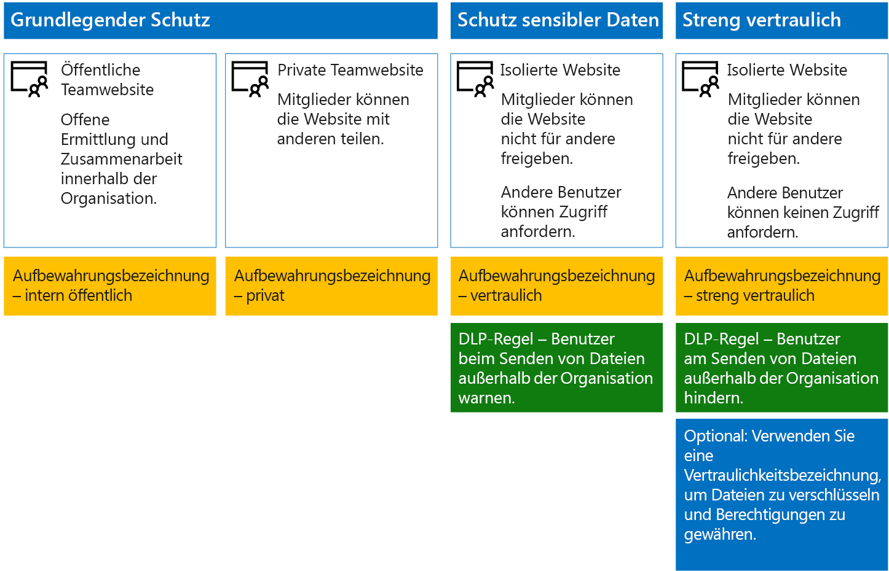
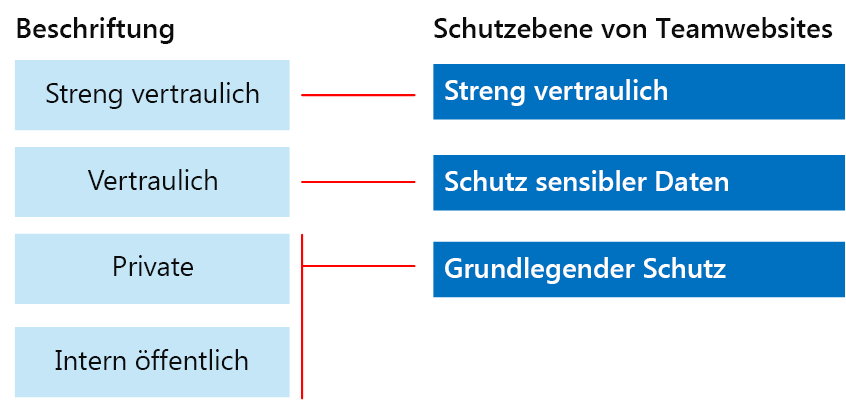

# Sichern von SharePoint Online-Websites und -Dateien

 **Zusammenfassung:** Konfigurationsempfehlungen für den Schutz von Dateien in SharePoint Online und Office 365.
  
Dieser Artikel enthält Empfehlungen, wie Sie SharePoint Online-Teamwebsites und den Dateischutz so konfigurieren, dass sowohl Sicherheit als auch einfache Zusammenarbeit sichergestellt sind. In diesem Artikel werden vier verschiedene Konfigurationen definiert, beginnend mit einer öffentlichen Website in Ihrer Organisation mit sehr offenen Freigaberichtlinien. Mit jeder weiteren Konfiguration wird der Schutz jeweils erheblich verbessert, gleichzeitig wird aber auch der Zugriff und die Zusammenarbeit auf die für die Benutzer relevanten Ressourcen eingeschränkt. Verwenden Sie diese Empfehlungen als Ausgangspunkt, und passen Sie die Konfigurationen entsprechend den Bedürfnissen Ihrer Organisation an. 
  
Die Konfigurationen in diesem Artikel sind auf die Microsoft-Empfehlungen für drei Schutzebenen für Daten, Identitäten und Geräte ausgerichtet:
  
- Grundlegender Schutz
    
- Schutz sensibler Daten
    
- Schutz von streng vertraulichen Daten
    
Weitere Informationen zu diesen Ebenen und Funktionen, die für jede Ebene empfohlen werden, finden Sie in den folgenden Ressourcen: 
  
- [Identität- und Geräteschutz für Office 365](https://docs.microsoft.com/office365/enterprise/microsoft-cloud-it-architecture-resources#BKMK_O365IDP)
    
- [Lösungen zum Schutz von Dateien in Office 365](https://docs.microsoft.com/office365/enterprise/microsoft-cloud-it-architecture-resources#BKMK_O365fileprotect)
    
## Funktionsübersicht

Empfehlungen für SharePoint Online-Teamwebsites greifen auf eine Vielzahl von Microsoft 365-Funktionen zurück. Die folgende Abbildung zeigt die empfohlenen Konfigurationen für vier SharePoint Online-Teamwebsites.

Erläuterung der Abbildung:
  
- Basisschutz umfasst zwei Optionen für SharePoint Online-Teamwebsites: eine öffentliche Website und eine private Website. Öffentliche Websites können von allen Benutzern in einer Organisation ermittelt werden, und alle haben Zugriff darauf. Private Websites können nur von Mitgliedern der Website ermittelt werden, und nur diese haben Zugriff darauf. Beide Websitekonfigurationen lassen die Freigabe für Personen außerhalb der Gruppe zu. 
    
- Websites mit der Schutzebene „Sensibel“ und „Streng vertraulich“ sind private Websites, bei denen der Zugriff auf Mitglieder bestimmter Gruppen beschränkt ist.
    
- [Aufbewahrungsbezeichnungen](labels.md) bieten eine Möglichkeit, Dateien innerhalb von Websites zu klassifizieren. Jede der SharePoint Online-Teamwebsites wird so konfiguriert, dass die Dateien in Dokumentbibliotheken automatisch mit einer standardmäßigen Aufbewahrungsbezeichnung für die Website versehen werden. Entsprechend den vier Websitekonfigurationen, sind die Bezeichnungen in diesem Beispiel „Intern Öffentlich“, „Privat Vertraulich“ und „Streng Vertraulich“. Benutzer können die Bezeichnungen ändern, aber diese Konfiguration sorgt dafür, dass alle Dateien eine Standardbezeichnung erhalten.
    
- [Richtlinien zur Verhinderung von Datenverlust](data-loss-prevention-policies.md) sind für die Aufbewahrungsbezeichnungen „Sensibel“ und „Streng vertraulich“ konfiguriert, um Benutzer zu warnen oder daran zu hindern, diese Dateitypen außerhalb der Organisation zu senden.
    
- Falls dies für Ihr Szenario nötig sein sollte, können Sie [Vertraulichkeitsbezeichnungen](sensitivity-labels.md) verwenden, um streng vertrauliche Dateien mit Verschlüsselung und Berechtigungen zu schützen. Azure Information Protection-Kunden können Ihre Azure Information Protection-Bezeichnungen im Microsoft 365 Compliance Center verwenden, damit Ihre Bezeichnungen mit dem Azure-Portal synchronisiert werden, falls Sie eine zusätzliche oder erweiterte Konfiguration ausgewählt haben. Azure Information Protection-Bezeichnungen und Office 365-Vertraulichkeitsbezeichnungen sind miteinander vollständig kompatibel. Dies bedeutet z. B., wenn Sie Inhalte mit Azure Information Protection gekennzeichnet haben, müssen Sie Ihre Inhalte nicht klassifizieren oder neu bezeichnen. Nicht alle Kunden benötigen diese Schutzstufe. 
    
## Mandantenweite Einstellungen für SharePoint Online und OneDrive for Business

SharePoint Online und OneDrive for Business enthalten mandantenweite Einstellungen, die alle Websites und Benutzer betreffen. Einige dieser Einstellungen können auch auf Websiteebene angepasst werden, um sie restriktiver (aber nicht weniger restriktiv) zu machen. In diesem Abschnitt werden mandantenweite Einstellungen beschrieben, die sich auf Sicherheit und Zusammenarbeit auswirken. 
  
### Freigabe

Für diese Lösung empfehlen wir die folgenden mandantenweiten Einstellungen:
  
- Behalten Sie die Standardfreigaberichtlinie bei, die alle Freigabetypen für alle Arten von Konten zulässt, einschließlich der anonymen Freigabe.
    
- Festlegen eines Ablaufdatums für anonyme Links, falls gewünscht.
    
- Ändern des Standardlinktyps für die Freigabe in „Intern“. Dies verhindert versehentliche Datenlecks außerhalb Ihrer Organisation.
    
Das Zulassen der externe Freigabe mag zwar kontraintuitiv erscheinen, dennoch bietet dieser Ansatz mehr Kontrolle über die Dateifreigabe als das Senden von Dateien per E-Mail. SharePoint Online und Outlook arbeiten zusammen, um eine sichere Zusammenarbeit an Dateien zu ermöglichen. 
  
- Standardmäßig gibt Outlook einen Link zu einer Datei frei, anstatt die Datei per E-Mail zu senden. 
    
- SharePoint Online und OneDrive for Business erleichtern das Freigeben von Links zu Dateien für Mitwirkende sowohl innerhalb als auch außerhalb Ihrer Organisation.
    
Außerdem stehen Ihnen Kontrollfunktionen zur Verfügung, mit denen Sie die externe Freigabe steuern können. Sie verfügen beispielsweise über folgende Möglichkeiten:
  
- Deaktivieren eines anonymen Gastlinks
    
- Widerrufen des Benutzerzugriffs auf eine Website.
    
- Anzeigen lassen, wer Zugriff auf eine bestimmte Website oder ein Dokument hat.
    
- Festlegen eines Ablaufdatums für anonyme Freigabelinks (Mandanteneinstellung).
    
- Einschränken, wer außerhalb Ihrer Organisation zur Freigabe berechtigt ist (Mandanteneinstellung).
    
### Verwenden von externer Freigabe zusammen mit Verhinderung von Datenverlust (DLP)

Wenn Sie die externe Freigabe nicht zulassen, stehen Benutzern mit einer Geschäftsanforderung alternative Tools und Methoden zur Verfügung. Microsoft empfiehlt, die externe Freigabe mit DLP-Richtlinien zu kombinieren, um sensible und streng vertrauliche Dateien zu schützen.
  
### Gerätezugriffseinstellungen

In den Gerätezugriffseinstellungen für SharePoint Online und OneDrive for Business können Sie bestimmen, ob der Zugriff auf den Browser beschränkt ist (es können keine Dateien heruntergeladen werden) oder ob der Zugriff vollständig blockiert ist. Weitere Informationen finden Sie unter [Steuern des Zugriffs von nicht verwalteten Geräten](https://docs.microsoft.com/de-DE/sharepoint/control-access-from-unmanaged-devices). 

Wenn Sie Gerätezugriffseinstellungen mit empfohlenen bedingten Zugriffsrichtlinien in Azure Active Directory verwenden möchten, finden Sie unter [Richtlinienempfehlungen zum Schutz von SharePoint-Websites und -Dateien](https://docs.microsoft.com/de-DE/microsoft-365/enterprise/sharepoint-file-access-policies) weitere Informationen.
  
### OneDrive for Business

Besuchen Sie diese Einstellungen, um zu entscheiden, ob Sie die Standardeinstellungen für OneDrive for Business-Websites ändern möchten. Aktuell werden die Freigabe- und Gerätezugriffseinstellungen aus dem SharePoint Online Admin Center dupliziert und gelten für beide Umgebungen.
  
## Konfiguration von SharePoint-Teamwebsites

In der folgenden Tabelle wird die Konfiguration für jede der zuvor in diesem Artikel beschriebenen Teamwebsites zusammengefasst. Verwenden Sie diese Konfigurationen als Ausgangsempfehlungen, und passen Sie die Websitetypen und Konfigurationen entsprechend den Bedürfnissen Ihrer Organisation an. Nicht jede Organisation benötigt jeden Websitetyp. Nur eine kleine Anzahl von Organisationen erfordert die Schutzebene „streng vertraulich“.
  
||||||
|:-----|:-----|:-----|:-----|:-----|
||**Basisschutz 1**   |**Grundlegender Schutz #2**   |**Schutz sensibler Daten**   |**Streng vertraulich**   |
|Beschreibung    |Offene Ermittlung und Zusammenarbeit innerhalb der Organisation.    |Private Website und Gruppe, Freigabe außerhalb der Gruppe zulässig.    |Isolierte Website, für die Zugriffsebenen durch Mitgliedschaft in bestimmten Gruppen definiert sind. Die Freigabe ist nur für Mitglieder dieser Website zulässig. Die DLP warnt Benutzer bei dem Versuch, Dateien außerhalb der Organisation zu senden.    |Isolierte Website + Dateiverschlüsselung und Berechtigungen mit Azure Information Protection. Die DLP verhindert, dass Benutzer Dateien außerhalb der Organisation senden.    |
|Private oder öffentliche Teamwebsite    |Public (Öffentlich)    |Private    |Private    |Private    |
|Wer hat Zugriff?    |Alle Benutzer in der Organisation, einschließlich der B2B-Benutzer und Gastbenutzer.    |Nur Mitglieder der Website. Andere Personen können den Zugriff anfordern.    |Nur Mitglieder der Website. Andere Personen können Zugriff anfordern.    |Nur Mitglieder. Andere Personen können keinen Zugriff anfordern.    |
|Freigabekontrollen auf Websiteebene    |Freigabe mit jeder beliebigen Person zulässig. Standardeinstellungen.    |Freigabe für beliebige Personen zulässig. Standardeinstellungen.    |Mitglieder können den Zugriff auf die Website nicht freigeben.    Nichtmitglieder können den Zugriff auf die Website anfordern, aber diese Anforderungen müssen von einem Websiteadministrator bearbeitet werden.    |Mitglieder können den Zugriff auf die Website nicht freigeben.    Nichtmitglieder können den Zugriff auf die Website oder die Inhalte nicht anfordern.    |
|Gerätezugriffssteuerungen auf Websiteebene    |Keine zusätzlichen Steuerelemente.    |Keine zusätzlichen Steuerelemente.    |Verhindert, dass Benutzer Dateien auf nicht kompatible oder nicht der Domäne beigetretene Geräte herunterladen. Alle anderen Geräte erhalten nur Browserzugriff.    |Blockieren des Downloads von Dateien auf nicht kompatible oder nicht der Domäne beigetretene Geräte.    |
|Aufbewahrungsbezeichnungen    |Intern öffentlich    |Private    |Vertraulich    |Streng vertraulich    |
|DLP-Richtlinien    |||Warnen Benutzer beim Senden von Dateien mit der Bezeichnung „Vertraulich“ außerhalb der Organisation.    Um die externe Freigabe von sensiblen Datentypen wie z. B. Kreditkartennummern oder anderen persönlichen Daten zu blockieren, können Sie zusätzliche DLP-Richtlinien für diese Datentypen konfigurieren (einschließlich benutzerdefinierter Datentypen, die Sie selbst konfigurieren).    |Benutzer werden daran gehindert, Dateien mit der Bezeichnung „Streng vertraulich“ an Empfänger außerhalb der Organisation zu senden. Sie können es Benutzern ermöglichen, dies durch Angabe einer Rechtfertigung zu überschreiben, einschließlich der Person, für die sie die Datei freigeben.    |
|Vertraulichkeitsbezeichnungen    ||||Verwenden Sie Vertraulichkeitsbezeichnungen, um Dateien automatisch zu verschlüsseln und Berechtigungen für Dateien zu erteilen. Vertraulichkeitsbezeichnungen verwenden Azure Information Protection zur Verschlüsselung von Dateien. Dieser Schutz ist mit den Dateien verbunden, für den Fall, dass sie kompromittiert werden.    Office 365 kann keine Dateien lesen, die mit Azure Information Protection verschlüsselt wurden. Darüber hinaus können DLP-Richtlinien nur auf die Metadaten (einschließlich Bezeichnungen) angewendet werden, aber nicht auf den Inhalt dieser Dateien (z. B. Kreditkartennummern in Dateien).    |
   
Die einzelnen Schritte zum Bereitstellen der vier verschiedenen Typen von SharePoint Online-Teamwebsites in dieser Lösung finden Sie unter [Bereitstellen von SharePoint Online-Websites für den Schutz auf drei Ebenen](deploy-sharepoint-online-sites-for-three-tiers-of-protection.md). 
  
## Office 365-Aufbewahrungsbezeichnungen

Das Verwenden von Aufbewahrungsbezeichnungen wird für Umgebungen mit vertraulichen Daten empfohlen. Nachdem Sie Aufbewahrungsbezeichnungen konfiguriert und bereitgestellt haben, haben Sie folgende Möglichkeiten:
  
- Sie können eine Standardbezeichnung auf eine Dokumentbibliothek in einer SharePoint Online-Teamwebsite anwenden, sodass alle Dokumente in dieser Bibliothek mit der Standardbezeichnung versehen werden. 
    
- Sie können Bezeichnungen automatisch auf Inhalt anwenden, wenn er bestimmten Bedingungen entspricht.
    
- Sie können DLP-Richtlinien anwenden, die auf Aufbewahrungsbezeichnungen basieren.
    
- Personen in Ihrer Organisation können eine Bezeichnung manuell auf Inhalte in Outlook im Web, Outlook 2010 und höher, OneDrive for Business, SharePoint Online und Office 365-Gruppen anwenden. Benutzer wissen häufig am besten, mit welcher Art von Inhalten sie arbeiten, sodass sie sie klassifizieren und die entsprechende DLP-Richtlinie anwenden lassen können.
    

  
Wie dargestellt, umfasst diese Lösung die Erstellung der folgenden Aufbewahrungsbezeichnungen:
  
- Streng vertraulich
    
- Vertraulich
    
- Private
    
- Intern öffentlich
    
Die Bezeichnungen sind den empfohlenen Websites in den Abbildungen und Diagrammen weiter oben in diesem Artikel zugeordnet. Diese Lösung empfiehlt die Konfiguration von DLP-Richtlinien, um Informationslecks bei Dateien zu verhindern, die als sensibel oder streng vertraulich klassifiziert sind.
  
Die Schritte zum Konfigurieren von Aufbewahrungsbezeichnungen und DLP-Richtlinien in dieser Lösung finden Sie unter [Schützen von SharePoint Online-Dateien mit Aufbewahrungsbezeichnungen und DLP](protect-sharepoint-online-files-with-office-365-labels-and-dlp.md).
  
## Vertraulichkeitsbezeichnungen 

Falls dies für Ihr Sicherheitsszenario notwendig sein sollte, können Sie Vertraulichkeitsbezeichnungen verwenden, um Schutzfunktionen anzuwenden, die die Dateien immer und überall begleiten. Vertraulichkeitsbezeichnungen im Microsoft 365 Compliance Center und Azure Information Protection-Bezeichnungen sind identisch. Für diese Lösung empfehlen wir, dass Sie eine bereichsbezogene Azure Information Protection-Richtlinie und eine Unterbezeichnung der Bezeichnung „Streng Vertraulich“ verwenden, um Dateien, die der höchsten Schutzebene bedürfen, zu verschlüsseln und Berechtigungen für diese zu erteilen. 
  
Bedenken Sie Folgendes: Wenn Azure Information Protection-Verschlüsselung auf in Office 365 gespeicherte Dateien angewendet wird, kann der Dienst den Inhalt dieser Dateien nicht verarbeiten. Gemeinsame Dokumenterstellung, eDiscovery, Suche, Delve und andere Features für die Zusammenarbeit funktionieren nicht. DLP-Richtlinien können nur mit den Metadaten (einschließlich Aufbewahrungsbezeichnungen) funktionieren, aber nicht mit den Inhalten dieser Dateien (wie Kreditkartennummern in Dateien).

Weitere Informationen finden Sie unter [Übersicht über Vertraulichkeitsbezeichnungen](sensitivity-labels.md).

    
### Hinzufügen von Berechtigungen für externe Benutzer

Es gibt zwei Möglichkeiten, wie Sie externen Benutzern Zugriff auf Dateien gewähren können, die mit Azure Information Protection geschützt sind. In beiden Fällen benötigen die externen Benutzer ein Azure AD-Konto. Wenn externe Benutzer kein Mitglied einer Organisation sind, die Azure Active Directory verwendet, können sie auf dieser Registrierungsseite ein Azure AD-Konto als Einzelperson beantragen: [https://aka.ms/aip-signup](https://aka.ms/aip-signup).
  
- Hinzufügen von externen Benutzern zu einer Azure AD-Gruppe, die zum Konfigurieren des Schutzes für eine Bezeichnung verwendet wird
    
     Sie müssen zuerst das Konto als B2B-Benutzer in Ihrem Verzeichnis hinzufügen. Das [Zwischenspeichern der Gruppenmitgliedschaft durch Azure Rights Management](https://docs.microsoft.com/information-protection/plan-design/prepare#group-membership-caching-by-azure-rights-management) kann einige Stunden dauern. Bei dieser Methode werden Berechtigungen für alle vorhandenen Dateien erteilt, die mit der Bezeichnung geschützt sind (sogar Dateien, die geschützt wurden, bevor ein Benutzer der Azure AD-Gruppe hinzugefügt wird).
    
- Direktes Hinzufügen von externen Benutzern zum Bezeichnungsschutz
    
     Sie können alle Benutzer aus einer Organisation (z. B. „Fabrikam.com“), eine Azure AD-Gruppe (z. B. eine Finanzgruppe innerhalb einer Organisation) oder einen einzelnen Benutzer hinzufügen. Beispielsweise können Sie ein externes Team von Aufsichtsbeamten zum Schutz für eine Bezeichnung hinzufügen. Bei dieser Methode werden Berechtigungen für Dateien, die mit der Bezeichnung geschützt sind, erst erteilt, nachdem die externe Entität dem Schutz hinzugefügt wurde.
    
### Bereitstellen und Verwenden von Azure Information Protection

Die Schritte zum Konfigurieren von Azure Information Protection in dieser Lösung finden Sie unter [Schützen von SharePoint Online-Dateien mit Azure Information Protection](protect-sharepoint-online-files-with-azure-information-protection.md).
  
## Siehe auch

[Microsoft-Sicherheitsleitfaden für politische Kampagnen, gemeinnützigen Organisationen und andere agile Organisationen](microsoft-security-guidance-for-political-campaigns-nonprofits-and-other-agile-o.md)
  
[Cloudakzeptanz und Hybridlösungen](https://docs.microsoft.com/office365/enterprise/cloud-adoption-and-hybrid-solutions)
  
