# Übersicht über Vertraulichkeitsbezeichnungen

Im Rahmen ihrer Arbeit müssen Personen in Ihrer Organisation mit anderen Personen innerhalb und außerhalb der Organisation zusammenarbeiten. Dies bedeutet, dass Inhalte nicht mehr durch eine Firewall geschützt sind – sie werden zwischen verschiedenen Geräten, Apps und Diensten hin und her bewegt. Dies soll auf sichere und geschützte Weise geschehen, die den geschäftlichen Anforderungen und Compliancerichtlinien Ihrer Organisation entspricht.

Mit Vertraulichkeitsbezeichnungen in Office 365 können Sie Ihre vertraulichen Inhalte klassifizieren und schützen, ohne dass die Produktivität Ihrer Mitarbeiter und deren Fähigkeit zur Zusammenarbeit behindert wird.

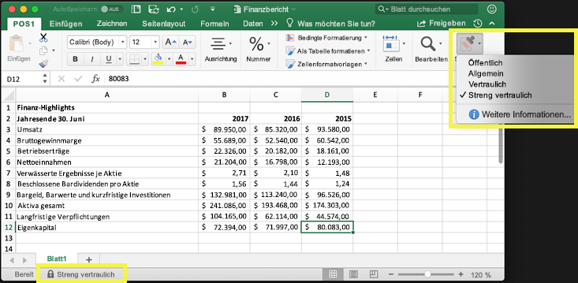

Sie können Vertraulichkeitsbezeichnungen zu Folgendem verwenden:
  
- **Erzwingen von Schutzeinstellungen wie Verschlüsselung oder Wasserzeichen für bezeichnete Inhalte.** Z. B. können die Benutzer eine Vertraulichkeitsbezeichnung auf ein Dokument oder eine E-Mail anwenden, und durch diese Bezeichnung kann der Inhalt verschlüsselt und ein Vertraulichkeitswasserzeichen angewendet werden.    

- **Schützen von Inhalten in Office-Apps auf verschiedenen Plattformen und Geräten.** Vertraulichkeitsbezeichnungen funktionieren in Office-Apps unter Windows, Mac, iOS und Android. Unterstützung für Office Web Apps wird in Kürze verfügbar sein.
    
- **Verhindern, dass vertrauliche Inhalte Ihre Organisation auf Geräten unter Windows verlassen**, mithilfe von Microsoft Intune Endpoint Protection. Nachdem eine Vertraulichkeitsbezeichnung auf Inhalte auf einem Windows-Gerät angewendet wurde, kann Endpoint Protection verhindern, dass diese Inhalte in eine Drittanbieter-App, z. B. Twitter oder Gmail, oder auf Wechselmedien, z. B. ein USB-Laufwerk, kopiert werden.

- **Erweitern von Vertraulichkeitsbezeichnungen auf Drittanbieter-Apps und -Dienste.** Mit dem Microsoft Information Protection SDK können Drittanbieter-Apps unter Windows, Mac und Linux Vertraulichkeitsbezeichnungen lesen und Schutzeinstellungen anwenden. Unterstützung für Apps unter iOS und Android wird in Kürze verfügbar sein.

- **Klassifizieren von Inhalten ohne Verwendung von Schutzeinstellungen.** Sie können Inhalten auch einfach eine Klassifizierung zuweisen (wie einen Aufkleber), die erhalten bleibt und mit dem Inhalt bewegt wird, wenn er verwendet und freigegeben wird. Mit dieser Klassifizierung können Sie Verwendungsberichte generieren und Aktivitätsdaten für Ihre vertraulichen Inhalte anzeigen. Basierend auf diesen Informationen können Sie später jederzeit auswählen, dass Schutzeinstellungen angewendet werden sollen.
    
In all diesen Fällen können Vertraulichkeitsbezeichnungen in Office 365 Ihnen dabei helfen, die richtigen Maßnahmen für die entsprechenden Inhalte zu treffen. Mit Vertraulichkeitsbezeichnungen können Sie Daten organisationsweit klassifizieren und Schutzeinstellungen basierend auf dieser Klassifizierung durchsetzen.
  
Sie erstellen Vertraulichkeitsbezeichnungen im Office 365 Security &amp; Compliance Center. Das Security & Compliance Center ist jetzt der zentrale Ort, um Vertraulichkeitsbezeichnungen und Richtlinien für Azure Information Protection und Office 365 zu konfigurieren. Diese Vertraulichkeitsbezeichnungen können von Azure Information Protection, Office-Apps und Office 365-Diensten verwendet werden.

Für Azure Information Protection-Kunden können Sie Ihre Azure Information Protection-Bezeichnungen im Security & Compliance Center verwenden. Ihre Bezeichnungen werden dann mit dem Azure-Portal synchronisiert, falls Sie eine zusätzliche oder erweiterte Konfiguration ausführen möchten. **Azure Information Protection-Bezeichnungen und Office 365-Vertraulichkeitsbezeichnungen sind miteinander kompatibel.** Dies bedeutet, dass Sie ggf. Inhalte mit Bezeichnungen von Azure Information Protection nicht erneut klassifizieren oder mit Bezeichnungen versehen müssen.

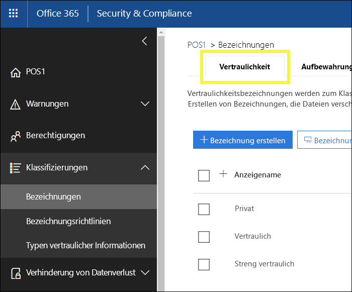

## Bedeutung von Vertraulichkeitsbezeichnungen

Wenn Sie einem Dokument oder einer E-Mail eine Vertraulichkeitsbezeichnung zuweisen, hat diese ähnliche Eigenschaften wie ein Tag:

- **Anpassbar.** Sie können Kategorien für unterschiedliche Stufen vertraulicher Inhalte in Ihrer Organisation erstellen, z. B. Privat, Öffentlich, Allgemein, Vertraulich und Streng vertraulich.

- **Klartext.** Da die Beschriftung aus Klartext besteht, ist sie für Drittanbieter-Apps und -Dienste verfügbar, um Schutzmaßnahmen auf mit Bezeichnungen versehene Inhalte anzuwenden.

- **Beständig.** Nachdem eine Vertraulichkeitsbezeichnung auf Inhalte angewendet wurde, bleibt diese in den Metadaten der E-Mail oder des Dokuments erhalten. Dies bedeutet, dass die Bezeichnung einschließlich der Schutzeinstellungen mit dem Inhalt bewegt wird und zur Basis für die Anwendung und Durchsetzung von Richtlinien wird.

In den Office-Apps wird eine Vertraulichkeitsbezeichnung einfach als Tag für eine E-Mail oder ein Dokument angezeigt.

Jedem Inhaltselement kann eine Vertraulichkeitsbezeichnung zugewiesen werden. Beachten Sie jedoch, dass auf ein Element sowohl eine einzelne Vertraulichkeitsbezeichnung als auch eine einzelne [Aufbewahrungsbezeichnung](labels.md) angewendet werden kann.

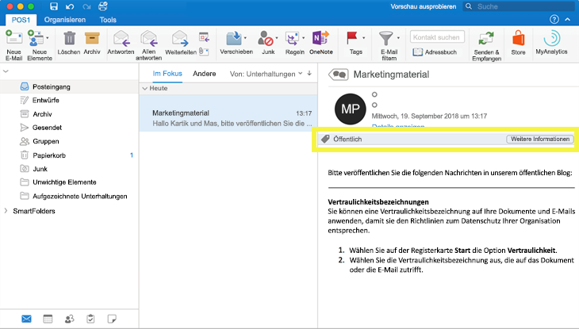

## Wirkung von Vertraulichkeitsbezeichnungen

Nachdem eine Vertraulichkeitsbezeichnung auf eine E-Mail oder ein Dokument angewendet wurde, werden die Schutzeinstellungen für diese Bezeichnung auf den Inhalt erzwungen. Mit einer Vertraulichkeitsbezeichnung können Sie folgende Aktionen auslösen:

- **Verschlüsseln** von E-Mails oder von E-Mails und Dokumenten. Sie können auswählen, welche Benutzer oder Gruppen zu welchen Aktionen berechtigt sind und wie lange. Beispielsweise können Sie auswählen, dass Benutzer in einer bestimmten Domäne außerhalb Ihrer Organisation für nur sieben Tage, nachdem die Inhalte bezeichnet wurden, zum Überprüfen des Inhalts berechtigt sind.

- **Markieren Sie den Inhalt** durch Hinzufügen von benutzerdefinierten Wasserzeichen, Kopf- oder Fußzeilen für E-Mails oder Dokumente, die die Bezeichnung angewendet haben. Beachten Sie, dass Wasserzeichen nur auf Dokumente, und nicht auf E-Mails angewendet werden können, und auf 255 Zeichen beschränkt sind. Außerdem sind Kopf- und Fußzeilen auf 1024 Zeichen beschränkt (außer in Excel, wo sie auf 255 Zeichen oder weniger beschränkt sind. Dies ist davon abhängig, ob das Dokument andere Kopf- oder Fußzeilen enthält, bzw. von anderen Faktoren abhängig.)

    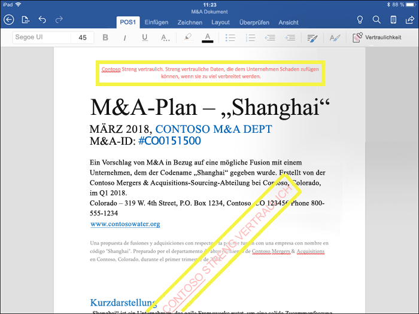

- 
  **Verhindern von Datenverlust** durch Aktivieren von Endpoint Protection in Intune. Wenn vertrauliche Inhalte heruntergeladen werden, können Sie dazu beitragen, den Verlust von Daten von Windows-Geräten zu vermeiden. Sie können bezeichnete Inhalte z. B. nicht in Dropbox, Gmail oder auf ein USB-Laufwerk kopieren. Damit die Vertraulichkeitsbezeichnungen Windows Information Protection (WIP) verwenden können, müssen Sie zuerst eine App-Schutzrichtlinie im Azure-Portal erstellen. Weitere Informationen finden Sie unter [Wie Windows Information Protection Dateien mit einer Vertraulichkeitsbezeichnung schützt](https://docs.microsoft.com/en-us/windows/security/information-protection/windows-information-protection/how-wip-works-with-labels?branch=vsts17546553).

Alle diese Optionen sind verfügbar, wenn Sie eine Bezeichnung im Security & Compliance Center erstellen.

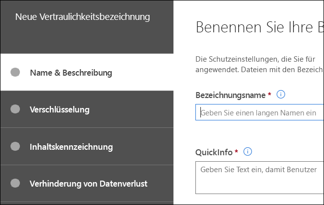

### Priorität der Bezeichnungen (Reihenfolge wesentlich)

Wenn Sie die Vertraulichkeitsbezeichnungen im Security & Compliance Center erstellen, werden sie in einer Liste auf der Registerkarte **Vertraulichkeit** auf der Seite **Bezeichnungen** angezeigt. In dieser Liste ist die Reihenfolge der Bezeichnungen wichtig, da sie ihrer Priorität entspricht. Ihre restriktivste Vertraulichkeitsbezeichnung, z. B. Streng vertraulich, soll **am Ende** der Liste und Ihre am wenigsten restriktive Vertraulichkeitsbezeichnung, z. B. Öffentlich, **am Anfang** stehen.

Einem Dokument oder einer E-Mail kann nur eine einzelne Vertraulichkeitsbezeichnung zugewiesen werden. Wenn Ihre Benutzer eine Begründung für eine Änderung der Bezeichnung in eine niedrigere Klassifizierung angeben müssen, bestimmt die Reihenfolge dieser Liste, was eine niedrigere Klassifizierung ist.

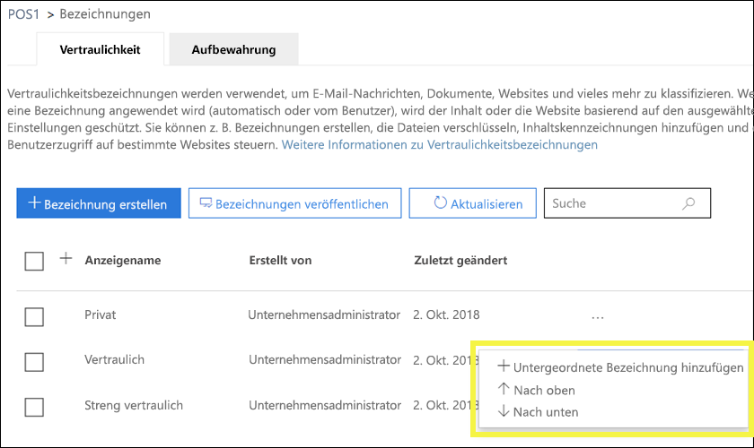

### Unterbezeichnungen (Gruppierungsbezeichnungen)

Mit Unterbezeichnungen können Sie Bezeichnungen unter einer Überschrift zusammenfassen, die einem Benutzer in einer Office-App angezeigt wird. Beispielsweise kann Ihre Organisation unter „Vertraulich“ mehrere verschiedene Bezeichnungen für bestimmte Typen dieser Klassifizierung verwenden. In diesem Beispiel ist die Bezeichnung „Vertraulich“ einfach eine textuelle Bezeichnung ohne Schutzeinstellungen. Da sie Unterbezeichnungen beinhaltet, kann sie nicht auf Inhalte angewendet werden. Stattdessen müssen Benutzer zum Anzeigen der Unterbezeichnungen „Vertraulich“ auswählen. Anschließend können sie eine Unterbezeichnung auswählen, um sie auf Inhalte anzuwenden.

Unterbezeichnungen sind einfach eine Möglichkeit, Benutzern Bezeichnungen in logischen Gruppen zu präsentieren. Unterbezeichnungen erben keine Einstellungen von der Bezeichnung, der sie untergeordnet sind.

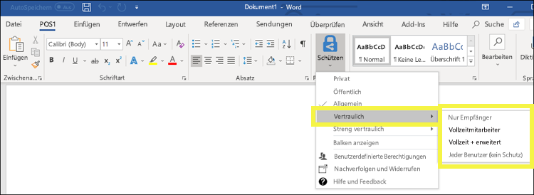

### Bearbeiten oder Löschen einer Vertraulichkeitsbezeichnung

Beachten Sie, dass beim Löschen einer Vertraulichkeitsbezeichnung im Security & Compliance Center die Bezeichnung nicht vom Inhalt entfernt wird und alle Schutzeinstellungen weiterhin für den Inhalt erzwungen werden.

Wenn Sie eine Vertraulichkeitsbezeichnung im Security & Compliance Center bearbeiten, wird die Version der Bezeichnung, die auf Inhalte angewendet wurde, für diese Inhalte erzwungen.

## Wirkung von Bezeichnungsrichtlinien

Nachdem Sie die Vertraulichkeitsbezeichnungen erstellt haben, müssen Sie sie veröffentlichen, um sie für Personen in Ihrer Organisation zur Anwendung auf Inhalte bereitzustellen. Im Gegensatz zu Aufbewahrungsbezeichnungen, die für Speicherorte, z. B. alle Exchange-Postfächer, veröffentlicht werden, werden Vertraulichkeitsbezeichnungen für Benutzer oder Gruppen veröffentlicht. Vertraulichkeitsbezeichnungen werden dann in Office-Apps für diese Benutzer und Gruppen angezeigt.

Mit einer Bezeichnungsrichtlinie können Sie Folgendes bewirken:

- **Auswählen, welchen Benutzern und Gruppen die Bezeichnungen angezeigt werden.** Bezeichnungen können für E-Mail-aktivierte Sicherheitsgruppen, Verteilergruppen, Office 365-Gruppen oder dynamische Verteilergruppen veröffentlicht werden.

- **Anwenden einer Standardbezeichnung** auf alle neuen Dokumente und E-Mails, die von den in der Bezeichnungsrichtlinie enthaltenen Benutzern und Gruppen erstellt werden. Durch diese Standardbezeichnung kann eine Basisstufe an Schutzeinstellungen festgelegt werden, die auf alle Ihre Inhalte angewendet werden soll.

- **Anfordern einer Begründung für die Änderung einer Bezeichnung.** Wenn Inhalt als vertraulich markiert ist und ein Benutzer diese Bezeichnung entfernen oder durch eine niedrigere Klassifizierung, z. B. „Öffentlich“, ersetzen möchte, können Sie anfordern, dass der Benutzer eine Begründung für die Aktion angibt. Diese Begründungen sind dann für den Administrator zur Überprüfung verfügbar. Ein Bericht, in dem Administratoren die Begründungen der Benutzer anzeigen können, befindet sich in Entwicklung.

    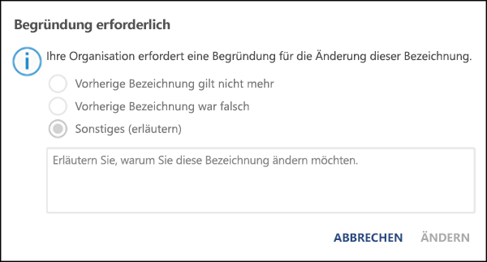

- **Bereitstellen eines Links zu einer benutzerdefinierten Hilfeseite.** Wenn Ihre Benutzer nicht genau wissen, was Vertraulichkeitsbezeichnungen bedeuten oder wie sie verwendet werden sollten, können Sie eine URL zu weiteren Informationen angeben, die unten im Menü der Vertraulichkeitsbezeichnungen in den Office-Apps angezeigt wird.

    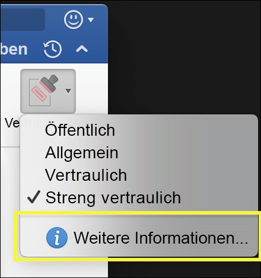

Nachdem Sie eine Bezeichnungsrichtlinie erstellt und Benutzern und Gruppen Vertraulichkeitsbezeichnungen zugewiesen haben, werden die Bezeichnungen diesen Personen innerhalb einer Stunde oder weniger in den Office-Apps angezeigt.

## Erste Schritte

Die ersten Schritte mit Vertraulichkeitsbezeichnungen sind einfach:

1. **Definieren Sie die Bezeichnungen.** Zuerst sollten Sie Ihre Taxonomie für die Definition unterschiedlicher Grade an vertraulichen Inhalten definieren. Verwenden Sie allgemeine Namen oder Ausdrücke, die für die Benutzer sinnvoll sind. Sie können z. B. mit Beschriftungen wie Privat, Öffentlich, Allgemein, Vertraulich und Streng vertraulich beginnen. Mit Unterbezeichnungen können Sie ähnliche Bezeichnungen nach Kategorien gruppieren. Zusätzlich müssen Sie beim Erstellen einer Bezeichnung eine QuickInfo angeben, die in den Office-Apps angezeigt wird, wenn ein Benutzer die Maus über eine Bezeichnung im Menüband bewegt.

1. **Definieren Sie, was die einzelnen Bezeichnungen bewirken.** Konfigurieren Sie dann die Schutzeinstellungen, die den Bezeichnungen zugeordnet werden sollen. Auf Inhalt mit niedriger Vertraulichkeit (Bezeichnung „Allgemein“) wird beispielsweise nur eine Kopf- oder Fußzeile angewendet, während auf vertraulicheren Inhalt (Bezeichnung „Vertraulich“) ein Wasserzeichen, Verschlüsselung und WIP angewendet werden, um dafür zu sorgen, dass nur privilegierte Benutzer darauf zugreifen können.
 
1. **Definieren Sie, wer die Bezeichnungen erhält.** Nachdem Sie die Bezeichnungen Ihrer Organisation definiert haben, veröffentlichen Sie sie in einer Bezeichnungsrichtlinie, die steuert, welche Benutzer und Gruppen diese Bezeichnungen anzeigen können. Eine einzelne Bezeichnung ist wieder verwendbar – Sie definieren sie einmal und können sie dann in mehreren, unterschiedlichen Benutzern zugewiesenen Bezeichnungsrichtlinien verwenden. Doch damit eine Bezeichnung Inhalten zugewiesen werden kann, müssen Sie die Bezeichnung zuerst veröffentlichen, sodass sie in Office-Apps und anderen Diensten verfügbar ist. Für den Anfang können Sie Ihre Vertraulichkeitsbezeichnungen testen, indem Sie sie nur einigen wenigen Personen zuweisen.

Im Folgenden werden die grundlegenden Schritte des Administrators, des Benutzers und der Office-App bei der Erstellung von Vertraulichkeitsbezeichnungen beschrieben.

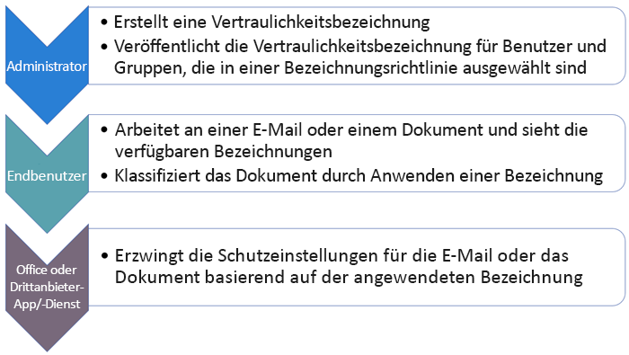

## Anzeige von Vertraulichkeitsbezeichnungen

Vertraulichkeitsbezeichnungen werden in der Benutzeroberfläche von Office-Apps angezeigt. Informationen zur aktuellen Verfügbarkeit für bestimmte Apps und Plattformen finden Sie unter **Wo ist das Feature heute verfügbar?[.

### Office-Apps unter Windows

In Office-Apps auf Geräten unter Windows werden Vertraulichkeitsbezeichnungen auf der Schaltfläche **Vertraulichkeit** auf der Registerkarte **Start** im Menüband angezeigt. Die angewendete Bezeichnung wird auch in der Statusleiste am unteren Rand des Fensters angezeigt.

Native Unterstützung für Vertraulichkeitsbezeichnungen in Office-Apps unter Windows ist in Kürze verfügbar.

Wenn Sie bereits Azure Information Protection-Kunde sind, können Sie den Azure Information Protection-Client für einheitliche Bezeichnungen bereitstellen, der Vertraulichkeitsbezeichnungen unterstützt. Weitere Informationen zum Herunterladen des Clients finden Sie unter [Azure Information Protection-Client für einheitliche Bezeichnungen: Versionshinweise](https://docs.microsoft.com/de-DE/azure/information-protection/rms-client/unifiedlabelingclient-version-release-history). Native Unterstützung für Vertraulichkeitsbezeichnungen in Office-Apps unter Windows wird derzeit entwickelt, sodass der Azure Information Protection-Client für einheitliche Bezeichnungen nicht mehr erforderlich sein wird.

### Office-Apps unter Mac

In Office-Apps auf Mac-Geräten werden Vertraulichkeitsbezeichnungen auf der Schaltfläche **Vertraulichkeit** auf der Registerkarte **Start** im Menüband angezeigt. Die angewendete Bezeichnung wird auch in der Statusleiste am unteren Rand des Fensters angezeigt.

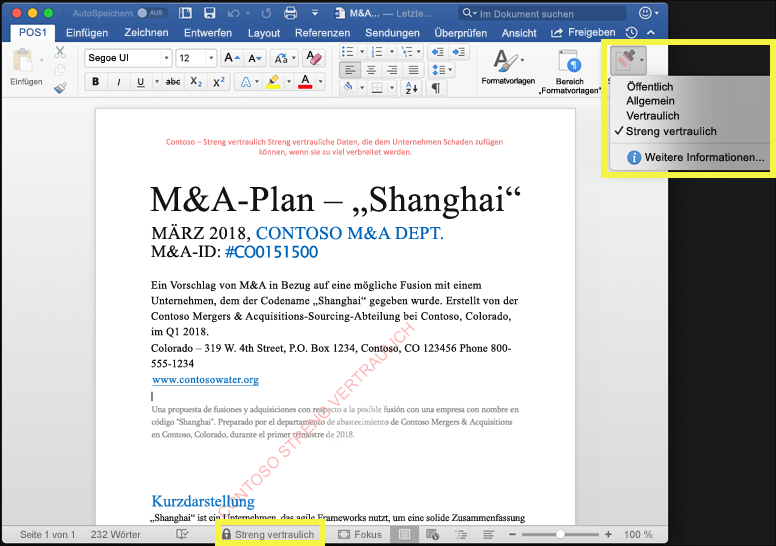

### Office-Apps unter iOS

In Office-Apps auf iOS-Geräten werden Vertraulichkeitsbezeichnungen auf der Schaltfläche **Vertraulichkeit** auf der Registerkarte **Start** im Menüband angezeigt. Die angewendete Bezeichnung wird auch in der Statusleiste am unteren Rand des Fensters angezeigt.

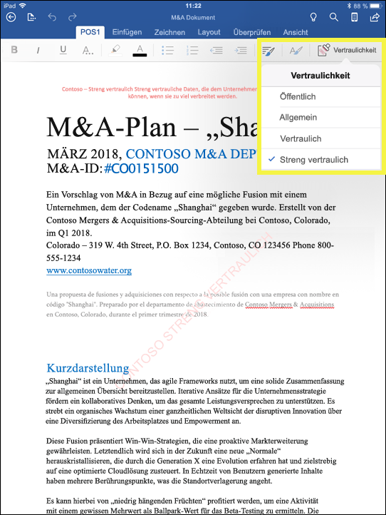

### Office-Apps unter Android

In Office-Apps auf Android-Geräten werden Vertraulichkeitsbezeichnungen auf der Schaltfläche **Vertraulichkeit** auf der Registerkarte **Start** im Menüband angezeigt. Die angewendete Bezeichnung wird auch in der Statusleiste am unteren Rand des Fensters angezeigt.

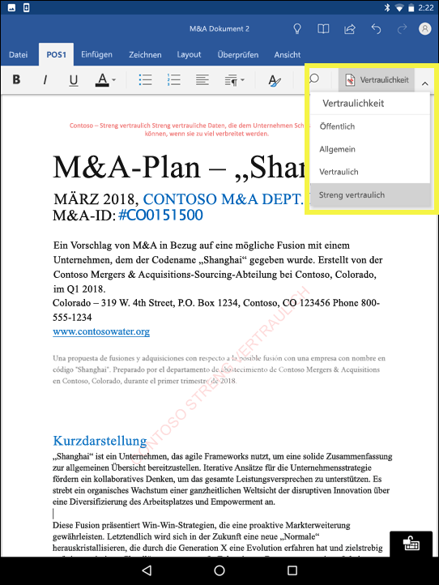

### Weitere Informationen zu Vertraulichkeitsbezeichnungen in Office-Apps

- [Anwenden von Vertraulichkeits-Beschriftungen auf Ihre Dokumente und E-Mails in Office](https://support.office.com/de-DE/article/apply-sensitivity-labels-to-your-documents-and-email-within-office-2f96e7cd-d5a4-403b-8bd7-4cc636bae0f9)
- [Bekannte Probleme beim Anwenden von Vertraulichkeits-Beschriftungen auf Ihren Office-Dateien](https://support.office.com/de-DE/article/known-issues-when-you-apply-sensitivity-labels-to-your-office-files-b169d687-2bbd-4e21-a440-7da1b2743edc)

## Funktionsweise von Vertraulichkeitsbezeichnungen zusammen mit vorhandenen Azure Information Protection-Bezeichnungen

Azure Information Protection-Benutzer können Inhalte unter Windows derzeit mit dem Azure Information Protection-Client für einheitliche Bezeichnungen klassifizieren und mit Bezeichnungen versehen. Vorhandene Azure Information Protection-Bezeichnungen arbeiten nahtlos mit neuen Vertraulichkeitsbezeichnungen zusammen. Das heißt, Sie können:

- Ihre vorhandenen Azure Information Protection-Bezeichnungen für Dokumente und E-Mails beibehalten.
- Ihre vorhandene Azure Information Protection-Bezeichnungskonfiguration beibehalten.

Wenn Sie Azure Information Protection-Bezeichnungen verwenden, sollten Sie vorerst keine neuen Kategorien im Security & Compliance Center erstellen, bis Sie die Migration abgeschlossen haben. Das [Thema zum Migrieren von Azure Information Protection](https://docs.microsoft.com/de-DE/azure/information-protection/configure-policy-migrate-labels) enthält wichtige Informationen und einige besondere Vorsichtsmaßnahmen. Wenn Sie noch nicht zum Migrieren Ihrer Produktionsmandanten zu Vertraulichkeitsbezeichnungen bereit sind, besteht kein Grund zur Sorge: Ihre Benutzer können vorläufig den Azure Information Protection-Client weiter verwenden, und Administratoren können weiterhin das Azure-Portal für die Verwaltung verwenden.

## Schützen von Inhalten auf Windows-Geräten mithilfe von Microsoft Intune Endpoint Protection

Wenn Sie eine Vertraulichkeitsbezeichnung erstellen, können Sie Windows mitteilen, dass Dateien mit dieser Bezeichnung vertraulich sind und bei Speicherung auf Windows-Geräten vor Datenverlust geschützt werden müssen. Durch diese Option kann sichergestellt werden, dass Inhalte mit dieser Bezeichnung nur an sanktionierte Speicherorte freigegeben oder kopiert werden können, auch wenn sie an einem Endpunkt gespeichert sind. Im Prinzip wird Windows durch Aktivieren dieser Option für eine Vertraulichkeitsbezeichnung mitgeteilt, dass es sich um besonders wichtige Daten handelt, was weitere Verwendungsbeschränkungen garantiert.

Wenn Sie diese Option aktivieren, kann Windows Vertraulichkeitsbezeichnungen in Dokumenten lesen, verstehen, und behandeln sowie Windows Informationen Protection (WIP) automatisch auf Inhalte anwenden, unabhängig davon, wie sie auf ein verwaltetes Windows-Gerät gelangen. Dies trägt zum Schutz von mit Bezeichnungen versehenen Dateien vor unbeabsichtigtem Zugriff, mit oder ohne Verschlüsselung bei.

Windows kann z. B. erkennen, dass einem Word-Dokument auf dem Computer eines Benutzers die Bezeichnung „Vertraulich“ zugewiesen wurde, und WIP kann eine App-Schutzrichtlinie anwenden, um das Kopieren oder Freigeben der Daten von diesem Gerät an einen beliebigen Ort außerhalb des Netzwerks (z. B. ein persönliches OneDrive, persönliche E-Mail-Konten, soziale Medien oder USB-Laufwerke) zu verhindern.

Wenn ein Benutzer versucht, mit Bezeichnungen versehene Inhalte in ein persönliches Gmail-Konto hochzuladen, wird die folgende Meldung angezeigt.

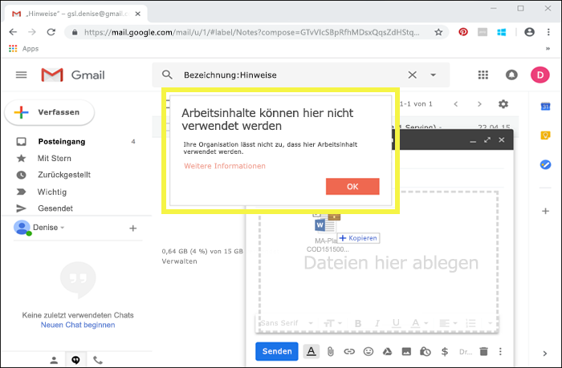

Und wenn ein Benutzer versucht, mit Bezeichnungen versehene Inhalte auf einem USB-Laufwerk zu speichern, wird die folgende Meldung angezeigt.

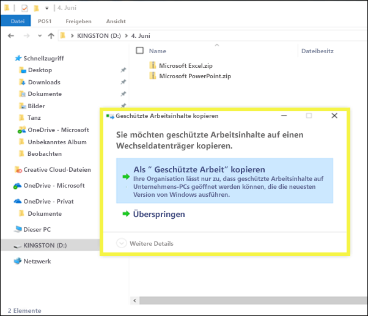

### Wichtige Voraussetzungen

Bevor die Vertraulichkeitsbezeichnungen WIP verwenden können, müssen Sie zuerst die hier beschriebenen Voraussetzungen erfüllen: [Wie Windows Information Protection Dateien mit einer Vertraulichkeitsbezeichnung schützt](https://docs.microsoft.com/en-us/windows/security/information-protection/windows-information-protection/how-wip-works-with-labels?branch=vsts17546553). In diesem Thema werden die folgenden Voraussetzungen beschrieben:

- Stellen Sie sicher, dass Windows 10, Version 1809 oder höher, ausgeführt wird.
- [Richten Sie Windows Defender Advanced Threat Protection (WDATP) ein](https://docs.microsoft.com/de-DE/windows/security/threat-protection/windows-defender-atp/get-started), wodurch Inhalte auf eine Bezeichnung überprüft werden und der entsprechenden WIP-Schutz angewendet wird. ATP führt einige Aktionen, wie das Berichten von Anomalien, unabhängig von WIP aus.
- Erstellen Sie eine WIP-Richtlinie (Windows Informationen Protection), die auf Endpunktgeräte angewendet wird:
    - [Erstellen einer WIP-Richtlinie (Windows Information Protection) mit MDM mithilfe des Azure-Portals für Microsoft Intune](https://docs.microsoft.com/de-DE/windows/security/information-protection/windows-information-protection/create-wip-policy-using-intune-azure)
    - [Erstellen und Bereitstellen einer WIP-Richtlinie (Windows Information Protection) mit System Center Configuration Manager](https://docs.microsoft.com/de-DE/windows/security/information-protection/windows-information-protection/create-wip-policy-using-sccm)

## Erweitern von Vertraulichkeitsbezeichnungen auf Drittanbieter-Apps und -Dienste mithilfe des Microsoft Information Protection SDK

Da eine Vertraulichkeitsbezeichnung als Klartext in den Metadaten des Dokuments gespeichert wird, können Drittanbieter-Apps und -Dienste die Identifizierung und den Schutz von Inhalten mit einer solchen Bezeichnung unterstützen. Die Unterstützung in anderen Apps und Diensten wird ständig erweitert.

Mit dem [Microsoft Information Protection SDK](https://docs.microsoft.com/de-DE/information-protection/develop/) können Drittanbieter-Apps und -Dienste Vertraulichkeitsbezeichnungen lesen und Schutz auf Dokumente anwenden. Das SDK unterstützt Apps unter Windows, Mac und Linux. Unterstützung für Apps unter IOS und Android ist in Kürze verfügbar.

Mithilfe des SDK können Sie Inhalte in einer Weise klassifizieren und schützen, die mit anderen Microsoft Information Protection-Apps und -Diensten wie Office-Apps, Office 365-Diensten, dem Azure Information Protection-Scanner, Microsoft Cloud App Security und anderen Partnerlösungen funktioniert. Hier finden Sie z. B. Informationen über die [Unterstützung für Vertraulichkeitsbezeichnungen in Adobe Acrobat](https://techcommunity.microsoft.com/t5/Azure-Information-Protection/Starting-October-use-Adobe-Acrobat-Reader-for-PDFs-protected-by/ba-p/262738).

Weitere Informationen zum Microsoft Information Protection SDK finden Sie in der [Ankündigung im Tech Community-Blog](https://techcommunity.microsoft.com/t5/Microsoft-Information-Protection/Microsoft-Information-Protection-SDK-Now-Generally-Available/ba-p/263144). Sie finden auch Informationen zu [Partnerlösungen, die in Microsoft Information Protection integriert sind](https://techcommunity.microsoft.com/t5/Azure-Information-Protection/Microsoft-Information-Protection-showcases-integrated-partner/ba-p/262657).

## Berechtigungen

Mitglieder Ihres Compliance-Teams, die Vertraulichkeitsbezeichnungen erstellen sollen, benötigen Berechtigungen für das Security & Compliance Center. Standardmäßig hat Ihr Mandantenadministrator Zugriff auf diesen Speicherort und kann anderen Personen den Zugriff auf das Security & Compliance Center gewähren, ohne ihnen alle Berechtigungen eines Mandantenadministrators zu geben. Zu diesem Zweck wird empfohlen, dass Sie zur Seite **Berechtigungen** des Security & Compliance Center gehen, die Rollengruppe **Compliance-Administrator** bearbeiten und dieser Rollengruppe Mitglieder hinzufügen.

Weitere Informationen finden Sie unter „Freigeben des Benutzerzugriffs auf das Office 365 Security & Compliance Center“.

Diese Berechtigungen sind nur erforderlich, um Bezeichnungen und eine Bezeichnungsrichtlinie zu erstellen und anzuwenden. Für die Durchsetzung von Richtlinien ist kein Zugriff auf Inhalte erforderlich.
