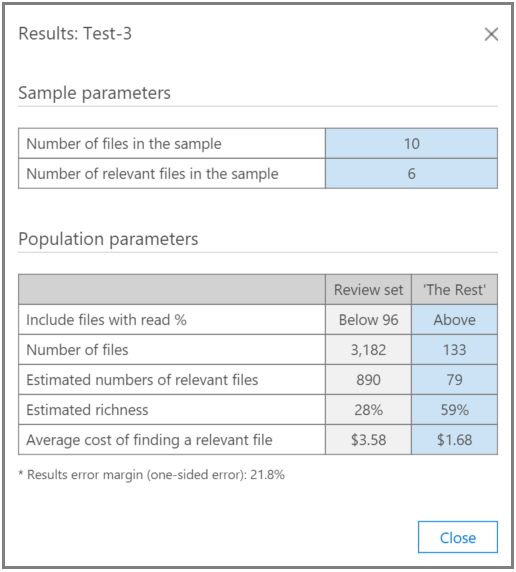

# Test Relevanz Analysis in Office 365 Advanced eDiscovery

> [!NOTE]
> Für Advanced eDiscovery ist ein Office 365 E3-Abonnement mit dem Add-On für erweiterte Compliance oder ein E5-Abonnement für Ihre Organisation erforderlich. Wenn Sie nicht über diesen Plan verfügen und Advanced eDiscovery ausprobieren möchten, können Sie sich [für eine Testversion von Office 365 Enterprise E5 anmelden](https://go.microsoft.com/fwlink/p/?LinkID=698279). 
  
Auf der Registerkarte Test in Advanced eDiscovery können Sie die Gesamtqualität der Verarbeitung testen, vergleichen und validieren. Diese Tests werden nach der Batch Berechnung ausgeführt. Durch das Markieren der Dateien in der Sammlung entscheidet ein Experte darüber, ob jede markierte Datei tatsächlich für den Fall relevant ist. 
  
Bei Szenarien mit einem oder mehreren Problemen werden normalerweise Tests pro Problem durchgeführt. Ergebnisse können nach jedem Test angezeigt werden, und die Testergebnisse können mit den angegebenen Beispiel Testdateien überarbeitet werden.
  
## Testen des Rests

Der Test "Rest testen" wird zum Validieren von Culling-Entscheidungen verwendet, zum Beispiel, um nur Dateien über einem bestimmten Relevanz-Cutoff-Ergebnis basierend auf den endgültigen erweiterten eDiscovery-Ergebnissen zu überprüfen. Der Experte überprüft ein Beispiel von Dateien unter einem ausgewählten Cutoff-Ergebnis, um die Anzahl der relevanten Dateien innerhalb dieses Satzes auszuwerten.
  
Dieser Test enthält Statistiken und einen Vergleich zwischen dem Überprüfungs Sätze und dem Test der Rest-Auffüllung. Die Ergebnisse des Überprüfungs Satzes werden von Relevanz während der Schulung berechnet. Die Ergebnisse umfassen Berechnungen basierend auf Einstellungen und Eingabeparametern, beispielsweise:
  
- Testen Sie die Beispiel Statistiken über die Anzahl der Dateien in einem Beispiel und die identifizierten relevanten Dateien. 
    
- Tabellarischer Vergleich der Populations Parameter des Überprüfungs Satzes und des Rests, beispielsweise die Anzahl der Dateien, die geschätzte Anzahl relevanter Dateien, die geschätzte Reichhaltigkeit und die durchschnittlichen Kosten für die Suche nach einer zusätzlichen relevanten Datei. Kosten Parametereinstellungen können vom Administrator festgelegt werden.
    
1. Öffnen Sie die Registerkarte **Relevanz \> -Test** . 
    
2. Klicken Sie auf der Registerkarte **Test** auf **neuer Test**. Das Dialogfeld zum **Erstellen eines Tests** wird angezeigt, wie im folgenden Beispiel dargestellt. 
    
    
  
3. Geben Sie unter **Test Name**und **Beschreibung**den Namen und die Beschreibung ein.
    
4. Wählen Sie **** in der Liste Testtyp **die Option Rest testen** aus.
    
5. Wählen Sie in der Liste **Problem/Kategorie** den Namen des Problems aus. 
    
6. Wählen Sie in der Liste **Laden** die Option Laden aus. 
    
7. Übernehmen Sie in **Read%** den Standardwert, oder wählen Sie einen Wert für das Ergebnis der Cutoff-Relevanz aus. 
    
8. Legen Sie die **Größe fest**, oder übernehmen Sie den Standardwert. Beachten Sie, dass die Wiederherstellungs Symbole die Standardwerte wiederherstellen werden.
    
9. Klicken Sie auf **Tagging starten**. Ein Test Beispiel wird generiert.
    
10. Überprüfen und markieren Sie die Dateien auf der Registerkarte ** \> Relevanz-Tag** , und klicken Sie dann auf **berechnen**.
    
11. Auf der Registerkarte Test können Sie auf **Ergebnisse anzeigen** klicken, um die Testergebnisse anzuzeigen. In der folgenden Abbildung ist ein Beispiel dargestellt. 
    
    
  
In der obigen Abbildung enthält der Abschnitt " **Sample Parameters** " der Tabelle Details zur Anzahl der Dateien im Beispiel, die vom Experten markiert wurden, sowie die Anzahl relevanter Dateien, die in diesem Beispiel gefunden wurden. 
  
Der Abschnitt " **Population Parameters** " der Tabelle enthält die Testergebnisse, einschließlich der Überprüfungsgruppen Auffüllung von Dateien mit einer Partitur unter dem ausgewählten Cutoff und der "Rest"-Auffüllung von Dateien mit einer Bewertung über dem ausgewählten Cutoff. Für jede Auffüllung werden die folgenden Ergebnisse angezeigt: 
  
- Enthält Dateien mit dem Read%-angegebenen Cutoff
    
- Die Gesamtzahl der Dateien 
    
- Die geschätzte Anzahl relevanter Dateien 
    
- Die geschätzte Reichhaltigkeit 
    
- Durchschnittliche Überprüfungskosten für die Suche nach einer anderen relevanten Datei
    
## Testen des Slices

Der Test "Test the Slice" führt Tests aus, die dem Test "Test the Rest" ähneln, jedoch auf ein Segment des Dateisatzes, wie von Relevanz Read% angegeben.
  
1. Öffnen Sie die Registerkarte **Relevanz \> -Test** . 
    
2. Klicken Sie auf der Registerkarte **Test** auf **neuer Test**. Das Dialogfeld **Test erstellen** wird angezeigt. 
    
3. Geben Sie unter Name und **Beschreibung** **Testen** die Informationen ein.
    
4. Wählen Sie **** in der Liste Testtyp **die Option Segment testen**aus.
    
5. Wählen Sie in der Liste **Problem** den Namen des Problems aus. 
    
6. Wählen Sie in der Liste **Laden** die Option Laden aus. 
    
7. Akzeptieren Sie in **Read% zwischen**die Standardwerte Low und High Range, oder wählen Sie Werte für die Punkte für die Grenz Wert Relevanz aus. 
    
8. Wählen Sie unter **festgelegte Größe**einen Wert aus, oder übernehmen Sie den Standardwert.
    
    Mit den Wiederherstellungs Symbolen wird der Standardwert wiederhergestellt.
    
9. Klicken Sie auf **Tagging starten**. Ein Test Beispiel wird generiert.
    
10. Überprüfen und markieren Sie die Dateien auf der Registerkarte ** \> Relevanz-Tag** , und klicken Sie dann auf **berechnen**. 
    
11. Auf der Registerkarte Test können Sie auf **Ergebnisse anzeigen** klicken, um die Testergebnisse anzuzeigen. 
    
## Siehe auch

[Office 365 Advanced eDiscovery](office-365-advanced-ediscovery.md)
  
[Grundlegendes zur Relevanz der Bewertung](assessment-in-relevance-in-advanced-ediscovery.md)
  
[Tagging und Bewertung](tagging-and-assessment-in-advanced-ediscovery.md)
  
[Tagging und Relevanz Training](tagging-and-relevance-training-in-advanced-ediscovery.md)
  
[Analyse der nach Verfolgungs Relevanz](track-relevance-analysis-in-advanced-ediscovery.md)
  
[Entscheidung basierend auf den Ergebnissen](decision-based-on-the-results-in-advanced-ediscovery.md)

