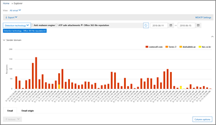
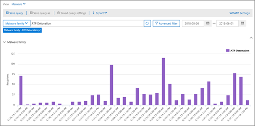

# Ansichten des Sicherheitsrisiken-Explorers

[Threat Explorer](use-explorer-in-security-and-compliance.md) ist ein leistungsstarkes, nahezu Echtzeit-Tool, mit dessen Hilfe Sicherheitsteams untersuchen und auf Bedrohungen im Security &amp; Compliance Center reagieren können. Der Explorer zeigt Informationen zu mutmaßlicher Schadsoftware und Phishing in e-Mails und Dateien in Office 365 sowie andere Sicherheitsbedrohungen und-Risiken für Ihre Organisation an. 

Wenn Sie Explorer zuerst öffnen, werden in der Standardansicht e-Mail-Malware-Entdeckungen für die letzten 7 Tage angezeigt. 

Der Explorer kann auch Sicherheitsschutz Features in Office 365, einschließlich [sicherer Links](atp-safe-links.md) und [sicherer Anlagen](atp-safe-attachments.md) , anzeigen und so geändert werden, dass Daten für die letzten 30 Tage angezeigt werden. 

> [!NOTE]
> Wenn Sie ein Testabonnement für Office 365 Advanced Threat Protection Plan 2 oder Office 365 E5 haben, werden nur Erkennungs-und e-Mail-Daten für die letzten 7 Tage angezeigt.
  
Verwenden Sie das Menü **Ansicht** , um zu ändern, welche Informationen angezeigt werden. Mit QuickInfos können Sie bestimmen, welche Ansicht verwendet werden soll.
  

Nachdem Sie eine Ansicht ausgewählt haben, können Sie Filter anwenden und Abfragen einrichten, um eine weitere Analyse durchzuführen. Die folgenden Abschnitte enthalten eine kurze Übersicht über die verschiedenen im Explorer verfügbaren Ansichten.  

## E-Mail-> Schadsoftware

Um diesen Bericht anzuzeigen, wählen Sie im Explorer die Option**e-Mail-** > **Schadsoftware** **anzeigen** > aus. In dieser Ansicht werden Informationen zu e-Mail-Nachrichten angezeigt, die als Schadsoftware identifiziert wurden.  

 

Klicken Sie auf **Absender** , um die Liste der Anzeigeoptionen zu öffnen. Verwenden Sie diese Liste, um Daten nach Absender, Empfänger, Absenderdomäne, Betreff, Erkennungstechnologie, Schutzstatus und mehr anzuzeigen. 

Wenn Sie beispielsweise sehen möchten, welche Aktionen für erkannte e-Mail-Nachrichten durchgeführt wurden, wählen Sie in der Liste **Schutzstatus** aus. Wählen Sie eine Option aus, und klicken Sie dann auf die Schaltfläche Aktualisieren, um den Filter auf Ihren Bericht anzuwenden.

Zeigen Sie unter dem Diagramm weitere Details zu bestimmten Nachrichten an. Wenn Sie ein Element in der Liste auswählen, wird ein Ausklappbereich geöffnet, in dem Sie mehr über das ausgewählte Element erfahren. 

## E-Mail->-Phishing

Um diesen Bericht anzuzeigen, wählen Sie im Explorer die Option**e-Mail-** > **Phishing** **anzeigen** > aus. Diese Ansicht zeigt e-Mail-Nachrichten an, die als Phishing-Versuche identifiziert wurden.  

 

Klicken Sie auf **Absender** , um die Liste der Anzeigeoptionen zu öffnen. Verwenden Sie diese Liste, um Daten nach Absender, Empfänger, Absenderdomäne, Absender-IP, URL-Domäne, klicken Sie auf Urteil und vieles mehr. 

Wenn Sie beispielsweise sehen möchten, welche Aktionen ausgeführt wurden, als Personen auf URLs geklickt haben, die als Phishing-Versuche identifiziert wurden, wählen Sie in der Liste **auf Urteil klicken** aus, wählen Sie eine oder mehrere Optionen aus, und klicken Sie dann auf die Schaltfläche Aktualisieren.

Zeigen Sie unter dem Diagramm weitere Details zu bestimmten Nachrichten, URL-Klicks, URLs und e-Mail-Ursprung an. 

Wenn Sie ein Element in der Liste auswählen, beispielsweise eine erkannte URL, wird ein Fensterausschnitt geöffnet, in dem Sie mehr über das ausgewählte Element erfahren. 

## E-Mail-> vom Benutzer gemeldet

Um diesen Bericht anzuzeigen, wählen Sie im Explorer die Option**e-Mail** > **-Benutzer** **anzeigen** > . In dieser Ansicht werden e-Mails angezeigt, die von Benutzern als Junk-e-Mail oder Phishing-Nachricht gemeldet wurden. 

 

Klicken Sie auf **Absender** , um die Liste der Anzeigeoptionen zu öffnen. Verwenden Sie diese Liste, um Informationen nach Absender, Empfänger, Berichtstyp anzuzeigen (die Bestimmung des Benutzers, dass es sich um Junk-e-Mail-Nachricht, nicht um Junk oder Phishing handelt) und vieles mehr. 

Wenn Sie beispielsweise Informationen zu e-Mail-Nachrichten anzeigen möchten, die als Phishing-Versuche gemeldet wurden, klicken Sie auf **Absender** > **Berichttyp**, wählen Sie **Phishing**aus, und klicken Sie dann auf die Schaltfläche Aktualisieren.

Zeigen Sie unterhalb des Diagramms weitere Details zu bestimmten e-Mail-Nachrichten wie Betreff, die IP-Adresse des Absenders, der Benutzer, der die Nachricht als Junk, nicht Junk oder Phishing gemeldet hat, und vieles mehr an. 

Wählen Sie ein Element in der Liste aus, um zusätzliche Details anzuzeigen.

## E-Mail-> alle e-Mails

Um diesen Bericht anzuzeigen, wählen Sie im Explorer die Option**** > **alle**e-Mails **anzeigen** > . Diese Ansichten zeigen eine Übersicht über e-Mail-Aktivitäten, einschließlich e-Mails, die aufgrund von Phishing oder Schadsoftware als böswillig identifiziert wurden, sowie für alle nicht-böswilligen e-Mails (normale e-Mail, Spam und Massensendungen). 

> [!NOTE]
> Wenn Sie eine Fehlermeldung erhalten, die zu **viele anzuzeigende Daten**liest, fügen Sie einen Filter hinzu, und schränken Sie gegebenenfalls den angezeigten Datums Umfang ein. 

Wenn Sie einen Filter anwenden möchten, wählen Sie **Absender**aus, wählen Sie ein Element in der Liste aus, und klicken Sie dann auf die Schaltfläche Aktualisieren. In unserem Beispiel wurde die **Erkennungstechnologie** als Filter verwendet (es stehen mehrere Optionen zur Verfügung). Anzeigen von Informationen nach Absender, Absenderdomäne, Empfänger, Betreff, Anlage Dateiname, Schadsoftware-Familie, Schutzstatus (Aktionen, die von ihren Threat Protection-Features und-Richtlinien in Office 365 ausgeführt werden), Erkennungstechnologie (wie die Schadsoftware erkannt wurde) und mehr. 

 

Zeigen Sie unter dem Diagramm weitere Details zu bestimmten e-Mail-Nachrichten an, beispielsweise Betreff, Empfänger, Absender, Status usw. 

## Inhalts > Schadsoftware

Klicken Sie zum Anzeigen dieses Berichts im Explorer auf **** > **Inhalts** > -**Malware**anzeigen. Diese Ansicht zeigt Dateien, die von [Office 365 Advanced Threat Protection in SharePoint Online, OneDrive for Business und Microsoft Teams](atp-for-spo-odb-and-teams.md)als bösartig identifiziert wurden.

Anzeigen von Informationen nach Malwarefamilie, Erkennungstechnologie (wie die Malware erkannt wurde) und Arbeitslast (OneDrive, SharePoint oder Teams). 

  

Zeigen Sie unter dem Diagramm weitere Details zu bestimmten Dateien an, beispielsweise Dateiname der Anlage, Arbeitsauslastung, Dateigröße, wer die Datei zuletzt geändert hat, und vieles mehr. 
  
## Click-to-Filter-Funktionen

Mit Explorer können Sie einen Filter in einem Klick anwenden. Klicken Sie auf ein Element in der Legende, und dieses Element wird ein Filter für den Bericht. Nehmen wir beispielsweise an, dass Sie die Malware Ansicht im Explorer betrachten:
  

  
Wenn Sie in diesem Diagramm auf **ATP-Detonation** klicken, wird eine Ansicht wie die folgende angezeigt: 
  

  
In dieser Ansicht betrachten wir nun Daten für Dateien, die von [Office 365 ATP Safe Attachments](atp-safe-attachments.md)gezündet wurden. Unter dem Diagramm können Details zu bestimmten e-Mail-Nachrichten mit Anlagen angezeigt werden, die von sicheren ATP-Anlagen erkannt wurden.
  

  
Durch Auswählen eines oder mehrerer Elemente wird das Menü " **Aktionen** " aktiviert, das verschiedene Auswahlmöglichkeiten für die ausgewählten Elemente bietet. 
  

  
Die Möglichkeit, mit einem Klick zu filtern und zu bestimmten Details zu navigieren, kann Ihnen viel Zeit bei der Untersuchung von Bedrohungen ersparen.

## Abfragen und Filter

Der Explorer verfügt über mehrere leistungsstarke Filter und Abfragefunktionen, mit denen Sie Details wie die wichtigsten Zielbenutzer, die wichtigsten Malware Familien, die Erkennungstechnologie und vieles mehr eingehen können. Jede Art von Bericht bietet eine Vielzahl von Möglichkeiten zum Anzeigen und Durchsuchen von Daten.

> [!IMPORTANT]
> Verwenden Sie in der Abfrage Leiste für Explorer keine Platzhalterzeichen wie ein Sternchen (*) oder ein Fragezeichen (?). Wenn Sie im Feld Betreff für e-Mail-Nachrichten suchen, führt der Explorer eine partielle Übereinstimmung aus und liefert Ergebnisse, die der Platzhaltersuche ähneln.
