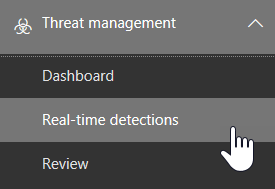

# Threat Explorer und Echtzeiterkennung

Wenn Ihre Organisation [Office 365 Advanced Threat Protection](office-365-atp.md) (Office 365 ATP) verfügt und Sie über die [erforderlichen Berechtigungen](#required-licenses-and-permissions)verfügen, haben Sie entweder **Explorer** -oder **Echtzeiterkennung** (früher *Echtzeitberichte* ), [Siehe ](#new-features-in-real-time-detections)Neuigkeiten!). Wechseln Sie im Security #a0 Compliance Center zu **Threat Management**, und wählen Sie dann **Explorer** oder **Real-Time Detections**aus. 

|Mit ATP-Plan 2 sehen Sie Folgendes:  |Mit ATP-Plan 1 sehen Sie Folgendes:  |
|---------|---------|
|      |         |

Mit Explorer (oder Echtzeiterkennung) haben Sie einen leistungsfähigen Bericht, mit dem Ihr Sicherheits Betriebsteam Bedrohungen effektiv und effizient untersuchen und darauf reagieren kann, und es ähnelt dem folgenden Bild: 

Mit diesem Bericht haben Sie folgende Möglichkeiten:
- [Siehe von Office 365 Sicherheitsfeatures erkannte Schadsoftware](#see-malware-detected-in-email-by-technology)
- [Anzeigen von Daten zu Phishing-URLs und klicken auf Urteil](#view-data-about-phishing-urls-and-click-verdict)
- [Starten eines automatisierten unter Such-und Antwort Prozesses in einer Ansicht im Explorer](#start-automated-investigation-and-response) (Nur ATP-Plan 2)
- ... [Untersuchung schädlicher e-Mails und vieles mehr](#more-ways-to-use-explorer-or-real-time-detections)!

## Neue Features in Echt Zeit Erkennungen

Im folgenden werden drei neue Features in Threat Explorer erläutert.

Zunächst sind **die e-Mail-Kopfzeilen Vorschau und der Download des e-Mail-Texts** neue Features, die in Threat Explorer zur Verfügung stehen. Administratoren können heruntergeladene Kopfzeilen/e-Mails nach Bedrohungen analysieren. Da das Herunterladen von e-Mails die Gefährdung von Informationen gefährden kann, wird dieser Prozess durch rollenbasierte Zugriffssteuerung (Roles-Based Access Control, RBAC) gesteuert. Eine neue Rolle mit dem Namen "Vorschau" muss in einer anderen Office 365 Rollengruppe (beispielsweise in sec-Vorgänge oder in der SEC-Verwaltung) hinzugefügt werden, um die Möglichkeit zum Herunterladen von e-Mails und der Vorschau von Kopfzeilen in der Ansicht "all-Email" zu gewähren.

Aber Explorer (und Echtzeit-Erkennungen) fügt auch neue neue Felder entwickelt, um Ihnen ein vollständiges Bild, wo Ihre e-Mails landen. Ein Teil des Ziels dieser Änderung besteht darin, die Suche für Sicherheitsleute einfacher zu machen, aber das Ergebnis ist, dass der Speicherort der Problem-e-Mails auf einen Blick zu erkennen ist.

Wie wird das gemacht? Der Zustellungs Status wird nun in zwei Spalten aufgeteilt:

- **Zustellungs Aktion** – wie lautet der Status dieser e-Mail?
- **Zustellungs Speicherort** – wohin wurde diese e-Mail weitergeleitet?

Zustellungs Aktion ist die Aktion, die aufgrund vorhandener Richtlinien oder Erkennungen auf eine e-Mail angewendet wird. Hier sind die möglichen Aktionen, die eine e-Mail ausführen kann:

|Geliefert  |Ausrangierten  |Gesperrt  |Ersetzt  |
|---------|---------|---------|---------|
|E-Mail wurde im Posteingang oder Ordner eines Benutzers zugestellt, und der Benutzer kann direkt darauf zugreifen.    | E-Mails wurden entweder an den Junk-Ordner des Benutzers oder den Ordner "gelöscht" gesendet, und der Benutzer hat Zugriff auf e-Mails in diesen Ordnern.       | Alle e-Mails, die unter Quarantäne gestellt wurden, die nicht erfolgreich waren oder gelöscht wurden. Auf diesen Zugriff kann der Benutzer vollständig zugreifen!     | Jede e-Mail-Nachricht, bei der böswillige Anlagen durch txt-Dateien ersetzt werden, die den Status der Anlage aufweisen, war bösartig.     |

Und hier ist, was der Benutzer sehen kann und was er nicht kann:

|Für Endbenutzer zugänglich  |Für Endbenutzer unzugänglich  |
|---------|---------|
|Geliefert     | Gesperrt        |
|Ausrangierten     | Ersetzt        |

Der Übermittlungsort zeigt die Ergebnisse von Richtlinien und Erkennungen an, die nach der Zustellung ausgeführt werden. Sie ist mit einer Zustellungs Aktion verknüpft. Dieses Feld wurde hinzugefügt, um Einblicke in die Aktion zu geben, die ausgeführt wird, wenn ein Problem mit e-Mails gefunden wird. Im folgenden sind die möglichen Werte für den Zustellungs Speicherort zu finden:

1. Posteingang oder Ordner – die e-Mail befindet sich im Posteingang oder in einem Ordner (entsprechend Ihren e-Mail-Regeln).
2. On-Prem oder External – das Postfach ist nicht in der Cloud vorhanden, sondern lokal.
3. Junk-Ordner – die e-Mail im Ordner Junk eines Benutzers.
4. Ordner "Gelöschte Elemente" – die e-Mail im Ordner "Gelöschte Elemente" eines Benutzers.
5. Quarantine – die e-Mail-Nachricht in Quarantäne und befindet sich nicht im Postfach eines Benutzers.
6. Fehler – die e-Mail konnte das Postfach nicht erreichen.
7. Fallen gelassen – die e-Mail wird irgendwo in der Nachrichtenübermittlung verloren.

Die **e-Mail-Zeitachse** ist eine weitere neue Explorer-Funktion, mit der die Jagd Erfahrung für Administratoren verbessert werden soll. Es reduziert die Zufallsgenerierung, da die Überprüfung verschiedener Standorte kürzer ist, um zu versuchen, das Ereignis zu verstehen. Wenn mehrere Ereignisse bei oder nahe gleichzeitig in einer e-Mail auftreten, werden diese Ereignisse in einer Zeitachsenansicht angezeigt. In der Tat werden einige Ereignisse, die nach der Zustellung an Ihre e-Mails geschehen, in der Spalte "spezielle Aktion" erfasst. Durch die Kombination der Informationen aus der Zeitachse dieser e-Mail mit der speziellen Aktion, die Sie für die e-Mail-Zustellung durchführen, erhalten Administratoren einen Einblick in die Funktionsweise Ihrer Richtlinien, wo die e-Mails schließlich weitergeleitet wurden, und in einigen Fällen was die abschließende Bewertung war.

Weitere Informationen zur Untersuchung böswilliger e-Mails finden Sie unter [Suchen und untersuchen von in Office 365](https://docs.microsoft.com/en-us/office365/securitycompliance/investigate-malicious-email-that-was-delivered)zugestellten böswilligen e-Mails.

## Siehe in e-Mail erkannte Malware nach Technologie

Angenommen, Sie möchten die in e-Mail-nach Office 365-Technologie erkannte Malware sehen. Verwenden Sie dazu die [e-Mail-#a0](threat-explorer-views.md#email--malware) Ansicht "Malware" des Explorers (oder Echtzeiterkennung).

1. Wählen Sie im Security #a0 Compliance Center[https://protection.office.com](https://protection.office.com)() **Threat Management** > **Explorer** (oder **Echtzeiterkennung**) aus. (In diesem Beispiel wird der Explorer verwendet.)

2. Wählen Sie im Menü **Ansicht** die Option **e-Mail-** > **Schadsoftware**aus.  

3. Klicken Sie auf **Absender**, und wählen Sie dann **Basis** > **Erkennungstechnologie**aus. Ihre Erkennungstechnologien stehen nun als Filter für den Bericht zur Verfügung.   

4. Wählen Sie eine Option aus, und klicken Sie dann auf die Schaltfläche **Aktualisieren** , um diesen Filter anzuwenden.   

Der Bericht wird aktualisiert, um die in e-Mail-Nachweise erkannten Ergebnisse mithilfe der ausgewählten Technologie-Option anzuzeigen. Von hier aus können Sie weitere Analysen durchführen.

## Anzeigen von Daten zu Phishing-URLs und klicken auf Urteil

Angenommen, Sie möchten Phishing-Versuche über URLs in e-Mails sehen, einschließlich einer Liste von URLs, die zugelassen, blockiert und außer Kraft gesetzt wurden. Zum Identifizieren von URLs, auf die geklickt wurde, müssen [ATP-sichere Links](atp-safe-links.md) konfiguriert werden. Stellen Sie sicher, dass Sie [Richtlinien für ATP-sichere Links](set-up-atp-safe-links-policies.md) zum Zeitpunkt des Klick Schutzes und zur Protokollierung von Klick urteilen durch ATP-sichere Links eingerichtet haben. 

Um Phishing-URLs in Nachrichten und Klicks auf URLs in Phishing-Nachrichten zu überprüfen, verwenden Sie die [e-Mail-#a0 Phishing-](threat-explorer-views.md#email--phish) Ansicht des Explorers (oder Echtzeiterkennung).

1. Wählen Sie im Security #a0 Compliance Center[https://protection.office.com](https://protection.office.com)() **Threat Management** > **Explorer** (oder **Echtzeiterkennung**) aus. (In diesem Beispiel wird der Explorer verwendet.)

2. Wählen Sie im Menü **Ansicht** die Option**Phishing** **per e-Mail** > aus.  

3. Klicken Sie auf **Absender**, und wählen Sie dann **URLs** > **Klicken Sie auf Urteil**.

4. Wählen Sie eine oder mehrere Optionen aus, beispielsweise " **blockiert** " und "über **schrieben**", und klicken Sie dann auf die Schaltfläche **Aktualisieren** , die sich in derselben Reihe befindet wie die Optionen zum Anwenden des Filters. (Aktualisieren Sie Ihr Browserfenster nicht.)  

    Der Bericht wird aktualisiert, um zwei unterschiedliche URL-Tabellen auf der Registerkarte URL unter dem Bericht anzuzeigen:

   - **Top-URLs** sind die URLs, die in den Nachrichten enthalten sind, nach denen Sie nach unten gefiltert haben, und die e-Mail-Zustellungs Aktion zählt für jede URL. In der Phishing-e-Mail-Ansicht enthält diese Liste normalerweise legitime URLs. Angreifer enthalten eine Mischung aus guten und ungültigen URLs in ihren Nachrichten, um Sie zu übermitteln, aber Sie machen die bösartigen Links für den Benutzer interessanter, auf Sie zuwerden. Die Tabelle der URLs wird nach der Gesamtzahl der e-Mails sortiert (Hinweis: Diese Spalte wird nicht angezeigt, um die Ansicht zu vereinfachen).

   - Zu den **wichtigsten Klicks** gehören die eingebundenen URLs, auf die geklickt wurde, sortiert nach der Gesamtanzahl der Klick Zähler (diese Spalte wird auch nicht angezeigt, um die Ansicht zu vereinfachen). Gesamtanzahl Zählungen nach Spalte geben Sie die sichere Links klicken Sie auf Urteils Zählung für jede URL, auf die geklickt wurde. In der Phishing-e-Mail-Ansicht sind dies häufiger verdächtige oder böswillige URLs, aber Sie können auch saubere URLs in Phishing-Nachrichten enthalten. URL Klicks auf unverpackte Links werden hier nicht angezeigt.
   
   Die beiden URLs Tabellen zeigen Top-URLs in Phishing-e-Mails nach Zustellung Aktion und Ort, und Sie zeigen URL Klicks, die blockiert wurden (oder besucht, obwohl eine Warnung), damit Sie verstehen, welche potenziellen schlechten Links wurden von Benutzern empfangen und mit den Benutzern interagieren. Von hier aus können Sie weitere Analysen durchführen. Beispielsweise können Sie unter dem Diagramm die häufigsten URLs in e-Mails sehen, die in der Umgebung Ihrer Organisation blockiert wurden.
   
   
   
   Wählen Sie eine URL aus, um ausführlichere Informationen anzuzeigen. Beachten Sie, dass im Dialogfeld URL-Flyout die Filterung von e-Mails entfernt wird, um Ihnen die vollständige Ansicht der URL-Exposition in Ihrer Umgebung anzuzeigen. Auf diese Weise können Sie e-Mails im Explorer nach bestimmten URLs filtern, die potenzielle Bedrohungen darstellen, und dann Ihr Verständnis der URL-Exposition in Ihrer Umgebung erweitern (über das Dialogfeld "URL-Details"), ohne dass Sie der URL-Filter hinzufügen müssen. Explorer-Ansicht selbst.

## Überprüfen von von Benutzern gemeldeten e-Mail-Nachrichten

Angenommen, Sie möchten e-Mail-Nachrichten anzeigen, die Benutzer in Ihrer Organisation als Junk-, kein Junk-oder als Phishing gemeldet haben, indem Sie das [Berichtsnachrichten-Add-in für Outlook und Outlook im Internet](enable-the-report-message-add-in.md)verwenden. Verwenden Sie dazu die Ansicht [e-Mail #a0 Übermittlungen](threat-explorer-views.md#email--submissions) des Explorers (oder Echtzeiterkennung).

1. Wählen Sie im Security #a0 Compliance Center[https://protection.office.com](https://protection.office.com)() **Threat Management** > **Explorer** (oder **Echtzeiterkennung**) aus. (In diesem Beispiel wird der Explorer verwendet.)

2. Wählen Sie im Menü **Ansicht** die Option **e-Mail-** > über**mittlungen**aus.  

3. Klicken Sie auf **Absender**, und wählen Sie **Standard** > **Berichtstyp**aus.

4. Wählen Sie eine Option wie **Phishing**aus, und klicken Sie dann auf die Schaltfläche **Aktualisieren** .    

Der Bericht wird aktualisiert, um Daten über e-Mail-Nachrichten anzuzeigen, die Personen in Ihrer Organisation als Phishing-Versuch gemeldet haben. Sie können diese Informationen verwenden, um weitere Analysen durchzuführen und bei Bedarf Ihre [ATP-Anti-Phishing-Richtlinien](set-up-anti-phishing-policies.md)anzupassen.

## Starten der automatischen Untersuchung und Antwort

> [!NOTE]
> In **Office 365 ATP-Plan 2** und **Office 365 E5**stehen automatisierte Ermittlungs-und Antwortfunktionen zur Verfügung.

(Neu!) Durch [Automatische Untersuchung und Antwort](automated-investigation-response-office.md) können Sie Ihr Sicherheits Betriebsteam viel Zeit und Mühe bei der Untersuchung und Abwehr von Cyber-Angriffen speichern. Zusätzlich zum Konfigurieren von Warnungen, die ein Sicherheits Textbuch auslösen können, können Sie einen automatisierten Ermittlungs-und Antwortprozess aus einer Ansicht im Explorer starten. 

Ausführliche Informationen hierzu finden Sie unter [Beispiel: ein Sicherheitsadministrator löst eine Untersuchung im Explorer aus](automated-investigation-response-office.md#example-a-security-administrator-triggers-an-investigation-from-threat-explorer).

## Weitere Möglichkeiten zum Verwenden von Explorer (oder Echtzeiterkennung)

Zusätzlich zu den in diesem Artikel beschriebenen Szenarien stehen Ihnen viele weitere Berichtsoptionen mit Explorer (oder Echtzeiterkennung) zur Verfügung. 
- [Suchen und Untersuchen von bösartigen E-Mails, die zugestellt wurden](investigate-malicious-email-that-was-delivered.md)
- [Anzeigen schädlicher Dateien, die in SharePoint Online, OneDrive und Microsoft Teams erkannt wurden](malicious-files-detected-in-spo-odb-or-teams.md)
- [Erhalten einer Übersicht über die Ansichten in Threat Explorer (und Echtzeiterkennung)](threat-explorer-views.md)

## Erforderliche Lizenzen und Berechtigungen

Sie benötigen [Office 365 ATP](office-365-atp.md) , um den Explorer oder Echt Zeit Erkennungen zu erhalten.
- Der Explorer ist in Office 365 ATP-Plan 2 enthalten. 
- Der Bericht über Echt Zeit Erkennungen ist in Office 365 ATP-Plan 1 enthalten.
- Planen Sie die Zuweisung von Lizenzen für alle Benutzer, die durch ATP geschützt werden sollen. (Bei Explorer-oder Echt Zeit Erkennungen werden Erkennungsdaten für lizenzierte Benutzer angezeigt.)

Zum Anzeigen und Verwenden von Explorer-oder Echt Zeit Erkennungen müssen Sie über die entsprechenden Berechtigungen verfügen, beispielsweise solche, die einem Sicherheitsadministrator oder Sicherheits Leser erteilt werden. 

- Für das Security &amp; Compliance Center müssen Sie eine der folgenden Rollen zugewiesen haben:
    - Organisationsverwaltung
    - Sicherheits Administrator (Dies kann im Azure Active Directory Admin Center zugewiesen werden ([https://aad.portal.azure.com](https://aad.portal.azure.com)))
    - Sicherheits Leser

- Für Exchange Online müssen Sie eine der folgenden Rollen entweder in der Exchange-Verwaltungskonsole ([https://outlook.office365.com/ecp](https://outlook.office365.com/ecp)) oder mit PowerShell-Cmdlets zugewiesen haben (siehe [Exchange Online PowerShell](https://docs.microsoft.com/powershell/exchange/exchange-online/exchange-online-powershell?view=exchange-ps)):
    - Organisationsverwaltung
    - Organisationsverwaltung mit Leserechten
    - Rolle „Empfänger mit Leserechten“
    - Verwaltung der Richtlinientreue

Weitere Informationen zu Rollen und Berechtigungen finden Sie in den folgenden Ressourcen:

- [Berechtigungen im Office 365 Security &amp; Compliance Center](permissions-in-the-security-and-compliance-center.md)
- [Featureberechtigungen in Exchange Online](https://docs.microsoft.com/exchange/permissions-exo/feature-permissions)
  
## Einige Unterschiede zwischen dem Bedrohungs Exporteur und Echt Zeit Erkennungen

 - Der Bericht über **Echt Zeit Erkennungen** steht in Office 365 ATP-Plan 1 zur Verfügung, während **Threat Explorer** in Office 365 ATP-Plan 2 zur Verfügung steht.
 - Der Bericht über **Echt Zeit Erkennungen** ermöglicht das Anzeigen von Erkennungen in Echtzeit. Dieser Vorgang wird auch von **Threat Explorer** durchgesetzt, aber Sie können auch zusätzliche Details für einen bestimmten Angriff anzeigen.
