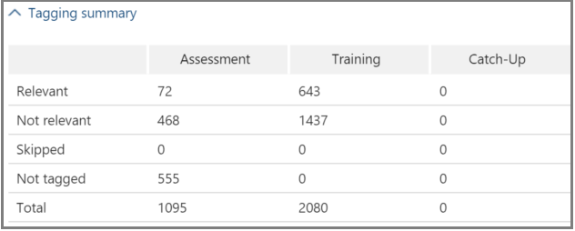

# Nachverfolgen der Relevanzanalyse in Office 365 Advanced eDiscovery

> [!NOTE]
> Für Advanced eDiscovery ist ein Office 365 E3-Abonnement mit dem Add-On für erweiterte Compliance oder ein E5-Abonnement für Ihre Organisation erforderlich. Wenn Sie nicht über diesen Plan verfügen und Advanced eDiscovery ausprobieren möchten, können Sie sich [für eine Testversion von Office 365 Enterprise E5 anmelden](https://go.microsoft.com/fwlink/p/?LinkID=698279). 
  
In Advanced eDiscovery wird auf der Registerkarte Relevanz verfolgen die berechnete Gültigkeit der Relevanz-Schulung angezeigt, die auf der Registerkarte Tag ausgeführt wird, und gibt den nächsten Schritt an, der für den iterativen Schulungsprozess relevant ist. 
  
## Status der Tracking Relevanz-Schulung

1. Sehen Sie sich die folgenden Details in Relevanz Track für die Fall Probleme an, wie im folgenden Beispiel des Dialogfelds **Problem Name** unten gezeigt. 
    
  - **Bewertung**: Diese Fortschrittsanzeige zeigt, in welchem Maße die Relevanz-Schulung zu diesem Zeitpunkt das Bewertungs Ziel im Hinblick auf die Fehlertoleranz erreicht hat. Die Reichhaltigkeit der Ergebnisse der Relevanz-Schulung wird ebenfalls angezeigt. 
    
  - **Schulung**: Diese farbcodierte Fortschrittsanzeige und QuickInfo-Anzeige gibt die Stabilität des Trainings Ergebnisses und eine numerische Skala an, in der die Anzahl der Relevanz-Schulungsbeispiele für jedes Problem angezeigt wird. Der Experte überwacht den Fortschritt des iterativen Relevanz-Schulungsprozesses. 
    
  - **Batch Berechnung**: Diese Fortschrittsanzeige enthält Informationen zum Abschließen der Batch Berechnung.
    
  - **Nächster Schritt**: zeigt die Empfehlung für den nächsten Schritt an, der ausgeführt werden soll. 
    
    In dem Beispiel wird eine erfolgreich abgeschlossene Bewertung für ein Problem angezeigt, die durch die Anzeige des abgeschlossenen Farb Fortschritts und des Häkchens angezeigt wird. Tagging ist im Gange, aber der Fall gilt weiterhin als instabil (Stabilitäts Status wird auch in einem ToolTip angezeigt). Die nächste Schritt Empfehlung ist "Training". 
    
    
  
    In der erweiterten Ansicht werden zusätzliche Informationen und Optionen angezeigt. Der angezeigte aktuelle Fehler Rand ist der Fehler Rand des Rückrufs im aktuellen Status der Bewertung, wenn die vorhandenen (bereits gekennzeichneten) Bewertungsdateien vorhanden sind.
    
    > [!NOTE]
    >  Die Bewertungsstufe kann umgangen werden, indem das Kontrollkästchen **Bewertung** pro Problem und dann für "alle Probleme" deaktiviert wird. Daher gibt es für dieses Problem keine Statistiken. > das Kontrollkästchen **Bewertung** kann nur ausgeführt werden, bevor die Bewertung durchgeführt wird. Wenn in einem Fall mehrere Probleme vorhanden sind, wird die Bewertung nur umgangen, wenn das Kontrollkästchen für jedes Problem deaktiviert ist. 
  
    Wenn die Bewertung mit dem ersten Beispielsatz von Dateien nicht abgeschlossen ist, kann die Bewertung als nächster Schritt zum Taggen weiterer Dateien erfolgen. 
    
    In **Relevanz** \> **Track**geben die Fortschrittsanzeige und die QuickInfo des Trainings die geschätzte Anzahl zusätzlicher Beispiele an, die zum Erreichen der Stabilität benötigt werden. Diese Schätzung stellt eine Richtlinie für die erforderliche zusätzliche Schulung dar.
    
    
  
2. Wenn Sie mit dem Tagging fertig sind und das Training fortsetzen müssen, klicken Sie auf **Training**. Ein weiterer Beispielsatz von Dateien wird aus dem geladenen Datei Satz für zusätzliche Schulungen generiert. Sie kehren dann zur Registerkarte Tag zurück, um weitere Dateien zu markieren und zu trainieren.
    
### Erreichen stabiler Schulungsstufen

Nachdem die Bewertungsdateien ein stabiles Ausbildungsniveau erreicht haben, ist Advanced eDiscovery für die Batch Berechnung bereit.
  
> [!NOTE]
> Der nächste Schritt ist NormalerWeise nach drei stabilen Übungsbeispielen "Batch Berechnung". Es kann beispielsweise Ausnahmen geben, wenn Änderungen am Tagging von Dateien aus früheren Beispielen oder beim Hinzufügen von Seed-Dateien vorgenommen wurden. 
  
### Ausführen der Batch Berechnung

Die Batch Berechnung wird als nächster Schritt ausgeführt, nachdem das Training erfolgreich abgeschlossen wurde (wenn ein stabiler Trainingsstatus durch die Fortschrittsanzeige angezeigt wird, ein Häkchen und ein stabiler Status in der QuickInfo.) Die Batch Berechnung wendet das während der Relevanz-Schulung erworbene Wissen auf die gesamte Datei Auffüllung an, um die Relevanz der Dateien zu bewerten und Relevanzwerte zuzuweisen.
  
Wenn es mehr als ein Problem gibt, erfolgt die Batch Berechnung pro Problem. Während der Batch Berechnung wird der Fortschritt während der Verarbeitung aller Dateien überwacht. 
  
Hier ist der Empfohlene nächste Schritt "None", was bedeutet, dass an dieser Stelle keine zusätzliche iterative Relevanz-Schulung erforderlich ist. Die nächste Phase ist die Registerkarte **Relevanz \> entscheiden** . 
  
Wenn Sie nach der Batch Berechnung neue Dateien importieren möchten, kann der Administrator die importierten Dateien einer neuen Belastung hinzufügen.
  
> [!NOTE]
> Wenn Sie während der Batch Berechnung auf **Abbrechen** klicken, speichert der Prozess, was bereits ausgeführt wurde. Wenn Sie die Batch Berechnung erneut ausführen, wird der Prozess vom zuletzt ausgeführten Punkt fortgesetzt. 
  
### Bewerten der Tagging-Konsistenz

Wenn es Inkonsistenzen bei der Dateikennzeichnung gibt, kann dies Auswirkungen auf die Analyse haben. Der erweiterte eDiscovery-Tagging-Konsistenz Prozess kann verwendet werden, wenn die Ergebnisse nicht optimal sind oder Konsistenz zweifelhaft ist. Eine Liste der möglichen inkonsistenten getaggten Dateien wird zurückgegeben, und Sie können bei Bedarf überprüft und neu markiert werden.
  
> [!NOTE]
> Nach sieben oder mehr Trainingsrunden nach der Bewertung kann die Tagging-Konsistenz in **Relevanz** \> **Track** \> **Issue** \> **detailed results** \> **Training Progress**angezeigt werden. Diese Überprüfungen werden jeweils einzeln durchgeführt. 
  
1. Erweitern Sie in **Relevanz \> Track**die Zeile eines Problems.
    
2. Klicken Sie rechts **neben nächster Schritt**auf **ändern**.
    
3. Wählen **** Sie Inkonsistenzen als **Nächster Schritt** aus, nachdem Sie sieben Übungsbeispiele ausgewählt haben, und klicken Sie auf **OK**.
    
4. Wählen **** Sie Inkonsistenzen aus. Die Registerkarte **Tag** wird geöffnet, und es wird eine Liste der Inkonsistenzen angezeigt, die bei Bedarf neu gekennzeichnet werden sollen. 
    
5. Klicken Sie auf **berechnen** , um die Änderungen zu übermitteln. Der nächste Schritt nach dem Tagging von Inkonsistenzen ist "Training". 
    
## Anzeigen und Verwenden von Relevanz-Ergebnissen

Erweitern Sie auf der Registerkarte **Relevanz \> verfolgen** die Zeile eines Problems, und klicken Sie neben **detaillierte Ergebnisse**auf **Ansicht**. Die detaillierten Ergebnisbereiche werden angezeigt (siehe unten).
  

  
### Tagging-Zusammenfassung

 In dem unten gezeigten Beispiel **** werden die Gesamtwerte für alle Bewertungs-, Schulungs-und Catch-up-Datei Kennzeichnungs Prozesse angezeigt. 
  

  
### Schlüsselwörter

Bei einem Schlüsselwort handelt es sich um eine eindeutige Zeichenfolge, ein Wort, einen Ausdruck oder eine Folge von Wörtern in einer Datei, die von Advanced eDiscovery identifiziert wurde, als einen wichtigen Indikator dafür, ob eine Datei relevant ist. Das Schlüsselwort und die Gewichtung der Spalten "include" in Dateien, die als relevant markiert sind, und die Spalten "Exclude" listet Schlüsselwörter und Gewichte in Dateien auf, die als nicht relevant markiert sind.
  
Erweiterte eDiscovery weist negative oder positive Schlüsselwort Gewichtungswerte zu. Je höher die Gewichtung ist, desto höher ist die Wahrscheinlichkeit, dass eine Datei, in der das Stichwort angezeigt wird, bei der Batch Berechnung eine höhere Relevanz erzielt. 
  
Die erweiterte eDiscovery-Liste mit Schlüsselwörtern kann verwendet werden, um eine von einem Experten erstellte Liste oder eine indirekte Plausibilitätsprüfung zu einem beliebigen Zeitpunkt im Datei Prüfungsprozess zu ergänzen.
  
### Schulungs Fortschritt

Der **Fortschritts Fortschritt** -Bereich enthält eine Trainingsfortschritts Grafik und eine Anzeige des Qualitäts Indikators, wie im folgenden Beispiel gezeigt. 
  

  
 **Ausbildungs Qualitätsindikator**: zeigt die Bewertung der Tagging-Konsistenz wie folgt an:
  
- **Gut**: Dateien werden konsistent gekennzeichnet. (Grünes Licht wird angezeigt)
    
- **Mittel**: einige Dateien werden möglicherweise inkonsistent gekennzeichnet. (Gelbes Licht wird angezeigt)
    
- **Warnung**: viele Dateien werden möglicherweise inkonsistent gekennzeichnet. (Rotes Licht wird angezeigt)
    
 **Trainingsfortschritts Diagramm**: zeigt den Grad der Relevanz Training Stabilität nach einer Reihe von Relevanz trainingszyklen im Vergleich zu den F-Measure-Wert. Bei der Verschiebung von links nach rechts über den Graphen verengt sich das Konfidenzintervall und wird zusammen mit dem F-Measure durch erweiterte eDiscovery-Relevanz verwendet, um die Stabilität zu bestimmen, wenn die Relevanz-Schulungsergebnisse optimiert werden.
  
> [!NOTE]
> Relevanz verwendet F2, eine F-Measure-Metrik, bei der Rückruf doppelt so viel Gewicht erhält wie Precision. Für Fälle mit hoher reichgröße (mehr als 25%) verwendet Relevanz F1 (1:1-Verhältnis). Das F-Measure-Verhältnis kann in den **erweiterten Einstellungen**für **Relevanz Setup** \> konfiguriert werden. 
  
### Ergebnisse der Batch Berechnung

Der Bereich **Batch Berechnungsergebnisse** enthält die Anzahl der Dateien, die für Relevanz bewertet wurden, wie folgt: 
  
- **Success**
    
- **Empty**: enthält keinen Text, beispielsweise nur Leerzeichen/Tabstopps
    
- **Fehler**: aufgrund einer übermäßigen Größe oder nicht lesbar
    
- **Ignoriert**: aufgrund von übermäßiger Größe
    
- **Nebel**: enthält keinen bedeutungslosen Text oder keine für das Problem relevanten Features
    
> [!NOTE]
> Leer, failed, ignored oder neblig erhalten eine Relevanz-Bewertung von-1. 
  
### Schulungs Statistiken

Im Bereich **Trainingsstatistik** werden Statistiken und Diagramme basierend auf Ergebnissen aus Advanced eDiscovery Relevance Training angezeigt. 
  

  
Diese Ansicht zeigt Folgendes:
  
- **Review-Recall Ratio**: Vergleich der Ergebnisse nach Relevanz-Bewertungen in einer hypothetisch linearen Übersetzung. ReCall wird aufgrund des Übersichts Satzes festgelegt.
    
- **Parameter**: kumulative berechnete Statistiken im Zusammenhang mit dem Übersichts Satz im Verhältnis zur Datei Auffüllung für den gesamten Fall.
    
- **Review**: Prozentsatz der zu überprüfenden Dateien basierend auf diesem Cutoff.
    
- **Recall**: Prozentsatz der relevanten Dateien im Übersichts Satz. 
    
- **Verteilung nach Relevanz Bewertung**: Dateien in der dunkelgrauen Anzeige Links befinden sich unterhalb der Cutoff-Bewertung. Ein QuickInfo zeigt den Relevanzwert und den zugehörigen Prozentsatz der Dateien in der Übersichtsdatei im Verhältnis zu den Gesamtdateien an.
    
## Siehe auch

[Office 365 Advanced eDiscovery](office-365-advanced-ediscovery.md)
  
[Bedeutung der Bewertung](assessment-in-relevance-in-advanced-ediscovery.md)
  
[Durchführen und Überprüfen der Bewertung](tagging-and-assessment-in-advanced-ediscovery.md)
  
[Durchführen von Relevanz-Schulungen](tagging-and-relevance-training-in-advanced-ediscovery.md)
  
[EntscheidungsFindung anhand der Ergebnisse](decision-based-on-the-results-in-advanced-ediscovery.md)
  
[Testen der Relevanz-Analyse](test-relevance-analysis-in-advanced-ediscovery.md)

