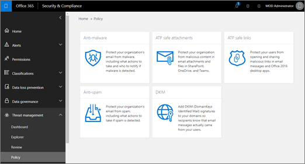

# Aktivieren Sie Office 365 ATP für SharePoint, OneDrive und Microsoft-Teams

[Office 365 ATP für SharePoint, OneDrive, und Microsoft-Teams,](atp-for-spo-odb-and-teams.md) wird verhindert, dass Ihre Organisation versehentliches schädliche Dateien freigeben. Wenn eine solche Datei erkannt wird, wird diese Datei blockiert, damit niemand öffnen, kopieren, verschieben oder freigeben, bis der Organisation Security Team Weitere Aktionen ausgeführt werden. Lesen Sie diesen Artikel zum Aktivieren der ATP für SharePoint, OneDrive und Teams, richten Sie Warnungen zur erkannten Dateien benachrichtigt werden, und die nächsten Schritte. 
  
Um die in diesem Artikel beschriebenen Aufgaben durchführen zu können, benötigen Sie die erforderlichen Berechtigungen zugewiesen in Office 365 und die Sicherheit &amp; Compliance Center.
  
## Aktivieren von ATP für SharePoint, OneDrive und Microsoft Teams

 **Vor Beginn dieses Verfahrens stellen Sie sicher, dass die überwachungsprotokollierung für Ihre Office 365-Umgebung bereits aktiviert ist**. Dies erfolgt normalerweise von einem Benutzer, der Rolle für Überwachungsprotokolle im Exchange Online zugewiesen hat. Weitere Informationen finden Sie unter [Aktivieren von Office 365 Such-Protokoll aktiviert oder deaktiviert](turn-audit-log-search-on-or-off.md).
  
1. Als globaler Administrator oder Sicherheitsadministrator, wechseln Sie zur [https://protection.office.com](https://protection.office.com), und melden Sie sich mit Ihrem Konto arbeiten oder Schule.
    
2. In der Office 365-Sicherheit &amp; Compliance Center, wählen Sie im linken Navigationsbereich unter **Threat Management** **Policy** \> **Sichere Anlagen**.  
  
3. Aktivieren Sie das Kontrollkästchen Sie **auf ATP für SharePoint, OneDrive, und Microsoft-Teams**. 
  
4. Klicken Sie auf **Speichern**.
    
5. Überprüfen Sie (und gegebenenfalls bearbeiten Sie) [sichere Anlagen Richtlinien](set-up-atp-safe-attachments-policies.md) und [sichere Links Richtlinien](set-up-atp-safe-links-policies.md)Ihres Unternehmens.
    
6. (Empfohlen) Führen Sie das Cmdlet **[Set-SPOTenant](https://docs.microsoft.com/powershell/module/sharepoint-online/Set-SPOTenant?view=sharepoint-ps)** als ein globaler Administrator oder eine SharePoint Online-Administrator mit dem **DisallowInfectedFileDownload** -Parameter auf *true*festgelegt.  
      - Festlegen des Parameters auf *true* Blöcke (mit Ausnahme von löschen) alle Aktionen für erkannt Dateien. Personen können nicht öffnen, verschieben, kopieren oder erkannte Dateien freigeben.
      - Wenn der Parameter auf *"false"* blockiert alle Aktionen mit Ausnahme von löschen und herunterladen. Personen können das Risiko übernehmen möchten, und Laden Sie eine gefundene Datei.  
   
7. Können Sie bis zu 30 Minuten, damit die Änderungen in allen Office 365-Rechenzentren verteilen.
    
8. (Empfohlen) Fahren Sie fort, um Benachrichtigungen zu erkannten Dateien einrichten.
    
Weitere Informationen zum Verwenden von PowerShell mit Office 365 finden Sie unter [Verwalten von Office 365 mit PowerShell](https://docs.microsoft.com/office365/enterprise/powershell/manage-office-365-with-office-365-powershell). 

Um erfahren Sie mehr über die Benutzeroberfläche, wenn eine Datei als böswilligen entdeckt wurde, finden Sie unter [was geschehen soll, wenn eine solche Datei in SharePoint Online, OneDrive, oder Microsoft-Teams gefunden wird](https://support.office.com/article/01e902ad-a903-4e0f-b093-1e1ac0c37ad2). 
  
## Einrichten von Benachrichtigungen für erkannten Dateien

Um die Benachrichtigung, wenn eine Datei in SharePoint Online, OneDrive for Business oder Microsoft-Teams, als bösartige angegeben wurde, können Sie eine Warnung einrichten.
  
1. In der Office 365-Sicherheit &amp; Compliance Center, wählen Sie **Warnungen** \> **Benachrichtigungen verwalten**.
    
2. Wählen Sie **Neue Benachrichtigung Richtlinie**aus.
    
3. Geben Sie einen Namen für die Benachrichtigung. Beispielsweise können Sie schädliche Dateien in Bibliotheken eingeben.
    
4. Geben Sie eine Beschreibung für die Benachrichtigung. Beispielsweise können Sie Administratoren benachrichtigt eingeben, wenn schädliche Dateien in SharePoint Online, OneDrive oder Microsoft-Teams, erkannt werden.
    
5. Klicken Sie im Abschnitt **senden diese Warnung, wenn...** folgendermaßen Sie vor: 
    
    a wählen Sie in der Liste der **Aktivitäten** , **erkannte Schadsoftware in Datei**.
    
    b. lassen Sie b. das Feld **Benutzer** leer. 
    
6. Wählen Sie im Abschnitt **dieser Warnung... senden** eine oder mehrere globale Administratoren, Sicherheitsadministratoren oder Sicherheit Leser, die benachrichtigt werden soll, wenn eine solche Datei erkannt wird. 
    
7. Klicken Sie auf **Speichern**.
    
Weitere Informationen zu Benachrichtigungen finden Sie unter [Aktivität Benachrichtigungen erstellen, in die Office 365-Sicherheit &amp; Compliance Center](create-activity-alerts.md). 
  
## Nächste Schritte

1. [Anzeigen von Informationen über schädliche Dateien in SharePoint, OneDrive oder Microsoft-Teams erkannt](malicious-files-detected-in-spo-odb-or-teams.md)
    
2. [Verwalten von in Quarantäne verschobenen Nachrichten und Dateien als Administrator in Office 365](manage-quarantined-messages-and-files.md)
    

  

