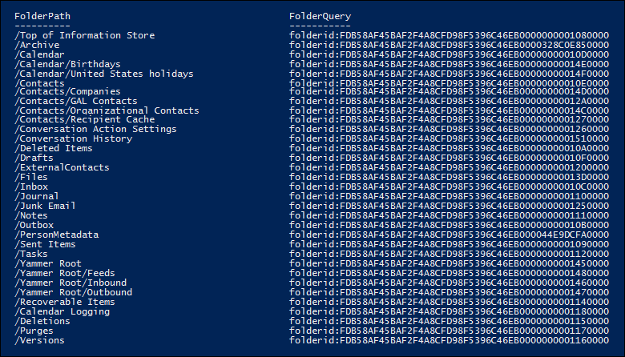

# <a name="use-content-search-in-office-365-for-targeted-collections"></a><span data-ttu-id="dc0c3-105">Verwenden der Inhaltssuche in Office 365 für gezielte Auflistungen</span><span class="sxs-lookup"><span data-stu-id="dc0c3-105">Use Content Search in Office 365 for targeted collections</span></span>

<span data-ttu-id="dc0c3-106">Das Feature "Inhaltssuche" im Office 365 &amp; Security Compliance Center bietet keine direkte Möglichkeit in der Benutzeroberfläche, bestimmte Ordner in Exchange-Postfächern oder SharePoint-und OneDrive für Unternehmen-Websites zu durchsuchen.</span><span class="sxs-lookup"><span data-stu-id="dc0c3-106">The Content Search feature in the Office 365 Security &amp; Compliance Center doesn't provide a direct way in the UI to search specific folders in Exchange mailboxes or SharePoint and OneDrive for Business sites.</span></span> <span data-ttu-id="dc0c3-107">Es ist jedoch möglich, bestimmte Ordner zu durchsuchen (als *gezielte Sammlung*bezeichnet), indem die Eigenschaft "Folder ID" für die Eigenschaft "Email" oder "Path" (DocumentLink) für Websites in der tatsächlichen Suchabfrage Syntax angegeben wird.</span><span class="sxs-lookup"><span data-stu-id="dc0c3-107">However, it's possible to search specific folders (called a *targeted collection*) by specifying the folder ID property for email or path (DocumentLink) property for sites in the actual search query syntax.</span></span> <span data-ttu-id="dc0c3-108">Die Verwendung der Inhaltssuche zum Ausführen einer zielgerichteten Sammlung ist hilfreich, wenn Sie sicher sind, dass Elemente, die auf einen Fall reagieren, oder privilegierte Elemente sich in einem bestimmten Postfach oder Standortordner befinden.</span><span class="sxs-lookup"><span data-stu-id="dc0c3-108">Using Content Search to perform a targeted collection is useful when you're confident that items responsive to a case or privileged items are located in a specific mailbox or site folder.</span></span> <span data-ttu-id="dc0c3-109">Sie können das Skript in diesem Artikel verwenden, um die Ordner-ID für Postfachordner oder den Pfad (DocumentLink) für Ordner auf einer SharePoint-und OneDrive für Unternehmen-Website zu erhalten.</span><span class="sxs-lookup"><span data-stu-id="dc0c3-109">You can use the script in this article to obtain the folder ID for mailbox folders or the path (DocumentLink) for folders on a SharePoint and OneDrive for Business site.</span></span> <span data-ttu-id="dc0c3-110">Anschließend können Sie die Ordner-ID oder den Pfad in einer Suchabfrage verwenden, um Elemente zurückzugeben, die sich im Ordner befinden.</span><span class="sxs-lookup"><span data-stu-id="dc0c3-110">Then you can use the folder ID or path in a search query to return items located in the folder.</span></span>

> [!NOTE]
> <span data-ttu-id="dc0c3-111">Um Inhalte zurückzugeben, die sich in einem Ordner auf einer SharePoint-oder OneDrive für Unternehmen-Website befinden, verwendet das Skript in diesem Thema die verwaltete Eigenschaft DocumentLink anstelle der Path-Eigenschaft.</span><span class="sxs-lookup"><span data-stu-id="dc0c3-111">To return content located in a folder in a SharePoint or OneDrive for Business site, the script in this topic uses the DocumentLink managed property instead of the Path property.</span></span> <span data-ttu-id="dc0c3-112">Die DocumentLink-Eigenschaft ist robuster als die Path-Eigenschaft, da Sie alle Inhalte in einem Ordner zurückgibt, während die Path-Eigenschaft einige Mediendateien zurückgibt.</span><span class="sxs-lookup"><span data-stu-id="dc0c3-112">The DocumentLink property is more robust than the Path property because it will return all content in a folder, whereas the Path property won't return some media files.</span></span>

## <a name="before-you-begin"></a><span data-ttu-id="dc0c3-113">Bevor Sie beginnen</span><span class="sxs-lookup"><span data-stu-id="dc0c3-113">Before you begin</span></span>

- <span data-ttu-id="dc0c3-114">Sie müssen Mitglied der Rollengruppe "eDiscovery-Manager" im Security &amp; Compliance Center sein, um das Skript in Schritt 1 auszuführen.</span><span class="sxs-lookup"><span data-stu-id="dc0c3-114">You have to be a member of the eDiscovery Manager role group in the Security &amp; Compliance Center to run the script in Step 1.</span></span> <span data-ttu-id="dc0c3-115">Weitere Informationen finden Sie unter [Zuweisen von eDiscovery-Berechtigungen](assign-ediscovery-permissions.md).</span><span class="sxs-lookup"><span data-stu-id="dc0c3-115">For more information, see [Assign eDiscovery permissions](assign-ediscovery-permissions.md).</span></span>
    
    <span data-ttu-id="dc0c3-116">Darüber hinaus müssen Sie der Rolle "e-Mail-Empfänger" in Ihrer Exchange Online Organisation zugewiesen sein.</span><span class="sxs-lookup"><span data-stu-id="dc0c3-116">Additionally, you have to be assigned the Mail Recipients role in your Exchange Online organization.</span></span> <span data-ttu-id="dc0c3-117">Dies ist erforderlich, um das **Get-MailboxFolderStatistics-** Cmdlet auszuführen, das in dem Skript in Schritt 1 enthalten ist.</span><span class="sxs-lookup"><span data-stu-id="dc0c3-117">This is required to run the **Get-MailboxFolderStatistics** cmdlet, which is included in the script in Step 1.</span></span> <span data-ttu-id="dc0c3-118">Standardmäßig ist die Rolle "e-Mail-Empfänger" der Rollengruppe "Organisationsverwaltung" und "Empfängerverwaltung" in Exchange Online zugewiesen.</span><span class="sxs-lookup"><span data-stu-id="dc0c3-118">By default, the Mail Recipients role is assigned to the Organization Management and Recipient Management role groups in Exchange Online.</span></span> <span data-ttu-id="dc0c3-119">Weitere Informationen zum Zuweisen von Berechtigungen in Exchange Online finden Sie unter [Verwalten von Rollengruppenmitgliedern](https://go.microsoft.com/fwlink/p/?linkid=692102).</span><span class="sxs-lookup"><span data-stu-id="dc0c3-119">For more information about assigning permissions in Exchange Online, see [Manage role group members](https://go.microsoft.com/fwlink/p/?linkid=692102).</span></span> <span data-ttu-id="dc0c3-120">Sie können auch eine benutzerdefinierte Rollengruppe erstellen, ihr die Rolle "e-Mail-Empfänger" zuweisen und dann die Mitglieder hinzufügen, die das Skript in Schritt 1 ausführen müssen.</span><span class="sxs-lookup"><span data-stu-id="dc0c3-120">You could also create a custom role group, assign the Mail Recipients role to it, and then add the members who need to run the script in Step 1.</span></span> <span data-ttu-id="dc0c3-121">Weitere Informationen finden Sie unter [Verwalten von Rollengruppen](https://go.microsoft.com/fwlink/p/?linkid=730688).</span><span class="sxs-lookup"><span data-stu-id="dc0c3-121">For more information, see [Manage role groups](https://go.microsoft.com/fwlink/p/?linkid=730688).</span></span>
    
- <span data-ttu-id="dc0c3-122">Jedes Mal, wenn Sie das Skript in Schritt 1 ausführen, wird eine neue Remote-PowerShell-Sitzung erstellt.</span><span class="sxs-lookup"><span data-stu-id="dc0c3-122">Each time you run the script in Step 1, a new remote PowerShell session is created.</span></span> <span data-ttu-id="dc0c3-123">Sie können also alle Remote-PowerShell-Sitzungen nutzen, die Ihnen zur Verfügung stehen.</span><span class="sxs-lookup"><span data-stu-id="dc0c3-123">So you could use up all the remote PowerShell sessions available to you.</span></span> <span data-ttu-id="dc0c3-124">Um dies zu verhindern, können Sie den folgenden Befehl ausführen, um die Verbindung der aktiven Remote-PowerShell-Sitzungen zu trennen.</span><span class="sxs-lookup"><span data-stu-id="dc0c3-124">To prevent this from happening, you can run the following command to disconnect your active remote PowerShell sessions.</span></span>
    
  ```
  Get-PSSession | Remove-PSSession
  ```

    <span data-ttu-id="dc0c3-125">Weitere Informationen finden Sie unter [Herstellen einer Verbindung mit Exchange Online PowerShell](https://go.microsoft.com/fwlink/p/?linkid=396554).</span><span class="sxs-lookup"><span data-stu-id="dc0c3-125">For more information, see [Connect to Exchange Online PowerShell](https://go.microsoft.com/fwlink/p/?linkid=396554).</span></span>
    
- <span data-ttu-id="dc0c3-126">Das Skript enthält eine minimale Fehlerbehandlung.</span><span class="sxs-lookup"><span data-stu-id="dc0c3-126">The script includes minimal error handling.</span></span> <span data-ttu-id="dc0c3-127">Der Hauptzweck des Skripts besteht darin, schnell eine Liste von Postfachordner-IDs oder Website Pfaden anzuzeigen, die in der Suchabfrage Syntax einer Inhaltssuche verwendet werden können, um eine gezielte Sammlung auszuführen.</span><span class="sxs-lookup"><span data-stu-id="dc0c3-127">The primary purpose of the script is to quickly display a list of mailbox folder IDs or site paths that can be used in the search query syntax of a Content Search to perform a targeted collection.</span></span>
    
- <span data-ttu-id="dc0c3-128">Das in diesem Thema bereitgestellte Beispielskript wird unter keinem Microsoft Standard Support Programm oder-Dienst unterstützt.</span><span class="sxs-lookup"><span data-stu-id="dc0c3-128">The sample script provided in this topic isn't supported under any Microsoft standard support program or service.</span></span> <span data-ttu-id="dc0c3-129">Das Beispielskript wird ohne jegliche Gewährleistung bereitgestellt.</span><span class="sxs-lookup"><span data-stu-id="dc0c3-129">The sample script is provided AS IS without warranty of any kind.</span></span> <span data-ttu-id="dc0c3-130">Microsoft schließt weiterhin konkludent, einschließlich, aber nicht beschränkt auf implizite Garantien der Handelsüblichkeit oder Eignung für einen bestimmten Zweck aus.</span><span class="sxs-lookup"><span data-stu-id="dc0c3-130">Microsoft further disclaims all implied warranties including, without limitation, any implied warranties of merchantability or of fitness for a particular purpose.</span></span> <span data-ttu-id="dc0c3-131">Das gesamte Risiko, das aus der Verwendung oder der Leistung des Beispielskripts und der Dokumentation erwachsen, bleibt bei Ihnen.</span><span class="sxs-lookup"><span data-stu-id="dc0c3-131">The entire risk arising out of the use or performance of the sample script and documentation remains with you.</span></span> <span data-ttu-id="dc0c3-132">Microsoft, seine Autoren oder an der Erstellung, Produktion oder Bereitstellung der Skripts beteiligte Personen sind in keinem Fall haftbar für entstandene Schäden (darunter entgangene Gewinne, Geschäftsunterbrechungen, Verluste von Geschäftsinformationen oder sonstige finanzielle Verluste), die aus der Nutzung oder der Nutzungsunfähigkeit der Bespielskripts oder Dokumentation entstanden sind, selbst dann nicht, wenn Microsoft über eventuelle Folgen informiert wurde.</span><span class="sxs-lookup"><span data-stu-id="dc0c3-132">In no event shall Microsoft, its authors, or anyone else involved in the creation, production, or delivery of the scripts be liable for any damages whatsoever (including, without limitation, damages for loss of business profits, business interruption, loss of business information, or other pecuniary loss) arising out of the use of or inability to use the sample scripts or documentation, even if Microsoft has been advised of the possibility of such damages.</span></span>
  
## <a name="step-1-run-the-script-to-get-a-list-of-folders-for-a-mailbox-or-site"></a><span data-ttu-id="dc0c3-133">Schritt 1: Ausführen des Skripts zum Abrufen einer Liste von Ordnern für ein Postfach oder eine Website</span><span class="sxs-lookup"><span data-stu-id="dc0c3-133">Step 1: Run the script to get a list of folders for a mailbox or site</span></span>

<span data-ttu-id="dc0c3-134">Das Skript, das Sie in diesem ersten Schritt ausführen, gibt eine Liste der Postfachordner oder SharePoint-und OneDrive für Unternehmen-Ordner sowie die entsprechende Ordner-ID oder den entsprechenden Pfad für jeden Ordner zurück.</span><span class="sxs-lookup"><span data-stu-id="dc0c3-134">The script that you run in this first step will return a list of mailbox folders or SharePoint and OneDrive for Business folders, and the corresponding folder ID or path for each folder.</span></span> <span data-ttu-id="dc0c3-135">Wenn Sie dieses Skript ausführen, werden Sie aufgefordert, die folgenden Informationen einzugeben.</span><span class="sxs-lookup"><span data-stu-id="dc0c3-135">When you run this script, it will prompt you for the following information.</span></span>
  
- <span data-ttu-id="dc0c3-136">**E-Mail-Adresse oder Website-URL** Geben Sie eine e-Mail-Adresse der Depotbank ein, um eine Liste der Exchange-Postfachordner und Ordner-IDs zurückzugeben.</span><span class="sxs-lookup"><span data-stu-id="dc0c3-136">**Email address or site URL** Type an email address of the custodian to return a list of Exchange mailbox folders and folder IDs.</span></span> <span data-ttu-id="dc0c3-137">Oder geben Sie die URL für eine SharePoint-Website oder eine OneDrive für Unternehmen Website ein, um eine Liste der Pfade für die angegebene Website zurückzugeben.</span><span class="sxs-lookup"><span data-stu-id="dc0c3-137">Or type the URL for a SharePoint site or a OneDrive for Business site to return a list of paths for the specified site.</span></span> <span data-ttu-id="dc0c3-138">Im Folgenden finden Sie einige Beispiele:</span><span class="sxs-lookup"><span data-stu-id="dc0c3-138">Here are some examples:</span></span> 
    
  - <span data-ttu-id="dc0c3-139">**Exchange** -stacig@contoso.onmicrosoft.com</span><span class="sxs-lookup"><span data-stu-id="dc0c3-139">**Exchange** - stacig@contoso.onmicrosoft.com</span></span> 
    
  - <span data-ttu-id="dc0c3-140">**Share** - https://contoso.sharepoint.com/sites/marketing</span><span class="sxs-lookup"><span data-stu-id="dc0c3-140">**SharePoint** - https://contoso.sharepoint.com/sites/marketing</span></span> 
    
  - <span data-ttu-id="dc0c3-141">**OneDrive für Unternehmen** - https://contoso-my.sharepoint.com/personal/stacig_contoso_onmicrosoft_com</span><span class="sxs-lookup"><span data-stu-id="dc0c3-141">**OneDrive for Business** - https://contoso-my.sharepoint.com/personal/stacig_contoso_onmicrosoft_com</span></span> 
    
- <span data-ttu-id="dc0c3-142">**Ihre Benutzeranmeldeinformationen** – das Skript verwendet Ihre Anmeldeinformationen zum Herstellen einer Verbindung mit Exchange Online und dem Security & Compliance Center mit Remote-PowerShell.</span><span class="sxs-lookup"><span data-stu-id="dc0c3-142">**Your user credentials** - The script will use your credentials to connect to Exchange Online and the Security & Compliance Center with remote PowerShell.</span></span> <span data-ttu-id="dc0c3-143">Wie bereits erläutert, müssen Sie die entsprechenden Berechtigungen für die erfolgreiche Ausführung dieses Skripts zugewiesen haben.</span><span class="sxs-lookup"><span data-stu-id="dc0c3-143">As previously explained, you have to assigned the appropriate permissions to successfully run this script.</span></span>
    
<span data-ttu-id="dc0c3-144">So zeigen Sie eine Liste der Postfachordner oder Website documentlink (path) Namen an:</span><span class="sxs-lookup"><span data-stu-id="dc0c3-144">To display a list of mailbox folders or site documentlink (path) names:</span></span>
  
1. <span data-ttu-id="dc0c3-145">Speichern Sie den folgenden Text in einer Windows PowerShell Skriptdatei unter Verwendung eines filename-Suffixes von. ps1; Beispiel: `GetFolderSearchParameters.ps1`.</span><span class="sxs-lookup"><span data-stu-id="dc0c3-145">Save the following text to a Windows PowerShell script file by using a filename suffix of .ps1; for example, `GetFolderSearchParameters.ps1`.</span></span>
    
  ```
  #########################################################################################################
  # This PowerShell script will prompt you for:                             #
  #    * Admin credentials for a user who can run the Get-MailboxFolderStatistics cmdlet in Exchange    #
  #      Online and who is an eDiscovery Manager in the Security & Compliance Center.           #
  # The script will then:                                           #
  #    * If an email address is supplied: list the folders for the target mailbox.          #
  #    * If a SharePoint or OneDrive for Business site is supplied: list the documentlinks (folder paths) #
  #    * for the site.                                                                                  #
  #    * In both cases, the script supplies the correct search properties (folderid: or documentlink:)  #
  #      appended to the folder ID or documentlink to use in a Content Search.              #
  # Notes:                                              #
  #    * For SharePoint and OneDrive for Business, the paths are searched recursively; this means the   #
  #      the current folder and all sub-folders are searched.                       #
  #    * For Exchange, only the specified folder will be searched; this means sub-folders in the folder #
  #      will not be searched.  To search sub-folders, you need to use the specify the folder ID for    #
  #      each sub-folder that you want to search.                               #
  #    * For Exchange, only folders in the user's primary mailbox will be returned by the script.       #
  #########################################################################################################
  # Collect the target email address or SharePoint Url
  $addressOrSite = Read-Host "Enter an email address or a URL for a SharePoint or OneDrive for Business site"
  # Authenticate with Exchange Online and the Security & Compliance Center (Exchange Online Protection - EOP)
  if (!$credentials)
  {
      $credentials = Get-Credential
  }
  if ($addressOrSite.IndexOf("@") -ige 0)
  {
      # List the folder Ids for the target mailbox
      $emailAddress = $addressOrSite
      # Authenticate with Exchange Online
      if (!$ExoSession)
      {
          $ExoSession = New-PSSession -ConfigurationName Microsoft.Exchange -ConnectionUri https://ps.outlook.com/powershell-liveid/ -Credential $credentials -Authentication Basic -AllowRedirection
          Import-PSSession $ExoSession -AllowClobber -DisableNameChecking
      }
      $folderQueries = @()
      $folderStatistics = Get-MailboxFolderStatistics $emailAddress
      foreach ($folderStatistic in $folderStatistics)
      {
          $folderId = $folderStatistic.FolderId;
          $folderPath = $folderStatistic.FolderPath;
          $encoding= [System.Text.Encoding]::GetEncoding("us-ascii")
          $nibbler= $encoding.GetBytes("0123456789ABCDEF");
          $folderIdBytes = [Convert]::FromBase64String($folderId);
          $indexIdBytes = New-Object byte[] 48;
          $indexIdIdx=0;
          $folderIdBytes | select -skip 23 -First 24 | %{$indexIdBytes[$indexIdIdx++]=$nibbler[$_ -shr 4];$indexIdBytes[$indexIdIdx++]=$nibbler[$_ -band 0xF]}
          $folderQuery = "folderid:$($encoding.GetString($indexIdBytes))";
          $folderStat = New-Object PSObject
          Add-Member -InputObject $folderStat -MemberType NoteProperty -Name FolderPath -Value $folderPath
          Add-Member -InputObject $folderStat -MemberType NoteProperty -Name FolderQuery -Value $folderQuery
          $folderQueries += $folderStat
      }
      Write-Host "-----Exchange Folders-----"
      $folderQueries |ft
  }
  elseif ($addressOrSite.IndexOf("http") -ige 0)
  {
      $searchName = "SPFoldersSearch"
      $searchActionName = "SPFoldersSearch_Preview"
      # List the folders for the SharePoint or OneDrive for Business Site
      $siteUrl = $addressOrSite
      # Authenticate with the Security & Compliance Center
      if (!$SccSession)
      {
          $SccSession = New-PSSession -ConfigurationName Microsoft.Exchange -ConnectionUri https://ps.compliance.protection.outlook.com/powershell-liveid -Credential $credentials -Authentication Basic -AllowRedirection
          Import-PSSession $SccSession -AllowClobber -DisableNameChecking
      }
      # Clean-up, if the script was aborted, the search we created might not have been deleted.  Try to do so now.
      Remove-ComplianceSearch $searchName -Confirm:$false -ErrorAction 'SilentlyContinue'
      # Create a Content Search against the SharePoint Site or OneDrive for Business site and only search for folders; wait for the search to complete
      $complianceSearch = New-ComplianceSearch -Name $searchName -ContentMatchQuery "contenttype:folder" -SharePointLocation $siteUrl
      Start-ComplianceSearch $searchName
      do{
          Write-host "Waiting for search to complete..."
          Start-Sleep -s 5
          $complianceSearch = Get-ComplianceSearch $searchName
      }while ($complianceSearch.Status -ne 'Completed')
      if ($complianceSearch.Items -gt 0)
      {
          # Create a Compliance Search Action and wait for it to complete. The folders will be listed in the .Results parameter
          $complianceSearchAction = New-ComplianceSearchAction -SearchName $searchName -Preview
          do
          {
              Write-host "Waiting for search action to complete..."
              Start-Sleep -s 5
              $complianceSearchAction = Get-ComplianceSearchAction $searchActionName
          }while ($complianceSearchAction.Status -ne 'Completed')
          # Get the results and print out the folders
          $results = $complianceSearchAction.Results
          $matches = Select-String "Data Link:.+[,}]" -Input $results -AllMatches
          foreach ($match in $matches.Matches)
          {
              $rawUrl = $match.Value
              $rawUrl = $rawUrl -replace "Data Link: " -replace "," -replace "}"
              Write-Host "DocumentLink:""$rawUrl"""
          }
      }
      else
      {
          Write-Host "No folders were found for $siteUrl"
      }
      Remove-ComplianceSearch $searchName -Confirm:$false -ErrorAction 'SilentlyContinue'
  }
  else
  {
      Write-Error "Couldn't recognize $addressOrSite as an email address or a site URL"
  }
  ```

2. <span data-ttu-id="dc0c3-146">Öffnen Sie auf dem lokalen Computer Windows PowerShell, und wechseln Sie zu dem Ordner, in dem Sie das Skript gespeichert haben.</span><span class="sxs-lookup"><span data-stu-id="dc0c3-146">On your local computer, open Windows PowerShell and go to the folder where you saved the script.</span></span>
    
3. <span data-ttu-id="dc0c3-147">Ausführen des Skripts; Zum Beispiel:</span><span class="sxs-lookup"><span data-stu-id="dc0c3-147">Run the script; for example:</span></span>
    
      ```
      .\GetFolderSearchParameters.ps1
      ```

4. <span data-ttu-id="dc0c3-148">Geben Sie die Informationen ein, die Sie vom Skript angefordert haben.</span><span class="sxs-lookup"><span data-stu-id="dc0c3-148">Enter the information that the script prompts you for.</span></span>
    
    <span data-ttu-id="dc0c3-149">Das Skript zeigt eine Liste von Postfachordnern oder Websiteordnern für den angegebenen Benutzer an.</span><span class="sxs-lookup"><span data-stu-id="dc0c3-149">The script displays a list of mailbox folders or site folders for the specified user.</span></span> <span data-ttu-id="dc0c3-150">Lassen Sie dieses Fenster geöffnet, damit Sie einen Ordner-ID-oder documentlink-Namen kopieren und in einer Suchabfrage in Schritt 2 einfügen können.</span><span class="sxs-lookup"><span data-stu-id="dc0c3-150">Let this window open so that you can copy a folder ID or documentlink name and paste it in to a search query in Step 2.</span></span>
    
    > [!TIP]
    > <span data-ttu-id="dc0c3-151">Anstatt eine Liste von Ordnern auf dem Computerbildschirm anzuzeigen, können Sie die Ausgabe des Skripts erneut an eine Textdatei weiterleiten.</span><span class="sxs-lookup"><span data-stu-id="dc0c3-151">Instead of displaying a list of folders on the computer screen, you can re-direct the output of the script to a text file.</span></span> <span data-ttu-id="dc0c3-152">Diese Datei wird in dem Ordner gespeichert, in dem sich das Skript befindet.</span><span class="sxs-lookup"><span data-stu-id="dc0c3-152">This file will be saved to the folder where the script is located.</span></span> <span data-ttu-id="dc0c3-153">Um beispielsweise die Skriptausgabe in eine Textdatei umzuleiten, führen Sie den folgenden Befehl in Schritt 3 `.\GetFolderSearchParameters.ps1 > StacigFolderIds.txt` aus: dann können Sie eine Ordner-ID oder documentlink aus der Datei kopieren, die in einer Suchabfrage verwendet werden soll.</span><span class="sxs-lookup"><span data-stu-id="dc0c3-153">For example, to redirect the script output to a text file, run the following command in Step 3:  `.\GetFolderSearchParameters.ps1 > StacigFolderIds.txt` Then you can copy a folder ID or documentlink from the file to use in a search query.</span></span>
  
### <a name="script-output-for-mailbox-folders"></a><span data-ttu-id="dc0c3-154">Skriptausgabe für Postfachordner</span><span class="sxs-lookup"><span data-stu-id="dc0c3-154">Script output for mailbox folders</span></span>

<span data-ttu-id="dc0c3-155">Wenn Sie Postfachordner-IDs abrufen, stellt das Skript eine Verbindung mit Exchange Online mithilfe von Remote-PowerShell her, führt das Cmdlet **Get-MailboxFolderStatisics** aus und zeigt dann die Liste der Ordner aus dem angegebenen Postfach an.</span><span class="sxs-lookup"><span data-stu-id="dc0c3-155">If you're getting mailbox folder IDs, the script connects to Exchange Online by using remote PowerShell, runs the **Get-MailboxFolderStatisics** cmdlet, and then displays the list of the folders from the specified mailbox.</span></span> <span data-ttu-id="dc0c3-156">Für jeden Ordner im Postfach zeigt das Skript den Namen des Ordners in der Spalte **folderPath** und die Ordner-ID in der Spalte **FolderQuery** an.</span><span class="sxs-lookup"><span data-stu-id="dc0c3-156">For every folder in the mailbox, the script displays the name of the folder in the **FolderPath** column and the folder ID in the **FolderQuery** column.</span></span> <span data-ttu-id="dc0c3-157">Darüber hinaus fügt das Skript das Präfix von **Folder** ID (dem Namen der Postfacheigenschaft) zur Ordner-ID hinzu.</span><span class="sxs-lookup"><span data-stu-id="dc0c3-157">Additionally, the script adds the prefix of **folderId** (which is the name of the mailbox property) to the folder ID.</span></span> <span data-ttu-id="dc0c3-158">Da es sich bei der **Folder** -Eigenschaft um eine durchsuchbare Eigenschaft `folderid:<folderid>` handelt, verwenden Sie in Schritt 2 eine Suchabfrage, um diesen Ordner zu durchsuchen.</span><span class="sxs-lookup"><span data-stu-id="dc0c3-158">Because the **folderid** property is a searchable property, you'll use  `folderid:<folderid>` in a search query in Step 2 to search that folder.</span></span> 

> [!IMPORTANT]
> <span data-ttu-id="dc0c3-159">Das Skript in diesem Artikel enthält Codierungslogik, mit der die von **Get-MailboxFolderStatistics** zurückgegebenen 64-character-Ordner-ID-Werte in dasselbe 48-Zeichenformat konvertiert werden, das für die Suche indiziert ist.</span><span class="sxs-lookup"><span data-stu-id="dc0c3-159">The script in this article includes encoding logic that converts the 64-character folder Id values that are returned by **Get-MailboxFolderStatistics** to the same 48-character format that is indexed for search.</span></span> <span data-ttu-id="dc0c3-160">Wenn Sie einfach das Cmdlet **Get-MailboxFolderStatistics** in PowerShell ausführen, um eine Ordner-ID zu erhalten (anstatt das Skript in diesem Artikel auszuführen), schlägt eine Suchabfrage, die diesen Wert für die Ordner-ID verwendet, fehl.</span><span class="sxs-lookup"><span data-stu-id="dc0c3-160">If you just run the **Get-MailboxFolderStatistics** cmdlet in PowerShell to obtain a folder Id (instead of running the script in this article), a search query that uses that folder Id value will fail.</span></span> <span data-ttu-id="dc0c3-161">Sie müssen das Skript ausführen, um die ordnungsgemäß formatierten Ordner-IDs abzurufen, die in einer Inhaltssuche verwendet werden können.</span><span class="sxs-lookup"><span data-stu-id="dc0c3-161">You have to run the script to get the correctly-formatted folder Ids that can be used in a Content Search.</span></span>
  
<span data-ttu-id="dc0c3-162">Im folgenden finden Sie ein Beispiel für die vom Skript für Postfachordner zurückgegebene Ausgabe.</span><span class="sxs-lookup"><span data-stu-id="dc0c3-162">Here's an example of the output returned by the script for mailbox folders.</span></span>
  

  
<span data-ttu-id="dc0c3-164">Das Beispiel in Schritt 2 zeigt die Abfrage, die zum Durchsuchen des Ordners "purges" im Ordner "Wiederherstellbare Elemente" des Benutzers verwendet wird.</span><span class="sxs-lookup"><span data-stu-id="dc0c3-164">The example in Step 2 shows the query used to search the Purges subfolder in the user's Recoverable Items folder.</span></span>
  
### <a name="script-output-for-site-folders"></a><span data-ttu-id="dc0c3-165">Skriptausgabe für Websiteordner</span><span class="sxs-lookup"><span data-stu-id="dc0c3-165">Script output for site folders</span></span>

<span data-ttu-id="dc0c3-166">Wenn Sie den Pfad der **documentlink** -Eigenschaft von SharePoint oder OneDrive für Unternehmen Websites erhalten, stellt das Skript eine Verbindung mit dem Security & Compliance Center mithilfe von Remote-PowerShell her, erstellt eine neue Inhaltssuche, die die Website nach Ordnern durchsucht. und zeigt dann eine Liste der Ordner an, die sich im angegebenen Standort befinden.</span><span class="sxs-lookup"><span data-stu-id="dc0c3-166">If you're getting the path of the **documentlink** property from SharePoint or OneDrive for Business sites, the script connects to the Security & Compliance Center using remote PowerShell, creates a new Content Search that searches the site for folders, and then displays a list of the folders located in the specified site.</span></span> <span data-ttu-id="dc0c3-167">Das Skript zeigt den Namen jedes Ordners an und fügt das Präfix **documentlink** der Ordner-URL hinzu.</span><span class="sxs-lookup"><span data-stu-id="dc0c3-167">The script displays the name of each folder and adds the prefix of **documentlink** to the folder URL.</span></span> <span data-ttu-id="dc0c3-168">Da es sich bei der **documentlink** -Eigenschaft um eine durchsuchbare `documentlink:<path>` Eigenschaft handelt, verwenden Sie in einer Suchabfrage in Schritt 2 die Eigenschaft: Wert-Paar, um diesen Ordner zu durchsuchen.</span><span class="sxs-lookup"><span data-stu-id="dc0c3-168">Because the **documentlink** property is a searchable property, you'll use `documentlink:<path>` property:value pair in a search query in Step 2 to search that folder.</span></span> 
  
<span data-ttu-id="dc0c3-169">Im folgenden finden Sie ein Beispiel für die vom Skript für Websiteordner zurückgegebene Ausgabe.</span><span class="sxs-lookup"><span data-stu-id="dc0c3-169">Here's an example of the output returned by the script for site folders.</span></span>
  

  
## <a name="step-2-use-a-folder-id-or-documentlink-to-perform-a-targeted-collection"></a><span data-ttu-id="dc0c3-171">Schritt 2: Verwenden einer Ordner-ID oder documentlink zum Durchführen einer zielgerichteten Sammlung</span><span class="sxs-lookup"><span data-stu-id="dc0c3-171">Step 2: Use a folder ID or documentlink to perform a targeted collection</span></span>

<span data-ttu-id="dc0c3-172">Nachdem Sie das Skript ausgeführt haben, um eine Liste der Ordner-IDs oder documentlinks für einen bestimmten Benutzer zu sammeln, gehen Sie im nächsten Schritt zum Security & Compliance Center, und erstellen Sie eine neue Inhaltssuche, um einen bestimmten Ordner zu durchsuchen.</span><span class="sxs-lookup"><span data-stu-id="dc0c3-172">After you've run the script to collect a list of folder IDs or documentlinks for a specific user, the next step to go to the Security & Compliance Center and create a new Content Search to search a specific folder.</span></span> <span data-ttu-id="dc0c3-173">Sie verwenden das `folderid:<folderid>` -oder `documentlink:<path>` -Eigenschaft: Value-Paar in der Suchabfrage, die Sie im Feld Schlüsselwort für die Inhaltssuche konfigurieren (oder als Wert für den Parameter *ContentMatchQuery* , wenn Sie das Cmdlet **New-ComplianceSearch** verwenden).</span><span class="sxs-lookup"><span data-stu-id="dc0c3-173">You'll use the  `folderid:<folderid>` or  `documentlink:<path>` property:value pair in the search query that you configure in the Content Search keyword box (or as the value for the  *ContentMatchQuery*  parameter if you use the **New-ComplianceSearch** cmdlet).</span></span> <span data-ttu-id="dc0c3-174">Sie können die `folderid` Eigenschaft oder `documentlink` mit anderen Suchparametern oder Suchbedingungen kombinieren.</span><span class="sxs-lookup"><span data-stu-id="dc0c3-174">You can combine the  `folderid` or  `documentlink` property with other search parameters or search conditions.</span></span> <span data-ttu-id="dc0c3-175">Wenn Sie nur die `folderid` oder `documentlink` -Eigenschaft in die Abfrage einbeziehen, gibt die Suche alle Elemente zurück, die sich im angegebenen Ordner befinden.</span><span class="sxs-lookup"><span data-stu-id="dc0c3-175">If you only include the  `folderid` or  `documentlink` property in the query, the search will return all items located in the specified folder.</span></span> 
  
1. <span data-ttu-id="dc0c3-176">Wechseln Sie zu [https://protection.office.com](https://protection.office.com).</span><span class="sxs-lookup"><span data-stu-id="dc0c3-176">Go to [https://protection.office.com](https://protection.office.com).</span></span>
    
2. <span data-ttu-id="dc0c3-177">Melden Sie sich bei Office 365 mit dem Konto und den Anmeldeinformationen an, die Sie zum Ausführen des Skripts in Schritt 1 verwendet haben.</span><span class="sxs-lookup"><span data-stu-id="dc0c3-177">Sign in to Office 365 using the account and credentials that you used to run the script in Step 1.</span></span>
    
3. <span data-ttu-id="dc0c3-178">Klicken Sie im linken Bereich des Security & Compliance Centers auf **Such** \> **Inhaltssuche**, und klicken Sie \*\*\*\* Symbol hinzufügen.</span><span class="sxs-lookup"><span data-stu-id="dc0c3-178">In the left pane of the Security & Compliance Center, click **Search** \> **Content search**, and then click **New** .</span></span>
    
4. <span data-ttu-id="dc0c3-179">Geben Sie auf der Seite **Neue Suche** einen Namen für die Inhaltssuche ein.</span><span class="sxs-lookup"><span data-stu-id="dc0c3-179">On the **New search** page, type a name for the Content Search.</span></span> <span data-ttu-id="dc0c3-180">Dieser Name muss in der Organisation eindeutig sein.</span><span class="sxs-lookup"><span data-stu-id="dc0c3-180">This name has to be unique in your organization.</span></span> 
    
5. <span data-ttu-id="dc0c3-181">Führen Sie einen der folgenden Schritte aus, je nachdem, ob Sie einen Postfachordner oder einen Websiteordner **durch**suchen:</span><span class="sxs-lookup"><span data-stu-id="dc0c3-181">Under **Where do you want us to look**, do one of the following, based on whether you're searching a mailbox folder or a site folder:</span></span>
    
    - <span data-ttu-id="dc0c3-182">Klicken Sie auf **bestimmte Postfächer für die Suche auswählen** , und fügen Sie dann das gleiche Postfach hinzu, das Sie beim Ausführen des Skripts in Schritt 1 angegeben haben.</span><span class="sxs-lookup"><span data-stu-id="dc0c3-182">Click **Choose specific mailboxes to search** and then add the same mailbox that you specified when you ran the script in Step 1.</span></span> 
    
      <span data-ttu-id="dc0c3-183">Oder</span><span class="sxs-lookup"><span data-stu-id="dc0c3-183">Or</span></span>
    
    - <span data-ttu-id="dc0c3-184">Klicken Sie auf **bestimmte Websites für** die Suche auswählen, und fügen Sie dann die gleiche Website-URL hinzu, die Sie beim Ausführen des Skripts in Schritt 1 angegeben haben.</span><span class="sxs-lookup"><span data-stu-id="dc0c3-184">Click **Choose specific sites to search** to search and then add the same site URL that you specified when you ran the script in Step 1.</span></span> 
    
6. <span data-ttu-id="dc0c3-185">Klicken Sie auf **Weiter**.</span><span class="sxs-lookup"><span data-stu-id="dc0c3-185">Click **Next**.</span></span>
    
7. <span data-ttu-id="dc0c3-186">Fügen Sie in das Feld Stichwort auf der Seite **Was möchten Sie** , dass wir nach Seiten suchen `folderid:<folderid>` die `documentlink:<path>` oder-Werte ein, die von dem Skript in Schritt 1 zurückgegeben wurden.</span><span class="sxs-lookup"><span data-stu-id="dc0c3-186">In the keyword box on the **What do you want us to look for** page, paste the  `folderid:<folderid>` or  `documentlink:<path>` value that was returned by the script in Step 1.</span></span> 
    
    <span data-ttu-id="dc0c3-187">Die Abfrage im folgenden Screenshot sucht beispielsweise im Ordner "Wiederherstellbare Elemente" des Benutzers nach einem beliebigen Element im Ordner "purges" (der Wert der `folderid` Eigenschaft für den Ordner "purges" ist im Screenshot in Schritt 1 dargestellt):</span><span class="sxs-lookup"><span data-stu-id="dc0c3-187">For example, the query in the following screenshot will search for any item in the Purges subfolder in the user's Recoverable Items folder (the value of the `folderid` property for the Purges subfolder is shown in the screenshot in Step 1):</span></span>
    
    
  
8. <span data-ttu-id="dc0c3-189">Klicken Sie auf **Suchen** , um die gezielte Sammlungs Suche zu starten.</span><span class="sxs-lookup"><span data-stu-id="dc0c3-189">Click **Search** to start the targeted collection search.</span></span> 
  
### <a name="examples-of-search-queries-for-targeted-collections"></a><span data-ttu-id="dc0c3-190">Beispiele für Suchabfragen für gezielte Auflistungen</span><span class="sxs-lookup"><span data-stu-id="dc0c3-190">Examples of search queries for targeted collections</span></span>

<span data-ttu-id="dc0c3-191">Im folgenden finden Sie einige Beispiele für `folderid` die `documentlink` Verwendung der and-Eigenschaften in einer Suchabfrage, um eine gezielte Sammlung auszuführen.</span><span class="sxs-lookup"><span data-stu-id="dc0c3-191">Here are some examples of using the  `folderid` and  `documentlink` properties in a search query to perform a targeted collection.</span></span> <span data-ttu-id="dc0c3-192">Beachten Sie, dass Platzhalter verwendet `folderid:<folderid>` werden `documentlink:<path>` und um Platz zu sparen.</span><span class="sxs-lookup"><span data-stu-id="dc0c3-192">Note that placeholders are used for  `folderid:<folderid>` and  `documentlink:<path>` to save space.</span></span> 
  
- <span data-ttu-id="dc0c3-193">In diesem Beispiel werden drei verschiedene Postfachordner durchsucht.</span><span class="sxs-lookup"><span data-stu-id="dc0c3-193">This example searches three different mailbox folders.</span></span> <span data-ttu-id="dc0c3-194">Sie können ähnliche Abfragesyntax verwenden, um die ausgeblendeten Ordner im Ordner "refundable Items" eines Benutzers zu durchsuchen.</span><span class="sxs-lookup"><span data-stu-id="dc0c3-194">You could use similar query syntax to search the hidden folders in a user's Recoverable Items folder.</span></span>
    
  ```
  folderid:<folderid> OR folderid:<folderid> OR folderid:<folderid>
  ```

- <span data-ttu-id="dc0c3-195">In diesem Beispiel wird ein Postfachordner nach Elementen durchsucht, die einen genauen Ausdruck enthalten.</span><span class="sxs-lookup"><span data-stu-id="dc0c3-195">This example searches a mailbox folder for items that contain an exact phrase.</span></span>
    
  ```
  folderid:<folderid> AND "Contoso financial results"
  ```

- <span data-ttu-id="dc0c3-196">In diesem Beispiel wird ein Websiteordner (und alle Unterordner) nach Dokumenten durchsucht, die die Buchstaben "NDA" im Titel enthalten.</span><span class="sxs-lookup"><span data-stu-id="dc0c3-196">This example searches a site folder (and any subfolders) for documents that contain the letters "NDA" in the title.</span></span>
    
  ```
  documentlink:<path> AND filename:nda
  ```

- <span data-ttu-id="dc0c3-197">In diesem Beispiel wird ein Websiteordner (und ein beliebiger Unterordner) nach Dokumenten durchsucht, die innerhalb eines Datumsbereichs geändert wurden.</span><span class="sxs-lookup"><span data-stu-id="dc0c3-197">This example searches a site folder (and any subfolder) for documents there were changed within a date range.</span></span>
    
  ```
  documentlink:<path> AND (lastmodifiedtime>=01/01/2017 AND lastmodifiedtime<=01/21/2017)
  ```
  
## <a name="more-information"></a><span data-ttu-id="dc0c3-198">Weitere Informationen</span><span class="sxs-lookup"><span data-stu-id="dc0c3-198">More information</span></span>

<span data-ttu-id="dc0c3-199">Beachten Sie Folgendes, wenn Sie das Skript in diesem Artikel verwenden, um gezielte Sammlungen durchzuführen.</span><span class="sxs-lookup"><span data-stu-id="dc0c3-199">Keep the following things in mind when using the script in this article to perform targeted collections.</span></span>
  
- <span data-ttu-id="dc0c3-200">Das Skript entfernt keine Ordner aus den Ergebnissen.</span><span class="sxs-lookup"><span data-stu-id="dc0c3-200">The script doesn't remove any folders from the results.</span></span> <span data-ttu-id="dc0c3-201">Einige in den Ergebnissen aufgeführte Ordner sind möglicherweise nicht durchsuchbar (oder geben keine Elemente zurück), da Sie vom System generierte Inhalte enthalten.</span><span class="sxs-lookup"><span data-stu-id="dc0c3-201">So some folders listed in the results might be unsearchable (or return zero items) because they contain system-generated content.</span></span>
    
- <span data-ttu-id="dc0c3-202">Dieses Skript gibt nur Ordnerinformationen für das primäre Postfach des Benutzers zurück.</span><span class="sxs-lookup"><span data-stu-id="dc0c3-202">This script only returns folder information for the user's primary mailbox.</span></span> <span data-ttu-id="dc0c3-203">Es werden keine Informationen zu Ordnern im Archivpostfach des Benutzers zurückgegeben.</span><span class="sxs-lookup"><span data-stu-id="dc0c3-203">It doesn't return information about folders in the user's archive mailbox.</span></span>
    
- <span data-ttu-id="dc0c3-204">Beim Durchsuchen von Postfachordnern wird nur der angegebene Ordner durch `folderid` sucht, der durch seine Eigenschaft identifiziert wird. Unterordner werden nicht durchsucht.</span><span class="sxs-lookup"><span data-stu-id="dc0c3-204">When searching mailbox folders, only the specified folder (identified by its  `folderid` property) will be searched; subfolders won't be searched.</span></span> <span data-ttu-id="dc0c3-205">Zum Durchsuchen von Unterordnern müssen Sie die Ordner-ID für den Unterordner verwenden, den Sie durchsuchen möchten.</span><span class="sxs-lookup"><span data-stu-id="dc0c3-205">To search sub-folders, you need to use the  folder ID for the sub-folder that you want to search.</span></span> 
    
- <span data-ttu-id="dc0c3-206">Beim Durchsuchen von Websiteordnern wird der Ordner (identifiziert `documentlink` durch seine Eigenschaft) und alle Unterordner durchsucht.</span><span class="sxs-lookup"><span data-stu-id="dc0c3-206">When searching site folders, the folder (identified by its  `documentlink` property) and all sub-folders will be searched.</span></span> 
    
- <span data-ttu-id="dc0c3-207">Wenn Sie die Ergebnisse einer Suche exportieren, in der Sie die `folderid` Eigenschaft nur in der Suchabfrage angegeben haben, können Sie die erste Exportoption auswählen: "alle Elemente, ausgenommen diejenigen, die ein nicht erkanntes Format haben, werden verschlüsselt oder aus anderen Gründen nicht indiziert."</span><span class="sxs-lookup"><span data-stu-id="dc0c3-207">When exporting the results of a search in which you only specified the `folderid` property in the search query, you can choose the first export option, "All items, excluding ones that have an unrecognized format, are encrypted, or weren't indexed for other reasons."</span></span> <span data-ttu-id="dc0c3-208">Alle Elemente im Ordner werden unabhängig von Ihrem Indizierungsstatus immer exportiert, da die Ordner-ID immer indiziert ist.</span><span class="sxs-lookup"><span data-stu-id="dc0c3-208">All items in the folder will always be exported regardless of their indexing status because the folder ID is always indexed.</span></span>
