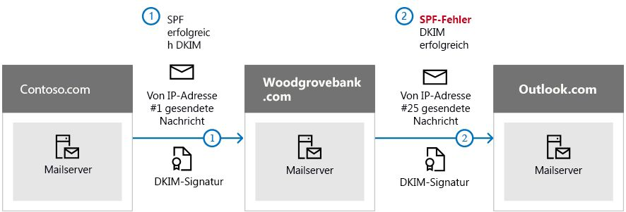

# <a name="use-dkim-to-validate-outbound-email-sent-from-your-custom-domain-in-office-365"></a><span data-ttu-id="ddc27-103">Verwenden von DKIM zum Überprüfen ausgehender E-Mails, die von Ihrer benutzerdefinierten Domäne in Office 365 gesendet werden</span><span class="sxs-lookup"><span data-stu-id="ddc27-103">Use DKIM to validate outbound email sent from your custom domain in Office 365</span></span>

 <span data-ttu-id="ddc27-104">**Zusammenfassung:** In diesem Artikel wird beschrieben, wie Sie DomainKeys Identified Mail (DKIM) mit Office 365 verwenden, um sicherzustellen, dass Ziel-e-Mail-Systeme Nachrichten Vertrauen, die von Ihrer benutzerdefinierten Domäne ausgehen.</span><span class="sxs-lookup"><span data-stu-id="ddc27-104">**Summary:** This article describes how you use DomainKeys Identified Mail (DKIM) with Office 365 to ensure that destination email systems trust messages sent outbound from your custom domain.</span></span> 
  
<span data-ttu-id="ddc27-p101">Sie sollten DKIM zusätzlich zu SPF und DMARC verwenden, um zu verhindern, dass Spoofers Nachrichten senden, die aussehen, als würden sie von Ihrer Domäne stammen. Mit DKIM können Sie E-Mail-Nachrichten in der Kopfzeile der Nachricht eine digitale Signatur hinzufügen. Klingt kompliziert, ist es aber nicht. Wenn Sie DKIM konfigurieren, autorisieren Sie Ihre Domäne mithilfe der kryptografischen Authentifizierung, ihren Namen mit einer E-Mail-Nachricht zu verknüpfen oder zu signieren. E-Mail-Systeme, die E-Mails von Ihrer Domäne empfangen, können diese digitale Signatur verwenden, um zu ermitteln, ob eingehende E-Mails legitim sind.</span><span class="sxs-lookup"><span data-stu-id="ddc27-p101">You should use DKIM in addition to SPF and DMARC to help prevent spoofers from sending messages that look like they are coming from your domain. DKIM lets you add a digital signature to email messages in the message header. Sounds complicated, but it's really not. When you configure DKIM, you authorize your domain to associate, or sign, its name to an email message by using cryptographic authentication. Email systems that receive email from your domain can use this digital signature to help determine if incoming email that they receive is legitimate.</span></span>
  
<span data-ttu-id="ddc27-p102">Im Wesentlichen verwenden Sie einen privaten Schlüssel zum Verschlüsseln der Kopfzeile in ausgehenden E-Mails Ihrer Domäne. Sie veröffentlichen einen öffentlichen Schlüssel für die DNS-Einträge Ihrer Domäne, die empfangende Server verwenden können, um die Signatur zu entschlüsseln. Sie verwenden den öffentlichen Schlüssel, um sicherzustellen, dass die Nachrichten wirklich von Ihnen und nicht von einer Person kommen, die Ihre Domäne mit Spoofing beschädigen möchte.</span><span class="sxs-lookup"><span data-stu-id="ddc27-p102">Basically, you use a private key to encrypt the header in your domain's outgoing email. You publish a public key to your domain's DNS records that receiving servers can then use to decode the signature. They use the public key to verify that the messages are really coming from you and not coming from someone spoofing your domain.</span></span>
  
<span data-ttu-id="ddc27-p103">Office 365 richtet DKIM automatisch für erste Domänen ein. Erste Domänen sind Domänen, die Office 365 für Sie erstellt, wenn Sie sich für den Dienst registrieren, z. B. „contoso.onmicrosoft.com". Sie müssen keine weiteren Aktionen durchführen, um DKIM für Ihre erste Domäne einzurichten. Weitere Informationen zu ersten Domänen finden Sie unter [Häufig gestellte Fragen zu Domänen](https://support.office.com/article/Domains-FAQ-1272bad0-4bd4-4796-8005-67d6fb3afc5a#bkmk_whydoihaveanonmicrosoft.comdomain).</span><span class="sxs-lookup"><span data-stu-id="ddc27-p103">Office 365 automatically sets up DKIM for initial domains. The initial domain is the domain that Office 365 created for you when you signed up with the service, for example, contoso.onmicrosoft.com. You don't need to do anything to set up DKIM for your initial domain. For more information about domains, see [Domains FAQ](https://support.office.com/article/Domains-FAQ-1272bad0-4bd4-4796-8005-67d6fb3afc5a#bkmk_whydoihaveanonmicrosoft.comdomain).</span></span>
  
<span data-ttu-id="ddc27-p104">Für DKIM für Ihre benutzerdefinierte Domäne müssen Sie ebenfalls nichts weiter unternehmen. Wenn Sie DKIM nicht für Ihre benutzerdefinierte Domäne einrichten, erstellt Office 365 ein Paar aus privatem und öffentlichem Schlüssel, aktiviert die DKIM-Signierung und konfiguriert die Office 365-Standardrichtlinie für Ihre benutzerdefinierte Domäne. Obwohl dies für die meisten Office 365-Kunden ausreicht, sollten Sie DKIM unter folgenden Umständen manuell für Ihre benutzerdefinierte Domäne konfigurieren:</span><span class="sxs-lookup"><span data-stu-id="ddc27-p104">You can choose to do nothing about DKIM for your custom domain too. If you do not set up DKIM for your custom domain, Office 365 creates a private and public key pair, enables DKIM signing, and then configures the Office 365 default policy for your custom domain. While this is sufficient coverage for most Office 365 customers, you should manually configure DKIM for your custom domain in the following circumstances:</span></span>
  
- <span data-ttu-id="ddc27-120">Sie haben mehr als eine benutzerdefinierte Domäne in Office 365.</span><span class="sxs-lookup"><span data-stu-id="ddc27-120">You have more than one custom domain in Office 365</span></span>
    
- <span data-ttu-id="ddc27-121">Sie richten auch DMARC ein (empfohlen).</span><span class="sxs-lookup"><span data-stu-id="ddc27-121">You're going to set up DMARC too (recommended)</span></span>
    
- <span data-ttu-id="ddc27-122">Sie möchten die Kontrolle über Ihren privaten Schlüssel.</span><span class="sxs-lookup"><span data-stu-id="ddc27-122">You want control over your private key</span></span>
    
- <span data-ttu-id="ddc27-123">Sie möchten Ihre CNAME-Einträge anpassen.</span><span class="sxs-lookup"><span data-stu-id="ddc27-123">You want to customize your CNAME records</span></span>
    
- <span data-ttu-id="ddc27-124">Sie möchten DKIM-Schlüssel für E-Mails von Drittanbieterdomänen einrichten, beispielsweise bei Verwendung eines Drittanbietermassenversenders von E-Mails.</span><span class="sxs-lookup"><span data-stu-id="ddc27-124">You want to set up DKIM keys for email originating out of a third-party domain, for example, if you use a third-party bulk mailer.</span></span>
    
<span data-ttu-id="ddc27-125">Inhalt dieses Artikels</span><span class="sxs-lookup"><span data-stu-id="ddc27-125">In this article:</span></span>
  
- [<span data-ttu-id="ddc27-126">So funktioniert DKIM besser als SPF, um Spoofing in Office 365 zu verhindern</span><span class="sxs-lookup"><span data-stu-id="ddc27-126">How DKIM works better than SPF alone to prevent malicious spoofing in Office 365</span></span>](use-dkim-to-validate-outbound-email.md#HowDKIMWorks)
    
- [<span data-ttu-id="ddc27-127">Schritte zum manuellen Einrichten von DKIM in Office 365</span><span class="sxs-lookup"><span data-stu-id="ddc27-127">What you need to do to manually set up DKIM in Office 365</span></span>](use-dkim-to-validate-outbound-email.md#SetUpDKIMO365)
    
- [<span data-ttu-id="ddc27-128">Konfigurieren von DKIM für mehrere benutzerdefinierte Domänen in Office 365</span><span class="sxs-lookup"><span data-stu-id="ddc27-128">To configure DKIM for more than one custom domain in Office 365</span></span>](use-dkim-to-validate-outbound-email.md#DKIMMultiDomain)
    
- [<span data-ttu-id="ddc27-129">Deaktivieren der DKIM-Signierungsrichtlinie für eine benutzerdefinierte Domäne in Office 365</span><span class="sxs-lookup"><span data-stu-id="ddc27-129">Disabling the DKIM signing policy for a custom domain in Office 365</span></span>](use-dkim-to-validate-outbound-email.md#DisableDKIMSigningPolicy)
    
- [<span data-ttu-id="ddc27-130">Standardverhalten für DKIM und Office 365</span><span class="sxs-lookup"><span data-stu-id="ddc27-130">Default behavior for DKIM and Office 365</span></span>](use-dkim-to-validate-outbound-email.md#DefaultDKIMbehavior)
    
- [<span data-ttu-id="ddc27-131">Einrichten von DKIM, damit ein Drittanbieterdienst E-Mails im Auftrag Ihrer benutzerdefinierten Domäne senden oder fälschen kann</span><span class="sxs-lookup"><span data-stu-id="ddc27-131">Set up DKIM so that a third-party service can send, or spoof, email on behalf of your custom domain</span></span>](use-dkim-to-validate-outbound-email.md#SetUp3rdPartyspoof)
    
- [<span data-ttu-id="ddc27-132">Nächste Schritte: Nach dem Einrichten von DKIM für Office 365</span><span class="sxs-lookup"><span data-stu-id="ddc27-132">Next steps: After you set up DKIM for Office 365</span></span>](use-dkim-to-validate-outbound-email.md#DKIMNextSteps)
    
## <a name="how-dkim-works-better-than-spf-alone-to-prevent-malicious-spoofing-in-office-365"></a><span data-ttu-id="ddc27-133">So funktioniert DKIM besser als SPF, um Spoofing in Office 365 zu verhindern</span><span class="sxs-lookup"><span data-stu-id="ddc27-133">How DKIM works better than SPF alone to prevent malicious spoofing in Office 365</span></span>
<span data-ttu-id="ddc27-134"><a name="HowDKIMWorks"> </a></span><span class="sxs-lookup"><span data-stu-id="ddc27-134"></span></span>

<span data-ttu-id="ddc27-p105">SPF fügt Informationen einem Nachrichtenumschlag hinzu, aber DKIM verschlüsselt tatsächlich eine Signatur in der Nachrichtenkopfzeile. Wenn Sie eine Nachricht weiterleiten, können Teile dieses Nachrichtenumschlags vom Weiterleitungsserver entfernt werden. Da die digitale Signatur bei der E-Mail-Nachricht bleibt, da er Teil der E-Mail-Kopfzeile ist, funktioniert DKIM selbst dann, wenn eine Nachricht weitergeleitet wurde, wie im folgenden Beispiel gezeigt.</span><span class="sxs-lookup"><span data-stu-id="ddc27-p105">SPF adds information to a message envelope but DKIM actually encrypts a signature within the message header. When you forward a message, portions of that message's envelope can be stripped away by the forwarding server. Since the digital signature stays with the email message because it's part of the email header, DKIM works even when a message has been forwarded as shown in the following example.</span></span>
  

  
<span data-ttu-id="ddc27-p106">Wenn Sie in diesem Beispiel nur einen SPF TXT-Eintrag für Ihre Domäne veröffentlicht hätten, könnte der E-Mail-Server des Empfängers Ihre E-Mail als Spam markiert und ein falsch positives Ergebnis generiert haben. Das Hinzufügen von DKIM in diesem Szenario reduziert die Meldung von falsch positivem Spam. Da DKIM die Verschlüsselung öffentlicher Schlüssel und nicht nur IP-Adressen zur Authentifizierung benötigt, wird DKIM als deutlich stärkere Form der Authentifizierung als SPF betrachtet. Wir empfehlen, SPF und DKIM sowie DMARC in Ihrer Bereitstellung zu verwenden.</span><span class="sxs-lookup"><span data-stu-id="ddc27-p106">In this example, if you had only published an SPF TXT record for your domain, the recipient's mail server could have marked your email as spam and generated a false positive result. The addition of DKIM in this scenario reduces false positive spam reporting. Because DKIM relies on public key cryptography to authenticate and not just IP addresses, DKIM is considered a much stronger form of authentication than SPF. We recommend using both SPF and DKIM, as well as DMARC in your deployment.</span></span>
  
<span data-ttu-id="ddc27-p107">Das Wesentliche: DKIM verwendet einen privaten Schlüssel, um eine verschlüsselte Signatur in die Nachrichtenkopfzeile einzufügen. Sie signierende oder ausgehende Domäne wird als Wert des Felds **d=** in die Kopfzeile eingefügt. Die überprüfende Domäne oder Empfängerdomäne verwendet dann das Feld **d=**, um den öffentlichen Schlüssel in DNS nachzuschlagen und die Nachricht zu authentifizieren. Wenn die Nachricht verifiziert wird, ist die DKIM-Überprüfung erfolgreich.</span><span class="sxs-lookup"><span data-stu-id="ddc27-p107">The nitty gritty: DKIM uses a private key to insert an encrypted signature into the message headers. The signing domain, or outbound domain, is inserted as the value of the **d=** field in the header. The verifying domain, or recipient's domain, then use the **d=** field to look up the public key from DNS and authenticate the message. If the message is verified, the DKIM check passes.</span></span> 
  
## <a name="what-you-need-to-do-to-manually-set-up-dkim-in-office-365"></a><span data-ttu-id="ddc27-147">Schritte zum manuellen Einrichten von DKIM in Office 365</span><span class="sxs-lookup"><span data-stu-id="ddc27-147">What you need to do to manually set up DKIM in Office 365</span></span>
<span data-ttu-id="ddc27-148"><a name="SetUpDKIMO365"> </a></span><span class="sxs-lookup"><span data-stu-id="ddc27-148"></span></span>

<span data-ttu-id="ddc27-149">Um DKIM zu konfigurieren, müssen Sie diese Schritte ausführen:</span><span class="sxs-lookup"><span data-stu-id="ddc27-149">To configure DKIM, you will complete these steps:</span></span>
  
- [<span data-ttu-id="ddc27-150">Veröffentlichen von zwei CNAME-Einträgen für Ihre benutzerdefinierte Domäne in DNS</span><span class="sxs-lookup"><span data-stu-id="ddc27-150">Publish two CNAME records for your custom domain in DNS</span></span>](use-dkim-to-validate-outbound-email.md#Publish2CNAME)
    
- [<span data-ttu-id="ddc27-151">Aktivieren der DKIM-Signierung für Ihre benutzerdefinierte Domäne in Office 365</span><span class="sxs-lookup"><span data-stu-id="ddc27-151">Enable DKIM signing for your custom domain in Office 365</span></span>](use-dkim-to-validate-outbound-email.md#EnableDKIMinO365)
    
### <a name="publish-two-cname-records-for-your-custom-domain-in-dns"></a><span data-ttu-id="ddc27-152">Veröffentlichen von zwei CNAME-Einträgen für Ihre benutzerdefinierte Domäne in DNS</span><span class="sxs-lookup"><span data-stu-id="ddc27-152">Publish two CNAME records for your custom domain in DNS</span></span>
<span data-ttu-id="ddc27-153"><a name="Publish2CNAME"> </a></span><span class="sxs-lookup"><span data-stu-id="ddc27-153"></span></span>

<span data-ttu-id="ddc27-154">Für jede Domäne, für die Sie eine DKIM-Signatur in DNS hinzufügen möchten, müssen Sie zwei CNAME-Einträge veröffentlichen.</span><span class="sxs-lookup"><span data-stu-id="ddc27-154">For each domain for which you want to add a DKIM signature in DNS, you need to publish two CNAME records.</span></span> <span data-ttu-id="ddc27-155">Ein CNAME-Eintrag wird von DNS verwendet, um anzugeben, dass der kanonische Name einer Domäne ein Alias für einen anderen Domänennamen ist.</span><span class="sxs-lookup"><span data-stu-id="ddc27-155">A CNAME record is used by DNS to specify that the canonical name of a domain is an alias for another domain name.</span></span> <span data-ttu-id="ddc27-156">Die CNAME-Einträge sollten auf den öffentlich verfügbaren DNS-Servern für Ihre angepassten Domänen erstellt werden.</span><span class="sxs-lookup"><span data-stu-id="ddc27-156">The CNAME records should be created on the publicly available DNS servers for your customized domains.</span></span> <span data-ttu-id="ddc27-157">Die CNAME-Einträge in Ihrem DNS verweisen auf bereits erstellte Datensätze, die in DNS auf den Microsoft-DNS-Servern für Office 365 vorhanden sind.</span><span class="sxs-lookup"><span data-stu-id="ddc27-157">The CNAME records in your DNS will point to already created A records that exist in DNS on the Microsoft DNS servers for Office 365.</span></span>
  
 <span data-ttu-id="ddc27-p109">Office 365 führt die automatische Schlüsselrotation unter Verwendung der beiden eingerichteten Datensätze durch. Wenn Sie neben der ersten Domäne zusätzliche benutzerdefinierte Domänen in Office 365 bereitgestellt haben, müssen Sie zwei CNAME-Einträge für jede zusätzliche Domäne veröffentlichen. Wenn Sie also zwei Domänen haben, müssen Sie zwei zusätzliche CNAME-Einträge veröffentlichen usw.</span><span class="sxs-lookup"><span data-stu-id="ddc27-p109">Office 365 performs automatic key rotation using the two records that you establish. If you have provisioned custom domains in addition to the initial domain in Office 365, you must publish two CNAME records for each additional domain. So, if you have two domains, you must publish two additional CNAME records, and so on.</span></span>
  
<span data-ttu-id="ddc27-161">Verwenden Sie das folgende Format für die CNAME-Einträge.</span><span class="sxs-lookup"><span data-stu-id="ddc27-161">Use the following format for the CNAME records.</span></span>

> [!IMPORTANT]
> <span data-ttu-id="ddc27-162">Wenn Sie einer unserer GCC-High-Kunden sind, berechnen wir _domainGuid_ unterschiedlich!</span><span class="sxs-lookup"><span data-stu-id="ddc27-162">If you are one of our GCC High customers, we calculate _domainGuid_ differently!</span></span> <span data-ttu-id="ddc27-163">Anstatt den MX-Eintrag für Ihre _initialDomain_ zum Berechnen von _domainGuid_zu suchen, berechnen wir Sie direkt aus der angepassten Domäne.</span><span class="sxs-lookup"><span data-stu-id="ddc27-163">Instead of looking up the MX record for your _initialDomain_ to calculate _domainGuid_, instead we calculate it directly from the customized domain.</span></span> <span data-ttu-id="ddc27-164">Wenn Ihre angepasste Domäne beispielsweise "contoso.com" ist, wird Ihr domainGuid zu "contoso-com", und alle Zeiträume werden durch einen Strich ersetzt.</span><span class="sxs-lookup"><span data-stu-id="ddc27-164">For example, if your customized domain is “contoso.com” your domainGuid becomes “contoso-com”, any periods are replaced with a dash.</span></span> <span data-ttu-id="ddc27-165">Unabhängig davon, auf welchen MX-Eintrag Ihr initialDomain verweist, verwenden Sie daher immer die obige Methode, um die domainGuid zu berechnen, die in Ihren CNAME-Datensätzen verwendet werden soll.</span><span class="sxs-lookup"><span data-stu-id="ddc27-165">So, regardless of what MX record your initialDomain points to, you’ll always use the above method to calculate the domainGuid to use in your CNAME records.</span></span>

  
```
Host name:          selector1._domainkey
Points to address or value: selector1-<domainGUID>._domainkey.<initialDomain> 
TTL:                3600

Host name:          selector2._domainkey
Points to address or value: selector2-<domainGUID>._domainkey.<initialDomain> 
TTL:                3600
```

<span data-ttu-id="ddc27-166">Dabei gilt Folgendes:</span><span class="sxs-lookup"><span data-stu-id="ddc27-166">Where:</span></span>
  
- <span data-ttu-id="ddc27-167">Für Office 365 sind die Selektoren immer „selector1" oder „selector2".</span><span class="sxs-lookup"><span data-stu-id="ddc27-167">For Office 365, the selectors will always be "selector1" or "selector2".</span></span> 
    
- <span data-ttu-id="ddc27-168">_domainGUID_ ist identisch mit _domainGUID_ im angepassten MX-Eintrag für Ihre benutzerdefinierte Domäne, der vor „mail.protection.outlook.com“ angezeigt wird.</span><span class="sxs-lookup"><span data-stu-id="ddc27-168">_domainGUID_ is the same as the _domainGUID_ in the customized MX record for your custom domain that appears before mail.protection.outlook.com.</span></span> <span data-ttu-id="ddc27-169">Im folgenden MX-Eintrag für die Domäne „contoso.com“ ist die _domainGUID_ z. B. „contoso-com“:</span><span class="sxs-lookup"><span data-stu-id="ddc27-169">For example, in the following MX record for the domain contoso.com, the _domainGUID_ is contoso-com:</span></span> 
    
    ```
    contoso.com.  3600  IN  MX   5 contoso-com.mail.protection.outlook.com
    ```

- <span data-ttu-id="ddc27-170">_initialDomain_ ist die Domäne, die Sie bei der Anmeldung für Office 365 verwendet haben.</span><span class="sxs-lookup"><span data-stu-id="ddc27-170">_initialDomain_ is the domain that you used when you signed up for Office 365.</span></span> <span data-ttu-id="ddc27-171">Anfängliche Domänen enden immer in onmicrosoft.com.</span><span class="sxs-lookup"><span data-stu-id="ddc27-171">Initial domains always end in onmicrosoft.com.</span></span> <span data-ttu-id="ddc27-172">Informationen zum Ermitteln Ihrer ersten Domäne finden Sie unter [Häufig gestellte Fragen zu Domänen](https://support.office.com/article/1272bad0-4bd4-4796-8005-67d6fb3afc5a#bkmk_whydoihaveanonmicrosoft.comdomain).</span><span class="sxs-lookup"><span data-stu-id="ddc27-172">For information about determining your initial domain, see [Domains FAQ](https://support.office.com/article/1272bad0-4bd4-4796-8005-67d6fb3afc5a#bkmk_whydoihaveanonmicrosoft.comdomain).</span></span>
    
<span data-ttu-id="ddc27-173">Wenn Sie beispielsweise als erste Domäne „cohovineyardandwinery.onmicrosoft.com" und zwei benutzerdefinierte Domänen „cohovineyard.com" und „cohowinery.com" haben, müssten Sie zwei CNAME-Einträge für jede zusätzliche Domäne einrichten, also insgesamt vier CNAME-Einträge.</span><span class="sxs-lookup"><span data-stu-id="ddc27-173">For example, if you have an initial domain of cohovineyardandwinery.onmicrosoft.com, and two custom domains cohovineyard.com and cohowinery.com, you would need to set up two CNAME records for each additional domain, for a total of four CNAME records.</span></span>
  
```
Host name:          selector1._domainkey
Points to address or value: **selector1-cohovineyard-com**._domainkey.cohovineyardandwinery.onmicrosoft.com
TTL:                3600

Host name:          selector2._domainkey
Points to address or value: **selector2-cohovineyard-com**._domainkey.cohovineyardandwinery.onmicrosoft.com
TTL:                3600

Host name:          selector1._domainkey
Points to address or value: **selector1-cohowinery-com**._domainkey.cohovineyardandwinery.onmicrosoft.com 
TTL:                3600
 
Host name:          selector2._domainkey
Points to address or value: **selector2-cohowinery-com**._domainkey.cohovineyardandwinery.onmicrosoft.com 
TTL:                3600
```

### <a name="enable-dkim-signing-for-your-custom-domain-in-office-365"></a><span data-ttu-id="ddc27-174">Aktivieren der DKIM-Signierung für Ihre benutzerdefinierte Domäne in Office 365</span><span class="sxs-lookup"><span data-stu-id="ddc27-174">Enable DKIM signing for your custom domain in Office 365</span></span>
<span data-ttu-id="ddc27-175"><a name="EnableDKIMinO365"> </a></span><span class="sxs-lookup"><span data-stu-id="ddc27-175"></span></span>

<span data-ttu-id="ddc27-p113">Nachdem Sie die CNAME-Einträge im DNS veröffentlicht haben, können Sie die DKIM-Signierung über Office 365 aktivieren. Sie können dies über das Office 365 Admin Center oder mithilfe von PowerShell durchführen.</span><span class="sxs-lookup"><span data-stu-id="ddc27-p113">Once you have published the CNAME records in DNS, you are ready to enable DKIM signing through Office 365. You can do this either through the Office 365 admin center or by using PowerShell.</span></span>
  
#### <a name="to-enable-dkim-signing-for-your-custom-domain-through-the-office-365-admin-center"></a><span data-ttu-id="ddc27-178">So aktivieren Sie die DKIM-Signierung für Ihre benutzerdefinierte Domäne über das Office 365 Admin Center</span><span class="sxs-lookup"><span data-stu-id="ddc27-178">To enable DKIM signing for your custom domain through the Office 365 admin center</span></span>

1. <span data-ttu-id="ddc27-179">[Melden Sie sich bei Office 365](https://support.office.microsoft.com/article/e9eb7d51-5430-4929-91ab-6157c5a050b4) mit Ihrem Arbeits- oder Schulkonto an.</span><span class="sxs-lookup"><span data-stu-id="ddc27-179">[Sign in to Office 365](https://support.office.microsoft.com/article/e9eb7d51-5430-4929-91ab-6157c5a050b4) with your work or school account.</span></span> 
    
2. <span data-ttu-id="ddc27-180">Klicken Sie oben links auf das App-Startsymbol , und wählen Sie **Admin** aus.</span><span class="sxs-lookup"><span data-stu-id="ddc27-180">Select the app launcher icon in the upper-left and choose **Admin**.</span></span>
    
3. <span data-ttu-id="ddc27-181">Erweitern Sie im unteren linken Navigationsbereich **Admin**, und klicken Sie dann auf **Exchange**.</span><span class="sxs-lookup"><span data-stu-id="ddc27-181">In the lower-left navigation, expand **Admin** and choose **Exchange**.</span></span>
    
4. <span data-ttu-id="ddc27-182">Wechseln Sie zu **Schutz** \> **dkim**.</span><span class="sxs-lookup"><span data-stu-id="ddc27-182">Go to **Protection** \> **dkim**.</span></span>
    
5. <span data-ttu-id="ddc27-p114">Wählen Sie die Domäne aus, für die Sie DKIM aktivieren möchten, und wählen Sie dann für **Nachrichten für diese Domäne mit DKIM-Signaturen signieren** die Option **Aktivieren** aus. Wiederholen Sie diesen Schritt für jede benutzerdefinierte Domäne.</span><span class="sxs-lookup"><span data-stu-id="ddc27-p114">Select the domain for which you want to enable DKIM and then, for **Sign messages for this domain with DKIM signatures**, choose **Enable**. Repeat this step for each custom domain.</span></span>
    
#### <a name="to-enable-dkim-signing-for-your-custom-domain-by-using-powershell"></a><span data-ttu-id="ddc27-185">So aktivieren Sie die DKIM-Signierung für Ihre benutzerdefinierte Domäne mit PowerShell</span><span class="sxs-lookup"><span data-stu-id="ddc27-185">To enable DKIM signing for your custom domain by using PowerShell</span></span>

1. <span data-ttu-id="ddc27-186">[Stellen Sie eine Verbindung mit Exchange Online PowerShell her](https://technet.microsoft.com/library/jj984289.aspx).</span><span class="sxs-lookup"><span data-stu-id="ddc27-186">[Connect to Exchange Online PowerShell](https://technet.microsoft.com/library/jj984289.aspx).</span></span>
    
2. <span data-ttu-id="ddc27-187">Führen Sie den folgenden Befehl aus:</span><span class="sxs-lookup"><span data-stu-id="ddc27-187">Run the following command:</span></span>
    
    ```
    New-DkimSigningConfig -DomainName <domain> -Enabled $true
    ```

   <span data-ttu-id="ddc27-188">Dabei ist _Domain_ der Name der benutzerdefinierten Domäne, für die Sie die DKIM-Signierung aktivieren möchten.</span><span class="sxs-lookup"><span data-stu-id="ddc27-188">Where _domain_ is the name of the custom domain that you want to enable DKIM signing for.</span></span> 
    
   <span data-ttu-id="ddc27-189">Beispiel für die Domäne „contoso.com“:</span><span class="sxs-lookup"><span data-stu-id="ddc27-189">For example, for the domain contoso.com:</span></span>
    
    ```
    New-DkimSigningConfig -DomainName contoso.com -Enabled $true
    ```

#### <a name="to-confirm-dkim-signing-is-configured-properly-for-office-365"></a><span data-ttu-id="ddc27-190">So bestätigen Sie, dass die DKIM-Signierung ordnungsgemäß für Office 365 konfiguriert ist</span><span class="sxs-lookup"><span data-stu-id="ddc27-190">To Confirm DKIM signing is configured properly for Office 365</span></span>

<span data-ttu-id="ddc27-p115">Warten Sie einige Minuten, bevor Sie diese Schritte ausführen, um zu bestätigen, dass Sie DKIM ordnungsgemäß konfiguriert haben. Dadurch ist genug Zeit vorhanden, um die DKIM-Informationen zur Domäne im gesamten Netzwerk zu verteilen.</span><span class="sxs-lookup"><span data-stu-id="ddc27-p115">Wait a few minutes before you follow these steps to confirm that you have properly configured DKIM. This allows time for the DKIM information about the domain to be spread throughout the network.</span></span>
  
- <span data-ttu-id="ddc27-193">Senden Sie eine Nachricht von einem Konto in Ihrer Office 365-Domäne mit aktiviertem DKIM an ein anderes E-Mail-Konto wie „outlook.com" oder „Hotmail.com".</span><span class="sxs-lookup"><span data-stu-id="ddc27-193">Send a message from an account within your Office 365 DKIM-enabled domain to another email account such as outlook.com or Hotmail.com.</span></span>
    
- <span data-ttu-id="ddc27-p116">Verwenden Sie zu Testzwecken kein „aol.com"-Konto. AOL überspringt möglicherweise die DKIM-Überprüfung, wenn die SPF-Prüfung erfolgreich ist. Dadurch hat der Test keine Relevanz.</span><span class="sxs-lookup"><span data-stu-id="ddc27-p116">Do not use an aol.com account for testing purposes. AOL may skip the DKIM check if the SPF check passes. This will nullify your test.</span></span>
    
- <span data-ttu-id="ddc27-p117">Öffnen Sie die Nachricht, und sehen Sie sich die Überschrift an. Anweisungen zum Anzeigen der Kopfzeile der Nachricht variieren je nach Messagingclient. Anweisungen zum Anzeigen der Kopfzeilen von Nachrichten in Outlook finden Sie unter [Anzeigen der Kopfzeilen von E-Mail-Nachrichten](https://support.office.com/article/CD039382-DC6E-4264-AC74-C048563D212C).</span><span class="sxs-lookup"><span data-stu-id="ddc27-p117">Open the message and look at the header. Instructions for viewing the header for the message will vary depending on your messaging client. For instructions on viewing message headers in Outlook, see [View e-mail message headers](https://support.office.com/article/CD039382-DC6E-4264-AC74-C048563D212C).</span></span>

  <span data-ttu-id="ddc27-p118">Die mit DKIM signierte Nachricht enthält den Hostnamen und die Domäne, die Sie definiert haben, wenn Sie die CNAME-Einträge veröffentlicht haben. Die Nachricht sieht in etwa wie im folgenden Beispiel aus:</span><span class="sxs-lookup"><span data-stu-id="ddc27-p118">The DKIM-signed message will contain the host name and domain you defined when you published the CNAME entries. The message will look something like this example:</span></span> 
    
    ```
    From: Example User <example@contoso.com> 
    DKIM-Signature: v=1; a=rsa-sha256; q=dns/txt; c=relaxed/relaxed; 
        s=selector1; d=contoso.com; t=1429912795; 
        h=From:To:Message-ID:Subject:MIME-Version:Content-Type; 
        bh=<body hash>; 
        b=<signed field>;
    ```

- <span data-ttu-id="ddc27-p119">Suchen Sie nach der „Authentication-Results"-Kopfzeile. Obwohl jeder empfangende Dienst ein geringfügig anderes Format verwendet, um die eingehenden E-Mail-Nachrichten mit Zeitstempeln zu versehen, sollte das Ergebnis immer etwas wie **DKIM=pass** oder **DKIM=OK** enthalten.</span><span class="sxs-lookup"><span data-stu-id="ddc27-p119">Look for the Authentication-Results header. While each receiving service uses a slightly different format to stamp the incoming mail, the result should include something like **DKIM=pass** or **DKIM=OK**.</span></span> 
    
## <a name="to-configure-dkim-for-more-than-one-custom-domain-in-office-365"></a><span data-ttu-id="ddc27-204">Konfigurieren von DKIM für mehrere benutzerdefinierte Domänen in Office 365</span><span class="sxs-lookup"><span data-stu-id="ddc27-204">To configure DKIM for more than one custom domain in Office 365</span></span>
<span data-ttu-id="ddc27-205"><a name="DKIMMultiDomain"> </a></span><span class="sxs-lookup"><span data-stu-id="ddc27-205"></span></span>

<span data-ttu-id="ddc27-p120">Wenn Sie zu einem bestimmten Zeitpunkt in der Zukunft eine weitere benutzerdefinierte Domäne hinzufügen und DKIM für die neue Domäne aktivieren möchten, müssen Sie die Schritte in diesem Artikel für jede Domäne ausführen. Schließen Sie insbesondere alle Schritte in [Schritte zum manuellen Einrichten von DKIM in Office 365](use-dkim-to-validate-outbound-email.md#SetUpDKIMO365) ab.</span><span class="sxs-lookup"><span data-stu-id="ddc27-p120">If at some point in the future you decide to add another custom domain and you want to enable DKIM for the new domain, you must complete the steps in this article for each domain. Specifically, complete all steps in [What you need to do to manually set up DKIM in Office 365](use-dkim-to-validate-outbound-email.md#SetUpDKIMO365).</span></span>
  
## <a name="disabling-the-dkim-signing-policy-for-a-custom-domain-in-office-365"></a><span data-ttu-id="ddc27-208">Deaktivieren der DKIM-Signierungsrichtlinie für eine benutzerdefinierte Domäne in Office 365</span><span class="sxs-lookup"><span data-stu-id="ddc27-208">Disabling the DKIM signing policy for a custom domain in Office 365</span></span>
<span data-ttu-id="ddc27-209"><a name="DisableDKIMSigningPolicy"> </a></span><span class="sxs-lookup"><span data-stu-id="ddc27-209"></span></span>

<span data-ttu-id="ddc27-p121">Durch das Deaktivieren der Signierungsrichtlinie wird DKIM nicht vollständig deaktiviert. Nach einer bestimmten Zeitspanne übernimmt Office 365 automatisch die Office 365- Standardrichtlinie für Ihre Domäne. Weitere Informationen finden Sie unter [Standardverhalten für DKIM und Office 365](use-dkim-to-validate-outbound-email.md#DefaultDKIMbehavior).</span><span class="sxs-lookup"><span data-stu-id="ddc27-p121">Disabling the signing policy does not completely disable DKIM. After a period of time, Office 365 will automatically apply the default Office 365 policy for your domain. For more information, see [Default behavior for DKIM and Office 365](use-dkim-to-validate-outbound-email.md#DefaultDKIMbehavior).</span></span>
  
### <a name="to-disable-the-dkim-signing-policy-by-using-windows-powershell"></a><span data-ttu-id="ddc27-213">So deaktivieren Sie die DKIM-Signierungsrichtlinie mithilfe von Windows PowerShell</span><span class="sxs-lookup"><span data-stu-id="ddc27-213">To disable the DKIM signing policy by using Windows PowerShell</span></span>

1. <span data-ttu-id="ddc27-214">[Stellen Sie eine Verbindung mit Exchange Online PowerShell her](https://technet.microsoft.com/library/jj984289.aspx).</span><span class="sxs-lookup"><span data-stu-id="ddc27-214">[Connect to Exchange Online PowerShell](https://technet.microsoft.com/library/jj984289.aspx).</span></span>
    
2. <span data-ttu-id="ddc27-215">Führen Sie einen der folgenden Befehle für jede Domäne aus, für die Sie die DKIM-Signierung deaktivieren möchten.</span><span class="sxs-lookup"><span data-stu-id="ddc27-215">Run one of the following commands for each domain for which you want to disable DKIM signing.</span></span>
    
    ```
    $p=Get-DkimSigningConfig -identity <domain>
    $p[0] | set-DkimSigningConfig -enabled $false
    ```

   <span data-ttu-id="ddc27-216">Beispiel:</span><span class="sxs-lookup"><span data-stu-id="ddc27-216">For example:</span></span>
    
    ```
    $p=Get-DkimSigningConfig -identity contoso.com
    $p[0] | set-DkimSigningConfig -enabled $false
    ```

   <span data-ttu-id="ddc27-217">oder -</span><span class="sxs-lookup"><span data-stu-id="ddc27-217">Or</span></span>
    
    ```
    Set-DkimSigningConfig -identity $p[<number>].identity -enabled $false
    ```

    <span data-ttu-id="ddc27-218">Wobei _Number_ der Index der Richtlinie ist.</span><span class="sxs-lookup"><span data-stu-id="ddc27-218">Where _number_ is the index of the policy.</span></span> <span data-ttu-id="ddc27-219">Beispiel:</span><span class="sxs-lookup"><span data-stu-id="ddc27-219">For example:</span></span> 
    
    ```
    Set-DkimSigningConfig -identity $p[0].identity -enabled $false
    ```

## <a name="default-behavior-for-dkim-and-office-365"></a><span data-ttu-id="ddc27-220">Standardverhalten für DKIM und Office 365</span><span class="sxs-lookup"><span data-stu-id="ddc27-220">Default behavior for DKIM and Office 365</span></span>
<span data-ttu-id="ddc27-221"><a name="DefaultDKIMbehavior"> </a></span><span class="sxs-lookup"><span data-stu-id="ddc27-221"></span></span>

<span data-ttu-id="ddc27-p123">Wenn Sie DKIM nicht aktivieren, erstellt Office 365 automatisch einen öffentlichen 1024-Bit-DKIM-Schlüssel für Ihre benutzerdefinierte Domäne und den zugehörigen privaten Schlüssel, der intern in unserem Rechenzentrum gespeichert wird. Standardmäßig verwendet Office 365 eine standardmäßige Signierkonfiguration für Domänen, die keine Richtlinie eingerichtet haben. Dies bedeutet, dass, wenn Sie DKIM nicht selbst einrichten, Office 365 seine Standardrichtlinie und Standardschlüssel verwendet, die erstellt wurden, um DKIM für Ihre Domäne zu aktivieren.</span><span class="sxs-lookup"><span data-stu-id="ddc27-p123">If you do not enable DKIM, Office 365 automatically creates a 1024-bit DKIM public key for your custom domain and the associated private key which we store internally in our datacenter. By default, Office 365 uses a default signing configuration for domains that do not have a policy in place. This means that if you do not set up DKIM yourself, Office 365 will use its default policy and keys it creates in order to enable DKIM for your domain.</span></span>
  
<span data-ttu-id="ddc27-225">Wenn Sie die DKIM-Signatur nach der Aktivierung nach einer bestimmten Zeit wieder deaktivieren, wendet Office 365 automatisch die Office 365-Standardrichtlinie für Ihre Domäne an.</span><span class="sxs-lookup"><span data-stu-id="ddc27-225">Also, if you disable DKIM signing after enabling it, after a period of time, Office 365 will automatically apply the Office 365 default policy for your domain.</span></span>
  
<span data-ttu-id="ddc27-p124">Im folgenden Beispiel wird angenommen, dass DKIM für „fabrikam.com" durch Office 365 und nicht durch den Administrator der Domäne aktiviert wurde. Das bedeutet, dass die erforderlichen CNAME-Einträge nicht in DNS vorhanden sind. DKIM-Signaturen für E-Mail-Nachrichten aus dieser Domäne sehen in etwa wie folgt aus:</span><span class="sxs-lookup"><span data-stu-id="ddc27-p124">In the following example, suppose that DKIM for fabrikam.com was enabled by Office 365, not by the administrator of the domain. This means that the required CNAMEs do not exist in DNS. DKIM signatures for email from this domain will look something like this:</span></span>
  
```
From: Second Example <second.example@fabrikam.com> 
DKIM-Signature: v=1; a=rsa-sha256; q=dns/txt; c=relaxed/relaxed; 
    s=selector1-fabrikam-com; d=contoso.onmicrosoft.com; t=1429912795; 
    h=From:To:Message-ID:Subject:MIME-Version:Content-Type; 
    bh=<body hash>; 
    b=<signed field>;
```

<span data-ttu-id="ddc27-p125">In this example, the host name and domain contain the values to which the CNAME would point if DKIM-signing for fabrikam.com had been enabled by the domain administrator. Eventually, every single message sent from Office 365 will be DKIM-signed. If you enable DKIM yourself, the domain will be the same as the domain in the From: address, in this case fabrikam.com. If you don't, it will not align and instead will use your organization's initial domain. For information about determining your initial domain, see [Domains FAQ](https://support.office.com/article/1272bad0-4bd4-4796-8005-67d6fb3afc5a#bkmk_whydoihaveanonmicrosoft.comdomain).</span><span class="sxs-lookup"><span data-stu-id="ddc27-p125">In this example, the host name and domain contain the values to which the CNAME would point if DKIM-signing for fabrikam.com had been enabled by the domain administrator. Eventually, every single message sent from Office 365 will be DKIM-signed. If you enable DKIM yourself, the domain will be the same as the domain in the From: address, in this case fabrikam.com. If you don't, it will not align and instead will use your organization's initial domain. For information about determining your initial domain, see [Domains FAQ](https://support.office.com/article/1272bad0-4bd4-4796-8005-67d6fb3afc5a#bkmk_whydoihaveanonmicrosoft.comdomain).</span></span>
  
## <a name="set-up-dkim-so-that-a-third-party-service-can-send-or-spoof-email-on-behalf-of-your-custom-domain"></a><span data-ttu-id="ddc27-234">Einrichten von DKIM, damit ein Drittanbieterdienst E-Mails im Auftrag Ihrer benutzerdefinierten Domäne senden oder fälschen kann</span><span class="sxs-lookup"><span data-stu-id="ddc27-234">Set up DKIM so that a third-party service can send, or spoof, email on behalf of your custom domain</span></span>
<span data-ttu-id="ddc27-235"><a name="SetUp3rdPartyspoof"> </a></span><span class="sxs-lookup"><span data-stu-id="ddc27-235"></span></span>

<span data-ttu-id="ddc27-p126">Bei einigen Massen-E-Mail-Dienstanbietern oder Software-as-a-Service-Anbietern können Sie DKIM-Schlüssel für E-Mails einrichten, die von diesem Dienst stammen. Dies erfordert eine Koordination zwischen Ihnen und dem Drittanbieter, damit die erforderlichen DNS-Einträge eingerichtet werden können. Keine zwei Organisationen führen dies auf die gleiche Weise durch. Der Prozess hängt vollständig von der Organisation ab.</span><span class="sxs-lookup"><span data-stu-id="ddc27-p126">Some bulk email service providers, or software-as-a-service providers, let you set up DKIM keys for email that originates from their service. This requires coordination between yourself and the third-party in order to set up the necessary DNS records. No two organizations do it exactly the same way. Instead, the process depends entirely on the organization.</span></span>
  
<span data-ttu-id="ddc27-240">Eine Beispielnachricht mit einer ordnungsgemäßen DKIM-Konfiguration für contoso.com und bulkemailprovider.com kann wie folgt aussehen:</span><span class="sxs-lookup"><span data-stu-id="ddc27-240">An example message showing a properly configured DKIM for contoso.com and bulkemailprovider.com might look like this:</span></span>
  
```
Return-Path: <communication@bulkemailprovider.com>
 From: <sender@contoso.com>
 DKIM-Signature: s=s1024; d=contoso.com
 Subject: Here is a message from Bulk Email Provider's infrastructure, but with a DKIM signature authorized by contoso.com
```

<span data-ttu-id="ddc27-241">In diesem Beispiel sind zu diesem Zweck die folgenden Schritte erforderlich:</span><span class="sxs-lookup"><span data-stu-id="ddc27-241">In this example, in order to achieve this result:</span></span>
  
1. <span data-ttu-id="ddc27-242">Der Massen-E-Mail-Anbieter hat einen öffentlichen DKIM-Schlüssel für Contoso bereitgestellt.</span><span class="sxs-lookup"><span data-stu-id="ddc27-242">Bulk Email Provider gave Contoso a public DKIM key.</span></span>
    
2. <span data-ttu-id="ddc27-243">Contoso hat den DKIM-Schlüssel für den DNS-Eintrag veröffentlicht.</span><span class="sxs-lookup"><span data-stu-id="ddc27-243">Contoso published the DKIM key to its DNS record.</span></span>
    
3. <span data-ttu-id="ddc27-p127">Beim Senden der E-Mail signiert der Massen-E-Mail-Anbieter den Schlüssel mit dem entsprechenden privaten Schlüssel. So hat der Massen-E-Mail-Anbieter die DKIM-Signatur an die Kopfzeile der Nachricht angefügt.</span><span class="sxs-lookup"><span data-stu-id="ddc27-p127">When sending email, Bulk Email Provider signs the key with the corresponding private key. By doing so, Bulk Email Provider attached the DKIM signature to the message header.</span></span>
    
4. <span data-ttu-id="ddc27-p128">Beim Empfangen von E-Mails führen Systeme eine DKIM-Überprüfung durch, indem der d=\<Domäne\>-Wert der DKIM-Signatur mit der Domäne im Feld „Von: (5322.From)" der Nachricht verglichen wird. In diesem Beispiel entsprechen die Werte den folgenden:</span><span class="sxs-lookup"><span data-stu-id="ddc27-p128">Receiving email systems perform a DKIM check by authenticating the DKIM-Signature d=\<domain\> value against the domain in the From: (5322.From) address of the message. In this example, the values match:</span></span>
    
    <span data-ttu-id="ddc27-248">Absender @**contoso.com**</span><span class="sxs-lookup"><span data-stu-id="ddc27-248">sender@**contoso.com**</span></span>
    
    <span data-ttu-id="ddc27-249">d =**contoso.com**</span><span class="sxs-lookup"><span data-stu-id="ddc27-249">d=**contoso.com**</span></span>
    
## <a name="next-steps-after-you-set-up-dkim-for-office-365"></a><span data-ttu-id="ddc27-250">Nächste Schritte: Nach dem Einrichten von DKIM für Office 365</span><span class="sxs-lookup"><span data-stu-id="ddc27-250">Next steps: After you set up DKIM for Office 365</span></span>
<span data-ttu-id="ddc27-251"><a name="DKIMNextSteps"> </a></span><span class="sxs-lookup"><span data-stu-id="ddc27-251"></span></span>

<span data-ttu-id="ddc27-252">Obwohl DKIM Spoofing verhindern soll, funktioniert DKIM besser mit SPF und DMARC.</span><span class="sxs-lookup"><span data-stu-id="ddc27-252">Although DKIM is designed to help prevent spoofing, DKIM works better with SPF and DMARC.</span></span> <span data-ttu-id="ddc27-253">Sobald Sie DKIM eingerichtet haben, sollten Sie auch SPF einrichten, falls noch nicht geschehen.</span><span class="sxs-lookup"><span data-stu-id="ddc27-253">Once you have set up DKIM, if you have not already set up SPF you should do so.</span></span> <span data-ttu-id="ddc27-254">Eine kurze Einführung in SPF und die schnelle Konfiguration finden Sie unter [Set up SPF in Office 365 to help prevent spoofing](set-up-spf-in-office-365-to-help-prevent-spoofing.md).</span><span class="sxs-lookup"><span data-stu-id="ddc27-254">For a quick introduction to SPF and to get it configured quickly, see [Set up SPF in Office 365 to help prevent spoofing](set-up-spf-in-office-365-to-help-prevent-spoofing.md).</span></span> <span data-ttu-id="ddc27-255">Ausführlichere Informationen zur Verwendung von SPF durch Office 365 oder zur Problembehandlung oder zu nicht standardmäßigen Bereitstellungen, z. B. Hybridbereitstellungen, finden Sie unter [How Office 365 uses Sender Policy Framework (SPF) to prevent spoofing](how-office-365-uses-spf-to-prevent-spoofing.md).</span><span class="sxs-lookup"><span data-stu-id="ddc27-255">For a more in-depth understanding of how Office 365 uses SPF, or for troubleshooting or non-standard deployments such as hybrid deployments, start with [How Office 365 uses Sender Policy Framework (SPF) to prevent spoofing](how-office-365-uses-spf-to-prevent-spoofing.md).</span></span> <span data-ttu-id="ddc27-256">Lesen Sie anschließend [Verwenden von DMARC zum Überprüfen von E-Mails in Office 365](use-dmarc-to-validate-email.md).</span><span class="sxs-lookup"><span data-stu-id="ddc27-256">Next, see [Use DMARC to validate email in Office 365](use-dmarc-to-validate-email.md).</span></span> <span data-ttu-id="ddc27-257">[Antispam-Nachrichtenkopfzeilen](anti-spam-message-headers.md) umfasst die Syntax-und Kopfzeilenfelder, die von Office 365 für DKIM-Prüfungen verwendet werden.</span><span class="sxs-lookup"><span data-stu-id="ddc27-257">[Anti-spam message headers](anti-spam-message-headers.md) includes the syntax and header fields used by Office 365 for DKIM checks.</span></span> 
  

