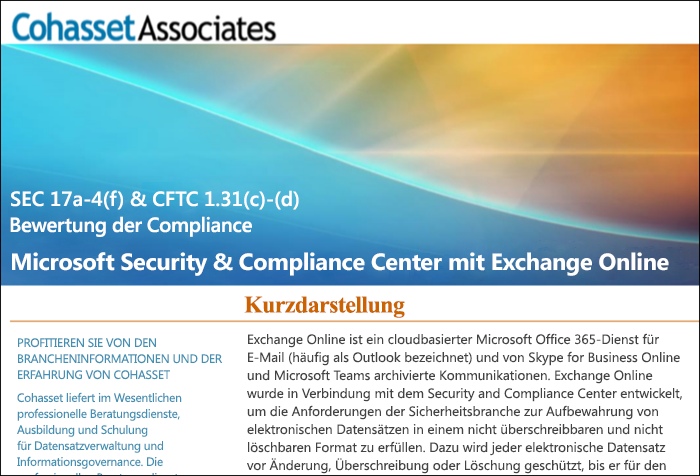

# Verwenden Sie Exchange Online und das Security & Compliance Center, um die SEC-Richtlinie 17a-4 einzuhalten

Wenn Ihre Organisation gesetzliche Standards für die Aufbewahrung von Daten einhalten muss, bietet das Office 365 Security & Compliance Center Features zur Verwaltung des Lebenszyklus Ihrer Daten in Exchange Online. Dies schließt die Fähigkeit ein, Ihre Daten aufzubewahren, zu überwachen, zu durchsuchen und zu exportieren. Diese Funktionen reichen aus, um die Anforderungen der meisten Organisationen zu erfüllen.

Einige Organisationen in stark regulierten Branchen unterliegen jedoch stringenteren aufsichtsrechtlichen Anforderungen. Finanzinstitute wie Banken oder Broker-Händler unterliegen beispielsweise der Richtlinie 17a-4 der Securities and Exchange Commission (SEC). Die Richtlinie 17a-4 enthält spezielle Anforderungen an die elektronische Datenspeicherung, darunter einige Aspekte der Aufzeichnungsverwaltung wie z. B. Dauer, Format, Qualität, Verfügbarkeit und Haftung für die Datenaufbewahrung.

Damit diese Organisationen besser verstehen, wie das Security & Compliance Center genutzt werden kann, um ihre gesetzlichen Auflagen für Exchange Online einzuhalten, insbesondere in Bezug auf die Anforderungen der Richtlinie 17a-4, haben wir in Zusammenarbeit mit Cohasset Associates eine Bewertung veröffentlicht.

Cohasset Associates bestätigt, dass Exchange Online und das Security & Compliance Center bei der empfohlenen Konfiguration die relevanten Speicheranforderungen der CFTC-Richtlinie 1.31(c)-(d), der FINRA-Richtlinie 4511 und der SEC-Richtlinie 17a-4 erfüllen. Diese Richtlinien wurden ausgewählt, da sie die ausführlichsten globalen Anleitungen für die Datenaufbewahrung für Finanzinstitute darstellen.

## Die Bewertung von Cohasset herunterladen

Sie können [hier die Bewertung von Cohasset herunterladen](https://servicetrust.microsoft.com/ViewPage/TrustDocuments?command=Download&downloadType=Document&downloadId=9fa8349d-a0c9-47d9-93ad-472aa0fa44ec&docTab=6d000410-c9e9-11e7-9a91-892aae8839ad_FAQ_and_White_Papers).

## Diese Bewertung ist beschränkt auf Exchange Online

Beachten Sie, dass diese Bewertung auf Exchange Online beschränkt ist. Die Bewertung umfasst keine anderen Office 365-Dienste wie SharePoint Online oder OneDrive for Business, obwohl in Zukunft der Support für diese Dienste unter Einhaltung der SEC 17a-4 geplant ist.

Es ist wichtig zu wissen, dass Skype for Business und Teams auch Daten Exchange Online speichert. Daher deckt die Bewertung auch Nachrichten von Skype for Business sowie Kanal- und Chatnachrichten von Teams ab.

## Die Verwendung der Erhaltungssperre ist für die empfohlene Konfiguration essentiell

In hochgradig regulierten Branchen müssen oft elektronische Kommunikationsdaten gespeichert werden, um die sogenannte WORM-Anforderung (write onde, read many) zu erfüllen. Die WORM-Anforderung schreibt eine Speicherlösung vor, in der folgende Voraussetzungen in Bezug auf Datensätze erfüllt werden müssen:

- Sie müssen über einen erforderlichen Aufbewahrungszeitraum gespeichert werden, der nicht verkürzt sondern nur verlängert werden kann.
- Sie müssen unveränderlich sein, d. h. Datensätze können während des erforderlichen Aufbewahrungszeitraums nicht überschrieben, gelöscht oder geändert werden.

Wenn Exchange Online eine [Aufbewahrungsrichtlinie](retention-policies.md) auf das Postfach eines Benutzers angewendet wird, werden alle Inhalte des Benutzers basierend auf den Kriterien der Richtlinie aufbewahrt. Wenn ein Benutzer eine E-Mail zu löschen oder zu ändern, wird eine Kopie der E-Mail im unveränderten Zustand an einem sicheren, versteckten Speicherort im Postfach des Benutzers abgelegt. Durch Aufbewahrungsrichtlinien kann sichergestellt werden, dass eine Organisation elektronische Kommunikationsdaten aufbewahrt, solche Richtlinien können jedoch verändert werden.

Durch das Anwenden einer Erhaltungssperre auf eine Aufbewahrungsrichtlinie kann eine Organisation sicherstellen, dass die Richtlinie nicht geändert werden kann. Nach dem Anwenden einer Erhaltungssperre auf eine Aufbewahrungsrichtlinie sind folgende Aktionen eingeschränkt:

- Die in der Richtlinie enthaltene Aufbewahrungsdauer kann nur verlängert, nicht gekürzt werden.
- Benutzer können der Richtlinie hinzugefügt werden, jedoch können keine Benutzer entfernt werden.
- Die Aufbewahrungsrichtlinie kann nicht von einem Administrator gelöscht werden.

Eine Erhaltungssperre kann Sie bei der Einhaltung der gesetzlichen Bestimmungen der SEC 17a-4 unterstützen.

## So richten Sie eine Erhaltungssperre ein

Sie können eine Aufbewahrungsrichtlinie über PowerShell sperren. Weitere Informationen finden Sie unter [Sperren einer Aufbewahrungsrichtlinie](retention-policies.md#locking-a-retention-policy).

## Bekannte Einschränkungen

Einige Einschränkungen in Exchange Online sind uns bekannt. Wir arbeiten aktiv daran und gehen davon aus, im Juli 2019 Support für folgende Szenarien zu bieten:

- Überwachung auf Elementebene in Office 365-Gruppen-Postfächern ist nicht verfügbar.
- Unterhaltungsfäden stehen nicht für Chats und Kanal Nachrichten in Teams zur Verfügung.
- Für Teams Chat- und Kanalnachrichten werden „gefällt mir“-Angaben nicht gespeichert.
