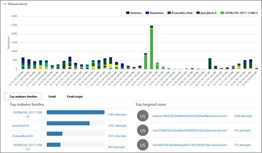

# Verwenden des Bedrohungs-Explorers &amp; im Security Compliance CenterUse Threat Explorer in the Security &amp; Compliance Center

Wenn Ihre Organisation [Office 365 Advanced Threat Protection Plan 2](office-365-ti.md)enthält und Sie über die erforderlichen Berechtigungen verfügen, können Sie Threat Explorer verwenden, um Bedrohungen zu identifizieren und zu analysieren.If your organization has [Office 365 Advanced Threat Protection Plan 2](office-365-ti.md), and you have the necessary permissions, you can use Threat Explorer to identify and analyze threats. Sie können beispielsweise infizierte e-Mails identifizieren und löschen, die übermittelt wurden, oder Malware, die von den Office 365-Sicherheitsfeatures abgefangen wurde.For example, you can identify and delete malicious email that was delivered, or see malware that was caught by Office 365 security features. Threat Explorer (auch als Explorer bezeichnet) ist ein leistungsstarkes Near-Real-Time-Tool, mit dessen Hilfe Sicherheitsteams untersuchen und auf Bedrohungen &amp; im Security Compliance Center reagieren können.Threat Explorer (also referred to as Explorer) is a powerful near real-time tool to help Security Operations teams investigate and respond to threats in the Security &amp; Compliance Center.
  

  
Um Explorer zu verwenden, wechseln Sie &amp; im Security Compliance Center zu **Threat Management** \> **Explorer**.To use Explorer, in the Security &amp; Compliance Center, go to **Threat management** \> **Explorer**.

> [!IMPORTANT]
> Office 365 Threat Intelligence ist jetzt Office 365 Advanced Threat Protection Plan 2, zusammen mit zusätzlichen Funktionen zum Schutz vor Bedrohungen.Office 365 Threat Intelligence is now Office 365 Advanced Threat Protection Plan 2, along with additional threat protection capabilities. Weitere Informationen finden Sie unter [office 365 Advanced Threat Protection-Pläne und Preise](https://products.office.com/exchange/advance-threat-protection) und die [Office 365 Advanced Threat Protection-Dienstbeschreibung](https://docs.microsoft.com/office365/servicedescriptions/office-365-advanced-threat-protection-service-description).To learn more, see [Office 365 Advanced Threat Protection plans and pricing](https://products.office.com/exchange/advance-threat-protection) and the [Office 365 Advanced Threat Protection Service Description](https://docs.microsoft.com/office365/servicedescriptions/office-365-advanced-threat-protection-service-description).
      
## Übersicht über den ExplorerExplorer overview

Der Explorer zeigt Informationen zu mutmaßlicher Schadsoftware und Phishing in e-Mails und Dateien in Office 365 sowie andere Sicherheitsbedrohungen und-Risiken für Ihre Organisation an.Explorer displays information about suspected malware and phish in email and files in Office 365, as well as other security threats and risks to your organization. Wenn Sie Explorer zuerst öffnen, werden in der Standardansicht e-Mail-Malware-Entdeckungen für die letzten 7 Tage angezeigt.When you first open Explorer, the default view shows email malware detections for the past 7 days. Der Explorer kann auch Sicherheitsschutz Features in Office 365, einschließlich [sicherer Links](atp-safe-links.md) und [sicherer Anlagen](atp-safe-attachments.md) , anzeigen und so geändert werden, dass Daten für die letzten 30 Tage angezeigt werden.Explorer can also show security protection features in Office 365, including [Safe Links](atp-safe-links.md) and [Safe Attachments](atp-safe-attachments.md) and can be modified to show data for the past 30 days. Wenn Sie über ein Test-Abonnement für Office 365 Advanced Threat Protection Plan 2 oder Office 365 E5 verfügen, werden nur Erkennungs-und e-Mail-Daten für die letzten 7 Tage angezeigt.If you have a trial subcription for Office 365 Advanced Threat Protection Plan 2 or Office 365 E5, you will only see detections and email data for the past 7 days.
  

  
Verwenden Sie das Menü Ansicht, um zu ändern, welche Informationen angezeigt werden.Use the View menu to change what information is displayed.
  

  
Der Explorer verfügt über mehrere Filterungs-und Abfragefunktionen, mit denen Sie Details wie die wichtigsten Zielbenutzer, die wichtigsten Malware Familien, die Erkennungstechnologie und vieles mehr eingehen können.Explorer has several filtering and querying capabilities that enable you to drill into details, such as top targeted users, top malware families, detection technology and more. Jede Art von Bericht bietet eine Vielzahl von Möglichkeiten zum Anzeigen und Durchsuchen von Daten.Each kind of report offers a variety of ways to view and explore data.

> [!IMPORTANT]
> Verwenden Sie keine Platzhalterzeichen wie ein Sternchen (\*) oder ein Fragezeichen (?) mit Explorer.Do not use wildcard characters, such as an asterisk (\*) or a question mark (?), with Explorer. Wenn Sie im Feld Betreff für e-Mail-Nachrichten suchen, führt der Explorer eine partielle Übereinstimmung aus und liefert Ergebnisse, die der Platzhaltersuche ähneln.When you search on the Subject field for email messages, Explorer will perform partial matching and yield results similar to a wildcard search.

## E \> -Mail-SchadsoftwareEmail \> Malware

In dieser Ansicht werden e-Mail-Nachrichten mit Schadsoftware angezeigt.This view shows email messages identified as containing malware.  

Anzeigen von Informationen im Diagramm anhand der Schadsoftware-Familie, der Absenderdomäne, der Absender-IP-Adresse, des Schutzstatus (Aktionen, die von ihren Threat Protection-Features und-Richtlinien in Office 365 ausgeführt wurden) und der Erkennungstechnologie (wie die Schadsoftware erkannt wurde).View information in the chart by malware family, sender domain, sender IP, protection status (actions taken by your threat protection features and policies in Office 365), and detection technology (how the malware was detected).  

         

Sehen Sie sich unter dem Diagrammdetails zu den häufigsten Schadsoftware-Familien, die wichtigsten Zielbenutzer und weitere Details zu bestimmten Nachrichten an.Below the chart, view details about top malware families, top targeted users, and more details about specific messages. 

## E \> -Mail-PhishingEmail \> Phish

Diese Ansicht zeigt e-Mail-Nachrichten an, die als Phishing-Versuche identifiziert wurden.This view shows email messages identified as phishing attempts.  

Anzeigen von Informationen nach Absenderdomäne, Absender-IP und Schutzstatus (Aktionen, die von ihren Funktionen zum Schutz vor Bedrohungen in Office 365 ausgeführt werden).View information by sender domain, sender IP, and protection status (actions taken by your threat protection features and policies in Office 365). 

 

Zeigen Sie unter dem Diagramm weitere Details zu bestimmten Nachrichten an.Below the chart, view more details about specific messages. 

## E \> -Mail-Benutzer gemeldetEmail \> User-reported

In dieser Ansicht werden e-Mails angezeigt, die von Benutzern als Junk-e-Mail oder Phishing-Nachricht gemeldet wurden.This view shows email that users have reported as junk, not junk, or phishing email.  

Informationen nach Berichtstyp anzeigen (die Bestimmung des Benutzers, dass es sich bei der e-Mail um Junk-e-Mail, nicht um Junk oder Phishing handelt) und nach Zustellungs Grund (Gründe dafür, warum e-Mails an einen bestimmten Speicherort gesendet wurden, beispielsweise eine Spamfilter Richtlinie, eine Nachrichtenfluss Regel, eine Liste blockierter Absender, eine Liste sicherer Absender, usw.).View information by report type (the user's determination that the email was junk, not junk, or phish), and by delivery reason (reasons why email went to a specific location, such as a spam filter policy, a mail flow rule, a blocked-senders list, a safe-senders list, etc.).  

  

Zeigen Sie unterhalb des Diagramms weitere Details zu bestimmten e-Mail-Nachrichten wie Betreff, die IP-Adresse des Absenders, der Benutzer, der die Nachricht als Junk, nicht Junk oder Phishing gemeldet hat, und vieles mehr an.Below the chart, view more details about specific email messages, such as subject line, the sender's IP address, the user that reported the message as junk, not junk, or phish, and more. 

## Alle \> e-Mails sendenEmail \> All mail

Diese Ansichten zeigen eine Übersicht über e-Mail-Aktivitäten, einschließlich e-Mails, die aufgrund von Phishing oder Schadsoftware als böswillig identifiziert wurden, sowie für alle nicht-böswilligen e-Mails (normale e-Mail, Spam und Massensendungen).This views shows an all-up view of email activity, including email identified as malicious due to phishing or malware, as well all non-malicious mail (normal email, spam, and bulk mail). 

> [!NOTE]
> Wenn Sie eine Fehlermeldung erhalten, die zu **viele anzuzeigende Daten**liest, fügen Sie einen Filter hinzu, und schränken Sie gegebenenfalls den angezeigten Datums Umfang ein.If you get an error that reads **Too much data to display**, add a filter and, if necessary, narrow the date range you're viewing. 

Wenn Sie einen Filter anwenden möchten, wählen Sie **Absender**aus, wählen Sie ein Element in der Liste aus, und klicken Sie dann auf die Schaltfläche Aktualisieren.To apply a filter, choose **Sender**, select an item in the list, and then click the Refresh button. In unserem Beispiel wurde die **Erkennungstechnologie** als Filter verwendet (es stehen mehrere Optionen zur Verfügung).In our example, we used **Detection technology** as a filter (there are several options available). Anzeigen von Informationen nach Absender, Absenderdomäne, Empfänger, Betreff, Anlage Dateiname, Schadsoftware-Familie, Schutzstatus (Aktionen, die von ihren Threat Protection-Features und-Richtlinien in Office 365 ausgeführt werden), Erkennungstechnologie (wie die Schadsoftware erkannt wurde) und mehr.View information by sender, sender's domain, recipients, subject, attachment filename, malware family, protection status (actions taken by your threat protection features and policies in Office 365), detection technology (how the malware was detected), and more. 

 

Zeigen Sie unter dem Diagramm weitere Details zu bestimmten e-Mail-Nachrichten an, beispielsweise Betreff, Empfänger, Absender, Status usw.Below the chart, view more details about specific email messages, such as subject line, recipient, sender, status, and so on. 

## Inhalts \> -SchadsoftwareContent \> Malware

Diese Ansicht zeigt Dateien, die von Office 365 Advanced Threat Protection in SharePoint Online, OneDrive for Business und Microsoft Teams als bösartig identifiziert wurden.This view shows files that were identified as malicious by Office 365 Advanced Threat Protection in SharePoint Online, OneDrive for Business, and Microsoft Teams.

Anzeigen von Informationen nach Malwarefamilie, Erkennungstechnologie (wie die Malware erkannt wurde) und Arbeitslast (OneDrive, SharePoint oder Teams).View information by malware family, detection technology (how the malware was detected), and workload (OneDrive, SharePoint, or Teams). 

  

Zeigen Sie unter dem Diagramm weitere Details zu bestimmten Dateien an, beispielsweise Dateiname der Anlage, Arbeitsauslastung, Dateigröße, wer die Datei zuletzt geändert hat, und vieles mehr.Below the chart, view more details about specific files, such as attachment filename, workload, file size, who last modified the file, and more. 
  
## (Neu!) Click-to-Filter-Funktionen(New!) Click-to-filter capabilities

Neu in Explorer ist die Möglichkeit zum Filtern.New to Explorer is the ability to click to filter. Wenn Sie in der Legende auf ein Element klicken, wird dieses Element zu einem Filter für den Bericht.When you click an item in the legend, that item becomes a filter for the report. Nehmen wir beispielsweise an, dass Sie die Malware Ansicht im Explorer betrachten:For example, suppose we are looking at the Malware view in Explorer:
  

  
Wenn Sie in diesem Diagramm auf **ATP-Detonation** klicken, wird eine Ansicht wie die folgende angezeigt:Clicking **ATP Detonation** in this chart results in a view like this: 
  

  
In dieser Ansicht betrachten wir nun Daten für Dateien, die von [Office 365 ATP Safe Attachments](atp-safe-attachments.md)gezündet wurden.In this view, we are now looking at data for files that were detonated by [Office 365 ATP Safe Attachments](atp-safe-attachments.md). Unter dem Diagramm können Details zu bestimmten e-Mail-Nachrichten mit Anlagen angezeigt werden, die von sicheren ATP-Anlagen erkannt wurden.Below the chart, we can see details about specific email messages that had attachments that were detected by ATP Safe Attachments.
  

  
Durch Auswählen eines oder mehrerer Elemente wird das Menü " **Aktionen** " aktiviert, das verschiedene Auswahlmöglichkeiten für die ausgewählten Elemente bietet.Selecting one or more items activates the **Actions** menu, which offers several choices from which to choose for the selected item(s). 
  

  
Die Möglichkeit, mit einem Klick zu filtern und zu bestimmten Details zu navigieren, kann Ihnen viel Zeit bei der Untersuchung von Bedrohungen ersparen.The ability to filter in a click and navigate to specific details can save you a lot of time in investigating threats.
  
## Wie erhalte ich einen Explorer?How do I get Explorer?

Der Explorer ist in [Office 365 Advanced Threat Protection Plan 2](office-365-ti.md)enthalten.Explorer is included in [Office 365 Advanced Threat Protection Plan 2](office-365-ti.md). 

Sie müssen über die entsprechenden Berechtigungen verfügen, beispielsweise solche, die einem Sicherheitsadministrator oder einem Sicherheits Leser erteilt wurden, um den Explorer anzuzeigen und zu verwenden.You must have appropriate permissions, such as those granted to a security administrator or security reader, in order to view and use Explorer. Weitere Informationen finden Sie unter [Permissions in the Office 365 &amp; Security Compliance Center](permissions-in-the-security-and-compliance-center.md).To learn more, see [Permissions in the Office 365 Security &amp; Compliance Center](permissions-in-the-security-and-compliance-center.md).
  
## Verwandte ThemenRelated topics

[Berichte und Einblicke im Office 365 &amp; Security Compliance CenterReports and insights in the Office 365 Security &amp; Compliance Center](reports-and-insights-in-security-and-compliance.md)
  
[Suchen und untersuchen von gelieferten Schad-e-Mails (Office 365 Threat Invesitgation und Response)Find and investigate malicious email that was delivered (Office 365 Threat Invesitgation and Response)](investigate-malicious-email-that-was-delivered.md)
  
[Antispam- und Antischadsoftwareschutz in Office 365Anti-spam and anti-malware protection in Office 365](anti-spam-and-anti-malware-protection.md)
  

