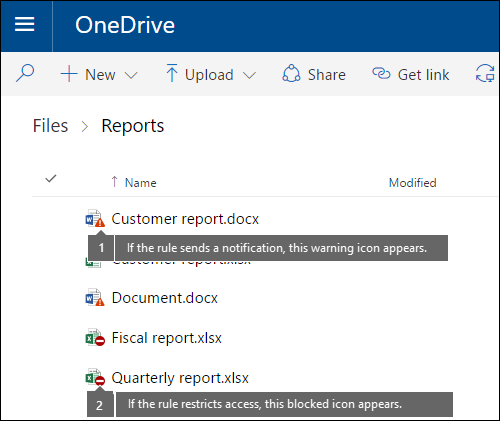
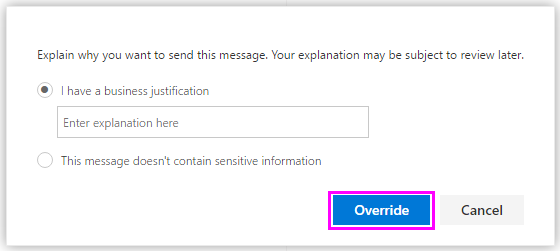

# Senden von E-Mail-Benachrichtigungen und Anzeigen von Richtlinientipps für DLP-Richtlinien

Sie können eine DLP-Richtlinie (Data Loss Prevention) verwenden, um vertrauliche Informationen über Office 365 zu identifizieren, zu überwachen und zu schützen. Sie möchten, dass Personen in Ihrer Organisation, die mit diesen vertraulichen Informationen arbeiten, mit ihren DLP-Richtlinien konform bleiben, Sie sollten Sie jedoch nicht unnötig daran hindern, ihre Arbeit zu erledigen. Hier können e-Mail-Benachrichtigungen und Richtlinien Tipps hilfreich sein.
  

  
Ein richtlinientipp ist eine Benachrichtigung oder Warnung, die angezeigt wird, wenn jemand mit Inhalten arbeitet, die mit einer DLP-Richtlinie in Konflikt stehen (beispielsweise Inhalte wie eine Excel-Arbeitsmappe auf einer OneDrive für Unternehmen Website, die personenbezogene Informationen (PII) enthält und für einen externen Benutzer freigegeben.
  
Sie können e-Mail-Benachrichtigungen und Richtlinien Tipps verwenden, um die Bekanntheit zu verbessern und Personen über die Richtlinien Ihrer Organisation zu informieren. Sie können Benutzern auch die Möglichkeit geben, die Richtlinie außer Kraft zu setzen, damit Sie nicht blockiert werden, wenn Sie eine gültige geschäftliche Anforderung haben oder wenn die Richtlinie ein falsch positives Ergebnis erkennt.
  
Wenn Sie im Office 365 &amp; Security Compliance Center eine DLP-Richtlinie erstellen, können Sie die Benutzer Benachrichtigungen für Folgendes konfigurieren:
  
- Senden Sie eine e-Mail-Benachrichtigung an die Personen, die Sie auswählen, die das Problem beschreibt.
    
- Anzeigen eines Richtlinien Tipps für Inhalte, die mit der DLP-Richtlinie in Konflikt stehen:
    
  - Bei e-Mails in Outlook im Internet und Outlook 2013 und höher wird die RichtlinienInfo oben in einer Nachricht oberhalb der Empfänger angezeigt, während die Nachricht verfasst wird.
    
  - Für Dokumente in einem OneDrive für Unternehmen Konto oder SharePoint Online Website wird der richtlinientipp durch ein Warnsymbol angezeigt, das auf dem Element angezeigt wird. Um weitere Informationen anzuzeigen, können Sie ein Element auswählen und dann in ****  der Seite auf Informations Informationsbereichs Symbol klicken, um den Detailbereich zu öffnen. 
    
  - Für Excel-, PowerPoint-und Word-Dokumente, die auf einer OneDrive für Unternehmen Website oder SharePoint Online Website gespeichert sind, die in der DLP-Richtlinie enthalten ist, wird der richtlinientipp in **** der Status \> Leiste und im Backstage-Ansicht (Menü **Informationen**für Dateien) angezeigt.
    
## Hinzufügen von Benutzer Benachrichtigungen zu einer DLP-Richtlinie

Wenn Sie eine DLP-Richtlinie erstellen, sind sowohl e-Mail-Benachrichtigungen als auch Richtlinien Tipps Teil des Abschnitts **Benutzer Benachrichtigungen** . 
  
1. Wechseln Sie zu [https://protection.office.com](https://protection.office.com).
    
2. Melden Sie sich bei Office 365 mit Ihrem Geschäfts-, Schul- oder Unikonto an. Sie befinden sich jetzt im Office 365 Security &amp; Compliance Center.
    
3. Im &amp; Security \> Compliance Center Links Navigations \> **Richtlinie** \> zur \> Verhinderung von **Datenverlust** und **Erstellen einer Richtlinie**.
    
    
  
4. Wählen Sie die DLP-Richtlinienvorlage aus, die die Typen von vertraulichen \> Informationen schützt, die Sie **als nächstes**benötigen.
    
    Um mit einer leeren Vorlage zu beginnen, wählen Sie **als nächstes** **Benutzer** \> definierte **Richtlinie** \> aus.
    
5. Nennen Sie die \> Richtlinie **als nächstes**.
    
6. Führen Sie einen der folgenden Schritte aus, um die Speicherorte auszuwählen, die von der DLP-Richtlinie geschützt werden sollen:
    
  - Wählen Sie **in Office 365** \> **Next**alle Standorte aus.
    
  - Wählen Sie **Let Me Choose specific Locations** \> **Next**aus.
    
    Wenn Sie einen gesamten Standort wie alle Exchange-e-Mails oder alle OneDrive-Konten einschließen oder ausschließen möchten, wechseln Sie den **Status** dieser Position ein oder aus. 
    
    Wenn Sie nur bestimmte SharePoint-Websites oder OneDrive-Konten einschließen möchten, wechseln Sie den **Status** auf ein, und klicken Sie dann auf die Links unter **einschließen** , um bestimmte Websites oder Konten auszuwählen. 
    
7. Wählen Sie \> **weiter** **Erweiterte Einstellungen verwenden** aus.
    
8. Wählen Sie **+ neue Regel**aus.
    
9. Wechseln Sie im Regel-Editor unter **Benutzer Benachrichtigungen**auf den Status.
    
    

> [!NOTE]
> DLP-Richtlinien gelten für alle Dokumente, die mit der Richtlinie übereinstimmen, unabhängig davon, ob diese Dokumente neu oder vorhanden sind. Eine e-Mail-Benachrichtigung wird jedoch nur generiert, wenn neue Inhalte einer vorhandenen DLP-Richtlinie entsprechen. Vorhandene Inhalte werden geschützt, es wird jedoch keine Benutzerbenachrichtigung per e-Mail generiert.
  
## Optionen zum Konfigurieren von e-Mail-Benachrichtigungen

Für jede Regel in einer DLP-Richtlinie haben Sie folgende Möglichkeiten:
  
- Senden Sie die Benachrichtigung an die Personen, die Sie auswählen. Diese Personen können den Besitzer des Inhalts, die Person, die den Inhalt zuletzt geändert hat, den Besitzer der Website, auf der der Inhalt gespeichert ist, oder einen bestimmten Benutzer einschließen.
    
- Passen Sie den Text an, der in der Benachrichtigung enthalten ist, indem Sie HTML oder Token verwenden. Weitere Informationen finden Sie im Abschnitt weiter unten.
    
> [!NOTE]
>  E-Mail-Benachrichtigungen können nur an einzelne Empfänger gesendet werden, nicht an Gruppen oder Verteilerlisten. Nur neue Inhalte können eine e-Mail-Benachrichtigung auslösen. Durch das Bearbeiten vorhandener Inhalte werden Richtlinien Tipps ausgelöst, jedoch keine e-Mail-Benachrichtigung. 
  

  
### Standardmäßige e-Mail-Benachrichtigung

Benachrichtigungen weisen eine Betreffzeile auf, die mit der ausgeführten Aktion beginnt, beispielsweise "Benachrichtigung", "Nachricht blockiert" für e-Mail oder "Zugriff blockiert" für Dokumente. Wenn es sich bei der Benachrichtigung um ein Dokument handelt, enthält der Benachrichtigungstext einen Link, der Sie zu der Website führt, auf der das Dokument gespeichert ist, und den richtlinientipp für das Dokument öffnet, in dem Sie Probleme beheben können (Weitere Informationen finden Sie im Abschnitt weiter unten unter Richtlinien Tipps). Wenn es sich bei der Benachrichtigung um eine Nachricht handelt, enthält die Benachrichtigung als Anlage die Nachricht, die mit einer DLP-Richtlinie übereinstimmt.
  

  
Standardmäßig werden bei Benachrichtigungen für ein Element auf einer Website Text ähnlich der folgenden angezeigt. Der Benachrichtigungstext wird für jede Regel separat konfiguriert, sodass der angezeigte Text unterschiedlich ist, je nachdem, welche Regel abgeglichen wird.

|**Wenn die DLP-Richtlinienregel dies tut...**|**Die Standardbenachrichtigung für SharePoint-oder OneDrive für Unternehmen-Dokumente lautet dann...**|**Dann lautet die Standardbenachrichtigung für Outlook-Nachrichten...**|
|:-----|:-----|:-----|
|Sendet eine Benachrichtigung, aber keine Außerkraftsetzung zulässt    |Dieses Element steht in Konflikt mit einer Richtlinie in Ihrer Organisation.    |Ihre e-Mail-Nachricht steht in Konflikt mit einer Richtlinie in Ihrer Organisation.    |
|Blockiert den Zugriff, sendet eine Benachrichtigung und ermöglicht Außerkraftsetzung    |Dieses Element steht in Konflikt mit einer Richtlinie in Ihrer Organisation. Wenn Sie diesen Konflikt nicht beheben, wird möglicherweise der Zugriff auf diese Datei blockiert.    |Ihre e-Mail-Nachricht steht in Konflikt mit einer Richtlinie in Ihrer Organisation. Die Nachricht wurde nicht an alle Empfänger übermittelt.    |
|Blockiert den Zugriff und sendet eine Benachrichtigung.    |Dieses Element steht in Konflikt mit einer Richtlinie in Ihrer Organisation. Der Zugriff auf dieses Element wird für alle Benutzer mit Ausnahme des Besitzers, des letzten Modifikators und des primären Websitesammlungsadministrators blockiert.    |Ihre e-Mail-Nachricht steht in Konflikt mit einer Richtlinie in Ihrer Organisation. Die Nachricht wurde nicht an alle Empfänger übermittelt.    |
   
### Benutzerdefinierte e-Mail-Benachrichtigung

Sie können eine benutzerdefinierte e-Mail-Benachrichtigung erstellen, anstatt die standardmäßige e-Mail-Benachrichtigung an Ihre Endbenutzer oder Administratoren zu senden. Die benutzerdefinierte e-Mail-Benachrichtigung unterstützt HTML und hat einen Grenzwert von 5.000 Zeichen. Sie können HTML verwenden, um Bilder, Formatierungen und andere Branding-Zeichen in die Benachrichtigung einzubeziehen.
  
Sie können auch die folgenden Token verwenden, um die e-Mail-Benachrichtigung anzupassen. Diese Token sind Variablen, die durch bestimmte Informationen in der gesendeten Benachrichtigung ersetzt werden.

|**Token**|**Beschreibung**|
|:-----|:-----|
|%% AppliedActions%%    |Die Aktionen, die auf den Inhalt angewendet werden.    |
|%% ContentURL%%    |Die URL des Dokuments auf der SharePoint Online Website oder OneDrive für Unternehmen Website.    |
|%%MatchedConditions%%    |Die Bedingungen, die mit dem Inhalt übereinstimmen. Verwenden Sie dieses Token, um Personen über mögliche Probleme mit dem Inhalt zu informieren.    |
   

  
## Optionen zum Konfigurieren von Richtlinien Tipps

Für jede Regel in einer DLP-Richtlinie können Sie Richtlinien Tipps für Folgendes konfigurieren:
  
- Benachrichtigen Sie einfach die Person, dass der Inhalt mit einer DLP-Richtlinie in Konflikt steht, damit Sie Aktionen zur Lösung des Konflikts ausführen können. Sie können den Standardtext verwenden (siehe unten stehende Tabellen) oder benutzerdefinierten Text zu den spezifischen Richtlinien Ihrer Organisation eingeben.
    
- Zulassen, dass die DLP-Richtlinie von der Person außer Kraft gesetzt wird. Optional können Sie Folgendes tun:
    
  - Die Person muss eine geschäftliche Begründung eingeben, um die Richtlinie außer Kraft zu setzen. Diese Informationen werden protokolliert und können in den DLP-Berichten im Abschnitt **Berichte** des Security &amp; Compliance Centers angezeigt werden. 
    
  - Zulassen, dass die Person eine falsch positive Meldung meldet und die DLP-Richtlinie außer Kraft setzt. Diese Informationen werden auch für die Berichterstellung protokolliert, sodass Sie falsch positive Ergebnisse zur Feinabstimmung Ihrer Regeln verwenden können.
    

  
Möglicherweise wird eine DLP-Richtlinie auf OneDrive für Unternehmen Websites angewendet, die personenbezogene Informationen (PII) erkennen, und diese Richtlinie hat drei Regeln:
  
1. Erste Regel: Wenn in einem Dokument weniger als fünf Instanzen dieser vertraulichen Informationen erkannt werden und das Dokument für Personen innerhalb der Organisation freigegeben wird, wird mit der Aktion **Benachrichtigung senden** ein richtlinientipp angezeigt. Für Richtlinien Tipps sind keine Außerkraftsetzungsoptionen erforderlich, da diese Regel lediglich Personen benachrichtigt und nicht den Zugriff blockiert. 
    
2. Zweite Regel: Wenn mehr als fünf Instanzen dieser vertraulichen Informationen in einem Dokument erkannt werden und das Dokument für Personen innerhalb der Organisation freigegeben wird, schränkt die Aktion **Zugriff auf Inhalt blockieren** die Berechtigungen für die Datei ein, und die ** Benachrichtigung senden** : mit dieser Aktion können Benutzer die Aktionen in dieser Regel außer Kraft setzen, indem Sie eine geschäftliche Begründung bereitstellen. In Ihrem Unternehmen ist es manchmal erforderlich, dass interne Personen PII-Daten freigeben, und dass ihre DLP-Richtlinie diese Arbeit nicht blockiert. 
    
3. Dritte Regel: Wenn mehr als fünf Instanzen dieser vertraulichen Informationen in einem Dokument erkannt werden und das Dokument für Personen außerhalb der Organisation freigegeben wird, schränkt die Aktion **Zugriff auf Inhalt blockieren** die Berechtigungen für die Datei ein, und die ** Benachrichtigung senden** mit Aktion können Benutzer die Aktionen in dieser Regel außer Kraft setzen, da die Informationen extern freigegeben werden. In keinem Fall dürfen Personen in Ihrer Organisation PII-Daten außerhalb der Organisation freigeben. 
    
Hier sind einige feine Punkte, die Sie bei der Verwendung eines Richtlinien Tipps zum Überschreiben einer Regel verstehen:
  
- Die Option zum außer Kraft setzen ist pro Regel und setzt alle Aktionen in der Regel außer Kraft (mit Ausnahme des Sendens einer Benachrichtigung, die nicht überschrieben werden kann).
    
- Es ist möglich, dass Inhalte mehreren Regeln in einer DLP-Richtlinie entsprechen, aber nur der richtlinientipp aus der restriktivsten, die höchste Priorität Regel wird angezeigt. Beispielsweise wird ein richtlinientipp von einer Regel, die den Zugriff auf Inhalte blockiert, über einen richtlinientipp aus einer Regel angezeigt, die einfach eine Benachrichtigung sendet. Dadurch wird verhindert, dass Benutzer eine Kaskade von Richtlinien Tipps sehen.
    
- Wenn die Richtlinien Tipps in der restriktivsten Regel es Benutzern ermöglichen, die Regel außer Kraft zu setzen, setzt das Überschreiben dieser Regel auch andere Regeln außer Kraft, die mit dem Inhalt übereinstimmten.
    
## Richtlinien Tipps für OneDrive für Unternehmen Websites und SharePoint Online Websites

Wenn ein Dokument auf einer OneDrive für Unternehmen Website oder SharePoint Online Website einer Regel in einer DLP-Richtlinie entspricht und diese Regelrichtlinien Tipps verwendet, zeigen die Richtlinien Tipps spezielle Symbole im Dokument an:
  
1. Wenn die Regel eine Benachrichtigung über die Datei sendet, wird das Warnsymbol angezeigt.
    
2. Wenn die Regel den Zugriff auf das Dokument blockiert, wird das Symbol blockiert angezeigt.
    

  
Um Aktionen für ein Dokument durchführen zu können, wählen Sie \> ](media/50b6d51b-92b4-4c5f-bb4b-4ca2d4aa3d04.png) in der oberen rechten Ecke der Seite ein Element **Informations** 
  

  
DLP-Richtlinien werden mit Websites synchronisiert und Inhalte werden regelmäßig und asynchron mit diesen bewertet, sodass es möglicherweise eine kurze Verzögerung zwischen dem Zeitpunkt der Erstellung der DLP-Richtlinie und dem Zeitpunkt, zu dem die Richtlinien Tipps angezeigt werden, geben kann. Es kann eine ähnliche Verzögerung geben, wenn Sie einen richtlinientipp auflösen oder außer Kraft setzen, wenn das Symbol auf dem Dokument auf der Website verschwindet.
  
### Standardtext für Richtlinien Tipps auf Websites

Standardmäßig werden in Richtlinien Tipps für ein Element auf einer Website Text ähnlich der folgenden angezeigt. Der Benachrichtigungstext wird für jede Regel separat konfiguriert, sodass der angezeigte Text unterschiedlich ist, je nachdem, welche Regel abgeglichen wird.

|**Wenn die DLP-Richtlinienregel dies tut...**|**Dann lautet der Standardrichtlinien Tipp...**|
|:-----|:-----|
|Sendet eine Benachrichtigung, aber keine Außerkraftsetzung zulässt    |Dieses Element steht in Konflikt mit einer Richtlinie in Ihrer Organisation.    |
|Blockiert den Zugriff, sendet eine Benachrichtigung und ermöglicht Außerkraftsetzung    |Dieses Element steht in Konflikt mit einer Richtlinie in Ihrer Organisation. Wenn Sie diesen Konflikt nicht beheben, wird möglicherweise der Zugriff auf diese Datei blockiert.    |
|Blockiert den Zugriff und sendet eine Benachrichtigung.    |Dieses Element steht in Konflikt mit einer Richtlinie in Ihrer Organisation. Der Zugriff auf dieses Element wird für alle Benutzer mit Ausnahme des Besitzers, des letzten Modifikators und des primären Websitesammlungsadministrators blockiert.    |
   
### Benutzerdefinierter Text für Richtlinien Tipps auf Websites

Sie können den Text für Richtlinien Tipps separat von der e-Mail-Benachrichtigung anpassen. Im Gegensatz zu benutzerdefiniertem Text für e-Mail-Benachrichtigungen (siehe Abschnitt oben) akzeptiert der benutzerdefinierte Text für Richtlinien Tipps weder HTML noch Token. Stattdessen ist benutzerdefinierter Text für Richtlinien Tipps nur Text mit einem Grenzwert von 256 Zeichen.
  
## Richtlinien Tipps in Outlook im Internet und Outlook 2013 und höher

Wenn Sie eine neue e-Mail in Outlook im Internet und Outlook 2013 und höher erstellen, wird ein richtlinientipp angezeigt, wenn Sie Inhalte hinzufügen, die einer Regel in einer DLP-Richtlinie entsprechen, und diese Regel verwendet Richtlinien Tipps. Der richtlinientipp wird oben in der Nachricht oberhalb der Empfänger angezeigt, während die Nachricht zusammengesetzt wird.
  

  
Richtlinien Tipps funktionieren, ob die vertraulichen Informationen im Nachrichtentext, in der Betreffzeile oder sogar in einer Nachrichtenanlage angezeigt werden, wie hier dargestellt.
  

  
Wenn die Richtlinien Tipps so konfiguriert sind, dass Außerkraftsetzung zulässig ist, können Sie **Details** \> **anzeigen Außerkraftsetzung** \> Enter a Business \> Rechtfertigung oder Bericht eine falsch positive **Außerkraftsetzung**auswählen.
  

  

  
Beachten Sie, dass beim Hinzufügen vertraulicher Informationen zu einer e-Mail möglicherweise Wartezeit zwischen dem Hinzufügen vertraulicher Informationen und dem Erscheinen der Richtlinien Tipps besteht.

### Outlook 2013 und höher unterstützt das Anzeigen von Richtlinien Tipps für nur einige Bedingungen.

Derzeit unterstützt Outlook 2013 und höher nur für diese Bedingungen Richtlinien Tipps anzeigen:

- Inhalt enthält
- Inhalt ist freigegeben

Wir arbeiten derzeit an der Unterstützung für das Anzeigen von Richtlinien Tipps für zusätzliche Bedingungen. Zu diesen zählen:

- Der Inhalt einer e-Mail-Anlage konnte nicht überprüft werden
- Der Inhalt einer e-Mail-Anlage hat die Überprüfung nicht abgeschlossen
- Anlagendatei Erweiterung ist
- Anlage ist kennwortgeschützt
- Document-Eigenschaft ist
- Empfängerdomäne ist
- Absender-IP-Adresse ist

Beachten Sie, dass alle diese Bedingungen in Outlook funktionieren, in denen Sie Inhalte abgleichen und Schutzaktionen für Inhalte erzwingen können. Das Anzeigen von Richtlinien Tipps für Benutzer wird jedoch noch nicht unterstützt.
  
### Richtlinien Tipps im Exchange Admin Center vs. The Office 365 Security &amp; Compliance Center

Richtlinien Tipps können entweder mit DLP-Richtlinien und Nachrichtenfluss Regeln funktionieren, die im Exchange Admin Center erstellt wurden, oder mit DLP-Richt &amp; Linien, die im Office 365 Security Compliance Center erstellt wurden, jedoch nicht in beiden. Dies liegt daran, dass diese Richtlinien an unterschiedlichen Speicherorten gespeichert werden, aber Richtlinien Tipps nur von einem einzelnen Speicherort aus gezeichnet werden können.
  
Wenn Sie Richtlinien Tipps im Exchange Admin Center konfiguriert haben, werden alle Richtlinien Tipps, die Sie im Office 365 Security &amp; Compliance Center konfigurieren, nicht für Benutzer in Outlook im Internet und Outlook 2013 und höher angezeigt, bis Sie die Tipps in der Exchange-Verwaltungskonsole deaktivieren. Admin Center. Dadurch wird sichergestellt, dass Ihre aktuellen Exchange-Nachrichtenfluss Regeln (auch bekannt als Transportregeln) weiterhin funktionieren, bis Sie das Office 365 Security &amp; Compliance Center aktivieren.
  
Beachten Sie, dass Richtlinien Tipps zwar nur von einem einzigen Speicherort aus gezeichnet werden können, e-Mail-Benachrichtigungen jedoch immer gesendet werden, selbst wenn Sie DLP &amp; -Richtlinien sowohl im Office 365 Security Compliance Center als auch im Exchange Admin Center verwenden.
  
### Standardtext für Richtlinien Tipps in e-Mail

Standardmäßig wird in Richtlinien Tipps für e-Mails Text ähnlich der folgenden angezeigt.

|**Wenn die DLP-Richtlinienregel dies tut...**|**Dann lautet der Standardrichtlinien Tipp...**|
|:-----|:-----|
|Sendet eine Benachrichtigung, aber keine Außerkraftsetzung zulässt    |Ihre e-Mail-Nachricht steht in Konflikt mit einer Richtlinie in Ihrer Organisation.    |
|Blockiert den Zugriff, sendet eine Benachrichtigung und ermöglicht Außerkraftsetzung    |Ihre e-Mail-Nachricht steht in Konflikt mit einer Richtlinie in Ihrer Organisation.    |
|Blockiert den Zugriff und sendet eine Benachrichtigung.    |Ihre e-Mail-Nachricht steht in Konflikt mit einer Richtlinie in Ihrer Organisation.    |
   
## Richtlinien Tipps in Excel, PowerPoint und Word

Wenn Personen in den Desktop Versionen von Excel, PowerPoint und Word mit vertraulichen Inhalten arbeiten, können Richtlinien Tipps Sie in Echtzeit darüber informieren, dass der Inhalt mit einer DLP-Richtlinie in Konflikt steht. Dies erfordert Folgendes:
  
- Das Office-Dokument wird auf einer OneDrive für Unternehmen Website oder SharePoint Online Website gespeichert.
    
- Die Website ist in einer DLP-Richtlinie enthalten, die für die Verwendung von Richtlinien Tipps konfiguriert ist.
    
Office-Desktop Programme synchronisieren DLP-Richtlinien automatisch direkt von Office 365 und Scannen dann Ihre Dokumente, um sicherzustellen, dass Sie nicht mit ihren DLP-Richtlinien in Konflikt stehen und Richtlinien Tipps in Echtzeit anzeigen.
  
Je nachdem, wie Sie die Richtlinien Tipps in der DLP-Richtlinie konfigurieren, können die Benutzer entscheiden, ob Sie den richtlinientipp einfach ignorieren, die Richtlinie mit oder ohne geschäftliche Begründung außer Kraft setzen oder ein falsch positives Ergebnis melden möchten.
  
Richtlinien Tipps werden auf der Statusleiste angezeigt.
  

  
Außerdem werden Richtlinien Tipps im Backstage-Ansicht angezeigt (auf der Registerkarte **Datei** ). 
  

  
Wenn Richtlinien Tipps in der DLP-Richtlinie mit diesen Optionen konfiguriert sind, können **** Sie auflösen auswählen, um einen richtlinientipp **außer Kraft zu setzen** oder ein falsch positives Ergebnis zu **melden** . 
  

  
In jedem dieser Office-Desktop Programme können Benutzer auswählen, dass Sie Richtlinien Tipps deaktivieren möchten. Wenn diese Option deaktiviert ist, werden Richtlinien Tipps, die einfache Benachrichtigungen sind, nicht auf der Statusleiste oder Backstage-Ansicht angezeigt (auf der Registerkarte **Datei** ). Es werden jedoch weiterhin Richtlinien Tipps zum Blockieren und außer Kraft setzen angezeigt, und Sie erhalten weiterhin die e-Mail-Benachrichtigung. Außerdem werden durch das Deaktivieren von Richtlinien Tipps das Dokument nicht von den darauf angewendeten DLP-Richtlinien ausgenommen. 
  
### Standardtext für Richtlinien Tipps in Excel 2016, PowerPoint 2016 und Word 2016

Standardmäßig werden in der Nachrichtenleiste und Backstage-Ansicht eines geöffneten Dokuments Text ähnlich der folgenden angezeigt. Der Benachrichtigungstext wird für jede Regel separat konfiguriert, sodass der angezeigte Text unterschiedlich ist, je nachdem, welche Regel abgeglichen wird.

|**Wenn die DLP-Richtlinienregel dies tut...**|**Dann lautet der Standardrichtlinien Tipp...**|
|:-----|:-----|
|Sendet eine Benachrichtigung, aber keine Außerkraftsetzung zulässt    |Diese Datei steht in Konflikt mit einer Richtlinie in Ihrer Organisation. Weitere Informationen finden Sie im Menü **Datei** .    |
|Blockiert den Zugriff, sendet eine Benachrichtigung und ermöglicht Außerkraftsetzung    |Diese Datei steht in Konflikt mit einer Richtlinie in Ihrer Organisation. Wenn Sie diesen Konflikt nicht beheben, wird möglicherweise der Zugriff auf diese Datei blockiert. Weitere Informationen finden Sie im Menü **Datei** .    |
|Blockiert den Zugriff und sendet eine Benachrichtigung.    |Diese Datei steht in Konflikt mit einer Richtlinie in Ihrer Organisation. Wenn Sie diesen Konflikt nicht beheben, wird möglicherweise der Zugriff auf diese Datei blockiert. Weitere Informationen finden Sie im Menü **Datei** .    |
   
### Benutzerdefinierter Text für Richtlinien Tipps in Excel, PowerPoint und Word

Sie können den Text für Richtlinien Tipps separat von der e-Mail-Benachrichtigung anpassen. Im Gegensatz zu benutzerdefiniertem Text für e-Mail-Benachrichtigungen (siehe Abschnitt oben) akzeptiert der benutzerdefinierte Text für Richtlinien Tipps weder HTML noch Token. Stattdessen ist benutzerdefinierter Text für Richtlinien Tipps nur Text mit einem Grenzwert von 256 Zeichen.
  
## Weitere Informationen

- [Übersicht über die Richtlinien zur Verhinderung von Datenverlust](data-loss-prevention-policies.md)
    
- [Erstellen einer DLP-Richtlinie aus einer Vorlage](create-a-dlp-policy-from-a-template.md)
    
- [Erstellen einer DLP-Richtlinie zum Schützen von Dokumenten mit FCI oder anderen Eigenschaften](protect-documents-that-have-fci-or-other-properties.md)
    
- [Inhalt der DLP-Richtlinienvorlagen](what-the-dlp-policy-templates-include.md)
    
- [Wonach die Typen von vertraulichen Informationen suchen](what-the-sensitive-information-types-look-for.md)
    

