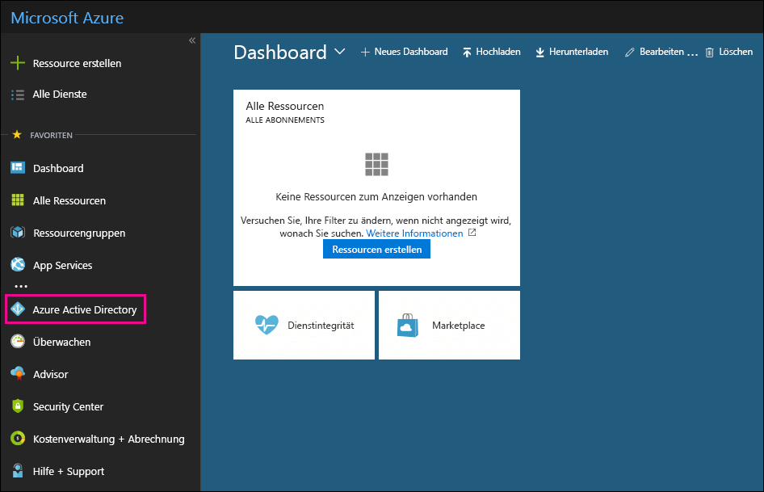

# Verwenden Ihres kostenlosen Azure Active Directory-Abonnements in Office 365

Wenn Ihre Organisation über ein kostenpflichtiges Abonnement für Office 365, Microsoft Dynamics CRM Online, Enterprise Mobility Suite oder andere Microsoft-Dienste verfügt, haben Sie ein kostenloses Abonnement für Microsoft Azure Active Directory. Sie und andere Administratoren können Azure AD zum Erstellen und Verwalten von Benutzer- und Gruppenkonten verwenden. Zur Verwendung von Azure AD wechseln Sie einfach in das Azure-Portal und melden sich mit Ihrem Office 365-Konto an.
  
## Bevor Sie beginnen

Verwenden Sie eine private Browsersitzung (keine gewöhnliche Sitzung), um auf das Azure-Portal (in Schritt 1 unten) zuzugreifen, da dadurch verhindert wird, dass die Anmeldeinformationen, mit denen Sie derzeit angemeldet sind, an Azure weitergegeben werden. Um eine InPrivate-Browsersitzung in Internet Explorer oder eine private Browsersitzung in Mozilla FireFox zu öffnen, drücken Sie einfach STRG+UMSCHALT+P. Um eine private Browsersitzung in Google Chrome (als Inkognitofenster bezeichnet) zu öffnen, drücken Sie STRG-UMSCHALT+N.
  
## Zugreifen auf Azure Active Directory

1. Wechseln Sie zu [portal.azure.com](https://portal.azure.com), und melden Sie sich mit Ihrem Office 365-Konto oder mit Ihrem Geschäfts- oder Schulkonto an. 
    
2. Klicken Sie im Azure-Portal im linken Navigationsbereich auf **Azure Active Directory**.
    
    
  
    Das **Azure Active Directory** Admin Center wird angezeigt. 
    
## Weitere Informationen

- Sie können auch über das Microsoft 365 Admin Center auf das **Azure Active Directory** Admin Center zugreifen. klicken sie im linken navigationsbereich des Microsoft 365 admin center auf **admin center** \> **Azure Active Directory**.
    
- Informationen zum Verwalten von Benutzern und Gruppen und Ausführen anderer Verzeichnisverwaltungsaufgaben finden Sie unter [Verwalten Ihres Azure AD-Verzeichnisses](https://docs.microsoft.com/azure/active-directory/active-directory-administer).
