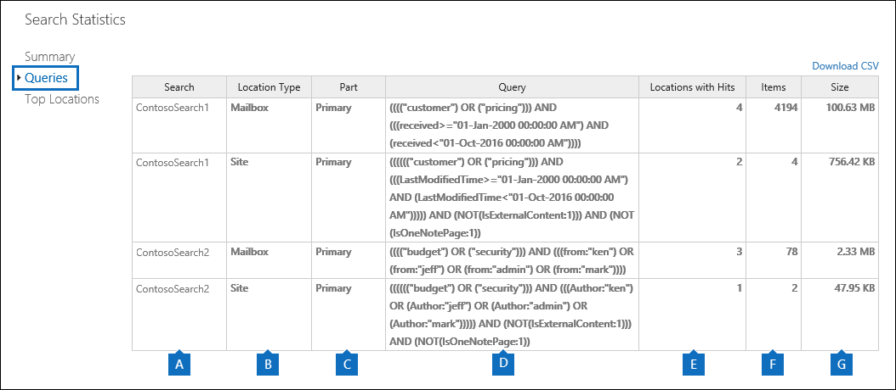

# Anzeigen von Schlüsselwortstatistiken für InhaltssuchergebnisseView keyword statistics for Content Search results

Nach dem Erstellen und Ausführen einer Inhaltssuche können Sie Statistiken zu den geschätzten Suchergebnissen anzeigen. Dies enthält eine Zusammenfassung der Suchergebnisse (ähnlich der Zusammenfassung der geschätzten Suchergebnisse, die im Detailbereich angezeigt werden), die Abfragestatistiken wie die Anzahl der inhaltsspeicherorte mit Elementen, die mit der Suchabfrage übereinstimmen, und der Name der inhaltsspeicherorte , die die meisten übereinstimmenden Elemente aufweisen. Sie können Statistiken für eine oder mehrere Inhalts Suchvorgänge anzeigen. Auf diese Weise können Sie die Ergebnisse für mehrere Suchvorgänge schnell vergleichen und Entscheidungen zur Effektivität ihrer Suchabfragen treffen.After you create and run a Content Search, you can view statistics about the estimated search results. This includes a summary of the search results (similar to the summary of the estimated search results displayed in the details pane), the query statistics such as the number of content locations with items that match the search query, and the name of content locations that have the most matching items. You can display statistics for one or more content searches. This lets you to quickly compare the results for multiple searches and make decisions about the effectiveness of your search queries.
  
Darüber hinaus können Sie neue und vorhandene suchen konfigurieren, um Statistiken für jedes Schlüsselwort in einer Suchabfrage zurückzugeben. Auf diese Weise können Sie die Anzahl der Ergebnisse für jedes Schlüsselwort in einer Abfrage vergleichen und die schlüsselwortstatistik von mehreren suchen vergleichen.Additionally, you can configure new and existing searches to return statistics for each keyword in a search query. This lets you compare the number of results for each keyword in a query and to compare the keyword statistics from multiple searches.
  
Sie können die Suchstatistiken und Keyword-Statistiken auch in eine CSV-Datei herunterladen. Auf diese Weise können Sie die Filter-und Sortierfunktionen in Excel verwenden, um Ergebnisse zu vergleichen und Berichte für Ihre Suchergebnisse vorzubereiten.You can also download the search statistics and keyword statistics to a CSV file. This lets you use the filtering and sorting features in Excel to compare results, and prepare reports for your search results.
  
## Abrufen von Statistiken für Inhalts suchVorgängeGet statistics for Content Searches

So zeigen Sie Statistiken für Inhalts suchVorgänge anTo display statistics for Content Searches:
  
1. wechseln sie im Office 365 &amp; Security Compliance Center zu such \*\*suche &amp; \*\* \> - **inhaltssuche**.In the Office 365 Security &amp; Compliance Center, go to **Search &amp; investigation** \> **Content search**.
    
2. Wählen Sie in der Liste der Suchvorgänge eine oder mehrere Suchvorgänge aus, \*\*\*\*Statistik Suchstatistik-Schaltfläche Durchsuchen.In the list of searches, select one or more searches, and then click **Search statistics**.
    
    
  
3. Klicken Sie auf der Seite **Suchstatistiken** auf einen der folgenden Links, um Statistiken zu den ausgewählten Suchvorgängen anzuzeigen.On the **Search statistics** page, click one of the following links to display statistics about the selected searches. 
    
    **Zusammenfassung****Summary**
    
    Auf dieser Seite werden Statistiken angezeigt, die denen ähneln, die im Detailbereich auf der Seite für die **Inhaltssuche** angezeigt werden. Die Statistik für alle ausgewählten suchen wird angezeigt. Beachten Sie, dass Sie die ausgewählten Suchvorgänge auf dieser Seite erneut ausführen können, um die Statistiken zu aktualisieren.This page displays statistics similar to the ones displayed in the details pane on the **Content search** page. Statistics for all selected searches are displayed. Note that you can also re-run the selected searches from this page to update the statistics. 
    
    
  
    a. der Name der Inhaltssuche. Wie bereits erwähnt, können Sie Statistiken für mehrere Suchvorgänge anzeigen und vergleichen.a.  The name of the Content Search. As previously stated, you can display and compare statistics for multiple searches.
    
    b. der Typ des Inhaltsspeicherorts, der durchsucht wurde. In jeder Zeile werden Statistiken für Postfächer, Websites und öffentliche Ordner aus der angegebenen Suche angezeigt.b. The type of content location that was searched. Each row displays statistics for mailboxes, sites, and public folders from the specified search.
    
    c. die Anzahl der inhaltsspeicherorte, die Elemente enthalten, die mit der Suchabfrage übereinstimmen. Bei Postfächern enthält diese Statistik auch die Anzahl der Archivpostfächer, die Elemente enthalten, die mit der Suchabfrage übereinstimmen.c. The number of content locations containing items that match the search query. For mailboxes, this statistic also includes the number of archive mailboxes that contain items that match the search query.
    
    d. die Gesamtzahl der Elemente aller angegebenen inhaltsspeicherorte, die mit der Suchabfrage übereinstimmen. Beispiele für Elementtypen sind e-Mail-Nachrichten, Kalenderelemente und Dokumente. Wenn ein Element mehrere Instanzen eines Schlüsselwortes enthält, nach dem gesucht wird, wird es nur einmal in der Gesamtanzahl der Elemente gezählt. Wenn Sie beispielsweise nach Wörtern "Stock" oder "Betrug" suchen und eine e-Mail-Nachricht drei Instanzen des Wortes "Stock" enthält, wird Sie nur einmal in der Spalte **Items** gezählt.d. The total number of items of all specified content locations that match the search query. Examples of item types include email messages, calendar items, and documents. If an item contains multiple instances of a keyword that is being searched for, it's only counted once in the total number of items. For example, if you're searching for words "stock" or "fraud" and an email message contains three instances of the word "stock", it's only counted once in the **Items** column. 
    
    e. die Gesamtgröße aller Elemente, die am angegebenen Inhaltsspeicherort gefunden wurden, die mit der Suchabfrage übereinstimmen.e. The total size of all items that were found in the specified content location that match the search query. 
    
    **Abfragen****Queries**
    
    Auf dieser Seite werden Statistiken zur Suchabfrage angezeigt.This page displays statistics about the search query.
    
    
  
    a. der Name der Inhaltssuche, für die die Zeile Abfragestatistiken enthält.a. The name of the Content Search that the row contains query statistics for.
    
    b. der Typ des Inhaltsspeicherorts, auf den die Abfragestatistiken angewendet werden.b. The type of content location that the query statistics are applicable to.
    
    c. diese Spalte gibt an, auf welchen Teil der Suchabfrage die Statistiken angewendet werden. **Primary** gibt die gesamte Suchabfrage an. Wenn Sie beim Erstellen oder Bearbeiten einer Suchabfrage eine Stichwortliste verwenden, sind die Statistiken für die einzelnen Komponenten der Abfrage in dieser Tabelle enthalten. Weitere Informationen finden Sie im Abschnitt [Get Keyword Statistics for Content searches](#get-keyword-statistics-for-content-searches) in diesem Artikel.c. This column indicates which part of the search query the statistics are applicable to. **Primary** indicates the entire search query. If you use a keyword list when you create or edit a search query, statistics for each component of the query are included in this table. See the [Get keyword statistics for Content Searches](#get-keyword-statistics-for-content-searches) section in this article for more information. 
    
    d. diese Spalte enthält die tatsächliche Suchabfrage, die vom Tool für die Inhaltssuche ausgeführt wird. Beachten Sie, dass das Tool automatisch einige zusätzliche Komponenten zu der erstellten Abfrage hinzufügt.d. This column contains the actual search query that run by the Content Search tool. Note that the tool automatically adds a few additional components to the query that you create. 

    - Wenn Sie nach allen Inhalten in Postfächern suchen (indem Sie keine Schlüsselwörter angeben), ist `size>=0` die eigentliche Schlüsselwortabfrage so, dass alle Elemente zurückgegeben werden.When you search for all content in mailboxes (by not specifying any keywords), the actual key word query is  `size>=0` so that all items are returned. 
    
     - Beim Durchsuchen von SharePoint Online-und OneDrive für Business-Websites werden die beiden folgenden Komponenten hinzugefügt:When you search SharePoint Online and OneDrive for Business sites, the two following components are added:
    
          **Nicht IsExternalContent: 1** -schließt Inhalte aus einer lokalen SharePoint-Organisation aus.**NOT IsExternalContent:1** - Excludes any content from an on-premises SharePoint organization. 
    
          **Nicht IsOneNotePage: 1** -schließt alle OneNote-Dateien aus, da es sich dabei um Duplikate eines Dokuments handeln würde, das mit der Suchabfrage übereinstimmt.**NOT IsOneNotePage:1** - Excludes all OneNote files because these would be duplicates of any document that matches the search query. 

    
    e. die Anzahl der inhaltsspeicherorte (angegeben in der Spalte \* \* Location Type \* \*), die Elemente enthalten, die mit der in der **Abfrage** Spalte aufgeführten Suchabfrage übereinstimmen.e. The number of the content locations (specified by the \*\* Location type \*\* column) that contain items that match the search query listed in the **Query** column. 
    
    f. die Anzahl der Elemente (aus dem angegebenen Inhaltsspeicherort), die mit der in der **Abfrage** Spalte aufgeführten Suchabfrage übereinstimmen. Wie bereits erläutert, wird ein Element, das mehrere Instanzen eines Schlüsselwortes enthält, nach dem gesucht wird, nur einmal in dieser Spalte gezählt.f. The number of items (from the specified content location) that match the search query listed in the **Query** column. As previously explained, if an item contains multiple instances of a keyword that is being searched for, it's only counted once in the this column. 
    
    g. die Gesamtgröße aller Elemente, die gefunden wurden (am angegebenen Speicherort des Inhalts), die mit der Suchabfrage in der Spalte **Abfrage** übereinstimmen.g. The total size of all items that were found (in the specified content location) that match the search query in the **Query** column. 
    
    **Top-Standorte****Top locations**
    
    Auf dieser Seite werden Statistiken zur Anzahl der Elemente angezeigt, die mit der Suchabfrage in jedem durchsuchten Inhaltsspeicherort übereinstimmen. Die Top 1.000-Speicherorte werden angezeigt. Wenn Sie Statistiken für mehrere Suchvorgänge anzeigen, werden die Top-1.000-Speicherorte für jede Suche angezeigt. Beachten Sie, dass ein Inhaltsspeicherort nicht auf dieser Seite enthalten ist, wenn er keine Elemente enthält, die mit der Suchabfrage übereinstimmen.This page displays statistics about the number of items that match the search query in each content location that was searched. The top 1,000 locations are displayed. If you view statistics for multiple searches, the top 1,000 locations for each search are displayed. Note that a content location isn't included on this page if it doesn't contain any items that match the search query.
    
    
  
    a. der Name des Inhaltsspeicherorts.a. The name of the content location.
    
    b. der Typ des Inhaltsspeicherorts, auf den die Standort Statistiken angewendet werden.b. The type of content location that the location statistics are applicable to.
    
    c. für jede Suche, für die Sie Statistiken anzeigen, gibt es Spalten. In dieser Spalte wird die Anzahl (und Gesamtgröße) von Elementen angezeigt, die mit der Suchabfrage an den einzelnen Inhaltsspeicherorten übereinstimmen. Beachten Sie, dass beim Anzeigen von Statistiken für mehrere Suchvorgänge das "NA" in dieser Spalte angibt, dass der Inhaltsspeicherort nicht in die Suche einbezogen wurde.c. There are columns for each search that you're displaying statistics for. This column shows the number (and total size) of items that match the search query in each content location. Note that when you're displaying statistics for multiple searches, the "NA" in this column indicates that the content location wasn't included in that search. 

## Stichwort Statistiken für Inhaltssuche abrufenGet keyword statistics for Content Searches

Wie zuvor erläutert, werden auf der Seite **Abfragen** die Suchabfrage und die Anzahl (und die Größe) der Elemente angezeigt, die mit der Abfrage übereinstimmen. Wenn Sie beim Erstellen oder Bearbeiten einer Suchabfrage eine Stichwortliste verwenden, erhalten Sie Erweiterte Statistiken, die zeigen, wie viele Elemente mit den einzelnen Schlüsselwörtern oder Schlüsselwörtern übereinstimmen. Auf diese Weise können Sie schnell erkennen, welche Teile der Abfrage am meisten (und am wenigsten) effektiv sind. Wenn beispielsweise ein Schlüsselwort eine hohe Anzahl von Elementen zurückgibt, können Sie die Stichwortabfrage verfeinern, um die Suchergebnisse einzuschränken. Sie können eine Stichwortliste einrichten, wenn Sie eine Inhaltssuche erstellen oder bearbeiten.As previous explained, the **Queries** page shows the search query and the number (and size) of items that match the query. If you use a keyword list when you create or edit a search query, you can get enhanced statistics that show how many items match each keyword or keyword phrase. This can help you quickly identify which parts of the query are the most (and least) effective. For example, if a keyword returns a large number of items, you might choose to refine the keyword query to narrow the search results. You can set up a keyword list when you create or edit a Content Search. 

  
So erstellen Sie eine Stichwortliste und zeigen Schlüsselwort Statistiken für eine Inhaltssuche anTo create a keyword list and view keyword statistics for a Content Search:
  
1. wechseln sie im Office 365 &amp; Security Compliance Center zu such \*\*suche &amp; \*\* \> - **inhaltssuche**.In the Office 365 Security &amp; Compliance Center, go to **Search &amp; investigation** \> **Content search**.
    
2. Klicken Sie in der Liste der Inhaltssuche auf und eine Suche, und klicken \*\*\*\* Bearbeitungssymbol bearbeiten.In the list of Content Searches, click and a search, and then click **Edit** .
    
3. Klicken Sie auf **Abfrage** , und führen Sie die folgenden Schritte aus:Click **Query** and then do the following things: 
    
    
  
    a. Aktivieren Sie das Kontrollkästchen **Keyword-Liste anzeigen** .a. Click the **Show keyword list** check box. 
    
    b. Geben Sie ein Schlüsselwort oder eine Stichwort Phase in eine Zeile in der Schlüsselwörter-Tabelle ein. Geben Sie beispielsweise in der ersten Zeile **Budget** ein, und geben Sie dann **Sicherheit** in der zweiten Zeile ein.b. Type a keyword or keyword phase in a row in the keywords table. For example, type **budget** in the first row and then type **security** in the second row. 
    
4. Klicken Sie nach dem Hinzufügen der Schlüsselwörter, die Sie suchen und Statistiken erhalten möchten, auf **Suchen** , um die überarbeitete Suche auszuführen.After adding the keywords that you want to search and get statistics for, click **Search** to run the revised search. 
    
5. Wenn die Suche abgeschlossen ist, wählen Sie Sie in der Liste der Suchvorgänge aus, \*\*\*\* Statistik Suchstatistik-Schaltfläche Durchsuchen. Sie können Schlüsselwort Statistiken auch für mehrere Suchvorgänge anzeigen und vergleichen.When the search is completed, select it in the list of searches, and then click **Search statistics** . You can also display and compare keyword statistics for multiple searches.
    
6. Klicken Sie auf der Seite **Suchstatistiken** auf **Abfrage** , um die schlüsselwortstatistik für die ausgewählten Suchvorgänge anzuzeigen.On the **Search statistics** page, click **Query** to display the keyword statistics for the selected searches. 
    
    
  
    Wie im vorherigen Screenshot gezeigt, werden die Statistiken für jedes Schlüsselwort angezeigt; Hierzu gehören:As shown in the previous screenshot, the statistics for each keyword are displayed; this includes: 
    
    - Die schlüsselwortstatistik für jeden Inhaltstyp, der in der Suche enthalten ist.The keyword statistics for each type of content location included in the search.
    
    - Die tatsächliche Suchabfrage für jedes Schlüsselwort, das alle Bedingungen aus der Suchabfrage enthält.The actual search query for each keyword, which includes any conditions from the search query. 
    
    - Die vollständige Suchabfrage (als **primär** in der Spalte " **Teile** " bezeichnet) und die Statistiken für die vollständige Abfrage. Hinweis Dies sind die gleichen Statistiken, die auf \*\*\*\* der Zusammenfassungsseite angezeigt werden.The complete search query (identified as **Primary** in the **Part** column) and the statistics for the complete query. Note these are the same statistics displayed on the **Summary** page. 

> [!NOTE]
> Um Probleme zu vermeiden, die durch umfangreiche Stichwortlisten verursacht werden, sind Sie jetzt auf maximal 20 Zeilen in der Stichwortliste einer Suchabfrage beschränkt.To help reduce issues caused by large keyword lists, you're now limited to a maximum of 20 rows in the keyword list of a search query.
