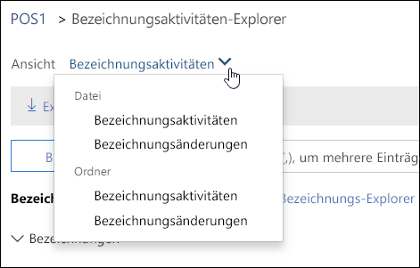
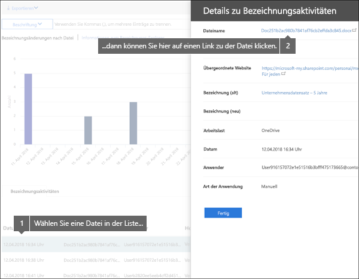
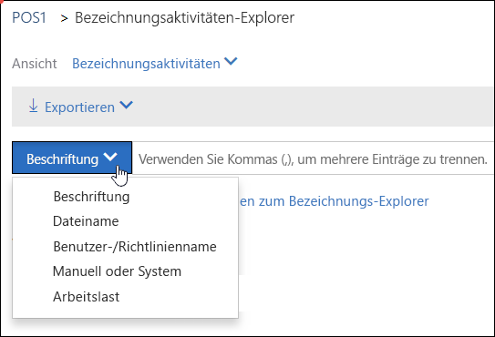

# Anzeigen der Bezeichnungsaktivität für DokumenteView label activity for documents

Nachdem Sie Ihre Bezeichnungen erstellt haben, sollten Sie überprüfen, ob sie auf Inhalte wie gewünscht angewendet werden. Mit dem Bezeichnungsaktivitäten-Explorer im Office 365 Security &amp; Compliance Center können Sie Bezeichnungsaktivitäten für alle Inhalte in SharePoint und OneDrive for Business während der letzten 30 Tage schnell durchsuchen und anzeigen. Dies sind Echtzeitdaten, die Ihnen eine verständliche Ansicht der Vorgänge in Ihrem Mandanten bietet.After you create your labels, you'll want to verify that they're being applied to content as you intended. With the Label Activity Explorer in the Office 365 Security &amp; Compliance Center, you can quickly search and view label activity for all content across SharePoint and OneDrive for Business over the past 30 days. This is real-time data that gives you a clear view into what's happening in your tenant.
  
Mit dem Bezeichnungsaktivitäten-Explorer können Sie beispielsweise folgende Aufgaben ausführen:For example, with the Label Activity Explorer, you can:
  
- Anzeigen, wie oft die einzelnen Bezeichnungen an jedem Tag (bis zu 30 Tage) angewendet wurden.View how many times each label was applied on each day (up to 30 days).
    
- Anzeigen, wer welche Datei genau an welchem Datum mit einer Bezeichnung versehen hat, zusammen mit einem Link zu der Website, auf der sich die Datei befindet.See who labeled exactly which file on which date, along with a link to the site where that file resides.
    
- Anzeigen, für welche Dateien Bezeichnungen geändert oder entfernt wurden, wie die alten und neuen Bezeichnungen lauten und wer die Änderung vorgenommen hat.View which files had labels changed or removed, what the old and new labels are, and who made the change.
    
- Filtern der Daten, um alle Bezeichnungsaktivitäten für bestimmte Bezeichnungen, Dateien oder Benutzer anzuzeigen. Sie können die Bezeichnungsaktivität auch nach Speicherort (SharePoint oder OneDrive for Business) filtern und danach, ob die Bezeichnung manuell oder automatisch angewendet wurde.Filter the data to see all the label activity for a specific label, file, or user. You can also filter label activity by location (SharePoint or OneDrive for Business) and whether the label was applied manually or auto-applied.
    
- Anzeigen der Bezeichnungsaktivitäten für Ordner sowie einzelne Dokumente. In Kürze wird die Möglichkeit verfügbar sein, anzuzeigen, wie viele Dateien in diesem Ordner durch das Anwenden einer Bezeichnung auf den Ordner eine Bezeichnung erhalten haben.View label activity for folders as well as individual documents. Coming soon is the ability to show how many files inside that folder got labeled as a result of the folder getting labeled.
    
Den Bezeichnungsaktivitäten-Explorer finden Sie im Security &amp; Compliance Center\> unter **Data Governance** \> **Bezeichnungsaktivitäten-Explorer**.You can find the Label Activity Explorer in the Security &amp; Compliance Center \> **Data governance** \> **Label Activity Explorer**.
  
Beachten Sie, dass für den Bezeichnungsaktivitäten-Explorer ein Office 365 Enterprise E5-Abonnement erforderlich ist.Note that the Label Activity Explorer requires an Office 365 Enterprise E5 subscription.
  

  
## Anzeigen von Bezeichnungsaktivitäten für Dateien oder OrdnerView label activities for files or folders

Am oberen Rand des Bezeichnungsaktivitäten-Explorers können Sie auswählen, ob Aktivitäten für Dateien oder Ordner angezeigt werden sollen. Beachten Sie, dass Ordneraktivitäten nur den Ordner selbst betreffen, nicht die Dateien innerhalb des Ordners.At the top of the Label Activity Explorer, you can choose whether to view activities for files or folders. Note that folder activity includes only the folder itself, not the files inside the folder.
  
Sie möchten möglicherweise Bezeichnungsaktivitäten für Ordner anzeigen, da beim Anwenden einer Bezeichnung auf einen Ordner alle Dateien in diesem Ordner ebenfalls diese Bezeichnung erhalten (mit Ausnahme von Dateien, auf die bereits eine Bezeichnung explizit angewendet wurde). Daher kann das Anwenden einer Bezeichnung auf einen Ordner sich auf eine beträchtliche Anzahl von Dateien auswirken. Weitere Informationen finden Sie unter [Anwenden einer Standardaufbewahrungsbezeichnung auf den gesamten Inhalt einer SharePoint-Bibliothek, eines Ordners oder einer Dokumentenmappe](labels.md#applying-a-default-retention-label-to-all-content-in-a-sharepoint-library-folder-or-document-set).You might want to see label activity for folders because if you label a folder, all files inside that folder also get that label (except for files that have had a label applied explicitly to them). Therefore, labeling folders might affect a significant number of files. For more information, see [Applying a default retention label to all content in a SharePoint library, folder, or document set](labels.md#applying-a-default-retention-label-to-all-content-in-a-sharepoint-library-folder-or-document-set).
  

  
### BezeichnungsaktivitätenLabel activities

 **Bezeichnungsaktivitäten** umfassen alle Bezeichnungsaktionen: **Hinzufügen**, **Entfernen** oder **Ändern** einer Bezeichnung. Sie können diese Ansicht verwenden, um einen umfassenden Überblick darüber zu erhalten, auf wie viele Dateien die einzelnen Bezeichnungen pro Tag angewendet wurden.**Label activities** includes all label actions: **adding**, **removing**, or **changing** a label. You can use this view to get a comprehensive look at how many files each label's been applied to per day. 
  
### BezeichnungsänderungenLabel changes

 **Bezeichnungsänderungen** umfassen die folgenden potenziell riskanten Aktionen: **Entfernen** oder **Ändern** einer Bezeichnung. Sie können diese Ansicht verwenden, um diese riskanten Aktionen sowie den Benutzer, der sie ausgeführt hat, auf einen Blick zu sehen. In der Aktivitätsliste unterhalb des Diagramms können Sie eine Datei auswählen, und dann im Detailbereich auf der rechten Seite auf einen Link zu dieser Datei klicken.**Label changes** includes the potentially risky actions of **removing** or **changing** a label. You can use this view to quickly see such risky actions and the user who performed them. In the activity list below the chart, you can select a file, and then click a link to that file in the details pane on the right. 
  

  
## Filtern von BezeichnungsaktivitätenFilter label activity

Sie können die Daten mühelos filtern, um alle Bezeichnungsaktivitäten für bestimmte Bezeichnungen, Dateien oder Benutzer anzuzeigen. Sie können Bezeichnungsaktivitäten auch nach Speicherort (SharePoint oder OneDrive for Business) filtern und danach, ob die Bezeichnung manuell oder automatisch angewendet wurde.You can quickly filter the data to see all the label activity for a specific label, file, or user. You can also filter label activity by location (SharePoint or OneDrive for Business) and whether the label was applied manually or auto-applied.
  

  

