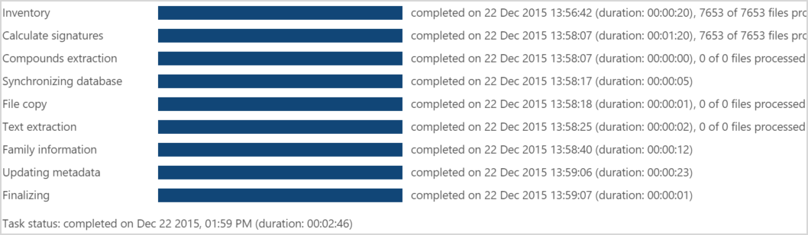

# Anzeigen der Ergebnisse des Prozess Moduls in Office 365 Advanced eDiscovery

Nachdem der **Vorbereitungs** \> **Prozess** initiiert wurde, können Sie den Status und die Ergebnisse anzeigen. 
  
> [!NOTE]
> Für Advanced eDiscovery ist ein Office 365 E3-Abonnement mit dem Add-On für erweiterte Compliance oder ein E5-Abonnement für Ihre Organisation erforderlich. Wenn Sie nicht über diesen Plan verfügen und Advanced eDiscovery ausprobieren möchten, können Sie sich [für eine Testversion von Office 365 Enterprise E5 anmelden](https://go.microsoft.com/fwlink/p/?LinkID=698279). 
  
## Prozessaufgaben Status

In **Prepare** \> **Process** \> **results**zeigt die Seite den aktuellen Status (wenn der Prozess derzeit ausgeführt wird) oder den Status des letzten Prozessstatus Vorgangs an, wie im folgenden Beispiel gezeigt.
  

  
Die angezeigten Vorgänge können je nach den ausgewählten Prozessoptionen variieren. 
  
- **Inventory**: Advanced eDiscovery durchläuft alle für den Prozess ausgewählten Dateien und führt grundlegende Datensammlungen aus.
    
- **Calculate Signatures**: berechnet die digitalen MD5-Signaturen.
    
- **Compounds-Extraktion**: extrahiert interne oder enthaltene Dateien rekursiv aus Verbunddateien (beispielsweise PST, ZIP, msg). Extrahierte Dateien werden im Fallordner des Falls gespeichert.
    
- **Datenbank wird synchronisiert**: interner Datenbankprozess.
    
- **Dateikopie**: kopiert Prozessdateien. Diese Aufgabe wird immer angezeigt, auch wenn die Option Erweiterte Dateien kopieren ausgewählt ist.
    
- **Textextraktion**: bei systemeigenen Dateien extrahiert Advanced eDiscovery Text aus diesen Dateien mithilfe von DTSearch. Der extrahierte Text dieser Dateien wird als Textdateien im Fallordner gespeichert.
    
- **Aktualisieren von Metadaten**: verarbeitet die geladenen Metadaten. 
    
- **Finalisieren**: interne Verarbeitung, die die Daten der geladenen Fall Dateien abschließt (beispielsweise Fehler-und Erfolgs Dateien identifizieren). 
    
Vorgangsstatus: wird nach Abschluss des Vorgangs angezeigt. Während Vorgänge ausgeführt werden, wird die Ausführungsdauer angezeigt.
  
> [!NOTE]
> Abgeschlossene Aufgaben können auch Summen für Dateien enthalten, die die Verarbeitung abgeschlossen haben, oder Dateien mit Fehlern. 
  
> [!TIP]
> "Cancel" bietet eine Rollback-Option, um die Prozessausführung zu beenden und dann auf die vorherige Datenauffüllung oder gespeicherte verarbeitete Daten zurückzusetzen. Rollback löscht alle verarbeiteten Daten. Wenn Sie nicht möchten, dass die verarbeiteten Daten verloren gehen (beispielsweise möchten Sie diese Dateien erneut laden), wählen Sie die Option "Abbrechen" in diesem Fenster aus, um kein Rollback durchführen zu können. 
  
## Prozesszusammenfassung

In Prepare \> Process \> results \> Process Summary wird eine Aufschlüsselung der geladenen Datei Ergebnisse entsprechend der erfolgreichen Dateiverarbeitung und Fehlerergebnisse angezeigt.
  
In den Bereichen wird eine grafische Anzeige der importierten Dateistatistiken wie folgt dargestellt:
  
- **Prozesszusammenfassung**d: alle Dateien im Fall akkumulieren.
    
- **Prozesszusammenfassung zuletzt**: Dateien, die aus der letzten Sitzung oder Aktion geladen wurden. 
    
- **Familien zuletzt**: Familieninformationen im Fall (sofern vorhanden).
    
- Wenn **Seed** -Dateien hinzugefügt wurden, wird die Anzahl der Seed-Dateien pro Problem aufgeführt, die für die Dateien definiert wurde. 
    
    Wenn die Markierung von **Seed** -Dateien fehlgeschlagen ist, wird dies ebenfalls angegeben. 
    
- Wenn Dateien mit vordefinierten **Tags** hinzugefügt wurden, wird die Anzahl der vordefinierten Dateien pro Problem aufgeführt, das für die Dateien definiert wurde. 
    
    Wenn die Markierung von Dateien mit vordefinierten **Tags** fehlgeschlagen ist, wird dies ebenfalls angegeben. 
    

  
## Kumuliertes und letztes Diagramm für Prozesszusammenfassung

Die linke Leiste enthält Quellen + extrahierte Dateien: alle gefundenen Dateien. 
  
Die rechte Leiste, die verarbeitet wird, umfasst Folgendes:
  
- Dateien mit Ladefehlern
    
- Erfolgreich geladene Dateien, was Folgendes beinhalten kann: 
    
  - **Vorhanden**: Dateien, die zuvor geladen wurden und nun erneut geladen wurden (einschließlich Duplikate).
    
  - **Text**: eindeutige Dateien mit Text.
    
  - **Nicht Text**: leere Textdateien, leere systemeigene Textdateien, systemeigene nicht-Textdateien. 
    
  - **Duplikate**s: doppelte Dateien mit Text.
    
## Letzte Prozessfehler

In Prepare \> Process \> results \> Last Process Errors werden Details der Fehler in der letzten Sitzung oder ausgeführten Aktion angezeigt.
  

  
## Siehe auch

[Office 365 Advanced eDiscovery](office-365-advanced-ediscovery.md)
  
[Ausführung des Prozess Moduls und Laden von Daten](run-the-process-module-and-load-data-in-advanced-ediscovery.md)

