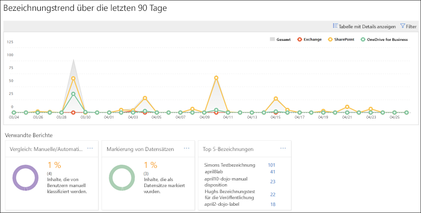
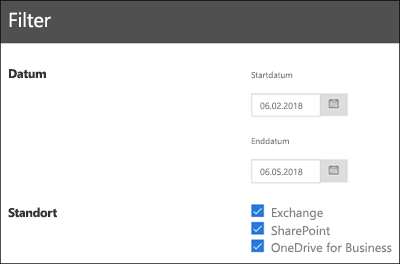

# Anzeigen der Data Governance-BerichteView the data governance reports

Wenn Sie Bezeichnungen erstellt haben, sollten Sie überprüfen, ob sie wie gewünscht auf Inhalte angewendet werden. Mit den Data Governance-Berichten im Office 365 Security &amp; Compliance Center können Sie Folgendes schnell anzeigen:After you create your labels, you'll want to verify that they're being applied to content as you intended. With the data governance reports in the Office 365 Security &amp; Compliance Center, you can quickly view:
  
- **Top-5-Bezeichnungen** Dieser Bericht zeigt die Anzahl der Top-5-Bezeichnungen, die auf Inhalte angewendet wurden. Klicken Sie auf diesen Bericht, um eine Liste mit allen Bezeichnungen anzuzeigen, die vor Kurzem auf Inhalte angewendet wurden. Für jede Bezeichnung werden Anzahl, Speicherort, Art der Anwendung, zugehörige Aufbewahrungsaktionen, Dispositionstyp und ob es sich um einen Datensatz handelt, angezeigt.**Top 5 labels** This report shows the count of the top 5 labels that have been applied to content. Click this report to view a list of all labels that have been recently applied to content. You can see each label's count, location, how it was applied, its retention actions, whether it's a record, and its disposition type. 
    
- **Manuelle bzw. automatische Anwendungen** Dieser Bericht gibt Aufschluss über die Anzahl aller Inhalte, denen manuell bzw. automatisch eine Bezeichnung zugeordnet wurde, sowie den Prozentsatz der Inhalte, denen die Bezeichnung manuell bzw. automatisch zugeordnet wurde.**Manual vs Auto apply** This report shows the count of all content that's been labeled manually or automatically, and the percentage of content that's been labeled manually vs automatically. 
    
- **Kategorisieren von Datensätzen** Dieser Bericht gibt Aufschluss über die Anzahl aller Inhalte, die als Datensatz bzw. Nicht-Datensatz kategorisiert wurden, sowie den Prozentsatz der Inhalte, die als Datensatz bzw. Nicht-Datensatz kategorisiert wurden.**Records tagging** This report shows the count of all content that's been tagged as a record or non-record, and the percentage of content that's been tagged as a record vs. non-record. 
    
- **Bezeichnungstrend während der letzten 90 Tage** In diesem Bericht werden Anzahl und Speicherort aller Bezeichnungen angezeigt, die in den letzten 90 Tagen angewendet wurden.**Labels trend over the past 90 days** This report shows the count and location of all labels that have been applied in the last 90 days. 
    
Alle diese Berichte zeigen mit Bezeichnungen versehene Inhalte aus Exchange, SharePoint und OneDrive for Business an.All these reports show labeled content from Exchange, SharePoint, and OneDrive for Business.
  
Sie finden diese Berichte im Security &amp; Compliance Center \> **Daten-Governance** \> **Dashboard**.You can find these reports in the Security &amp; Compliance Center \> **Data Governance** \> **Dashboard**.
  

  
Sie können die Data Governance-Berichte nach Datum (bis zu 90 Tage) und Speicherort (Exchange, SharePoint und OneDrive for Business) filtern. Es kann bis zu 24 Stunden dauern, bis die aktuellsten Daten in den Berichten angezeigt werden.You can filter the data governance reports by date (up to 90 days) and location (Exchange, SharePoint, and OneDrive for Business). The most recent data can take up to 24 hours to appear in the reports.
  

  

