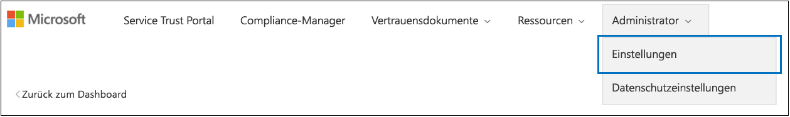

# <a name="work-with-microsoft-compliance-manager-preview"></a><span data-ttu-id="b3f66-104">Arbeiten mit dem Microsoft Compliance-Manager (Vorschau)</span><span class="sxs-lookup"><span data-stu-id="b3f66-104">Work with Microsoft Compliance Manager (Preview)</span></span>

> [!IMPORTANT]
> <span data-ttu-id="b3f66-105">Microsoft Compliance Manager ist ein Dashboard und Verwaltungstool, das eine Zusammenfassung Ihrer Datenschutz-und Compliance-Größe sowie Empfehlungen zur Verbesserung des Datenschutzes und der Compliance bietet.</span><span class="sxs-lookup"><span data-stu-id="b3f66-105">Microsoft Compliance Manager is a dashboard and management tool that provides a summary of your data protection and compliance stature and recommendations to improve data protection and compliance.</span></span> <span data-ttu-id="b3f66-106">Die im Compliance-Manager bereitgestellten Kundenaktionen sind Empfehlungen; Es liegt in Ihrer Organisation, die Wirksamkeit dieser Empfehlungen in ihrem jeweiligen regulatorischen Umfeld vor der Implementierung zu bewerten.</span><span class="sxs-lookup"><span data-stu-id="b3f66-106">The customer actions provided in Compliance Manager are recommendations; it is up to your organization to evaluate the effectiveness of these recommendations in their respective regulatory environment prior to implementation.</span></span> <span data-ttu-id="b3f66-107">Im Compliance-Manager gefundene Empfehlungen sollten nicht als Garantie für die Compliance interpretiert werden.</span><span class="sxs-lookup"><span data-stu-id="b3f66-107">Recommendations found in Compliance Manager should not be interpreted as a guarantee of compliance.</span></span>

## <a name="access-compliance-manager"></a><span data-ttu-id="b3f66-108">Zugriff auf Compliance-Manager</span><span class="sxs-lookup"><span data-stu-id="b3f66-108">Access Compliance Manager</span></span>

<span data-ttu-id="b3f66-p103">Sie können über das Service Trust Portal auf den Compliance-Manager zugreifen. Alle Personen mit einem Microsoft-Konto oder mit einem Azure Active Directory-Organisationskonto können auf den Compliance-Manager zugreifen.</span><span class="sxs-lookup"><span data-stu-id="b3f66-p103">You access Compliance Manager from the Service Trust Portal. Anyone with a Microsoft account or Azure Active Directory organizational account can access Compliance Manager.</span></span>
  
1. <span data-ttu-id="b3f66-111">Wechseln Sie zu [https://servicetrust.microsoft.com](https://servicetrust.microsoft.com/).</span><span class="sxs-lookup"><span data-stu-id="b3f66-111">Go to [https://servicetrust.microsoft.com](https://servicetrust.microsoft.com/).</span></span>

2. <span data-ttu-id="b3f66-112">Melden Sie sich mit Ihrem Microsoft-Dienstkonto an.</span><span class="sxs-lookup"><span data-stu-id="b3f66-112">Sign in with your Microsoft service account.</span></span> <span data-ttu-id="b3f66-113">Dies ist Ihr Office 365-, Microsoft 365-oder Azure Active Directory (Azure AD)-Benutzerkonto.</span><span class="sxs-lookup"><span data-stu-id="b3f66-113">This is your Office 365, Microsoft 365, or Azure Active Directory (Azure AD) user account.</span></span>

3. <span data-ttu-id="b3f66-114">Wählen Sie im Dienst Vertrauensstellungs Portal **Compliance-Manager**aus.</span><span class="sxs-lookup"><span data-stu-id="b3f66-114">In the Service Trust Portal, select **Compliance Manager**.</span></span> <span data-ttu-id="b3f66-115">Dies ist die Vorschauversion von Compliance-Manager.</span><span class="sxs-lookup"><span data-stu-id="b3f66-115">This is the preview version of Compliance Manager.</span></span> <span data-ttu-id="b3f66-116">**Compliance-Manager (klassisch)** ist der Link zur vorherigen Version von Compliance-Manager.</span><span class="sxs-lookup"><span data-stu-id="b3f66-116">**Compliance Manager (Classic)** is the link to the previous version of Compliance Manager.</span></span>

4. <span data-ttu-id="b3f66-117">Wenn die Geheimhaltungsvereinbarung angezeigt wird, lesen Sie Sie, und wählen Sie **bestätigen** aus, um den Vorgang fortzusetzen.</span><span class="sxs-lookup"><span data-stu-id="b3f66-117">When the Non-Disclosure Agreement is displayed, read it, and select **Agree** to continue.</span></span> <span data-ttu-id="b3f66-118">Sie müssen einmal zustimmen, und dann wird das Compliance-Manager-Dashboard angezeigt.</span><span class="sxs-lookup"><span data-stu-id="b3f66-118">You must agree once, and then the Compliance Manager dashboard is displayed.</span></span>

<span data-ttu-id="b3f66-119">Um Ihnen den Einstieg zu erleichtern, wird eine ISO/IEC 27001:2103-Bewertung für Office 365 standardmäßig für Ihre Organisation angezeigt.</span><span class="sxs-lookup"><span data-stu-id="b3f66-119">To get you started, an ISO/IEC 27001:2103 Assessment for Office 365 appears by default for your organization.</span></span>

## <a name="administration"></a><span data-ttu-id="b3f66-120">Verwaltung</span><span class="sxs-lookup"><span data-stu-id="b3f66-120">Administration</span></span>

<span data-ttu-id="b3f66-121">Es gibt bestimmte administrative Funktionen, die nur für den mandantenadministrator verfügbar sind und nur sichtbar sind, wenn Sie mit einem globalen Administratorkonto angemeldet sind.</span><span class="sxs-lookup"><span data-stu-id="b3f66-121">There are specific administrative functions that are only available to the tenant administrator and only visible when logged in with a global administrator account.</span></span> <span data-ttu-id="b3f66-122">Solange der Administrator den Benutzern jedoch keine Compliance-Manager-Rollen zuweist, sind die Daten im Compliance-Manager für alle Benutzer in Ihrer Organisation sichtbar.</span><span class="sxs-lookup"><span data-stu-id="b3f66-122">However, until the administrator assigns Compliance Manager roles to users, data in Compliance Manager is visible to all users in your organization.</span></span> <span data-ttu-id="b3f66-123">Es wird empfohlen, die rollenbasierte Zugriffssteuerung zu implementieren, um zu bestimmen, wer im Compliance-Manager auf Aktionen zugreifen und diese ausführen kann.</span><span class="sxs-lookup"><span data-stu-id="b3f66-123">We recommend implementing role-based access control to determine who can access and perform actions in Compliance Manager.</span></span>
  
### <a name="assigning-compliance-manager-roles-to-users"></a><span data-ttu-id="b3f66-124">Zuweisen von Compliance-Manager-Rollen zu Benutzern</span><span class="sxs-lookup"><span data-stu-id="b3f66-124">Assigning Compliance Manager roles to users</span></span>

<span data-ttu-id="b3f66-125">Jede Compliance-Manager-Rolle verfügt über geringfügig unterschiedliche Berechtigungen.</span><span class="sxs-lookup"><span data-stu-id="b3f66-125">Each Compliance Manager role has slightly different permissions.</span></span> <span data-ttu-id="b3f66-126">Sie können die jeder Rolle zugewiesenen Berechtigungen anzeigen, ermitteln, welche Benutzer sich in welchen Rollen befinden, und Benutzer aus dieser Rolle über das Dienst Vertrauensstellungs Portal hinzufügen oder entfernen.</span><span class="sxs-lookup"><span data-stu-id="b3f66-126">You can view the permissions assigned to each role, see which users are in which roles, and add or remove users from that role through the Service Trust Portal.</span></span> <span data-ttu-id="b3f66-127">Wählen Sie das Menüelement **Admin** aus, und wählen Sie die anzuzeigenden **Einstellungen** aus.</span><span class="sxs-lookup"><span data-stu-id="b3f66-127">Select the **Admin** menu item, and choose **Settings** to view.</span></span>
  

  
<span data-ttu-id="b3f66-129">Hinzufügen oder Entfernen von Benutzern aus Compliance-Manager-Rollen</span><span class="sxs-lookup"><span data-stu-id="b3f66-129">To add or remove users from Compliance Manager roles.</span></span>
  
1. <span data-ttu-id="b3f66-130">Wechseln Sie zu [https://servicetrust.microsoft.com](https://servicetrust.microsoft.com).</span><span class="sxs-lookup"><span data-stu-id="b3f66-130">Go to [https://servicetrust.microsoft.com](https://servicetrust.microsoft.com).</span></span>

2. <span data-ttu-id="b3f66-131">Melden Sie sich mit Ihrem globalen Azure Active Directory-Administratorkonto an.</span><span class="sxs-lookup"><span data-stu-id="b3f66-131">Sign in with your Azure Active Directory global administrator account.</span></span>

3. <span data-ttu-id="b3f66-132">Wählen Sie in der oberen Menüleiste des Dienst Vertrauensstellungs Portals die Option **Administrator** aus, und wählen Sie dann **Einstellungen**aus.</span><span class="sxs-lookup"><span data-stu-id="b3f66-132">On the Service Trust Portal top menu bar, select **Admin** and then choose **Settings**.</span></span>

4. <span data-ttu-id="b3f66-133">Wählen Sie in der Dropdownliste **Rolle auswählen** die Rolle aus, die Sie verwalten möchten.</span><span class="sxs-lookup"><span data-stu-id="b3f66-133">In the **Select Role** drop-down list, select the role that you want to manage.</span></span>

5. <span data-ttu-id="b3f66-134">Benutzer, die jeder Rolle hinzugefügt wurden, werden auf der Seite **Rolle auswählen** aufgeführt.</span><span class="sxs-lookup"><span data-stu-id="b3f66-134">Users added to each role are listed on the **Select Role** page.</span></span>

6. <span data-ttu-id="b3f66-135">Um Benutzer zu dieser Rolle hinzuzufügen, wählen Sie **Hinzufügen**aus.</span><span class="sxs-lookup"><span data-stu-id="b3f66-135">To add users to this role, select **Add**.</span></span> <span data-ttu-id="b3f66-136">Wählen Sie im Dialogfeld **Benutzer hinzufügen** das Feld Benutzer aus.</span><span class="sxs-lookup"><span data-stu-id="b3f66-136">In the **Add Users** dialog, select the user field.</span></span> <span data-ttu-id="b3f66-137">Sie können in der Liste der verfügbaren Benutzer einen Bildlauf durchführen oder mit der Eingabe des Benutzernamens beginnen, um die Liste basierend auf Ihrem Suchbegriff zu filtern.</span><span class="sxs-lookup"><span data-stu-id="b3f66-137">You can scroll through the list of available users or begin typing the user name to filter the list based on your search term.</span></span> <span data-ttu-id="b3f66-138">Wählen Sie den Benutzer aus, der dieses Konto der mit dieser Rolle bereitgestellten Liste **Benutzer** hinzufügen hinzugefügt werden soll.</span><span class="sxs-lookup"><span data-stu-id="b3f66-138">Select the user to add that account to the **Add Users** list provisioned with that role.</span></span> <span data-ttu-id="b3f66-139">Wenn Sie mehrere Benutzer gleichzeitig hinzufügen möchten, beginnen Sie mit der Eingabe eines Benutzernamens, um die Liste zu filtern, und wählen Sie dann den Benutzer aus, der der Liste hinzugefügt werden soll.</span><span class="sxs-lookup"><span data-stu-id="b3f66-139">If you would like to add multiple users concurrently, begin typing a user name to filter the list, and then select the user to add to the list.</span></span> <span data-ttu-id="b3f66-140">Wählen Sie **Speichern** aus, um die ausgewählte Rolle für diese Benutzer festzustellen.</span><span class="sxs-lookup"><span data-stu-id="b3f66-140">Select **Save** to provision the selected role to these users.</span></span> 

    
  
7. <span data-ttu-id="b3f66-142">Wenn Sie Benutzer aus dieser Rolle entfernen möchten, wählen Sie die Benutzer aus, und klicken Sie dann auf **Löschen**.</span><span class="sxs-lookup"><span data-stu-id="b3f66-142">To remove users from this role, select the users and select **Delete**.</span></span>

    

## <a name="groups"></a><span data-ttu-id="b3f66-144">Gruppen</span><span class="sxs-lookup"><span data-stu-id="b3f66-144">Groups</span></span>

<span data-ttu-id="b3f66-145">Mit Gruppen können Sie Bewertungen logisch organisieren und gemeinsame Informations-und Workflowaufgaben Zwischenbewertungen mit denselben oder Verwandten, vom Kunden verwalteten Steuerelementen freigeben.</span><span class="sxs-lookup"><span data-stu-id="b3f66-145">Groups allow you to logically organize Assessments and that share common information and workflow tasks between Assessments that have the same or related customer-managed controls.</span></span> <span data-ttu-id="b3f66-146">Sie können Bewertungen nach Jahr, Standard, Dienst, Team, Abteilung oder Agenturen in Ihrer Organisation gruppieren, um die von Kunden verwalteten Aktionen zu minimieren:</span><span class="sxs-lookup"><span data-stu-id="b3f66-146">You can group Assessments by year, standard, service, team, division, or agencies within your organization to help minimize customer-managed Actions:</span></span>
  
- <span data-ttu-id="b3f66-147">**FFIEC ist Assessments 2019**</span><span class="sxs-lookup"><span data-stu-id="b3f66-147">**FFIEC IS Assessments 2019**</span></span>
  - <span data-ttu-id="b3f66-148">Office 365 + FFIEC ist</span><span class="sxs-lookup"><span data-stu-id="b3f66-148">Office 365 + FFIEC IS</span></span>
  - <span data-ttu-id="b3f66-149">InTune + FFIEC ist</span><span class="sxs-lookup"><span data-stu-id="b3f66-149">Intune + FFIEC IS</span></span>
- <span data-ttu-id="b3f66-150">**Datenschutzbewertungen**</span><span class="sxs-lookup"><span data-stu-id="b3f66-150">**Data Security and Privacy Assessments**</span></span>
  - <span data-ttu-id="b3f66-151">Office 365 + ISO 27001:2013</span><span class="sxs-lookup"><span data-stu-id="b3f66-151">Office 365 + ISO 27001:2013</span></span>
  - <span data-ttu-id="b3f66-152">Office 365 + ISO 27018:2014</span><span class="sxs-lookup"><span data-stu-id="b3f66-152">Office 365 + ISO 27018:2014</span></span>

<span data-ttu-id="b3f66-153">Wenn Sie eine neue Bewertung erstellen, müssen Sie eine neue Gruppe für die Bewertung erstellen oder die Bewertung einer vorhandenen Gruppe zuweisen.</span><span class="sxs-lookup"><span data-stu-id="b3f66-153">When you create a new Assessment, you must create a new group for the Assessment or assign the Assessment to an existing group.</span></span> <span data-ttu-id="b3f66-154">Gruppen können nicht als eigenständige Entitäten erstellt werden.</span><span class="sxs-lookup"><span data-stu-id="b3f66-154">Groups cannot be created as stand-alone entities.</span></span> <span data-ttu-id="b3f66-155">Es wird empfohlen, *vor* dem Hinzufügen neuer Bewertungen eine Gruppierungs Strategie für Ihre Organisation zu ermitteln.</span><span class="sxs-lookup"><span data-stu-id="b3f66-155">It's recommended that you determine a grouping strategy for your organization *before* adding new assessments.</span></span> <span data-ttu-id="b3f66-156">Standardmäßig steht für Ihre anfänglichen Bewertungen eine Gruppe mit dem Namen "Default Group" zur Verfügung.</span><span class="sxs-lookup"><span data-stu-id="b3f66-156">By default, a Group named "Default Group" is available for your initial Assessments.</span></span> <span data-ttu-id="b3f66-157">Gruppen haben keine Sicherheitseigenschaften.</span><span class="sxs-lookup"><span data-stu-id="b3f66-157">Groups do not have any security properties.</span></span> <span data-ttu-id="b3f66-158">Alle Berechtigungen sind Assessments zugeordnet.</span><span class="sxs-lookup"><span data-stu-id="b3f66-158">All permissions are associated with Assessments.</span></span>

<span data-ttu-id="b3f66-159">Beachten Sie beim Arbeiten mit Gruppen Folgendes:</span><span class="sxs-lookup"><span data-stu-id="b3f66-159">When you work with groups, remember:</span></span>
  
- <span data-ttu-id="b3f66-160">Zugehörige bewertungssteuerelemente in unterschiedlichen Bewertungen innerhalb derselben Gruppe werden automatisch aktualisiert, wenn Sie abgeschlossen werden.</span><span class="sxs-lookup"><span data-stu-id="b3f66-160">Related assessment controls in different assessments within the same Group automatically update when completed.</span></span>
- <span data-ttu-id="b3f66-161">Neue Gruppen können Informationen aus einer vorhandenen Gruppe kopieren, wenn Sie eine neue Bewertung erstellen.</span><span class="sxs-lookup"><span data-stu-id="b3f66-161">New groups can copy information from an existing group when you create a new Assessment.</span></span> <span data-ttu-id="b3f66-162">Alle Informationen, die den Implementierungs Details und Test Plan-und Verwaltungs Antwortfeldern von von Kunden verwalteten Steuerelementen aus Bewertungen in der Gruppe hinzugefügt wurden, von der Sie kopieren, werden in die gleichen (oder verwandten) von Kunden verwalteten Steuerelemente in der neuen Bewertung.</span><span class="sxs-lookup"><span data-stu-id="b3f66-162">Any information added to the Implementation Details and Test Plan and Management Response fields of customer-managed controls from Assessments in the group that you're copying from are copied to the same (or related) customer-managed controls in the new Assessment.</span></span> <span data-ttu-id="b3f66-163">Wenn Sie einer vorhandenen Gruppe eine neue Bewertung hinzufügen, werden allgemeine Informationen aus Bewertungen in dieser Gruppe in die neue Bewertung kopiert.</span><span class="sxs-lookup"><span data-stu-id="b3f66-163">If you're adding a new Assessment to an existing group, common information from Assessments in that group are copied to the new Assessment.</span></span>
- <span data-ttu-id="b3f66-164">Gruppennamen (auch *Gruppen-IDs*genannt) müssen innerhalb Ihrer Organisation eindeutig sein.</span><span class="sxs-lookup"><span data-stu-id="b3f66-164">Group names (also called *Group IDs*) must be unique within your organization.</span></span>
- <span data-ttu-id="b3f66-165">Gruppen können Bewertungen für die gleiche Zertifizierung/Regulierung enthalten, aber jede Gruppe kann nur eine Bewertung für ein bestimmtes Cloud Service/Zertifizierungs Paar enthalten.</span><span class="sxs-lookup"><span data-stu-id="b3f66-165">Groups can contain Assessments for the same certification/regulation, but each group can only contain one Assessment for a specific cloud service/certification pair.</span></span> <span data-ttu-id="b3f66-166">Beispielsweise kann eine Gruppe keine zwei Bewertungen für Office 365 und das NIST-GfK enthalten.</span><span class="sxs-lookup"><span data-stu-id="b3f66-166">For example, a group can't contain two Assessments for Office 365 and NIST CSF.</span></span> <span data-ttu-id="b3f66-167">Eine Gruppe kann nur dann mehrere Bewertungen für denselben clouddienst enthalten, wenn die entsprechende Zertifizierung/Regulierung für jede einzelne unterschiedlich ist.</span><span class="sxs-lookup"><span data-stu-id="b3f66-167">A group can contain multiple Assessments for the same cloud service only if the corresponding certification/regulation for each one is different.</span></span>
- <span data-ttu-id="b3f66-168">Nachdem eine Bewertung zu einer Bewertungsgruppe hinzugefügt wurde, kann die Gruppierung nicht mehr geändert werden.</span><span class="sxs-lookup"><span data-stu-id="b3f66-168">Once an assessment has been added to an assessment group, the grouping cannot be changed.</span></span> <span data-ttu-id="b3f66-169">Sie können die Bewertungsgruppe umbenennen, die den Namen der Bewertungs Gruppierung für alle dieser Gruppe zugeordneten Bewertungen ändert.</span><span class="sxs-lookup"><span data-stu-id="b3f66-169">You can rename the assessment group, which changes the name of the assessment grouping for all the assessments associated with that group.</span></span> <span data-ttu-id="b3f66-170">Sie können eine Bewertung und eine neue Bewertungsgruppe erstellen und Informationen aus einer vorhandenen Bewertung kopieren, wodurch effektiv ein Duplikat dieser Bewertung in einer anderen Bewertungsgruppe erstellt wird.</span><span class="sxs-lookup"><span data-stu-id="b3f66-170">You can create an assessment and a new assessment group and copy information from an existing assessment, which effectively creates a duplicate of that assessment in a different assessment group.</span></span>
- <span data-ttu-id="b3f66-171">Durch das Archivieren einer Bewertung wird die Beziehung zwischen dieser Bewertung und der Gruppe unterbrochen.</span><span class="sxs-lookup"><span data-stu-id="b3f66-171">Archiving an assessment breaks the relationship between that assessment and the group.</span></span> <span data-ttu-id="b3f66-172">Weitere Aktualisierungen anderer verwandter Bewertungen werden nicht mehr in der archivierten Bewertung wiedergegeben.</span><span class="sxs-lookup"><span data-stu-id="b3f66-172">Any further updates to other related assessments are no longer reflected in the archived assessment.</span></span>

## <a name="tenant-management"></a><span data-ttu-id="b3f66-173">Mandantenverwaltung</span><span class="sxs-lookup"><span data-stu-id="b3f66-173">Tenant Management</span></span>

<span data-ttu-id="b3f66-174">Compliance-Manager (Preview) enthält eine neue Schnittstelle zum Verwalten neuer Datenelemente, die als **Mandantenverwaltung**bezeichnet werden.</span><span class="sxs-lookup"><span data-stu-id="b3f66-174">Compliance Manager (Preview) includes a new interface for managing new data elements called **Tenant Management**.</span></span> <span data-ttu-id="b3f66-175">Mit dieser Schnittstelle können Sie Mandantenweite Einstellungen verwalten:</span><span class="sxs-lookup"><span data-stu-id="b3f66-175">This interface enables you to manage tenant-wide settings:</span></span>

- <span data-ttu-id="b3f66-176">**Dimensionen:** Anzeigen, hinzufügen und Anpassen von Metadaten für Vorlagen, BEWERTUNGEN und Aktionselemente, mit denen Sie benutzerdefinierte Pivots für Filter erstellen können.</span><span class="sxs-lookup"><span data-stu-id="b3f66-176">**Dimensions:** View, add and customize metadata for Templates, Assessments, and Action Items that allow you to create custom pivots for filters.</span></span>
- <span data-ttu-id="b3f66-177">**Besitzer:** Geben Sie einen Besitzer für jedes Aktionselement an.</span><span class="sxs-lookup"><span data-stu-id="b3f66-177">**Owners:** Specify an owner for each Action Item.</span></span>
- <span data-ttu-id="b3f66-178">**Aktionen für Kunden:** Verwalten Sie die vollständige Liste der Aktionen, die in Compliance-Manager (Preview) enthalten sind, und aktivieren/deaktivieren Sie die Secure Score-Überwachung für Aktionen, die mit Secure Score integriert sind.</span><span class="sxs-lookup"><span data-stu-id="b3f66-178">**Customer Actions:** Manage the complete list of Actions Items included in Compliance Manager (Preview) and enable/disable Secure Score monitoring for Actions that are integrated with Secure Score.</span></span>

<span data-ttu-id="b3f66-179">Wählen Sie **Mandantenverwaltung** aus, um die Verwaltungsschnittstelle zu öffnen, und führen Sie die folgenden Schritte aus, um **Dimensionen**, **Besitzer**und **Kundenaktionen**zu verwalten.</span><span class="sxs-lookup"><span data-stu-id="b3f66-179">Select **Tenant Management** to open the management interface, and use the following steps to manage **Dimensions**, **Owners**, and **Customer Actions**.</span></span>

### <a name="dimensions"></a><span data-ttu-id="b3f66-180">Maße</span><span class="sxs-lookup"><span data-stu-id="b3f66-180">Dimensions</span></span>

<span data-ttu-id="b3f66-181">Dimensionen sind Satz von Metadaten, die Informationen zu einer Vorlage, einer Bewertung oder einem Aktionselement bereitstellen.</span><span class="sxs-lookup"><span data-stu-id="b3f66-181">Dimensions are sets of metadata that provide information about a Template, an Assessment, or an Action Item.</span></span> <span data-ttu-id="b3f66-182">Dimensionen verwenden das Konzept von Schlüsseln und Werten, wobei der Dimensionsschlüssel eine Eigenschaft darstellt, und Dimensionswert gültige Werte für die Eigenschaft darstellt.</span><span class="sxs-lookup"><span data-stu-id="b3f66-182">Dimensions use the concept of Keys and Values, where the Dimension Key represents a property, and Dimension Value represents valid values for the property.</span></span> <span data-ttu-id="b3f66-183">Beispielsweise gibt es im Compliance-Manager drei Arten von Aktionen.</span><span class="sxs-lookup"><span data-stu-id="b3f66-183">For example, in Compliance Manager there are three types of Actions.</span></span> <span data-ttu-id="b3f66-184">Sie werden durch einen Dimensionsschlüssel des **Aktionstyps** und der Dimensionswerte der Dokumentation, der **Betriebs**-und der **technischen** **Beschreibung**definiert.</span><span class="sxs-lookup"><span data-stu-id="b3f66-184">They are defined by a Dimension Key of **Action Type** and Dimension Values of **Documentation**, **Operational**, and **Technical**.</span></span> <span data-ttu-id="b3f66-185">Sie können vorhandene Dimensionen ändern oder eigene Bemaßungen hinzufügen.</span><span class="sxs-lookup"><span data-stu-id="b3f66-185">You can modify existing Dimensions or add your own.</span></span> <span data-ttu-id="b3f66-186">Das Hinzufügen von Dimensionen ist häufig beim Importieren benutzerdefinierter Vorlagen erforderlich.</span><span class="sxs-lookup"><span data-stu-id="b3f66-186">Adding Dimensions is often necessary when importing custom Templates.</span></span>

#### <a name="add-a-dimension"></a><span data-ttu-id="b3f66-187">Hinzufügen einer Dimension</span><span class="sxs-lookup"><span data-stu-id="b3f66-187">Add a Dimension</span></span>

1. <span data-ttu-id="b3f66-188">Öffnen Sie die **Mandantenverwaltung** , und wählen Sie **Dimensionen**aus.</span><span class="sxs-lookup"><span data-stu-id="b3f66-188">Open **Tenant Management** and select **Dimensions**.</span></span>
2. <span data-ttu-id="b3f66-189">Wählen Sie **+ Dimension hinzufügen**aus.</span><span class="sxs-lookup"><span data-stu-id="b3f66-189">Select **+ Add Dimension**.</span></span>
3. <span data-ttu-id="b3f66-190">Geben Sie im Feld **Schlüssel** einen eindeutigen Namen ein.</span><span class="sxs-lookup"><span data-stu-id="b3f66-190">Enter a unique name in the **Key** field.</span></span>
4. <span data-ttu-id="b3f66-191">Aktivieren Sie optional mehrere Werte, die gleichzeitig für dieselbe Taste verwendet werden sollen, und schieben Sie die Umschaltfläche für die Option **Mehrfachauswahl für Bemaßungen** auf ein.</span><span class="sxs-lookup"><span data-stu-id="b3f66-191">Optionally enable multiple values to be used concurrently for the same Key, slide the toggle for **Allow multi selection for dimensions** to on.</span></span>
5. <span data-ttu-id="b3f66-192">Wählen Sie **+ Hinzufügen** aus, um einen Wert hinzuzufügen, indem Sie einen eindeutigen Namen angeben und auf das Symbol Speichern klicken.</span><span class="sxs-lookup"><span data-stu-id="b3f66-192">Select **+ Add** to add a value by providing a unique name and clicking the save icon.</span></span>
6. <span data-ttu-id="b3f66-193">Wiederholen Sie Schritt 5 für jeden Wert, den Sie hinzufügen möchten.</span><span class="sxs-lookup"><span data-stu-id="b3f66-193">Repeat Step 5 for each value you want to add.</span></span>
7. <span data-ttu-id="b3f66-194">Wählen Sie **Speichern** aus, um die neue Dimension zu speichern.</span><span class="sxs-lookup"><span data-stu-id="b3f66-194">Select **Save** to save the new Dimension.</span></span>

#### <a name="edit-a-dimension"></a><span data-ttu-id="b3f66-195">Bearbeiten einer Dimension</span><span class="sxs-lookup"><span data-stu-id="b3f66-195">Edit a Dimension</span></span>

<span data-ttu-id="b3f66-196">Sie können einen Dimensionsschlüssel umbenennen, aber Sie können die Werte für benutzerdefinierte Bemaßungen ändern.</span><span class="sxs-lookup"><span data-stu-id="b3f66-196">You can rename a Dimension Key, but you can modify the values for custom Dimensions.</span></span>

1. <span data-ttu-id="b3f66-197">Öffnen Sie die **Mandantenverwaltung** , und wählen Sie **Dimensionen**aus.</span><span class="sxs-lookup"><span data-stu-id="b3f66-197">Open **Tenant Management** and select **Dimensions**.</span></span>
2. <span data-ttu-id="b3f66-198">Suchen Sie die Dimension, die Sie bearbeiten möchten, wählen Sie daneben die Auslassungspunkte (...) aus, und wählen Sie **Bearbeiten**aus.</span><span class="sxs-lookup"><span data-stu-id="b3f66-198">Locate the Dimension you want to edit, select the ellipses (…) next to it, and select **Edit**.</span></span>
3. <span data-ttu-id="b3f66-199">Wählen Sie **+ Hinzufügen** aus, um einen Wert hinzuzufügen, indem Sie einen eindeutigen Namen angeben und auf das Symbol Speichern klicken, oder wählen Sie den Wert aus, den Sie bearbeiten oder löschen möchten, und wählen Sie **Entfernen** oder **Bearbeiten**aus.</span><span class="sxs-lookup"><span data-stu-id="b3f66-199">Select **+ Add** to add a value by providing a unique name and clicking the save icon, or select the value you want to edit or delete, and select **Remove** or **Edit**.</span></span>
4. <span data-ttu-id="b3f66-200">Klicken Sie auf **Speichern** , wenn Sie die Änderungen abgeschlossen haben.</span><span class="sxs-lookup"><span data-stu-id="b3f66-200">Select **Save** when you have finished making changes.</span></span>

#### <a name="delete-a-dimension"></a><span data-ttu-id="b3f66-201">Löschen einer Dimension</span><span class="sxs-lookup"><span data-stu-id="b3f66-201">Delete a Dimension</span></span>

<span data-ttu-id="b3f66-202">Sie können benutzerdefinierte Dimensionen bei Bedarf löschen.</span><span class="sxs-lookup"><span data-stu-id="b3f66-202">You can delete custom Dimensions if needed.</span></span>

1. <span data-ttu-id="b3f66-203">Öffnen Sie die **Mandantenverwaltung** , und wählen Sie **Dimensionen**aus.</span><span class="sxs-lookup"><span data-stu-id="b3f66-203">Open **Tenant Management** and select **Dimensions**.</span></span>
2. <span data-ttu-id="b3f66-204">Suchen Sie die Dimension, die Sie löschen möchten, wählen Sie daneben die Ellipsen (...) aus, und wählen Sie dann **Löschen**aus.</span><span class="sxs-lookup"><span data-stu-id="b3f66-204">Locate the Dimension you want to delete, select the ellipses (…) next to it, and select **Delete**.</span></span>
3. <span data-ttu-id="b3f66-205">Wenn die Bestätigungsmeldung angezeigt wird, wählen Sie **Löschen**aus.</span><span class="sxs-lookup"><span data-stu-id="b3f66-205">When the confirmation message appears, select **Delete**.</span></span>

### <a name="owners"></a><span data-ttu-id="b3f66-206">Besitzer</span><span class="sxs-lookup"><span data-stu-id="b3f66-206">Owners</span></span>

<span data-ttu-id="b3f66-207">Besitzer werden verwendet, um die zuständige Partei für jedes Steuerelement zu identifizieren.</span><span class="sxs-lookup"><span data-stu-id="b3f66-207">Owners are used to identify the responsible party for each control.</span></span> <span data-ttu-id="b3f66-208">Alle integrierten Steuerelemente befinden sich im Besitz von Microsoft, von Kunden oder von beiden.</span><span class="sxs-lookup"><span data-stu-id="b3f66-208">All built-in controls are owned by Microsoft, by customers, or by both.</span></span> <span data-ttu-id="b3f66-209">Sie können benutzerdefinierte Werte für Besitzer erstellen, die verwendet werden können, um mehr granulare Zuständigkeiten innerhalb Ihrer Organisation anzugeben.</span><span class="sxs-lookup"><span data-stu-id="b3f66-209">You can create custom values for Owners that can be used to specify more granular responsibilities within your organization.</span></span> <span data-ttu-id="b3f66-210">Sie können beispielsweise Besitzer erstellen, die bestimmte Gruppen, Teams oder Unternehmenseinheiten in Ihrer Organisation darstellen.</span><span class="sxs-lookup"><span data-stu-id="b3f66-210">For example, you could create Owners that represent specific groups, teams, or business units within your organization.</span></span>

#### <a name="add-an-owner"></a><span data-ttu-id="b3f66-211">Hinzufügen eines Besitzers</span><span class="sxs-lookup"><span data-stu-id="b3f66-211">Add an Owner</span></span>

1. <span data-ttu-id="b3f66-212">Öffnen Sie die **Mandantenverwaltung** , und wählen Sie **Besitzer**aus.</span><span class="sxs-lookup"><span data-stu-id="b3f66-212">Open **Tenant Management** and select **Owners**.</span></span>
2. <span data-ttu-id="b3f66-213">Wählen Sie **+ Besitzer hinzufügen**aus.</span><span class="sxs-lookup"><span data-stu-id="b3f66-213">Select **+ Add owner**.</span></span>
3. <span data-ttu-id="b3f66-214">Geben Sie einen Namen und eine Beschreibung für den Besitzer an, und wählen Sie **Speichern**aus.</span><span class="sxs-lookup"><span data-stu-id="b3f66-214">Provide a Name and Description for the Owner and select **Save**.</span></span> <span data-ttu-id="b3f66-215">Die Beschreibung wird in der Spalte Besitzer angezeigt.</span><span class="sxs-lookup"><span data-stu-id="b3f66-215">The description is displayed in the Owner column.</span></span>

#### <a name="edit-an-owner"></a><span data-ttu-id="b3f66-216">Bearbeiten eines Besitzers</span><span class="sxs-lookup"><span data-stu-id="b3f66-216">Edit an Owner</span></span>

<span data-ttu-id="b3f66-217">Ein Besitzername kann nicht bearbeitet werden, aber Sie können die Beschreibung ändern, die in der Spalte Besitzer angezeigt wird.</span><span class="sxs-lookup"><span data-stu-id="b3f66-217">You can’t edit an Owner name, but you can modify the description that is displayed in the Owner column.</span></span>

1. <span data-ttu-id="b3f66-218">Öffnen Sie die **Mandantenverwaltung** , und wählen Sie **Besitzer**aus.</span><span class="sxs-lookup"><span data-stu-id="b3f66-218">Open **Tenant Management** and select **Owners**.</span></span>
2. <span data-ttu-id="b3f66-219">Suchen Sie den Besitzer, den Sie bearbeiten möchten, wählen Sie daneben die Auslassungspunkte (...) aus, und klicken Sie dann auf **Bearbeiten**.</span><span class="sxs-lookup"><span data-stu-id="b3f66-219">Locate the Owner you want to edit, select the ellipses (…) next to it, and select **Edit**.</span></span>
3. <span data-ttu-id="b3f66-220">Ändern Sie die Beschreibung nach Bedarf, und wählen Sie **Speichern**aus.</span><span class="sxs-lookup"><span data-stu-id="b3f66-220">Modify the Description as needed and select **Save**.</span></span>

#### <a name="delete-an-owner"></a><span data-ttu-id="b3f66-221">Löschen eines Besitzers</span><span class="sxs-lookup"><span data-stu-id="b3f66-221">Delete an Owner</span></span>

1. <span data-ttu-id="b3f66-222">Öffnen Sie die **Mandantenverwaltung** , und wählen Sie **Besitzer**aus.</span><span class="sxs-lookup"><span data-stu-id="b3f66-222">Open **Tenant Management** and select **Owners**.</span></span>
2. <span data-ttu-id="b3f66-223">Suchen Sie den Besitzer, den Sie löschen möchten, wählen Sie daneben die Auslassungspunkte (...) aus, und wählen Sie dann **Löschen**aus.</span><span class="sxs-lookup"><span data-stu-id="b3f66-223">Locate the Owner you want to delete, select the ellipses (…) next to it, and select **Delete**.</span></span>
3. <span data-ttu-id="b3f66-224">Wenn die Bestätigungsmeldung angezeigt wird, wählen Sie **Löschen**aus.</span><span class="sxs-lookup"><span data-stu-id="b3f66-224">When the confirmation message appears, select **Delete**.</span></span>

### <a name="customer-actions"></a><span data-ttu-id="b3f66-225">Kundenaktionen</span><span class="sxs-lookup"><span data-stu-id="b3f66-225">Customer Actions</span></span>

<span data-ttu-id="b3f66-226">Im Bereich Kundenaktionen werden alle Kundenaktionen für alle Vorlagen und Bewertungen im Compliance-Manager (Preview) angezeigt.</span><span class="sxs-lookup"><span data-stu-id="b3f66-226">The Customer Actions area shows all the customer actions for all Templates and Assessments in Compliance Manager (Preview).</span></span>


<span data-ttu-id="b3f66-228">Auf einen Blick können Sie den Titel, den Besitzer, die Kategorie, die Erzwingung und das Ergebnis einer Aktion anzeigen und ermitteln, ob Sie mit Secure Score integriert ist.</span><span class="sxs-lookup"><span data-stu-id="b3f66-228">At-a-glance, you can see an Action’s title, owner, category, enforcement, and score, and determine if it is integrated with Secure Score.</span></span> <span data-ttu-id="b3f66-229">Sie können eine Aktion erweitern und dann **Read More** auswählen, um die Beschreibung der Aktion zu lesen und auf Links in der Beschreibung zuzugreifen.</span><span class="sxs-lookup"><span data-stu-id="b3f66-229">You can expand an Action and select **Read More** to read the Action’s description and access any links in the description.</span></span> <span data-ttu-id="b3f66-230">Sie können diese Schnittstelle auch verwenden, um die sichere Ergebnis Integration auf Aktionsbasis zu aktivieren und zu deaktivieren und benutzerdefinierte Aktionen hinzuzufügen.</span><span class="sxs-lookup"><span data-stu-id="b3f66-230">You can also use this interface to enable and disable Secure Score integration on a per-action basis, and to add custom actions.</span></span> <span data-ttu-id="b3f66-231">Aktionen mit einer Secure Score-Integrationsfunktion haben neben Ihnen ein Auslassungszeichen (...) (Beachten Sie, dass in benutzerdefinierten Aktionen neben Ihnen auch ein Auslassungszeichen steht).</span><span class="sxs-lookup"><span data-stu-id="b3f66-231">Actions that have Secure Score integration capabilities have an ellipsis (…) next to them (note that custom actions also have an ellipsis next to them).</span></span>

#### <a name="enable-or-disable-secure-score-integration"></a><span data-ttu-id="b3f66-232">Aktivieren oder Deaktivieren der Integration sicherer Bewertungen</span><span class="sxs-lookup"><span data-stu-id="b3f66-232">Enable or disable Secure Score integration</span></span>

1. <span data-ttu-id="b3f66-233">Wählen Sie die Auslassungspunkte (...) für die Aktion aus, die Sie ändern möchten, und wählen Sie **Bearbeiten**aus.</span><span class="sxs-lookup"><span data-stu-id="b3f66-233">Select the ellipses (…) for the Action you want to modify and select **Edit**.</span></span>
2. <span data-ttu-id="b3f66-234">Wechseln Sie zur Option Secure Score Continuous Update auf ein oder aus, um die kontinuierliche Überwachung mithilfe von Secure Score zu aktivieren oder zu deaktivieren.</span><span class="sxs-lookup"><span data-stu-id="b3f66-234">Toggle the switch for Secure Score continuous update to On or Off to enable or disable continuous monitoring through Secure Score.</span></span>
3. <span data-ttu-id="b3f66-235">Klicken Sie auf **Speichern**.</span><span class="sxs-lookup"><span data-stu-id="b3f66-235">Select **Save**.</span></span>

#### <a name="add-a-customer-action"></a><span data-ttu-id="b3f66-236">Hinzufügen einer Kunden Aktion</span><span class="sxs-lookup"><span data-stu-id="b3f66-236">Add a customer action</span></span>

1. <span data-ttu-id="b3f66-237">Wählen Sie **+ Kunden Aktion hinzufügen**aus.</span><span class="sxs-lookup"><span data-stu-id="b3f66-237">Select **+ Add Customer Action**.</span></span>
2. <span data-ttu-id="b3f66-238">Geben Sie einen eindeutigen Titel für die Aktion im Feld **Title** an.</span><span class="sxs-lookup"><span data-stu-id="b3f66-238">Provide a unique title for the Action in the **Title** field.</span></span>
3. <span data-ttu-id="b3f66-239">Geben Sie im Feld **Maximale Konformitätsbewertung** eine Konformitätsbewertung für die Aktion an (Dies kann eine beliebige Zahl von 1-99 sein).</span><span class="sxs-lookup"><span data-stu-id="b3f66-239">Provide a Compliance Score for the Action in the **Maximum Compliance Score** field (this can be any number from 1-99).</span></span>
4. <span data-ttu-id="b3f66-240">Geben Sie \*\*\*\* mithilfe der Dropdownliste Aktionstyp den Typ der Aktion an, die Sie hinzufügen möchten.</span><span class="sxs-lookup"><span data-stu-id="b3f66-240">Use the **Action Type** dropdown to specify the type of Action you are adding.</span></span> <span data-ttu-id="b3f66-241">Wenn der Aktionstyp nicht vorhanden ist, können Sie ihn hinzufügen, indem Sie den Wert dem Dimensionsschlüssel Aktion hinzufügen.</span><span class="sxs-lookup"><span data-stu-id="b3f66-241">If the Action Type does not exist, you can add it by adding the value to the Action Type dimension key.</span></span>
5. <span data-ttu-id="b3f66-242">Verwenden Sie das Dropdown-Menü **Dimensionen** , um Dimensionsschlüssel und Werte für die Aktion anzugeben oder hinzuzufügen.</span><span class="sxs-lookup"><span data-stu-id="b3f66-242">Use the **Dimensions** dropdown to specify or add dimension keys and values for the Action.</span></span>
6. <span data-ttu-id="b3f66-243">Verwenden Sie die Dropdownliste **Besitzer** , um den Besitzer für Aktion anzugeben.</span><span class="sxs-lookup"><span data-stu-id="b3f66-243">Use the **Owner** dropdown to specify the owner for Action.</span></span>
7. <span data-ttu-id="b3f66-244">Wählen **+** Sie diese Option aus, um eine Beschreibung und einen Beschreibungstitel für die Aktion hinzuzufügen.</span><span class="sxs-lookup"><span data-stu-id="b3f66-244">Select **+** to add a description and description title for the Action.</span></span>
8. <span data-ttu-id="b3f66-245">Wählen Sie das **X** aus, um das Blatt Beschreibung zu schließen.</span><span class="sxs-lookup"><span data-stu-id="b3f66-245">Select the **X** to close the Description blade.</span></span>
9. <span data-ttu-id="b3f66-246">Wählen Sie **Speichern** aus, um die Aktion Kunden zu speichern.</span><span class="sxs-lookup"><span data-stu-id="b3f66-246">Select **Save** to save the Customer Action.</span></span>

#### <a name="edit-a-customer-action"></a><span data-ttu-id="b3f66-247">Bearbeiten einer Kunden Aktion</span><span class="sxs-lookup"><span data-stu-id="b3f66-247">Edit a customer action</span></span>

1. <span data-ttu-id="b3f66-248">Wählen Sie die Auslassungspunkte (...) für die Aktion aus, die Sie ändern möchten, und wählen Sie **Bearbeiten**aus.</span><span class="sxs-lookup"><span data-stu-id="b3f66-248">Select the ellipses (…) for the Action you want to modify and select **Edit**.</span></span>
2. <span data-ttu-id="b3f66-249">Bearbeiten Sie die Aktion wie gewünscht, und wählen Sie **Speichern**aus.</span><span class="sxs-lookup"><span data-stu-id="b3f66-249">Edit the Action as desired, and select **Save**.</span></span>

#### <a name="delete-a-customer-action"></a><span data-ttu-id="b3f66-250">Löschen einer Kunden Aktion</span><span class="sxs-lookup"><span data-stu-id="b3f66-250">Delete a customer action</span></span>

1. <span data-ttu-id="b3f66-251">Wählen Sie die Auslassungspunkte (...) für die Aktion aus, die Sie ändern möchten, und wählen Sie **Löschen**aus.</span><span class="sxs-lookup"><span data-stu-id="b3f66-251">Select the ellipses (…) for the Action you want to modify and select **Delete**.</span></span>
2. <span data-ttu-id="b3f66-252">Wenn die Bestätigungsmeldung angezeigt wird, wählen Sie **Löschen**aus.</span><span class="sxs-lookup"><span data-stu-id="b3f66-252">When the confirmation message appears, select **Delete**.</span></span>

## <a name="assessments"></a><span data-ttu-id="b3f66-253">Bewertungen</span><span class="sxs-lookup"><span data-stu-id="b3f66-253">Assessments</span></span>

### <a name="add-an-assessment"></a><span data-ttu-id="b3f66-254">Hinzufügen eines Assessments</span><span class="sxs-lookup"><span data-stu-id="b3f66-254">Add an Assessment</span></span>
  
1. <span data-ttu-id="b3f66-255">Wählen Sie im Dashboard Assessments die Option **+ Assessment hinzufügen**aus.</span><span class="sxs-lookup"><span data-stu-id="b3f66-255">In the Assessments dashboard, select **+ Add Assessment**.</span></span>

2. <span data-ttu-id="b3f66-256">Wenn das Blade geöffnet wird, geben Sie die folgenden Informationen ein:</span><span class="sxs-lookup"><span data-stu-id="b3f66-256">When the blade opens, enter the following information:</span></span>

    - <span data-ttu-id="b3f66-257">**Title (erforderlich):** Geben Sie einen Titel für Ihre Bewertung ein.</span><span class="sxs-lookup"><span data-stu-id="b3f66-257">**Title (required):** Enter a title for your Assessment</span></span>
    - <span data-ttu-id="b3f66-258">**Wählen Sie eine Vorlage aus (erforderlich):** Auswählen einer Standard-oder benutzerdefinierten Vorlage</span><span class="sxs-lookup"><span data-stu-id="b3f66-258">**Please select a template (required):** Select a standard or custom template</span></span>
    - <span data-ttu-id="b3f66-259">**Wählen Sie eine Gruppe aus, oder fügen Sie eine neue Gruppe hinzu (erforderlich):** Wählen Sie eine vorhandene Gruppe aus, oder wählen Sie aus, um eine neue Gruppe hinzuzufügen, und geben Sie einen eindeutigen Gruppennamen an.</span><span class="sxs-lookup"><span data-stu-id="b3f66-259">**Please select a group or add a new group (required):** Select an existing group or choose to add a new group, and provide a unique group name</span></span>
    - <span data-ttu-id="b3f66-260">Möchten **Sie die Daten aus einer vorhandenen Gruppe kopieren? (optional):** Umschalten des Steuerelements zum Aktivieren der Gruppen Kopie und dann:</span><span class="sxs-lookup"><span data-stu-id="b3f66-260">**Would you like to copy the data from an existing group? (optional):** Toggle the control to enable group copy and then:</span></span>
        - <span data-ttu-id="b3f66-261">**Wählen Sie eine Gruppe aus (optional):** Wenn die Gruppen Kopie aktiviert ist, wählen Sie die Gruppe aus, aus der kopiert werden soll.</span><span class="sxs-lookup"><span data-stu-id="b3f66-261">**Select a group (optional):** If group copy is enabled, select the group to copy from</span></span>
            - <span data-ttu-id="b3f66-262">**Implementierungs Details (optional):** Auswählen, um Implementierungsdetails in die neue Gruppe zu kopieren</span><span class="sxs-lookup"><span data-stu-id="b3f66-262">**Implementation Details (optional):** Select to copy implementation details to the new group</span></span>
            - <span data-ttu-id="b3f66-263">**Testplan #a0 zusätzliche Informationen (optional):** Wählen Sie diese Option aus, um den Testplan und weitere Informationsdetails in die neue Gruppe zu kopieren.</span><span class="sxs-lookup"><span data-stu-id="b3f66-263">**Test plan & additional information (optional):** Select to copy test plan and additional information details to the new group</span></span>
            - <span data-ttu-id="b3f66-264">**Dokumente (optional):** Auswählen, um Dokumente in die neue Gruppe zu kopieren</span><span class="sxs-lookup"><span data-stu-id="b3f66-264">**Documents (optional):** Select to copy documents to the new group</span></span>

3. <span data-ttu-id="b3f66-265">Wählen Sie **Speichern** aus, um die Bewertung zu erstellen.</span><span class="sxs-lookup"><span data-stu-id="b3f66-265">Select **Save** to create the Assessment.</span></span>

 <span data-ttu-id="b3f66-266">Die neue Bewertung wird im Assessment-Dashboard angezeigt und zeigt die folgenden Informationen an:</span><span class="sxs-lookup"><span data-stu-id="b3f66-266">The new Assessment appears on the Assessment dashboard and displays the following information:</span></span>

- <span data-ttu-id="b3f66-267">Der Titel der Bewertung.</span><span class="sxs-lookup"><span data-stu-id="b3f66-267">The title of the Assessment.</span></span>
- <span data-ttu-id="b3f66-268">Die Dimensionen der Bewertung, einschließlich Zertifizierung, Umgebung und Produkt, die auf die Bewertung angewendet wurden.</span><span class="sxs-lookup"><span data-stu-id="b3f66-268">The dimensions of the Assessment, including certification, environment, and product applied to the Assessment.</span></span>
- <span data-ttu-id="b3f66-269">Das Datum, an dem es erstellt wurde, und das Datum, an dem es zuletzt geändert wurde.</span><span class="sxs-lookup"><span data-stu-id="b3f66-269">The date it was created and date when it was last modified.</span></span>
- <span data-ttu-id="b3f66-270">Das Bewertungsergebnis wird als Prozentsatz angezeigt.</span><span class="sxs-lookup"><span data-stu-id="b3f66-270">The Assessment Score shown as a percentage.</span></span>
- <span data-ttu-id="b3f66-271">Fortschrittsindikatoren, die die Anzahl der beurteilten von Microsoft verwalteten und vom Kunden verwalteten Steuerelemente anzeigen.</span><span class="sxs-lookup"><span data-stu-id="b3f66-271">Progress indicators that show the number of assessed Microsoft-managed and customer-manged controls.</span></span>

### <a name="copying-information-from-existing-assessments"></a><span data-ttu-id="b3f66-272">Kopieren von Informationen aus vorhandenen Bewertungen</span><span class="sxs-lookup"><span data-stu-id="b3f66-272">Copying information from existing Assessments</span></span>

<span data-ttu-id="b3f66-273">Wenn Sie eine Bewertung erstellen, haben Sie die Möglichkeit, Informationen aus einer vorhandenen Gruppe zu kopieren.</span><span class="sxs-lookup"><span data-stu-id="b3f66-273">When you create an Assessment, you have the option to copy information from an existing group.</span></span> <span data-ttu-id="b3f66-274">Auf diese Weise können Sie die in die kopierte Bewertung eingegebenen Informationen auf dieselben Steuerelemente in der neuen Bewertung anwenden.</span><span class="sxs-lookup"><span data-stu-id="b3f66-274">This allows you to apply the information entered into the copied assessment to the same controls in the new Assessment.</span></span> <span data-ttu-id="b3f66-275">Wenn Sie beispielsweise eine Gruppe für alle FFIEC-bezogenen Bewertungen in Ihrer Organisation haben, können Sie die folgenden Informationen aus vorhandenen Bewertungen kopieren:</span><span class="sxs-lookup"><span data-stu-id="b3f66-275">For example, if you have a group for all FFIEC-related Assessments in your organization, you can copy the following information from existing assessments:</span></span>

- <span data-ttu-id="b3f66-276">Implementierungs Details</span><span class="sxs-lookup"><span data-stu-id="b3f66-276">Implementation Details</span></span>
- <span data-ttu-id="b3f66-277">Testplan #a0 zusätzliche Informationen</span><span class="sxs-lookup"><span data-stu-id="b3f66-277">Test Plan & Additional Information</span></span>
- <span data-ttu-id="b3f66-278">Dokumente</span><span class="sxs-lookup"><span data-stu-id="b3f66-278">Documents</span></span>

#### <a name="copy-information-from-an-existing-assessment-to-a-new-assessment"></a><span data-ttu-id="b3f66-279">Kopieren von Informationen aus einer vorhandenen Bewertung in eine neue Bewertung</span><span class="sxs-lookup"><span data-stu-id="b3f66-279">Copy information from an existing Assessment to a new Assessment</span></span>
  
1. <span data-ttu-id="b3f66-280">Wählen Sie im Assessment-Dashboard die Option **+ Add Assessment**aus.</span><span class="sxs-lookup"><span data-stu-id="b3f66-280">In the Assessment dashboard, select **+ Add Assessment**.</span></span>
    
2. <span data-ttu-id="b3f66-281">Füllen Sie im Fenster **Bewertung hinzufügen** die folgenden Informationen aus.</span><span class="sxs-lookup"><span data-stu-id="b3f66-281">In the **Add an Assessment** window, complete the following information</span></span>

    - <span data-ttu-id="b3f66-282">**Title (erforderlich):** Geben Sie einen Titel für Ihre Bewertung ein.</span><span class="sxs-lookup"><span data-stu-id="b3f66-282">**Title (required):** Enter a title for your Assessment.</span></span>
    - <span data-ttu-id="b3f66-283">**Wählen Sie eine Vorlage aus (erforderlich):** Wählen Sie eine Standard-oder benutzerdefinierte Vorlage aus.</span><span class="sxs-lookup"><span data-stu-id="b3f66-283">**Please select a template (required):** Select a standard or custom template.</span></span>
    - <span data-ttu-id="b3f66-284">**Wählen Sie eine Gruppe aus, oder fügen Sie eine neue Gruppe hinzu (erforderlich):** Wählen Sie **neue Gruppe hinzufügen** aus, und geben Sie einen eindeutigen Gruppennamen an.</span><span class="sxs-lookup"><span data-stu-id="b3f66-284">**Please select a group or add a new group (required):** Choose **Add a new group** and provide a unique group name.</span></span>
    - <span data-ttu-id="b3f66-285">Möchten **Sie die Daten aus einer vorhandenen Gruppe kopieren? (optional):** schalten Sie das Steuerelement in ein ein, um die Gruppen Kopie zu aktivieren, und klicken Sie dann auf:- **Wählen Sie eine Gruppe aus (optional):** wenn Gruppen Kopie aktiviert ist, wählen Sie die Gruppe aus, aus der kopiert werden soll.</span><span class="sxs-lookup"><span data-stu-id="b3f66-285">**Would you like to copy the data from an existing group? (optional):** Toggle the control to On to enable group copy and then: - **Select a group (optional):** If group copy is enabled, select the group to copy from.</span></span>
            <span data-ttu-id="b3f66-286">- **Implementierungs Details (optional):** Wählen Sie diese Option aus, um Implementierungsdetails in die neue Gruppe zu kopieren.</span><span class="sxs-lookup"><span data-stu-id="b3f66-286">- **Implementation Details (optional):** Select to copy implementation details to the new group.</span></span>
            <span data-ttu-id="b3f66-287">- **Testplan #a0 zusätzliche Informationen (optional):** Wählen Sie diese Option aus, um den Testplan und weitere Informationsdetails in die neue Gruppe zu kopieren.</span><span class="sxs-lookup"><span data-stu-id="b3f66-287">- **Test plan & additional information (optional):** Select to copy test plan and additional information details to the new group.</span></span>
            <span data-ttu-id="b3f66-288">- **Dokumente (optional):** Wählen Sie diese Option aus, um Dokumente in die neue Gruppe zu kopieren.</span><span class="sxs-lookup"><span data-stu-id="b3f66-288">- **Documents (optional):** Select to copy documents to the new group.</span></span>

3. <span data-ttu-id="b3f66-289">Wählen Sie **Speichern** aus, um die Bewertung zu erstellen.</span><span class="sxs-lookup"><span data-stu-id="b3f66-289">Select **Save** to create the Assessment.</span></span>

### <a name="viewing-assessments"></a><span data-ttu-id="b3f66-290">Anzeigen von Bewertungen</span><span class="sxs-lookup"><span data-stu-id="b3f66-290">Viewing Assessments</span></span>

#### <a name="view-an-assessment"></a><span data-ttu-id="b3f66-291">Anzeigen einer Bewertung</span><span class="sxs-lookup"><span data-stu-id="b3f66-291">View an Assessment</span></span>
  
1. <span data-ttu-id="b3f66-292">Wählen Sie im Dashboard Assessments den Bewertungs Namen aus, um ihn zu öffnen, und zeigen Sie die Informationen zu Aktionselementen und Steuerelementen an.</span><span class="sxs-lookup"><span data-stu-id="b3f66-292">In the Assessments dashboard, select the assessment name to open it and view the Action Items and Controls Info.</span></span>

<span data-ttu-id="b3f66-293">Hier ist ein Beispiel für die Bewertung für Office 365 und ISO 27001.</span><span class="sxs-lookup"><span data-stu-id="b3f66-293">Here's an example of the Assessment for Office 365 and ISO 27001.</span></span> <span data-ttu-id="b3f66-294">Die erste Ansicht zeigt die neue Ansicht "Aktionselemente" im Compliance-Manager (Preview).</span><span class="sxs-lookup"><span data-stu-id="b3f66-294">The first view illustrates the new Action Items view in Compliance Manager (Preview).</span></span>


<span data-ttu-id="b3f66-296">Die Aktionen werden in alphabetischer Reihenfolge aufgeführt, und jeder Aktion wird ein Ergebnis und ein Besitzer zugewiesen.</span><span class="sxs-lookup"><span data-stu-id="b3f66-296">The Actions are listed in alphabetical order, and each Action is assigned a score and an owner.</span></span> <span data-ttu-id="b3f66-297">Klicken Sie auf den Link **Read More** , um die Details der einzelnen Aktionen zu lesen.</span><span class="sxs-lookup"><span data-stu-id="b3f66-297">Select  the **Read More** link to read the details of each Action.</span></span> 


<span data-ttu-id="b3f66-299">Wählen Sie den Link **überprüfen** aus, um die Aktion zu verwalten, zuzuweisen, zu implementieren und zu testen.</span><span class="sxs-lookup"><span data-stu-id="b3f66-299">Select the **Review** link to manage, assign, implement, and test the action.</span></span> <span data-ttu-id="b3f66-300">Unten sehen Sie eine Beispielaktion.</span><span class="sxs-lookup"><span data-stu-id="b3f66-300">Below is an example Action.</span></span>


<span data-ttu-id="b3f66-302">In früheren Versionen von Compliance-Manager wurde der Workflow zur Implementierung von Anforderungen auf der Ebene der Steuerung ausgeführt.</span><span class="sxs-lookup"><span data-stu-id="b3f66-302">In previous versions of Compliance Manager, the workflow for implementing requirements was performed at the Control level.</span></span> <span data-ttu-id="b3f66-303">Ein Compliance Officer würde einem Benutzer ein Steuerelement zuweisen, um das Steuerelement zu implementieren.</span><span class="sxs-lookup"><span data-stu-id="b3f66-303">A compliance officer would assign a control to someone to implement the control.</span></span> <span data-ttu-id="b3f66-304">Es gab zwei Nachteile:</span><span class="sxs-lookup"><span data-stu-id="b3f66-304">There were two drawbacks to this:</span></span>

- <span data-ttu-id="b3f66-305">Steuerelementen wurden häufig mehrere Aktionen zugeordnet, und der Benutzer, dem ein Steuerelement zugewiesen wurde, ist möglicherweise nicht die richtige Person, um alle Aktionen abzuschließen, die zum Implementieren des Steuerelements erforderlich waren.</span><span class="sxs-lookup"><span data-stu-id="b3f66-305">Controls often had multiple actions associated with them, and the user to whom a control was assigned, might not be the right person to complete all actions that were required to implement the control</span></span>
- <span data-ttu-id="b3f66-306">Durch die Kombination von getrennten Vorgängen in einer einzigen Aktion wurde die Sammlung der Signale und Telemetrie verhindert, die zum automatischen Aufzeichnen von Mandanten Konfigurationsänderungen im Compliance-Manager (Preview) verwendet werden.</span><span class="sxs-lookup"><span data-stu-id="b3f66-306">Combining separate tasks into a single Action prevented the collection of the signals and telemetry that is used to automatically record tenant configuration changes in Compliance Manager (Preview).</span></span>

<span data-ttu-id="b3f66-307">Im Compliance-Manager (Preview) wurde der Workflowprozess von der Steuerelementebene zur Aktionsebene verschoben.</span><span class="sxs-lookup"><span data-stu-id="b3f66-307">In Compliance Manager (Preview), the workflow process has moved from the Control level to the Action level.</span></span> <span data-ttu-id="b3f66-308">Wenn Sie eine Aktion überprüfen, können Sie die folgenden Felder verwenden, um den Aktions Workflow zu verwalten:</span><span class="sxs-lookup"><span data-stu-id="b3f66-308">When reviewing an Action, the following fields can be used to manage the Action workflow:</span></span>

- <span data-ttu-id="b3f66-309">**Benutzer zuweisen:** Wählen Sie dieses Feld aus, um den Benutzer auszuwählen oder einzugeben, dem diese Aktion zugewiesen werden soll.</span><span class="sxs-lookup"><span data-stu-id="b3f66-309">**Assign User:** Select this field to choose or enter the user to whom this Action should be assigned.</span></span> <span data-ttu-id="b3f66-310">Sie können in der Liste einen Bildlauf durchführen oder einen Namen eingeben, um ihn zu finden, und dann auswählen.</span><span class="sxs-lookup"><span data-stu-id="b3f66-310">You can scroll through the list, or type a name to find it, and then select it.</span></span>
- <span data-ttu-id="b3f66-311">**Dokumente verwalten:** Sie können einen Nachweis über die Implementierung in Form von Office-Dokumenten, Bilddateien und Screenshots, PowerShell-Ausgaben in CSV oder txt und PDFs hochladen.</span><span class="sxs-lookup"><span data-stu-id="b3f66-311">**Manage Documents:** You can upload evidence of implementation in the form of Office documents, image files and screenshots, PowerShell output in CSV or TXT, and PDFs.</span></span>
- <span data-ttu-id="b3f66-312">**Implementierungs Status:** Wird verwendet, um den aktuellen Implementierungsstatus der Aktion anzugeben.</span><span class="sxs-lookup"><span data-stu-id="b3f66-312">**Implementation Status:** Used to indicate the Action’s current implementation status.</span></span> <span data-ttu-id="b3f66-313">Mögliche Werte sind nicht implementiert, implementiert, alternative Implementierung, geplant und nicht im Bereich.</span><span class="sxs-lookup"><span data-stu-id="b3f66-313">Possible values are Not Implemented, Implemented, Alternative Implementation, Planned, and Not in Scope.</span></span>
- <span data-ttu-id="b3f66-314">**Implementierungsdatum:** Das Datum, an dem die Aktion ausgeführt wurde.</span><span class="sxs-lookup"><span data-stu-id="b3f66-314">**Implementation Date:** The date on which the Action was taken.</span></span>
- <span data-ttu-id="b3f66-315">**Test Ergebnis:** Wird verwendet, um die Ergebnisse der Implementierungs Überprüfung anzugeben.</span><span class="sxs-lookup"><span data-stu-id="b3f66-315">**Test Result:** Used to indicate the results of implementation validation.</span></span> <span data-ttu-id="b3f66-316">Mögliche Werte werden nicht bewertet, übergeben, fehlgeschlagen – niedriges Risiko, Fehler – mittleres Risiko, Fehler – hohes Risiko und nicht im Bereich.</span><span class="sxs-lookup"><span data-stu-id="b3f66-316">Possible values are Not Assessed, Passed, Failed-Low Risk, Failed-Medium Risk, Failed-High Risk, and Not in Scope.</span></span>
- <span data-ttu-id="b3f66-317">**Test Datum:** Das Datum, an dem die Überprüfung stattgefunden hat.</span><span class="sxs-lookup"><span data-stu-id="b3f66-317">**Test Date:** The date on which validation occurred.</span></span>
- <span data-ttu-id="b3f66-318">**Anmerkungen zur Implementierung:** Geben Sie Implementierungsdetails für Ihre Organisation sowie alle Notizen ein, die Sie einschließen möchten.</span><span class="sxs-lookup"><span data-stu-id="b3f66-318">**Implementation Notes:** Enter implementation details for your organization, along with any notes that you want to include.</span></span>
- <span data-ttu-id="b3f66-319">**Testplan:** Geben Sie die Details des Testplans für diese Aktion sowie alle Notizen ein, die Sie einschließen möchten.</span><span class="sxs-lookup"><span data-stu-id="b3f66-319">**Test Plan:** Enter the test plan details for this action, along with any notes that you want to include.</span></span>
- <span data-ttu-id="b3f66-320">**Zusätzliche Informationen:** Geben Sie zusätzliche Informationen zu dieser Aktion oder deren Implementierung in Ihrer Organisation sowie alle Notizen ein, die Sie einschließen möchten.</span><span class="sxs-lookup"><span data-stu-id="b3f66-320">**Additional Information:** Enter any additional information about this Action or how it was implemented in your organization, along with any notes you want to include.</span></span>

<span data-ttu-id="b3f66-321">Compliance-Manager (Preview) enthält auch den Steuerelement basierten Pivot, der in früheren Versionen gefunden wurde.</span><span class="sxs-lookup"><span data-stu-id="b3f66-321">Compliance Manager (Preview) also includes the control-based pivot found in previous versions.</span></span> <span data-ttu-id="b3f66-322">Wählen Sie das Dashboard **Steuerelemente Info** aus, um es anzuzeigen.</span><span class="sxs-lookup"><span data-stu-id="b3f66-322">Select the **Controls Info** dashboard to view it.</span></span> <span data-ttu-id="b3f66-323">Sie können Informationen zu Steuerelementen auf der Bewertungs-und Vorlagenebene anzeigen.</span><span class="sxs-lookup"><span data-stu-id="b3f66-323">You can view information for controls at the Assessment and Template level.</span></span> <span data-ttu-id="b3f66-324">Unten sehen Sie ein Beispiel für das Steuerelement-Info-Dashboard für Bewertungen.</span><span class="sxs-lookup"><span data-stu-id="b3f66-324">Below is an example of the Controls Info dashboard for Assessments.</span></span>


<span data-ttu-id="b3f66-326">Für Bewertungen wird im Dashboard Informationen für Steuerelemente angezeigt:</span><span class="sxs-lookup"><span data-stu-id="b3f66-326">For Assessments, the Controls Info dashboard displays:</span></span>

- <span data-ttu-id="b3f66-327">Eine **Gruppen** -Dropdownliste zum Auswählen der anzuzeigenden Gruppe (wenn mehrere Gruppen verwendet werden).</span><span class="sxs-lookup"><span data-stu-id="b3f66-327">A **Group** dropdown to select which Group to view (when using multiple groups).</span></span>
- <span data-ttu-id="b3f66-328">Eine **Bewertungs** Dropdownliste zur Auswahl der anzuzeigenden Bewertung.</span><span class="sxs-lookup"><span data-stu-id="b3f66-328">An **Assessment** dropdown to select which Assessment to view.</span></span>
- <span data-ttu-id="b3f66-329">Metadaten zur ausgewählten Bewertung, einschließlich:</span><span class="sxs-lookup"><span data-stu-id="b3f66-329">Metadata about the selected Assessment, including:</span></span>
    - <span data-ttu-id="b3f66-330">Eine Statusanzeige für **bewertete Steuer** Elemente, die die Anzahl der beurteilten Steuerelemente über die Gesamtzahl der Steuerelemente angibt.</span><span class="sxs-lookup"><span data-stu-id="b3f66-330">A progress indicator for **Assessed Controls** showing the number of assessed controls over the total number of controls.</span></span>
    - <span data-ttu-id="b3f66-331">Die aktuelle **Konformitäts** Bewertung für die Bewertung wird als Prozentsatz angezeigt.</span><span class="sxs-lookup"><span data-stu-id="b3f66-331">The current **Compliance Score** for the Assessment, shown as a percentage.</span></span>
    - <span data-ttu-id="b3f66-332">Details zur **Zertifizierung** und dem **Produkt** , die bei der Bewertung verwendet werden.</span><span class="sxs-lookup"><span data-stu-id="b3f66-332">Details about the **Certification** and **Product** used in the Assessment.</span></span>
    - <span data-ttu-id="b3f66-333">Der aktuelle **Status** und das Datum der letzten **Änderung** für die Bewertung.</span><span class="sxs-lookup"><span data-stu-id="b3f66-333">The current **Status** of and last **Modified** date for the Assessment.</span></span>
- <span data-ttu-id="b3f66-334">Eine Liste der **in-Bereichs Dienste** für die Bewertung.</span><span class="sxs-lookup"><span data-stu-id="b3f66-334">A list of **In Scope Services** for the Assessment.</span></span>
- <span data-ttu-id="b3f66-335">Details zu den Steuerelementen, gruppiert nach Steuerelement Familie, mit Links zu Kundenaktionen und Details zur Microsoft-Implementierung:</span><span class="sxs-lookup"><span data-stu-id="b3f66-335">Details of the controls, grouped by Control Family, with links to customer actions and Microsoft implementation details:</span></span>
    - <span data-ttu-id="b3f66-336">**Ihre Aktionen** zeigt die Kundenaktionen an, die Sie ausführen können, um einige oder alle Anforderungen des Steuerelements zu erfüllen.</span><span class="sxs-lookup"><span data-stu-id="b3f66-336">**Your Actions** displays the customer actions that you can perform to satisfy some or all the control’s requirements.</span></span> <span data-ttu-id="b3f66-337">Vielen Steuerelementen sind mehrere Aktionen zugeordnet, und alle einem Steuerelement zugeordneten Aktionen werden hier angezeigt.</span><span class="sxs-lookup"><span data-stu-id="b3f66-337">Many controls have multiple Actions associated with them, and all Actions associated with a control are displayed here.</span></span> <span data-ttu-id="b3f66-338">Die hier aufgeführten Aktionen weisen dieselbe Benutzeroberfläche auf wie die im Dashboard Aktionen.</span><span class="sxs-lookup"><span data-stu-id="b3f66-338">The Actions here have the same UI as those listed in the Actions dashboard.</span></span>
    - <span data-ttu-id="b3f66-339">**Microsoft-Aktionen** zeigt die Liste der Steuerelemente aus dem internen Microsoft-Framework an, die für das ausgewählte Zertifizierungs Steuerelement gelten.</span><span class="sxs-lookup"><span data-stu-id="b3f66-339">**Microsoft Actions** displays the list of controls from Microsoft’s internal framework that apply to the selected certification control.</span></span> <span data-ttu-id="b3f66-340">Wählen Sie für jedes interne Steuerelement **implementiert** aus, um die Implementierungs-und Testdetails von Microsoft sowie das Testergebnis und das Test Datum anzuzeigen, wie unten dargestellt.</span><span class="sxs-lookup"><span data-stu-id="b3f66-340">For each internal control, select **Implemented** to see Microsoft’s implementation and test details, along with the test result and test date, as shown below.</span></span>


### <a name="export-an-assessment"></a><span data-ttu-id="b3f66-342">Exportieren einer Bewertung</span><span class="sxs-lookup"><span data-stu-id="b3f66-342">Export an Assessment</span></span>

<span data-ttu-id="b3f66-343">Sie können eine Bewertung in eine Excel-Datei für Compliance-Beteiligte in Ihrer Organisation oder für externe Prüfer und Regulierer exportieren.</span><span class="sxs-lookup"><span data-stu-id="b3f66-343">You can export an Assessment to an Excel file for compliance stakeholders in your organization or for external auditors and regulators.</span></span> <span data-ttu-id="b3f66-344">Der Bericht ist eine Momentaufnahme der Bewertung ab dem Datum und der Uhrzeit der Erstellung des Berichts.</span><span class="sxs-lookup"><span data-stu-id="b3f66-344">The report is a snapshot of the Assessment as of the date and time that the report is created.</span></span> <span data-ttu-id="b3f66-345">Der Bericht enthält die Details für alle von Microsoft und vom Kunden verwalteten Steuerelemente für die Bewertung, den Status der Implementierung, das Kontrolltest Datum, Testergebnisse und stellt Links zu hochgeladenen Beweisdokumenten bereit.</span><span class="sxs-lookup"><span data-stu-id="b3f66-345">The report contains the details for all Microsoft and customer-managed controls for the Assessment, control implementation status, control test date, test results, and provides links to uploaded evidence documents.</span></span> <span data-ttu-id="b3f66-346">Sie sollten den Bewertungsbericht vor dem Archivieren einer Bewertung exportieren, da Archivierte Bewertungen keine Links zu hochgeladenen Dokumenten beibehalten.</span><span class="sxs-lookup"><span data-stu-id="b3f66-346">You should export the Assessment report prior to archiving an assessment because archived assessments do not retain links to uploaded documents.</span></span>
  
### <a name="export-an-assessment-report"></a><span data-ttu-id="b3f66-347">Exportieren eines Bewertungsberichts</span><span class="sxs-lookup"><span data-stu-id="b3f66-347">Export an Assessment report</span></span>
  
1. <span data-ttu-id="b3f66-348">Wählen Sie im Compliance-Manager-Dashboard die Registerkarte **Steuerelemente Info** aus.</span><span class="sxs-lookup"><span data-stu-id="b3f66-348">On the Compliance Manager dashboard, select **Controls Info** tab.</span></span>
2. <span data-ttu-id="b3f66-349">Wählen Sie die **Gruppe** und die **Bewertung** in den Dropdownmenüs für die Bewertung aus, die Sie exportieren möchten.</span><span class="sxs-lookup"><span data-stu-id="b3f66-349">Select the **Group** and **Assessment** in the drop-down menus for the Assessment you want to export.</span></span>
3. <span data-ttu-id="b3f66-350">Klicken Sie auf die Schaltfläche **exportieren** .</span><span class="sxs-lookup"><span data-stu-id="b3f66-350">Select the **Export** button.</span></span>

<span data-ttu-id="b3f66-351">Der Bewertungsbericht wird als Excel-Datei in ihrer Browsersitzung heruntergeladen.</span><span class="sxs-lookup"><span data-stu-id="b3f66-351">The assessment report is downloaded as an Excel file in your browser session.</span></span> <span data-ttu-id="b3f66-352">Der Name der Datei für die Excel-Datei ist standardmäßig der Titel der Bewertung.</span><span class="sxs-lookup"><span data-stu-id="b3f66-352">The files name for the Excel file defaults to the title of the Assessment.</span></span>

### <a name="archive-a-template-or-an-assessment"></a><span data-ttu-id="b3f66-353">Archivieren einer Vorlage oder eines Assessments</span><span class="sxs-lookup"><span data-stu-id="b3f66-353">Archive a Template or an Assessment</span></span>

<span data-ttu-id="b3f66-354">Wenn Sie mit einer Vorlage oder Bewertung fertig sind und diese nicht mehr für Compliance-Zwecke benötigen, können Sie Sie archivieren.</span><span class="sxs-lookup"><span data-stu-id="b3f66-354">When you are finished with a Template or Assessment and no longer need it for compliance purposes, you can archive it.</span></span> <span data-ttu-id="b3f66-355">Wenn eine Vorlage oder Bewertung archiviert wird, wird Sie aus der Standardansicht entfernt, und Sie müssen das Kontrollkästchen archiviert anzeigen aktivieren, um Sie anzuzeigen.</span><span class="sxs-lookup"><span data-stu-id="b3f66-355">When a Template or Assessment is archived, it is removed from the default view, and you must check the Show Archived checkbox to display it.</span></span>


  
> [!IMPORTANT]
> <span data-ttu-id="b3f66-357">Archivierte Bewertungen behalten Ihre Links zu hochgeladenen Beweisdokumenten nicht bei.</span><span class="sxs-lookup"><span data-stu-id="b3f66-357">Archived Assessments do not retain their links to uploaded evidence documents.</span></span> <span data-ttu-id="b3f66-358">Es wird dringend empfohlen, dass Sie den Test vor der Archivierung exportieren, um Links zu den Beweisdokumenten im Bericht beizubehalten.</span><span class="sxs-lookup"><span data-stu-id="b3f66-358">It is highly recommended that you export the Assessment before archiving to retain links to the evidence documents in the report.</span></span>
  
#### <a name="archive-a-template"></a><span data-ttu-id="b3f66-359">Archivieren einer Vorlage</span><span class="sxs-lookup"><span data-stu-id="b3f66-359">Archive a Template</span></span>

1. <span data-ttu-id="b3f66-360">Öffnen Sie das Dashboard **Vorlagen** .</span><span class="sxs-lookup"><span data-stu-id="b3f66-360">Open the **Templates** dashboard.</span></span>
2. <span data-ttu-id="b3f66-361">Suchen Sie nach der zu archivierenden Vorlage, und wählen Sie das Archiv Symbol aus.</span><span class="sxs-lookup"><span data-stu-id="b3f66-361">Locate the Template you want to archive and select the archive icon.</span></span>
3. <span data-ttu-id="b3f66-362">Wenn die Bestätigungsmeldung angezeigt wird, \*\*\*\* wählen Sie archivieren aus.</span><span class="sxs-lookup"><span data-stu-id="b3f66-362">When you see the confirmation message, select **Archive**.</span></span>

#### <a name="archive-an-assessment"></a><span data-ttu-id="b3f66-363">Archivieren einer Bewertung</span><span class="sxs-lookup"><span data-stu-id="b3f66-363">Archive an Assessment</span></span>

1. <span data-ttu-id="b3f66-364">Öffnen Sie \*\*\*\* das Dashboard Assessments.</span><span class="sxs-lookup"><span data-stu-id="b3f66-364">Open the **Assessments** dashboard.</span></span>
2. <span data-ttu-id="b3f66-365">Wählen Sie die **Gruppe** aus der Dropdownliste aus, die die Bewertung enthält, die Sie archivieren möchten.</span><span class="sxs-lookup"><span data-stu-id="b3f66-365">Select the **Group** from the dropdown that contains the Assessment you want to archive.</span></span>
3. <span data-ttu-id="b3f66-366">Suchen Sie nach der Bewertung, die Sie archivieren möchten, und wählen Sie das Archiv Symbol aus.</span><span class="sxs-lookup"><span data-stu-id="b3f66-366">Locate the Assessment you want to archive and select the archive icon.</span></span>
4. <span data-ttu-id="b3f66-367">Wenn die Bestätigungsmeldung angezeigt wird, \*\*\*\* wählen Sie archivieren aus.</span><span class="sxs-lookup"><span data-stu-id="b3f66-367">When you see the confirmation message, select **Archive**.</span></span>

#### <a name="view-archived-assessments"></a><span data-ttu-id="b3f66-368">Anzeigen archivierter Bewertungen</span><span class="sxs-lookup"><span data-stu-id="b3f66-368">View archived Assessments</span></span>
  
1. <span data-ttu-id="b3f66-369">Öffnen Sie \*\*\*\* die Registerkarte Assessments Dashboard, und aktivieren Sie das Kontrollkästchen **archiviert anzeigen** .</span><span class="sxs-lookup"><span data-stu-id="b3f66-369">Open the **Assessments** dashboard tab and check the **Show Archived** checkbox.</span></span>
2. <span data-ttu-id="b3f66-370">Die archivierten Bewertungen werden im Abschnitt **Archivierte Bewertungen** angezeigt.</span><span class="sxs-lookup"><span data-stu-id="b3f66-370">The archived assessments appear in the **Archived Assessments** section.</span></span>
3. <span data-ttu-id="b3f66-371">Wählen Sie den zu öffnenden Bewertungs Namen aus, und zeigen Sie die Bewertung an.</span><span class="sxs-lookup"><span data-stu-id="b3f66-371">Select the Assessment name to open and view the Assessment.</span></span>

#### <a name="activate-an-archived-assessment"></a><span data-ttu-id="b3f66-372">Aktivieren einer archivierten Bewertung</span><span class="sxs-lookup"><span data-stu-id="b3f66-372">Activate an archived Assessment</span></span>

1. <span data-ttu-id="b3f66-373">Klicken Sie \*\*\*\* auf der Registerkarte Assessments auf das Kontrollkästchen **archiviert anzeigen** .</span><span class="sxs-lookup"><span data-stu-id="b3f66-373">On the **Assessments** tab and select the **Show Archived** checkbox.</span></span>
2. <span data-ttu-id="b3f66-374">Die archivierten Bewertungen werden im Abschnitt **Archivierte Bewertungen** angezeigt.</span><span class="sxs-lookup"><span data-stu-id="b3f66-374">The archived assessments appear in the **Archived Assessments** section.</span></span>
3. <span data-ttu-id="b3f66-375">Suchen Sie nach der Bewertung, die Sie aktivieren möchten, und wählen Sie das Symbol aktivieren aus.</span><span class="sxs-lookup"><span data-stu-id="b3f66-375">Locate the Assessment you want to activate and select the activate icon.</span></span>
4. <span data-ttu-id="b3f66-376">Wenn die Bestätigungsmeldung angezeigt wird, wählen Sie **aktivieren**aus.</span><span class="sxs-lookup"><span data-stu-id="b3f66-376">When you see the confirmation message, select **Activate**.</span></span>

## <a name="controls-and-actions"></a><span data-ttu-id="b3f66-377">Steuerelemente und Aktionen</span><span class="sxs-lookup"><span data-stu-id="b3f66-377">Controls and Actions</span></span>

<span data-ttu-id="b3f66-378">Steuerelemente und Aktionen sind die primären Daten Pivots, die in Compliance-Manager (Preview) verwendet werden.</span><span class="sxs-lookup"><span data-stu-id="b3f66-378">Controls and Actions are the primary data pivots used in Compliance Manager (Preview).</span></span> <span data-ttu-id="b3f66-379">Der in früheren Versionen von Compliance-Manager vorhandene Steuerelement-Pivot wurde erweitert, um die Microsoft-und Kunden Steuerelemente in denselben Steuerelementfamilien anzuzeigen.</span><span class="sxs-lookup"><span data-stu-id="b3f66-379">The Control pivot, which existed in previous versions of Compliance Manager, has been enhanced to show the Microsoft and customer controls in the same control families.</span></span> <span data-ttu-id="b3f66-380">Diese konsolidierte Ansicht erleichtert das Anzeigen des vollständigen Modells für die gemeinsame Verantwortung pro Steuerelement.</span><span class="sxs-lookup"><span data-stu-id="b3f66-380">This consolidated view makes it easier to see the complete shared responsibility model on a per-control basis.</span></span> <span data-ttu-id="b3f66-381">Der Aktions Pivot ist neu im Compliance-Manager (Preview) und soll eine optimierte Übersicht über alle von Microsoft empfohlenen Aktionen bieten.</span><span class="sxs-lookup"><span data-stu-id="b3f66-381">The Action pivot is new in Compliance Manager (Preview) and it is designed to provide a streamlined view of all of actions recommended by Microsoft.</span></span>

### <a name="controls"></a><span data-ttu-id="b3f66-382">Steuerelemente</span><span class="sxs-lookup"><span data-stu-id="b3f66-382">Controls</span></span>

<span data-ttu-id="b3f66-383">Steuerelemente können im Steuerelement-Info-Dashboard angezeigt werden.</span><span class="sxs-lookup"><span data-stu-id="b3f66-383">Controls can be viewed from the Controls Info dashboard.</span></span> <span data-ttu-id="b3f66-384">Steuerelemente stellen die Anforderungen aus Standard, Zertifizierung, Regulierung oder Framework dar.</span><span class="sxs-lookup"><span data-stu-id="b3f66-384">Controls represent the requirements from a standard, certification, regulation, or framework.</span></span> <span data-ttu-id="b3f66-385">Um diese Anforderungen über mehrere Standards, Verordnungen usw. hinweg zuzuordnen und Aktionen zuzuordnen, wird alles so behandelt, als ob es sich um ein Steuerungsframework handeln würde.</span><span class="sxs-lookup"><span data-stu-id="b3f66-385">To map these requirements across multiple standards, regulations, etc., and to associate them with Actions, everything is treated as if it were a control framework.</span></span> <span data-ttu-id="b3f66-386">Beispielsweise sind wie ein Steuerelement Framework Regeln wie HIPAA nach Abschnitt aufgeschlüsselt worden, und die HIPAA-Steuerelemente im Compliance-Manager verwenden dasselbe Nummernschema wie in den folgenden Abschnitten dargestellt:</span><span class="sxs-lookup"><span data-stu-id="b3f66-386">For example, like a control framework, regulations, such as HIPAA, have been broken down by section, and the HIPAA controls in Compliance Manager use the same numbering scheme as those sections, as shown below:</span></span>


<span data-ttu-id="b3f66-388">Es gibt drei Arten von Steuerelementen.</span><span class="sxs-lookup"><span data-stu-id="b3f66-388">There are three types of controls.</span></span> <span data-ttu-id="b3f66-389">Zwei von Microsoft werden in den integrierten Vorlagen bereitgestellt, und die dritte wird von Kunden in benutzerdefinierten Vorlagen erstellt und verwaltet.</span><span class="sxs-lookup"><span data-stu-id="b3f66-389">Two are provided by Microsoft in the built-in Templates, and the third is created and managed by customers in custom Templates.</span></span> <span data-ttu-id="b3f66-390">Die drei Typen sind:</span><span class="sxs-lookup"><span data-stu-id="b3f66-390">The three types are:</span></span>

1. <span data-ttu-id="b3f66-391">Von **Microsoft verwaltete Steuerelemente (mm):** Dies sind Steuerelemente, für die nur Microsoft zuständig ist.</span><span class="sxs-lookup"><span data-stu-id="b3f66-391">**Microsoft-managed controls (MM):** these are controls for which only Microsoft has responsibility.</span></span> <span data-ttu-id="b3f66-392">Sie werden in den in-Box-Vorlagen angezeigt und werden dem Compliance-Manager von Microsoft hinzugefügt.</span><span class="sxs-lookup"><span data-stu-id="b3f66-392">They appear in the in-box Templates and are added to Compliance Manager by Microsoft.</span></span>
2. <span data-ttu-id="b3f66-393">Vom **Kunden verwaltete Steuerelemente (cm):** Dies sind Steuerelemente, für die nur Kunden verantwortlich sind.</span><span class="sxs-lookup"><span data-stu-id="b3f66-393">**Customer-managed controls (CM):** these are controls for which only customers have responsibility.</span></span> <span data-ttu-id="b3f66-394">Sie werden in den in-Box-Vorlagen angezeigt und werden dem Compliance-Manager von Microsoft oder Kunden hinzugefügt.</span><span class="sxs-lookup"><span data-stu-id="b3f66-394">They appear in the in-box Templates and are added to Compliance Manager by Microsoft or customers.</span></span> <span data-ttu-id="b3f66-395">Der Kunde kann auch von Microsoft bereitgestellte vom Kunden verwaltete Steuerelemente bearbeiten oder deaktivieren.</span><span class="sxs-lookup"><span data-stu-id="b3f66-395">Customer can also edit or disable Microsoft-provided customer-managed controls.</span></span>
3. <span data-ttu-id="b3f66-396">**Shared Controls (SM):** Dies sind Steuerelemente, bei denen Verantwortung zwischen Microsoft und dem Kunden freigegeben wird.</span><span class="sxs-lookup"><span data-stu-id="b3f66-396">**Shared controls (SM):** these are controls where responsibility is shared between Microsoft and customer.</span></span> <span data-ttu-id="b3f66-397">Diese werden in den in-Box-Vorlagen angezeigt und werden dem Compliance-Manager von Microsoft hinzugefügt.</span><span class="sxs-lookup"><span data-stu-id="b3f66-397">These appear in the in-box Templates and are added to Compliance Manager by Microsoft.</span></span>

### <a name="actions-items"></a><span data-ttu-id="b3f66-398">Aktionen Elemente</span><span class="sxs-lookup"><span data-stu-id="b3f66-398">Actions Items</span></span>

<span data-ttu-id="b3f66-399">Aktionen Elemente sind die empfohlenen Aufgaben zum Implementieren der Anforderungen einer Norm oder einer Verordnung oder zum Testen, überprüfen und Dokumentieren der Implementierungsanforderungen Ihrer Organisation.</span><span class="sxs-lookup"><span data-stu-id="b3f66-399">Actions Items are the recommended tasks for implementing the requirements of a standard or regulation, or to test, verify, and document your organization's implementation requirements.</span></span> <span data-ttu-id="b3f66-400">Aktionen sind einem oder mehreren Steuerelementen zugeordnet.</span><span class="sxs-lookup"><span data-stu-id="b3f66-400">Actions are associated with one or more Controls.</span></span> <span data-ttu-id="b3f66-401">Jedem Steuerelement ist eine oder mehrere Aktionen zugeordnet, und jede Aktion kann einem oder mehreren Steuerelementen zugeordnet werden.</span><span class="sxs-lookup"><span data-stu-id="b3f66-401">Each Control has one or more Action associated with it, and each Action can be associated with one or more Controls.</span></span> <span data-ttu-id="b3f66-402">Aktionen sind Teil des Haupt Workflows im Compliance-Manager (Preview), da es sich um Objekte handelt, die von Ihrer Organisation zugewiesen, verfolgt und überprüft werden.</span><span class="sxs-lookup"><span data-stu-id="b3f66-402">Actions are part of the core workflow in Compliance Manager (Preview), as they are the objects that are assigned, tracked, and validated by your organization.</span></span>

#### <a name="assign-action-items"></a><span data-ttu-id="b3f66-403">Zuweisen von Aktionselementen</span><span class="sxs-lookup"><span data-stu-id="b3f66-403">Assign Action Items</span></span>
  
1. <span data-ttu-id="b3f66-404">Wählen Sie im Dashboard **Aktionselemente** die **Gruppe** aus, die die Bewertung (en) enthält, deren Aktion Sie zuweisen möchten.</span><span class="sxs-lookup"><span data-stu-id="b3f66-404">On the **Action Items** dashboard, select the **Group** containing the Assessment(s) whose Action you want to assign.</span></span>
2. <span data-ttu-id="b3f66-405">Wählen Sie in der Dropdownliste **Bewertung** die Bewertung aus, deren Aktion Sie zuweisen möchten, oder wählen Sie im Dropdownmenü **alle** Optionen aus, um alle verfügbaren Aktionen anzuzeigen.</span><span class="sxs-lookup"><span data-stu-id="b3f66-405">In the **Assessment** dropdown, select the Assessment whose Action you want to assign, or select **All** from the dropdown to see all available Actions.</span></span>
3. <span data-ttu-id="b3f66-406">Suchen Sie die Aktion, die Sie zuweisen möchten, und wählen Sie in der Spalte **Besitzer** den Link zur **Überprüfung**, **Implementierung** oder **Test**aus.</span><span class="sxs-lookup"><span data-stu-id="b3f66-406">Locate the Action you want to assign, and in the **Owner** column, select the link for **Review**, **Implemented** or **Test**.</span></span>
4. <span data-ttu-id="b3f66-407">Wählen Sie das Feld **Benutzer zuweisen** aus, und eine Liste der Benutzer in Ihrer Organisation wird angezeigt.</span><span class="sxs-lookup"><span data-stu-id="b3f66-407">Select the **Assign User** field, and a list of users in your organization appear.</span></span> <span data-ttu-id="b3f66-408">Scrollen Sie in der Liste, und wählen Sie Benutzer oder Filtern Sie die Liste aus, um einen Benutzer auszuwählen, indem Sie den Namen des Benutzers eingeben.</span><span class="sxs-lookup"><span data-stu-id="b3f66-408">Scroll the list and select user or filter the list to select a user by typing in the user’s name.</span></span>
5. <span data-ttu-id="b3f66-409">Geben Sie im Feld Anmerkungen zur Implementierung alle Notizen ein, die Sie dem zugewiesenen Benutzer übermitteln möchten.</span><span class="sxs-lookup"><span data-stu-id="b3f66-409">In the Implementation Notes field, enter any notes you wish to convey to the assigned user.</span></span>
6. <span data-ttu-id="b3f66-410">Wählen Sie **Speichern** aus, um die Aktion zuzuweisen.</span><span class="sxs-lookup"><span data-stu-id="b3f66-410">Select **Save** to assign the Action.</span></span>

#### <a name="reassign-action-items"></a><span data-ttu-id="b3f66-411">Aktionselemente neu zuweisen</span><span class="sxs-lookup"><span data-stu-id="b3f66-411">Reassign Action Items</span></span>

<span data-ttu-id="b3f66-412">Mit dieser Funktion kann eine Organisation alle aktiven oder ausstehenden Abhängigkeiten des Benutzerkontos entfernen, indem eine Aktion einem neuen Benutzer zugewiesen wird.</span><span class="sxs-lookup"><span data-stu-id="b3f66-412">This function enables an organization to remove any active or outstanding dependencies on the user account by reassigning an Action to a new user.</span></span>

1. <span data-ttu-id="b3f66-413">Wählen Sie im Dashboard **Aktionselemente** die **Gruppe** mit den Bewertungen aus, deren Aktion Sie neu zuweisen möchten.</span><span class="sxs-lookup"><span data-stu-id="b3f66-413">On the **Action Items** dashboard, select the **Group** containing the Assessment(s) whose Action you want to reassign.</span></span>
2. <span data-ttu-id="b3f66-414">Wählen Sie im Dropdown-Menü **Bewertung** die Bewertung aus, deren Aktion Sie neu zuweisen möchten, oder wählen Sie **alle** in der Dropdownliste aus, um alle verfügbaren Aktionen anzuzeigen.</span><span class="sxs-lookup"><span data-stu-id="b3f66-414">In the **Assessment** dropdown, select the Assessment whose Action you want to reassign, or select **All** from the dropdown to see all available Actions.</span></span>
3. <span data-ttu-id="b3f66-415">Suchen Sie nach der Aktion, die Sie neu zuweisen möchten, und wählen Sie in der Spalte **Besitzer** den Link zur **Überprüfung**, **Implementierung**oder **Test**aus.</span><span class="sxs-lookup"><span data-stu-id="b3f66-415">Locate the Action you want to reassign, and in the **Owner** column, select the link for **Review**, **Implemented**, or **Test**.</span></span>
4. <span data-ttu-id="b3f66-416">Löschen Sie den vorhandenen Benutzer aus dem Feld **Benutzer zuweisen** , und wählen Sie entweder einen anderen Benutzer in der Liste der Benutzer aus, oder Filtern Sie die Liste, um einen Benutzer auszuwählen, indem Sie den Namen des Benutzers eingeben.</span><span class="sxs-lookup"><span data-stu-id="b3f66-416">Delete the existing user from the **Assign User** field, and either choose a different user from the list of users or filter the list to select a user by typing in the user’s name.</span></span>
5. <span data-ttu-id="b3f66-417">Geben Sie im Feld Anmerkungen zur Implementierung alle Notizen ein, die Sie dem Benutzer übermitteln möchten.</span><span class="sxs-lookup"><span data-stu-id="b3f66-417">In the Implementation Notes field, enter any notes you wish to convey to the user.</span></span>
6. <span data-ttu-id="b3f66-418">Wählen Sie **Speichern** aus, um die Aktion neu zuzuweisen.</span><span class="sxs-lookup"><span data-stu-id="b3f66-418">Select **Save** to reassign the Action.</span></span>

## <a name="templates"></a><span data-ttu-id="b3f66-419">Vorlagen</span><span class="sxs-lookup"><span data-stu-id="b3f66-419">Templates</span></span>

<span data-ttu-id="b3f66-420">Eine Vorlage ist das Basisobjekt im Compliance-Manager (Preview), das einem Produkt und einer Zertifizierung (beispielsweise Standard, Regulierung, Steuerelement Framework usw.) zugeordnet ist.</span><span class="sxs-lookup"><span data-stu-id="b3f66-420">A Template is the base object in Compliance Manager (Preview) that is associated with a Product and a Certification (for example, standard, regulation, control framework, etc.).</span></span> <span data-ttu-id="b3f66-421">Vorlagen können angezeigt und aus dem Dashboard Vorlagen hinzugefügt werden.</span><span class="sxs-lookup"><span data-stu-id="b3f66-421">Templates can be viewed and added from the Templates dashboard.</span></span>


 
<span data-ttu-id="b3f66-423">Das Dashboard zeigt jede Vorlage zusammen mit der Zertifizierung und dem Produkt, das der Vorlage zugeordnet ist, den Datumsangaben, an denen die Vorlage erstellt und zuletzt geändert wurde, die Anzahl der von Kunden und von Microsoft verwalteten Steuerelemente, die maximale Konformitätsbewertung für den Vorlage und den Status der Vorlage (beispielsweise genehmigt, ausstehende Genehmigung, importiert).</span><span class="sxs-lookup"><span data-stu-id="b3f66-423">The dashboard displays each Template, along with the Certification and Product associated with the Template, the dates on which the Template was created and last modified, the number of customer and Microsoft-managed controls, the maximum Compliance Score for the Template, and the status of the Template (for example, Approved, Pending Approval, Imported).</span></span>

<span data-ttu-id="b3f66-424">Die integrierten Vorlagen verfügen jeweils über eine integrierte Bewertung, aber Sie können zusätzliche Bewertungen basierend auf integrierten Vorlagen erstellen, und Sie können eigene Vorlagen importieren und benutzerdefinierte Bewertungen basierend auf diesen erstellen.</span><span class="sxs-lookup"><span data-stu-id="b3f66-424">The built-in Templates each have a built-in Assessment associated with them, but you can create additional Assessments based on built-in Templates, and you can import your own Templates, and create custom Assessments based off those.</span></span>

### <a name="create-a-template"></a><span data-ttu-id="b3f66-425">Erstellen einer Vorlage</span><span class="sxs-lookup"><span data-stu-id="b3f66-425">Create a Template</span></span>

<span data-ttu-id="b3f66-426">Sie können eine Vorlage erstellen, indem Sie eine vorhandene Vorlage kopieren oder eine benutzerdefinierte Vorlage importieren.</span><span class="sxs-lookup"><span data-stu-id="b3f66-426">You can create a Template by copying an existing Template or by importing a custom Template.</span></span> <span data-ttu-id="b3f66-427">Es gibt ein bestimmtes Format und Schema, das für Vorlagendaten verwendet werden muss, oder es wird nicht in den Compliance-Manager importiert.</span><span class="sxs-lookup"><span data-stu-id="b3f66-427">There is a specific format and schema that must be used for Template data or it will not import into Compliance Manager.</span></span> <span data-ttu-id="b3f66-428">Eine Datei mit den richtigen Schema-und Beispieldaten kann hier heruntergeladen werden.</span><span class="sxs-lookup"><span data-stu-id="b3f66-428">A file with the correct schema and sample data can be downloaded from here.</span></span>
<span data-ttu-id="b3f66-429">Jede benutzerdefinierte Vorlage sollte sich in einer separaten Excel-Arbeitsmappe (im XLS-oder XLSX-Format) befinden, die fünf Registerkarten enthält:</span><span class="sxs-lookup"><span data-stu-id="b3f66-429">Each custom Template should be in a separate Excel workbook (in .xls or .xlsx format) that contains five tabs:</span></span>

1. <span data-ttu-id="b3f66-430">Vorlage – Bewertung</span><span class="sxs-lookup"><span data-stu-id="b3f66-430">Template-Assessment</span></span>
2. <span data-ttu-id="b3f66-431">ControlFamily</span><span class="sxs-lookup"><span data-stu-id="b3f66-431">ControlFamily</span></span>
3. <span data-ttu-id="b3f66-432">Aktionen</span><span class="sxs-lookup"><span data-stu-id="b3f66-432">Actions</span></span>
4. <span data-ttu-id="b3f66-433">Besitz</span><span class="sxs-lookup"><span data-stu-id="b3f66-433">Ownership</span></span>
5. <span data-ttu-id="b3f66-434">Maße</span><span class="sxs-lookup"><span data-stu-id="b3f66-434">Dimensions</span></span>

<span data-ttu-id="b3f66-435">Das Schema, das innerhalb der einzelnen Registerkarten verwendet wird, ist unten aufgeführt.</span><span class="sxs-lookup"><span data-stu-id="b3f66-435">The schema used within each tab is detailed below.</span></span>

#### <a name="template-assessment-tab"></a><span data-ttu-id="b3f66-436">Registerkarte "Vorlagen Bewertung"</span><span class="sxs-lookup"><span data-stu-id="b3f66-436">Template-Assessment tab</span></span>

<span data-ttu-id="b3f66-437">Diese Registerkarte hat eine einzelne Spalte:</span><span class="sxs-lookup"><span data-stu-id="b3f66-437">This tab has a single column:</span></span>

- <span data-ttu-id="b3f66-438">**inScopeServices**: durch trennzeichengetrennte Liste von Produkten oder Diensten, die im Bereich der Vorlage liegen.</span><span class="sxs-lookup"><span data-stu-id="b3f66-438">**inScopeServices**: Comma-delimited list of products or services that are in-scope for the Template.</span></span>

#### <a name="controlfamily-tab"></a><span data-ttu-id="b3f66-439">Registerkarte "ControlFamily"</span><span class="sxs-lookup"><span data-stu-id="b3f66-439">ControlFamily tab</span></span>

<span data-ttu-id="b3f66-440">Diese Registerkarte enthält Spalten, die die Steuerelemente definieren, die den auf der Registerkarte Aktionen aufgeführten Aktionen zugeordnet sind, und enthält Details wie Steuerelementname, Familie, Titel und Beschreibung.</span><span class="sxs-lookup"><span data-stu-id="b3f66-440">This tab includes columns that define the controls that are mapped to the Actions listed on the Actions tab, and includes details like control name, family, title, and description.</span></span>  <span data-ttu-id="b3f66-441">Die Spalten für diese Registerkarte, die innerhalb von Excel in der unten aufgeführten Reihenfolge sortiert werden müssen, lauten wie folgt:</span><span class="sxs-lookup"><span data-stu-id="b3f66-441">The columns for this tab, which must be ordered within Excel in the order listed below, are:</span></span> 

- <span data-ttu-id="b3f66-442">**Steuer Elementname:** Steuerelementname aus Zertifizierung/Norm/Regulierung usw.</span><span class="sxs-lookup"><span data-stu-id="b3f66-442">**controlName:** Control name from certification/standard/regulation, etc.</span></span>
- <span data-ttu-id="b3f66-443">**controlFamily:** Kontroll Familie aus Zertifizierung/Standard, Regulierung usw.</span><span class="sxs-lookup"><span data-stu-id="b3f66-443">**controlFamily:** Control family from certification/standard, regulation, etc.</span></span>
- <span data-ttu-id="b3f66-444">**controlTitle:** Kontroll Titel aus Zertifizierung/Norm/Regulierung usw.</span><span class="sxs-lookup"><span data-stu-id="b3f66-444">**controlTitle:** Control title from certification/standard/regulation, etc.</span></span>
- <span data-ttu-id="b3f66-445">**controlDescription:** Kontroll Beschreibung aus Zertifizierung/Norm/Regulierung usw.</span><span class="sxs-lookup"><span data-stu-id="b3f66-445">**controlDescription:** Control description from certification/standard/regulation, etc.</span></span>
- <span data-ttu-id="b3f66-446">**controlVersion:** Optionale Steuerelement Versionsinformationen.</span><span class="sxs-lookup"><span data-stu-id="b3f66-446">**controlVersion:** Optional control version info.</span></span>  <span data-ttu-id="b3f66-447">Beispiel: für NIST 800-53 ist der aktuelle Wert Rev 4, sodass der controlVersion 4 ist.</span><span class="sxs-lookup"><span data-stu-id="b3f66-447">Example: for NIST 800-53, the current value is Rev 4, so the controlVersion is 4.</span></span>  <span data-ttu-id="b3f66-448">Für CSA ccm ist es 3.0.1.</span><span class="sxs-lookup"><span data-stu-id="b3f66-448">For CSA CCM, it is 3.0.1.</span></span>
- <span data-ttu-id="b3f66-449">**isDisabled:** Verwenden Sie true oder false, um anzugeben, ob das Steuerelement deaktiviert wurde.</span><span class="sxs-lookup"><span data-stu-id="b3f66-449">**isDisabled:** Use TRUE or FALSE to indicate whether the control has been disabled.</span></span>
- <span data-ttu-id="b3f66-450">**ControlType:** Verwenden Sie cm, um anzugeben, dass es sich um vom Kunden verwaltete Steuerelemente handelt.</span><span class="sxs-lookup"><span data-stu-id="b3f66-450">**controlType:** Use CM to indicate these are customer-managed controls.</span></span>
- <span data-ttu-id="b3f66-451">**controlComplianceScore:** Summe der Punktzahl aller Aktionen, die dem Steuerelement zugewiesen sind.</span><span class="sxs-lookup"><span data-stu-id="b3f66-451">**controlComplianceScore:** Sum of the score of all Actions assigned to the Control.</span></span>
- <span data-ttu-id="b3f66-452">**controlActionTitle:** Doppelte durch Semikolons getrennte Liste aller actionTitles für dieses Steuerelement, wie auf der Registerkarte Aktionen aufgeführt.</span><span class="sxs-lookup"><span data-stu-id="b3f66-452">**controlActionTitle:** Double semi-colon-delimited list of all actionTitles for this control as listed on the Actions tab.</span></span> 

#### <a name="actions-tab"></a><span data-ttu-id="b3f66-453">Registerkarte "Aktionen"</span><span class="sxs-lookup"><span data-stu-id="b3f66-453">Actions tab</span></span>

<span data-ttu-id="b3f66-454">Diese Registerkarte enthält Spalten, die einzelne Aktionen definieren, und enthält Details wie Aktionstitel, Besitz und Dimensionen.</span><span class="sxs-lookup"><span data-stu-id="b3f66-454">This tab includes columns that define individual Actions, and it includes details like action title, ownership, and dimensions.</span></span> <span data-ttu-id="b3f66-455">Die Spalten für diese Registerkarte, die innerhalb von Excel in der unten aufgeführten Reihenfolge sortiert werden müssen, lauten wie folgt:</span><span class="sxs-lookup"><span data-stu-id="b3f66-455">The columns for this tab, which must be ordered within Excel in the order listed below, are:</span></span> 

- <span data-ttu-id="b3f66-456">**actionTitle:** Titel der Aktion.</span><span class="sxs-lookup"><span data-stu-id="b3f66-456">**actionTitle:** Title of the action.</span></span> <span data-ttu-id="b3f66-457">Jeder Titel muss eindeutig sein, und wir empfehlen die Verwendung von Pascal Case.</span><span class="sxs-lookup"><span data-stu-id="b3f66-457">Each title must be unique, and we recommend using Pascal case.</span></span>
- <span data-ttu-id="b3f66-458">**actionRelatedODVs:** Doppelte durch Semikolons getrennte Liste von actionTitles, die übergeordnete Elemente des in der actionTitle-Spalte aufgeführten untergeordneten Elements sind.</span><span class="sxs-lookup"><span data-stu-id="b3f66-458">**actionRelatedODVs:** Double semicolon-delimited list of actionTitles that are parents of the child listed in the actionTitle column.</span></span> <span data-ttu-id="b3f66-459">In einer Parent/Child-Beziehung stellt das übergeordnete Element das hohe Wasserzeichen dar.</span><span class="sxs-lookup"><span data-stu-id="b3f66-459">In a parent/child relationship, the parent represents the high watermark.</span></span> <span data-ttu-id="b3f66-460">Wenn Sie also eine übergeordnete Aktion ausführen, werden auch alle untergeordneten Aktionen ausgeführt.</span><span class="sxs-lookup"><span data-stu-id="b3f66-460">Thus, if you complete a parent action, you also complete all child actions.</span></span> <span data-ttu-id="b3f66-461">Wenn Sie beispielsweise über ähnliche Anforderungen, aber unterschiedliche Standardwerte verfügen, beispielsweise die Kennwortlänge, wobei eine Norm/Regel mindestens 15 Zeichen erfordert und eine andere mindestens 12 oder 10.</span><span class="sxs-lookup"><span data-stu-id="b3f66-461">For example, when you have similar requirements but different standard-defined values, such as password length, where one standard/regulation requires a minimum of 15 characters, and another requires a minimum of 12 or 10.</span></span> <span data-ttu-id="b3f66-462">15 wäre in diesem Beispiel das übergeordnete Element, und wenn Sie mindestens 15 Zeichen konfigurieren, erfüllen Sie auch die Aktionen, die 12 oder 10 Zeichen in anderen Bewertungen empfehlen.</span><span class="sxs-lookup"><span data-stu-id="b3f66-462">15 would be the parent in this example, and if you configure a minimum of 15 characters, you also satisfy the actions that recommend 12 or 10 characters in other assessments.</span></span>

    > [!NOTE]
    > <span data-ttu-id="b3f66-463">Die actionRelatedODVs-Spalte ist eine erforderliche Spalte für das Schema; Das Feature (zugehörige Aktionen) steht jedoch im Compliance-Manager (Preview) nicht zur Verfügung.</span><span class="sxs-lookup"><span data-stu-id="b3f66-463">The actionRelatedODVs column is a required column for the schema; however, the feature (related actions) is not available in Compliance Manager (Preview).</span></span>  <span data-ttu-id="b3f66-464">Es ist geplant, in einer späteren Version hinzugefügt zu werden.</span><span class="sxs-lookup"><span data-stu-id="b3f66-464">It is scheduled to be added in a later release.</span></span>

- <span data-ttu-id="b3f66-465">**actionDimensionValues:** Doppelte durch Semikolons getrennte Liste der entsprechenden Dimensionen auf der Registerkarte Dimensionen mit folgendem Format:</span><span class="sxs-lookup"><span data-stu-id="b3f66-465">**actionDimensionValues:** Double semicolon-delimited list of applicable dimensions from the Dimensions tab, using the following format:</span></span>

    ```
    Dimension Key::Dimension Value;;Dimension Key::Dimension Value.
    ```
    
    <span data-ttu-id="b3f66-466">Zum Beispiel:</span><span class="sxs-lookup"><span data-stu-id="b3f66-466">For example:</span></span>

    ```
    Product::Office 365;;Certification::NIST CSF
    ```

    <span data-ttu-id="b3f66-467">Alle Dimensionen, die in einer benutzerdefinierten Vorlage verwendet werden, müssen auf der Registerkarte Dimensionen der Importdatei aufgeführt werden, auch wenn diese bereits im Dashboard Dimensionen aufgeführt sind.</span><span class="sxs-lookup"><span data-stu-id="b3f66-467">All Dimensions that are used in a custom Template must be listed on the Dimensions tab of the import file, even if they are already listed on the Dimensions dashboard.</span></span> <span data-ttu-id="b3f66-468">Wenn Sie neue Dimensionsschlüssel oder-Werte hinzufügen, müssen Sie diese zuerst dem Dimensions-Dashboard hinzufügen.</span><span class="sxs-lookup"><span data-stu-id="b3f66-468">If you are adding new Dimension Keys or Values, you must add them first to the Dimensions dashboard.</span></span>
- <span data-ttu-id="b3f66-469">**actionScore:** Numerischer Wert für jede Aktion, der die Bewertung für diese Aktion darstellt.</span><span class="sxs-lookup"><span data-stu-id="b3f66-469">**actionScore:** Numeric value for each Action, which represents the score for that action.</span></span> <span data-ttu-id="b3f66-470">Es wird empfohlen, das von den integrierten Bewertungen verwendete Bewertungsmodell zu verwenden, das auf dem Zweck und der Erzwingung der einzelnen Aktionen basiert.</span><span class="sxs-lookup"><span data-stu-id="b3f66-470">We recommend following the scoring model used by the built-in assessments, which is based on each Action’s purpose and enforcement.</span></span>
- <span data-ttu-id="b3f66-471">**actionOwnership:** Doppelte durch Semikolons getrennte Liste der Besitzer.</span><span class="sxs-lookup"><span data-stu-id="b3f66-471">**actionOwnership:** Double semicolon-delimited list of Owners.</span></span> <span data-ttu-id="b3f66-472">Alle aufgeführten Besitzer müssen auf der Registerkarte "Besitz" enthalten sein.</span><span class="sxs-lookup"><span data-stu-id="b3f66-472">All listed Owners must be included on the Ownership tab.</span></span>
- <span data-ttu-id="b3f66-473">**actionDescription:** Text jeder Aktion, die eindeutig sein muss.</span><span class="sxs-lookup"><span data-stu-id="b3f66-473">**actionDescription:** Text of each Action, which must be unique.</span></span> <span data-ttu-id="b3f66-474">Dieses Feld unterstützt die unten beschriebene Absprache.</span><span class="sxs-lookup"><span data-stu-id="b3f66-474">This field supports Markdown Language as described below.</span></span>

#### <a name="ownership-tab"></a><span data-ttu-id="b3f66-475">Registerkarte "Besitz"</span><span class="sxs-lookup"><span data-stu-id="b3f66-475">Ownership tab</span></span>

<span data-ttu-id="b3f66-476">Diese Registerkarte enthält Spalten, die die Besitzer für jede Aktion definieren.</span><span class="sxs-lookup"><span data-stu-id="b3f66-476">This tab includes columns that define owners for each action.</span></span>  <span data-ttu-id="b3f66-477">Die Spalten für diese Registerkarte, die innerhalb von Excel in der unten aufgeführten Reihenfolge sortiert werden müssen, lauten wie folgt:</span><span class="sxs-lookup"><span data-stu-id="b3f66-477">The columns for this tab, which must be ordered within Excel in the order listed below, are:</span></span>

- <span data-ttu-id="b3f66-478">**Eigentümername:** Eindeutiger Name des Besitzers/der verantwortlichen Partei.</span><span class="sxs-lookup"><span data-stu-id="b3f66-478">**ownershipName:** Unique name of owner/responsible party.</span></span>
- <span data-ttu-id="b3f66-479">**ownershipDescription:** Beschreibung des Besitzers/der verantwortlichen Partei.</span><span class="sxs-lookup"><span data-stu-id="b3f66-479">**ownershipDescription:** Description of the owner/responsible party.</span></span>

#### <a name="dimensions-tab"></a><span data-ttu-id="b3f66-480">Registerkarte Dimensionen</span><span class="sxs-lookup"><span data-stu-id="b3f66-480">Dimensions tab</span></span>

<span data-ttu-id="b3f66-481">Diese Registerkarte enthält Spalten, in denen die Dimensionen definiert werden, die einer Aktion zugeordnet werden können.</span><span class="sxs-lookup"><span data-stu-id="b3f66-481">This tab includes columns that define the Dimensions that can be associated with an Action.</span></span>  <span data-ttu-id="b3f66-482">Die Spalten für diese Registerkarte, die innerhalb von Excel in der unten aufgeführten Reihenfolge sortiert werden müssen, lauten wie folgt:</span><span class="sxs-lookup"><span data-stu-id="b3f66-482">The columns for this tab, which must be ordered within Excel in the order listed below, are:</span></span>

- <span data-ttu-id="b3f66-483">**dimensionKey:** Liste der für Dimensionen verwendeten Schlüssel.</span><span class="sxs-lookup"><span data-stu-id="b3f66-483">**dimensionKey:** List of Keys used for Dimensions.</span></span> <span data-ttu-id="b3f66-484">Beispielsweise Produkt, Zertifizierung usw.</span><span class="sxs-lookup"><span data-stu-id="b3f66-484">For example, Product, Certification, etc.</span></span>
- <span data-ttu-id="b3f66-485">**dimensionvalue:** Eindeutiger Wert für jeden Dimensionsschlüssel.</span><span class="sxs-lookup"><span data-stu-id="b3f66-485">**dimensionValue:** Unique value for each dimension key.</span></span> <span data-ttu-id="b3f66-486">Beispielsweise Office 365, InTune, Azure, benutzerdefiniertes Produkt usw.</span><span class="sxs-lookup"><span data-stu-id="b3f66-486">For example, Office 365, Intune, Azure, Custom Product, etc.</span></span>
- <span data-ttu-id="b3f66-487">**allowMultiSelect:** Verwenden Sie true oder false, um anzugeben, dass mehrere Dimensionswerte für einen einzelnen Dimensionsschlüssel ausgewählt werden können.</span><span class="sxs-lookup"><span data-stu-id="b3f66-487">**allowMultiSelect:** Use TRUE or FALSE to indicate that multiple dimension values can be selected for a single dimension key.</span></span>

#### <a name="using-markdown-language-in-description-fields"></a><span data-ttu-id="b3f66-488">Verwenden von Abzugs Sprache in Beschreibungsfeldern</span><span class="sxs-lookup"><span data-stu-id="b3f66-488">Using Markdown Language in Description Fields</span></span>

<span data-ttu-id="b3f66-489">Vorlagen und Bewertungen unterstützen die Verwendung von Abschriften Sprache für einige Textelemente und Formatierungen.</span><span class="sxs-lookup"><span data-stu-id="b3f66-489">Templates and Assessments support the use of Markdown language for some text elements and formatting.</span></span>  <span data-ttu-id="b3f66-490">Es gibt drei Formatierungselemente der Abzugs Sprache, die im Compliance-Manager verwendet werden:</span><span class="sxs-lookup"><span data-stu-id="b3f66-490">There are three formatting elements of Markdown language that are used in Compliance Manager:</span></span>

- <span data-ttu-id="b3f66-491">Aufzählungszeichen und nummerierte Listen</span><span class="sxs-lookup"><span data-stu-id="b3f66-491">Bullets and Numbered lists</span></span>
- <span data-ttu-id="b3f66-492">Hyperlinks</span><span class="sxs-lookup"><span data-stu-id="b3f66-492">Hyperlinks</span></span>
- <span data-ttu-id="b3f66-493">Fettdruck</span><span class="sxs-lookup"><span data-stu-id="b3f66-493">Boldface</span></span>

<span data-ttu-id="b3f66-494">Aufzählungszeichen werden als Sternchen anstelle von Word-oder Excel-Aufzählungszeichen dargestellt.</span><span class="sxs-lookup"><span data-stu-id="b3f66-494">Bullets are represented as asterisks instead of Word or Excel bullets.</span></span> <span data-ttu-id="b3f66-495">Zum Beispiel:</span><span class="sxs-lookup"><span data-stu-id="b3f66-495">For example:</span></span>

```
* Item A
* Item B
* Item C
```

<span data-ttu-id="b3f66-496">Zahlen werden als Zahlen dargestellt, jedoch mit Leerzeichen für Einzug (drei Leerzeichen pro Ebene) und nur für alle Unterebenen (beispielsweise keine Buchstaben).</span><span class="sxs-lookup"><span data-stu-id="b3f66-496">Numbers are represented as numbers, but with spaces for indentation (three spaces per level) and only numbers used for all sublevels (for example, no letters).</span></span>  <span data-ttu-id="b3f66-497">Zum Beispiel:</span><span class="sxs-lookup"><span data-stu-id="b3f66-497">For example:</span></span>
   1. <span data-ttu-id="b3f66-498">Element A</span><span class="sxs-lookup"><span data-stu-id="b3f66-498">Item A</span></span>
   2. <span data-ttu-id="b3f66-499">Element B</span><span class="sxs-lookup"><span data-stu-id="b3f66-499">Item B</span></span>
      1. <span data-ttu-id="b3f66-500">Unterelement A</span><span class="sxs-lookup"><span data-stu-id="b3f66-500">Sub-item A</span></span>
      2. <span data-ttu-id="b3f66-501">Unterelement B</span><span class="sxs-lookup"><span data-stu-id="b3f66-501">Sub-item B</span></span>
   3. <span data-ttu-id="b3f66-502">Element C</span><span class="sxs-lookup"><span data-stu-id="b3f66-502">Item C</span></span>
   4. <span data-ttu-id="b3f66-503">Element D</span><span class="sxs-lookup"><span data-stu-id="b3f66-503">Item D</span></span>
      1. <span data-ttu-id="b3f66-504">Unterelement A</span><span class="sxs-lookup"><span data-stu-id="b3f66-504">Sub-item A</span></span>
      2. <span data-ttu-id="b3f66-505">Unterelement B</span><span class="sxs-lookup"><span data-stu-id="b3f66-505">Sub-item B</span></span>
   5. <span data-ttu-id="b3f66-506">Element E</span><span class="sxs-lookup"><span data-stu-id="b3f66-506">Item E</span></span>

<span data-ttu-id="b3f66-507">Hyperlinks werden durch Platzieren von Klammern um den Hyperlinktext und den Hyperlink selbst in Klammern unmittelbar neben der schließenden Klammer erstellt.</span><span class="sxs-lookup"><span data-stu-id="b3f66-507">Hyperlinks are constructed by placing brackets around the hyperlink text and the hyperlink itself in parentheses immediately next to the close bracket.</span></span>  <span data-ttu-id="b3f66-508">Zum Beispiel:</span><span class="sxs-lookup"><span data-stu-id="b3f66-508">For example:</span></span>

```
Click [here](https://www.microsoft.com) to go to Microsoft’s home page.
```
<span data-ttu-id="b3f66-509">Dieser Text wird wie folgt gerendert: Klicken Sie [hier](https://www.microsoft.com) , um zur Startseite von Microsoft zu gelangen.</span><span class="sxs-lookup"><span data-stu-id="b3f66-509">This text renders as follows:  Click [here](https://www.microsoft.com) to go to Microsoft’s home page.</span></span>
<span data-ttu-id="b3f66-510">Wie im obigen Beispiel dargestellt, rendert Compliance Manager keine URLs mit Unterstreichung.</span><span class="sxs-lookup"><span data-stu-id="b3f66-510">As shown in the above example, Compliance Manager does not render URLs with underlining.</span></span>

<span data-ttu-id="b3f66-511">Fett formatierter Text ist nur zwei Sternchen auf jeder Seite des Texts, der fett formatiert werden soll.</span><span class="sxs-lookup"><span data-stu-id="b3f66-511">Boldface text is just two asterisks on each side of the text to be bolded.</span></span>  <span data-ttu-id="b3f66-512">Zum Beispiel:</span><span class="sxs-lookup"><span data-stu-id="b3f66-512">For example:</span></span>

```
**This text will render in bold**
```
<span data-ttu-id="b3f66-513">**Dieser Text wird fett dargestellt**</span><span class="sxs-lookup"><span data-stu-id="b3f66-513">**This text renders in bold**</span></span>

### <a name="create-a-template"></a><span data-ttu-id="b3f66-514">Erstellen einer Vorlage</span><span class="sxs-lookup"><span data-stu-id="b3f66-514">Create a Template</span></span>

<span data-ttu-id="b3f66-515">Sie können eine Vorlage erstellen, indem Sie eine vorhandene Vorlage kopieren oder Vorlagendaten aus Excel importieren.</span><span class="sxs-lookup"><span data-stu-id="b3f66-515">You can create a Template by copying an existing Template or by importing Template data from Excel.</span></span> <span data-ttu-id="b3f66-516">Beim Importieren von Daten aus Excel benötigt die Vorlage zwei verschiedene Compliance-Manager-Administratoren, um die Daten zu veröffentlichen (eine zur Veröffentlichung und eine, die genehmigt werden soll).</span><span class="sxs-lookup"><span data-stu-id="b3f66-516">When importing data from Excel, the Template requires two different Compliance Manager Administrators to publish the data (one to publish, and one to approve).</span></span>

#### <a name="create-a-template-by-copying-an-existing-template"></a><span data-ttu-id="b3f66-517">Erstellen einer Vorlage durch Kopieren einer vorhandenen Vorlage</span><span class="sxs-lookup"><span data-stu-id="b3f66-517">Create a Template by copying an existing Template</span></span>

1. <span data-ttu-id="b3f66-518">Öffnen Sie das Dashboard **Vorlagen** , und wählen Sie **+ Vorlage hinzufügen**aus.</span><span class="sxs-lookup"><span data-stu-id="b3f66-518">Open the **Templates** dashboard and select **+ Add Template**.</span></span>
2. <span data-ttu-id="b3f66-519">Geben Sie im Feld **Vorlagenname eingeben** einen eindeutigen Namen für die Vorlage ein.</span><span class="sxs-lookup"><span data-stu-id="b3f66-519">In the **Enter template name** field, provide a unique name for the Template.</span></span>
3. <span data-ttu-id="b3f66-520">Aktivieren Sie das Kontrollkästchen **Kopie von einer vorhandenen Vorlage** , und wählen Sie die Vorlage aus der Dropdownliste aus, die Sie kopieren möchten.</span><span class="sxs-lookup"><span data-stu-id="b3f66-520">Check the **Copy from an existing template** checkbox and select the template you want to copy from the dropdown.</span></span>
4. <span data-ttu-id="b3f66-521">Optional können Sie zusätzliche Bemaßungen hinzufügen.</span><span class="sxs-lookup"><span data-stu-id="b3f66-521">Optionally add any additional Dimensions.</span></span>
5. <span data-ttu-id="b3f66-522">Wählen Sie **zum Dashboard hinzufügen**aus.</span><span class="sxs-lookup"><span data-stu-id="b3f66-522">Select **Add to Dashboard**.</span></span>

#### <a name="create-a-template-by-importing-data"></a><span data-ttu-id="b3f66-523">Erstellen einer Vorlage durch Importieren von Daten</span><span class="sxs-lookup"><span data-stu-id="b3f66-523">Create a Template by importing data</span></span>

1. <span data-ttu-id="b3f66-524">Öffnen Sie das Dashboard **Vorlagen** , und wählen Sie **+ Vorlage hinzufügen**aus.</span><span class="sxs-lookup"><span data-stu-id="b3f66-524">Open the **Templates** dashboard and select **+ Add Template**.</span></span>
2. <span data-ttu-id="b3f66-525">Geben Sie im Feld **Vorlagenname eingeben** einen eindeutigen Namen für die Vorlage ein.</span><span class="sxs-lookup"><span data-stu-id="b3f66-525">In the **Enter template name** field, provide a unique name for the Template.</span></span>
3. <span data-ttu-id="b3f66-526">Fügen Sie eine oder mehrere Dimensionen hinzu.</span><span class="sxs-lookup"><span data-stu-id="b3f66-526">Add one or more Dimensions.</span></span> <span data-ttu-id="b3f66-527">Selbst wenn die Dimensionen, die Sie verwenden, bereits im Dimensions-Dashboard aufgeführt sind, müssen Sie weiterhin in der Importdatei aufgeführt werden.</span><span class="sxs-lookup"><span data-stu-id="b3f66-527">Even if the Dimensions you use are already listed on the Dimensions dashboard, they must still be listed in the import file.</span></span>
4. <span data-ttu-id="b3f66-528">Wählen Sie **Durchsuchen** aus, um zum Speicherort der Importdatei zu navigieren, wählen Sie Sie aus, und wählen Sie **Öffnen**aus.</span><span class="sxs-lookup"><span data-stu-id="b3f66-528">Select **Browse** to navigate to the location of the import file, select it, and select **Open**.</span></span>
5. <span data-ttu-id="b3f66-529">Die Importdatei wird überprüft und gibt die Anzahl der Steuerelemente und Kontroll Familien an, die erkannt wurden.</span><span class="sxs-lookup"><span data-stu-id="b3f66-529">The import file will be validated and indicate the number of controls and control families that were detected.</span></span> <span data-ttu-id="b3f66-530">Wenn Fehler vorliegen, wird eine Verknüpfung für eine geänderte Version der Importdatei bereitgestellt, die Fehlerdetails enthält.</span><span class="sxs-lookup"><span data-stu-id="b3f66-530">If there are errors, a link will be provided to a modified version of the import file that includes error details.</span></span> <span data-ttu-id="b3f66-531">Alle Fehler müssen aufgelöst werden, bevor die Daten importiert werden.</span><span class="sxs-lookup"><span data-stu-id="b3f66-531">All errors must be resolved before the data will be imported.</span></span>
6. <span data-ttu-id="b3f66-532">Nachdem die Daten validiert wurden, wählen Sie **zum Dashboard hinzufügen**aus.</span><span class="sxs-lookup"><span data-stu-id="b3f66-532">Once the data passes validation, select **Add to Dashboard**.</span></span>
7. <span data-ttu-id="b3f66-533">Die importierte Vorlage wird im Dashboard **Vorlagen** angezeigt und hat den Status **importiert**.</span><span class="sxs-lookup"><span data-stu-id="b3f66-533">The imported Template appears on the **Templates** dashboard and it has a status of **Imported**.</span></span> <span data-ttu-id="b3f66-534">Wählen Sie die Ellipsen (...) aus, und wählen Sie **veröffentlichen** aus, um die Vorlage zu veröffentlichen.</span><span class="sxs-lookup"><span data-stu-id="b3f66-534">Select the ellipses (…) and select **Publish** to publish the Template.</span></span> <span data-ttu-id="b3f66-535">Wenn die Bestätigungsmeldung angezeigt wird, wählen Sie **veröffentlichen**aus.</span><span class="sxs-lookup"><span data-stu-id="b3f66-535">When the confirmation message appears, select **Publish**.</span></span> <span data-ttu-id="b3f66-536">Der Vorlagenstatus wird in **Ausstehende Genehmigung**geändert.</span><span class="sxs-lookup"><span data-stu-id="b3f66-536">The Template status changes to **Pending Approval**.</span></span>
8. <span data-ttu-id="b3f66-537">Ein anderer Benutzer mit der Rolle Compliance-Manager-Administrator muss die Vorlage im Dashboard Vorlagen genehmigen.</span><span class="sxs-lookup"><span data-stu-id="b3f66-537">Another user with the Compliance Manager Administrator role must approve the Template in the Templates dashboard.</span></span> <span data-ttu-id="b3f66-538">Sie müssen die Ellipsen (...) auswählen und **genehmigen**auswählen.</span><span class="sxs-lookup"><span data-stu-id="b3f66-538">They must select the ellipses (…) and select **Approve**.</span></span> <span data-ttu-id="b3f66-539">Wenn die Bestätigungsmeldung angezeigt wird \*\*\*\*, wählen Sie genehmigen aus.</span><span class="sxs-lookup"><span data-stu-id="b3f66-539">When the confirmation message appears, select **Approve**.</span></span> <span data-ttu-id="b3f66-540">Die Vorlage kann nun verwendet werden.</span><span class="sxs-lookup"><span data-stu-id="b3f66-540">The Template is now ready for use.</span></span>

### <a name="customize-a-template"></a><span data-ttu-id="b3f66-541">Anpassen einer Vorlage</span><span class="sxs-lookup"><span data-stu-id="b3f66-541">Customize a Template</span></span>

<span data-ttu-id="b3f66-542">Vorlagen können mithilfe der zusätzlichen benutzerdefinierten Steuerelemente angepasst werden.</span><span class="sxs-lookup"><span data-stu-id="b3f66-542">Templates can be customized through the additional of custom controls.</span></span> <span data-ttu-id="b3f66-543">Alle benutzerdefinierten Steuerelemente werden als vom Kunden verwaltete Steuerelemente betrachtet.</span><span class="sxs-lookup"><span data-stu-id="b3f66-543">All custom controls are considered customer-managed Controls.</span></span>

#### <a name="add-a-custom-control-to-a-template"></a><span data-ttu-id="b3f66-544">Hinzufügen eines benutzerdefinierten Steuerelements zu einer Vorlage</span><span class="sxs-lookup"><span data-stu-id="b3f66-544">Add a custom control to a Template</span></span>

1. <span data-ttu-id="b3f66-545">Öffnen Sie die **Vorlage** , die Sie ändern möchten.</span><span class="sxs-lookup"><span data-stu-id="b3f66-545">Open the **Template** you want to modify.</span></span>
2. <span data-ttu-id="b3f66-546">Wählen Sie + benutzerdefiniertes Steuerelement **Hinzufügen** .</span><span class="sxs-lookup"><span data-stu-id="b3f66-546">Select **+ Add** custom control.</span></span>
3. <span data-ttu-id="b3f66-547">Wählen Sie in der Dropdownliste eine **Steuerelement Familie** aus, oder geben Sie eine neue Steuerelement Familie ein, falls Sie nicht vorhanden ist.</span><span class="sxs-lookup"><span data-stu-id="b3f66-547">Select a **Control Family** from the dropdown or enter a new control family if it does not exist.</span></span>
4. <span data-ttu-id="b3f66-548">Geben Sie im Feld **Steuerelement-ID** einen eindeutigen Namen oder eine eindeutige ID für das Steuerelement an.</span><span class="sxs-lookup"><span data-stu-id="b3f66-548">Provide a unique name or ID for the control in the **Control ID** field.</span></span>
5. <span data-ttu-id="b3f66-549">Geben Sie im Feld **Titel** den Titel des Steuerelements an.</span><span class="sxs-lookup"><span data-stu-id="b3f66-549">Provide the control title in the **Title** field.</span></span>
6. <span data-ttu-id="b3f66-550">Geben Sie im Feld **Beschreibung** die Anforderungen und andere Informationen für das Steuerelement an.</span><span class="sxs-lookup"><span data-stu-id="b3f66-550">Provide the requirements and other information for the control in the **Description** field.</span></span>
7. <span data-ttu-id="b3f66-551">Klicken Sie auf **Kunden Aktion zuweisen** .</span><span class="sxs-lookup"><span data-stu-id="b3f66-551">Select **Assign Customer** Action.</span></span>
8. <span data-ttu-id="b3f66-552">Suchen Sie die Aktion (en), die Sie dem Steuerelement zuweisen möchten:</span><span class="sxs-lookup"><span data-stu-id="b3f66-552">Locate the Action(s) you want to assign to the control:</span></span>
    - <span data-ttu-id="b3f66-553">Verwenden Sie **Filter nach Dimension** , um Dimensionen zu verwenden, die den Aktionen zugewiesen sind, um Sie zu suchen und aufzulisten.</span><span class="sxs-lookup"><span data-stu-id="b3f66-553">Use **Filter by Dimension** to use dimensions assigned to the Action(s) to locate and list them.</span></span>
    - <span data-ttu-id="b3f66-554">Verwenden Sie den **Filter nach Besitzer** , um die der Aktion zugewiesenen Besitzer (n) zu verwenden, um Sie zu suchen und aufzulisten.</span><span class="sxs-lookup"><span data-stu-id="b3f66-554">Use **Filter by Owner** to use the owner(s) assigned to the Action(s) to locate and list them.</span></span>
    - <span data-ttu-id="b3f66-555">Wählen Sie \*\*\*\* im Dropdownmenü einen Aktionstyp aus, um Aktionen nach Typ aufzulisten.</span><span class="sxs-lookup"><span data-stu-id="b3f66-555">Select an **Action Type** from the dropdown to list Actions by type.</span></span>
    - <span data-ttu-id="b3f66-556">Geben Sie den Titel der zu suchenden Aktion ein, und führen Sie eine Liste aus.</span><span class="sxs-lookup"><span data-stu-id="b3f66-556">Enter the title of the Action to locate and list it.</span></span>
9. <span data-ttu-id="b3f66-557">Anhand der Kriterien in Schritt 8 wird eine Liste der **übereinstimmenden Aktion (en)** angezeigt.</span><span class="sxs-lookup"><span data-stu-id="b3f66-557">Using the criteria in Step 8, a list of **Matching Action(s)** will appear.</span></span> <span data-ttu-id="b3f66-558">Wählen Sie die erste Aktion aus, die Sie dem Steuerelement zuweisen möchten.</span><span class="sxs-lookup"><span data-stu-id="b3f66-558">Select the first Action you want to assign to the control.</span></span>
10. <span data-ttu-id="b3f66-559">Die Details der Aktion werden angezeigt.</span><span class="sxs-lookup"><span data-stu-id="b3f66-559">The details of the Action appear.</span></span> <span data-ttu-id="b3f66-560">Wählen Sie die **Beschreibung** aus, die Sie verwenden möchten, und klicken Sie auf **Fertig**.</span><span class="sxs-lookup"><span data-stu-id="b3f66-560">Select the **Description** you want to use and select **Done**.</span></span>
11. <span data-ttu-id="b3f66-561">Wiederholen Sie die Schritte 9 und 10 für jede zusätzliche Aktion, die Sie zuweisen möchten.</span><span class="sxs-lookup"><span data-stu-id="b3f66-561">Repeat Steps 9 and 10 for each additional Action you want to assign.</span></span>
12. <span data-ttu-id="b3f66-562">Wenn alle anwendbaren Aktionen ausgewählt wurden, wählen Sie **zuweisen**aus.</span><span class="sxs-lookup"><span data-stu-id="b3f66-562">When all applicable Actions have been selected, select **Assign**.</span></span>
13. <span data-ttu-id="b3f66-563">Wählen Sie **Speichern** aus, um das neue Steuerelement zu speichern.</span><span class="sxs-lookup"><span data-stu-id="b3f66-563">Select **Save** to save the new control.</span></span>

### <a name="export-a-template-to-json"></a><span data-ttu-id="b3f66-564">Exportieren einer Vorlage in JSON</span><span class="sxs-lookup"><span data-stu-id="b3f66-564">Export a Template to JSON</span></span>

<span data-ttu-id="b3f66-565">Compliance-Manager (Preview) unterstützt auch das Exportieren von Vorlagen in JavaScript Object Notation (JSON) Format.</span><span class="sxs-lookup"><span data-stu-id="b3f66-565">Compliance Manager (Preview) also supports exporting Templates to JavaScript Object Notation (JSON) format.</span></span> <span data-ttu-id="b3f66-566">Auf diese Weise können Sie Compliance-Manager-Daten mit anderen Systemen austauschen, die JSON unterstützen.</span><span class="sxs-lookup"><span data-stu-id="b3f66-566">This enables you to exchange Compliance Manager data with other systems that support JSON.</span></span>

## <a name="reports"></a><span data-ttu-id="b3f66-567">Berichte</span><span class="sxs-lookup"><span data-stu-id="b3f66-567">Reports</span></span>

<span data-ttu-id="b3f66-568">Sie können eine Bewertung in eine Excel-Datei für Compliance-Beteiligte in Ihrer Organisation oder für externe Prüfer und Regulierer exportieren.</span><span class="sxs-lookup"><span data-stu-id="b3f66-568">You can export an Assessment to an Excel file for compliance stakeholders in your organization or for external auditors and regulators.</span></span> <span data-ttu-id="b3f66-569">Der Bericht ist eine Momentaufnahme der Bewertung zum Datum und zur Uhrzeit des Exports.</span><span class="sxs-lookup"><span data-stu-id="b3f66-569">The report is a snapshot of the Assessment as of the date and time of the export.</span></span> <span data-ttu-id="b3f66-570">Der Bericht enthält die Details für Microsoft und von Kunden verwaltete Steuerelemente für die Bewertung, den Status der Implementierung, das Kontrolltest Datum, Testergebnisse und Links zu hochgeladenen Beweisdokumenten.</span><span class="sxs-lookup"><span data-stu-id="b3f66-570">The report contains the details for Microsoft and customer-managed controls for the Assessment, control implementation status, control test date, test results, and links to uploaded evidence documents.</span></span> <span data-ttu-id="b3f66-571">Sie sollten Bewertungen exportieren, bevor Sie Sie archivieren, da Archivierte Bewertungen keine Links zu hochgeladenen Dokumenten beibehalten.</span><span class="sxs-lookup"><span data-stu-id="b3f66-571">You should export Assessments before archiving them because archived Assessments do not retain links to uploaded documents.</span></span>

### <a name="export-an-assessment"></a><span data-ttu-id="b3f66-572">Exportieren einer Bewertung</span><span class="sxs-lookup"><span data-stu-id="b3f66-572">Export an Assessment</span></span>

1. <span data-ttu-id="b3f66-573">Wählen Sie im Compliance-Manager-Dashboard die Registerkarte **Steuerelemente Info** aus.</span><span class="sxs-lookup"><span data-stu-id="b3f66-573">On the Compliance Manager dashboard, select **Controls Info** tab.</span></span>
2. <span data-ttu-id="b3f66-574">Wählen Sie die Gruppe und die Bewertung in den Dropdownmenüs für die Bewertung aus, die Sie exportieren möchten.</span><span class="sxs-lookup"><span data-stu-id="b3f66-574">Select the Group and Assessment in the dropdown menus for the Assessment you want to export.</span></span>
3. <span data-ttu-id="b3f66-575">Wählen Sie exportieren aus.</span><span class="sxs-lookup"><span data-stu-id="b3f66-575">Select Export.</span></span> <span data-ttu-id="b3f66-576">Der Bewertungsexport wird als Excel-Datei heruntergeladen.</span><span class="sxs-lookup"><span data-stu-id="b3f66-576">The Assessment export is downloaded as an Excel file.</span></span>


## <a name="permissions"></a><span data-ttu-id="b3f66-578">Berechtigungen</span><span class="sxs-lookup"><span data-stu-id="b3f66-578">Permissions</span></span>

<span data-ttu-id="b3f66-579">In der folgenden Tabelle werden die einzelnen Compliance-Manager-Berechtigungen beschrieben, und welche Aktionen der Benutzer zulässt.</span><span class="sxs-lookup"><span data-stu-id="b3f66-579">The following table describes each Compliance Manager permission and what it allows the user do.</span></span> <span data-ttu-id="b3f66-580">Die Tabelle gibt auch die Rolle an, der jede Berechtigung zugewiesen ist.</span><span class="sxs-lookup"><span data-stu-id="b3f66-580">The table also indicates the role that each permission is assigned.</span></span>

||<span data-ttu-id="b3f66-581">**Compliance Manager Reader**</span><span class="sxs-lookup"><span data-stu-id="b3f66-581">**Compliance Manager Reader**</span></span>|<span data-ttu-id="b3f66-582">**Compliance Manager Contributor**</span><span class="sxs-lookup"><span data-stu-id="b3f66-582">**Compliance Manager Contributor**</span></span>|<span data-ttu-id="b3f66-583">**Compliance Manager Assessor**</span><span class="sxs-lookup"><span data-stu-id="b3f66-583">**Compliance Manager Assessor**</span></span>|<span data-ttu-id="b3f66-584">**Compliance Manager Administrator**</span><span class="sxs-lookup"><span data-stu-id="b3f66-584">**Compliance Manager Administrator**</span></span>|<span data-ttu-id="b3f66-585">**Portal Admin**</span><span class="sxs-lookup"><span data-stu-id="b3f66-585">**Portal Admin**</span></span>|
|:-----|:-----|:-----|:-----|:-----|:-----|
|<span data-ttu-id="b3f66-586">**Daten lesen:** Benutzer können Daten lesen, aber nicht bearbeiten (außer für Vorlagendaten und Mandantenverwaltung).</span><span class="sxs-lookup"><span data-stu-id="b3f66-586">**Read data:** Users can read but not edit data (except for Template data and Tenant Management).</span></span>  <br> | <span data-ttu-id="b3f66-587">X</span><span class="sxs-lookup"><span data-stu-id="b3f66-587">X</span></span> | <span data-ttu-id="b3f66-588">X</span><span class="sxs-lookup"><span data-stu-id="b3f66-588">X</span></span> | <span data-ttu-id="b3f66-589">X</span><span class="sxs-lookup"><span data-stu-id="b3f66-589">X</span></span> | <span data-ttu-id="b3f66-590">X</span><span class="sxs-lookup"><span data-stu-id="b3f66-590">X</span></span>  | <span data-ttu-id="b3f66-591">X</span><span class="sxs-lookup"><span data-stu-id="b3f66-591">X</span></span> |
|<span data-ttu-id="b3f66-592">**Bearbeiten von Daten:** Benutzer können alle Felder mit Ausnahme der Felder Testergebnis und Test Datum bearbeiten (außer für Vorlagendaten und Mandantenverwaltung).</span><span class="sxs-lookup"><span data-stu-id="b3f66-592">**Edit data:** Users can edit all fields, except the Test Result and Test Date fields (except for Template data and Tenant Management).</span></span>  <br> || <span data-ttu-id="b3f66-593">X</span><span class="sxs-lookup"><span data-stu-id="b3f66-593">X</span></span> | <span data-ttu-id="b3f66-594">X</span><span class="sxs-lookup"><span data-stu-id="b3f66-594">X</span></span>  | <span data-ttu-id="b3f66-595">X</span><span class="sxs-lookup"><span data-stu-id="b3f66-595">X</span></span> | <span data-ttu-id="b3f66-596">X</span><span class="sxs-lookup"><span data-stu-id="b3f66-596">X</span></span> |
|<span data-ttu-id="b3f66-597">**Bearbeiten von Testergebnissen:** Benutzer können die Felder Testergebnis und Test Datum bearbeiten.</span><span class="sxs-lookup"><span data-stu-id="b3f66-597">**Edit test results:** Users can edit the Test Result and Test Date fields.</span></span>  <br> ||| <span data-ttu-id="b3f66-598">X</span><span class="sxs-lookup"><span data-stu-id="b3f66-598">X</span></span> | <span data-ttu-id="b3f66-599">X</span><span class="sxs-lookup"><span data-stu-id="b3f66-599">X</span></span> | <span data-ttu-id="b3f66-600">X</span><span class="sxs-lookup"><span data-stu-id="b3f66-600">X</span></span> |
|<span data-ttu-id="b3f66-601">**Verwalten von Bewertungen:** Benutzer können Bewertungen erstellen, archivieren und löschen.</span><span class="sxs-lookup"><span data-stu-id="b3f66-601">**Manage assessments:** Users can create, archive, and delete Assessments.</span></span>  <br> |||| <span data-ttu-id="b3f66-602">X</span><span class="sxs-lookup"><span data-stu-id="b3f66-602">X</span></span> | <span data-ttu-id="b3f66-603">X</span><span class="sxs-lookup"><span data-stu-id="b3f66-603">X</span></span> |
|<span data-ttu-id="b3f66-604">**Verwalten von Masterdaten:** Benutzer können Vorlagendaten und Mandanten Verwaltungsdaten anzeigen, bearbeiten und löschen.</span><span class="sxs-lookup"><span data-stu-id="b3f66-604">**Manage master data:** Users can view, edit, and delete template data and tenant management data.</span></span>  <br> |||| <span data-ttu-id="b3f66-605">X</span><span class="sxs-lookup"><span data-stu-id="b3f66-605">X</span></span> | <span data-ttu-id="b3f66-606">X</span><span class="sxs-lookup"><span data-stu-id="b3f66-606">X</span></span> |
|<span data-ttu-id="b3f66-607">**Verwalten von Benutzern:** Benutzer können andere Benutzer in Ihrer Organisation zu den Rollen Leser, Mitwirkenden, Assessoren und Administrator hinzufügen.</span><span class="sxs-lookup"><span data-stu-id="b3f66-607">**Manage users:** Users can add other users in their organization to the Reader, Contributor, Assessor, and Administrator roles.</span></span> <span data-ttu-id="b3f66-608">Nur Benutzer mit der globalen Administrator Rolle in Ihrer Organisation können Benutzer aus der Portal Administratorrolle hinzufügen oder entfernen.</span><span class="sxs-lookup"><span data-stu-id="b3f66-608">Only those users with the Global Administrator role in your organization can add or remove users from the Portal Admin role.</span></span>  <br> ||||| <span data-ttu-id="b3f66-609">X</span><span class="sxs-lookup"><span data-stu-id="b3f66-609">X</span></span> |

### <a name="guest-access"></a><span data-ttu-id="b3f66-610">Gastzugriff</span><span class="sxs-lookup"><span data-stu-id="b3f66-610">Guest access</span></span>
  
<span data-ttu-id="b3f66-611">Nachdem der Zugriff auf den Compliance-Manager konfiguriert wurde, befindet sich jeder Benutzer, der über keine bereitgestellte Rolle verfügt, standardmäßig in der Rolle " **Gastzugriff** " (Dies ist auch die Erfahrung aller nicht von der Organisation bereitgestellten Konten wie persönliche Microsoft-Konten).</span><span class="sxs-lookup"><span data-stu-id="b3f66-611">After Compliance Manager access is configured, any user that does not have a provisioned role is in the **Guest access** role by default (which is also the experience of any non-organization-provisioned accounts like personal Microsoft Accounts).</span></span> <span data-ttu-id="b3f66-612">Gastzugriffs Benutzer haben nicht Vollzugriff auf alle Compliance-Manager-Funktionen.</span><span class="sxs-lookup"><span data-stu-id="b3f66-612">Guest Access users do not have full access to all Compliance Manager features.</span></span> <span data-ttu-id="b3f66-613">Sie können keine der Kompatibilitätsbewertungsdaten der Organisation sehen, jedoch können Sie den Compliance-Manager verwenden, um die Kompatibilitäts Bewertungsberichte und Dienst Vertrauensstellungs Dokumente von Microsoft anzuzeigen.</span><span class="sxs-lookup"><span data-stu-id="b3f66-613">They are not able to see any of the organization's compliance assessment data, however they are able to use Compliance Manager to view Microsoft's compliance assessment reports and Service Trust documents.</span></span>